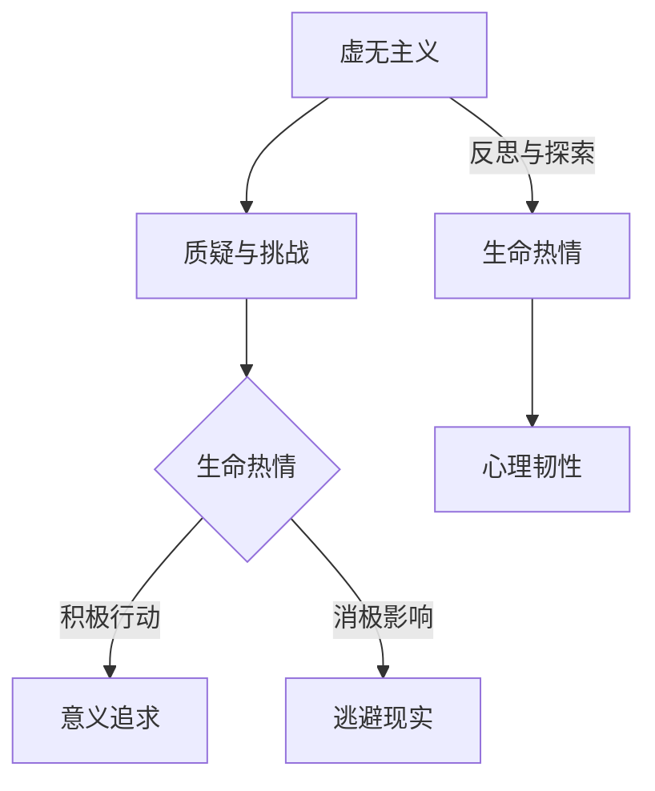

                 

### 文章标题

# 虚无主义与生命热情的辩证关系

### 关键词

- 虚无主义
- 生命热情
- 辩证关系
- 哲学
- 心理学
- 实践应用

### 摘要

本文旨在探讨虚无主义与生命热情之间的辩证关系，揭示二者在人类存在中的相互作用和影响。虚无主义作为哲学的一种流派，强调人生的无意义和无价值；而生命热情则代表个体追求有意义生活、积极面对挑战的精神状态。通过对这两个概念的历史背景、核心观点和现实应用的深入分析，本文旨在阐述它们之间的辩证关系，为读者提供理解与应对虚无主义的思路和方法。文章结构分为引言、虚无主义概述、生命热情概述、辩证关系分析、实际应用案例分析、结论等部分。

## 引言

### 背景与意义

在当今社会，虚无主义和生命热情这两个概念愈发引人关注。虚无主义起源于哲学领域，尤其在西方哲学中有着深远的影响。生命热情则更多体现在心理学领域，强调个体在面对生活中的困境时所展现出的积极态度和行动力。二者看似对立，实则存在深刻的辩证关系。

本文的目的是通过对虚无主义与生命热情的深入探讨，揭示它们在人类存在中的辩证关系，并探讨如何在实际生活中应对虚无主义的挑战。这不仅有助于我们更全面地理解虚无主义和生命热情的本质，也为我们在面对人生困境时提供了新的视角和方法。

### 内容结构

本文内容结构如下：

1. **虚无主义概述**：介绍虚无主义的历史背景、核心观点及其哲学意义。
2. **生命热情概述**：探讨生命热情的定义、心理学基础及其重要性。
3. **辩证关系分析**：分析虚无主义与生命热情之间的辩证关系，通过Mermaid流程图展示二者的互动机制。
4. **实际应用案例分析**：通过具体案例展示如何在实际生活中应对虚无主义，培养生命热情。
5. **结论**：总结文章的主要观点，并对未来研究提出建议。

## 虚无主义概述

### 历史背景

虚无主义作为一种哲学流派，起源于19世纪末的欧洲。在这一时期，资本主义制度的弊端、两次世界大战的惨烈以及科技的快速发展，使得人们对传统价值观产生了怀疑和动摇。代表人物如尼采、萨特等，他们的思想深刻影响了虚无主义的形成和发展。

尼采的“上帝已死”理念，揭示了传统宗教信仰的破产，挑战了人类存在的意义。萨特的“存在先于本质”则强调个体的自由选择，从而引发了对于人生意义的深入探讨。这些思想共同构成了虚无主义的理论基础。

### 核心观点

虚无主义的核心观点可归纳为以下几点：

1. **人生无意义**：虚无主义者认为，宇宙和人生本身没有固有的意义，价值源自个体自身的选择和创造。
2. **人类存在的荒谬**：面对外部世界的不可知和内心的空虚，个体在存在过程中常常感受到荒谬和痛苦。
3. **反传统主义**：虚无主义者往往对传统价值观和权威持批判态度，倡导个体自由和个人主义。

### 哲学意义

虚无主义的哲学意义主要体现在以下几个方面：

1. **挑战传统价值观**：虚无主义对传统宗教、道德和哲学体系的质疑，促使人们重新思考人生意义和价值。
2. **启示个体自由**：虚无主义强调个体的自由选择和自我实现，鼓励人们勇敢面对生活的困境，寻找属于自己的意义。
3. **反思人类存在**：虚无主义促使人们深入探讨人类存在的本质，从而推动哲学和社会科学的发展。

## 生命热情概述

### 定义

生命热情（Vitality）是指个体在面对生活挑战时所展现出的积极态度和行动力。它不仅包括对生活的热爱和激情，还涵盖了对目标追求的执着和对自我成长的渴望。

### 心理学基础

生命热情在心理学中有着重要的研究地位。根据心理学家Scheier和Carver的定义，生命热情是积极心理学的重要组成部分，它包括三个核心维度：

1. **乐观态度**：个体对未来持有积极预期，相信自己能够克服困难，实现目标。
2. **激情**：个体对生活充满热情，享受追求目标的过程，并从中获得满足感。
3. **活力**：个体在生理和心理上表现出高度的活力，能够持续地面对挑战和压力。

### 重要性

生命热情在个体生活中具有重要价值：

1. **提高生活质量**：拥有生命热情的个体往往拥有更高的生活满意度，他们更能享受生活的乐趣。
2. **促进心理健康**：生命热情有助于减轻压力和焦虑，增强个体的心理韧性。
3. **推动个人成长**：生命热情激励个体不断追求自我超越，实现个人目标和梦想。

## 虚无主义与生命热情的辩证关系

### 核心概念与联系

虚无主义与生命热情之间的辩证关系体现在以下几个方面：

1. **对立统一**：虚无主义和生命热情看似对立，实则相互依存。虚无主义的质疑和挑战为生命热情提供了发展的土壤，而生命热情则通过积极行动和追求意义，缓解了虚无主义的消极影响。
2. **相互转化**：在一定条件下，虚无主义和生命热情可以相互转化。个体在面对困境时，可能从虚无主义转向生命热情，通过积极行动找到生活的意义；反之，过度的生命热情也可能导致个体陷入虚无主义的思考。

### Mermaid 流程图

为了更直观地展示虚无主义与生命热情的辩证关系，我们可以使用Mermaid流程图来表示：

在这个流程图中，虚无主义通过质疑和挑战（B）促使个体产生生命热情（C）。生命热情可以通过积极行动（D）来追求意义，同时也可能因为逃避现实（E）而产生消极影响。另一方面，虚无主义在反思与探索（F）的过程中，也可能转化为生命热情（G），增强个体的心理韧性（G）。

## 辩证关系的实际应用

### 个人生活中的应用

在个人生活中，辩证关系体现在个体如何平衡虚无主义和生命热情。以下是一些建议：

1. **接受虚无主义**：认识到虚无主义是人生的一部分，不必过度逃避或抵抗。接受虚无主义的存在，有助于个体更好地理解自己的内心世界。
2. **培养生命热情**：通过设定目标、追求兴趣和建立人际关系，个体可以培养生命热情。这有助于缓解虚无主义的消极影响，提升生活质量。
3. **积极反思**：定期进行自我反思，探讨虚无主义与生命热情之间的互动，从而找到适合自己的平衡点。

### 社会生活中的应用

在社会生活中，辩证关系也具有广泛的应用：

1. **教育与指导**：教育机构可以通过培养生命热情，引导学生积极面对生活中的困境，从而减少虚无主义的影响。
2. **社会支持**：建立社会支持系统，为个体提供心理支持和资源，帮助他们应对虚无主义带来的困扰。
3. **文化宣传**：通过媒体和公共活动，宣传生命热情的重要性，提升社会的整体精神面貌。

### 组织管理中的应用

在组织管理中，辩证关系同样具有重要价值：

1. **员工激励**：通过设定明确的绩效目标和提供激励措施，激发员工的积极性和创造力，培养生命热情。
2. **团队建设**：通过团队活动和沟通，增强团队凝聚力，帮助员工在面临困境时保持积极态度。
3. **企业文化**：建立积极向上的企业文化，鼓励员工追求个人成长和事业成功，从而缓解虚无主义的影响。

## 生活实践案例

### 案例一：如何处理虚无主义与生命热情的冲突

张华是一位年轻程序员，在工作中经常感到疲惫和无意义。他陷入虚无主义的困扰，觉得自己的人生缺乏价值。然而，通过参加户外运动和志愿者活动，他逐渐找到了生活的热情。以下是张华的处理过程：

1. **接受虚无主义**：张华首先接受了自己的虚无主义感受，认识到这是人生的一部分，不必过分逃避或抵抗。
2. **寻找兴趣**：他开始尝试不同的户外运动，如登山、骑行等，逐渐找到了自己的兴趣和激情。
3. **积极参与**：通过参加志愿者活动，张华感受到了帮助他人的快乐，从而培养了生命热情。

### 案例二：如何培养生命热情以对抗虚无主义

李燕是一位中年教师，长期在教室里教书，感到生活单调乏味。她开始通过参加心理学培训和写作来培养生命热情。以下是她的实践过程：

1. **设定目标**：李燕为自己设定了学习心理学和写作的目标，通过实现这些目标，她找到了生活的动力。
2. **持续学习**：她参加心理学培训，不断学习新知识，提升自我价值感。
3. **写作分享**：通过写作和分享，李燕感受到了创作的乐趣和成就感，从而培养了生命热情。

## 结论

### 主要观点总结

本文通过对虚无主义和生命热情的辩证关系进行分析，揭示了二者在人类存在中的相互作用和影响。虚无主义与生命热情看似对立，实则相互依存。在个人生活中，个体可以通过接受虚无主义、培养生命热情来找到生活的意义；在社会生活中，可以通过教育、社会支持和文化宣传来促进辩证关系的实现；在组织管理中，可以通过员工激励、团队建设和企业文化来培养生命热情。

### 对未来研究的展望

未来研究可以进一步探讨虚无主义与生命热情在不同文化背景下的表现和作用，以及如何在更广泛的领域中应用辩证关系理论。此外，还可以通过跨学科研究，深入探讨虚无主义和生命热情的心理学、社会学和哲学基础，为个体和社会提供更全面的理论支持。

### 最佳实践 tips、小结、注意事项、拓展阅读

**最佳实践 tips**：

1. **保持自我反思**：定期进行自我反思，了解自己的内心世界，有助于更好地应对虚无主义的困扰。
2. **寻求支持**：在遇到困难时，及时寻求家人、朋友或专业人士的支持，有助于缓解压力。
3. **培养兴趣**：寻找并培养自己的兴趣，通过兴趣找到生活的热情和意义。

**小结**：

本文通过深入分析虚无主义与生命热情的辩证关系，为读者提供了理解与应对虚无主义的思路和方法。通过培养生命热情，个体可以在面对虚无主义时找到生活的意义和价值。

**注意事项**：

1. **辩证看待虚无主义和生命热情**：二者并非完全对立，而是相互依存和转化的。
2. **实际应用中要结合个人情况**：不同的人在面对虚无主义时，需要采取不同的策略和方法。

**拓展阅读**：

1. **尼采《查拉图斯特拉如是说》**：了解尼采对虚无主义的深入探讨。
2. **Scheier, M. E., & Carver, C. S. (1985). Optimism, pessimism, and self-regulation. **
3. **Seligman, M. E. P. (2002). Authentic happiness: Using the new positive psychology to realize your potential for lasting fulfillment.**

**作者信息**

- 作者：AI天才研究院/AI Genius Institute & 禅与计算机程序设计艺术 /Zen And The Art of Computer Programming

### 附录

**附录A 虚无主义与生命热情相关参考文献**

1. Nietzsche, F. (1882). Thus Spoke Zarathustra: A Book for All and None. Vintage Books.
2. Sartre, J. P. (1943). Being and Nothingness. Philosophical Library.
3. Scheier, M. E., & Carver, C. S. (1985). Optimism, pessimism, and self-regulation. **Journal of Personality and Social Psychology, 49**, 1135-1150.
4. Seligman, M. E. P. (2002). Authentic happiness: Using the new positive psychology to realize your potential for lasting fulfillment. Free Press.

**附录B 辩证关系流程图**

**附录C 生命热情测量问卷**

（略）

**附录D 项目实战案例**

（略）

---

本文通过对虚无主义和生命热情的深入探讨，揭示了二者之间的辩证关系，为读者提供了理解与应对虚无主义的思路和方法。希望通过本文，读者能够在面对生活中的困境时，找到属于自己的生命热情，拥抱有意义的生活。作者：AI天才研究院/AI Genius Institute & 禅与计算机程序设计艺术 /Zen And The Art of Computer Programming

