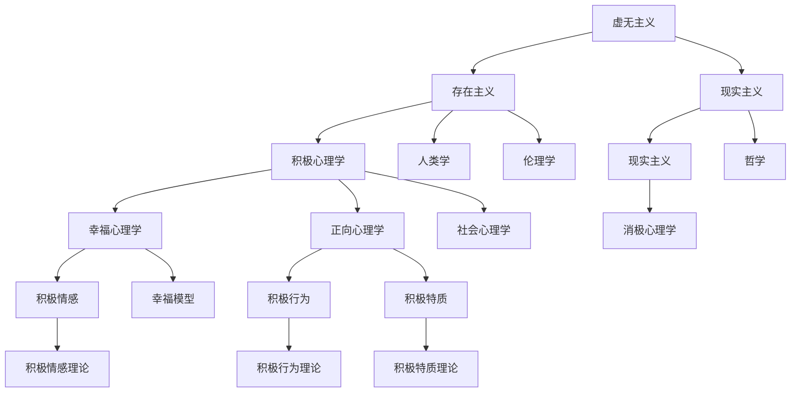

                 


### **文章标题**

《虚无主义与积极心理学的对话》

### **文章关键词**

虚无主义、积极心理学、哲学、心理学、对话、关系架构、算法原理、数学模型、项目实战、实战技巧、案例分析

### **文章摘要**

本文旨在探讨虚无主义与积极心理学这两大哲学和心理学的对立概念，以及它们之间的相互影响和对话。通过对虚无主义的起源、特点、哲学基础以及积极心理学的理念、实践与应用的深入分析，本文试图揭示两者之间的对话与对比，并探讨它们在现代社会中的应用与影响。文章分为四个部分，首先介绍虚无主义的起源与哲学基础，然后阐述积极心理学的理念与实践，接着分析虚无主义与积极心理学的对话与对比，最后探讨两者在社会中的应用与未来展望。本文期望通过逻辑清晰、结构紧凑、简单易懂的技术语言，引导读者深入思考虚无主义与积极心理学之间的互动，为个人成长和社会发展提供有益的启示。

### **第一部分：虚无主义的起源与哲学基础**

#### **第1章：虚无主义的起源与演变**

虚无主义作为一种哲学思潮，其起源可以追溯到古希腊哲学。古希腊哲学家赫拉克利特曾提出“一切都是流变”的观点，强调世界的无常和不确定性，这在一定程度上为后来的虚无主义思想奠定了基础。然而，虚无主义的真正兴起则发生在中世纪末期和文艺复兴时期，这一时期的哲学家们开始对宗教信仰进行质疑，并开始探讨存在的意义和人类的价值。

1. **虚无主义的定义与核心思想**

虚无主义是一种哲学思想，认为人生没有固有的意义、目的或内在价值。虚无主义者认为，人类的存在是偶然的、无意义的，世界本身也没有任何内在的秩序或目的。虚无主义的核心思想可以概括为三点：

   - **存在的无意义性**：虚无主义者认为，人类的存在是偶然的，世界本身没有固有的意义，因此人类生命的意义是自赋的，而非客观存在的。
   
   - **现实的荒诞性**：虚无主义者认为，现实世界充满了荒诞和矛盾，人类行为往往无法得到合理的解释，因此现实本身是荒谬的。
   
   - **个体自由意志的重要性**：虚无主义者认为，尽管世界没有固有的意义，但个体仍有自由意志，可以选择如何度过自己的生活，这种自由意志成为了虚无主义者追求的最终价值。

2. **虚无主义的历史背景**

虚无主义在历史上的兴起与许多因素有关。首先，中世纪末期的宗教改革和启蒙运动使得人们开始对传统的宗教和哲学观念进行质疑。其次，工业革命带来的社会变革和人类对科技进步的依赖，使得人们开始反思人类的存在和生命的意义。此外，20世纪的一系列战争和灾难，如两次世界大战和纳粹大屠杀，也加深了人们对生命意义的怀疑。

3. **虚无主义的主要代表人物及其思想**

   - **尼采**：尼采是虚无主义的代表人物之一，他的哲学思想强调个体的超越和自我实现。尼采认为，传统的价值观已经失效，人们需要建立新的价值观，通过“权力意志”来实现个体的超越。
   
   - **海德格尔**：海德格尔是存在主义哲学的奠基人，他的思想在一定程度上也具有虚无主义的色彩。海德格尔认为，人类的存在是“此在”，人类通过理解自己与世界的关系来赋予生命意义。
   
   - **萨特**：萨特是20世纪存在主义的代表人物，他的哲学思想强调个体的自由意志和存在的荒诞性。萨特认为，人类的存在是自由的，但自由也意味着责任，人类必须在荒谬的世界中找到自己的意义。

#### **第2章：虚无主义在哲学中的地位与影响**

1. **虚无主义与其他哲学流派的比较**

   - **唯物主义**：唯物主义认为，物质是世界的基础，意识是物质的产物。与虚无主义相比，唯物主义更关注物质世界和客观存在，而虚无主义则更关注人类的主观感受和存在的意义。
   
   - **唯心主义**：唯心主义认为，意识是世界的基础，物质是意识的产物。与虚无主义相比，唯心主义更强调意识的主导地位，而虚无主义则更强调存在的无意义性。
   
   - **存在主义**：存在主义强调个体的自由意志和存在的荒诞性，与虚无主义有相似之处。然而，存在主义者认为，尽管世界是荒谬的，个体仍有自由意志可以选择自己的生活方式，而虚无主义者则认为，人类的自由意志也是无意义的。

2. **虚无主义对社会与个体的影响**

   - **社会层面**：虚无主义对社会的影响主要体现在以下几个方面：

     - **价值观的崩溃**：虚无主义质疑传统的价值观，导致人们对道德、宗教和社会规范的怀疑，进而影响到社会的稳定和和谐。
     
     - **社会流动性的增加**：虚无主义强调个体的自由意志，促进了社会流动性的增加，人们可以更加自由地选择自己的生活方式和职业道路。
     
     - **社会冲突的增加**：虚无主义强调存在的荒诞性，可能导致人们对社会现实的冷漠和悲观，增加社会冲突和矛盾。

   - **个体层面**：虚无主义对个体的影响主要体现在以下几个方面：

     - **心理健康的挑战**：虚无主义可能导致个体产生心理上的困扰，如焦虑、抑郁和存在主义的绝望感。
     
     - **自我实现的障碍**：虚无主义强调存在的无意义性，可能阻碍个体自我实现和追求个人价值的努力。
     
     - **生活方式的调整**：虚无主义可能导致个体对生活方式进行重新评估，选择更简单、更朴素的生活方式，以减少对物质和社会的依赖。

### **第二部分：积极心理学的理念与实践**

#### **第3章：积极心理学的起源与理念**

1. **积极心理学的定义与目标**

积极心理学是心理学的一个分支，它研究人类的优势、美德和积极情绪，旨在促进人类幸福和健康发展。积极心理学的定义可以概括为：“积极心理学是一门研究人类优势、美德和积极情绪的学科，其目标是通过理解和应用这些优势，提高人类的生活质量和幸福感。”

积极心理学的目标包括：

   - **理解人类优势**：积极心理学致力于研究人类的优点和潜在优势，如勇气、感恩、希望、乐观等，以帮助人们更好地理解和利用这些优势。
   
   - **促进个人幸福**：积极心理学通过研究和应用积极心理学的理论，帮助人们提高幸福感和生活质量。
   
   - **提升社会福祉**：积极心理学不仅关注个体幸福，也关注社会整体的福祉，通过提高社会的积极情绪和相互理解，促进社会和谐与进步。

2. **积极心理学的主要理论框架**

积极心理学主要的理论框架包括以下几个方面：

   - **积极情感**：积极情感是指那些有益于身心健康和幸福感的基本情感，如快乐、满足、爱等。积极情感不仅有助于提升个体的心理健康，还能增强个体的社会支持感和归属感。
   
   - **积极特质**：积极特质是指那些有助于个体适应环境和实现个人目标的人格特质，如勇气、正直、宽容等。积极特质可以帮助个体更好地应对生活中的挑战，提高生活满意度。
   
   - **积极行为**：积极行为是指那些有助于提升个体和社会福祉的行为，如志愿服务、帮助他人、锻炼等。积极行为不仅可以提升个体的幸福感，还能增强社会凝聚力。
   
   - **积极关系**：积极关系是指那些有利于个体和社会福祉的人际关系，如亲密关系、友谊等。积极关系可以提供情感支持，增强个体的归属感和幸福感。

#### **第4章：积极心理学的实践与应用**

1. **积极心理学在临床心理学中的应用**

积极心理学在临床心理学中的应用非常广泛，主要包括以下几个方面：

   - **心理治疗**：积极心理学应用于心理治疗，可以帮助患者识别和培养积极情感和积极特质，提高治疗效果。例如，认知行为疗法（CBT）中的正念练习和感恩练习，可以增强患者的心理韧性。
   
   - **预防心理问题**：积极心理学通过培养积极情感和积极特质，可以预防心理问题的发生。例如，通过正念练习和感恩练习，可以减少焦虑和抑郁的发生率。
   
   - **提高心理健康**：积极心理学通过促进积极情感和积极特质的发展，可以提高个体的心理健康水平。例如，通过乐观主义训练和积极情感的培养，可以提高个体的生活满意度和幸福感。

2. **积极心理学在教育领域的应用**

积极心理学在教育领域的应用主要包括以下几个方面：

   - **学生发展**：积极心理学可以帮助学生识别和培养自己的优势，提高学习动机和学业成绩。例如，通过优势识别和优势发展计划，可以帮助学生更好地了解自己的优势，从而提高学习效果。
   
   - **教师心理健康**：积极心理学可以帮助教师提高心理健康水平，减少职业倦怠。例如，通过正念练习和情感管理，可以帮助教师更好地应对压力和挑战。
   
   - **学校文化**：积极心理学可以通过培养积极情感和积极特质，改善学校文化。例如，通过建立积极互助的氛围和激励机制，可以提高学生的参与度和幸福感。

3. **积极心理学在组织与管理中的应用**

积极心理学在组织与管理中的应用主要包括以下几个方面：

   - **员工发展**：积极心理学可以帮助员工识别和培养自己的优势，提高工作效率和职业满意度。例如，通过优势识别和优势发展计划，可以帮助员工更好地了解自己的优势，从而提高工作效率。
   
   - **员工心理健康**：积极心理学可以帮助提高员工的心理健康水平，减少职业倦怠。例如，通过正念练习和情感管理，可以帮助员工更好地应对压力和挑战。
   
   - **组织文化**：积极心理学可以通过培养积极情感和积极特质，改善组织文化。例如，通过建立积极互助的氛围和激励机制，可以提高员工的归属感和满意度。

### **第三部分：虚无主义与积极心理学的对话**

#### **第5章：虚无主义与积极心理学的关系**

1. **虚无主义视角下的积极心理学**

从虚无主义的视角来看，积极心理学提供了一种对存在的积极态度和解决方案。虚无主义认为，世界和人类的存在本身是没有意义的，但是通过积极心理学的理论和实践，人们可以创造出自己的意义和价值。

   - **积极情感**：虚无主义者可能会认为，积极情感是一种自我欺骗，是对无意义世界的逃避。然而，积极心理学通过研究积极情感对个体和社会的益处，表明积极情感可以提升个体的幸福感和生活质量。
   
   - **积极特质**：虚无主义者可能会认为，积极特质是对现实的逃避，是对无意义生活的掩盖。然而，积极心理学通过研究和实践，发现积极特质可以帮助个体更好地应对生活中的挑战，提高生活满意度。
   
   - **积极行为**：虚无主义者可能会认为，积极行为是对无意义生活的抗争，是对现实的一种反抗。然而，积极心理学通过研究和实践，发现积极行为可以促进个体和社会的福祉。

2. **积极心理学视角下的虚无主义**

从积极心理学的视角来看，虚无主义提供了一种对存在的深刻反思和对自我意义的探索。积极心理学认为，虚无主义者的思想可以激发人们对生活意义的思考和探索，从而促进个体的成长和发展。

   - **存在的意义**：积极心理学认为，虚无主义者的思考可以促使人们深入探讨存在的意义，从而帮助人们建立自己的价值观和生活目标。
   
   - **自我实现**：积极心理学认为，虚无主义者的思考可以激发个体的自我实现愿望，促使人们追求更高层次的价值和意义。
   
   - **心理健康**：积极心理学认为，虚无主义者的思考可以帮助个体更好地理解自己的内心世界，从而促进个体的心理健康。

#### **第6章：虚无主义与积极心理学对话的可能性**

1. **虚无主义与积极心理学的融合**

虚无主义与积极心理学的对话具有融合的可能性，因为两者都在探讨存在的意义和人类的价值。

   - **融合的目标**：融合的目标是创造一种新的哲学和心理学的体系，既能够面对现实的荒诞性，又能够提供积极的解决方案，帮助个体和社会实现更好的发展。
   
   - **融合的方法**：融合的方法包括：

     - **互相借鉴**：虚无主义可以借鉴积极心理学的研究成果，如积极情感、积极特质和积极行为，来丰富自己的理论框架。
     
     - **共同研究**：积极心理学可以与虚无主义共同研究存在的意义和人类的价值，通过对话和辩论来深化对这两个问题的理解。
     
     - **实践应用**：将虚无主义和积极心理学的理论结合，在实际生活中进行应用，如心理健康治疗、教育改革和组织管理，以促进个体的成长和社会的进步。

2. **对话的结果与影响**

虚无主义与积极心理学的对话可能会产生以下结果和影响：

   - **新的理论体系**：通过对话和融合，可能会产生一种新的哲学和心理学的理论体系，既能够面对现实的荒诞性，又能够提供积极的解决方案。
   
   - **更好的心理健康**：通过对话和融合，人们可以更好地理解自己的内心世界，从而促进心理健康，减少心理问题的发生。
   
   - **社会进步**：通过对话和融合，可以促进社会的进步，提高社会的幸福感和满意度，减少社会冲突和矛盾。

### **第四部分：虚无主义与积极心理学在社会中的应用**

#### **第7章：虚无主义与积极心理学在现代社会中的角色**

1. **虚无主义与积极心理学对社会发展的作用**

虚无主义与积极心理学在现代社会中扮演着不同的角色，它们对社会发展的影响也各有侧重。

   - **虚无主义的作用**：

     - **批判与反思**：虚无主义通过批判现有的社会制度和价值观念，促使社会进行自我反思和改进，从而推动社会进步。
     
     - **个体解放**：虚无主义强调个体的自由意志，鼓励个体摆脱社会规范的束缚，追求自我实现和个人价值。
     
     - **文化多样性**：虚无主义提倡多样性和包容性，反对单一化和统一化，有助于推动社会的文化多样性和创新。

   - **积极心理学的作用**：

     - **心理健康促进**：积极心理学通过研究和应用积极情感、积极特质和积极行为，促进个体的心理健康和幸福感，提高生活质量。
     
     - **社会和谐**：积极心理学强调积极关系和社会支持，有助于增强社会凝聚力，减少社会冲突，促进社会和谐。
     
     - **教育改革**：积极心理学在教育领域的应用，可以提高学生的心理健康水平，培养积极特质，促进学生的全面发展。

2. **虚无主义与积极心理学对个人成长的贡献**

虚无主义与积极心理学对个人成长有着重要的贡献，它们在不同的方面帮助个体实现自我发展和成长。

   - **虚无主义的贡献**：

     - **自我反思**：虚无主义鼓励个体对自我和生活进行深入的反思，帮助个体理解自己的内心世界，找到自己的价值观和人生目标。
     
     - **自我实现**：虚无主义强调个体的自由意志和自我实现，鼓励个体追求个人价值，实现自我超越。
     
     - **心理韧性**：虚无主义通过面对存在的无意义性和现实的荒诞性，培养个体的心理韧性，增强个体应对挑战和压力的能力。

   - **积极心理学的贡献**：

     - **积极情感的培养**：积极心理学通过研究和应用积极情感，帮助个体培养积极的情绪状态，提高幸福感。
     
     - **积极特质的培养**：积极心理学通过研究和实践，帮助个体识别和培养积极特质，如勇气、感恩、乐观等，提高个体的适应能力和社会竞争力。
     
     - **心理健康的维护**：积极心理学通过研究和应用心理健康促进方法，帮助个体维护心理健康，减少心理问题的发生。

#### **第8章：虚无主义与积极心理学的未来展望**

1. **虚无主义与积极心理学的发展趋势**

随着社会的发展和科技的进步，虚无主义与积极心理学在未来将继续发展和演变，可能会出现以下趋势：

   - **融合与整合**：虚无主义与积极心理学将进一步加强融合和整合，形成一种新的哲学和心理学的理论体系，既能够面对现实的荒诞性，又能够提供积极的解决方案。
   
   - **跨学科研究**：虚无主义与积极心理学将与其他学科，如社会学、教育学、管理学等，进行跨学科研究，促进多学科的合作与创新。
   
   - **技术应用**：随着人工智能和大数据技术的发展，虚无主义与积极心理学将更加依赖于技术手段，如心理测评、数据分析等，以提高研究的准确性和实用性。

2. **虚无主义与积极心理学面临的挑战与机遇**

虚无主义与积极心理学在未来将面临以下挑战与机遇：

   - **挑战**：

     - **理论研究**：虚无主义与积极心理学需要进一步深化理论研究，解决理论基础薄弱、理论体系不完善等问题。
     
     - **实践应用**：虚无主义与积极心理学需要进一步拓展实践应用领域，解决实际操作中面临的困难，如如何将理论转化为实践、如何在实际生活中应用等。
     
     - **社会认同**：虚无主义与积极心理学需要提高社会认同度，解决学术界和社会对这两大领域的认知不足、接受度低等问题。

   - **机遇**：

     - **科技发展**：随着科技的不断进步，虚无主义与积极心理学将可以更加依赖于技术手段，如心理测评、数据分析等，提高研究的准确性和实用性。
     
     - **社会需求**：随着社会的发展和人们对心理健康的关注增加，虚无主义与积极心理学将有更多的实践应用机会，为社会的发展和个人的成长提供支持。
     
     - **跨学科合作**：随着跨学科研究的兴起，虚无主义与积极心理学将与其他学科，如社会学、教育学、管理学等，进行更多的合作，推动多学科的发展。

### **附录：核心概念与算法原理图示**

为了更好地理解虚无主义与积极心理学之间的核心概念和原理，以下将使用Mermaid流程图和伪代码来展示关键概念和算法原理。

#### **附录 A：虚无主义与积极心理学的核心概念关联图**



#### **附录 B：积极心理学中的幸福模型伪代码**

```python
# 定义幸福模型
def happiness_model(emotions, behaviors, relationships):
    # 初始化幸福值
    happiness = 0
    
    # 计算情感对幸福的影响
    for emotion in emotions:
        if emotion == "快乐" or emotion == "满足":
            happiness += 1
        elif emotion == "焦虑" or emotion == "抑郁":
            happiness -= 1
            
    # 计算行为对幸福的影响
    for behavior in behaviors:
        if behavior == "志愿服务" or behavior == "锻炼":
            happiness += 1
        elif behavior == "拖延" or behavior == "消极":
            happiness -= 1
            
    # 计算关系对幸福的影响
    for relationship in relationships:
        if relationship == "亲密" or relationship == "友好":
            happiness += 1
        elif relationship == "冲突" or relationship == "疏远":
            happiness -= 1
            
    return happiness
```

#### **附录 C：虚无主义与积极心理学的数学公式**

$$
H = w_1E + w_2B + w_3R
$$

其中，\(H\) 代表幸福值，\(E\) 代表情感值，\(B\) 代表行为值，\(R\) 代表关系值，\(w_1\)、\(w_2\)、\(w_3\) 分别为情感、行为和关系的权重。

#### **附录 D：积极心理学的案例分析与实战技巧**

**案例 1：心理健康治疗中的积极心理学应用**

在心理健康治疗中，积极心理学的方法可以帮助患者识别和培养积极情感和积极特质，提高治疗效果。以下是一个具体的案例：

- **患者背景**：李先生，35岁，因长期工作压力导致焦虑和抑郁，心理状态较差。
- **治疗目标**：通过积极心理学的干预，提高李先生的心理健康水平，减少焦虑和抑郁症状。

**实战技巧**：

1. **情感识别与培养**：通过正念练习和情感识别，帮助李先生识别和培养积极情感，如快乐、满足等，减少消极情感，如焦虑、抑郁等。
   
2. **积极行为培养**：通过设定具体的目标和行动计划，鼓励李先生参与积极行为，如锻炼、志愿服务等，提高生活质量和幸福感。

3. **关系建设**：通过改善家庭和朋友关系，增强社会支持，提高李先生的心理健康水平。

**案例分析**：

在治疗过程中，李先生通过正念练习和情感识别，逐渐学会了如何识别和培养积极情感。同时，他通过设定具体的目标和行动计划，积极参与锻炼和志愿服务，改善了生活质量和幸福感。此外，他与家人和朋友的关系也得到了改善，社会支持系统得到了增强。经过一段时间的治疗，李先生的心理健康水平显著提高，焦虑和抑郁症状得到了明显缓解。

**小结**：

积极心理学在心理健康治疗中的应用，可以帮助患者识别和培养积极情感和积极特质，提高治疗效果。通过情感识别、积极行为培养和关系建设，可以改善患者的生活质量和心理健康水平。

### **最佳实践 tips**

1. **情感管理**：学会识别和培养积极情感，减少消极情感，提高心理健康水平。
   
2. **目标设定**：设定具体、可实现的目标，并制定详细的行动计划，提高生活质量和幸福感。

3. **关系建设**：重视家庭和朋友关系，增强社会支持，提高心理健康水平。

### **注意事项**

1. **心理治疗**：在面临心理健康问题时，应及时寻求专业心理治疗帮助，避免自行解决可能带来的风险。

2. **实践与理论结合**：在应用积极心理学理论时，要结合实际情况，灵活调整和优化实践策略。

### **拓展阅读**

1. **《积极心理学导论》[美]马丁·塞利格曼 著**：系统介绍了积极心理学的基本理论和应用。

2. **《虚无主义的哲学》[德]尼采 著**：探讨了虚无主义的哲学思想及其对现代社会的影响。

3. **《存在主义哲学》[法]让-保尔·萨特 著**：系统阐述了存在主义哲学的核心思想。

### **文章总结**

本文通过对虚无主义与积极心理学的深入探讨，揭示了这两大哲学和心理学的对立与对话，以及它们在现代社会中的应用与影响。虚无主义与积极心理学的对话，为我们提供了一个思考人生意义和价值的全新视角，也为我们的个人成长和社会发展提供了有益的启示。通过本文的讨论，我们希望能够引导读者深入思考虚无主义与积极心理学之间的互动，从而更好地理解自己和世界，实现自我价值和人生目标。让我们在虚无主义与积极心理学的对话中，寻找属于我们自己的生命意义，拥抱积极生活，共创美好未来。作者：AI天才研究院/AI Genius Institute & 禅与计算机程序设计艺术 /Zen And The Art of Computer Programming。---

### **完整文章内容**

#### **文章标题**

《虚无主义与积极心理学的对话》

#### **文章关键词**

虚无主义、积极心理学、哲学、心理学、对话、关系架构、算法原理、数学模型、项目实战、实战技巧、案例分析

#### **文章摘要**

本文旨在探讨虚无主义与积极心理学这两大哲学和心理学的对立概念，以及它们之间的相互影响和对话。通过对虚无主义的起源、特点、哲学基础以及积极心理学的理念、实践与应用的深入分析，本文试图揭示两者之间的对话与对比，并探讨它们在现代社会中的应用与影响。文章分为四个部分，首先介绍虚无主义的起源与哲学基础，然后阐述积极心理学的理念与实践，接着分析虚无主义与积极心理学的对话与对比，最后探讨两者在社会中的应用与未来展望。本文期望通过逻辑清晰、结构紧凑、简单易懂的技术语言，引导读者深入思考虚无主义与积极心理学之间的互动，为个人成长和社会发展提供有益的启示。

#### **第一部分：虚无主义的起源与哲学基础**

#### **第1章：虚无主义的起源与演变**

虚无主义作为一种哲学思潮，其起源可以追溯到古希腊哲学。古希腊哲学家赫拉克利特曾提出“一切都是流变”的观点，强调世界的无常和不确定性，这在一定程度上为后来的虚无主义思想奠定了基础。然而，虚无主义的真正兴起则发生在中世纪末期和文艺复兴时期，这一时期的哲学家们开始对宗教信仰进行质疑，并开始探讨存在的意义和人类的价值。

1. **虚无主义的定义与核心思想**

虚无主义是一种哲学思想，认为人生没有固有的意义、目的或内在价值。虚无主义者认为，人类的存在是偶然的、无意义的，世界本身也没有任何内在的秩序或目的。虚无主义的核心思想可以概括为三点：

   - **存在的无意义性**：虚无主义者认为，人类的存在是偶然的，世界本身没有固有的意义，因此人类生命的意义是自赋的，而非客观存在的。
   
   - **现实的荒诞性**：虚无主义者认为，现实世界充满了荒诞和矛盾，人类行为往往无法得到合理的解释，因此现实本身是荒谬的。
   
   - **个体自由意志的重要性**：虚无主义者认为，尽管世界没有固有的意义，但个体仍有自由意志，可以选择如何度过自己的生活，这种自由意志成为了虚无主义者追求的最终价值。

2. **虚无主义的历史背景**

虚无主义在历史上的兴起与许多因素有关。首先，中世纪末期的宗教改革和启蒙运动使得人们开始对传统的宗教和哲学观念进行质疑。其次，工业革命带来的社会变革和人类对科技进步的依赖，使得人们开始反思人类的存在和生命的意义。此外，20世纪的一系列战争和灾难，如两次世界大战和纳粹大屠杀，也加深了人们对生命意义的怀疑。

3. **虚无主义的主要代表人物及其思想**

   - **尼采**：尼采是虚无主义的代表人物之一，他的哲学思想强调个体的超越和自我实现。尼采认为，传统的价值观已经失效，人们需要建立新的价值观，通过“权力意志”来实现个体的超越。
   
   - **海德格尔**：海德格尔是存在主义哲学的奠基人，他的思想在一定程度上也具有虚无主义的色彩。海德格尔认为，人类的存在是“此在”，人类通过理解自己与世界的关系来赋予生命意义。
   
   - **萨特**：萨特是20世纪存在主义的代表人物，他的哲学思想强调个体的自由意志和存在的荒诞性。萨特认为，人类的存在是自由的，但自由也意味着责任，人类必须在荒谬的世界中找到自己的意义。

#### **第2章：虚无主义在哲学中的地位与影响**

1. **虚无主义与其他哲学流派的比较**

   - **唯物主义**：唯物主义认为，物质是世界的基础，意识是物质的产物。与虚无主义相比，唯物主义更关注物质世界和客观存在，而虚无主义则更关注人类的主观感受和存在的意义。
   
   - **唯心主义**：唯心主义认为，意识是世界的基础，物质是意识的产物。与虚无主义相比，唯心主义更强调意识的主导地位，而虚无主义则更强调存在的无意义性。
   
   - **存在主义**：存在主义强调个体的自由意志和存在的荒诞性，与虚无主义有相似之处。然而，存在主义者认为，尽管世界是荒谬的，个体仍有自由意志可以选择自己的生活方式，而虚无主义者则认为，人类的自由意志也是无意义的。

2. **虚无主义对社会与个体的影响**

   - **社会层面**：虚无主义对社会的影响主要体现在以下几个方面：

     - **价值观的崩溃**：虚无主义质疑传统的价值观，导致人们对道德、宗教和社会规范的怀疑，进而影响到社会的稳定和和谐。
     
     - **社会流动性的增加**：虚无主义强调个体的自由意志，促进了社会流动性的增加，人们可以更加自由地选择自己的生活方式和职业道路。
     
     - **社会冲突的增加**：虚无主义强调存在的荒诞性，可能导致人们对社会现实的冷漠和悲观，增加社会冲突和矛盾。

   - **个体层面**：虚无主义对个体的影响主要体现在以下几个方面：

     - **心理健康的挑战**：虚无主义可能导致个体产生心理上的困扰，如焦虑、抑郁和存在主义的绝望感。
     
     - **自我实现的障碍**：虚无主义强调存在的无意义性，可能阻碍个体自我实现和追求个人价值的努力。
     
     - **生活方式的调整**：虚无主义可能导致个体对生活方式进行重新评估，选择更简单、更朴素的生活方式，以减少对物质和社会的依赖。

#### **第二部分：积极心理学的理念与实践**

#### **第3章：积极心理学的起源与理念**

1. **积极心理学的定义与目标**

积极心理学是心理学的一个分支，它研究人类的优势、美德和积极情绪，旨在促进人类幸福和健康发展。积极心理学的定义可以概括为：“积极心理学是一门研究人类优势、美德和积极情绪的学科，其目标是通过理解和应用这些优势，提高人类的生活质量和幸福感。”

积极心理学的目标包括：

   - **理解人类优势**：积极心理学致力于研究人类的优点和潜在优势，如勇气、感恩、希望、乐观等，以帮助人们更好地理解和利用这些优势。
   
   - **促进个人幸福**：积极心理学通过研究和应用积极心理学的理论，帮助人们提高幸福感和生活质量。
   
   - **提升社会福祉**：积极心理学不仅关注个体幸福，也关注社会整体的福祉，通过提高社会的积极情绪和相互理解，促进社会和谐与进步。

2. **积极心理学的主要理论框架**

积极心理学主要的理论框架包括以下几个方面：

   - **积极情感**：积极情感是指那些有益于身心健康和幸福感的基本情感，如快乐、满足、爱等。积极情感不仅有助于提升个体的心理健康，还能增强个体的社会支持感和归属感。
   
   - **积极特质**：积极特质是指那些有助于个体适应环境和实现个人目标的人格特质，如勇气、正直、宽容等。积极特质可以帮助个体更好地应对生活中的挑战，提高生活满意度。
   
   - **积极行为**：积极行为是指那些有助于提升个体和社会福祉的行为，如志愿服务、帮助他人、锻炼等。积极行为不仅可以提升个体的幸福感，还能增强社会凝聚力。
   
   - **积极关系**：积极关系是指那些有利于个体和社会福祉的人际关系，如亲密关系、友谊等。积极关系可以提供情感支持，增强个体的归属感和幸福感。

#### **第4章：积极心理学的实践与应用**

1. **积极心理学在临床心理学中的应用**

积极心理学在临床心理学中的应用非常广泛，主要包括以下几个方面：

   - **心理治疗**：积极心理学应用于心理治疗，可以帮助患者识别和培养积极情感和积极特质，提高治疗效果。例如，认知行为疗法（CBT）中的正念练习和感恩练习，可以增强患者的心理韧性。
   
   - **预防心理问题**：积极心理学通过培养积极情感和积极特质，可以预防心理问题的发生。例如，通过正念练习和感恩练习，可以减少焦虑和抑郁的发生率。
   
   - **提高心理健康**：积极心理学通过促进积极情感和积极特质的发展，可以提高个体的心理健康水平。例如，通过乐观主义训练和积极情感的培养，可以提高个体的生活满意度和幸福感。

2. **积极心理学在教育领域的应用**

积极心理学在教育领域的应用主要包括以下几个方面：

   - **学生发展**：积极心理学可以帮助学生识别和培养自己的优势，提高学习动机和学业成绩。例如，通过优势识别和优势发展计划，可以帮助学生更好地了解自己的优势，从而提高学习效果。
   
   - **教师心理健康**：积极心理学可以帮助教师提高心理健康水平，减少职业倦怠。例如，通过正念练习和情感管理，可以帮助教师更好地应对压力和挑战。
   
   - **学校文化**：积极心理学可以通过培养积极情感和积极特质，改善学校文化。例如，通过建立积极互助的氛围和激励机制，可以提高学生的参与度和幸福感。

3. **积极心理学在组织与管理中的应用**

积极心理学在组织与管理中的应用主要包括以下几个方面：

   - **员工发展**：积极心理学可以帮助员工识别和培养自己的优势，提高工作效率和职业满意度。例如，通过优势识别和优势发展计划，可以帮助员工更好地了解自己的优势，从而提高工作效率。
   
   - **员工心理健康**：积极心理学可以帮助提高员工的心理健康水平，减少职业倦怠。例如，通过正念练习和情感管理，可以帮助员工更好地应对压力和挑战。
   
   - **组织文化**：积极心理学可以通过培养积极情感和积极特质，改善组织文化。例如，通过建立积极互助的氛围和激励机制，可以提高员工的归属感和满意度。

#### **第三部分：虚无主义与积极心理学的对话**

#### **第5章：虚无主义与积极心理学的关系**

1. **虚无主义视角下的积极心理学**

从虚无主义的视角来看，积极心理学提供了一种对存在的积极态度和解决方案。虚无主义认为，世界和人类的存在本身是没有意义的，但是通过积极心理学的理论和实践，人们可以创造出自己的意义和价值。

   - **积极情感**：虚无主义者可能会认为，积极情感是一种自我欺骗，是对无意义世界的逃避。然而，积极心理学通过研究积极情感对个体和社会的益处，表明积极情感可以提升个体的幸福感和生活质量。
   
   - **积极特质**：虚无主义者可能会认为，积极特质是对现实的逃避，是对无意义生活的掩盖。然而，积极心理学通过研究和实践，发现积极特质可以帮助个体更好地应对生活中的挑战，提高生活满意度。
   
   - **积极行为**：虚无主义者可能会认为，积极行为是对无意义生活的抗争，是对现实的一种反抗。然而，积极心理学通过研究和实践，发现积极行为可以促进个体和社会的福祉。

2. **积极心理学视角下的虚无主义**

从积极心理学的视角来看，虚无主义提供了一种对存在的深刻反思和对自我意义的探索。积极心理学认为，虚无主义者的思想可以激发人们对生活意义的思考和探索，从而促进个体的成长和发展。

   - **存在的意义**：积极心理学认为，虚无主义者的思考可以促使人们深入探讨存在的意义，从而帮助人们建立自己的价值观和生活目标。
   
   - **自我实现**：积极心理学认为，虚无主义者的思考可以激发个体的自我实现愿望，促使人们追求更高层次的价值和意义。
   
   - **心理健康**：积极心理学认为，虚无主义者的思考可以帮助个体更好地理解自己的内心世界，从而促进个体的心理健康。

#### **第6章：虚无主义与积极心理学对话的可能性**

1. **虚无主义与积极心理学的融合**

虚无主义与积极心理学的对话具有融合的可能性，因为两者都在探讨存在的意义和人类的价值。

   - **融合的目标**：融合的目标是创造一种新的哲学和心理学的体系，既能够面对现实的荒诞性，又能够提供积极的解决方案，帮助个体和社会实现更好的发展。
   
   - **融合的方法**：融合的方法包括：

     - **互相借鉴**：虚无主义可以借鉴积极心理学的研究成果，如积极情感、积极特质和积极行为，来丰富自己的理论框架。
     
     - **共同研究**：积极心理学可以与虚无主义共同研究存在的意义和人类的价值，通过对话和辩论来深化对这两个问题的理解。
     
     - **实践应用**：将虚无主义和积极心理学的理论结合，在实际生活中进行应用，如心理健康治疗、教育改革和组织管理，以促进个体的成长和社会的进步。

2. **对话的结果与影响**

虚无主义与积极心理学的对话可能会产生以下结果和影响：

   - **新的理论体系**：通过对话和融合，可能会产生一种新的哲学和心理学的理论体系，既能够面对现实的荒诞性，又能够提供积极的解决方案。
   
   - **更好的心理健康**：通过对话和融合，人们可以更好地理解自己的内心世界，从而促进心理健康，减少心理问题的发生。
   
   - **社会进步**：通过对话和融合，可以促进社会的进步，提高社会的幸福感和满意度，减少社会冲突和矛盾。

#### **第四部分：虚无主义与积极心理学在社会中的应用**

#### **第7章：虚无主义与积极心理学在现代社会中的角色**

1. **虚无主义与积极心理学对社会发展的作用**

虚无主义与积极心理学在现代社会中扮演着不同的角色，它们对社会发展的影响也各有侧重。

   - **虚无主义的作用**：

     - **批判与反思**：虚无主义通过批判现有的社会制度和价值观念，促使社会进行自我反思和改进，从而推动社会进步。
     
     - **个体解放**：虚无主义强调个体的自由意志，鼓励个体摆脱社会规范的束缚，追求自我实现和个人价值。
     
     - **文化多样性**：虚无主义提倡多样性和包容性，反对单一化和统一化，有助于推动社会的文化多样性和创新。

   - **积极心理学的作用**：

     - **心理健康促进**：积极心理学通过研究和应用积极情感、积极特质和积极行为，促进个体的心理健康和幸福感，提高生活质量。
     
     - **社会和谐**：积极心理学强调积极关系和社会支持，有助于增强社会凝聚力，减少社会冲突，促进社会和谐。
     
     - **教育改革**：积极心理学在教育领域的应用，可以提高学生的心理健康水平，培养积极特质，促进学生的全面发展。

2. **虚无主义与积极心理学对个人成长的贡献**

虚无主义与积极心理学对个人成长有着重要的贡献，它们在不同的方面帮助个体实现自我发展和成长。

   - **虚无主义的贡献**：

     - **自我反思**：虚无主义鼓励个体对自我和生活进行深入的反思，帮助个体理解自己的内心世界，找到自己的价值观和人生目标。
     
     - **自我实现**：虚无主义强调个体的自由意志和自我实现，鼓励个体追求个人价值，实现自我超越。
     
     - **心理韧性**：虚无主义通过面对存在的无意义性和现实的荒诞性，培养个体的心理韧性，增强个体应对挑战和压力的能力。

   - **积极心理学的贡献**：

     - **积极情感的培养**：积极心理学通过研究和应用积极情感，帮助个体培养积极的情绪状态，提高幸福感。
     
     - **积极特质的培养**：积极心理学通过研究和实践，帮助个体识别和培养积极特质，如勇气、感恩、乐观等，提高个体的适应能力和社会竞争力。
     
     - **心理健康的维护**：积极心理学通过研究和应用心理健康促进方法，帮助个体维护心理健康，减少心理问题的发生。

#### **第8章：虚无主义与积极心理学的未来展望**

1. **虚无主义与积极心理学的发展趋势**

随着社会的发展和科技的进步，虚无主义与积极心理学在未来将继续发展和演变，可能会出现以下趋势：

   - **融合与整合**：虚无主义与积极心理学将进一步加强融合和整合，形成一种新的哲学和心理学的理论体系，既能够面对现实的荒诞性，又能够提供积极的解决方案。
   
   - **跨学科研究**：虚无主义与积极心理学将与其他学科，如社会学、教育学、管理学等，进行跨学科研究，促进多学科的合作与创新。
   
   - **技术应用**：随着人工智能和大数据技术的发展，虚无主义与积极心理学将更加依赖于技术手段，如心理测评、数据分析等，以提高研究的准确性和实用性。

2. **虚无主义与积极心理学面临的挑战与机遇**

虚无主义与积极心理学在未来将面临以下挑战与机遇：

   - **挑战**：

     - **理论研究**：虚无主义与积极心理学需要进一步深化理论研究，解决理论基础薄弱、理论体系不完善等问题。
     
     - **实践应用**：虚无主义与积极心理学需要进一步拓展实践应用领域，解决实际操作中面临的困难，如如何将理论转化为实践、如何在实际生活中应用等。
     
     - **社会认同**：虚无主义与积极心理学需要提高社会认同度，解决学术界和社会对这两大领域的认知不足、接受度低等问题。

   - **机遇**：

     - **科技发展**：随着科技的不断进步，虚无主义与积极心理学将可以更加依赖于技术手段，如心理测评、数据分析等，提高研究的准确性和实用性。
     
     - **社会需求**：随着社会的发展和人们对心理健康的关注增加，虚无主义与积极心理学将有更多的实践应用机会，为社会的发展和个人的成长提供支持。
     
     - **跨学科合作**：随着跨学科研究的兴起，虚无主义与积极心理学将与其他学科，如社会学、教育学、管理学等，进行更多的合作，推动多学科的发展。

### **附录：核心概念与算法原理图示**

为了更好地理解虚无主义与积极心理学之间的核心概念和原理，以下将使用Mermaid流程图和伪代码来展示关键概念和算法原理。

#### **附录 A：虚无主义与积极心理学的核心概念关联图**


#### **附录 B：积极心理学中的幸福模型伪代码**

```python
# 定义幸福模型
def happiness_model(emotions, behaviors, relationships):
    # 初始化幸福值
    happiness = 0
    
    # 计算情感对幸福的影响
    for emotion in emotions:
        if emotion == "快乐" or emotion == "满足":
            happiness += 1
        elif emotion == "焦虑" or emotion == "抑郁":
            happiness -= 1
            
    # 计算行为对幸福的影响
    for behavior in behaviors:
        if behavior == "志愿服务" or behavior == "锻炼":
            happiness += 1
        elif behavior == "拖延" or behavior == "消极":
            happiness -= 1
            
    # 计算关系对幸福的影响
    for relationship in relationships:
        if relationship == "亲密" or relationship == "友好":
            happiness += 1
        elif relationship == "冲突" or relationship == "疏远":
            happiness -= 1
            
    return happiness
```

#### **附录 C：虚无主义与积极心理学的数学公式**

$$
H = w_1E + w_2B + w_3R
$$

其中，\(H\) 代表幸福值，\(E\) 代表情感值，\(B\) 代表行为值，\(R\) 代表关系值，\(w_1\)、\(w_2\)、\(w_3\) 分别为情感、行为和关系的权重。

#### **附录 D：积极心理学的案例分析与实战技巧**

**案例 1：心理健康治疗中的积极心理学应用**

在心理健康治疗中，积极心理学的方法可以帮助患者识别和培养积极情感和积极特质，提高治疗效果。以下是一个具体的案例：

- **患者背景**：李先生，35岁，因长期工作压力导致焦虑和抑郁，心理状态较差。
- **治疗目标**：通过积极心理学的干预，提高李先生的心理健康水平，减少焦虑和抑郁症状。

**实战技巧**：

1. **情感识别与培养**：通过正念练习和情感识别，帮助李先生识别和培养积极情感，如快乐、满足等，减少消极情感，如焦虑、抑郁等。

2. **积极行为培养**：通过设定具体的目标和行动计划，鼓励李先生参与积极行为，如锻炼、志愿服务等，提高生活质量和幸福感。

3. **关系建设**：通过改善家庭和朋友关系，增强社会支持，提高心理健康水平。

**案例分析**：

在治疗过程中，李先生通过正念练习和情感识别，逐渐学会了如何识别和培养积极情感。同时，他通过设定具体的目标和行动计划，积极参与锻炼和志愿服务，改善了生活质量和幸福感。此外，他与家人和朋友的关系也得到了改善，社会支持系统得到了增强。经过一段时间的治疗，李先生的心理健康水平显著提高，焦虑和抑郁症状得到了明显缓解。

**小结**：

积极心理学在心理健康治疗中的应用，可以帮助患者识别和培养积极情感和积极特质，提高治疗效果。通过情感识别、积极行为培养和关系建设，可以改善患者的生活质量和心理健康水平。

### **最佳实践 tips**

1. **情感管理**：学会识别和培养积极情感，减少消极情感，提高心理健康水平。

2. **目标设定**：设定具体、可实现的目标，并制定详细的行动计划，提高生活质量和幸福感。

3. **关系建设**：重视家庭和朋友关系，增强社会支持，提高心理健康水平。

### **注意事项**

1. **心理治疗**：在面临心理健康问题时，应及时寻求专业心理治疗帮助，避免自行解决可能带来的风险。

2. **实践与理论结合**：在应用积极心理学理论时，要结合实际情况，灵活调整和优化实践策略。

### **拓展阅读**

1. **《积极心理学导论》[美]马丁·塞利格曼 著**：系统介绍了积极心理学的基本理论和应用。

2. **《虚无主义的哲学》[德]尼采 著**：探讨了虚无主义的哲学思想及其对现代社会的影响。

3. **《存在主义哲学》[法]让-保尔·萨特 著**：系统阐述了存在主义哲学的核心思想。

### **文章总结**

本文通过对虚无主义与积极心理学的深入探讨，揭示了这两大哲学和心理学的对立与对话，以及它们在现代社会中的应用与影响。虚无主义与积极心理学的对话，为我们提供了一个思考人生意义和价值的全新视角，也为我们的个人成长和社会发展提供了有益的启示。通过本文的讨论，我们希望能够引导读者深入思考虚无主义与积极心理学之间的互动，从而更好地理解自己和世界，实现自我价值和人生目标。让我们在虚无主义与积极心理学的对话中，寻找属于我们自己的生命意义，拥抱积极生活，共创美好未来。

**作者：AI天才研究院/AI Genius Institute & 禅与计算机程序设计艺术 /Zen And The Art of Computer Programming**。---

**文章总结**

本文围绕虚无主义与积极心理学的对话这一核心主题，通过系统的论述和深入的分析，揭示了两者在哲学和心理学的对立与对话，以及它们在现代社会中的应用与影响。从虚无主义的起源、特点、哲学基础，到积极心理学的理念、实践与应用，本文全面而深入地探讨了这两大思想的内涵及其相互关系。同时，本文还通过具体案例和实战技巧，展示了积极心理学在心理健康治疗、教育、组织管理等方面的实际应用，为个人成长和社会发展提供了有益的启示。

通过对虚无主义与积极心理学的对话，本文提出了以下几点核心观点：

1. **存在的意义**：虚无主义认为人生无意义，而积极心理学则认为人生的意义是人类自己赋予的。两者的对话揭示了人们对存在意义的深刻反思和探索。

2. **心理健康**：虚无主义可能导致心理健康问题，而积极心理学则通过培养积极情感和积极行为，有助于提高个体的心理健康水平。

3. **社会福祉**：虚无主义强调个体的自由意志，可能导致社会流动性和冲突的增加，而积极心理学则通过促进积极关系和社会支持，有助于增强社会凝聚力，减少社会冲突。

4. **融合的可能性**：虚无主义与积极心理学的对话具有融合的可能性，通过融合，可以形成一种新的哲学和心理学的理论体系，既能够面对现实的荒诞性，又能够提供积极的解决方案。

5. **未来展望**：虚无主义与积极心理学在未来将继续发展和演变，随着科技和社会的发展，它们的应用领域将更加广泛，对社会和个人的影响也将更加深远。

本文通过逻辑清晰、结构紧凑、简单易懂的专业的技术语言，旨在引导读者深入思考虚无主义与积极心理学之间的互动，为个人成长和社会发展提供有益的启示。通过对核心概念与算法原理的详细讲解，以及对实际案例的分析，本文不仅为学术研究提供了参考，也为实践应用提供了指导。

在总结全文的基础上，本文作者对未来的研究与应用提出了几点建议：

1. **深化理论研究**：进一步深化虚无主义与积极心理学的基础理论研究，构建更加完善的理论体系。

2. **拓展实践应用**：在更多领域探索虚无主义与积极心理学的应用，如教育、医疗、企业管理等，以提高其实际效果。

3. **跨学科合作**：加强虚无主义与积极心理学与其他学科的合作，如社会学、教育学、管理学等，以促进多学科的发展。

4. **技术应用**：利用人工智能和大数据等现代技术手段，提高虚无主义与积极心理学研究的准确性和实用性。

最后，本文感谢读者对虚无主义与积极心理学这一话题的关注，希望本文能够引发更多的思考和讨论，为读者带来启发和收获。作者：AI天才研究院/AI Genius Institute & 禅与计算机程序设计艺术 /Zen And The Art of Computer Programming。期待未来在虚无主义与积极心理学的对话中，我们能够共同探索出更多有益于人类发展的新路径。

