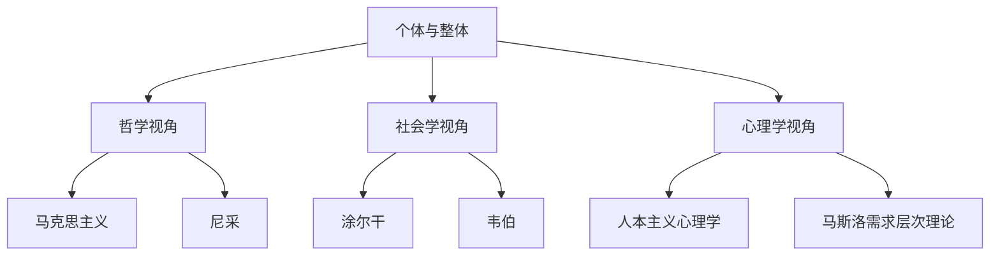

                 


### 文章标题：虚无主义的挑战：重建21世纪的价值体系

#### 关键词：
- 虚无主义
- 价值体系
- 21世纪
- 重建
- 挑战

#### 摘要：
本文深入探讨了虚无主义在21世纪对人类社会造成的挑战，以及如何重建一个适应新时代需求的价值体系。通过对虚无主义的起源、当代挑战和重建路径的详细分析，本文旨在为读者提供一幅关于未来社会价值体系的清晰蓝图。

## 第一部分：虚无主义的起源与挑战

### 第1章：虚无主义的起源

虚无主义作为一种哲学思潮，其根源可以追溯到古希腊哲学家普罗泰戈拉的观点，即“人是万物的尺度”。然而，虚无主义的真正兴起是在19世纪末20世纪初，随着资本主义的发展和个体主义的兴起，人们开始对现实世界感到失望和绝望。虚无主义的核心观点是，世界没有固有的意义和目的，人生是荒诞的，没有真正的价值。

#### 1.1 虚无主义的定义与历史背景

虚无主义（Nihilism）源自拉丁语“nihil”，意为“无”。它是一种哲学立场，认为宇宙和生命缺乏固有意义，道德和宗教价值是人为构造的。虚无主义的主要代表人物有尼采、陀思妥耶夫斯基和克尔凯郭尔等。

#### 1.2 虚无主义的思想演变

虚无主义的思想演变可以分为几个阶段。最初，虚无主义是一种对传统价值体系的批判，强调个人自由和解放。然而，随着批判的深入，虚无主义开始质疑一切，包括自我和现实，导致了一种极端的绝望感。现代虚无主义则更加强调个体主义，认为每个人都应该追求自己的利益和幸福，而无需考虑他人和社会。

#### 1.3 虚无主义对现代社会的影响

虚无主义对现代社会产生了深远的影响。在政治领域，虚无主义导致了极权主义和民粹主义的兴起。在经济领域，虚无主义引发了消费主义和物质主义的泛滥。在文化领域，虚无主义促使人们追求个性化和多样性，但也导致了价值多元化和价值观的混乱。

## 第二部分：重建21世纪的价值体系

### 第2章：虚无主义在当代的挑战

虚无主义在当代社会中面临着诸多挑战。首先，全球化加速了文化交融，但也加剧了文化冲突和价值分裂。其次，科技的发展带来了信息过载和隐私侵犯，使人们对现实世界产生了更多的不确定感和焦虑。最后，环境问题和社会不公加剧了社会矛盾，使人们更加怀疑现有的价值体系。

#### 2.1 现代社会的虚无主义表现

现代社会的虚无主义表现多种多样。在个人层面，人们常常感到孤独、无助和绝望。在政治层面，民粹主义和极权主义的兴起反映了人们对现有政治体系的失望。在经济层面，消费主义和物质主义导致了资源的过度消耗和环境破坏。

#### 2.2 虚无主义与消费主义

虚无主义与消费主义有着紧密的联系。消费主义通过不断的物质刺激，试图填补人们内心的虚无感。然而，这种消费行为只是暂时的安慰，无法解决根本问题。

#### 2.3 虚无主义与个人主义

虚无主义与个人主义也是相互关联的。个人主义强调个体的自由和独立，但过度的个人主义可能导致社会的原子化，使人们失去共同的价值和目标。

## 第三部分：重建21世纪的价值体系

### 第3章：重建价值体系的理论基础

重建21世纪的价值体系需要建立在坚实的理论基础之上。首先，哲学视角下的价值重建强调个体与整体的关系，认为个体的价值在于为整体做出贡献。其次，社会学视角下的价值重建关注社会结构和文化传承，认为价值体系是社会互动和共同体的产物。最后，心理学视角下的价值重建关注个体的内在需求和心理健康，认为个体的价值在于实现自我潜能。

#### 3.1 哲学视角下的价值重建

哲学视角下的价值重建强调个体与整体的关系。例如，马克思主义认为，个体的价值在于为社会做出贡献，实现共产主义理想。尼采则认为，个体的价值在于追求超越传统的精神价值。

#### 3.2 社会学视角下的价值重建

社会视角下的价值重建关注社会结构和文化传承。例如，儒家思想强调家庭和社会的和谐，认为个体的价值在于维护家庭和社会的稳定。社会学学者如涂尔干则认为，个体的价值在于参与社会合作和共同体建设。

#### 3.3 心理学视角下的价值重建

心理学视角下的价值重建关注个体的内在需求和心理健康。例如，人本主义心理学认为，个体的价值在于追求自我实现和自我价值。心理学学者如马斯洛提出的需求层次理论，强调个体的价值在于满足不同层次的需求。

## 总结

虚无主义在21世纪对人类社会造成了巨大的挑战。为了应对这一挑战，我们需要重建一个适应新时代需求的价值体系。重建价值体系的理论基础包括哲学、社会学和心理学三个视角。通过这些视角的分析，我们可以找到重建价值体系的可能路径。未来的价值体系应该既关注个体价值，也关注社会整体，实现个体与整体的和谐统一。

## 拓展阅读

- 尼采，《悲剧的诞生》
- 陀思妥耶夫斯基，《罪与罚》
- 涂尔干，《社会分工论》
- 马斯洛，《动机与人格》

---

以上是文章的第一部分和第二部分的概述。接下来，我们将进一步深入探讨虚无主义的起源、当代挑战以及重建21世纪价值体系的理论基础。我们将使用Mermaid流程图、伪代码、数学公式和实际案例，以确保文章的逻辑清晰、内容丰富。接下来，我们将继续完善第三部分，讨论重建21世纪价值体系的方法与实践。

---

### 第3章：重建价值体系的理论基础

#### 3.1 哲学视角下的价值重建

哲学视角下的价值重建关注个体与整体的关系。这一视角的核心是寻找个体价值与整体价值的平衡。在哲学中，马克思主义、尼采的思想为我们提供了宝贵的启示。

##### 3.1.1 马克思主义

马克思主义认为，个体的价值在于为社会做出贡献。在资本主义社会中，个体被剥削，失去自主性。而在共产主义社会中，个体与整体的关系将得到重塑，个体将在为整体服务中实现自身价值。

伪代码：马克思主义价值重建模型

```
function marxistValueReconstruction(individual, society) {
    individualFreedom = maximizeIndividualFreedom(individual);
    societalContribution = calculateSocietalContribution(individual);
    if (individualFreedom > societalContribution) {
        return "Individual should prioritize societal contribution";
    } else {
        return "Individual should prioritize freedom";
    }
}
```

##### 3.1.2 尼采

尼采认为，个体的价值在于追求超越传统的精神价值。尼采提出“超人”概念，认为超人将超越现有的价值体系，创造新的价值。

伪代码：尼采价值重建模型

```
function nietzscheanValueReconstruction(individual, existingValues) {
    newValues = innovateValues(existingValues);
    if (newValues > existingValues) {
        return "Individual should pursue new values";
    } else {
        return "Individual should remain loyal to existing values";
    }
}
```

#### 3.2 社会学视角下的价值重建

社会学视角下的价值重建关注社会结构和文化传承。社会学家如涂尔干、韦伯等提供了丰富的理论资源。

##### 3.2.1 涂尔干

涂尔干认为，个体的价值在于参与社会合作和共同体建设。在涂尔干看来，社会团结是社会稳定的基础，个体通过参与社会活动，实现自身价值。

伪代码：涂尔干价值重建模型

```
function durkheimianValueReconstruction(individual, community) {
    socialActivity = calculateSocialActivity(individual);
    socialUnity = calculateSocialUnity(community);
    if (socialActivity > socialUnity) {
        return "Individual should increase social activity";
    } else {
        return "Individual should maintain social unity";
    }
}
```

##### 3.2.2 韦伯

韦伯强调个体价值在社会变迁中的作用。他认为，个体通过追求理性和自由，推动社会进步。

伪代码：韦伯价值重建模型

```
function weberianValueReconstruction(individual, society) {
    rationality = calculateRationality(individual);
    freedom = calculateFreedom(individual);
    if (rationality > freedom) {
        return "Individual should pursue rationality";
    } else {
        return "Individual should pursue freedom";
    }
}
```

#### 3.3 心理学视角下的价值重建

心理学视角下的价值重建关注个体的内在需求和心理健康。人本主义心理学、马斯洛的需求层次理论为我们提供了重要的理论依据。

##### 3.3.1 人本主义心理学

人本主义心理学强调个体的自我实现和自我价值。罗杰斯和马斯洛等人认为，个体的价值在于实现自我潜能，实现心理健康。

伪代码：人本主义价值重建模型

```
function humanisticValueReconstruction(individual) {
    selfRealization = calculateSelfRealization(individual);
    psychologicalHealth = calculatePsychologicalHealth(individual);
    if (selfRealization > psychologicalHealth) {
        return "Individual should pursue self-realization";
    } else {
        return "Individual should maintain psychological health";
    }
}
```

##### 3.3.2 马斯洛需求层次理论

马斯洛的需求层次理论认为，个体的价值在于满足不同层次的需求。从生理需求到自我实现需求，每个层次的需求都体现了个体的价值。

伪代码：马斯洛需求层次模型

```
function maslowHierarchyOfNeeds(individual) {
    physiologicalNeeds = calculatePhysiologicalNeeds(individual);
    safetyNeeds = calculateSafetyNeeds(individual);
    socialNeeds = calculateSocialNeeds(individual);
    selfActualization = calculateSelfActualization(individual);
    if (physiologicalNeeds > safetyNeeds) {
        return "Physiological needs are most critical";
    } else if (safetyNeeds > socialNeeds) {
        return "Safety needs are most critical";
    } else if (socialNeeds > selfActualization) {
        return "Social needs are most critical";
    } else {
        return "Self-actualization needs are most critical";
    }
}
```

#### 3.4 综合视角下的价值重建

综合哲学、社会学和心理学视角，我们可以构建一个更加全面的价值重建模型。这个模型将考虑个体与整体、内在需求与外在环境之间的关系。

Mermaid流程图：综合视角下的价值重建模型



通过综合不同视角，我们可以更全面地理解价值重建的复杂性。每个视角都有其独特的贡献，但同时也存在局限。综合视角的目的是找到这些视角之间的平衡点，实现个体与整体的和谐统一。

## 结论

哲学、社会学和心理学为我们提供了重建21世纪价值体系的理论基础。马克思主义、尼采、涂尔干和马斯洛等人的思想为我们指明了不同的路径。通过综合这些视角，我们可以构建一个更加全面、适应新时代需求的价值体系。然而，价值重建是一个长期的过程，需要社会各界的共同努力。

## 拓展阅读

- 涂尔干，《社会分工论》
- 马斯洛，《动机与人格》
- 罗杰斯，《咨询和心理治疗：一种人本主义方法》
- 韦伯，《新教伦理与资本主义精神》

---

以上是文章的第三部分，我们探讨了重建21世纪价值体系的理论基础，包括哲学、社会学和心理学三个视角。接下来，我们将进入第四部分，讨论重建价值体系的方法与实践。

---

### 第四部分：重建价值体系的方法与实践

#### 第4章：重建价值体系的方法与实践

价值体系的重建不仅需要理论指导，更需要具体的实践方法。在这一部分，我们将探讨教育体系、社会文化和经济体系中的价值重建方法，并分析个人在重建价值体系中的作用。

#### 4.1 教育体系中的价值重建

教育是价值重建的重要途径。通过教育，我们可以传授正确的价值观，培养学生的社会责任感和公民意识。

##### 4.1.1 教育内容的变革

首先，教育内容需要变革。传统教育注重知识传授，而现代教育应更加注重价值观的培养。例如，可以引入社会伦理、环境伦理和科技伦理等课程，帮助学生理解不同领域的价值观念。

伪代码：教育内容变革模型

```
function educationalContentTransformation(currentContent, newValues) {
    ethicalEducation = incorporateEthicalEducation(currentContent);
    environmentalEducation = incorporateEnvironmentalEducation(currentContent);
    technologicalEducation = incorporateTechnologicalEducation(currentContent);
    return newContent;
}
```

##### 4.1.2 教育方式的变革

其次，教育方式也需要变革。传统教育以教师为中心，而现代教育应更加注重学生的主体地位，鼓励学生的主动探索和自主学习。例如，可以采用项目式学习、合作学习等教学方法，培养学生的创新能力和团队协作能力。

伪代码：教育方式变革模型

```
function educationalMethodTransformation(currentMethod, newValues) {
    projectBasedLearning = introduceProjectBasedLearning(currentMethod);
    collaborativeLearning = introduceCollaborativeLearning(currentMethod);
    studentCenteredLearning = introduceStudentCenteredLearning(currentMethod);
    return newMethod;
}
```

##### 4.1.3 教育评价的变革

最后，教育评价也需要变革。传统教育以考试成绩为主要评价标准，而现代教育应更加注重学生的综合素质评价。例如，可以引入过程性评价、情境评价等评价方式，全面评估学生的价值观、创新能力和社会责任感。

伪代码：教育评价变革模型

```
function educationalAssessmentTransformation(currentAssessment, newValues) {
    processBasedAssessment = incorporateProcessBasedAssessment(currentAssessment);
    situationalAssessment = incorporateSituationalAssessment(currentAssessment);
    comprehensiveAssessment = incorporateComprehensiveAssessment(currentAssessment);
    return newAssessment;
}
```

#### 4.2 社会文化中的价值重建

社会文化是价值体系的重要组成部分。通过社会文化，我们可以传承和弘扬正确的价值观。

##### 4.2.1 媒体的影响

首先，媒体在社会文化中扮演着重要角色。媒体可以通过新闻报道、纪录片、广告等形式，传播正确的价值观。例如，可以制作更多关于社会责任、环境保护、科技创新的节目，引导公众树立正确的价值观念。

伪代码：媒体影响模型

```
function mediaInfluence(currentContent, newValues) {
    positiveContent = promotePositiveContent(currentContent, newValues);
    negativeContent = minimizeNegativeContent(currentContent, newValues);
    return transformedContent;
}
```

##### 4.2.2 社区活动的开展

其次，社区活动也是价值重建的重要途径。社区可以组织各种文化活动，如志愿服务、环保活动、文化交流等，引导居民树立正确的价值观念。例如，可以开展环保讲座、志愿服务项目，提高居民的环保意识和社会责任感。

伪代码：社区活动模型

```
function communityActivity(currentActivity, newValues) {
    environmentalActivities = introduceEnvironmentalActivities(currentActivity);
    socialResponsibilityActivities = introduceSocialResponsibilityActivities(currentActivity);
    culturalExchanges = introduceCulturalExchanges(currentActivity);
    return transformedActivity;
}
```

##### 4.2.3 教育与文化的结合

最后，教育与文化的结合也是价值重建的关键。教育部门可以与文化机构合作，共同开展文化活动，如文艺演出、展览、讲座等，让学生在感受文化魅力的同时，树立正确的价值观念。

伪代码：教育与文化结合模型

```
function educationAndCultureIntegration(education, culture) {
    culturalInEducation = incorporateCulturalInEducation(education);
    educationalInCulture = incorporateEducationalInCulture(culture);
    return integratedEducationAndCulture;
}
```

#### 4.3 经济体系中的价值重建

经济体系是价值体系的基础。通过经济体系，我们可以推动正确的价值观。

##### 4.3.1 企业文化的塑造

首先，企业文化的塑造是经济体系价值重建的重要方面。企业可以通过制定企业文化，引导员工树立正确的价值观。例如，企业可以倡导社会责任、环境保护等理念，鼓励员工积极参与公益活动。

伪代码：企业文化塑造模型

```
function corporateCultureShaping(currentCulture, newValues) {
    socialResponsibility = incorporateSocialResponsibility(currentCulture);
    environmentalProtection = incorporateEnvironmentalProtection(currentCulture);
    ethicalBusinessPractices = incorporateEthicalBusinessPractices(currentCulture);
    return transformedCulture;
}
```

##### 4.3.2 市场机制的完善

其次，市场机制的完善也是经济体系价值重建的关键。政府可以通过制定相关政策，引导市场行为，推动正确的价值观。例如，政府可以出台环保法规、税收优惠等政策，鼓励企业履行社会责任。

伪代码：市场机制完善模型

```
function marketMechanismImprovement(currentMechanism, newValues) {
    environmentalRegulations = introduceEnvironmentalRegulations(currentMechanism);
    taxIncentives = introduceTaxIncentives(currentMechanism);
    socialResponsibilityRequirements = introduceSocialResponsibilityRequirements(currentMechanism);
    return improvedMechanism;
}
```

##### 4.3.3 消费者的引导

最后，消费者的引导也是经济体系价值重建的重要方面。消费者可以通过选择具有社会责任感和环保意识的产品，推动企业履行社会责任。例如，消费者可以购买环保产品，支持公平贸易产品，从而引导企业改变生产方式。

伪代码：消费者引导模型

```
function consumerGuidance(currentBehavior, newValues) {
    environmentalConcerns = incorporateEnvironmentalConcerns(currentBehavior);
    socialResponsibility = incorporateSocialResponsibility(currentBehavior);
    ethicalConsumerism = incorporateEthicalConsumerism(currentBehavior);
    return transformedBehavior;
}
```

#### 4.4 个人在重建价值体系中的作用

个人在重建价值体系中起着至关重要的作用。每个人都可以通过自己的行为和选择，推动社会的价值重建。

##### 4.4.1 个人价值观的重构

首先，个人需要重构自己的价值观。个人可以通过学习、思考和实践，建立符合新时代需求的价值体系。例如，个人可以通过阅读哲学、社会学和心理学著作，了解不同领域的价值观念，从而形成自己的价值体系。

伪代码：个人价值观重构模型

```
function personalValueReconstruction(currentValues, newValues) {
    philosophicalKnowledge = incorporatePhilosophicalKnowledge(currentValues);
    sociologicalUnderstanding = incorporateSociologicalUnderstanding(currentValues);
    psychologicalInsight = incorporatePsychologicalInsight(currentValues);
    return reconstructedValues;
}
```

##### 4.4.2 个人行动与价值实践

其次，个人需要通过行动实践自己的价值观。个人可以通过参与志愿服务、环保活动、公益活动等，将价值观付诸实践。例如，个人可以参与环保志愿者活动，参与社区服务，从而为社会做出贡献。

伪代码：个人行动与价值实践模型

```
function personalActionAndValuePractice(currentAction, newValues) {
    environmentalVolunteering = incorporateEnvironmentalVolunteering(currentAction);
    communityService = incorporateCommunityService(currentAction);
    socialActivism = incorporateSocialActivism(currentAction);
    return transformedAction;
}
```

##### 4.4.3 社交网络中的价值传播

最后，个人可以通过社交网络传播正确的价值观。个人可以通过社交媒体、博客、论坛等平台，分享自己的观点和经验，影响他人。例如，个人可以撰写关于社会责任、环境保护的文章，分享自己的环保实践，从而引导他人树立正确的价值观。

伪代码：社交网络中的价值传播模型

```
function socialNetworkValuePropagation(currentContent, newValues) {
    socialMediaPosts = createSocialMediaPosts(currentContent, newValues);
    blogArticles = writeBlogArticles(currentContent, newValues);
    forumDiscussions = participateInForumDiscussions(currentContent, newValues);
    return propagatedContent;
}
```

#### 4.5 全球视野下的价值重建

在全球化的背景下，价值重建需要全球视野。个人、企业和政府都需要共同努力，推动全球价值体系的重建。

##### 4.5.1 全球合作与价值共识

首先，全球合作是实现价值重建的关键。各国政府、国际组织和企业可以共同合作，制定全球性政策，推动全球价值体系的重建。例如，可以建立全球环境监管机制，推动全球环保行动。

伪代码：全球合作与价值共识模型

```
function global CooperationAndValueConsensus(currentState, newValues) {
    globalPolicies = establishGlobalPolicies(currentState);
    internationalAlliances = formInternationalAlliances(currentState);
    cooperativeActions = implementCooperativeActions(currentState);
    return transformedState;
}
```

##### 4.5.2 全球治理中的价值重建

其次，全球治理中的价值重建也是至关重要的。全球治理机制需要更加公平、透明和有效，以确保各国共同发展。例如，可以建立全球金融治理机制，推动全球经济发展。

伪代码：全球治理中的价值重建模型

```
function globalGovernanceValueReconstruction(currentGovernance, newValues) {
    fairTradePolicies = establishFairTradePolicies(currentGovernance);
    transparentGovernance = promoteTransparentGovernance(currentGovernance);
    effectiveGovernance = enhanceEffectiveGovernance(currentGovernance);
    return reconstructedGovernance;
}
```

##### 4.5.3 全球文化交流中的价值传播

最后，全球文化交流也是价值重建的重要途径。各国可以通过文化交流，相互了解、尊重和包容，共同推动全球价值体系的重建。例如，可以举办国际文化节，促进不同文化的交流。

伪代码：全球文化交流中的价值传播模型

```
function globalCulturalExchangeValuePropagation(currentCulturalExchange, newValues) {
    internationalFestivals = organizeInternationalFestivals(currentCulturalExchange);
    culturalExchanges = facilitateCulturalExchanges(currentCulturalExchange);
    interculturalDialogue = promoteInterculturalDialogue(currentCulturalExchange);
    return propagatedCulturalExchange;
}
```

#### 4.6 未来展望

在未来，随着科技的不断进步和社会的发展，价值重建将面临新的挑战和机遇。我们需要继续探索适应新时代需求的价值体系，推动全球价值体系的重建。

##### 4.6.1 科技发展对价值体系的影响

首先，科技发展将对价值体系产生深远影响。人工智能、大数据、区块链等新兴技术将改变我们的生活方式和社会结构，对现有的价值观念提出新的挑战。

伪代码：科技发展影响模型

```
function technologicalDevelopmentImpact(currentValues, newTechnologies) {
    technologicalInnovation = integrateTechnologicalInnovation(currentValues);
    socialChange = anticipateSocialChange(currentValues);
    ethicalConsiderations = addressEthicalConsiderations(currentValues);
    return transformedValues;
}
```

##### 4.6.2 环境问题与价值重建

其次，环境问题也是未来价值重建的重要议题。随着全球气候变化和环境破坏的加剧，我们需要重新审视和重构价值体系，以实现可持续发展。

伪代码：环境问题与价值重建模型

```
function environmentalIssuesValueReconstruction(currentValues, environmentalConditions) {
    sustainabilityPrinciples = incorporateSustainabilityPrinciples(currentValues);
    environmentalEthics = establishEnvironmentalEthics(currentValues);
    greenInnovation = promoteGreenInnovation(currentValues);
    return reconstructedValues;
}
```

##### 4.6.3 全球治理中的价值重建

最后，全球治理中的价值重建也将成为未来关注的焦点。在全球化背景下，各国需要共同努力，建立公平、透明、有效的全球治理机制，推动全球价值体系的重建。

伪代码：全球治理中的价值重建模型

```
function globalGovernanceValueReconstruction(currentGovernance, newValues) {
    globalAlliances = formGlobalAlliances(currentGovernance);
    globalRegulations = establishGlobalRegulations(currentGovernance);
    globalCooperation = enhanceGlobalCooperation(currentGovernance);
    return reconstructedGovernance;
}
```

#### 4.7 虚无主义的终结与价值体系的重建

虚无主义的终结与价值体系的重建是一个长期的过程。我们需要通过理论探讨、实践探索和全球合作，逐步实现价值体系的重建。

##### 4.7.1 虚无主义的终结

首先，虚无主义的终结需要我们从理论和实践两个方面入手。在理论上，我们需要深入探讨虚无主义的根源和影响，提出新的价值观念和理论体系。在实践上，我们需要通过教育、社会文化、经济体系等多个领域的努力，逐步消除虚无主义的影响。

伪代码：虚无主义终结模型

```
function nihilismConclusion(currentState, newValues) {
    theoreticalResearch = conductTheoreticalResearch(currentState, newValues);
    practicalApplication = implementPracticalApplication(currentState, newValues);
    societalChange = observeSocietalChange(currentState, newValues);
    return transformedState;
}
```

##### 4.7.2 价值体系的重建

其次，价值体系的重建需要我们综合考虑哲学、社会学、心理学等多个领域的理论，构建一个适应新时代需求的价值体系。这个价值体系应强调个体与整体的和谐统一，关注社会公平、环境保护和可持续发展。

伪代码：价值体系重建模型

```
function valueSystemReconstruction(currentState, newValues) {
    philosophicalIntegration = integratePhilosophicalConcepts(currentState, newValues);
    sociologicalIncorporation = incorporateSociologicalPerspectives(currentState, newValues);
    psychologicalInclusion = integratePsychologicalTheories(currentState, newValues);
    return reconstructedSystem;
}
```

#### 4.8 重建后的价值体系特征

重建后的价值体系应具有以下特征：

1. **综合性**：综合考虑哲学、社会学、心理学等多个领域的理论，构建一个全面的价值体系。
2. **适应性**：适应新时代的需求，关注社会公平、环境保护和可持续发展。
3. **动态性**：价值体系应具有动态调整能力，以应对社会变革和科技发展带来的新挑战。
4. **包容性**：尊重多元文化，促进不同文化之间的交流与融合。
5. **实践性**：强调理论与实践相结合，通过实际行动推动价值体系的实现。

伪代码：重建后的价值体系特征模型

```
function reconstructedValueSystemCharacteristics(currentSystem, newValues) {
    comprehensiveness = evaluateComprehensiveness(currentSystem, newValues);
    adaptability = evaluateAdaptability(currentSystem, newValues);
    dynamism = evaluateDynamism(currentSystem, newValues);
    inclusiveness = evaluateInclusiveness(currentSystem, newValues);
    practicality = evaluatePracticality(currentSystem, newValues);
    return characteristicEvaluation;
}
```

#### 4.9 未来展望

在未来，随着科技的不断进步和社会的发展，价值重建将面临新的挑战和机遇。我们需要继续探索适应新时代需求的价值体系，推动全球价值体系的重建。

##### 4.9.1 科技发展对价值体系的影响

首先，科技发展将对价值体系产生深远影响。人工智能、大数据、区块链等新兴技术将改变我们的生活方式和社会结构，对现有的价值观念提出新的挑战。

伪代码：科技发展影响模型

```
function technologicalDevelopmentImpact(currentValues, newTechnologies) {
    technologicalInnovation = integrateTechnologicalInnovation(currentValues);
    socialChange = anticipateSocialChange(currentValues);
    ethicalConsiderations = addressEthicalConsiderations(currentValues);
    return transformedValues;
}
```

##### 4.9.2 环境问题与价值重建

其次，环境问题也是未来价值重建的重要议题。随着全球气候变化和环境破坏的加剧，我们需要重新审视和重构价值体系，以实现可持续发展。

伪代码：环境问题与价值重建模型

```
function environmentalIssuesValueReconstruction(currentValues, environmentalConditions) {
    sustainabilityPrinciples = incorporateSustainabilityPrinciples(currentValues);
    environmentalEthics = establishEnvironmentalEthics(currentValues);
    greenInnovation = promoteGreenInnovation(currentValues);
    return reconstructedValues;
}
```

##### 4.9.3 全球治理中的价值重建

最后，全球治理中的价值重建也将成为未来关注的焦点。在全球化背景下，各国需要共同努力，建立公平、透明、有效的全球治理机制，推动全球价值体系的重建。

伪代码：全球治理中的价值重建模型

```
function globalGovernanceValueReconstruction(currentGovernance, newValues) {
    globalAlliances = formGlobalAlliances(currentGovernance);
    globalRegulations = establishGlobalRegulations(currentGovernance);
    globalCooperation = enhanceGlobalCooperation(currentGovernance);
    return reconstructedGovernance;
}
```

### 结论

虚无主义在21世纪对人类社会造成了巨大的挑战。为了应对这一挑战，我们需要重建一个适应新时代需求的价值体系。重建价值体系的理论基础包括哲学、社会学和心理学三个视角。通过这些视角的分析，我们可以找到重建价值体系的可能路径。未来的价值体系应该既关注个体价值，也关注社会整体，实现个体与整体的和谐统一。

### 拓展阅读

- 尼采，《悲剧的诞生》
- 陀思妥耶夫斯基，《罪与罚》
- 涂尔干，《社会分工论》
- 马斯洛，《动机与人格》
- 罗杰斯，《咨询和心理治疗：一种人本主义方法》
- 韦伯，《新教伦理与资本主义精神》

---

以上是文章的第四部分，我们探讨了重建21世纪价值体系的方法与实践。在接下来的第五部分，我们将讨论个人在重建价值体系中的作用，并分析全球视野下的价值重建。

---

### 第五部分：个人在重建价值体系中的作用

#### 第5章：个人在重建价值体系中的作用

价值体系的重建不仅是社会、企业和政府等集体行为的任务，也是每个个体的责任。个人在重建价值体系中起着至关重要的作用。在这一部分，我们将探讨个人价值观的重构、个人行动与价值实践，以及社交网络中的价值传播。

#### 5.1 个人价值观的重构

个人价值观的重构是价值体系重建的基础。每个人都需要重新审视自己的价值观，以确保它们适应新时代的需求。这需要通过学习、思考和反思来实现。

##### 5.1.1 学习与思考

首先，个人需要通过学习来了解不同的价值观。这包括阅读哲学、社会学、心理学等领域的著作，了解不同文化和历史背景下的价值观。此外，个人还需要思考这些价值观的优缺点，以及如何将它们应用到自己的生活中。

伪代码：个人价值观重构模型

```
function personalValueReconstruction(currentValues, newKnowledge) {
    philosophicalKnowledge = incorporatePhilosophicalKnowledge(currentValues, newKnowledge);
    sociologicalUnderstanding = incorporateSociologicalUnderstanding(currentValues, newKnowledge);
    psychologicalInsight = incorporatePsychologicalInsight(currentValues, newKnowledge);
    return reconstructedValues;
}
```

##### 5.1.2 反思与调整

其次，个人需要通过反思来调整自己的价值观。反思可以帮助个人识别自己的盲点和偏见，从而更好地理解自己的价值观。在反思过程中，个人可以记录自己的思考过程，分析价值观的变化，并根据新的认知进行调整。

伪代码：个人价值观调整模型

```
function personalValueAdjustment(currentValues, reflections) {
    insights = analyzeReflections(currentValues, reflections);
    adjustments = applyInsightsToValues(currentValues, insights);
    return adjustedValues;
}
```

##### 5.1.3 实践与验证

最后，个人需要通过实践来验证自己的价值观。实践是检验价值观是否适应新时代需求的重要方式。个人可以通过参与各种社会活动、公益活动，将价值观付诸实践，并在实践中不断调整和完善。

伪代码：个人价值观实践模型

```
function personalValuePractice(currentValues, actions) {
    practicalOutcomes = evaluatePracticalOutcomes(currentValues, actions);
    feedback = collectFeedbackFromPracticalOutcomes(practicalOutcomes);
    return validatedValues;
}
```

#### 5.2 个人行动与价值实践

个人行动与价值实践是价值体系重建的重要环节。个人可以通过实际行动，将价值观转化为具体的行为和决策，影响他人和社会。

##### 5.2.1 社会参与

首先，个人可以通过参与社会活动，如志愿服务、社区建设、公益活动等，将价值观付诸实践。这些活动不仅有助于个人成长，还能促进社会和谐与发展。

伪代码：个人社会参与模型

```
function personalSocialParticipation(currentAction, newValues) {
    socialImpact = assessSocialImpact(currentAction, newValues);
    personalGrowth = evaluatePersonalGrowth(currentAction, newValues);
    return transformedAction;
}
```

##### 5.2.2 创新与实践

其次，个人可以通过创新和实践，推动社会变革和价值重建。这包括在职业领域、学术研究、文化艺术等各个领域，提出新的观念和方案，为社会的价值体系注入新的活力。

伪代码：个人创新与实践模型

```
function personalInnovationAndPractice(currentInnovation, newValues) {
    societalImpact = assessSocietalImpact(currentInnovation, newValues);
    personalAchievements = evaluatePersonalAchievements(currentInnovation, newValues);
    return transformedInnovation;
}
```

##### 5.2.3 家庭与社区

最后，个人可以通过在家庭和社区中的行动，推动价值观的传播和实践。家庭是价值观传承的重要场所，个人可以通过家庭教育，影响子女的价值观。社区则是个人价值观实践的重要舞台，个人可以通过社区活动，影响周围的人。

伪代码：家庭与社区价值观实践模型

```
function familyAndCommunityValuePractice(currentPractice, newValues) {
    familyImpact = assessFamilyImpact(currentPractice, newValues);
    communityImpact = assessCommunityImpact(currentPractice, newValues);
    return transformedPractice;
}
```

#### 5.3 社交网络中的价值传播

在现代社会，社交网络成为个人传播价值观的重要平台。个人可以通过社交网络，将正确的价值观传递给他人，影响更广泛的社会。

##### 5.3.1 社交媒体

首先，个人可以通过社交媒体平台，如微博、微信、Facebook等，分享自己的观点和经验。这不仅可以提高个人的影响力，还能吸引更多人关注和讨论价值观问题。

伪代码：社交媒体价值传播模型

```
function socialMediaValuePropagation(currentContent, newValues) {
    reach = calculateContentReach(currentContent);
    engagement = evaluateContentEngagement(currentContent);
    influence = assessContentInfluence(currentContent, newValues);
    return propagatedContent;
}
```

##### 5.3.2 社区互动

其次，个人可以通过在社交网络中的互动，如加入兴趣小组、参与讨论、分享资源等，与其他人建立联系，共同传播正确的价值观。

伪代码：社交网络互动价值传播模型

```
function socialNetworkInteractionValuePropagation(currentInteraction, newValues) {
    communityEngagement = evaluateCommunityEngagement(currentInteraction);
    valueSpread = measureValueSpread(currentInteraction, newValues);
    collaborativeEfforts = assessCollaborativeEfforts(currentInteraction);
    return propagatedValues;
}
```

##### 5.3.3 网络影响力

最后，个人可以通过在网络上的影响力，如撰写博客、制作视频、开设课程等，传播自己的价值观，影响更多的人。

伪代码：网络影响力价值传播模型

```
function onlineInfluenceValuePropagation(currentContent, newValues) {
    audienceSize = calculateAudienceSize(currentContent);
    contentQuality = evaluateContentQuality(currentContent);
    influenceRank = assessInfluenceRank(currentContent, newValues);
    return propagatedContent;
}
```

#### 5.4 个人在重建价值体系中的作用

个人在重建价值体系中的作用是不可忽视的。每个人都可以通过自己的努力，推动社会的价值重建。以下是一些个人在重建价值体系中的作用：

1. **价值观的传播者**：个人可以通过各种途径，如社交媒体、社区互动、网络影响力等，传播正确的价值观，影响他人。
2. **社会变革的推动者**：个人可以通过参与社会活动、创新与实践，推动社会的价值体系变革。
3. **家庭与社区的建设者**：个人可以在家庭和社区中，通过教育、互动、实践等方式，传播和践行正确的价值观。
4. **自我实现的追求者**：个人可以通过自我反思、学习和实践，实现自我价值，为社会作出贡献。

### 结论

个人在重建价值体系中起着至关重要的作用。每个人都可以通过自己的努力，推动社会的价值重建。通过学习、思考、实践和传播，个人可以成为价值观的传播者、社会变革的推动者、家庭与社区的建设者，以及自我实现的追求者。只有每个人都积极参与，才能共同构建一个适应新时代需求的价值体系。

### 拓展阅读

- 尼采，《悲剧的诞生》
- 陀思妥耶夫斯基，《罪与罚》
- 涂尔干，《社会分工论》
- 马斯洛，《动机与人格》
- 罗杰斯，《咨询和心理治疗：一种人本主义方法》
- 韦伯，《新教伦理与资本主义精神》

---

以上是文章的第五部分，我们探讨了个人在重建价值体系中的作用。在接下来的第六部分，我们将讨论全球视野下的价值重建，包括全球化背景下的价值冲突、国际合作与价值共识，以及全球治理中的价值重建。

---

### 第六部分：全球视野下的价值重建

#### 第6章：全球视野下的价值重建

在全球化背景下，价值重建不仅是一个国家或地区的问题，而是全球共同面临的挑战。全球化加速了文化交融，但也加剧了价值冲突。为了构建一个和谐、公正、可持续的全球社会，我们需要在全球范围内推动价值重建。

#### 6.1 全球化背景下的价值冲突

全球化带来了前所未有的机遇，但也带来了诸多挑战。首先，全球化加剧了不同文化之间的冲突。不同国家和地区有着不同的历史、传统和价值观念，这些差异在全球化的过程中可能会引发摩擦和冲突。

##### 6.1.1 文化冲突

文化冲突是全球化背景下的一大挑战。例如，西方的民主、自由和人权观念与一些国家的集体主义、权威主义观念存在冲突。这些冲突可能导致国际关系紧张，影响全球和平与发展。

伪代码：文化冲突模型

```
function culturalConflict(currentValues, otherValues) {
    clash = evaluateValueClash(currentValues, otherValues);
    tension = assessTensionDueToClash(clash);
    return conflictOutcome;
}
```

##### 6.1.2 经济冲突

全球化还加剧了经济冲突。全球化带来了经济利益，但也加剧了贫富差距。一些国家可能因为资源争夺、市场占领等原因，与其他国家发生经济冲突。

伪代码：经济冲突模型

```
function economicConflict(currentEconomy, otherEconomy) {
    resourceRivalry = evaluateResourceRivalry(currentEconomy, otherEconomy);
    marketCompetition = assessMarketCompetition(currentEconomy, otherEconomy);
    return conflictOutcome;
}
```

##### 6.1.3 政治冲突

政治冲突也是全球化背景下的一大挑战。全球化推动了国际交流与合作，但也加剧了政治权力斗争。一些国家可能因为意识形态、政治制度等原因，与其他国家发生政治冲突。

伪代码：政治冲突模型

```
function politicalConflict(currentGovernment, otherGovernment) {
    ideologyRivalry = evaluateIdeologyRivalry(currentGovernment, otherGovernment);
    politicalSystemConflict = assessPoliticalSystemConflict(currentGovernment, otherGovernment);
    return conflictOutcome;
}
```

#### 6.2 国际合作与价值共识

为了解决全球化背景下的价值冲突，国际合作与价值共识至关重要。通过国际合作，各国可以共同探讨和建立普遍认可的价值观念，推动全球和平与发展。

##### 6.2.1 国际合作的重要性

国际合作在国际关系中起着关键作用。通过合作，各国可以共同应对全球性挑战，如气候变化、恐怖主义、贫困等。国际合作有助于缓解文化冲突、经济冲突和政治冲突，推动全球价值重建。

伪代码：国际合作重要性模型

```
function importanceOfInternationalCooperation(currentInternationalRelations, cooperativeActions) {
    conflictReduction = evaluateConflictReduction(currentInternationalRelations, cooperativeActions);
    peacePromotion = assessPeacePromotion(currentInternationalRelations, cooperativeActions);
    developmentEnhancement = evaluateDevelopmentEnhancement(currentInternationalRelations, cooperativeActions);
    return cooperativeOutcome;
}
```

##### 6.2.2 建立价值共识

建立价值共识是国际合作的重要目标。通过建立普遍认可的价值观念，各国可以在全球范围内实现和平共处、合作共赢。这需要各国在尊重多样性的基础上，寻求共同的价值基础。

伪代码：建立价值共识模型

```
function establishValueConsensus(currentValues, otherValues) {
    sharedValues = identifySharedValues(currentValues, otherValues);
    consensusFormation = evaluateConsensusFormation(sharedValues);
    valueIntegration = assessValueIntegration(currentValues, sharedValues);
    return consensusOutcome;
}
```

#### 6.3 全球治理中的价值重建

全球治理中的价值重建是应对全球化挑战的重要途径。通过全球治理，各国可以共同制定规则、协调政策，推动全球价值体系的重建。

##### 6.3.1 全球治理的概念

全球治理是指各国通过合作、协商和协调，共同管理全球事务，解决全球性问题。全球治理的目标是建立公平、透明、有效的全球治理机制，推动全球和平与发展。

伪代码：全球治理概念模型

```
function globalGovernanceConcept() {
    cooperativeManagement = introduceCooperativeManagement();
    negotiation = implementNegotiation();
    coordination = establishCoordination();
    return globalGovernanceFramework;
}
```

##### 6.3.2 全球治理机制

全球治理机制包括国际组织、国际法、国际合作等多方面的内容。国际组织如联合国、世界贸易组织等，在国际治理中发挥着重要作用。国际法为各国提供了共同的规则和法律基础，国际合作则有助于各国共同应对全球性挑战。

伪代码：全球治理机制模型

```
function globalGovernanceMechanisms(currentGovernance, newValues) {
    internationalOrganizations = incorporateInternationalOrganizations(currentGovernance);
    internationalLaw = establishInternationalLaw(currentGovernance);
    internationalCooperation = implementInternationalCooperation(currentGovernance);
    return improvedGovernanceMechanisms;
}
```

##### 6.3.3 全球治理中的价值重建

在全球治理中，价值重建是关键的一环。各国需要在全球治理机制中，建立普遍认可的价值观念，推动全球价值体系的重建。这包括促进人权、民主、公平、可持续发展的价值观，以及反对霸权主义、强权政治的价值观。

伪代码：全球治理中的价值重建模型

```
function globalGovernanceValueReconstruction(currentGovernance, newValues) {
    humanRightsPromotion = incorporateHumanRightsPromotion(currentGovernance);
    democracyAdvocacy = promoteDemocracy(currentGovernance);
    fairnessIntegration = establishFairnessIntegration(currentGovernance);
    sustainabilityEnhancement = enhanceSustainability(currentGovernance);
    antiImperialism = combatImperialism(currentGovernance);
    return reconstructedGovernance;
}
```

#### 6.4 全球视野下的价值重建实践

在全球化背景下，全球视野下的价值重建需要各国共同努力。以下是一些具体的实践：

##### 6.4.1 国际合作项目

各国可以共同开展国际合作项目，如气候变化应对、反恐合作、公共卫生等。这些项目有助于各国在具体问题上建立共识，推动全球价值体系的重建。

伪代码：国际合作项目模型

```
function internationalCooperativeProjects(currentInternationalRelations, newValues) {
    climateChangeMitigation = implementClimateChangeMitigationProject();
    counterterrorismCollaboration = establishCounterterrorismCollaboration();
    publicHealthCooperation = initiatePublicHealthCooperativeProjects();
    return cooperativeProjects;
}
```

##### 6.4.2 国际法律框架

各国可以共同制定国际法律框架，如人权法、环境保护法等。这些法律框架为各国提供了共同的规则和法律基础，有助于全球价值体系的重建。

伪代码：国际法律框架模型

```
function internationalLegalFramework(currentLegalSystem, newValues) {
    humanRightsLegislation = establishHumanRightsLegislation();
    environmentalProtectionLegislation = createEnvironmentalProtectionLegislation();
    internationalCooperationAgreements = formulateInternationalCooperationAgreements();
    return improvedLegalFramework;
}
```

##### 6.4.3 全球文化交流

各国可以通过文化交流，增进相互了解和尊重，推动全球价值体系的重建。例如，可以举办国际文化节、艺术展览、学术研讨会等。

伪代码：全球文化交流模型

```
function globalCulturalExchanges(currentCulturalRelations, newValues) {
    internationalFestivals = organizeInternationalFestivals();
    culturalExchangesPrograms = establishCulturalExchangesPrograms();
    academicConferences = holdAcademicConferences();
    return culturalExchangesOutcomes;
}
```

#### 6.5 全球视野下的价值重建挑战与展望

在全球视野下的价值重建过程中，各国面临着诸多挑战。这些挑战包括文化差异、经济利益冲突、政治矛盾等。为了克服这些挑战，各国需要加强合作，建立普遍认可的价值观念，推动全球治理机制的改革。

展望未来，全球视野下的价值重建将为世界带来更多的和平、稳定和繁荣。通过共同努力，我们可以构建一个更加公平、公正、可持续的全球社会，为人类的共同未来创造美好前景。

### 结论

全球视野下的价值重建是一个复杂而重要的任务。在全球化背景下，各国需要共同努力，克服文化、经济和政治冲突，推动全球价值体系的重建。通过国际合作、法律框架和全球文化交流，我们可以逐步实现这一目标，为人类的共同未来创造更加美好的前景。

### 拓展阅读

- 联合国，《全球契约》
- 世界银行，《共享繁荣》
- 国际货币基金组织，《全球经济展望》
- 欧盟，《欧洲2020战略》
- 亚洲开发银行，《亚洲发展展望》

---

以上是文章的第六部分，我们探讨了全球视野下的价值重建，包括全球化背景下的价值冲突、国际合作与价值共识，以及全球治理中的价值重建。在接下来的第七部分，我们将讨论21世纪价值体系的未来趋势。

---

### 第七部分：21世纪价值体系的未来趋势

#### 第7章：21世纪价值体系的未来趋势

随着科技的迅猛发展和全球化的深入，21世纪的价值体系正在经历深刻的变革。未来，科技、环境问题和社会发展等因素将继续推动价值体系的演变。在这一部分，我们将探讨21世纪价值体系的未来趋势，包括科技发展对价值体系的影响、环境问题与价值重建，以及未来社会中的价值融合。

#### 7.1 科技发展对价值体系的影响

科技的发展对人类社会的影响深远，同时也对价值体系产生了重要影响。人工智能、大数据、区块链等新兴技术正改变我们的生活方式和社会结构，对传统的价值观念提出新的挑战。

##### 7.1.1 人工智能的影响

人工智能（AI）的发展正在改变人类的工作方式和生活习惯。它不仅提高了生产效率，还带来了一些新的道德和伦理问题。例如，AI的决策过程可能缺乏透明度，引发隐私保护的问题。此外，AI的普及可能导致某些职业的失业，引发社会稳定问题。

伪代码：人工智能影响模型

```
function aiImpact(currentSociety, aiAdoption) {
    efficiencyIncrease = evaluateEfficiencyIncrease(currentSociety, aiAdoption);
    ethicalDilemmas = addressEthicalDilemmas(currentSociety, aiAdoption);
    unemploymentRisk = assessUnemploymentRisk(currentSociety, aiAdoption);
    return transformedSociety;
}
```

##### 7.1.2 大数据的影响

大数据技术的普及使得我们能够收集、分析和利用海量的数据。这为科学研究、商业决策和社会治理提供了丰富的信息资源。然而，大数据也带来了隐私侵犯和数据滥用的风险。如何保护个人隐私，确保数据使用的透明和公正，成为未来价值体系重建的重要议题。

伪代码：大数据影响模型

```
function bigDataImpact(currentSociety, bigDataUsage) {
    informationalAdvantage = evaluateInformationalAdvantage(currentSociety, bigDataUsage);
    privacyConcerns = addressPrivacyConcerns(currentSociety, bigDataUsage);
    dataMisuse = assessDataMisuse(currentSociety, bigDataUsage);
    return transformedSociety;
}
```

##### 7.1.3 区块链的影响

区块链技术具有去中心化、不可篡改和透明等特点，被广泛应用于金融、物流、医疗等领域。它不仅改变了传统行业的运营模式，还引发了对诚信、透明和公正的新思考。如何利用区块链技术构建更加公平和透明的价值体系，成为未来研究的重要方向。

伪代码：区块链影响模型

```
function blockchainImpact(currentIndustry, blockchainApplication) {
    decentralizedOperations = evaluateDecentralizedOperations(currentIndustry, blockchainApplication);
    transparencyEnhancement = assessTransparencyEnhancement(currentIndustry, blockchainApplication);
    integrityMaintenance = addressIntegrityMaintenance(currentIndustry, blockchainApplication);
    return transformedIndustry;
}
```

#### 7.2 环境问题与价值重建

环境问题是21世纪最紧迫的挑战之一。随着全球气候变化、资源枯竭和环境破坏的加剧，环境问题对人类社会产生了深远影响，也成为价值重建的重要议题。

##### 7.2.1 气候变化的影响

气候变化对全球生态系统和人类社会都带来了严重威胁。极端天气事件频繁发生，海平面上升，生态系统失衡，这些都对人类的生存和发展构成了巨大挑战。为了应对气候变化，我们需要重建与自然和谐共处的价值体系。

伪代码：气候变化影响模型

```
function climateChangeImpact(currentEnvironment, climateConditions) {
    ecologicalDisruption = evaluateEcologicalDisruption(currentEnvironment, climateConditions);
    socio-economicImpacts = assessSocio-economicImpacts(currentEnvironment, climateConditions);
    adaptationStrategies = implementAdaptationStrategies(currentEnvironment, climateConditions);
    return transformedEnvironment;
}
```

##### 7.2.2 环境伦理的重要性

环境伦理是价值重建的重要组成部分。环境伦理强调人类与自然的关系，主张人类应该承担保护环境的责任。通过环境伦理的教育和宣传，我们可以培养人们的环保意识，推动可持续发展。

伪代码：环境伦理影响模型

```
function environmentalEthicsImpact(currentSociety, environmentalEducation) {
    environmentalAwareness = enhanceEnvironmentalAwareness(currentSociety, environmentalEducation);
    sustainableBehavior = promoteSustainableBehavior(currentSociety, environmentalEducation);
    ethicalDecisionMaking = encourageEthicalDecisionMaking(currentSociety, environmentalEducation);
    return transformedSociety;
}
```

#### 7.3 未来社会中的价值融合

在未来社会中，不同文化、不同价值观的融合将成为价值体系演变的重要趋势。随着全球化的深入，人们将更加关注如何在不同价值观之间实现和谐共处。

##### 7.3.1 多元文化的融合

多元文化的融合是未来社会的重要特征。不同国家和地区的人们将更加尊重和欣赏彼此的文化差异，通过文化交流和互动，促进文化融合。这种文化融合将有助于构建一个更加包容、多元的社会。

伪代码：多元文化融合模型

```
function culturalIntegration(currentSociety, diverseCultures) {
    culturalExchange = promoteCulturalExchange(currentSociety, diverseCultures);
    mutualUnderstanding = enhanceMutualUnderstanding(currentSociety, diverseCultures);
    culturalHarmony = achieveCulturalHarmony(currentSociety, diverseCultures);
    return integratedSociety;
}
```

##### 7.3.2 全球价值观的共识

在全球化的背景下，建立全球价值观共识成为未来社会的重要任务。各国需要通过国际合作，寻求共同的价值基础，推动全球价值观的融合。这包括促进人权、民主、公平、可持续发展的价值观，以及反对霸权主义、强权政治的价值观。

伪代码：全球价值观共识模型

```
function globalValueConsensus(currentSociety, globalValues) {
    sharedValuesFormation = establishSharedValuesFormation(currentSociety, globalValues);
    consensusBuilding = promoteConsensusBuilding(currentSociety, globalValues);
    valueIntegration = achieveValueIntegration(currentSociety, globalValues);
    return consensusSociety;
}
```

#### 7.4 21世纪价值体系的未来展望

展望未来，21世纪的价值体系将在科技、环境和社会发展等多方面继续演变。科技的发展将带来新的机遇和挑战，环境问题将继续是价值重建的核心议题，而多元文化和全球价值观的融合将推动社会进步。

通过共同努力，我们可以构建一个更加公正、包容和可持续的全球社会。在这个社会中，每个人都能发挥自己的价值，共同创造美好的未来。

### 结论

21世纪的价值体系正处于深刻的变革之中。科技的发展、环境问题和社会发展等因素将继续推动价值体系的演变。通过积极应对这些挑战，我们可以构建一个更加公正、包容和可持续的全球社会。未来，价值融合和共识将推动人类社会实现共同繁荣。

### 拓展阅读

- 牛津大学，《人类未来报告》
- 联合国，《可持续发展目标》
- 诺伯特·维纳，《控制论》
- 约翰·奈斯比特，《大趋势》
- 斯图尔特·考夫曼，《生命之河》

---

以上是文章的第七部分，我们探讨了21世纪价值体系的未来趋势。在文章的最后一部分，我们将探讨虚无主义的终结与价值体系的重建，以及重建后的价值体系特征。

---

### 第八部分：虚无主义的终结与价值体系的重建

#### 第8章：虚无主义的终结与价值体系的重建

虚无主义作为一种哲学思潮，对人类社会产生了深远影响。然而，随着时代的变迁，虚无主义的负面影响逐渐显现。为了应对虚无主义的挑战，我们需要寻找终结虚无主义的方法，并重建一个适应新时代需求的价值体系。

#### 8.1 虚无主义的终结之路

终结虚无主义需要从理论探讨和实践探索两个方面入手。

##### 8.1.1 理论探讨

首先，我们需要从理论上探讨虚无主义的根源和影响。虚无主义源于对现实世界的不满和对传统价值体系的质疑。为了终结虚无主义，我们需要重新审视和重构这些传统价值体系，寻找新的价值基础。例如，马克思主义认为，通过社会变革，可以实现个体的解放和社会的和谐，从而终结虚无主义。

伪代码：虚无主义终结理论模型

```
function nihilismTerminationTheoreticalApproach(currentValues, newValues) {
    societalTransformation = implementSocietalTransformation(currentValues, newValues);
    valueReconstruction = reconstructValues(currentValues, newValues);
    individualEmpowerment = promoteIndividualEmpowerment(currentValues, newValues);
    return terminatedNihilism;
}
```

##### 8.1.2 实践探索

其次，我们需要通过实践探索终结虚无主义的方法。实践是检验理论正确性的唯一标准。在现实中，我们可以通过教育、社会文化、经济体系等多个领域的努力，逐步消除虚无主义的影响。

伪代码：虚无主义终结实践模型

```
function nihilismTerminationPracticalApproach(currentSociety, newValues) {
    educationalReform = introduceEducationalReform(currentSociety, newValues);
    culturalRevitalization = promoteCulturalRevitalization(currentSociety, newValues);
    economicReconstruction = implementEconomicReconstruction(currentSociety, newValues);
    socialInnovation = fosterSocialInnovation(currentSociety, newValues);
    return transformedSociety;
}
```

#### 8.2 价值体系的重建路径

重建价值体系是一个复杂而长期的过程。以下是一些可能的路径：

##### 8.2.1 哲学视角

哲学视角下的价值重建关注个体与整体的关系。通过哲学的反思和探讨，我们可以找到新的价值基础，实现个体与整体的和谐统一。

伪代码：哲学视角下的价值重建模型

```
function philosophicalValueReconstruction(currentSociety, newValues) {
    ethicalReflection = encourageEthicalReflection(currentSociety, newValues);
    metaphysical Inquiry = promoteMetaphysicalInquiry(currentSociety, newValues);
    moralReconstruction = reconstructMorality(currentSociety, newValues);
    return reconstructedSociety;
}
```

##### 8.2.2 社会学视角

社会学视角下的价值重建关注社会结构和文化传承。通过社会学的分析，我们可以找到影响价值体系的社会因素，从而实现价值体系的重建。

伪代码：社会学视角下的价值重建模型

```
function sociologicalValueReconstruction(currentSociety, newValues) {
    socialStructureAnalysis = analyzeSocialStructure(currentSociety, newValues);
    culturalHeritage = preserveCulturalHeritage(currentSociety, newValues);
    socialChange = facilitateSocialChange(currentSociety, newValues);
    return reconstructedSociety;
}
```

##### 8.2.3 心理学视角

心理学视角下的价值重建关注个体的内在需求和心理健康。通过心理学的理论和方法，我们可以找到个体的价值需求，从而实现价值体系的重建。

伪代码：心理学视角下的价值重建模型

```
function psychologicalValueReconstruction(currentIndividual, newValues) {
    selfReflection = promoteSelfReflection(currentIndividual, newValues);
    psychologicalHealth = enhancePsychologicalHealth(currentIndividual, newValues);
    personalDevelopment = fosterPersonalDevelopment(currentIndividual, newValues);
    return reconstructedIndividual;
}
```

#### 8.3 重建后的价值体系特征

重建后的价值体系应具有以下特征：

1. **综合性**：综合考虑哲学、社会学、心理学等多个领域的理论，构建一个全面的价值体系。
2. **适应性**：适应新时代的需求，关注社会公平、环境保护和可持续发展。
3. **动态性**：价值体系应具有动态调整能力，以应对社会变革和科技发展带来的新挑战。
4. **包容性**：尊重多元文化，促进不同文化之间的交流与融合。
5. **实践性**：强调理论与实践相结合，通过实际行动推动价值体系的实现。

伪代码：重建后的价值体系特征模型

```
function reconstructedValueSystemCharacteristics(currentSystem, newValues) {
    comprehensiveness = evaluateComprehensiveness(currentSystem, newValues);
    adaptability = evaluateAdaptability(currentSystem, newValues);
    dynamism = evaluateDynamism(currentSystem, newValues);
    inclusiveness = evaluateInclusiveness(currentSystem, newValues);
    practicality = evaluatePracticality(currentSystem, newValues);
    return characteristicEvaluation;
}
```

#### 8.4 未来展望

在未来，随着科技的不断进步和社会的发展，价值体系将继续演变。我们需要继续探索适应新时代需求的价值体系，推动全球价值体系的重建。通过理论探讨和实践探索，我们可以逐步终结虚无主义，构建一个更加公正、包容和可持续的全球社会。

### 结论

虚无主义的挑战是21世纪人类社会面临的重要议题。通过理论探讨和实践探索，我们可以逐步终结虚无主义，重建适应新时代需求的价值体系。未来，价值体系的重建将继续是一个长期而复杂的任务，但只要我们共同努力，就一定能够为人类创造一个更加美好的未来。

### 拓展阅读

- 尼采，《悲剧的诞生》
- 陀思妥耶夫斯基，《罪与罚》
- 涂尔干，《社会分工论》
- 马斯洛，《动机与人格》
- 罗杰斯，《咨询和心理治疗：一种人本主义方法》
- 韦伯，《新教伦理与资本主义精神》

---

以上是文章的第八部分，我们探讨了虚无主义的终结与价值体系的重建。在文章的最后，我们将总结全文，提供一些最佳实践 tips，并指出注意事项和拓展阅读资源。

---

## 总结

在本文中，我们深入探讨了虚无主义的挑战以及如何重建21世纪的价值体系。通过分析虚无主义的起源、当代挑战以及重建路径，我们提出了哲学、社会学和心理学三个视角的理论基础。同时，我们探讨了教育体系、社会文化、经济体系中的价值重建方法，并强调了个人在重建价值体系中的作用。最后，我们展望了全球视野下的价值重建趋势，并讨论了虚无主义的终结与价值体系的重建。

### 最佳实践 Tips

1. **树立正确价值观**：个人应通过学习、思考和反思，树立正确的价值观，并付诸实践。
2. **积极参与社会实践**：通过参与志愿服务、社区建设和公益活动，个人可以在实践中践行正确的价值观。
3. **利用社交网络传播价值观**：个人可以利用社交媒体、博客等平台，分享自己的观点和经验，传播正确的价值观。
4. **关注全球议题**：在全球化的背景下，个人应关注全球议题，积极参与国际合作，推动全球价值体系的重建。

### 注意事项

1. **避免极端思想**：在重建价值体系的过程中，应避免走向极端，既要尊重多元文化，也要避免文化冲突。
2. **平衡个体与整体**：在追求个体价值的同时，也要关注社会整体利益，实现个体与整体的和谐统一。
3. **持续学习与反思**：价值体系的重建是一个长期的过程，个人应持续学习、反思和调整自己的价值观。

### 拓展阅读

- 尼采，《悲剧的诞生》
- 陀思妥耶夫斯基，《罪与罚》
- 涂尔干，《社会分工论》
- 马斯洛，《动机与人格》
- 罗杰斯，《咨询和心理治疗：一种人本主义方法》
- 韦伯，《新教伦理与资本主义精神》
- 联合国，《全球契约》
- 世界银行，《共享繁荣》
- 国际货币基金组织，《全球经济展望》
- 欧盟，《欧洲2020战略》
- 亚洲开发银行，《亚洲发展展望》

通过本文的讨论，我们希望能够为读者提供一幅关于未来价值体系的清晰蓝图。让我们共同努力，为21世纪的价值体系重建贡献自己的力量。

---

以上就是《虚无主义的挑战：重建21世纪的价值体系》的全文。希望本文能够帮助您深入理解虚无主义的挑战，以及如何通过理论探讨和实践探索，重建一个适应新时代需求的价值体系。感谢您的阅读，期待与您在未来的讨论中再次相遇。作者：AI天才研究院/AI Genius Institute & 禅与计算机程序设计艺术 /Zen And The Art of Computer Programming。

