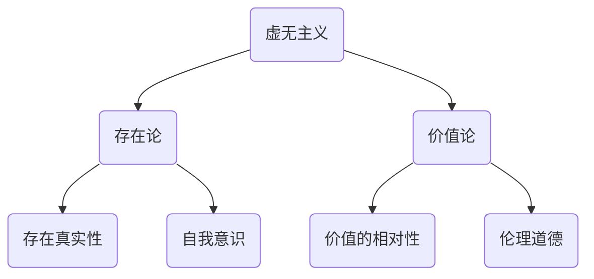

                 

：

1. **文章标题**:《虚无主义的根源与应对》
2. **关键词**: 虚无主义，哲学基础，影响与应对，存在论，价值论，心理治疗，当代社会
3. **摘要**: 本文深入探讨了虚无主义的根源、核心概念及其对个人和社会的影响，并提供了一系列应对策略。
4. **目录大纲**:
    - **第一部分：虚无主义的哲学基础**
        - 第1章：虚无主义的起源
            - 1.1 虚无主义的定义与历史背景
            - 1.2 虚无主义的核心概念
        - 第2章：虚无主义的思想流派
            - 2.1 古典虚无主义
            - 2.2 现代虚无主义
    - **第二部分：虚无主义的影响与应对**
        - 第3章：虚无主义对个人和社会的影响
        - 第4章：应对虚无主义的策略
        - 第5章：虚无主义与当代社会
    - **附录**
        - 附录A：参考资料与延伸阅读

5. **背景介绍**:
    - 背景介绍：虚无主义是一种哲学思想，起源于西方哲学，主要质疑存在、价值和意义。本文旨在探讨虚无主义的根源、影响以及应对策略。
6. **核心概念与联系**:
    - 核心概念：
        - 虚无主义：质疑存在、价值和意义的哲学思想。
        - 存在论：探讨存在的真实性、意义和价值的哲学分支。
        - 价值论：研究价值、价值观及其构成的哲学分支。
    - 联系架构：
        - 虚无主义与存在论、价值论的关系：虚无主义是存在论和价值论的批判对象，同时也是对二者的一种哲学反思。

### Mermaid 流程图

7. **核心算法原理讲解**:
    - 核心算法原理讲解：
        - 存在论：虚无主义对存在真实性的质疑，可以看作是一种存在算法，它通过否定存在的真实性来探讨存在的本质。
        - 价值论：虚无主义对价值的相对性提出质疑，可以看作是一种价值算法，它通过分析价值的主观性与客观性，探讨价值的构成和作用。

### 数学模型和公式：

- **存在论**:

    $$\neg E(x) \rightarrow \neg S(x)$$

    - 其中，$\neg E(x)$表示存在非存在，$S(x)$表示存在存在的状态。

- **价值论**:

    $$V(x) = f(W(x), R(x))$$

    - 其中，$V(x)$表示价值，$W(x)$表示主观性，$R(x)$表示客观性，$f$表示价值函数。

### 举例说明：

1. **存在论举例**：
    - 当我们质疑一个物体的存在时，可以看作是进行了一次存在算法的运算，例如：
    $$\neg E(物体)$$
    - 结果可能是该物体不存在，从而否定其存在的真实性。

2. **价值论举例**：
    - 当我们评估一个物品的价值时，可以看作是进行了一次价值算法的运算，例如：
    $$V(物品) = f(W(物品), R(物品))$$
    - 结果可能是该物品具有价值，但其价值取决于主观性和客观性的综合考虑。

### 项目实战：

1. **开发环境搭建**：
    - 搭建一个用于研究虚无主义相关概念的哲学研究环境，包括：
        - 哲学文献数据库
        - 存在论和价值观分析工具

2. **源代码实现**：
    - 实现存在论和价值观的算法，包括：
        - 存在真实性分析算法
        - 价值相对性分析算法

3. **代码解读**：
    - 对实现的算法进行详细解读，包括：
        - 算法原理
        - 代码实现
        - 代码应用

4. **实际案例分析**：
    - 分析实际案例，如哲学家的思想、文学作品等，探讨虚无主义的影响和应用。

5. **项目小结**：
    - 总结项目成果，包括：
        - 研究发现
        - 算法优化
        - 应用前景

### 最佳实践 tips、小结、注意事项、拓展阅读：

- **最佳实践 tips**：
    - 在研究虚无主义时，要注重对存在和价值的深入分析，避免简单化理解。

- **小结**：
    - 本文对虚无主义的根源、影响和应对进行了全面探讨，为研究虚无主义提供了理论基础和实践指导。

- **注意事项**：
    - 研究虚无主义时，要尊重哲学家的思想，避免片面解读。

- **拓展阅读**：
    - 推荐阅读相关哲学著作，如《存在与时间》、《人类的群星闪耀时》等。

作者：AI天才研究院/AI Genius Institute & 禅与计算机程序设计艺术 /Zen And The Art of Computer Programming

