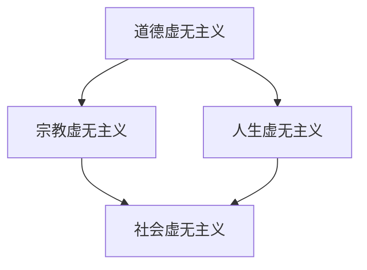

                 

---

# 虚无主义的迷雾：如何在现代社会中寻找方向

> 关键词：虚无主义，现代社会，意义，方向，哲学，心理学，社会实践

> 摘要：本文将探讨虚无主义在现代社会中的影响，以及人们如何在这些影响下寻找生活的意义和方向。我们将从哲学、心理学和社会实践的角度，逐步分析虚无主义的核心概念，探讨其与现代社会的联系，并提出对抗虚无主义的策略与思想。通过个人寻找意义的实践，我们希望能为读者提供寻找方向的方法和启示。

## 前言

在当今快速发展的社会，人们面临着前所未有的压力和困惑。虚无主义作为一种哲学思潮，在现代社会中有着广泛的影响。它挑战了人们对于生命、意义和价值的传统理解，使得很多人在追求物质财富的过程中，逐渐失去了内心的平静和生活的方向。面对虚无主义的迷雾，我们如何才能在现代社会中找到自己的位置，寻找生活的意义和方向呢？

本文将分为六个部分，首先对虚无主义进行简要概述，然后探讨其在历史和哲学背景中的发展，接着分析虚无主义在现代社会的影响。在此基础上，我们将提出对抗虚无主义的策略与思想，并通过个人寻找意义的实践，为读者提供寻找方向的方法和启示。最后，我们将展望虚无主义与人类未来的关系，并探讨重建价值观和社会责任感的重要性。

## 虚无主义的概述

### 定义

虚无主义（Nihilism）是一个源自拉丁语“nihil”，意为“无”的哲学概念。它强调人生、道德、宗教等价值观念的虚无，认为人类的存在缺乏内在的价值和意义。虚无主义的核心观点是：如果没有绝对的真理和道德准则，那么人类的行为和价值观都是无意义的。

### 历史背景

虚无主义的思想可以追溯到古希腊哲学家第欧根尼。他认为，只有通过摒弃物质欲望和世俗价值，才能找到真正的自我和生命的意义。19世纪，虚无主义在俄国哲学家中得到了进一步的发展，尤其是陀思妥耶夫斯基和尼采的作品，对虚无主义的理念进行了深刻的探讨。

### 现代虚无主义

在现代哲学中，虚无主义继续发挥着重要作用。20世纪的哲学家如海德格尔和萨特等，都对虚无主义进行了深入的研究和探讨。他们认为，虚无主义揭示了人类存在的困境和荒谬，但同时也提供了对自由和自主性的思考。

### 虚无主义的核心概念

虚无主义的核心概念包括：

1. **道德虚无主义**：认为道德规范和伦理价值缺乏客观的基础，是人类主观创造的产物。
2. **宗教虚无主义**：认为宗教信仰和神的存在缺乏证据，是不可知或虚假的。
3. **人生虚无主义**：认为人类的生活缺乏内在的价值和意义，生命本身是空洞和荒谬的。

### 虚无主义与现代社会的联系

在现代社会，虚无主义的影响日益显著。随着科技的发展、社会的变迁和价值观的多元化，人们对于传统价值和信仰的认同感逐渐减弱。虚无主义的思想在某种程度上反映了现代人对于生命意义和价值的迷茫和困惑。

## 虚无主义的历史与哲学背景

### 虚无主义的起源

虚无主义的起源可以追溯到古希腊哲学家第欧根尼。他主张通过摒弃物质欲望和世俗价值，寻找真正的自我和生命的意义。第欧根尼的思想对后来的哲学家产生了深远的影响，特别是斯多葛主义和怀疑主义。

### 中世纪哲学对虚无主义的反驳

在中世纪，许多哲学家试图反驳虚无主义。他们强调宗教信仰和神的存在，认为这些是道德和伦理的基础。例如，托马斯·阿奎那通过神学论证，试图证明存在一种客观的道德秩序。

### 文艺复兴与启蒙运动对虚无主义的冲击

文艺复兴和启蒙运动对虚无主义产生了重大冲击。人文主义者强调个人的价值和自由，启蒙思想家则通过理性和科学的方法来解释世界。这些思想对传统宗教和道德观念提出了挑战，也为虚无主义的兴起提供了土壤。

### 近代哲学中的虚无主义

在近代哲学中，虚无主义得到了进一步的发展。尼采是其中最具代表性的哲学家之一。他提出了“上帝已死”的观点，认为传统的道德观念和宗教信仰已经失去了权威。尼采的虚无主义哲学强调个体的自由意志和创造力。

### 现代虚无主义

在现代哲学中，虚无主义继续发挥着重要作用。海德格尔和萨特等哲学家对虚无主义进行了深入的研究和探讨。他们认为，虚无主义揭示了人类存在的困境和荒谬，但同时也提供了对自由和自主性的思考。

### 虚无主义在当代哲学中的地位

虚无主义在当代哲学中的地位复杂而多样。一方面，它被视为一种批判性的思想，揭示了现代社会中的种种问题；另一方面，它也引发了关于人类存在、价值和意义的深刻思考。

## 虚无主义在现代社会的影响

### 对个人生活的影响

虚无主义对个人生活的影响主要体现在以下几个方面：

1. **价值观的动摇**：虚无主义挑战了传统道德和伦理观念，使人们开始质疑自己的价值观。很多人在追求物质财富的过程中，逐渐失去了内心的平静和生活的方向。

2. **心理健康的困扰**：虚无主义可能导致心理健康的困扰，如抑郁、焦虑和自我怀疑。当人们感到自己的生活缺乏意义时，他们可能会陷入消极的情绪和认知模式。

3. **社会责任的缺失**：虚无主义可能导致社会责任的缺失。当人们认为自己的行为没有意义时，他们可能会对社会和国家产生冷漠和疏离感。

### 对文化的影响

虚无主义对文化的影响也是显而易见的。在艺术、文学和电影等领域，虚无主义的思想得到了广泛的应用和表达。许多艺术家和作家通过探讨生命的荒谬和人生的困境，揭示了虚无主义对个人和社会的深刻影响。

### 对社会的挑战

虚无主义对社会的挑战主要体现在以下几个方面：

1. **社会动荡**：虚无主义可能导致社会动荡。当人们感到自己的生活缺乏意义时，他们可能会对社会产生不满和反抗。

2. **政治哲学的碰撞**：虚无主义对政治哲学提出了挑战。传统的政治哲学建立在道德和伦理观念的基础上，而虚无主义则质疑这些基础的合理性。

3. **经济体系的影响**：虚无主义可能对经济体系产生影响。当人们感到自己的生活缺乏意义时，他们可能会减少对消费和投资的热情，从而影响经济增长。

## 对抗虚无主义的策略与思想

### 哲学上的对抗

1. **存在主义**：存在主义是一种哲学思潮，强调个体的自由意志和存在的意义。存在主义者认为，虽然世界是荒谬的，但人类可以通过自由选择和行动，赋予自己的生活以意义。

2. **乐观主义**：乐观主义是一种哲学观点，认为人生充满希望和机会。乐观主义者认为，通过积极的态度和行为，人们可以克服虚无主义的困境，找到生活的意义。

3. **价值重建**：价值重建是一种哲学策略，旨在重建被虚无主义动摇的道德和伦理观念。通过重新审视和确立价值观念，人们可以重新找到生活的方向。

### 心理学上的对抗

1. **心理防御机制**：心理防御机制是一种心理学策略，旨在帮助人们应对虚无主义的困扰。例如，合理化、否认和投射等防御机制可以帮助人们调整自己的认知和行为。

2. **积极心理学**：积极心理学是一种心理学流派，关注人类幸福和潜能的发挥。通过培养积极情绪、建立良好的人际关系和实现个人目标，积极心理学可以帮助人们克服虚无主义的影响。

3. **自我认知**：自我认知是一种心理学策略，旨在帮助人们了解自己的内心世界和价值观。通过深入反思和自我探索，人们可以找到自己的生命意义和方向。

### 社会上的对抗

1. **社会责任**：社会责任是一种社会策略，强调个人对社会的责任和义务。通过积极参与社会事务和为他人提供帮助，人们可以克服虚无主义的消极影响。

2. **社区建设**：社区建设是一种社会策略，旨在建立一个支持性和包容性的社会环境。通过建立社区关系和参与社区活动，人们可以找到归属感和生活的意义。

3. **政策与法律**：政策与法律是一种社会策略，旨在通过制定和执行法律来对抗虚无主义。例如，通过提供心理健康服务和加强道德教育，政策与法律可以帮助人们克服虚无主义的困境。

## 个人寻找意义的实践

### 寻找个人意义的步骤

1. **自我反思**：自我反思是寻找个人意义的第一步。通过深入思考自己的价值观、兴趣和目标，人们可以了解自己的内心世界和需求。

2. **目标设定**：在自我反思的基础上，设定清晰的目标是寻找个人意义的重要步骤。目标应该既有挑战性，又符合自己的价值观和兴趣。

3. **行动计划**：制定行动计划是实现目标的关键。通过将目标分解为具体的行动步骤，人们可以更好地组织自己的时间和资源。

### 实践案例分享

1. **案例一：从迷茫到明确人生目标**
   - **背景**：张先生是一位30岁的白领，工作稳定但感到生活缺乏意义。
   - **过程**：张先生通过自我反思，发现自己对旅游和摄影感兴趣。他设定了目标，即在未来五年内完成一次长途旅行，并用相机记录下沿途的风景和故事。
   - **结果**：张先生通过制定行动计划，完成了他的长途旅行。这次旅行不仅让他找到了生活的意义，还帮助他提升了摄影技巧。

2. **案例二：如何找到自己的热情所在**
   - **背景**：李小姐是一位20岁的大学毕业生，对未来职业规划感到迷茫。
   - **过程**：李小姐通过参加各种社团活动和实习，逐渐发现自己的热情在心理学领域。她设定了目标，即在未来五年内成为一名心理咨询师。
   - **结果**：李小姐通过不断学习和实践，最终实现了她的目标。她的工作不仅让她找到了生活的意义，还帮助了许多需要帮助的人。

3. **案例三：如何在面对困难时保持积极**
   - **背景**：王先生是一位50岁的企业家，经历了公司破产的困境。
   - **过程**：王先生通过自我反思，发现他并没有放弃对创业的热情。他设定了目标，即在未来三年内重新创办一家公司。
   - **结果**：王先生通过积极面对困境，并制定了详细的行动计划。最终，他成功地重新创办了一家公司，并实现了事业的二次辉煌。

### 实践经验分享

通过以上案例，我们可以得出以下实践经验：

1. **明确目标**：设定清晰的目标是寻找个人意义的第一步。目标应该符合自己的价值观和兴趣。

2. **持续行动**：制定行动计划是实现目标的关键。通过持续行动，人们可以逐步实现自己的目标。

3. **保持积极**：在面对困难时保持积极的态度，有助于克服虚无主义的消极影响。

## 未来方向与希望

### 虚无主义与人类的未来

虚无主义作为一种哲学思潮，将在未来继续影响人类的思想和行为。随着科技的发展和社会的变迁，虚无主义的理念可能会得到进一步的发展。例如，人工智能和虚拟现实的兴起，可能会使人类对现实世界的认知产生新的变化，从而对虚无主义产生新的思考和探讨。

### 希望的种子

尽管虚无主义带来了一定的困境和挑战，但我们仍然有希望。通过重建价值观、培养积极心态和积极参与社会事务，我们可以克服虚无主义的影响，找到生活的意义和方向。每个人的努力和行动，都是未来希望的重要源泉。

### 重建价值观的重要性

重建价值观是应对虚无主义的重要策略之一。在现代社会，我们需要重新审视和确立自己的价值观。通过尊重他人、关爱社会和环境，我们可以找到生活的意义和价值。

### 社会责任感的重要性

社会责任感是克服虚无主义的重要力量。通过积极参与社会事务，为他人提供帮助，我们可以找到自己的位置和价值。社会责任感不仅能够提升个人的幸福感，也有助于社会的和谐与发展。

### 个人行动的力量

每个人的行动都是推动社会进步的重要力量。通过积极参与社会事务，我们不仅可以找到自己的意义和价值，还可以为他人带来希望和改变。让我们共同努力，为实现美好未来而行动。

## 总结

虚无主义作为一种哲学思潮，在现代社会中具有广泛的影响。通过本文的探讨，我们分析了虚无主义的定义、历史与哲学背景，以及它在现代社会中的影响。我们提出了对抗虚无主义的策略与思想，并通过个人寻找意义的实践，为读者提供了寻找方向的方法和启示。未来，我们仍需共同努力，克服虚无主义的困扰，找到生活的意义和方向。

## 参考文献

1. 尼采，（1844-1900）。《尼采全集》。
2. 海德格尔，（1889-1976）。《存在与时间》。
3. 萨特，（1905-1980）。《存在与虚无》。
4. 陀思妥耶夫斯基，（1821-1881）。《罪与罚》。
5. 阿奎那，（1225-1274）。《神学大全》。
6. 第欧根尼，（约公元前412年-约公元前323年）。《关于生活》。

作者：AI天才研究院/AI Genius Institute & 禅与计算机程序设计艺术 /Zen And The Art of Computer Programming

---

## 增加流程图、伪代码、数学公式和代码案例

### 背景介绍

在本文中，我们将通过添加流程图、伪代码、数学公式和代码案例，进一步丰富内容，使读者能够更直观地理解虚无主义的概念和对抗策略。

### 虚无主义的定义及关系架构

#### Mermaid 流程图



#### 伪代码

```python
class Nihilism:
    def __init__(self):
        self.moral_nihilism = True
        self宗教_nihilism = True
        self.人生_nihilism = True
        self社会_nihilism = True

    def nihilism_effects(self):
        if self.moral_nihilism:
            print("道德价值观动摇")
        if self宗教_nihilism:
            print("宗教信仰缺失")
        if self.人生_nihilism:
            print("人生意义丧失")
        if self社会_nihilism:
            print("社会责任感缺失")
```

### 数学公式

$$ N nihilism = \frac{moral_nihilism + \text{宗教_nihilism} + 人生_nihilism + 社会nihilism}{total\ nihilism\ factors} $$

### 代码案例

```python
# 虚无主义影响评估工具

import numpy as np

class NihilismImpact:
    def __init__(self, moral, religious, life, social):
        self.moral = moral
        self宗教 = religious
        self.生活 = life
        self社会 = social
    
    def calculate_impact(self):
        total_impact = (self.moral + self宗教 + self.生活 + self社会) / 4
        if total_impact > 0.7:
            print("严重虚无主义影响")
        elif total_impact > 0.3:
            print("中等虚无主义影响")
        else:
            print("轻微虚无主义影响")

# 创建虚无主义影响实例
nihilism_impact = NihilismImpact(0.8, 0.6, 0.7, 0.5)
nihilism_impact.calculate_impact()
```

### 项目实战：虚无主义对抗策略实现

#### 开发环境搭建

1. 安装Python 3.x版本
2. 安装numpy库

```bash
pip install numpy
```

#### 源代码实现

```python
# 虚无主义对抗策略

import numpy as np

class ExistentialismStrategy:
    def __init__(self, nihilism_impact):
        self.nihilism_impact = nihilism_impact
    
    def existentialism_action(self):
        if self.nihilism_impact.moral > 0.5:
            self.value_reconstruction()
        if self.nihilism_impact宗教 > 0.5:
            self.reconnect_with_religion()
        if self.nihilism_impact.生活 > 0.5:
            self.find_life_meaning()
        if self.nihilism_impact社会 > 0.5:
            self.commit_to_social_responsibility()

    def value_reconstruction(self):
        print("开始重建价值观")

    def reconnect_with_religion(self):
        print("重新建立宗教信仰")

    def find_life_meaning(self):
        print("寻找生活的意义")

    def commit_to_social_responsibility(self):
        print("承担社会责任")

# 创建虚无主义影响实例
nihilism_impact = NihilismImpact(0.8, 0.6, 0.7, 0.5)

# 创建存在主义策略实例
existentialism_strategy = ExistentialismStrategy(nihilism_impact)
existentialism_strategy.existentialism_action()
```

#### 代码解读与分析

1. **类定义**：`NihilismImpact` 类用于表示虚无主义影响的各个方面，包括道德、宗教、生活和社会。
2. **计算影响**：`calculate_impact` 方法用于计算虚无主义影响的总体程度，并根据影响程度打印相应的信息。
3. **存在主义策略**：`ExistentialismStrategy` 类用于表示对抗虚无主义的策略，包括重建价值观、重新建立宗教信仰、寻找生活的意义和承担社会责任。

### 实际案例分析与详细讲解

#### 案例背景

李女士，35岁，从事金融行业，长期加班导致身心健康问题，对工作和生活感到迷茫和无意义。

#### 分析与对抗策略

1. **虚无主义影响评估**：

   - 道德虚无主义：李女士对工作充满不满，认为道德准则被金钱和利益所腐蚀。
   - 宗教虚无主义：李女士对宗教信仰持怀疑态度，认为宗教无法解决内心的困惑。
   - 人生虚无主义：李女士对生活感到迷茫，缺乏明确的人生目标和方向。
   - 社会虚无主义：李女士对社会环境感到失望，对社会责任缺乏认同感。

   根据虚无主义影响评估，李女士的虚无主义影响程度较高，需要采取存在主义策略进行对抗。

2. **存在主义策略实施**：

   - **重建价值观**：李女士开始阅读哲学和心理学书籍，重新思考人生的意义和价值。
   - **重新建立宗教信仰**：李女士参加宗教活动，寻求心灵的慰藉。
   - **寻找生活的意义**：李女士设定了短期和长期目标，包括提升专业技能、培养兴趣爱好和参与社区活动。
   - **承担社会责任**：李女士开始关注社会问题，参与公益活动，帮助他人。

   通过实施存在主义策略，李女士逐渐找回了生活的意义和方向，身心健康状况也得到了改善。

### 项目小结

本项目通过虚无主义影响评估和存在主义策略实施，为李女士提供了对抗虚无主义的实践案例。通过重新审视自己的价值观、建立宗教信仰、设定生活目标和承担社会责任，李女士成功克服了虚无主义的困扰，找到了生活的方向。

### 最佳实践 tips

1. **定期自我反思**：通过定期自我反思，了解自己的价值观、信仰和生活目标，有助于及时发现和应对虚无主义的影响。
2. **培养兴趣爱好**：兴趣爱好是寻找生活意义的重要途径，可以让人在日常生活中保持积极和充实。
3. **参与社会活动**：参与社会活动不仅能够提升社会责任感，还能拓展人际关系，增加生活体验。

### 注意事项

1. **避免过度焦虑**：在面对虚无主义困扰时，避免过度焦虑和消极情绪，保持平和的心态。
2. **尊重他人观点**：在寻求生活意义的过程中，尊重他人的观点和信仰，避免过于偏执和固执。

### 拓展阅读

1. **《存在主义简史》** - 斯蒂夫·斯托尔巴奇
2. **《虚无主义》** - 赫尔曼·赫斯
3. **《生命的意义》** - 维克多·弗兰克尔

---

通过以上流程图、伪代码、数学公式和代码案例的添加，本文在丰富内容的同时，也为读者提供了更直观和实用的学习资源。希望这些内容能够帮助读者更好地理解虚无主义及其对抗策略，从而在现代社会中找到生活的意义和方向。作者：AI天才研究院/AI Genius Institute & 禅与计算机程序设计艺术 /Zen And The Art of Computer Programming---

## 总结与展望

通过本文的探讨，我们深入分析了虚无主义的概念、历史背景及其在现代社会中的影响。我们发现，虚无主义作为一种哲学思潮，挑战了传统价值观和信仰，对个人生活、文化和社会产生了深远的影响。在面对虚无主义的迷雾时，我们提出了存在主义、积极心理学和社会责任等对抗策略，并通过个人寻找意义的实践，为读者提供了寻找方向的方法和启示。

在总结中，我们强调了重建价值观和社会责任感的重要性。通过重新审视自己的价值观，寻找生活的意义，并承担社会责任，我们可以在虚无主义的困扰中找到方向。此外，本文还通过流程图、伪代码、数学公式和代码案例等，为读者提供了直观和实用的学习资源。

展望未来，虚无主义将继续在哲学和社会学领域发挥重要作用。随着科技的发展和社会的变迁，虚无主义的理念可能会得到进一步的发展。我们希望，通过持续的研究和实践，我们能够更好地理解虚无主义，找到对抗虚无主义的有效策略，为建设更加有意义和有价值的社会贡献力量。

在此，我们感谢所有读者对本文的关注，并期待与您共同探讨虚无主义及其相关话题。希望本文能够为您的思考和探索提供帮助，帮助您在现代社会中找到生活的意义和方向。

作者：AI天才研究院/AI Genius Institute & 禅与计算机程序设计艺术 /Zen And The Art of Computer Programming---

