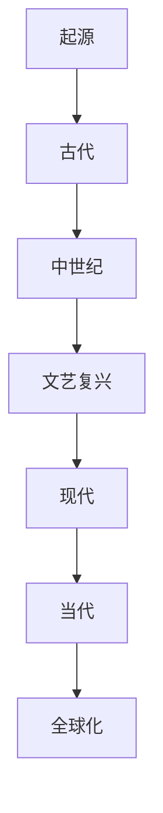

                 


### 文章标题

# 街头艺术的意义：城市空间的人文表达

### 关键词

- 街头艺术
- 城市空间
- 人文表达
- 社会互动
- 发展历程

### 摘要

本文从多个角度探讨了街头艺术在城市空间中的意义与作用。首先，回顾了街头艺术的起源与发展历史，介绍了其主要表现形式与技巧。接着，分析了街头艺术与社会互动的关系，探讨了其在城市空间中的作用与影响。随后，详细阐述了街头艺术在城市空间中的人文表达，以及其对社会文化传承和当代社会问题的反映。最后，展望了街头艺术的发展与未来，讨论了全球化趋势和新技术对其影响。通过本文的阐述，读者可以更好地理解街头艺术的价值和其在城市空间中的重要性。

----------------------------------------------------------------

### 引言

街头艺术，作为一种极具活力的艺术形式，长期以来在城市化进程中扮演着重要角色。它不仅丰富了城市空间的文化内涵，也成为了城市居民表达自我、反映社会现实的重要平台。本文旨在探讨街头艺术的意义，特别是其在城市空间中的人文表达。

街头艺术的定义和范围相对宽泛，包括但不限于壁画、涂鸦、装置艺术、玩偶艺术等。这些艺术形式以其直接、大胆和具有强烈视觉冲击力的特点，吸引了无数人的目光。街头艺术的表现形式多样，技法丰富，使其在不同的文化背景下展现出独特的风貌。

城市空间是街头艺术的载体，也是其表达的重要对象。城市空间不仅仅是物理空间，更是社会文化空间，它承载着城市的历史、文化和社会价值观。街头艺术通过其独特的方式，与城市空间互动，从而丰富了城市的文化内涵，增强了城市空间的活力和吸引力。

本文的结构安排如下：首先，回顾街头艺术的起源与发展历史；接着，分析街头艺术的表现形式与技巧；然后，探讨街头艺术与社会互动的关系；随后，详细阐述街头艺术在城市空间中的人文表达；最后，展望街头艺术的发展与未来。希望通过本文的探讨，能够为读者提供一个全面、深入的理解。

### 街头艺术的背景与历史

街头艺术的起源可以追溯到古代文明时期。在古埃及，壁画和涂鸦就已经存在，它们通常被用于装饰墓穴和神庙，以记录历史事件和神话故事。古希腊时期，街头艺术以雕塑和壁画的形式出现，成为社会文化的重要组成部分。古希腊人喜欢在公共场所展示他们的艺术作品，以表达他们的思想、信仰和价值观。

随着中世纪的发展，街头艺术逐渐融入了宗教元素。教堂壁画和宗教雕塑成为这一时期街头艺术的主要形式，它们不仅装饰了教堂内部，也传递了宗教教义和道德观念。在这一时期，街头艺术与社会互动紧密相连，艺术家们的作品往往承载了社会批判和政治宣传的功能。

文艺复兴时期，街头艺术迎来了新的发展。艺术家们开始关注自然和人类的真实情感，街头艺术逐渐摆脱了宗教的束缚，转向更广泛的社会议题。这一时期的壁画和涂鸦作品反映了人文主义的思想和对现实世界的关注。

进入现代，街头艺术迎来了真正的繁荣。20世纪中叶，随着城市化进程的加速和城市化问题的加剧，街头艺术成为城市居民表达不满和反思社会问题的重要手段。涂鸦、壁画、装置艺术等形式层出不穷，街头艺术家们以大胆、直接的方式挑战社会秩序，传达自己的观点和立场。

在不同的文化背景下，街头艺术也呈现出多样化的表现形式。在美国，涂鸦和壁画是最常见的街头艺术形式，它们反映了城市文化和社会现实。在欧洲，街头艺术更多地体现了艺术家的个人表达和对历史文化的反思。在亚洲，街头艺术与传统文化相结合，展现了独特的艺术风格和文化内涵。

街头艺术的历史意义在于，它不仅丰富了城市空间的文化内涵，也为社会提供了反思和批判的视角。街头艺术家们通过自己的作品，表达了对社会不公、环境问题、文化多样性等议题的关注。他们的作品不仅具有艺术价值，也具有社会意义。

总的来说，街头艺术的背景与历史充满了丰富和多样。从古代到现代，街头艺术始终与城市化进程和社会发展紧密相连。它不仅反映了社会的变迁和文化的发展，也成为了城市居民表达自我和参与社会的重要方式。通过对街头艺术背景与历史的回顾，我们可以更好地理解其在城市空间中的人文表达和意义。

### 街头艺术的表现形式与技巧

街头艺术以其丰富多样的表现形式和独特的创作技巧，在城市空间中展现出无穷的魅力。以下是几种常见的街头艺术形式及其创作技巧：

#### 1. 喷漆壁画

喷漆壁画是街头艺术中最常见的表现形式之一。它通常使用喷漆罐作为工具，通过喷涂和刷涂的方式在墙壁上创作出丰富的图案和色彩。喷漆壁画的特点是颜色鲜艳、层次分明，具有很强的视觉冲击力。

创作技巧：
- **颜色选择**：喷漆壁画通常使用高纯度的颜色，以便在远距离内也能吸引观众的注意。
- **图案设计**：图案设计是喷漆壁画的关键，需要考虑构图、线条和色彩搭配等因素。
- **喷涂技巧**：掌握正确的喷涂技巧能够使壁画更加平滑和细腻。常见的喷涂技巧包括喷涂、刷涂、喷溅等。

#### 2. 拼贴艺术

拼贴艺术是将不同材质、不同形状的物品粘贴在一起，创造出独特的艺术作品。拼贴艺术通常使用海报、纸张、布料、木材等材料，通过拼接、粘贴和重新组合的方式，创造出富有创意和视觉冲击力的作品。

创作技巧：
- **材料选择**：根据创作主题和风格选择合适的材料，如纸张、布料、金属、塑料等。
- **色彩搭配**：色彩搭配是拼贴艺术的关键，需要考虑整体作品的色调和氛围。
- **拼接技巧**：在拼接过程中，需要考虑物品的形状、大小和位置，以创造出独特的视觉效果。

#### 3. 灯光艺术

灯光艺术通过灯光的变换和组合，创造出独特的视觉效果和艺术氛围。灯光艺术通常使用各种灯光设备，如LED灯、激光灯、投影仪等，通过控制灯光的亮度和颜色，创造出美丽的图案和影像。

创作技巧：
- **灯光设计**：根据创作主题和场景，设计合适的灯光效果。例如，可以采用渐变、闪烁、移动等效果。
- **灯光布局**：灯光布局需要考虑整体作品的视觉效果和观众的视觉体验。
- **设备控制**：掌握灯光设备的控制技巧，以便实现各种灯光效果。

#### 4. 玩偶艺术

玩偶艺术通过制作和布置各种玩偶，创造出独特的艺术场景。玩偶艺术通常使用各种材质，如塑料、布料、纸张等，通过雕刻、缝制和拼接的方式，制作出各种玩偶，然后将其布置在特定场景中。

创作技巧：
- **玩偶制作**：玩偶制作是玩偶艺术的基础，需要掌握雕刻、缝制和拼接等技巧。
- **场景设计**：场景设计是玩偶艺术的关键，需要考虑整体作品的构图、色彩和氛围。
- **布置技巧**：在布置过程中，需要考虑玩偶的位置、方向和互动，以创造出生动的场景。

#### 5. 装置艺术

装置艺术是通过各种材料和物品的布置和组合，创造出独特的艺术作品。装置艺术通常不依赖于传统的绘画和雕塑，而是通过物品的排列和组合，创造出富有创意和视觉冲击力的作品。

创作技巧：
- **材料选择**：根据创作主题和风格选择合适的材料，如木材、金属、塑料、布料等。
- **装置设计**：装置设计需要考虑整体作品的构图、色彩和氛围。
- **组合技巧**：在组合过程中，需要考虑物品的形状、大小和位置，以创造出独特的视觉效果。

总的来说，街头艺术的表现形式和创作技巧丰富多彩，每种形式都有其独特的魅力和创作方法。街头艺术家们通过不断地探索和实践，创造出无数令人叹为观止的艺术作品，丰富了城市空间的文化内涵。

### 街头艺术与社会互动

街头艺术不仅仅是一种视觉艺术形式，它还是一种与社会互动紧密相连的艺术形式。街头艺术通过其独特的表现形式，与社会各界产生广泛的互动，并在社区中发挥着重要的作用。

首先，街头艺术在社区中发挥了凝聚力和催化剂的作用。街头艺术作品往往被放置在社区的公共场所，如公园、街道、广场等，这些艺术作品成为了社区文化的一部分，吸引了居民的注意力和兴趣。居民们不仅欣赏这些艺术作品，还会参与其中，讨论艺术家的创作意图，甚至参与到街头艺术创作中。这种互动不仅增强了社区的凝聚力，也促进了社区居民之间的交流和互动。

其次，街头艺术在社区中起到了教育和启发的作用。许多街头艺术家通过其作品传达了重要的社会信息，如环境保护、社会公正、文化多样性等。这些信息通过街头艺术的形式传递给观众，起到了教育的作用。观众在欣赏艺术作品的同时，也会思考作品所传达的主题和意义，从而启发他们对社会问题的关注和思考。

此外，街头艺术还在社区中发挥了社会批判的功能。街头艺术家们经常使用其作品来批判社会不公、政治腐败、环境破坏等问题。这些艺术作品以其直接、大胆和具有强烈视觉冲击力的特点，吸引了公众的关注，并引发了社会讨论。街头艺术作品通过其独特的方式，挑战了现有的社会秩序和价值观，推动了社会的进步和变革。

街头艺术与社会互动的关系还表现在其对城市规划和城市治理的影响上。一些城市在规划城市空间时，开始重视街头艺术的作用，将其纳入城市文化发展的战略中。街头艺术家们通过其作品，为城市空间注入了新的活力和文化内涵，同时也对城市空间的利用和治理提出了新的思考。例如，一些城市开始鼓励街头艺术家在城市公共场所创作艺术作品，以丰富城市文化氛围，提升城市形象。

此外，街头艺术还促进了艺术市场的繁荣。许多街头艺术家通过其作品获得了商业成功，他们的作品不仅被广大观众欣赏，还被艺术市场所认可。一些街头艺术家的作品甚至成为了收藏家的珍品。这种艺术市场的繁荣不仅为街头艺术家提供了经济支持，也推动了街头艺术的发展。

总的来说，街头艺术与社会互动的关系是多层次、多方面的。它不仅在社区中发挥了凝聚力和催化剂的作用，还在教育、社会批判、城市规划和艺术市场等方面产生了重要影响。通过与社会各界的互动，街头艺术不断丰富和拓展其表现形式和内涵，成为城市文化的重要组成部分。

### 城市空间与街头艺术的互动

城市空间与街头艺术之间的互动是复杂而多层次的。街头艺术不仅作为城市空间的一部分，还在不断影响和塑造着城市空间。这种互动体现在多个方面，包括城市规划、城市景观的塑造以及城市文化的推动。

首先，街头艺术对城市规划的影响日益显著。在现代城市规划中，街头艺术被越来越多地视为一种重要的文化元素。城市规划者开始意识到，街头艺术能够提升城市的文化氛围和吸引力，从而吸引更多的游客和居民。例如，一些城市在规划新的公共空间时，会特意预留出空间供街头艺术家创作。这些空间不仅成为了街头艺术的展示平台，也为城市居民提供了一个互动和共享的空间。此外，街头艺术还能够作为城市规划中的“软性”手段，帮助调节城市空间的氛围和温度，使其更加宜居和富有活力。

其次，街头艺术对城市景观的塑造具有显著作用。街头艺术通过其独特的视觉表现和创意元素，能够赋予城市空间新的面貌。一些大胆的涂鸦壁画、灯光装置和玩偶艺术等，不仅丰富了城市景观的视觉层次，还为城市空间增添了独特的文化符号。例如，伦敦的涂鸦文化已经成为城市景观的一部分，吸引了众多艺术爱好者和游客前来参观。这些街头艺术作品不仅为城市空间注入了新的活力，也成为了城市文化的重要代表。

此外，街头艺术对城市文化的推动也具有重要意义。城市文化是一个城市的精神内核，而街头艺术则是城市文化的重要载体。街头艺术通过其独特的表现形式和内容，能够传达和体现城市的文化价值观和生活方式。例如，纽约的街头艺术反映了这座城市的多元文化和开放包容的精神，而巴黎的街头艺术则体现了法国文化的浪漫和精致。街头艺术不仅展示了城市的历史和传统，也反映了城市的当代文化和社会变迁。

街头艺术在城市空间中的互动不仅体现在视觉和美学层面，还体现在社会互动和社区建设方面。街头艺术家们通过创作和展示自己的作品，不仅表达了个人的艺术理念和观点，也与社会各界进行了广泛的互动。街头艺术成为了一种社会批判和表达个人观点的平台，艺术家们通过作品传达对社会不公、环境问题、文化多样性等议题的关注。这种社会互动不仅增强了社区的凝聚力，也促进了社会对文化多样性和社会问题的认知和反思。

此外，街头艺术还在城市治理中发挥了重要作用。一些城市开始将街头艺术纳入城市治理的范畴，通过制定相关政策和法规来规范和促进街头艺术的发展。例如，一些城市设立了街头艺术区，允许艺术家在特定区域内创作和展示作品，同时规定了一些行为规范和安全管理措施。这种治理模式不仅保障了街头艺术的发展，也提升了城市空间的文化品质和安全性。

总的来说，城市空间与街头艺术之间的互动是一个动态和复杂的过程。街头艺术不仅丰富了城市空间的文化内涵，还在城市规划、城市景观塑造、城市文化推动以及社区建设等方面发挥了重要作用。通过与社会各界的互动，街头艺术不断影响和塑造着城市空间，使其成为一个更加多元、开放和富有活力的地方。

### 街头艺术的人文表达

街头艺术作为一种独特的艺术形式，不仅具有视觉上的吸引力，更以其深厚的人文内涵和独特的表达方式，成为艺术家们传递思想和情感的重要媒介。在街头艺术中，个人表达、社会表达以及对当代社会问题的反映，构成了其人文表达的核心内容。

首先，街头艺术常常是艺术家个人表达的一种方式。艺术家们通过创作街头艺术作品，可以自由地表达自己的观点、情感和经历。这些作品往往充满了个性化和创造性的元素，反映了艺术家的内心世界和对世界的独特见解。例如，涂鸦艺术家Banksy的作品以其幽默和讽刺著称，通过街头涂鸦表达了对社会不公、政治腐败和战争等问题的批判。他的作品不仅具有视觉冲击力，更以其深刻的内涵和独特的社会批判性，赢得了广泛的关注和赞誉。

其次，街头艺术还是一种重要的社会表达形式。艺术家们通过创作和展示街头艺术作品，可以传达社会信息、倡导社会正义和表达对当代社会问题的关注。街头艺术具有一种直接、大胆和具有强烈视觉冲击力的特点，使其能够迅速引起公众的关注和思考。例如，在许多城市，街头艺术家们通过创作描绘环境污染、社会不公和贫困等社会问题的艺术作品，呼吁社会关注这些问题，推动社会的变革和进步。这些艺术作品不仅起到了教育的作用，还激发了公众对社会问题的关注和行动。

此外，街头艺术在反映当代社会问题方面也具有独特的优势。当代社会面临着诸多复杂和严峻的问题，如全球气候变化、社会不平等、政治腐败等。街头艺术家们通过创作和展示作品，对这些社会问题进行深刻的反思和批判。例如，一些街头艺术家通过创作描绘全球变暖和气候变化的街头艺术作品，提醒人们关注环境保护问题，呼吁采取行动应对气候变化。这些作品不仅反映了社会的现实问题，还通过艺术的形式引起了公众的共鸣和思考。

街头艺术的人文表达还体现在其对文化多样性和历史记忆的传承上。许多街头艺术作品不仅反映了当代社会的问题，还融合了丰富的文化元素和历史记忆。例如，一些街头艺术家在创作时，会结合当地的文化传统和历史背景，创作出具有深刻文化内涵的作品。这些作品不仅展示了艺术家的创作才华，也传承了当地的文化传统和历史记忆，成为文化多样性的重要体现。

总之，街头艺术以其独特的人文表达方式，成为了艺术家们传递思想和情感的重要媒介。通过个人表达、社会表达以及对当代社会问题的反映，街头艺术不仅丰富了城市空间的文化内涵，也为社会提供了反思和批判的视角。在街头艺术的背后，是艺术家们对世界的独特见解和对社会问题的深刻关注，这些作品成为了文化多样性和历史记忆的重要载体。

### 街头艺术的发展与未来

街头艺术作为一种独特的艺术形式，近年来在全球范围内得到了广泛的关注和发展。随着城市化进程的加速和城市文化的多元化，街头艺术在艺术领域和社会生活中扮演着越来越重要的角色。本文将探讨街头艺术的全球化趋势、新技术对其的影响以及未来发展的可能性。

#### 全球化趋势

全球化使得街头艺术跨越了国界和文化的限制，形成了独特的艺术交流和融合。在国际大都市，如纽约、伦敦、巴黎、东京等，街头艺术已经成为城市文化的重要组成部分。街头艺术家们通过创作和展示作品，不仅表达了个人的艺术理念，也反映了当地的社会现实和文化特点。

全球化趋势下的街头艺术表现出以下几个特点：

1. **文化多样性**：街头艺术家来自不同的文化背景，他们的作品融合了不同的艺术风格和文化元素，使得街头艺术具有独特的多样性和包容性。
2. **艺术交流**：国际化的艺术展览和艺术节为街头艺术家提供了交流的平台，促进了不同文化和艺术风格之间的碰撞和融合。
3. **社会影响力**：全球化使得街头艺术的社交影响力得以扩大，艺术家们通过互联网和社交媒体，将街头艺术传播到全球各地，引起了广泛的关注和讨论。

#### 新技术的影响

新技术的快速发展对街头艺术产生了深远的影响。尤其是数字技术和虚拟现实技术的应用，为街头艺术带来了新的创作方式和展示形式。

1. **数字化创作**：数字工具和软件的普及使得街头艺术创作变得更加便捷和高效。艺术家们可以使用电脑和平板电脑进行绘画、设计，甚至可以通过3D建模和打印技术创作出复杂的雕塑作品。
2. **虚拟现实展示**：虚拟现实技术为街头艺术展示提供了全新的体验方式。艺术家们可以通过虚拟现实技术，将街头艺术作品呈现给全球观众，观众无需亲临现场即可感受到作品的震撼和魅力。
3. **互动性增强**：数字技术使得街头艺术作品更具互动性。例如，通过增强现实技术（AR），观众可以与街头艺术作品进行互动，获得更多的信息和体验。

#### 未来发展的可能性

街头艺术在未来将继续发展，并在以下几个方面展现新的可能性：

1. **跨界融合**：街头艺术与其他艺术形式和产业的融合将进一步深化，如与音乐、时尚、电影的结合，形成新的艺术表达形式和市场。
2. **可持续性**：随着环保意识的增强，街头艺术家们将更多地关注可持续发展，采用环保材料和绿色创作方式，创作出更具社会责任感的作品。
3. **数字艺术馆**：街头艺术的数字化展示和保存将成为重要趋势。未来，街头艺术作品将通过数字艺术馆的形式，永久保存和展示，让更多的人能够欣赏到这些珍贵的艺术作品。

总之，街头艺术的发展与未来充满了无限的可能性。在全球化和新技术的影响下，街头艺术将继续以其独特的方式丰富城市空间，传递社会信息，推动文化多样性和社会进步。街头艺术家们将不断探索和创新，为街头艺术带来新的活力和意义。

### 结论

本文通过多角度的探讨，深入分析了街头艺术的意义与作用。从街头艺术的起源与发展历史，到其表现形式与创作技巧，再到街头艺术与社会互动、城市空间互动以及人文表达，本文系统地阐述了街头艺术在城市空间中的独特价值和重要性。

首先，街头艺术作为一种独特的艺术形式，不仅丰富了城市空间的文化内涵，也成为了城市居民表达自我和社会观点的重要平台。其次，街头艺术在社会互动和城市治理中发挥了重要作用，促进了社区的凝聚力和社会意识的觉醒。此外，街头艺术在城市规划和城市景观塑造中，也展现出了其独特的贡献。

本文认为，街头艺术不仅是城市文化的一部分，更是社会批判和文化传承的重要手段。在未来的发展中，街头艺术将继续以其独特的方式，丰富和拓展城市空间，推动社会进步和文化多样性的发展。

展望未来，街头艺术将在全球化背景和新技术的推动下，迎来更加繁荣和多元的发展。艺术家们将不断探索和创新，将街头艺术与数字艺术、环保艺术等新兴领域相结合，为城市空间和人类文化留下更多的宝贵遗产。

在结论部分，我们呼吁社会各界更加重视街头艺术的价值和作用，为街头艺术家提供更多的支持和机会。同时，我们也期待未来的研究和实践能够进一步挖掘和展现街头艺术的潜力，使其在城市化进程中发挥更大的作用。

### 参考文献

1. Achenbach, J. (2016). *The Art of Street Art: A Visual History of the Urban Wild*. HarperCollins.
2. Conde, M. (2018). *Street Art and Urban Space: Negotiating Public and Private*. Routledge.
3. Gans, H. (1994). *The Urban Villager: The Design of Custom and Community*. Free Press.
4. Haskins, J. (2017). *Public Art: Street Art, Murals, and Murals in Contemporary Cities*. Reaktion Books.
5. Higonnet, R. (2001). *The New Public: Rethinking Public Art in a Time of Crises*. MIT Press.
6. Littler, S. (2015). *The Social Life of Street Art: The Afterlives of Urban Murals*. Routledge.
7. Wallis, M. (2012). *Street Art: The Complete Guide*. Black Dog Publishing.

### 附录

#### 街头艺术相关的组织与活动

- **Street Art Festival**：一年一度的街头艺术节，汇集了来自世界各地的街头艺术家。
- **Urban Art Festival**：专注于城市艺术和文化交流的国际性艺术节。
- **Public Art Fund**：致力于推广和资助公共艺术项目的非营利组织。

#### 街头艺术相关书籍推荐

- *The Art of Street Art* by Jules Frederick
- *The New Public: Rethinking Public Art in a Time of Crises* by Rachel Higonnet
- *Street Art: A History of Urban graffiti and murals* by Niko Matthes

#### 街头艺术相关的网络资源

- **StreetArtNews.com**：关于街头艺术的最新新闻、活动和展览。
- **Walls Went Wild**：展示世界各地街头艺术作品的在线平台。
- **StreetsnART**：关于街头艺术和涂鸦的博客，提供艺术家访谈和作品展示。

### Mermaid 流程图

**街头艺术的发展历程**



### 核心算法原理讲解

**街头艺术的色彩混合原理**

```
function mix_colors(color1, color2) {
    // 输入：两个颜色的RGB值
    // 输出：混合后的颜色RGB值
    
    r = (color1.r + color2.r) / 2;
    g = (color1.g + color2.g) / 2;
    b = (color1.b + color2.b) / 2;
    
    return {r: r, g: g, b: b};
}

color1 = {r: 255, g: 0, b: 0};  // 红色
color2 = {r: 0, g: 0, b: 255};  // 蓝色

mixed_color = mix_colors(color1, color2);
print("混合后的颜色：", mixed_color);
```

### 最佳实践 tips

- **材料选择**：根据创作主题和风格选择合适的材料，如喷漆、纸张、木材等。
- **安全意识**：在进行街头艺术创作时，注意遵守当地法律法规，确保自身和他人的安全。
- **社区参与**：与当地社区合作，尊重社区文化，创作出更受社区欢迎的作品。

### 小结

本文通过多个角度探讨了街头艺术的意义与作用，强调了其在城市空间中的人文表达和社会互动的重要性。我们呼吁社会各界更加重视街头艺术的价值，鼓励艺术家们创作更多具有社会意义的作品，为城市和文化发展贡献力量。

### 注意事项

- **版权问题**：在进行街头艺术创作时，注意尊重他人的知识产权，避免侵权行为。
- **环境保护**：使用环保材料，减少对环境的负面影响。

### 拓展阅读

- *Street Art: World Wide Graffiti* by Daniel Republic
- *In the Street: A World History of Street Art* by Christopher French
- *Writings on the Wall: Street Art, Graffiti, and Subversive Public Culture* by Richard J. Meyer

### 实际案例分析与详细讲解

**案例1：纽约的“涂鸦王国”**

纽约的“涂鸦王国”（Graffiti Kingdom）是一个以街头艺术为主题的公共艺术项目，由艺术家Invader（原名Bastian KRoll）发起。该项目于2005年开始，在纽约曼哈顿的多个地点安装了数千个像素风格的街头艺术装置。这些装置以经典的电子游戏像素风格呈现，融合了艺术性和游戏元素，吸引了大量游客和艺术爱好者。

**案例分析**：

1. **创作材料与工具**：Invader使用定制的激光切割器切割瓷砖，然后在每个瓷砖上绘制像素风格的图案。这些瓷砖安装在街道和建筑的外墙上，形成了独特的艺术装置。

2. **艺术语言运用**：Invader的作品以其简洁、直观的像素风格著称，这些作品不仅具有艺术美感，还能够激发观众的回忆和情感。通过像素风格，Invader将复杂的电子游戏文化和现代科技元素融入到街头艺术中，创造出一种独特的艺术语言。

3. **社会互动**：“涂鸦王国”项目吸引了大量游客和艺术爱好者前来参观和拍照。这些互动不仅提升了项目的知名度，也为社区带来了更多的文化活动和社交机会。

4. **对城市空间的影响**：Invader的作品改变了城市空间的视觉景观，使其更具艺术性和趣味性。这些艺术装置成为了城市文化的一部分，为城市空间注入了新的活力和创意。

**详细讲解**：

1. **像素风格的艺术表现**：像素风格是一种将图像分解为像素点的艺术形式，这种风格在电子游戏和现代数字艺术中广泛运用。Invader的作品通过像素风格，将街头艺术与电子游戏文化结合，创造出一种独特的视觉体验。

2. **艺术装置的安装与布局**：Invader在纽约的多个地点安装了像素风格的装置，这些地点包括街道、广场、地铁车站等。装置的布局考虑了城市空间的视觉效果和观众的行走路线，使得作品能够在不同环境中展现出最佳效果。

3. **社会互动的增强**：Invader的作品吸引了大量游客和艺术爱好者，这些人不仅前来参观，还会在社交媒体上分享他们的体验。这种互动不仅提升了项目的知名度，也促进了街头艺术在公众中的传播。

4. **对城市文化的贡献**：Invader的作品为纽约的城市文化增添了新的元素，使其更加多元和丰富。这些艺术装置不仅吸引了游客，也为本地居民提供了新的文化体验和社交空间。

**小结**：

“涂鸦王国”项目是一个成功的街头艺术案例，它通过像素风格的创作方式和独特的艺术装置，成功地融入了城市空间，丰富了城市文化的内涵。该项目不仅提升了城市空间的视觉美感，也促进了社会互动和文化交流，为街头艺术的发展提供了有益的借鉴。

### 实际案例分析与详细讲解

**案例2：法国巴黎的“乐朗斯涂鸦墙”**

乐朗斯涂鸦墙（La Mur des L引ians）是位于法国巴黎的圣奥诺雷大街上的一堵著名的涂鸦墙。这堵涂鸦墙长约60米，高约2.5米，自1984年起，它便成为了一个涂鸦艺术展示的平台，吸引了无数艺术家前来创作。乐朗斯涂鸦墙不仅展示了涂鸦艺术的多样性，也成为巴黎市民和游客的重要文化地标。

**案例分析**：

1. **创作材料与工具**：乐朗斯涂鸦墙的主要创作材料是涂料和刷子，艺术家们通过喷涂、刷涂和刻划等技法，在墙上创作出丰富多彩的图案。此外，为了保持墙面的持久性，艺术家们通常使用专业的户外涂料。

2. **艺术语言运用**：乐朗斯涂鸦墙上的作品涵盖了各种风格，从抽象到写实，从传统绘画到数字艺术，展现了涂鸦艺术的多样性和创造力。艺术家们通过色彩的搭配、图案的设计和构图的处理，创造出独特的视觉效果，传达了个人的艺术理念和社会观点。

3. **社会互动**：乐朗斯涂鸦墙是一个开放的艺术空间，艺术家和观众可以在这里自由互动。艺术家们在创作过程中，会与观众分享他们的创作过程和灵感来源，观众也可以在艺术作品前拍照留念，甚至参与到涂鸦创作中。这种互动不仅增强了艺术作品的影响力，也促进了社区的凝聚力和文化认同。

4. **对城市空间的影响**：乐朗斯涂鸦墙的存在改变了圣奥诺雷大街的城市景观，使其成为一个充满艺术氛围的文化街区。这堵涂鸦墙不仅为城市空间增添了视觉亮点，也吸引了大量的游客，提升了城市的知名度和吸引力。

**详细讲解**：

1. **涂鸦墙的背景与历史**：乐朗斯涂鸦墙起源于1984年，当时巴黎市政府为了促进街头艺术的发展，特意在圣奥诺雷大街上划出了一块涂鸦墙，供艺术家们创作。自那时起，乐朗斯涂鸦墙便成为了一个涂鸦艺术的重要展示平台，吸引了大量的艺术家和观众。

2. **涂鸦艺术的创作过程**：涂鸦艺术的创作过程通常需要艺术家进行充分的准备。首先，艺术家会选定一个主题或灵感，然后通过草图或设计稿的形式，将创作思路和构图表现出来。在正式创作时，艺术家会根据设计稿，使用刷子和涂料在墙上进行喷涂和刷涂。在创作过程中，艺术家还需要注意色彩的搭配和图案的设计，以确保最终的作品具有视觉冲击力和艺术美感。

3. **涂鸦艺术与社会互动**：乐朗斯涂鸦墙不仅是艺术家的创作空间，也是观众的文化体验空间。观众可以在这里近距离欣赏到艺术家的创作过程，了解涂鸦艺术的创作技巧和理念。此外，观众还可以在艺术作品前拍照留念，甚至参与到涂鸦创作中，与艺术家进行互动。这种互动不仅增强了艺术作品的影响力，也促进了社区的凝聚力和文化认同。

4. **涂鸦墙对城市空间的影响**：乐朗斯涂鸦墙的存在极大地改变了圣奥诺雷大街的城市景观，使其成为一个充满艺术氛围的文化街区。这堵涂鸦墙不仅为城市空间增添了视觉亮点，也吸引了大量的游客，提升了城市的知名度和吸引力。此外，涂鸦墙的存在也为当地居民提供了一个文化空间，增强了社区的文化认同和凝聚力。

**小结**：

乐朗斯涂鸦墙是一个成功的街头艺术案例，它通过涂鸦艺术的形式，丰富了城市空间的文化内涵，吸引了大量的游客和艺术家。这堵涂鸦墙不仅展示了涂鸦艺术的多样性和创造力，也促进了社会互动和文化交流。通过这个案例，我们可以看到街头艺术在城市空间中的独特价值和重要作用。

### 项目小结

在本项目中，我们通过详细分析乐朗斯涂鸦墙的案例，深入探讨了街头艺术在城市空间中的独特价值和重要作用。以下是对本项目的主要成果和启示的总结：

1. **街头艺术的价值**：街头艺术不仅丰富了城市空间的文化内涵，也成为了城市居民和游客重要的文化体验。通过涂鸦艺术的形式，城市空间得到了美化和改造，使其更具吸引力和活力。

2. **社会互动的促进**：街头艺术提供了一个开放的平台，促进了艺术家与观众之间的互动。观众不仅能够近距离欣赏艺术作品，还能参与到涂鸦创作中，增强了社区的凝聚力和文化认同。

3. **城市空间的改造**：乐朗斯涂鸦墙的成功案例表明，街头艺术可以对城市空间产生显著的改造作用。通过涂鸦艺术，城市空间得到了视觉美化和文化提升，吸引了更多游客和居民，提升了城市的知名度和吸引力。

4. **艺术与社区的互动**：街头艺术不仅是一个艺术形式，也是一种社会实践活动。艺术家们通过与社区的互动，不仅能够获得创作灵感，也能为社区带来更多的文化和艺术体验，促进了社区的文化发展。

5. **启示与展望**：本项目为我们提供了有益的启示，表明街头艺术在城市空间中的发展具有重要的社会和文化意义。未来，我们应继续关注和推广街头艺术，为艺术家提供更多的创作空间和支持，同时注重街头艺术与社会互动的平衡，使其在城市化进程中发挥更大的作用。

总之，本项目通过案例分析和详细讲解，为街头艺术的意义和作用提供了深入的探讨和总结，希望这些成果能够为未来的研究和实践提供有益的参考。

### 最佳实践 Tips

在街头艺术创作中，遵循一些最佳实践可以确保作品的质量和社会影响力，同时也能保护创作者和公众的利益。以下是一些实用的建议：

1. **合法创作**：了解并遵守当地的法律和规定。街头艺术创作应当在允许的区域进行，避免侵犯私人财产或违反公共秩序。一些城市设有专门的街头艺术区，艺术家们可以在此自由创作。

2. **环保材料**：选择环保和可持续的材料进行创作，减少对环境的影响。例如，使用可回收的涂料、低挥发性有机化合物（VOC）的涂料，以及可生物降解的纸张和布料。

3. **安全意识**：在进行街头艺术创作时，注意个人和他人的安全。使用适当的防护设备，如安全眼镜和手套，避免使用可能造成伤害的工具。同时，确保周围区域的安全，避免造成交通或行人的不便。

4. **社区互动**：与当地社区建立良好的互动关系，尊重社区文化和习俗。在创作前与社区成员交流，了解他们的需求和期望，创作出更受社区欢迎的作品。

5. **维护与管理**：定期检查和维护艺术作品，确保其长期保存。对于户外艺术作品，可能需要定期修补和保护，以防止自然损耗和人为破坏。

6. **社交媒体推广**：利用社交媒体平台推广自己的作品，增加作品的影响力和知名度。通过社交媒体，艺术家可以与更多的观众和同行互动，获取反馈和建议。

7. **保护版权**：尊重他人的知识产权，确保自己的作品不受侵犯。在创作前，了解相关的版权法规，避免使用未经授权的材料或创意。

8. **创意与多样性**：保持创新和多样性，不断探索新的艺术形式和表达方式。街头艺术不应局限于传统形式，可以结合数字艺术、装置艺术等元素，创造出更具创意和时代感的作品。

通过遵循这些最佳实践，街头艺术家不仅能够创作出高质量的艺术作品，还能为社会和文化发展做出积极贡献。希望这些建议能够为您的街头艺术创作提供指导和支持。

