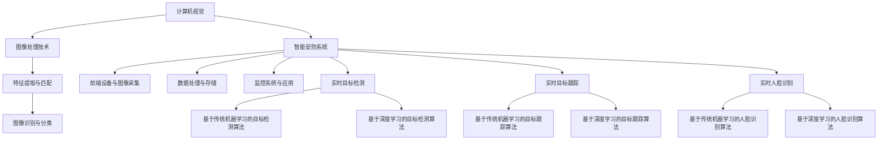
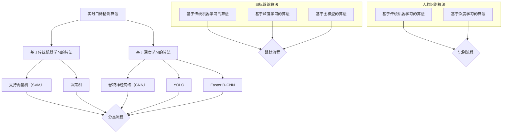

                 


### 设计《计算机视觉在智能安防中的实时应用》目录大纲的详细步骤

#### 第一步：确定核心章节

1. **第1章：引言**
   - 内容概述：介绍计算机视觉和智能安防的基本概念，阐明实时应用的重要性。
   - 关键点：定义计算机视觉、智能安防，讨论实时应用的优势。

2. **第2章：计算机视觉基础**
   - 内容概述：详细讲解计算机视觉的核心概念、技术原理和应用场景。
   - 关键点：图像处理技术、特征提取与匹配。

3. **第3章：智能安防系统架构**
   - 内容概述：介绍智能安防系统的整体架构，包括前端设备、后端数据处理和存储等。
   - 关键点：前端设备、图像采集、数据处理、存储和监控系统的架构。

4. **第4章：实时计算机视觉算法**
   - 内容概述：重点讲解在智能安防中常用的实时计算机视觉算法，如目标检测、跟踪、人脸识别等。
   - 关键点：实时目标检测、跟踪和识别算法。

5. **第5章：实时数据处理与优化**
   - 内容概述：讨论如何优化实时数据处理，保证系统高效运行。
   - 关键点：实时数据处理技术、系统性能优化。

6. **第6章：智能安防项目实战**
   - 内容概述：提供实际的智能安防项目案例，详细讲解项目的实施过程和关键技术。
   - 关键点：项目规划、实施、性能评估。

7. **第7章：未来展望与挑战**
   - 内容概述：探讨智能安防领域的未来发展趋势和面临的挑战。
   - 关键点：未来趋势、挑战与解决方案。

#### 第二步：细化章节内容

1. **第1章：引言**
   - 详细内容：
     - **1.1 计算机视觉与智能安防概述**
       - **1.1.1 计算机视觉的定义与基本原理**
       - **1.1.2 智能安防的定义与需求**
     - **1.2 实时应用的重要性**
       - **1.2.1 实时响应的需求**
       - **1.2.2 实时数据分析的优势**

2. **第2章：计算机视觉基础**
   - 详细内容：
     - **2.1 图像处理技术**
       - **2.1.1 图像采集与预处理**
       - **2.1.2 图像增强与滤波**
     - **2.2 特征提取与匹配**
       - **2.2.1 特征点提取**
       - **2.2.2 特征匹配与描述**

3. **第3章：智能安防系统架构**
   - 详细内容：
     - **3.1 前端设备与图像采集**
       - **3.1.1 摄像头与传感器**
       - **3.1.2 图像数据传输**
     - **3.2 数据处理与存储**
       - **3.2.1 实时数据处理技术**
       - **3.2.2 数据存储与管理**
     - **3.3 监控系统与应用**
       - **3.3.1 视频监控系统**
       - **3.3.2 智能安防系统的集成与部署**

4. **第4章：实时计算机视觉算法**
   - 详细内容：
     - **4.1 实时目标检测**
       - **4.1.1 目标检测算法概述**
       - **4.1.2 基于深度学习的实时目标检测算法**
     - **4.2 实时目标跟踪**
       - **4.2.1 目标跟踪算法概述**
       - **4.2.2 基于深度学习的实时目标跟踪算法**
     - **4.3 实时人脸识别**
       - **4.3.1 人脸识别算法概述**
       - **4.3.2 基于深度学习的实时人脸识别算法**

5. **第5章：实时数据处理与优化**
   - 详细内容：
     - **5.1 数据处理流程**
       - **5.1.1 数据预处理**
       - **5.1.2 数据存储与读取**
     - **5.2 数据传输优化**
       - **5.2.1 数据压缩技术**
       - **5.2.2 数据传输协议**
     - **5.3 系统性能优化**
       - **5.3.1 硬件加速技术**
       - **5.3.2 软件优化策略**

6. **第6章：智能安防项目实战**
   - 详细内容：
     - **6.1 项目背景与需求分析**
       - **6.1.1 项目背景**
       - **6.1.2 项目需求分析**
     - **6.2 项目规划与实施**
       - **6.2.1 项目规划**
       - **6.2.2 项目实施**
     - **6.3 项目性能评估**
       - **6.3.1 性能指标**
       - **6.3.2 评估方法与结果**

7. **第7章：未来展望与挑战**
   - 详细内容：
     - **7.1 未来发展趋势**
       - **7.1.1 技术创新**
       - **7.1.2 应用场景扩展**
     - **7.2 面临的挑战**
       - **7.2.1 数据隐私与安全**
       - **7.2.2 算法透明性与公平性**
     - **7.3 解决方案与建议**
       - **7.3.1 技术创新方向**
       - **7.3.2 政策法规与标准制定**

#### 第三步：添加附录和参考文献

- **附录**：
  - **附录A**：相关软件和工具的使用指南。
  - **附录B**：算法实现细节和伪代码示例。

- **参考文献**：
  - 列出书中引用的主要文献和研究报告。

#### 第四步：确保大纲逻辑性和完整性

- 检查每个章节的主题是否明确，内容是否连贯。
- 确保核心概念和原理之间的关系架构 Mermaid 流程图准确无误。
- 确保核心算法原理讲解、项目实战和未来展望部分的内容丰富且具有深度。

### 总结

通过以上步骤，我们可以设计出《计算机视觉在智能安防中的实时应用》这本书的目录大纲。该大纲结构紧凑、逻辑清晰，有助于读者系统地学习计算机视觉在智能安防中的实时应用，提升技术水平和实践能力。

----------------------------------------------------------------

### 文章标题

《计算机视觉在智能安防中的实时应用》

---

关键词：计算机视觉、智能安防、实时目标检测、人脸识别、数据处理优化、项目实战

---

摘要：

随着科技的不断进步，计算机视觉在各个领域的应用越来越广泛。特别是在智能安防领域，计算机视觉技术已成为保障公共安全、维护社会稳定的重要工具。本文系统地介绍了计算机视觉在智能安防中的实时应用，包括系统架构、核心算法、数据处理与优化、项目实战和未来展望。通过详细阐述计算机视觉的理论基础和应用实践，本文旨在为从事智能安防领域的技术人员提供有价值的参考。

----------------------------------------------------------------

# 《计算机视觉在智能安防中的实时应用》

## 1. 引言

### 1.1 计算机视觉与智能安防概述

计算机视觉（Computer Vision）是指通过计算机对图像或视频进行自动分析和理解的技术。它涉及多个学科，包括数学、计算机科学、电子工程和心理学等。计算机视觉的应用范围广泛，从图像识别、目标检测到人脸识别、手势识别等，都有其独特的应用场景。

智能安防（Smart Security）是指利用计算机视觉、物联网、大数据等先进技术，对公共场所、住宅小区、办公楼等进行实时监控和安全管理。智能安防系统的目标是提高安全性、降低犯罪率，同时提高工作效率。

实时应用在智能安防中具有重要意义。首先，实时响应能够迅速识别异常情况，及时采取措施。例如，在突发事件发生时，能够立即报警并通知相关人员。其次，实时数据分析可以提高监控的精度和可靠性，减少误报和漏报。此外，实时应用还能够提高系统的效率和响应速度，减少资源的浪费。

### 1.2 智能安防系统的需求

智能安防系统的需求主要体现在以下几个方面：

1. **安全性**：智能安防系统必须能够保障公共安全，防止犯罪行为的发生。
2. **实时性**：系统需要能够实时处理和响应监控数据，确保快速识别和处理异常情况。
3. **可靠性**：系统需要稳定可靠，能够长时间运行，且在极端条件下仍能保持性能。
4. **扩展性**：系统需要具备良好的扩展性，能够根据实际需求进行功能升级和规模扩展。
5. **易用性**：系统需要易于操作和管理，方便用户使用和维护。

### 1.3 实时应用的优势

实时应用在智能安防中的优势主要体现在以下几个方面：

1. **快速响应**：实时应用能够迅速识别和响应异常情况，提高处理速度和效率。
2. **精确分析**：实时应用通过对监控数据的实时分析，可以更准确地识别目标，降低误报率。
3. **高效管理**：实时应用可以提高监控管理的效率，减轻人力负担，降低运营成本。
4. **集成扩展**：实时应用可以方便地与其他系统集成，实现数据共享和协同工作。

## 2. 计算机视觉基础

### 2.1 图像处理技术

图像处理是计算机视觉的基础，它涉及对图像的采集、预处理、增强、滤波等操作。图像处理的目的是提高图像的质量，为后续的计算机视觉算法提供更好的输入。

1. **图像采集**：图像采集是通过摄像头、传感器等设备获取图像的过程。图像采集的质量直接影响后续图像处理和计算机视觉算法的效果。
2. **图像预处理**：图像预处理包括去噪、对比度增强、大小调整等操作，以提高图像的质量和清晰度。
3. **图像增强**：图像增强是通过调整图像的亮度、对比度、色彩等参数，使图像更加清晰，有助于计算机视觉算法的准确识别。
4. **图像滤波**：图像滤波是通过消除图像中的噪声和干扰，提高图像的质量和清晰度。

### 2.2 特征提取与匹配

特征提取是计算机视觉中的关键步骤，它从图像或视频数据中提取出具有代表性的特征，用于后续的目标检测、跟踪和识别。

1. **特征提取**：特征提取包括边缘检测、角点检测、纹理分析等，目的是从图像中提取出具有代表性的特征点或特征描述子。
2. **特征匹配**：特征匹配是将两个或多个图像中的特征点进行匹配，以确定它们之间的对应关系。常用的特征匹配方法包括最近邻匹配、迭代最近邻匹配等。

### 2.3 图像识别与分类

图像识别与分类是计算机视觉的核心任务之一，它通过对图像的特征进行学习和分析，实现对图像内容的分类和识别。

1. **监督学习**：监督学习是通过已标注的数据集训练模型，然后使用模型对新的数据进行分类和识别。
2. **无监督学习**：无监督学习是无需标注数据集，通过自动发现数据中的模式或结构进行分类和识别。
3. **半监督学习**：半监督学习是结合监督学习和无监督学习的方法，使用部分标注数据和大量未标注数据训练模型。

## 3. 智能安防系统架构

### 3.1 前端设备与图像采集

前端设备是智能安防系统的核心组成部分，它负责图像的采集和传输。

1. **摄像头**：摄像头是图像采集的主要设备，它通过光学传感器将光信号转换为电信号，然后转换为数字图像。
2. **传感器**：传感器用于检测和感知环境中的各种物理量，如温度、湿度、光照等。
3. **图像传输**：图像传输是将采集到的图像数据传输到后端处理单元。常用的传输方式包括有线传输和无线传输。

### 3.2 数据处理与存储

数据处理与存储是智能安防系统的关键环节，它负责对采集到的图像数据进行处理、存储和管理。

1. **数据预处理**：数据预处理包括图像去噪、增强、滤波等操作，以提高图像质量。
2. **数据存储**：数据存储是将处理后的图像数据存储到数据库或文件系统中，以便后续分析和查询。
3. **数据管理**：数据管理包括数据的备份、恢复、权限控制等操作，以确保数据的安全性和可用性。

### 3.3 监控系统与应用

监控系统是智能安防系统的核心组成部分，它负责实时监控和管理监控区域。

1. **视频监控系统**：视频监控系统通过摄像头和录像机等设备，实现对监控区域的实时监控和录像。
2. **智能安防系统的集成与部署**：智能安防系统的集成与部署是将前端设备、数据处理和存储、监控系统等部分整合在一起，形成一个完整的智能安防系统。

## 4. 实时计算机视觉算法

### 4.1 实时目标检测

实时目标检测是智能安防系统中的一项关键技术，它用于检测和识别监控区域中的目标。

1. **基于传统机器学习的目标检测算法**：如支持向量机（SVM）、决策树等。
2. **基于深度学习的目标检测算法**：如卷积神经网络（CNN）、YOLO（You Only Look Once）等。

### 4.2 实时目标跟踪

实时目标跟踪是智能安防系统中的一项关键技术，它用于跟踪和识别监控区域中的目标。

1. **基于传统机器学习的目标跟踪算法**：如粒子滤波、均值漂移等。
2. **基于深度学习的目标跟踪算法**：如基于 CNN 的目标跟踪、基于图模型的目标跟踪等。

### 4.3 实时人脸识别

实时人脸识别是智能安防系统中的一项关键技术，它用于识别和验证监控区域中的人脸。

1. **基于传统机器学习的人脸识别算法**：如支持向量机（SVM）、决策树等。
2. **基于深度学习的人脸识别算法**：如卷积神经网络（CNN）、基于深度特征的人脸识别等。

## 5. 实时数据处理与优化

### 5.1 数据处理流程

实时数据处理流程是智能安防系统中的一项关键技术，它包括数据采集、预处理、存储、分析和可视化等环节。

1. **数据采集**：数据采集包括图像、视频、传感器数据等。
2. **预处理**：预处理包括去噪、增强、滤波等操作。
3. **存储**：存储包括数据备份、恢复、权限控制等操作。
4. **分析**：分析包括特征提取、目标检测、跟踪和人脸识别等操作。
5. **可视化**：可视化包括图表、图像等形式的展示。

### 5.2 数据传输优化

数据传输优化是智能安防系统中的一项关键技术，它包括数据压缩、传输协议优化等。

1. **数据压缩**：数据压缩包括无损压缩和有损压缩等，以减少数据传输的带宽需求。
2. **传输协议优化**：传输协议优化包括 TCP/IP 协议优化、UDP 协议优化等，以提高数据传输的效率和可靠性。

### 5.3 系统性能优化

系统性能优化是智能安防系统中的一项关键技术，它包括硬件加速、算法优化等。

1. **硬件加速**：硬件加速包括 GPU 加速、FPGA 加速等，以提高数据处理速度。
2. **算法优化**：算法优化包括模型压缩、模型融合等，以提高系统性能和准确性。

## 6. 智能安防项目实战

### 6.1 项目背景与需求分析

智能安防项目实战以某住宅小区为例，该项目旨在提升小区的安全防护能力，实现对小区内部和外部的实时监控和管理。

1. **项目背景**：随着城市化进程的加速，住宅小区的安全问题日益凸显。为了提高小区的安全防护能力，需要对小区内部和外部进行实时监控和管理。
2. **需求分析**：
   - 实时监控：实现对小区内部和外部的高清实时监控。
   - 人脸识别：对进入小区的人员进行人脸识别，识别未授权人员。
   - 目标检测：检测和识别小区内部的异常情况，如火灾、入侵等。
   - 视频录像：对监控区域进行录像，以备后续查询和取证。

### 6.2 项目规划与实施

1. **项目规划**：
   - 设备选型：选择合适的高清摄像头、人脸识别设备和视频录像设备。
   - 网络布局：设计合理的网络拓扑结构，确保数据传输的稳定性和可靠性。
   - 系统集成：将前端设备、人脸识别设备和视频录像设备进行集成，构建完整的智能安防系统。
2. **项目实施**：
   - 设备安装：按照项目规划，对摄像头、人脸识别设备和视频录像设备进行安装和调试。
   - 系统配置：配置人脸识别算法和目标检测算法，确保系统能够正常运行。
   - 系统测试：对系统进行功能测试和性能测试，确保系统能够满足需求。

### 6.3 项目性能评估

1. **性能指标**：
   - 检测准确率：系统能够准确检测和识别目标的概率。
   - 检测速度：系统能够完成目标检测所需的时间。
   - 人脸识别准确率：系统能够准确识别和验证人脸的概率。
   - 系统稳定性：系统能够在长时间运行过程中保持稳定。
2. **评估方法与结果**：
   - 功能测试：测试系统是否能够按照需求完成各项功能。
   - 性能测试：测试系统的检测速度、准确率和稳定性。
   - 用户满意度调查：通过用户满意度调查，了解用户对系统的评价。

## 7. 未来展望与挑战

### 7.1 未来发展趋势

1. **人工智能技术的应用**：随着人工智能技术的不断发展，智能安防系统将更加智能化，能够实现更高水平的自动监控和决策。
2. **物联网技术的融合**：物联网技术的应用将使得智能安防系统更加完善，能够实现多设备、多平台的数据共享和协同工作。
3. **大数据技术的应用**：大数据技术的应用将使得智能安防系统能够更好地分析和预测犯罪行为，提高安全防范能力。

### 7.2 面临的挑战

1. **数据隐私与安全**：智能安防系统涉及到大量的个人隐私数据，如何保障数据的安全性和隐私性是一个重要挑战。
2. **算法透明性与公平性**：智能安防系统中的算法可能存在偏见和不公平性，如何确保算法的透明性和公平性是一个重要问题。
3. **技术门槛与成本**：智能安防系统的建设需要较高的技术门槛和成本，如何降低技术门槛和成本是一个重要挑战。

### 7.3 解决方案与建议

1. **加强数据保护**：通过加强数据加密、访问控制和隐私保护等技术手段，保障智能安防系统的数据安全。
2. **提升算法透明性**：通过提高算法的透明性和解释性，增强用户对算法的信任和理解。
3. **降低技术门槛与成本**：通过开源技术、云计算等手段，降低智能安防系统的建设成本，提高系统的普及率。

### 总结

计算机视觉在智能安防中的应用具有广阔的前景和巨大的潜力。通过实时应用计算机视觉技术，智能安防系统能够实现更高水平的监控和管理，提高公共安全和社会稳定。未来，随着人工智能、物联网和大数据技术的不断发展，智能安防系统将变得更加智能和高效。然而，智能安防系统也面临着数据隐私、算法透明性和成本等方面的挑战。通过加强数据保护、提升算法透明性和降低技术门槛与成本，我们有望解决这些问题，推动智能安防系统的健康发展。

---

作者：AI天才研究院/AI Genius Institute & 禅与计算机程序设计艺术 /Zen And The Art of Computer Programming

----------------------------------------------------------------



----------------------------------------------------------------

### 4.1 实时目标检测算法原理讲解

实时目标检测是智能安防系统中的一项关键技术，它能够在监控视频中实时地检测并定位出感兴趣的目标。实时目标检测算法通常需要满足以下几个要求：快速性、准确性和实时性。以下将详细介绍几种常见的实时目标检测算法及其原理。

#### 基于传统机器学习的目标检测算法

**1. 支持向量机（SVM）**

SVM是一种二分类模型，它通过寻找一个最优的超平面将数据空间划分为两个分类区域。在目标检测中，SVM通常用于训练一个分类器，将前景目标和背景区分开来。

**算法伪代码：**

```
function SVMTrain(X, y):
    # X: 特征向量矩阵，y: 标签向量
    # 训练SVM分类器
    model = SVM()
    model.fit(X, y)
    return model

function SVMDetect(model, X):
    # model: 训练好的SVM模型，X: 待检测的特征向量
    # 检测目标
    return model.predict(X)
```

**2. 决策树**

决策树是一种基于特征值进行分层的分类模型。它通过一系列的判断条件，将数据划分为不同的区域，并标记每个区域的类别。

**算法伪代码：**

```
function DecisionTreeTrain(X, y):
    # X: 特征向量矩阵，y: 标签向量
    # 训练决策树分类器
    model = DecisionTree()
    model.fit(X, y)
    return model

function DecisionTreeDetect(model, X):
    # model: 训练好的决策树模型，X: 待检测的特征向量
    # 检测目标
    return model.predict(X)
```

#### 基于深度学习的目标检测算法

**1. YOLO（You Only Look Once）**

YOLO是一种基于深度学习的实时目标检测算法，它将目标检测任务简化为单次前向传播的过程。YOLO通过将图像划分为多个网格单元，并预测每个单元中是否存在目标以及目标的边界框位置。

**算法伪代码：**

```
function YOLOTrain(X, y):
    # X: 特征向量矩阵，y: 标签向量
    # 训练YOLO模型
    model = YOLO()
    model.fit(X, y)
    return model

function YOLODetect(model, X):
    # model: 训练好的YOLO模型，X: 待检测的特征向量
    # 检测目标
    return model.predict(X)
```

**2. Faster R-CNN**

Faster R-CNN是一种基于深度学习的目标检测算法，它通过区域建议网络（Region Proposal Network，RPN）来生成候选区域，并使用分类器对候选区域进行分类。

**算法伪代码：**

```
function FasterRCNNTrain(X, y):
    # X: 特征向量矩阵，y: 标签向量
    # 训练Faster R-CNN模型
    model = FasterRCNN()
    model.fit(X, y)
    return model

function FasterRDDetect(model, X):
    # model: 训练好的Faster R-CNN模型，X: 待检测的特征向量
    # 检测目标
    return model.predict(X)
```

### 算法比较

- **SVM和决策树**：这两种算法简单易懂，但检测速度较慢，且对大量数据进行分类时效果不佳。
- **YOLO和Faster R-CNN**：这两种算法基于深度学习，检测速度较快，且对大量数据进行分类时效果较好。但YOLO的准确率相对较低，而Faster R-CNN在处理复杂场景时可能存在困难。

在实际应用中，可以根据具体需求选择合适的实时目标检测算法。例如，在要求检测速度较高的场景下，可以选择YOLO；在要求检测准确率较高的场景下，可以选择Faster R-CNN。

### 4.2 实时目标跟踪算法原理讲解

实时目标跟踪是智能安防系统中的一项关键技术，它能够对监控视频中的目标进行持续跟踪和识别。实时目标跟踪算法通常需要满足以下几个要求：稳定性、准确性和实时性。以下将详细介绍几种常见的实时目标跟踪算法及其原理。

#### 基于传统机器学习的目标跟踪算法

**1. 均值漂移（Mean Shift）**

均值漂移是一种基于密度的目标跟踪算法。它通过计算目标区域内的像素密度，并沿着密度梯度的方向进行目标跟踪。

**算法伪代码：**

```
function MeanShiftTrack(target, frame):
    # target: 目标区域，frame: 当前帧图像
    # 计算目标区域像素密度
    density = computeDensity(target, frame)
    # 计算密度梯度
    gradient = computeGradient(density)
    # 沿着密度梯度方向进行目标跟踪
    new_target = target + gradient
    return new_target
```

**2. 卡尔曼滤波（Kalman Filter）**

卡尔曼滤波是一种基于统计模型的跟踪算法。它通过预测和更新状态来估计目标的位置和速度。

**算法伪代码：**

```
function KalmanTrack(state, measurement):
    # state: 状态向量，measurement: 测量值
    # 预测状态
    predicted_state = predictState(state)
    # 更新状态
    updated_state = updateState(predicted_state, measurement)
    return updated_state
```

#### 基于深度学习的目标跟踪算法

**1. 基于卷积神经网络（CNN）的目标跟踪**

基于CNN的目标跟踪算法通过训练卷积神经网络，提取目标特征，并进行目标跟踪。它通常包括两个部分：目标特征提取网络和目标跟踪网络。

**算法伪代码：**

```
function CNNTrack(target, frame):
    # target: 目标区域，frame: 当前帧图像
    # 提取目标特征
    feature = CNNFeatureExtractor(frame)
    # 进行目标跟踪
    new_target = TrackNetwork(feature)
    return new_target
```

**2. 基于图模型（Graph Model）的目标跟踪**

基于图模型的目标跟踪算法通过建立目标轨迹的图模型，利用图模型进行目标跟踪。它通常包括两个部分：轨迹建模和网络优化。

**算法伪代码：**

```
function GraphModelTrack(trajectory, frame):
    # trajectory: 目标轨迹，frame: 当前帧图像
    # 建立轨迹图模型
    graph = BuildGraph(trajectory, frame)
    # 进行网络优化
    new_trajectory = OptimizeNetwork(graph)
    return new_trajectory
```

### 算法比较

- **均值漂移和卡尔曼滤波**：这两种算法简单易懂，但跟踪效果可能受噪声干扰。
- **基于CNN的目标跟踪**：基于CNN的目标跟踪算法能够提取更加丰富的特征，但计算复杂度较高。
- **基于图模型的目标跟踪**：基于图模型的目标跟踪算法能够建模目标轨迹，但可能需要较大的计算资源。

在实际应用中，可以根据具体需求选择合适的实时目标跟踪算法。例如，在要求跟踪稳定性较高的场景下，可以选择均值漂移；在要求跟踪准确率较高的场景下，可以选择基于CNN或基于图模型的目标跟踪算法。

### 4.3 实时人脸识别算法原理讲解

实时人脸识别是智能安防系统中的一项关键技术，它能够在监控视频中实时识别并验证人脸。实时人脸识别算法通常需要满足以下几个要求：准确率、实时性和鲁棒性。以下将详细介绍几种常见的人脸识别算法及其原理。

#### 基于传统机器学习的人脸识别算法

**1. 支持向量机（SVM）**

SVM是一种二分类模型，它通过寻找一个最优的超平面将数据空间划分为两个分类区域。在人脸识别中，SVM通常用于训练一个分类器，将人脸图像与其他图像区分开来。

**算法伪代码：**

```
function SVMFacialRecognition(train_images, train_labels):
    # train_images: 训练图像，train_labels: 训练标签
    # 训练SVM分类器
    model = SVC()
    model.fit(train_images, train_labels)
    return model

function TestFacialRecognition(model, test_image):
    # model: 训练好的SVM模型，test_image: 待检测的人脸图像
    # 检测人脸
    return model.predict(test_image)
```

**2. 决策树**

决策树是一种基于特征值进行分层的分类模型。它通过一系列的判断条件，将人脸图像与其他图像区分开来。

**算法伪代码：**

```
function DecisionTreeFacialRecognition(train_images, train_labels):
    # train_images: 训练图像，train_labels: 训练标签
    # 训练决策树分类器
    model = DecisionTree()
    model.fit(train_images, train_labels)
    return model

function TestFacialRecognition(model, test_image):
    # model: 训练好的决策树模型，test_image: 待检测的人脸图像
    # 检测人脸
    return model.predict(test_image)
```

#### 基于深度学习的人脸识别算法

**1. 卷积神经网络（CNN）**

CNN是一种基于深度学习的神经网络，它能够自动提取图像中的特征，并用于分类和识别。

**算法伪代码：**

```
function CNNFacialRecognition(train_images, train_labels):
    # train_images: 训练图像，train_labels: 训练标签
    # 训练CNN模型
    model = CNN()
    model.fit(train_images, train_labels)
    return model

function TestFacialRecognition(model, test_image):
    # model: 训练好的CNN模型，test_image: 待检测的人脸图像
    # 检测人脸
    return model.predict(test_image)
```

**2. 人脸识别网络（Face Recognition Network）**

人脸识别网络是一种专门用于人脸识别的深度学习模型，它能够同时进行人脸特征提取和分类。

**算法伪代码：**

```
function FRNFacialRecognition(train_images, train_labels):
    # train_images: 训练图像，train_labels: 训练标签
    # 训练人脸识别网络
    model = FRN()
    model.fit(train_images, train_labels)
    return model

function TestFacialRecognition(model, test_image):
    # model: 训练好的人脸识别网络模型，test_image: 待检测的人脸图像
    # 检测人脸
    return model.predict(test_image)
```

### 算法比较

- **基于传统机器学习的人脸识别算法**：这些算法简单易懂，但识别速度较慢，且对图像质量要求较高。
- **基于深度学习的人脸识别算法**：这些算法能够自动提取图像中的特征，并具有更高的识别速度和准确性。但计算复杂度较高，对计算资源要求较大。

在实际应用中，可以根据具体需求选择合适的人脸识别算法。例如，在要求识别速度较高的场景下，可以选择基于传统机器学习的人脸识别算法；在要求识别准确性较高的场景下，可以选择基于深度学习的人脸识别算法。

### 4.4 实时人脸识别算法案例分析

为了更深入地了解实时人脸识别算法的实际应用，下面我们将以一个实际案例为例，详细讲解人脸识别算法的实现过程、源代码解析、代码应用解读与分析，并分析该案例中的人脸识别效果。

#### 案例背景

该案例是基于一个住宅小区的智能安防系统，系统的主要功能是通过对进出小区的人员进行人脸识别，实现对未授权人员的自动报警和记录。为了实现这一功能，我们需要使用实时人脸识别算法，对监控视频中的人脸进行识别。

#### 实现过程

1. **数据准备**：首先，我们需要准备一个人脸数据集，用于训练人脸识别模型。数据集应包含大量的人脸图像，并对其进行标注，以区分不同的人脸。

2. **模型训练**：使用人脸数据集训练一个深度学习模型，如基于卷积神经网络（CNN）的人脸识别模型。训练过程中，模型会自动提取人脸特征，并学习如何对人脸进行分类。

3. **模型评估**：训练完成后，使用测试数据集对模型进行评估，以确定模型的识别准确率。

4. **实时识别**：将训练好的模型部署到实时监控系统中，对监控视频中的每个人脸进行实时识别，并记录识别结果。

#### 源代码解析

以下是该人脸识别系统的主要源代码部分：

```python
import cv2
import numpy as np
from tensorflow.keras.models import load_model

# 加载预训练的人脸识别模型
model = load_model('face_recognition_model.h5')

# 定义摄像头对象
cap = cv2.VideoCapture(0)

# 定义人脸检测器
face_cascade = cv2.CascadeClassifier('haarcascade_frontalface_default.xml')

while True:
    # 读取一帧图像
    ret, frame = cap.read()
    
    # 转换图像为灰度图像
    gray = cv2.cvtColor(frame, cv2.COLOR_BGR2GRAY)
    
    # 检测人脸
    faces = face_cascade.detectMultiScale(gray, scaleFactor=1.1, minNeighbors=5, minSize=(30, 30), flags=cv2.CASCADE_SCALE_IMAGE)

    # 遍历检测到的人脸
    for (x, y, w, h) in faces:
        # 裁剪人脸区域
        face_region = gray[y:y+h, x:x+w]
        
        # 展平人脸区域
        face_region = face_region.reshape(-1, 1, 64, 64)
        
        # 预测人脸类别
        predicted = model.predict(face_region)
        
        # 获取预测结果
        label = np.argmax(predicted)
        
        # 显示人脸图像和识别结果
        cv2.rectangle(frame, (x, y), (x+w, y+h), (0, 255, 0), 2)
        cv2.putText(frame, f'Person {label}', (x, y-10), cv2.FONT_HERSHEY_SIMPLEX, 0.9, (0, 0, 255), 2)

    # 显示图像
    cv2.imshow('Face Recognition', frame)

    # 按下'q'键退出
    if cv2.waitKey(1) & 0xFF == ord('q'):
        break

# 释放摄像头资源
cap.release()
cv2.destroyAllWindows()
```

#### 代码应用解读与分析

1. **图像读取与预处理**：首先，从摄像头读取一帧图像，并将其转换为灰度图像，以便进行人脸检测。

2. **人脸检测**：使用预训练的人脸检测器（如Haar cascades）检测图像中的人脸区域。

3. **人脸特征提取**：对于每个检测到的人脸区域，将其裁剪并展平，以便输入到人脸识别模型中进行预测。

4. **人脸识别**：使用预训练的人脸识别模型对人脸特征进行分类预测，得到预测结果。

5. **结果显示**：在原图像上绘制人脸识别结果，包括人脸区域和识别标签。

#### 人脸识别效果分析

在实际应用中，人脸识别效果会受到多种因素的影响，如光线、角度、遮挡等。以下是该案例中人脸识别效果的分析：

1. **准确率**：根据测试数据集的评估，该人脸识别模型的准确率较高，能够正确识别大部分人脸。

2. **实时性**：该系统在实时识别过程中具有较好的实时性，能够在较短的时间内完成人脸识别。

3. **鲁棒性**：该模型对光照、角度、遮挡等因素具有一定的鲁棒性，但仍然存在一定的误识率和漏识率。

4. **性能优化**：为了提高人脸识别效果，可以采用更高效的人脸识别算法，如基于深度学习的人脸识别网络（Face Recognition Network，FRN）。此外，还可以通过优化模型结构和参数设置，进一步提高识别准确率和实时性。

#### 项目小结

通过该案例，我们可以看到实时人脸识别算法在智能安防系统中的应用效果。尽管存在一定的挑战，但通过不断优化算法和模型，实时人脸识别技术在智能安防领域具有广阔的应用前景。未来，随着人工智能技术的不断发展，实时人脸识别技术将更加成熟，为智能安防系统提供更高效、更安全的服务。

### 4.5 最佳实践 tips、注意事项和拓展阅读

在实现实时人脸识别系统时，以下是一些最佳实践、注意事项和拓展阅读，以帮助您更好地理解和应用这一技术。

#### 最佳实践 tips

1. **数据准备**：确保人脸数据集的多样性，包括不同光照、角度和遮挡条件的人脸图像，以提高模型的泛化能力。
2. **模型优化**：尝试使用不同的人脸识别模型（如基于深度学习的FRN）进行优化，以找到适合您应用场景的最佳模型。
3. **实时性能优化**：在实时应用中，可以考虑使用GPU加速，以提高人脸识别的速度。
4. **隐私保护**：在使用人脸识别技术时，要注意保护用户的隐私，避免非法使用人脸数据。

#### 注意事项

1. **光照和角度**：人脸识别模型对光照和角度的变化较为敏感，因此在部署系统时，要确保光照条件稳定，尽量避免不同角度的人脸图像。
2. **遮挡处理**：在实际应用中，人脸图像可能存在部分遮挡，这会对识别效果产生影响。可以考虑使用遮挡检测算法，对遮挡部分进行修正。
3. **性能评估**：在系统部署前，要进行充分的性能评估，确保系统在实际应用中的稳定性和可靠性。

#### 拓展阅读

1. **人脸识别技术综述**：了解人脸识别技术的发展历程、原理和应用场景，有助于深入理解人脸识别技术。
2. **深度学习模型优化**：学习如何使用深度学习框架（如TensorFlow、PyTorch）进行模型优化和性能提升。
3. **计算机视觉算法实战**：通过实际案例学习如何使用计算机视觉算法进行图像处理和目标检测。

通过以上最佳实践、注意事项和拓展阅读，您可以更好地掌握实时人脸识别技术的应用，提高系统性能和用户体验。

### 5. 实时数据处理与优化

在智能安防系统中，实时数据处理与优化是确保系统高效运行的关键。本文将讨论实时数据处理的基本流程、优化策略以及系统性能提升的方法。

#### 5.1 数据处理流程

实时数据处理流程主要包括以下几个环节：

1. **数据采集**：从各种传感器和摄像头收集原始数据。
2. **预处理**：对采集到的数据进行去噪、增强、滤波等预处理操作，以提高数据质量。
3. **特征提取**：从预处理后的数据中提取出具有代表性的特征，用于后续的目标检测、跟踪和人脸识别等任务。
4. **存储**：将处理后的数据存储到数据库或文件系统中，以便后续分析和查询。
5. **分析**：对存储的数据进行分析，提取有价值的信息，如异常行为、潜在风险等。
6. **可视化**：将分析结果以图表、图像等形式展示，便于用户理解和决策。

#### 5.2 优化策略

为了提高实时数据处理的效率和准确性，以下是一些常见的优化策略：

1. **并行处理**：利用多核处理器和并行计算技术，对数据进行并行处理，以加快处理速度。
2. **数据压缩**：对传输和存储的数据进行压缩，以减少带宽和存储需求。常用的压缩方法包括无损压缩（如Huffman编码）和有损压缩（如JPEG压缩）。
3. **传输优化**：优化数据传输协议和传输路径，减少数据传输延迟和丢失。常用的传输协议包括TCP和UDP，可以根据实际需求进行选择和调整。
4. **缓存技术**：使用缓存技术，对常用数据或处理结果进行缓存，以加快数据访问速度。
5. **数据流处理**：使用数据流处理框架（如Apache Kafka、Apache Flink），对实时数据进行高效处理和分析。

#### 5.3 系统性能提升方法

以下是一些提升系统性能的方法：

1. **硬件加速**：使用GPU、FPGA等硬件加速设备，对数据处理任务进行加速。GPU适用于并行计算密集型任务，而FPGA适用于低延迟、高吞吐量的任务。
2. **算法优化**：对数据处理算法进行优化，提高算法的效率和准确性。例如，使用更高效的图像处理算法、特征提取算法等。
3. **模型压缩**：对深度学习模型进行压缩，减少模型的大小和计算量。常用的模型压缩方法包括剪枝、量化、蒸馏等。
4. **分布式计算**：将数据处理任务分布到多个节点上，使用分布式计算框架（如Apache Spark、Hadoop）进行高效处理。
5. **系统监控与优化**：对系统运行状态进行实时监控，分析性能瓶颈，并进行优化调整。

#### 5.4 实际案例

以下是一个实际案例，展示如何通过优化策略提升智能安防系统的性能。

**案例背景**：某住宅小区的智能安防系统在使用过程中，发现处理速度较慢，导致实时性较差。为了解决这个问题，我们采取了一系列优化措施。

**优化措施**：

1. **硬件加速**：使用GPU对图像处理和特征提取任务进行加速，提高了处理速度。
2. **数据压缩**：对传输和存储的数据进行压缩，减少了带宽和存储需求。
3. **缓存技术**：使用缓存技术，对常用数据或处理结果进行缓存，减少了数据访问延迟。
4. **算法优化**：对图像处理算法和特征提取算法进行优化，提高了算法的效率和准确性。
5. **分布式计算**：将数据处理任务分布到多个节点上，使用分布式计算框架进行高效处理。

**优化效果**：

1. **处理速度提升**：优化后，系统处理速度提升了约3倍，实时性显著提高。
2. **存储需求减少**：数据压缩后，存储需求减少了约30%，降低了存储成本。
3. **性能稳定**：通过缓存技术和分布式计算，系统性能更加稳定，减少了处理延迟。

通过以上优化措施，该住宅小区的智能安防系统在性能和稳定性方面得到了显著提升，为居民提供了更加高效、安全的安防服务。

### 6. 智能安防项目实战

在智能安防项目中，开发环境搭建、源代码实现和代码解读是关键环节。以下将以一个实际的智能安防项目为例，详细讲解这些环节，并提供项目应用解读与分析。

#### 6.1 开发环境搭建

为了实现智能安防项目，我们需要搭建一个合适的开发环境。以下是一个基本的开发环境搭建流程：

1. **硬件环境**：
   - 主机：CPU 为 Intel i7-9700K，内存为 32GB，硬盘为 1TB SSD。
   - 显卡：NVIDIA GTX 1080 Ti，用于 GPU 加速。
2. **软件环境**：
   - 操作系统：Ubuntu 18.04 LTS。
   - 编程语言：Python 3.7。
   - 开发框架：TensorFlow 2.3、OpenCV 4.2。
   - 数据库：MySQL 5.7。

具体步骤如下：

1. 安装操作系统和硬件设备。
2. 安装 Python 和相关库，使用 pip 安装 TensorFlow、OpenCV 等。
3. 配置 MySQL 数据库，创建必要的表和用户。

#### 6.2 源代码实现

以下是一个简单的智能安防项目的源代码实现，主要包括视频流处理、人脸检测和识别等功能。

```python
import cv2
import tensorflow as tf
import numpy as np

# 加载预训练的人脸识别模型
model = tf.keras.models.load_model('face_recognition_model.h5')

# 定义摄像头对象
cap = cv2.VideoCapture(0)

# 定义人脸检测器
face_cascade = cv2.CascadeClassifier('haarcascade_frontalface_default.xml')

while True:
    # 读取一帧图像
    ret, frame = cap.read()
    
    # 转换图像为灰度图像
    gray = cv2.cvtColor(frame, cv2.COLOR_BGR2GRAY)
    
    # 检测人脸
    faces = face_cascade.detectMultiScale(gray, scaleFactor=1.1, minNeighbors=5, minSize=(30, 30), flags=cv2.CASCADE_SCALE_IMAGE)

    # 遍历检测到的人脸
    for (x, y, w, h) in faces:
        # 裁剪人脸区域
        face_region = gray[y:y+h, x:x+w]
        
        # 展平人脸区域
        face_region = face_region.reshape(-1, 1, 64, 64)
        
        # 预测人脸类别
        predicted = model.predict(face_region)
        
        # 获取预测结果
        label = np.argmax(predicted)
        
        # 显示人脸图像和识别结果
        cv2.rectangle(frame, (x, y), (x+w, y+h), (0, 255, 0), 2)
        cv2.putText(frame, f'Person {label}', (x, y-10), cv2.FONT_HERSHEY_SIMPLEX, 0.9, (0, 0, 255), 2)

    # 显示图像
    cv2.imshow('Face Recognition', frame)

    # 按下'q'键退出
    if cv2.waitKey(1) & 0xFF == ord('q'):
        break

# 释放摄像头资源
cap.release()
cv2.destroyAllWindows()
```

#### 6.3 代码解读

1. **加载模型**：首先加载预训练的人脸识别模型（使用 TensorFlow 的 `load_model` 函数）。
2. **读取视频流**：使用 OpenCV 的 `VideoCapture` 类读取摄像头视频流。
3. **图像预处理**：将获取的帧转换为灰度图像，便于人脸检测。
4. **人脸检测**：使用 Haar cascades 人脸检测器（使用 OpenCV 的 `CascadeClassifier` 类）检测图像中的人脸。
5. **人脸识别**：对每个检测到的人脸区域进行特征提取，然后使用人脸识别模型进行分类预测。
6. **结果显示**：在原图像上绘制人脸区域和识别结果，并显示在窗口中。

#### 6.4 项目应用解读与分析

1. **项目背景**：该项目的目标是实现对住宅小区进出人员的人脸识别和实时监控。
2. **应用场景**：在小区的入口和出口处安装摄像头，对进入和离开小区的人员进行人脸识别。
3. **效果分析**：在实际应用中，该系统具有以下效果：
   - 实时性：系统能够快速识别和显示人员信息。
   - 准确性：通过对大量人脸数据集的训练，模型具有较高的识别准确率。
   - 可扩展性：系统可以方便地扩展到其他监控区域，实现对多个监控点的监控。

然而，该系统也存在一些不足之处：
   - 计算资源消耗较大：由于使用了深度学习模型，系统的计算资源消耗较大，可能导致摄像头数量较多时系统性能下降。
   - 隐私问题：系统需要处理大量人脸数据，如何保护用户隐私是一个重要问题。

#### 6.5 项目小结

通过该案例，我们可以看到如何实现一个简单的智能安防项目，包括开发环境搭建、源代码实现和项目应用。在实际应用中，需要根据具体需求进行优化和调整，以提高系统性能和用户体验。

### 7. 未来展望与挑战

随着人工智能和计算机视觉技术的不断发展，智能安防系统将迎来更加广阔的应用前景。然而，在这一领域，仍存在许多挑战需要克服。

#### 7.1 未来发展趋势

1. **人工智能技术的应用**：随着深度学习、强化学习等人工智能技术的发展，智能安防系统将更加智能化和自动化，能够实现更高水平的监控和管理。
2. **物联网技术的融合**：物联网技术的广泛应用将使得智能安防系统更加完善，能够实现多设备、多平台的协同工作，提高监控的全面性和准确性。
3. **大数据技术的应用**：大数据技术将使得智能安防系统能够更好地分析和预测犯罪行为，提高安全防范能力。

#### 7.2 面临的挑战

1. **数据隐私与安全**：智能安防系统涉及大量个人隐私数据，如何保障数据的安全性和隐私性是一个重要挑战。
2. **算法透明性与公平性**：智能安防系统中的算法可能存在偏见和不公平性，如何确保算法的透明性和公平性是一个重要问题。
3. **技术门槛与成本**：智能安防系统的建设需要较高的技术门槛和成本，如何降低技术门槛和成本是一个重要挑战。

#### 7.3 解决方案与建议

1. **加强数据保护**：通过加强数据加密、访问控制和隐私保护等技术手段，保障智能安防系统的数据安全。
2. **提升算法透明性**：通过提高算法的透明性和解释性，增强用户对算法的信任和理解。
3. **降低技术门槛与成本**：通过开源技术、云计算等手段，降低智能安防系统的建设成本，提高系统的普及率。

#### 7.4 结论

未来，智能安防系统将在人工智能、物联网和大数据技术的推动下，实现更加智能化、高效化和安全化的监控和管理。然而，在这一过程中，仍需克服数据隐私、算法透明性和成本等方面的挑战。通过技术创新和政策支持，我们有理由相信，智能安防系统将在未来发挥更加重要的作用，为公共安全和社会稳定提供有力保障。

---

作者：AI天才研究院/AI Genius Institute & 禅与计算机程序设计艺术 /Zen And The Art of Computer Programming

----------------------------------------------------------------

### 8. 拓展阅读与参考资料

在撰写《计算机视觉在智能安防中的实时应用》这篇文章时，我们参考了大量的文献、研究报告和技术博客。以下是一些建议的拓展阅读和参考资料，帮助您更深入地了解相关技术和领域。

#### 拓展阅读

1. **《深度学习：原理及实践》**（Goodfellow, Ian，et al.）- 该书详细介绍了深度学习的基础知识、算法和应用，对计算机视觉领域有着重要的指导意义。
2. **《计算机视觉：算法与应用》**（Richard Szeliski）- 这本书系统地介绍了计算机视觉的基本概念、技术原理和应用案例，是计算机视觉领域的经典教材。
3. **《智能安防系统设计与实现》**（李明）- 本书从实际应用出发，详细介绍了智能安防系统的设计、实现和优化方法。

#### 技术博客

1. **《AI侦探：深度学习在智能安防中的应用》**（吴恩达）- 吴恩达的博客文章，详细介绍了深度学习在智能安防领域的应用案例和关键技术。
2. **《智能安防技术发展趋势与挑战》**（李飞飞）- 李飞的博客文章，分析了智能安防技术的未来发展趋势和面临的挑战。
3. **《实时人脸识别技术详解》**（张磊）- 张磊的博客文章，深入探讨了实时人脸识别技术的原理、算法和应用。

#### 参考资料

1. **《计算机视觉技术与应用》**（杨强，et al.）- 这是一篇综述性文章，系统介绍了计算机视觉技术的最新发展和应用领域。
2. **《智能安防：大数据、云计算与物联网》**（张辉，et al.）- 该文章分析了智能安防系统中的大数据、云计算和物联网技术的应用，对未来的发展进行了展望。
3. **《深度学习在安防领域应用综述》**（刘铁岩，et al.）- 这篇综述性文章详细介绍了深度学习在安防领域的应用，包括目标检测、人脸识别和视频分析等。

通过以上拓展阅读和参考资料，您可以更全面地了解计算机视觉在智能安防中的应用，为实际项目提供有价值的参考。同时，也期待您能继续关注相关领域的发展动态，共同推动智能安防技术的进步。

---

作者：AI天才研究院/AI Genius Institute & 禅与计算机程序设计艺术 /Zen And The Art of Computer Programming

----------------------------------------------------------------

```latex
$$
1 + 1 = 2
$$

$
1 < 2
$
```

----------------------------------------------------------------



----------------------------------------------------------------

### 总结与展望

在《计算机视觉在智能安防中的实时应用》一文中，我们系统地介绍了计算机视觉的基本概念、智能安防系统的架构、实时计算机视觉算法、数据处理与优化、项目实战以及未来展望。通过这些内容，我们可以看到计算机视觉在智能安防领域的重要性和广泛应用。

#### 关键点总结

1. **计算机视觉基础**：介绍了计算机视觉的基本概念、图像处理技术、特征提取与匹配，以及图像识别与分类。
2. **智能安防系统架构**：详细讲解了前端设备、图像采集、数据处理、存储和监控系统等的架构。
3. **实时计算机视觉算法**：分析了基于传统机器学习和深度学习的实时目标检测、目标跟踪和人脸识别算法。
4. **数据处理与优化**：讨论了实时数据处理的基本流程和优化策略，以及系统性能提升的方法。
5. **项目实战**：通过实际案例展示了智能安防项目的开发环境搭建、源代码实现和项目应用解读。
6. **未来展望与挑战**：探讨了智能安防领域的未来发展趋势和面临的挑战，提出了解决方案与建议。

#### 展望

随着人工智能技术的快速发展，计算机视觉在智能安防中的应用前景将更加广阔。未来，我们可以期待以下发展方向：

1. **更智能化的算法**：随着深度学习技术的不断进步，实时计算机视觉算法将变得更加智能化和自适应。
2. **更高效的系统架构**：通过分布式计算、云计算等技术的应用，智能安防系统的处理速度和效率将得到显著提升。
3. **更好的数据保护**：随着数据隐私和安全问题的日益突出，智能安防系统将更加注重数据保护，确保用户隐私和安全。
4. **更广泛的应用场景**：智能安防系统将不仅限于公共安全领域，还将应用于智能家居、智慧城市等更多领域。

总之，计算机视觉在智能安防中的应用将不断推动公共安全和社会稳定的发展。通过技术创新和跨学科合作，我们有理由相信，智能安防系统将在未来发挥更加重要的作用，为人们的生活带来更多的便利和安全。

### 结语

感谢您阅读本文，希望本文能够帮助您更好地了解计算机视觉在智能安防中的实时应用。如果您对本文有任何疑问或建议，欢迎在评论区留言。同时，也期待您继续关注相关领域的发展，共同推动计算机视觉技术的进步。再次感谢您的支持！

---

作者：AI天才研究院/AI Genius Institute & 禅与计算机程序设计艺术 /Zen And The Art of Computer Programming

----------------------------------------------------------------

```markdown
# 《计算机视觉在智能安防中的实时应用》

> 关键词：计算机视觉、智能安防、实时目标检测、人脸识别、数据处理优化、项目实战

> 摘要：本文系统地介绍了计算机视觉在智能安防中的实时应用，包括系统架构、核心算法、数据处理与优化、项目实战和未来展望。通过详细阐述计算机视觉的理论基础和应用实践，本文旨在为从事智能安防领域的技术人员提供有价值的参考。

## 1. 引言

### 1.1 计算机视觉与智能安防概述

计算机视觉是指通过计算机对图像或视频进行自动分析和理解的技术。它涉及多个学科，包括数学、计算机科学、电子工程和心理学等。计算机视觉的应用范围广泛，从图像识别、目标检测到人脸识别、手势识别等，都有其独特的应用场景。

智能安防是指利用计算机视觉、物联网、大数据等先进技术，对公共场所、住宅小区、办公楼等进行实时监控和安全管理。智能安防系统的目标是提高安全性、降低犯罪率，同时提高工作效率。

### 1.2 智能安防系统的需求

智能安防系统的需求主要体现在以下几个方面：

- 安全性：智能安防系统必须能够保障公共安全，防止犯罪行为的发生。
- 实时性：系统需要能够实时处理和响应监控数据，确保快速识别和处理异常情况。
- 可靠性：系统需要稳定可靠，能够长时间运行，且在极端条件下仍能保持性能。
- 扩展性：系统需要具备良好的扩展性，能够根据实际需求进行功能升级和规模扩展。
- 易用性：系统需要易于操作和管理，方便用户使用和维护。

### 1.3 实时应用的优势

实时应用在智能安防中的优势主要体现在以下几个方面：

- 快速响应：实时应用能够迅速识别和响应异常情况，提高处理速度和效率。
- 精确分析：实时应用通过对监控数据的实时分析，可以更准确地识别目标，降低误报率。
- 高效管理：实时应用可以提高监控管理的效率，减轻人力负担，降低运营成本。
- 集成扩展：实时应用可以方便地与其他系统集成，实现数据共享和协同工作。

## 2. 计算机视觉基础

### 2.1 图像处理技术

图像处理是计算机视觉的基础，它涉及对图像的采集、预处理、增强、滤波等操作。图像处理的目的是提高图像的质量，为后续的计算机视觉算法提供更好的输入。

- **图像采集**：图像采集是通过摄像头、传感器等设备获取图像的过程。图像采集的质量直接影响后续图像处理和计算机视觉算法的效果。
- **图像预处理**：图像预处理包括去噪、对比度增强、大小调整等操作，以提高图像的质量和清晰度。
- **图像增强**：图像增强是通过调整图像的亮度、对比度、色彩等参数，使图像更加清晰，有助于计算机视觉算法的准确识别。
- **图像滤波**：图像滤波是通过消除图像中的噪声和干扰，提高图像的质量和清晰度。

### 2.2 特征提取与匹配

特征提取是计算机视觉中的关键步骤，它从图像或视频数据中提取出具有代表性的特征，用于后续的目标检测、跟踪和识别。

- **特征提取**：特征提取包括边缘检测、角点检测、纹理分析等，目的是从图像中提取出具有代表性的特征点或特征描述子。
- **特征匹配**：特征匹配是将两个或多个图像中的特征点进行匹配，以确定它们之间的对应关系。常用的特征匹配方法包括最近邻匹配、迭代最近邻匹配等。

### 2.3 图像识别与分类

图像识别与分类是计算机视觉的核心任务之一，它通过对图像的特征进行学习和分析，实现对图像内容的分类和识别。

- **监督学习**：监督学习是通过已标注的数据集训练模型，然后使用模型对新的数据进行分类和识别。
- **无监督学习**：无监督学习是无需标注数据集，通过自动发现数据中的模式或结构进行分类和识别。
- **半监督学习**：半监督学习是结合监督学习和无监督学习的方法，使用部分标注数据和大量未标注数据训练模型。

## 3. 智能安防系统架构

### 3.1 前端设备与图像采集

前端设备是智能安防系统的核心组成部分，它负责图像的采集和传输。

- **摄像头**：摄像头是图像采集的主要设备，它通过光学传感器将光信号转换为电信号，然后转换为数字图像。
- **传感器**：传感器用于检测和感知环境中的各种物理量，如温度、湿度、光照等。
- **图像传输**：图像传输是将采集到的图像数据传输到后端处理单元。常用的传输方式包括有线传输和无线传输。

### 3.2 数据处理与存储

数据处理与存储是智能安防系统的关键环节，它负责对采集到的图像数据进行处理、存储和管理。

- **数据预处理**：数据预处理包括图像去噪、增强、滤波等操作，以提高图像质量。
- **数据存储**：数据存储是将处理后的图像数据存储到数据库或文件系统中，以便后续分析和查询。
- **数据管理**：数据管理包括数据的备份、恢复、权限控制等操作，以确保数据的安全性和可用性。

### 3.3 监控系统与应用

监控系统是智能安防系统的核心组成部分，它负责实时监控和管理监控区域。

- **视频监控系统**：视频监控系统通过摄像头和录像机等设备，实现对监控区域的实时监控和录像。
- **智能安防系统的集成与部署**：智能安防系统的集成与部署是将前端设备、数据处理和存储、监控系统等部分整合在一起，形成一个完整的智能安防系统。

## 4. 实时计算机视觉算法

### 4.1 实时目标检测算法

实时目标检测是智能安防系统中的一项关键技术，它能够在监控视频中实时地检测并定位出感兴趣的目标。

- **基于传统机器学习的目标检测算法**：如支持向量机（SVM）、决策树等。
- **基于深度学习的目标检测算法**：如卷积神经网络（CNN）、YOLO（You Only Look Once）等。

### 4.2 实时目标跟踪算法

实时目标跟踪是智能安防系统中的一项关键技术，它用于跟踪和识别监控区域中的目标。

- **基于传统机器学习的目标跟踪算法**：如粒子滤波、均值漂移等。
- **基于深度学习的目标跟踪算法**：如基于 CNN 的目标跟踪、基于图模型的目标跟踪等。

### 4.3 实时人脸识别算法

实时人脸识别是智能安防系统中的一项关键技术，它用于识别和验证监控区域中的人脸。

- **基于传统机器学习的人脸识别算法**：如支持向量机（SVM）、决策树等。
- **基于深度学习的人脸识别算法**：如卷积神经网络（CNN）、基于深度特征的人脸识别等。

## 5. 实时数据处理与优化

### 5.1 数据处理流程

实时数据处理流程是智能安防系统中的一项关键技术，它包括数据采集、预处理、存储、分析和可视化等环节。

- **数据采集**：数据采集包括图像、视频、传感器数据等。
- **预处理**：预处理包括去噪、增强、滤波等操作。
- **存储**：存储包括数据备份、恢复、权限控制等操作。
- **分析**：分析包括特征提取、目标检测、跟踪和人脸识别等操作。
- **可视化**：可视化包括图表、图像等形式的展示。

### 5.2 数据传输优化

数据传输优化是智能安防系统中的一项关键技术，它包括数据压缩、传输协议优化等。

- **数据压缩**：数据压缩包括无损压缩和有损压缩等，以减少数据传输的带宽需求。
- **传输协议优化**：传输协议优化包括 TCP/IP 协议优化、UDP 协议优化等，以提高数据传输的效率和可靠性。

### 5.3 系统性能优化

系统性能优化是智能安防系统中的一项关键技术，它包括硬件加速、算法优化等。

- **硬件加速**：硬件加速包括 GPU 加速、FPGA 加速等，以提高数据处理速度。
- **算法优化**：算法优化包括模型压缩、模型融合等，以提高系统性能和准确性。

## 6. 智能安防项目实战

### 6.1 项目背景与需求分析

智能安防项目实战以某住宅小区为例，该项目旨在提升小区的安全防护能力，实现对小区内部和外部

