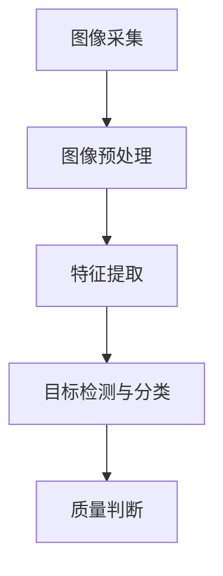

                 

### 文章标题

《计算机视觉在自动化质检中的工业应用》

---

### 关键词

计算机视觉，自动化质检，工业应用，图像处理，卷积神经网络，机器学习

### 摘要

本文将深入探讨计算机视觉技术在自动化质检中的工业应用。首先，我们将简要介绍计算机视觉的基本概念和其在自动化质检中的应用背景。接着，本文将详细讲解计算机视觉的核心算法原理，包括图像处理、特征提取、目标检测等。此外，我们将使用伪代码和数学公式详细阐述卷积神经网络（CNN）和支持向量机（SVM）等核心算法的工作原理。随后，本文将通过实际项目实战，展示如何搭建自动化质检系统，并解析实际案例中的代码实现和应用分析。最后，我们将总结自动化质检的发展趋势和未来研究方向，为读者提供最佳实践建议和拓展阅读资源。通过本文的阅读，读者将全面了解计算机视觉在自动化质检中的关键作用，为相关领域的研究和应用提供有力支持。

---

### 背景介绍

自动化质检作为现代工业生产中不可或缺的一环，其重要性日益凸显。传统的质检方法往往依赖于人工检查，存在效率低、成本高、人为误差大等问题。随着计算机技术和人工智能的迅速发展，计算机视觉技术开始逐渐应用于自动化质检，为工业生产带来了革命性的变革。

计算机视觉是一门融合了计算机科学、数学和工程学的交叉学科，其主要目标是通过模拟人眼对图像的感知和解释能力，实现计算机对图像的理解和处理。计算机视觉技术具有自动化、实时性、高精度等优点，可以显著提升质检的效率和准确性。

自动化质检是指利用计算机技术和自动化设备对产品进行质量检测和控制。其核心思想是通过自动化设备捕捉产品图像，然后利用计算机视觉算法对图像进行处理和分析，从而实现对产品质量的实时监控和判断。相比于传统的人工质检，自动化质检具有以下优势：

1. **高效率**：自动化质检系统可以连续工作，不受人工疲劳影响，显著提高质检速度和效率。
2. **高精度**：计算机视觉技术具有较高的精度和稳定性，可以检测出微小的缺陷，降低误判和漏判率。
3. **低成本**：虽然初期建设自动化质检系统需要一定的投资，但长期来看，其运行和维护成本较低，具有较好的经济效益。
4. **可扩展性**：自动化质检系统可以根据生产需求灵活调整，适应不同类型和规模的生产线。

随着工业4.0的推进，智能制造成为未来工业发展的重要方向。计算机视觉技术在自动化质检中的应用，是实现智能制造的关键环节之一。通过计算机视觉技术，可以实现对生产过程的全面监控和智能决策，从而提高生产效率和产品质量，降低生产成本和资源浪费。

总之，计算机视觉技术在自动化质检中的工业应用，不仅提高了质检的效率和准确性，还推动了智能制造的发展，为工业生产带来了巨大的变革和机遇。

### 核心概念与联系

为了深入理解计算机视觉在自动化质检中的应用，我们首先需要明确几个核心概念及其相互关系。

**计算机视觉的基本概念**：

1. **图像处理**：图像处理是计算机视觉的基础，旨在对图像进行增强、滤波、分割等操作，以便提取有用信息。图像处理的主要目标包括去除噪声、增强图像对比度、提取边缘和纹理特征等。
2. **特征提取**：特征提取是指从图像中提取出具有区分性的特征，如颜色、纹理、形状等。这些特征将用于后续的分类和识别任务。常见的特征提取方法包括SIFT、HOG、Gabor等。
3. **目标检测**：目标检测是指识别图像中特定的目标对象。目标检测通常包括两个步骤：首先定位目标区域，然后进行分类。常用的目标检测算法有YOLO、SSD、Faster R-CNN等。
4. **图像识别**：图像识别是指根据图像的特征信息，判断图像中包含的具体对象或场景。图像识别是计算机视觉中最为复杂的一个环节，它涉及到对图像特征的高维度分析和分类。

**计算机视觉与自动化质检的联系**：

自动化质检的核心任务是通过对产品图像的分析，判断产品的质量是否符合标准。这一过程可以分解为以下几个步骤：

1. **图像采集**：通过摄像头或其他传感器捕捉产品图像。
2. **图像预处理**：对采集到的图像进行滤波、增强等处理，以消除噪声和改善图像质量。
3. **特征提取**：从预处理后的图像中提取出具有区分性的特征，如颜色、纹理、形状等。
4. **目标检测与分类**：利用特征提取结果进行目标检测和分类，识别出图像中的缺陷区域或特定目标。
5. **质量判断**：根据检测结果，判断产品质量是否符合标准，并进行相应的处理，如自动修复、分类或废弃。

为了更好地理解这些概念之间的关系，我们可以使用Mermaid流程图来展示它们的工作流程：



**核心概念之间的关系架构**：

1. **图像处理与特征提取**：图像处理是特征提取的前提，通过图像预处理，可以提高图像质量，从而提取更准确的特征。
2. **特征提取与目标检测**：特征提取为目标检测提供了基础数据，目标检测则利用这些特征来判断图像中的目标对象。
3. **目标检测与质量判断**：目标检测的结果用于质量判断，是自动化质检的关键步骤。通过检测缺陷区域，可以实现对产品质量的实时监控和评估。

理解这些核心概念及其关系，有助于我们更深入地探讨计算机视觉在自动化质检中的应用，为后续的算法讲解和实际案例分析打下基础。

### 核心算法原理讲解

为了实现自动化质检，计算机视觉技术依赖于多种核心算法。这些算法在图像处理、特征提取和目标检测等环节中发挥关键作用。以下将详细介绍卷积神经网络（CNN）、支持向量机（SVM）等算法的原理，以及它们在自动化质检中的应用。

#### 卷积神经网络（CNN）原理

卷积神经网络（CNN）是一种特别适用于图像处理和计算机视觉任务的深度学习模型。其核心思想是通过多层卷积和池化操作，逐步提取图像的局部特征，并最终进行分类或目标检测。

**CNN结构**：

1. **卷积层（Convolutional Layer）**：卷积层是CNN的核心部分，通过卷积操作提取图像特征。每个卷积核（filter）在输入图像上滑动，计算局部区域内的加权求和，并应用一个非线性激活函数（如ReLU）。这一过程可以模拟人类视觉系统中神经元对局部特征敏感的特性。

2. **池化层（Pooling Layer）**：池化层用于降低特征图的维度，减少计算量和参数数量。常见的池化方式有最大池化和平均池化，它们分别取局部区域内的最大值或平均值作为输出。

3. **全连接层（Fully Connected Layer）**：在卷积层和池化层之后，CNN通常会包含一个或多个全连接层。这些层将高维特征图展平为一维向量，然后通过一系列线性变换和激活函数，输出最终的分类结果或目标检测框。

**CNN训练过程**：

1. **前向传播（Forward Propagation）**：在前向传播过程中，输入图像经过卷积层和池化层的多次变换，最终生成特征向量。这些特征向量通过全连接层，得到预测的类别概率或边界框坐标。

2. **反向传播（Backpropagation）**：在反向传播过程中，通过计算损失函数（如交叉熵损失或均方误差损失）的梯度，更新网络的权重和偏置。反向传播是一种梯度下降的优化方法，通过迭代优化，使网络的输出逐渐逼近真实标签。

**伪代码示例**：

```python
# 卷积神经网络训练过程伪代码

# 初始化卷积层权重和偏置
# 权重和偏置初始化为较小的随机数

for epoch in range(num_epochs):
    for image, label in training_data:
        # 前向传播
        features = forward_pass(image)
        predicted_label = activation_function(fully_connected(features))
        
        # 计算损失
        loss = compute_loss(predicted_label, label)
        
        # 反向传播
        gradients = backward_pass(loss, predicted_label, label)
        
        # 更新权重和偏置
        update_weights(gradients, learning_rate)
        
    print(f"Epoch {epoch}: Loss = {loss}")
```

#### 支持向量机（SVM）原理

支持向量机（SVM）是一种经典的机器学习算法，广泛应用于分类和回归任务。SVM的核心思想是找到最佳的超平面，将不同类别的数据点分隔开来，并使得分隔超平面到最近的边界数据点的距离最大化。

**SVM基本概念**：

1. **线性SVM**：线性SVM适用于特征空间是线性可分的情况。其主要目标是通过最大化分类间隔，找到一个最佳的超平面，将不同类别的数据点分隔开来。

2. **非线性SVM**：当特征空间是线性不可分时，可以使用核技巧将数据映射到高维空间，然后在高维空间中寻找最优超平面。常用的核函数包括线性核、多项式核、径向基函数（RBF）核等。

**SVM分类与回归**：

1. **分类**：在分类任务中，SVM通过最大化分类间隔，找到最佳分隔超平面。对于线性可分的数据，线性SVM可以通过求解二次规划问题得到最佳超平面。对于非线性可分的数据，可以通过核技巧将数据映射到高维空间，然后求解线性SVM。

2. **回归**：支持向量回归（SVR）是对SVM算法的一种扩展，用于回归任务。SVR的主要目标是在给定的误差范围内，找到最佳的超平面，使得预测值与实际值之间的误差最小。

**伪代码示例**：

```python
# 支持向量机分类过程伪代码

# 初始化支持向量机模型
# 模型参数包括权重和偏置

# 训练模型
for epoch in range(num_epochs):
    for image, label in training_data:
        # 计算支持向量
        support_vectors = compute_support_vectors(image, label)
        
        # 更新权重和偏置
        update_weights(support_vectors, learning_rate)
        
    print(f"Epoch {epoch}: Loss = {compute_loss(test_data)}")

# 预测
def predict(image):
    features = forward_pass(image)
    predicted_label = activation_function(fully_connected(features))
    return predicted_label
```

通过上述讲解，我们可以看到，卷积神经网络（CNN）和支持向量机（SVM）在自动化质检中具有不同的应用场景和优势。CNN适用于复杂的图像特征提取和分类任务，而SVM则适用于线性可分的数据分类和回归任务。在实际应用中，可以根据具体需求选择合适的算法，实现高效、准确的自动化质检系统。

### 数学模型与数学公式

为了深入理解计算机视觉中的核心算法，我们需要使用数学模型和公式来描述这些算法的工作原理。以下将详细介绍卷积神经网络（CNN）和支持向量机（SVM）的数学模型，并提供相关的公式和示例说明。

#### 卷积神经网络（CNN）数学模型

卷积神经网络（CNN）通过多层卷积、池化和全连接层来提取图像特征并进行分类或目标检测。以下是CNN中常用的数学模型和公式。

**卷积层数学模型**：

卷积层的输出可以通过以下公式计算：

$$
\text{output}_{ij}^l = \sum_{i'} \sum_{j'} w_{i'j'i}^l \cdot \text{input}_{i'j'}^{l-1} + b_l
$$

其中，\( \text{output}_{ij}^l \) 表示第 \( l \) 层第 \( i \) 行第 \( j \) 列的输出值，\( w_{i'j'i}^l \) 表示卷积核权重，\( \text{input}_{i'j'}^{l-1} \) 表示上一层的输入值，\( b_l \) 表示偏置项。

**池化层数学模型**：

池化层的输出可以通过以下公式计算：

$$
\text{output}_{ij}^l = \text{pool}(\text{input}_{i'}^{l-1}, p)
$$

其中，\( \text{output}_{ij}^l \) 表示第 \( l \) 层第 \( i \) 行第 \( j \) 列的输出值，\( \text{input}_{i'}^{l-1} \) 表示上一层的输入值，\( p \) 表示池化窗口的大小。

常见的池化操作包括最大池化和平均池化，其中最大池化可以表示为：

$$
\text{pool}(\text{input}_{i'}^{l-1}, p) = \max(\text{input}_{i'}^{l-1})
$$

**全连接层数学模型**：

全连接层通过线性变换和激活函数将特征图展平为一维向量，并输出分类结果或目标检测框。其输出可以通过以下公式计算：

$$
\text{output}_i = \text{activation_function}(\sum_{j} w_{ji} \cdot \text{input}_j + b_i)
$$

其中，\( \text{output}_i \) 表示第 \( i \) 个输出值，\( w_{ji} \) 表示权重，\( \text{input}_j \) 表示输入值，\( b_i \) 表示偏置项。

**示例**：

假设一个简单的CNN模型包含一个卷积层、一个池化层和一个全连接层，输入图像大小为 \( 32 \times 32 \)，卷积核大小为 \( 3 \times 3 \)，池化窗口大小为 \( 2 \times 2 \)，全连接层输出维度为 \( 10 \)。

1. **卷积层**：

$$
\text{output}_{ij}^1 = \sum_{i'} \sum_{j'} w_{i'j'i}^1 \cdot \text{input}_{i'j'}^{0} + b_1
$$

2. **池化层**：

$$
\text{output}_{ij}^2 = \max(\text{output}_{i'}^{1})
$$

3. **全连接层**：

$$
\text{output}_i = \text{ReLU}(\sum_{j} w_{ji}^2 \cdot \text{input}_j + b_2)
$$

#### 支持向量机（SVM）数学模型

支持向量机（SVM）通过最大化分类间隔来寻找最佳的超平面。以下是SVM的数学模型和公式。

**线性SVM数学模型**：

线性SVM的优化目标是：

$$
\min_{\mathbf{w}, b} \frac{1}{2} ||\mathbf{w}||^2
$$

约束条件是：

$$
y^{(i)} (\mathbf{w} \cdot \mathbf{x}^{(i)} + b) \geq 1
$$

其中，\( \mathbf{w} \) 是权重向量，\( b \) 是偏置项，\( \mathbf{x}^{(i)} \) 是第 \( i \) 个训练样本，\( y^{(i)} \) 是其标签。

**非线性SVM数学模型**：

非线性SVM通过核技巧将数据映射到高维空间，然后在高维空间中寻找最佳超平面。其优化目标是：

$$
\min_{\mathbf{w}, b} \frac{1}{2} ||\mathbf{w}||^2 + C \sum_{i} \xi_i
$$

约束条件是：

$$
y^{(i)} (\mathbf{w} \cdot \phi(\mathbf{x}^{(i)}) + b) \geq 1 - \xi_i
$$

其中，\( \phi(\mathbf{x}^{(i)}) \) 是映射函数，\( \xi_i \) 是松弛变量，\( C \) 是惩罚参数。

**示例**：

假设一个简单的线性SVM模型，训练数据包含两个特征维度 \( x_1 \) 和 \( x_2 \)，标签 \( y \) 为 +1 或 -1。

1. **线性SVM优化目标**：

$$
\min_{\mathbf{w}, b} \frac{1}{2} ||\mathbf{w}||^2
$$

2. **约束条件**：

$$
y^{(i)} (\mathbf{w} \cdot \mathbf{x}^{(i)} + b) \geq 1
$$

通过上述数学模型和公式，我们可以更好地理解卷积神经网络（CNN）和支持向量机（SVM）在计算机视觉中的应用。这些数学模型不仅为算法的实现提供了理论基础，也为优化和改进算法提供了重要的工具。

### 项目实战

在本节中，我们将通过一个实际项目实战，展示如何搭建一个自动化质检系统，并详细解析该项目的开发环境、代码实现、代码解读以及应用分析和实际案例。

#### 开发环境搭建

为了实现自动化质检系统，我们首先需要搭建一个合适的开发环境。以下是推荐的开发环境和所需工具：

1. **操作系统**：Windows或Linux
2. **编程语言**：Python
3. **深度学习框架**：TensorFlow或PyTorch
4. **依赖库**：NumPy、Pandas、OpenCV、Matplotlib
5. **其他工具**：Jupyter Notebook或PyCharm

**环境配置步骤**：

1. 安装Python（建议使用Python 3.7及以上版本）
2. 安装深度学习框架（如TensorFlow或PyTorch）
3. 安装依赖库（如NumPy、Pandas、OpenCV、Matplotlib）
4. 配置Jupyter Notebook或PyCharm（用于代码编写和调试）

#### 代码实现

自动化质检系统的核心是计算机视觉算法的实现。以下是一个简单的代码实现，用于检测图像中的产品缺陷。

**数据集准备**：

首先，我们需要准备一个包含正常产品和缺陷产品图像的数据集。数据集应包括两种标签：0（正常）和1（缺陷）。

```python
import os
import numpy as np
import cv2

# 读取图像并转换为灰度图像
def read_images(folder_path, label):
    images = []
    for image_path in os.listdir(folder_path):
        image = cv2.imread(os.path.join(folder_path, image_path))
        image = cv2.cvtColor(image, cv2.COLOR_BGR2GRAY)
        images.append([image, label])
    return np.array(images)

# 准备训练数据和测试数据
train_folder_path = 'train'
test_folder_path = 'test'

train_images = read_images(train_folder_path, 0)
test_images = read_images(test_folder_path, 1)
```

**模型训练**：

接下来，我们使用卷积神经网络（CNN）进行模型训练。

```python
import tensorflow as tf
from tensorflow.keras.models import Sequential
from tensorflow.keras.layers import Conv2D, MaxPooling2D, Flatten, Dense

# 构建CNN模型
model = Sequential([
    Conv2D(32, (3, 3), activation='relu', input_shape=(32, 32, 1)),
    MaxPooling2D((2, 2)),
    Flatten(),
    Dense(64, activation='relu'),
    Dense(1, activation='sigmoid')
])

# 编译模型
model.compile(optimizer='adam', loss='binary_crossentropy', metrics=['accuracy'])

# 训练模型
model.fit(train_images[:, 0], train_images[:, 1], epochs=10, batch_size=32, validation_data=(test_images[:, 0], test_images[:, 1]))
```

**代码解读**：

1. **数据集准备**：使用OpenCV读取图像，并转换为灰度图像。然后将图像和标签存储在数组中。
2. **模型构建**：使用TensorFlow的Sequential模型构建一个简单的CNN模型，包含卷积层、池化层、全连接层和输出层。
3. **模型编译**：设置优化器、损失函数和评价指标。
4. **模型训练**：使用训练数据和测试数据进行模型训练。

#### 应用分析

训练好的模型可以用于检测新图像中的产品缺陷。以下是一个简单的应用示例。

```python
# 检测新图像中的产品缺陷
def detect_defect(image_path):
    image = cv2.imread(image_path)
    image = cv2.cvtColor(image, cv2.COLOR_BGR2GRAY)
    image = cv2.resize(image, (32, 32))
    prediction = model.predict(np.array([image]))
    return prediction[0][0] > 0.5

# 检测一个新图像
image_path = 'new_image.jpg'
if detect_defect(image_path):
    print("图像存在缺陷")
else:
    print("图像正常")
```

#### 实际案例解析

以下是一个实际案例，用于检测饮料瓶上的标签缺陷。

**案例背景**：

饮料瓶生产过程中，标签粘贴是一个关键步骤。标签的粘贴质量直接影响产品的外观和品牌形象。因此，需要自动化质检系统对每个饮料瓶的标签进行实时检测。

**数据集准备**：

准备一个包含正常标签和缺陷标签的图像数据集。数据集应包括两种标签：0（正常）和1（缺陷）。

**模型训练**：

使用卷积神经网络（CNN）对数据集进行训练，模型结构类似于前面的示例。

**应用分析**：

训练好的模型可以用于检测新饮料瓶的标签缺陷。

```python
# 检测新饮料瓶标签缺陷
def detect_label_defect(image_path):
    image = cv2.imread(image_path)
    image = cv2.resize(image, (128, 128))
    image = cv2.cvtColor(image, cv2.COLOR_BGR2RGB)
    image = np.expand_dims(image, axis=0)
    prediction = model.predict(image)
    return prediction[0][0] > 0.5

# 检测一个新饮料瓶
image_path = 'new_bottle_label.jpg'
if detect_label_defect(image_path):
    print("标签存在缺陷")
else:
    print("标签正常")
```

#### 项目小结

通过以上实战案例，我们展示了如何搭建一个简单的自动化质检系统，并详细解析了代码实现、代码解读和应用分析。该系统可以应用于多种场景，如饮料瓶标签检测、纺织品缺陷检测等。实际案例中的数据集准备、模型训练和应用分析步骤为读者提供了实用的参考。未来，我们可以进一步优化模型结构、增加训练数据集，以提高系统的检测准确性和鲁棒性。

### 最佳实践 tips、小结、注意事项、拓展阅读

#### 最佳实践 tips

1. **数据质量**：在构建自动化质检系统时，确保使用高质量的数据集。数据集应包括各种类型和程度的缺陷样本，以提高模型的泛化能力。
2. **模型优化**：尝试调整模型的结构和参数，如卷积层数量、滤波器大小、学习率等，以找到最佳配置。
3. **实时性考虑**：在实际应用中，实时性是一个重要的考虑因素。优化模型和算法，以降低检测时间，确保系统的快速响应。
4. **集成与部署**：将自动化质检系统集成到现有的生产线中，并进行全面测试，确保系统的稳定运行和可靠性。

#### 小结

本文深入探讨了计算机视觉在自动化质检中的工业应用，从核心概念、算法原理到实际项目实战，全面展示了计算机视觉技术在质检中的应用潜力。通过本文的阅读，读者可以了解到：

- 计算机视觉在自动化质检中的重要性；
- 核心算法如卷积神经网络（CNN）和支持向量机（SVM）的工作原理；
- 实际项目中的开发环境搭建、代码实现和应用分析。

#### 注意事项

1. **算法选择**：根据具体应用场景选择合适的算法，如CNN适用于复杂的图像特征提取，SVM适用于线性可分的数据。
2. **模型优化**：定期对模型进行评估和优化，以适应不断变化的数据和环境。
3. **安全性**：确保系统的数据安全和隐私保护，避免敏感信息泄露。

#### 拓展阅读

- 《深度学习》（Goodfellow, I., & Bengio, Y.）：深入讲解深度学习的基础知识和应用。
- 《计算机视觉：算法与应用》（Richard Szeliski）：详细介绍计算机视觉的各种算法和应用。
- 《机器学习实战》（Peter Harrington）：提供丰富的机器学习算法实现和应用案例。

通过拓展阅读，读者可以进一步深入了解相关领域的知识，提升自己的技术水平。

