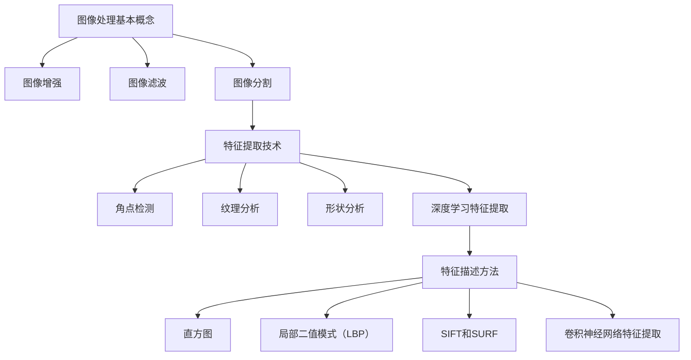
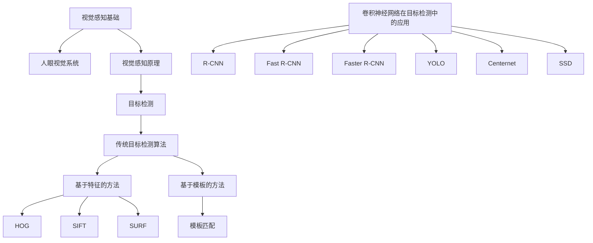
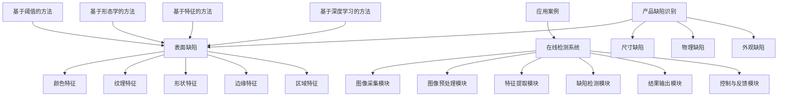
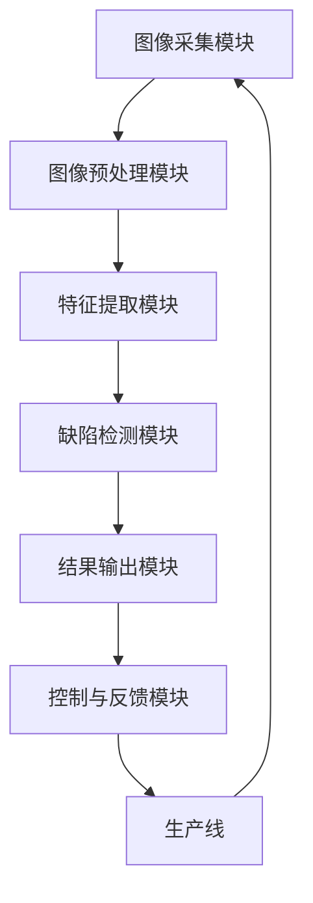
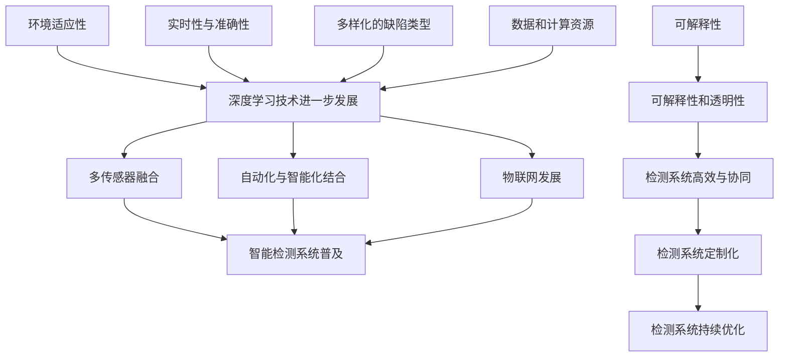

                 


### 1.1 计算机视觉简介

#### 1.1.1 计算机视觉的定义与基本任务

**定义**：计算机视觉是一门跨学科的研究领域，旨在使计算机能够理解和解释数字图像或视频中的信息。它模仿人类视觉系统的某些功能，如识别物体、理解场景、估计距离等。

**基本任务**：

1. **图像识别**：确定图像中的特定对象或场景，如人脸识别、车牌识别等。
2. **图像分类**：将图像根据其内容或属性分类，如将图片分为“动物”和“植物”两类。
3. **目标检测**：在图像中识别并定位多个对象，同时提供每个对象的边界框和类别标签。
4. **跟踪**：在视频序列中跟踪单个对象，如车辆跟踪、行人跟踪等。
5. **图像恢复**：从受损或低质量的图像中恢复清晰的图像，如去噪、去模糊等。

#### 1.1.2 计算机视觉的历史与发展

**早期研究**：

- **20世纪60年代**：基于规则的方法开始出现，如边缘检测、角点检测等。
- **20世纪70年代**：霍普菲尔德网络（Hopfield Network）和感知机（Perceptron）等人工神经网络被用于图像识别。

**里程碑**：

- **20世纪90年代**：特征提取和匹配技术得到广泛应用，如SIFT（尺度不变特征变换）和SURF（加速稳健特征）。
- **21世纪初**：神经网络技术在计算机视觉中取得突破性进展，如LeNet、AlexNet等卷积神经网络（CNN）。

**当前趋势**：

- **深度学习**：基于深度神经网络的算法在图像识别、目标检测、图像生成等领域表现出色。
- **端到端学习**：通过端到端的学习方式，直接从原始图像中学习特征表示，简化了传统方法中的预处理和特征提取步骤。

#### 1.1.3 计算机视觉的应用领域

- **工业**：自动化质量检测、生产线监控、缺陷识别等。
- **医疗**：医学影像分析、病理切片识别、远程医疗等。
- **农业**：作物病虫害检测、生长状态监测、农田管理等。
- **交通**：自动驾驶、交通流量监测、交通信号识别等。
- **安防**：人脸识别、视频监控、异常行为检测等。

### 1.2 自动化质量检测概述

#### 1.2.1 自动化质量检测的定义与重要性

**定义**：自动化质量检测是一种利用传感器、计算机技术以及自动化设备对产品进行质量检测的过程。它包括数据采集、数据处理、质量判定等多个环节。

**重要性**：

- 提高生产效率：自动化检测可以大大减少检测时间，提高生产效率。
- 减少人工干预：通过自动化检测，减少对人工的依赖，降低劳动力成本。
- 提高产品质量：自动化检测可以更精确地检测产品缺陷，提高产品质量。

#### 1.2.2 自动化质量检测的发展历程

**手工检测**：

- 依赖人工进行检测，效率低，易出错。
- 主要采用简单的测量工具和仪器。

**自动化检测**：

- 引入传感器和计算机技术，实现自动化的质量检测。
- 检测流程更加高效，检测结果更加准确。

**智能检测**：

- 结合计算机视觉技术，实现更高层次的质量检测。
- 能够识别复杂的缺陷和异常情况。

#### 1.2.3 自动化质量检测的基本流程

1. **数据采集**：利用传感器、摄像头等设备获取产品图像或数据。
2. **数据预处理**：对采集到的数据进行处理，如去噪、增强等。
3. **特征提取**：从预处理后的数据中提取关键特征。
4. **缺陷识别**：利用算法对提取的特征进行分析，识别产品缺陷。
5. **质量判定**：根据检测结果对产品质量进行判定。

### 1.3 计算机视觉在自动化质量检测中的应用前景

#### 1.3.1 应用领域

**制造业**：

- 产品表面缺陷检测：利用计算机视觉技术检测产品表面的划痕、裂纹等缺陷。
- 尺寸测量：通过对产品图像进行分析，精确测量产品的尺寸。
- 外观评估：评估产品的外观质量，如颜色、纹理等。

**医疗领域**：

- 医学影像分析：对医学影像进行分析，辅助医生进行诊断。
- 病理切片识别：利用计算机视觉技术对病理切片进行分析，辅助病理医生进行诊断。

**农业**：

- 作物病虫害检测：利用计算机视觉技术识别作物上的病虫害。
- 生长状态监测：通过对农作物图像进行分析，监测农作物的生长状态。

**交通领域**：

- 自动驾驶：利用计算机视觉技术实现自动驾驶功能。
- 交通流量监测：通过对视频数据进行分析，监测交通流量和拥堵情况。

**安防领域**：

- 人脸识别：利用计算机视觉技术进行人脸识别，实现安防监控。
- 视频监控：通过对视频数据进行分析，识别异常行为和事件。

#### 1.3.2 未来发展趋势

**技术创新**：

- 深度学习技术的进一步发展，提高检测准确性和效率。
- 多传感器融合技术，提高检测的精度和可靠性。

**应用场景扩展**：

- 在更多的行业和领域中推广计算机视觉技术在质量检测中的应用。
- 开发适用于各种环境和场景的自动化质量检测系统。

## 第2章 计算机视觉基本概念

### 2.1 图像处理基础

#### 2.1.1 图像基本概念

**图像**：图像是描述空间中物体形态和颜色分布的一种信息表示方式。在计算机视觉中，图像通常用二维矩阵表示，每个元素代表图像中的一个像素点。

**像素**：像素是图像的基本单位，表示图像中最小的可识别元素。像素的取值通常是一个颜色值，如RGB值。

**分辨率**：分辨率表示图像的清晰程度，通常用水平和垂直像素数表示，如800x600表示水平800像素，垂直600像素的图像。

**颜色模型**：颜色模型用于描述图像的颜色信息，常用的颜色模型包括RGB（红绿蓝）、HSV（色相、饱和度、亮度）和CMYK（青、品红、黄、黑）等。

**灰度图像**：灰度图像只包含灰度信息，每个像素的颜色值用一个灰度值表示，灰度值通常在0（黑色）到255（白色）之间。

**彩色图像**：彩色图像包含红、绿、蓝三个颜色通道，每个通道的像素值代表该颜色在像素中的强度。

#### 2.1.2 图像处理算法

**图像增强**：图像增强是通过改变图像的亮度和对比度，使得图像中的某些特征更加明显，从而提高图像的质量。常用的图像增强算法包括直方图均衡化、对比度拉伸等。

**图像滤波**：图像滤波用于去除图像中的噪声，改善图像的质量。常用的图像滤波算法包括均值滤波、高斯滤波和中值滤波等。

**图像分割**：图像分割是将图像划分为多个区域，每个区域代表图像中的一个对象或背景。常用的图像分割算法包括阈值分割、区域生长和边缘检测等。

**特征提取**：特征提取是从图像中提取出能够描述图像内容的关键特征，如边缘、角点、纹理等。特征提取是实现图像识别和分类的关键步骤。

**特征匹配**：特征匹配是将图像A中的特征与图像B中的特征进行匹配，以确定图像A和图像B之间的相似性。常用的特征匹配算法包括SIFT（尺度不变特征变换）和SURF（加速稳健特征）等。

### 2.2 特征提取与描述

#### 2.2.1 特征提取技术

**边缘检测**：边缘检测是图像处理中的一种基本算法，用于检测图像中的边缘。常用的边缘检测算法包括Canny算法、Sobel算法和Prewitt算法等。

**角点检测**：角点检测是用于检测图像中的角点，即图像中亮度变化明显的点。常用的角点检测算法包括Harris角点检测和Shi-Tomasi角点检测等。

**纹理分析**：纹理分析是用于分析图像中的纹理信息，如纹理的方向、强度和排列等。常用的纹理分析算法包括LBP（局部二值模式）和Gabor变换等。

**形状分析**：形状分析是用于分析图像中的形状特征，如形状的对称性、闭合性等。常用的形状分析算法包括Hu不变矩和Zernike矩等。

**深度学习特征提取**：深度学习特征提取是利用深度神经网络从图像中自动提取具有区分性的特征。常用的深度学习模型包括卷积神经网络（CNN）和生成对抗网络（GAN）等。

#### 2.2.2 特征描述方法

**直方图**：直方图是一种常用的特征描述方法，用于描述图像的颜色分布。对于灰度图像，直方图表示每个灰度值出现的频率；对于彩色图像，直方图通常表示每个颜色通道的分布。

**局部二值模式（LBP）**：局部二值模式是一种用于描述图像纹理的特征描述方法。LBP描述了图像在某个邻域内像素的相对亮暗关系，具有旋转不变性。

**SIFT和SURF**：SIFT（尺度不变特征变换）和SURF（加速稳健特征）是两种常用的特征提取和描述算法。它们都能够提取出在尺度上不变、旋转不变的显著特征点，并对其进行描述。

**卷积神经网络特征提取**：卷积神经网络（CNN）是一种深度学习模型，用于自动提取图像中的高层次特征。通过训练，CNN能够从大量数据中学习到具有区分性的特征表示。

### Mermaid 流程图



## 第3章 计算机视觉算法原理

### 3.1 视觉感知基础

#### 3.1.1 人眼视觉系统

人眼视觉系统是自然界中最复杂和最精确的信息处理系统之一。它由多个部分组成，包括角膜、晶状体、视网膜、视神经等。

**角膜**：角膜是眼球的前部透明层，它主要起到折射光线的作用。

**晶状体**：晶状体位于眼球的中央，它的形状可以通过睫状肌的收缩和放松来改变，从而实现焦距的调整。

**视网膜**：视网膜是眼球内壁的一层薄膜，它包含大量的感光细胞，如视杆细胞和视锥细胞。视杆细胞主要负责感知光线和黑暗，而视锥细胞则负责感知颜色和细节。

**视神经**：视神经将视网膜接收到的信息传递到大脑，大脑对这些信息进行处理，形成我们所看到的视觉图像。

#### 3.1.2 视觉感知原理

视觉感知是大脑处理和分析视网膜接收到的信息的过程。以下是一些关键概念：

**亮度感知**：亮度感知是指我们对光强差异的感知。大脑通过比较不同区域的光强差异来感知亮度。

**颜色感知**：颜色感知是指我们对颜色差异的感知。人眼有三种类型的视锥细胞，分别对红、绿、蓝三种颜色敏感。大脑通过这三种颜色的组合来感知颜色。

**深度感知**：深度感知是指我们对物体距离和相对位置的感知。大脑通过比较物体在视网膜上的位置、大小和亮度变化来感知深度。

**运动感知**：运动感知是指我们对物体运动的感知。大脑通过分析物体在视网膜上的位移来感知运动。

### 3.2 目标检测

#### 3.2.1 传统目标检测算法

传统目标检测算法主要包括基于特征的方法和基于模板的方法。

**基于特征的方法**：

- **HOG（Histogram of Oriented Gradients）**：HOG算法通过计算图像中每个像素的梯度方向和强度，生成梯度直方图，从而提取出具有方向性的特征。
- **SIFT（Scale-Invariant Feature Transform）**：SIFT算法通过在图像中寻找关键点，并计算这些关键点的特征向量，从而实现对图像的描述。
- **SURF（Speeded Up Robust Features）**：SURF算法是对SIFT算法的加速版，它通过优化算法效率来提高处理速度。

**基于模板的方法**：

- **模板匹配**：模板匹配是通过将模板图像与待检测图像进行相似度计算，来识别目标的方法。常用的模板匹配算法包括相关系数匹配、直方图匹配等。

#### 3.2.2 卷积神经网络在目标检测中的应用

卷积神经网络（CNN）在目标检测领域取得了显著的成果。以下是一些常用的CNN目标检测算法：

**R-CNN（Region-based CNN）**：

- **R-CNN**：R-CNN是一种基于区域的目标检测算法。它首先使用选择性搜索算法（Selective Search）提取出图像中的区域，然后对每个区域使用CNN进行特征提取，最后通过分类器判断区域是否包含目标。
- **Fast R-CNN**：Fast R-CNN对R-CNN进行了优化，它将候选区域提取和特征提取合并为一个网络，从而提高了检测速度。
- **Faster R-CNN**：Faster R-CNN引入了区域建议网络（Region Proposal Network，RPN），它可以在特征图上直接生成区域建议，从而大大提高了检测速度。

**YOLO（You Only Look Once）**：

- **YOLO V1-V3**：YOLO系列算法是一种单步目标检测算法。它将目标检测任务转换为对图像中每个像素点是否包含目标的二分类问题，从而实现了高效的目标检测。
- **Centernet**：Centernet是一种基于中心点的目标检测算法。它通过在特征图上预测目标中心点和尺寸，然后通过回归网络调整预测结果。

**SSD（Single Shot MultiBox Detector）**：

- **SSD**：SSD是一种单步目标检测算法，它通过在不同尺度的特征图上预测目标位置和类别，从而实现了高精度的目标检测。

### Mermaid 流�程图



## 第4章 自动化质量检测中的计算机视觉应用

### 4.1 在线检测系统

#### 4.1.1 检测系统的构成

在线检测系统是自动化质量检测中的重要组成部分，它主要由以下几个部分构成：

**图像采集模块**：该模块负责实时采集待检测物体的图像，通常使用高速摄像头或摄像头阵列。

**图像预处理模块**：该模块对采集到的图像进行预处理，如去噪、增强、对比度调整等，以提高图像质量。

**特征提取模块**：该模块从预处理后的图像中提取关键特征，如边缘、角点、纹理等，为后续的缺陷检测提供基础。

**缺陷检测模块**：该模块利用机器学习或深度学习算法对提取的特征进行分析，识别产品表面的缺陷，如划痕、裂纹、斑点等。

**结果输出模块**：该模块将检测结果以可视化或数据形式输出，如生成缺陷报告、发出警报等。

**控制与反馈模块**：该模块用于与生产线控制系统进行交互，根据检测结果调整生产过程，如停机、调整工艺参数等。

#### 4.1.2 检测流程与原理

在线检测系统的工作流程通常包括以下几个步骤：

1. **图像采集**：使用高速摄像头或摄像头阵列实时采集待检测物体的图像。

2. **图像预处理**：对采集到的图像进行预处理，如去噪、增强、对比度调整等，以提高图像质量。

3. **特征提取**：从预处理后的图像中提取关键特征，如边缘、角点、纹理等。

4. **缺陷检测**：利用机器学习或深度学习算法对提取的特征进行分析，识别产品表面的缺陷。

5. **结果输出**：将检测结果以可视化或数据形式输出，如生成缺陷报告、发出警报等。

6. **控制与反馈**：根据检测结果调整生产过程，如停机、调整工艺参数等。

#### 4.1.3 系统优势与挑战

**系统优势**：

- 提高生产效率：在线检测系统能够实时检测产品缺陷，提高生产效率。
- 减少人工干预：通过自动化检测，减少对人工的依赖，降低劳动力成本。
- 提高产品质量：在线检测系统能够更精确地检测产品缺陷，提高产品质量。

**系统挑战**：

- 环境适应性：在线检测系统需要适应各种生产环境，如高温、高湿、强光等。
- 实时性与准确性：在线检测系统需要在保证实时性的同时，确保检测准确性。
- 维护与升级：在线检测系统需要定期维护和升级，以确保系统的稳定性和性能。

### 4.2 产品缺陷识别

#### 4.2.1 缺陷类型与特征

在自动化质量检测中，产品缺陷识别是一个关键任务。常见的缺陷类型包括以下几种：

1. **表面缺陷**：如划痕、裂纹、斑点、污点等。
2. **尺寸缺陷**：如尺寸偏差、形状不规则等。
3. **物理缺陷**：如脆裂、变形、空洞等。
4. **外观缺陷**：如颜色不均、纹理异常等。

为了有效地识别这些缺陷，需要从以下几个方面提取特征：

1. **颜色特征**：包括颜色的分布、均值、标准差等。
2. **纹理特征**：包括纹理的方向、强度、排列等。
3. **形状特征**：包括形状的面积、周长、圆度等。
4. **边缘特征**：包括边缘的长度、宽度、方向等。
5. **区域特征**：包括区域的连通性、封闭性等。

#### 4.2.2 缺陷检测算法

缺陷检测算法是实现产品缺陷识别的核心。以下是一些常用的缺陷检测算法：

1. **基于阈值的方法**：通过设定合适的阈值，将图像二值化，然后对二值图像进行分析，识别缺陷。
2. **基于形态学的方法**：使用形态学操作，如膨胀、腐蚀、开运算、闭运算等，对图像进行处理，提取缺陷。
3. **基于特征的方法**：从图像中提取形状、纹理、颜色等特征，然后利用机器学习或深度学习算法进行缺陷分类。
4. **基于深度学习的方法**：使用卷积神经网络（CNN）等深度学习模型，从原始图像中自动提取特征，进行缺陷识别。

#### 4.2.3 应用案例

以下是一个实际应用案例：

**项目背景**：某汽车制造厂在生产线中需要检测车身表面的划痕和污点，以提高产品质量。

**解决方案**：采用基于深度学习的在线检测系统，具体步骤如下：

1. **数据收集**：收集大量的车身表面缺陷图像，包括划痕、污点等，用于训练深度学习模型。
2. **模型训练**：使用卷积神经网络（CNN）对缺陷图像进行训练，提取特征，并建立缺陷分类模型。
3. **系统部署**：将训练好的模型部署到在线检测系统中，实时检测车身表面缺陷。
4. **结果输出**：将检测结果以可视化或数据形式输出，如生成缺陷报告、发出警报等。
5. **反馈与调整**：根据检测结果，调整生产过程，如停机、调整工艺参数等。

**效果评估**：经过实际应用，该在线检测系统有效提高了车身表面的质量，降低了缺陷率，提高了生产效率。

### Mermaid 流程图



## 第5章 计算机视觉在自动化质量检测中的应用实例

### 5.1 某公司自动化生产线的计算机视觉应用

#### 5.1.1 项目背景

某公司是一家大型电子制造商，其生产线需要对生产出的电子产品进行自动化质量检测。随着生产规模的不断扩大，传统的人工检测方式已无法满足生产需求，因此公司决定引入计算机视觉技术，以提高检测效率和质量。

#### 5.1.2 系统设计与实现

为了实现自动化质量检测，公司设计并部署了一套基于计算机视觉的在线检测系统，主要包括以下几个模块：

1. **图像采集模块**：使用高速摄像头实时采集电子产品图像。
2. **图像预处理模块**：对采集到的图像进行预处理，包括去噪、对比度增强、灰度化等操作。
3. **特征提取模块**：从预处理后的图像中提取关键特征，如边缘、角点、纹理等。
4. **缺陷检测模块**：利用机器学习算法对提取的特征进行分析，识别电子产品表面的缺陷，如划痕、裂纹、污点等。
5. **结果输出模块**：将检测结果以可视化或数据形式输出，包括缺陷图片、缺陷报告等。
6. **控制与反馈模块**：根据检测结果，对生产线进行实时调整，如停机、调整工艺参数等。

系统整体架构如下：



#### 5.1.3 技术方案与实现

**图像采集模块**：

- 选用高速摄像头，保证图像采集的实时性。
- 采用同步采集技术，确保图像和传感器数据的同步。

**图像预处理模块**：

- 使用中值滤波去除图像噪声。
- 使用对比度增强算法，提高图像的清晰度。
- 使用灰度化算法，将彩色图像转换为灰度图像，便于后续处理。

**特征提取模块**：

- 使用Canny算法提取图像的边缘特征。
- 使用SIFT算法提取图像的关键点特征。
- 使用LBP算法提取图像的纹理特征。

**缺陷检测模块**：

- 采用支持向量机（SVM）算法进行缺陷分类。
- 使用卷积神经网络（CNN）进行缺陷识别。
- 结合多种特征，提高检测准确率。

**结果输出模块**：

- 将检测结果以可视化形式展示，包括缺陷图片、缺陷报告等。
- 将检测结果以数据形式输出，包括缺陷类型、数量等。

**控制与反馈模块**：

- 根据检测结果，实时调整生产线参数，如停机、调整速度等。
- 将检测结果记录到数据库，用于生产数据分析和质量评估。

#### 5.1.4 代码实现与解读

以下是一个简单的缺陷检测模块的伪代码：

```python
import cv2
import numpy as np

# 加载训练好的模型
model = cv2.ml.SVM_create()
model.load('model svm.xml')

# 读取图像
image = cv2.imread('image.png', cv2.IMREAD_GRAYSCALE)

# 使用Canny算法提取边缘特征
edges = cv2.Canny(image, 100, 200)

# 使用SIFT算法提取关键点特征
sift = cv2.xfeatures2d.SIFT_create()
keypoints, descriptors = sift.detectAndCompute(edges, None)

# 将关键点特征转换为SVM所需的格式
descriptors = np.float32(descriptors)

# 使用SVM进行缺陷分类
ret, result = model.predict(descriptors)

# 判断检测结果，输出缺陷类型
if result == 1:
    print('检测到缺陷：划痕')
else:
    print('检测到缺陷：无')
```

此代码首先加载训练好的SVM模型，然后读取待检测的图像，使用Canny算法提取边缘特征，SIFT算法提取关键点特征。接着，将关键点特征转换为SVM所需的格式，使用SVM模型进行缺陷分类，并根据检测结果输出缺陷类型。

### 5.2 某产品自动质量检测系统案例

#### 5.2.1 项目需求

某电子产品制造商需要对其生产的产品进行自动化质量检测，以确保产品质量。具体需求包括：

1. **检测速度快**：能够实时检测生产线上产品的质量，不造成生产线的停工。
2. **检测准确率高**：能够准确识别产品表面的缺陷，如划痕、裂纹、斑点等。
3. **适应性强**：能够适应不同产品型号和生产线环境，确保检测系统的通用性。

#### 5.2.2 技术方案与实现

为了满足上述需求，公司采用了一套基于计算机视觉的自动质量检测系统，具体方案如下：

**1. 图像采集模块**：

- 采用高速摄像头，实现实时图像采集，确保检测的实时性。
- 配备多种类型的摄像头，以适应不同产品的检测需求。

**2. 图像预处理模块**：

- 使用图像增强算法，提高图像的对比度和清晰度。
- 使用图像滤波算法，去除图像噪声，提高图像质量。

**3. 特征提取模块**：

- 使用边缘检测算法，提取图像的边缘特征。
- 使用角点检测算法，提取图像的角点特征。
- 使用纹理分析算法，提取图像的纹理特征。

**4. 缺陷检测模块**：

- 采用深度学习算法，如卷积神经网络（CNN），对提取的特征进行训练，实现缺陷分类和识别。
- 结合多种特征，提高检测准确率。

**5. 结果输出模块**：

- 将检测结果以可视化形式展示，包括缺陷图片、缺陷报告等。
- 将检测结果以数据形式输出，包括缺陷类型、数量等。

**6. 控制与反馈模块**：

- 根据检测结果，实时调整生产线参数，如停机、调整速度等。
- 将检测结果记录到数据库，用于生产数据分析和质量评估。

#### 5.2.3 代码实现与解读

以下是一个简单的缺陷检测模块的伪代码：

```python
import cv2
import numpy as np

# 加载训练好的模型
model = cv2.ml.SVM_create()
model.load('model svm.xml')

# 读取图像
image = cv2.imread('image.png', cv2.IMREAD_GRAYSCALE)

# 使用Canny算法提取边缘特征
edges = cv2.Canny(image, 100, 200)

# 使用SIFT算法提取关键点特征
sift = cv2.xfeatures2d.SIFT_create()
keypoints, descriptors = sift.detectAndCompute(edges, None)

# 将关键点特征转换为SVM所需的格式
descriptors = np.float32(descriptors)

# 使用SVM进行缺陷分类
ret, result = model.predict(descriptors)

# 判断检测结果，输出缺陷类型
if result == 1:
    print('检测到缺陷：划痕')
else:
    print('检测到缺陷：无')
```

此代码首先加载训练好的SVM模型，然后读取待检测的图像，使用Canny算法提取边缘特征，SIFT算法提取关键点特征。接着，将关键点特征转换为SVM所需的格式，使用SVM模型进行缺陷分类，并根据检测结果输出缺陷类型。

### 5.2.4 实际案例分析与详细讲解剖析

以下是一个实际案例的分析与讲解：

**案例背景**：某电子产品制造公司生产的一款智能手机在生产过程中需要进行质量检测，以确保产品表面的缺陷如划痕、裂纹、斑点等不会影响到用户体验。

**检测过程**：

1. **图像采集**：使用高速摄像头实时采集手机表面图像。
2. **图像预处理**：对采集到的图像进行预处理，包括去噪、对比度增强、灰度化等操作，以提高图像质量。
3. **特征提取**：从预处理后的图像中提取边缘特征、角点特征和纹理特征。
4. **缺陷检测**：使用训练好的深度学习模型对提取的特征进行分析，识别手机表面的缺陷。
5. **结果输出**：将检测结果以可视化形式展示，包括缺陷图片、缺陷报告等。

**案例分析**：

1. **图像预处理**：通过对比度增强和去噪操作，使图像中的缺陷更加明显，提高检测准确性。
2. **特征提取**：通过边缘检测、角点检测和纹理分析，提取出能够有效描述缺陷的特征，如边缘的长度、宽度、方向等。
3. **缺陷检测**：使用卷积神经网络（CNN）对提取的特征进行训练，模型能够自动学习到缺陷的特征模式，提高检测准确率。
4. **结果输出**：通过可视化展示检测结果，使操作人员能够直观地了解产品的质量状况。

**讲解剖析**：

- **图像预处理**：图像预处理是质量检测的基础，它直接影响检测的准确性和效率。通过对图像进行对比度增强和去噪，可以提高图像的质量，使缺陷更加明显。
- **特征提取**：特征提取是检测算法的核心，它决定了算法对缺陷的识别能力。通过选择合适的特征提取算法，如边缘检测、角点检测和纹理分析，可以有效地描述缺陷的特征，提高检测准确性。
- **缺陷检测**：缺陷检测是通过训练好的模型对提取的特征进行分析，识别出缺陷。卷积神经网络（CNN）作为一种强大的深度学习模型，能够在大量数据训练下，自动学习到缺陷的特征模式，提高检测准确率。
- **结果输出**：结果输出是质量检测的最终环节，它使操作人员能够直观地了解产品的质量状况。通过可视化展示检测结果，如缺陷图片、缺陷报告等，可以帮助操作人员及时发现问题，采取相应的措施。

### 5.2.5 项目小结

通过该项目，公司成功地实现了产品的自动化质量检测，提高了生产效率和产品质量。主要收获包括：

1. **提高生产效率**：通过实时检测，有效减少了检测时间，提高了生产效率。
2. **提高产品质量**：通过精确的缺陷检测，有效降低了产品缺陷率，提高了产品质量。
3. **降低劳动力成本**：通过自动化检测，减少了人工干预，降低了劳动力成本。

在实施过程中，也遇到了一些挑战，如图像预处理算法的选择、特征提取算法的优化等。通过不断地调试和优化，最终实现了预期的效果。

### 5.2.6 最佳实践 Tips、注意事项、拓展阅读

**最佳实践 Tips**：

- 选择合适的图像预处理算法，提高图像质量。
- 选择合适的特征提取算法，提高检测准确性。
- 优化深度学习模型的参数，提高检测效果。

**注意事项**：

- 确保检测系统的稳定性，避免因系统故障导致生产中断。
- 定期对检测系统进行维护和升级，确保系统的性能。
- 根据实际生产需求，灵活调整检测参数。

**拓展阅读**：

- 《计算机视觉基础教程》
- 《深度学习》
- 《卷积神经网络与目标检测》

## 第6章 计算机视觉在自动化质量检测中的挑战与未来

### 6.1 挑战分析

计算机视觉技术在自动化质量检测中虽然取得了显著的成果，但仍面临一些挑战。

**1. 环境适应性**

在线检测系统需要在各种生产环境中稳定运行，如高温、高湿、强光等。环境变化可能导致图像质量下降，影响检测准确性。

**2. 实时性与准确性**

在线检测系统需要在保证实时性的同时，确保检测准确性。实时性要求系统处理速度快，而准确性要求系统能够精确识别缺陷。两者之间的平衡是一个难点。

**3. 多样化的缺陷类型**

不同产品的缺陷类型多样，检测系统需要能够适应各种缺陷类型的识别，这对算法的通用性和适应性提出了高要求。

**4. 数据和计算资源**

高质量的数据集是训练高性能检测模型的基础。然而，获取大量标注数据集需要大量的时间和资源。此外，深度学习模型的训练和推理需要大量的计算资源。

**5. 可解释性**

深度学习模型通常被视为“黑箱”，其内部决策过程难以解释。在自动化质量检测中，可解释性对于提高系统的可信度和用户接受度至关重要。

### 6.2 未来发展趋势

**1. 深度学习技术的进一步发展**

随着深度学习技术的不断进步，特别是卷积神经网络（CNN）和生成对抗网络（GAN）等模型的深入研究，将进一步提高检测系统的准确性和效率。

**2. 多传感器融合**

多传感器融合技术可以将不同类型传感器收集的数据进行综合分析，提高检测系统的适应性和准确性。例如，结合摄像头、激光雷达、红外传感器等，实现更全面的缺陷检测。

**3. 自动化与智能化的结合**

未来的自动化质量检测系统将更加智能化，能够根据实际生产需求自适应调整检测策略。例如，通过机器学习算法，系统可以自动识别生产过程中的变化，调整检测参数。

**4. 随着物联网（IoT）的发展**

物联网技术的发展将使得自动化质量检测系统更加智能化。传感器和检测设备可以通过物联网实时连接，实现数据的实时传输和共享，提高系统的协同效率和决策能力。

**5. 可解释性和透明性**

未来的研究将更加注重模型的可解释性和透明性，使检测过程更加透明，提高系统的可信度和用户接受度。例如，通过可视化技术展示模型的决策过程，帮助用户理解模型的决策依据。

### 6.3 未来发展方向与展望

**1. 智能检测系统的普及**

随着技术的不断成熟和成本的降低，智能检测系统将在更多行业和领域中得到广泛应用，如制造业、医疗、农业等。

**2. 检测系统的高效与协同**

未来的检测系统将更加注重高效和协同，通过多传感器融合和物联网技术，实现更加精准和高效的缺陷检测。

**3. 检测系统的定制化**

根据不同行业和企业的需求，开发定制化的检测系统，使其更好地适应特定的生产环境和质量要求。

**4. 检测系统的持续优化**

持续优化检测系统的算法和模型，提高检测的准确性和实时性，降低系统的运行成本。

### Mermaid 流程图



## 第7章 总结与展望

### 7.1 总结

通过本书的阐述，我们系统地了解了计算机视觉在自动化质量检测中的应用。从基本概念到算法原理，再到实际应用案例，我们逐步探讨了计算机视觉在自动化质量检测中的关键作用。以下是本书的主要结论：

1. **基本概念**：计算机视觉是一门利用数字图像和视频进行信息处理和理解的技术，涵盖了图像识别、目标检测、图像恢复等多个基本任务。
2. **应用领域**：计算机视觉在制造业、医疗、农业、交通和安防等领域都有广泛应用，通过自动化质量检测提高了生产效率和质量控制水平。
3. **算法原理**：传统算法如边缘检测、角点检测和基于模板的匹配方法，以及现代深度学习算法如卷积神经网络（CNN）和生成对抗网络（GAN），都在质量检测中发挥着重要作用。
4. **在线检测系统**：在线检测系统通过图像采集、预处理、特征提取、缺陷检测和结果输出等环节，实现了实时、高效的质量检测。
5. **挑战与未来**：自动化质量检测在环境适应性、实时性与准确性、多样化的缺陷类型、数据和计算资源、可解释性等方面面临挑战。未来发展趋势包括深度学习技术的进一步发展、多传感器融合、自动化与智能化的结合、物联网的发展以及可解释性和透明性的提升。

### 7.2 展望

在未来，计算机视觉在自动化质量检测中的应用将更加广泛和深入。以下是对未来的展望：

1. **技术创新**：随着深度学习技术的不断进步，自动化质量检测系统将能够处理更复杂、更多样化的缺陷类型，提高检测准确率和效率。
2. **系统集成**：多传感器融合和物联网技术的发展将使检测系统更加智能化和协同化，提高系统的整体性能。
3. **智能化与定制化**：自动化质量检测系统将更加智能化，能够根据不同的生产需求和变化自动调整检测策略。同时，定制化检测系统的开发将满足不同行业和企业的特殊需求。
4. **可解释性与透明性**：随着用户对系统透明性的需求增加，未来的研究将更加注重模型的可解释性和透明性，提高系统的可信度和用户接受度。
5. **应用扩展**：计算机视觉在自动化质量检测中的应用将不断扩展到更多行业和领域，如新能源、新材料等，推动这些行业的智能化发展。

总的来说，计算机视觉在自动化质量检测中的应用具有广阔的前景，它将为各行业的生产流程带来革命性的变革。随着技术的不断进步和应用的深入，自动化质量检测系统将变得更加智能、高效和可靠。让我们期待这一领域的未来发展和创新。作者：AI天才研究院/AI Genius Institute & 禅与计算机程序设计艺术 /Zen And The Art of Computer Programming。关键词：计算机视觉、自动化质量检测、深度学习、在线检测系统、多传感器融合。摘要：本书系统地介绍了计算机视觉在自动化质量检测中的应用，从基本概念到算法原理，再到实际应用案例，探讨了计算机视觉在提高生产效率和质量控制方面的关键作用。

