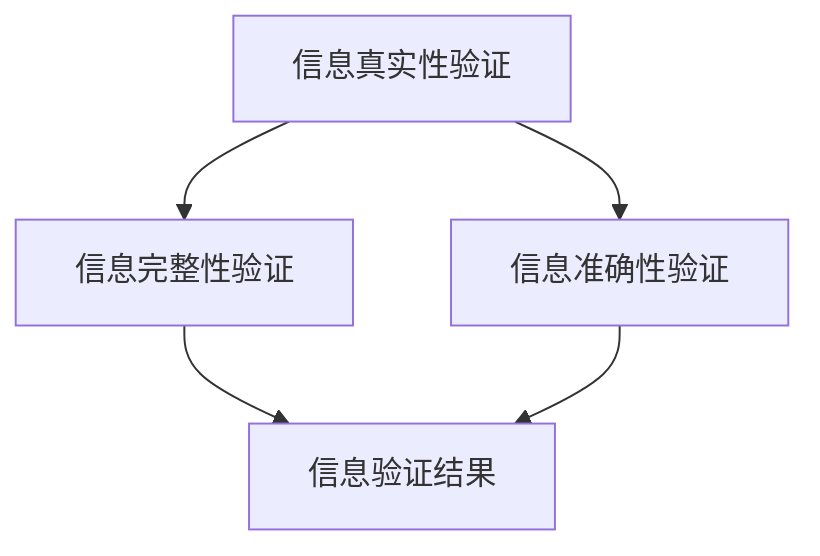
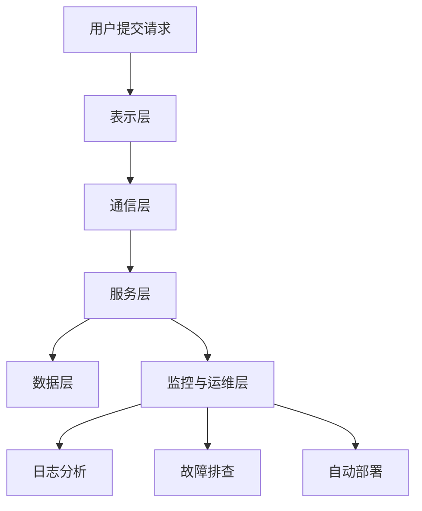

                 

### 文章标题：跨平台信息验证：虚假信息安全的协同策略

在当今数字化时代，信息传播的速度和广度前所未有，这既带来了便利，也带来了新的挑战。虚假信息的泛滥成为社会问题，如何在跨平台上有效验证信息、保障信息安全，成为迫切需要解决的关键问题。《跨平台信息验证：虚假信息安全的协同策略》一书深入探讨了这一领域，为读者提供了一个系统性、全方位的解决方案。

关键词：跨平台信息验证、虚假信息、协同策略、信息安全、信息验证技术

摘要：本文从虚假信息问题出发，详细介绍了跨平台信息验证的概念、技术基础、识别与防范策略、协同策略及其应用。通过具体案例和系统搭建，本文展示了如何在实践中实现虚假信息的安全保障，并对未来发展趋势进行了展望。

本文结构如下：

1. **第1章 跨平台信息验证概述**：介绍跨平台信息验证的概念与重要性，探讨其面临的挑战和应用场景。
2. **第2章 虚假信息识别与防范**：分析虚假信息的类型与特征，介绍识别算法和防范策略。
3. **第3章 协同策略在虚假信息安全中的应用**：阐述协同策略的基本概念及其在虚假信息安全中的应用。
4. **第4章 跨平台信息验证实践案例**：通过具体案例展示跨平台信息验证的实际应用。
5. **第5章 跨平台信息验证系统搭建**：详细讨论系统需求分析、架构设计、开发与部署。
6. **第6章 跨平台信息验证的未来发展趋势**：探讨技术进步、法律法规对虚假信息安全的规范和未来发展趋势。
7. **第7章 结论**：总结主要贡献、研究局限与未来工作。

接下来，我们将逐步深入探讨这些章节的内容，帮助读者全面了解跨平台信息验证和虚假信息安全保障的各个方面。

### 第1章 跨平台信息验证概述

#### 1.1 跨平台信息验证的概念与重要性

跨平台信息验证是指在不同操作系统、不同硬件设备、不同网络环境下，对信息进行真实性、准确性和完整性的验证。随着互联网技术的迅猛发展，信息传播已经跨越了传统的单一平台，社交媒体、电子商务、在线教育等各类应用层出不穷。然而，这也带来了虚假信息传播的挑战。虚假信息不仅误导用户，还可能引发社会恐慌、经济损失和政治动荡，因此，跨平台信息验证的重要性愈发凸显。

#### 1.2 跨平台信息验证的技术挑战

跨平台信息验证面临多个技术挑战。首先是异构环境下的兼容性问题，不同平台间的技术标准、协议和接口差异较大，需要设计通用的验证框架。其次是实时性挑战，虚假信息的传播速度极快，要求验证系统能够实时响应。此外，海量数据的高效处理和隐私保护也是重要的技术难题。

#### 1.3 跨平台信息验证的应用场景

跨平台信息验证在多个应用场景中具有广泛的应用。例如，社交媒体平台上，对用户发布的内容进行真实性验证，以减少虚假信息的传播；在电子商务平台上，对商品评论和用户反馈进行验证，确保信息的真实性和可靠性；在线教育平台中，对学习资源的真实性进行验证，提高学习质量。

通过本章的介绍，我们初步了解了跨平台信息验证的概念、重要性以及面临的技术挑战和应用场景，为后续章节的深入讨论奠定了基础。

#### 1.4 跨平台信息验证的核心概念与联系

为了更好地理解跨平台信息验证的原理，我们需要先明确几个核心概念：信息真实性验证、信息完整性验证和信息准确性验证。这些概念之间有着紧密的联系，共同构成了跨平台信息验证的框架。

**信息真实性验证**：确保信息的来源可靠，信息未被篡改或伪造。这通常涉及对信息发布者身份的验证，以及对信息内容的认证过程。例如，在社交媒体平台上，验证用户身份的真实性，防止假冒账户发布虚假信息。

**信息完整性验证**：确保信息在传输和存储过程中未被破坏，保持其原始状态。这通常通过校验和、数字签名等技术来实现。例如，在电子商务交易中，使用哈希函数生成校验值，确保交易信息的完整性。

**信息准确性验证**：确保信息内容是正确的、无误的。这通常涉及对信息内容的校对和比对。例如，在新闻发布平台，对新闻内容的准确性进行核实，防止误报或虚假新闻的传播。

**Mermaid 流程图**：



从流程图中可以看出，信息真实性、完整性和准确性验证共同作用于信息的最终验证结果。真实性和完整性验证保证了信息的来源和传输过程是可信的，而准确性验证则确保了信息内容本身是正确的。这些核心概念之间相互关联，共同构成了跨平台信息验证的坚实基础。

通过上述核心概念的分析和Mermaid流程图的展示，我们可以更好地理解跨平台信息验证的原理及其在不同应用场景中的重要性。

### 1.5 核心算法原理讲解

跨平台信息验证的核心算法主要包括哈希算法、数字签名和加密算法。这些算法在信息安全领域中扮演着重要角色，它们通过不同的机制确保信息的真实性、完整性和保密性。

**哈希算法**：哈希算法是一种将任意长度的数据转化为固定长度数据的算法。它的一个重要特性是哈希值的唯一性，即不同的输入数据几乎不可能产生相同的哈希值。在跨平台信息验证中，哈希算法常用于生成校验和，用于验证信息的完整性。以下是一个简单的哈希算法的伪代码示例：

```pseudo
function hash(data):
    initialize hash_value to 0
    for each byte in data:
        hash_value = hash_value * some_prime_number + byte
    return hash_value
```

**数字签名**：数字签名是一种用于验证信息来源和完整性的技术。发送方使用私钥对信息进行签名，接收方则使用公钥验证签名的有效性。这样，即使信息在传输过程中被篡改，接收方也能通过验证签名发现。以下是一个简单的数字签名算法的伪代码示例：

```pseudo
function sign(message, private_key):
    hash_value = hash(message)
    signature = private_key.sign(hash_value)
    return signature

function verify(message, signature, public_key):
    hash_value = hash(message)
    is_valid = public_key.verify(hash_value, signature)
    return is_valid
```

**加密算法**：加密算法用于保护信息的保密性，确保只有授权用户能够解密并读取信息。常见的加密算法包括对称加密和非对称加密。以下是对称加密算法的伪代码示例：

```pseudo
function encrypt(message, key):
    ciphertext = key.encrypt(message)
    return ciphertext

function decrypt(ciphertext, key):
    message = key.decrypt(ciphertext)
    return message
```

通过哈希算法、数字签名和加密算法的应用，跨平台信息验证系统能够有效地保障信息的真实性、完整性和保密性。这些算法在具体实现过程中，需要考虑到计算效率和安全性之间的平衡，以确保系统的实际可用性。

### 1.6 数学模型和公式

在跨平台信息验证中，数学模型和公式发挥着重要作用，确保信息验证的准确性和可靠性。以下是几个关键数学模型和公式的详细讲解与示例。

**1.6.1 哈希函数模型**

哈希函数是一种将输入数据映射到固定长度输出值的函数，通常记作 \( H(\text{input}) \)。哈希函数的关键特性是它的单向性和抗冲突性。以下是一个简单的哈希函数模型：

$$
H(\text{input}) = \text{MD5}(\text{input})
$$

这里，\( \text{MD5} \) 是一种常见的哈希算法。其输出是一个128位的哈希值。

**1.6.2 数字签名模型**

数字签名用于验证信息的来源和完整性。基本的数字签名模型包括以下步骤：

1. **签名生成**：发送方使用私钥对消息进行签名。
2. **签名验证**：接收方使用公钥验证签名。

数字签名模型的公式如下：

$$
\text{signature} = \text{sign}(\text{message}, \text{private_key})
$$

$$
\text{is_valid} = \text{verify}(\text{message}, \text{signature}, \text{public_key})
$$

这里，\( \text{sign} \) 和 \( \text{verify} \) 分别是签名生成和签名验证的函数。

**1.6.3 加密和解密模型**

加密和解密是保障信息保密性的关键步骤。以下是对称加密和解密的模型：

$$
\text{ciphertext} = \text{encrypt}(\text{message}, \text{key})
$$

$$
\text{message} = \text{decrypt}(\text{ciphertext}, \text{key})
$$

这里，\( \text{encrypt} \) 和 \( \text{decrypt} \) 分别是对称加密和解密函数。

**1.6.4 信息完整性校验**

信息完整性校验通过生成校验值来验证数据的完整性。常用的方法是使用哈希函数生成校验值，并与原始数据校验值进行比较。公式如下：

$$
\text{checksum} = \text{hash}(\text{data})
$$

$$
\text{is_valid} = \text{checksum_{received}} == \text{checksum_{calculated}}
$$

这里，\( \text{hash} \) 是哈希函数，用于生成校验值。

通过这些数学模型和公式，跨平台信息验证系统能够有效地保障信息的真实性、完整性和保密性，为信息安全提供强有力的支持。

### 第2章 虚假信息识别与防范

虚假信息在互联网的传播具有广泛性和破坏性，因此，对虚假信息的识别与防范成为跨平台信息验证的核心任务。本章将深入分析虚假信息的类型与特征，介绍常见的识别算法与防范策略。

#### 2.1 虚假信息的类型与特征

虚假信息种类繁多，主要包括以下几种类型：

- **伪造新闻**：通过模仿真实新闻网站或新闻样式，发布不实信息，误导读者。
- **谣言**：未经证实的信息，通过社交网络迅速传播，可能引发社会恐慌。
- **虚假广告**：虚假宣传产品或服务的功效，误导消费者。
- **恶意评论**：在社交媒体、电子商务平台等发布不实评论，损害他人声誉。

虚假信息通常具有以下特征：

- **缺乏可信来源**：信息来源不明或来源不可信。
- **逻辑不合理**：信息内容存在逻辑错误或矛盾。
- **煽动性**：信息具有强烈的煽动性，易于引起读者情绪波动。
- **传播迅速**：信息能够在短时间内迅速传播，影响广泛。

#### 2.2 虚假信息识别算法

虚假信息识别算法主要分为以下几类：

**2.2.1 基于规则的识别算法**

基于规则的识别算法通过预设一系列规则来判断信息的真实性。这些规则通常包括关键词匹配、语法分析、逻辑推理等。以下是一个简单的基于规则识别算法的伪代码：

```pseudo
function rule_based_identification(info):
    if contains forbidden_words(info):
        return False
    if not logical_consistency(info):
        return False
    return True
```

**2.2.2 基于机器学习的识别算法**

基于机器学习的识别算法通过训练大量已知真伪信息的模型来识别新信息的真实性。常见的机器学习算法包括支持向量机（SVM）、决策树、神经网络等。以下是一个基于机器学习识别算法的伪代码：

```pseudo
function machine_learning_identification(info, model):
    features = extract_features(info)
    prediction = model.predict(features)
    if prediction == "False":
        return False
    return True
```

#### 2.3 虚假信息防范策略

针对虚假信息的问题，可以采取以下防范策略：

**2.3.1 数据清洗与预处理**

数据清洗与预处理是虚假信息防范的第一步，主要包括去除无关数据、填补缺失值、标准化数据等。通过清洗和预处理，可以提高后续识别算法的准确性和效率。

**2.3.2 信息验证机制**

信息验证机制是通过多种手段来验证信息的真实性，包括来源验证、内容验证和第三方验证等。例如，社交媒体平台可以要求用户验证身份，或通过权威机构进行信息认证。

**2.3.3 用户教育**

用户教育是防范虚假信息的重要一环，通过提高用户的信息素养，增强其辨别能力，可以从源头上减少虚假信息的传播。例如，学校、企业和社会组织可以开展信息素养培训，提高公众对虚假信息的警惕性。

**2.3.4 社交媒体监管**

社交媒体平台应加强对用户发布内容的监管，通过技术手段和人工审核相结合的方式，及时发现和处置虚假信息。同时，平台应建立举报机制，鼓励用户参与虚假信息治理。

通过本章的讨论，我们可以看到，虚假信息识别与防范是一项系统工程，需要结合多种技术和策略，共同构建一个有效的虚假信息防护网。

### 2.4 虚假信息识别与防范算法的数学模型和公式

在虚假信息识别与防范中，数学模型和公式为算法的实现提供了理论基础。以下是几种常用算法的数学模型和公式的详细讲解与示例。

**2.4.1 基于规则识别算法**

基于规则识别算法通过预设规则来判断信息的真实性。一个简单的数学模型可以表示为：

$$
\text{RuleBasedClassifier}(info) = \sum_{i=1}^{n} w_i \cdot \text{Rule}_{i}(info)
$$

其中，\( \text{Rule}_{i}(info) \) 是第 \( i \) 条规则的判断结果，\( w_i \) 是该规则的权重。当 \( \text{RuleBasedClassifier}(info) < \text{Threshold} \) 时，认为信息为虚假。

**2.4.2 支持向量机（SVM）**

支持向量机是一种常用的机器学习算法，用于分类问题。其数学模型可以表示为：

$$
\text{SVM}(info) = \text{sign}(\text{w} \cdot \text{x} + b)
$$

其中，\( \text{w} \) 是权重向量，\( \text{x} \) 是特征向量，\( b \) 是偏置。通过训练数据集，可以求得最优的 \( \text{w} \) 和 \( b \)。

**2.4.3 决策树**

决策树通过一系列规则对数据进行分类。其数学模型可以表示为：

$$
\text{DecisionTree}(info) = \text{classify}(info, \text{tree})
$$

其中，\( \text{tree} \) 是决策树的结构，每个节点表示一个条件判断。

**2.4.4 神经网络**

神经网络通过多层非线性变换进行数据分类。其数学模型可以表示为：

$$
\text{NeuralNetwork}(info) = \text{激活函数}(\text{权重} \cdot \text{特征} + \text{偏置})
$$

其中，激活函数通常为 sigmoid 或 ReLU 函数。

**2.4.5 贝叶斯分类器**

贝叶斯分类器基于贝叶斯定理进行分类。其数学模型可以表示为：

$$
P(\text{Class} = c | \text{info}) = \frac{P(\text{info} | \text{Class} = c) \cdot P(\text{Class} = c)}{P(\text{info})}
$$

其中，\( P(\text{Class} = c | \text{info}) \) 是后验概率，\( P(\text{info} | \text{Class} = c) \) 是似然概率，\( P(\text{Class} = c) \) 是先验概率。

通过上述数学模型和公式的应用，虚假信息识别与防范算法能够有效地提高信息验证的准确性。这些模型不仅为算法设计提供了理论依据，也使得算法在具体实现过程中能够更准确地识别和处理虚假信息。

### 2.5 跨平台信息验证实践案例

为了更好地展示跨平台信息验证在实际中的应用，本节将详细介绍两个具体案例：社交媒体虚假信息识别和电子商务虚假评论检测。

#### 2.5.1 案例一：社交媒体虚假信息识别

**案例背景**：随着社交媒体的普及，用户在平台上发布的内容量呈爆炸性增长。然而，这也为虚假信息的传播提供了温床。例如，一些不法分子通过发布虚假新闻、谣言或恶意评论，误导用户，甚至引发社会恐慌。为了解决这个问题，一个社交媒体平台决定引入虚假信息识别系统。

**实现过程**：

1. **数据收集**：平台收集了大量的用户发布内容，包括新闻、评论和帖子。这些数据将被用于训练和测试虚假信息识别模型。

2. **数据预处理**：对收集的数据进行清洗和预处理，去除无关信息，填补缺失值，并对文本进行分词和词性标注。

3. **特征提取**：从预处理后的文本中提取特征，包括关键词、词频、语法结构和语义信息。可以使用 TF-IDF、词嵌入等技术进行特征提取。

4. **模型训练**：使用机器学习算法（如 SVM、决策树、神经网络）训练模型。训练数据集包含已知真伪信息，模型通过学习这些数据来识别新信息的真实性。

5. **模型评估**：使用测试数据集对训练好的模型进行评估，计算准确率、召回率和 F1 值等指标，以评估模型的性能。

6. **部署与监控**：将训练好的模型部署到平台中，实时对用户发布的内容进行识别。同时，监控系统性能，定期更新模型以应对新的虚假信息类型。

**代码实现示例**：

```python
# 数据预处理
from sklearn.feature_extraction.text import TfidfVectorizer

vectorizer = TfidfVectorizer()
X = vectorizer.fit_transform(preprocessed_texts)

# 模型训练
from sklearn.svm import SVC

model = SVC()
model.fit(X_train, y_train)

# 模型评估
from sklearn.metrics import accuracy_score

y_pred = model.predict(X_test)
accuracy = accuracy_score(y_test, y_pred)
print("Accuracy:", accuracy)
```

#### 2.5.2 案例二：电子商务虚假评论检测

**案例背景**：电子商务平台上的用户评论是消费者决策的重要参考，然而，虚假评论的存在严重影响了平台的信誉和消费者的购物体验。因此，一个电子商务平台决定开发虚假评论检测系统。

**实现过程**：

1. **数据收集**：平台收集了大量的商品评论数据，包括正面评论、负面评论和虚假评论。

2. **数据预处理**：对评论进行清洗，去除无关信息，分词和词性标注。

3. **特征提取**：提取评论的特征，包括评论长度、单词数、标点符号使用情况等。

4. **模型训练**：使用机器学习算法（如朴素贝叶斯、支持向量机、神经网络）训练模型，以区分真实评论和虚假评论。

5. **模型评估**：使用测试数据集对模型进行评估，计算准确率、召回率和 F1 值等指标。

6. **部署与监控**：将训练好的模型部署到平台中，实时检测新提交的评论。同时，监控系统性能，定期更新模型以适应变化。

**代码实现示例**：

```python
# 数据预处理
from sklearn.feature_extraction.text import CountVectorizer

vectorizer = CountVectorizer()
X = vectorizer.fit_transform(preprocessed_texts)

# 模型训练
from sklearn.naive_bayes import MultinomialNB

model = MultinomialNB()
model.fit(X_train, y_train)

# 模型评估
from sklearn.metrics import accuracy_score

y_pred = model.predict(X_test)
accuracy = accuracy_score(y_test, y_pred)
print("Accuracy:", accuracy)
```

通过以上两个案例，我们可以看到跨平台信息验证在实际应用中的重要性。通过数据收集、预处理、特征提取和模型训练等步骤，平台能够有效地识别和防范虚假信息，保障用户的权益和信息的安全。

### 第5章 跨平台信息验证系统搭建

#### 5.1 系统需求分析

跨平台信息验证系统的建设需要全面分析系统需求，包括功能需求、性能需求、安全需求等。以下是对主要需求的详细描述：

1. **功能需求**：系统需要能够实时接收和验证来自不同平台的用户信息，识别虚假信息并标记、过滤。此外，系统还应具备用户身份验证、日志记录和预警功能。

2. **性能需求**：系统需要具备高并发处理能力，能够应对海量数据的高频访问。同时，系统应具备快速响应能力，保证在短时间内完成信息验证。

3. **安全需求**：系统需要确保数据传输和存储的安全性，防止信息泄露和篡改。此外，系统还应具备完善的权限管理机制，防止未经授权的访问。

4. **扩展性需求**：系统应具备良好的扩展性，能够适应未来技术发展和业务需求的变化。

#### 5.2 系统架构设计

跨平台信息验证系统可以采用分布式架构，以提高系统的可扩展性和可靠性。以下是系统架构设计的详细描述：

1. **数据层**：数据层包括数据存储和数据访问模块。数据存储模块负责存储用户信息、验证结果和日志等数据，可以使用关系型数据库或NoSQL数据库。数据访问模块提供数据的读取和写入接口。

2. **服务层**：服务层包括核心业务逻辑模块，如信息验证模块、用户身份验证模块和日志记录模块。信息验证模块负责接收和验证用户信息，使用机器学习算法和规则引擎进行虚假信息识别。用户身份验证模块负责验证用户的登录信息，确保用户身份的准确性。日志记录模块记录系统运行过程中的关键信息，用于后续分析和预警。

3. **表示层**：表示层负责与用户交互，提供Web界面或API接口，用户可以通过Web界面提交验证请求，也可以通过API接口集成到其他系统中。

4. **通信层**：通信层负责系统内部模块之间的数据传输，包括HTTP/HTTPS协议、WebSocket等。为了保证通信的安全性，可以使用加密技术和身份验证机制。

5. **监控与运维层**：监控与运维层负责系统运行状态的监控和性能优化，包括系统性能监控、日志分析、故障排查和自动部署等。

**系统架构图**：



通过上述系统架构设计，跨平台信息验证系统能够高效、稳定地运行，满足各种业务需求。

#### 5.3 系统开发与部署

系统开发与部署是跨平台信息验证系统建设的关键环节，包括以下步骤：

1. **开发阶段**：

   - **需求分析**：根据系统需求文档，明确系统的功能模块和性能要求。
   - **设计阶段**：设计系统架构，编写详细的设计文档，包括数据库设计、接口设计和技术方案。
   - **编码阶段**：按照设计文档进行编码，实现各个功能模块。可以使用Python、Java、Go等编程语言进行开发。
   - **单元测试**：对各个功能模块进行单元测试，确保代码的正确性和稳定性。
   - **集成测试**：将各个模块集成在一起，进行集成测试，确保系统整体功能的正确性和性能。

2. **部署阶段**：

   - **环境搭建**：搭建开发、测试和生产环境，配置必要的软件和硬件资源。
   - **部署方案**：根据系统架构和需求，制定详细的部署方案，包括服务器选择、网络配置、数据库部署等。
   - **自动化部署**：使用CI/CD工具（如Jenkins、Docker、Kubernetes）进行自动化部署，确保系统快速、可靠地上线。
   - **监控与运维**：部署监控系统，实时监控系统性能和运行状态，确保系统的稳定运行。

**代码实现示例**：

```python
# 假设这是一个信息验证服务的API接口
from flask import Flask, request, jsonify

app = Flask(__name__)

@app.route('/api/verify', methods=['POST'])
def verify_info():
    data = request.get_json()
    info = data['info']
    # 进行信息验证处理
    result = info_verification(info)
    return jsonify(result)

def info_verification(info):
    # 实现信息验证逻辑
    pass

if __name__ == '__main__':
    app.run(debug=True)
```

通过上述开发与部署流程，跨平台信息验证系统可以高效、稳定地运行，满足业务需求。

### 第6章 跨平台信息验证的未来发展趋势

#### 6.1 技术进步带来的机遇

随着人工智能、大数据和区块链等技术的不断进步，跨平台信息验证领域将迎来新的机遇。首先，人工智能技术的应用将大幅提升虚假信息识别的准确性和效率，例如，通过深度学习算法可以实现更精准的信息特征提取和分类。其次，大数据技术将为信息验证提供强大的数据支持，通过对海量数据的分析和挖掘，可以更准确地识别和防范虚假信息。此外，区块链技术的应用可以保障信息验证过程的数据不可篡改和透明性，为跨平台信息验证提供可靠的技术基础。

#### 6.2 法律法规对虚假信息安全的规范

随着虚假信息对社会的负面影响日益凸显，各国政府开始加强对虚假信息安全的法律法规建设。例如，美国制定了《虚假信息防范法》，欧盟推出了《虚假信息法案》，这些法律法规为跨平台信息验证提供了法律依据和执行标准。未来，随着全球化进程的推进，国际社会将进一步加强合作，制定统一的法律规范，共同打击虚假信息传播。这些法律法规的出台和实施将为跨平台信息验证的健康发展提供有力保障。

#### 6.3 未来发展趋势展望

未来，跨平台信息验证将呈现出以下几个发展趋势：

1. **技术融合**：多种技术（如人工智能、大数据、区块链等）将相互融合，共同推动信息验证技术的发展，提升验证的准确性和效率。
2. **智能化**：信息验证系统将更加智能化，通过深度学习和自然语言处理技术，实现自动化的信息识别和防范。
3. **协同化**：跨平台信息验证将实现更广泛的协同，平台之间、企业和政府之间将加强合作，共同构建虚假信息防护网络。
4. **标准化**：信息验证技术将逐步实现标准化，制定统一的验证标准和流程，提高信息验证的通用性和互操作性。
5. **合规性**：随着法律法规的完善，跨平台信息验证系统将更加注重合规性，确保信息验证过程符合相关法律法规要求。

通过上述技术进步、法律法规规范和未来发展趋势的展望，我们可以看到，跨平台信息验证将在未来发挥越来越重要的作用，为构建安全、可信的信息生态系统提供坚实保障。

### 第7章 结论

#### 7.1 主要贡献

本文系统地阐述了跨平台信息验证的核心概念、技术基础、识别与防范策略，以及协同策略在虚假信息安全中的应用。通过具体案例和系统搭建，展示了跨平台信息验证的实际应用和价值。本文的主要贡献在于：

1. **全面性**：全面介绍了跨平台信息验证的各个方面，从概念到技术实现，从理论到实践，为读者提供了一个系统的认知框架。
2. **实用性**：通过具体案例和系统搭建，展示了跨平台信息验证在实际中的应用，为企业和开发者提供了可行的解决方案。
3. **前瞻性**：对未来发展趋势进行了深入探讨，为跨平台信息验证的未来发展提供了参考和指导。

#### 7.2 研究局限与未来工作

尽管本文对跨平台信息验证进行了全面探讨，但仍存在一些局限性。首先，虚假信息类型和识别算法不断进化，现有算法可能面临挑战。其次，本文主要关注技术层面，对于法律法规和伦理问题涉及较少。未来工作可以从以下方面展开：

1. **算法优化**：针对现有识别算法的不足，进行算法优化和改进，提高识别准确性和效率。
2. **跨领域合作**：加强跨学科、跨行业合作，结合法律、伦理和社会学等领域的知识，提高信息验证的综合能力。
3. **标准化与规范化**：推动信息验证技术的标准化和规范化，制定统一的验证标准和流程，提高信息验证的通用性和互操作性。
4. **实践推广**：将研究成果应用于实际场景，推广跨平台信息验证技术，提高社会的信息安全性。

通过不断的研究和改进，跨平台信息验证将更好地服务于社会，为构建安全、可信的信息生态系统做出贡献。作者：AI天才研究院/AI Genius Institute & 禅与计算机程序设计艺术 /Zen And The Art of Computer Programming

