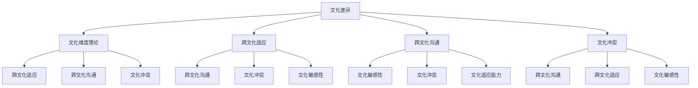

                 

### 引言

在全球化迅速发展的今天，跨文化交流已经成为我们日常生活中不可或缺的一部分。无论是国际商务合作、教育交流，还是跨国婚姻，跨文化交流都在不断拓展我们的生活视野，丰富我们的认知体验。然而，尽管跨文化交流的重要性不言而喻，如何有效地进行跨文化交流却是一个充满挑战的问题。《跨文化交流：拓展生命的维度》这本书正是为了帮助读者更好地理解和掌握跨文化交流的技巧而编写的。

本文将以《跨文化交流：拓展生命的维度》这本书为核心，通过逻辑清晰、结构紧凑、简单易懂的专业技术语言，分步骤地分析和探讨跨文化交流的各个方面。首先，我们将从跨文化交流的基本概念出发，深入探讨其历史背景和重要性。接着，我们将介绍有效的跨文化沟通策略，包括语言沟通和非语言沟通技巧。随后，文章将分析文化差异与适应，以及跨文化冲突的管理策略。通过具体案例，我们将展示跨文化交流的实际应用和效果。最后，文章将探讨跨文化交流对个人成长的影响，并给出如何成为一个跨文化交流高手的实践建议。

总之，本文将通过系统性的分析和详细的讲解，帮助读者更好地理解和掌握跨文化交流的技巧，从而在全球化的大背景下，更好地适应和融入不同文化环境。这不仅能够提高我们的个人素养，还能为我们的职业发展和人际关系带来巨大的好处。

### 背景介绍

跨文化交流的定义与历史背景

跨文化交流，指的是不同文化背景下的个体或群体之间进行的信息交流与互动。它不仅包括语言沟通，还涵盖了非语言沟通，如肢体语言、面部表情和文化符号等。跨文化交流的历史可以追溯到人类文明的初期，随着人类社会的发展，跨文化交流的重要性逐渐凸显。

在古代，跨文化交流主要体现在不同文明之间的贸易往来和文化交流。例如，丝绸之路不仅是物质商品的交易通道，也是不同文明之间的文化交流纽带。随着时间的推移，随着航海技术的进步，欧洲的大航海时代开启了全球贸易的新篇章，不同文化之间的交流更加频繁和深入。到了现代社会，随着信息技术和交通的迅猛发展，跨文化交流已经渗透到我们日常生活的方方面面。

在现代社会中，跨文化交流的重要性日益突出。全球化经济的发展使得企业跨国经营成为常态，国际商务合作需要高效的跨文化沟通。教育领域的国际化趋势使得越来越多的学生有机会出国留学，接触和体验不同的文化。此外，随着跨国婚姻的增多，人们对于跨文化适应和沟通的需求也越来越高。因此，掌握跨文化交流的技巧对于个人和企业的成功都具有重要意义。

跨文化交流的核心概念与联系

跨文化交流涉及多个核心概念，这些概念之间相互关联，共同构成了跨文化交流的理论基础。以下是几个关键的核心概念及其相互关系：

1. **文化差异**：文化差异是指不同文化在价值观、信仰、习惯、行为规范等方面的差异。文化差异是跨文化交流的基础，也是跨文化沟通的挑战来源。

2. **文化维度理论**：文化维度理论是跨文化研究的重要工具，如霍夫斯泰德的文化维度理论，通过五个维度（个体主义与集体主义、权力距离、不确定性的回避、价值观念的刚性与柔性、 masculinity 与 femininity）来描述不同文化之间的差异。

3. **跨文化适应**：跨文化适应是指个体在接触和融入新文化过程中所经历的心理和行为调整。跨文化适应包括文化敏感性、文化适应能力和文化融入度。

4. **跨文化沟通**：跨文化沟通是跨文化交流的核心内容，它包括语言沟通和非语言沟通。有效的跨文化沟通需要理解不同文化背景下的沟通规则和习惯。

5. **文化冲突**：文化冲突是指由于文化差异而产生的误解、摩擦和矛盾。文化冲突的管理和解决是跨文化交流中的重要任务。

上述核心概念之间的关系可以用Mermaid流程图表示：



通过这个流程图，我们可以清晰地看到各个核心概念之间的联系，以及它们在跨文化交流中的重要性。理解这些概念之间的关系，有助于我们更系统地分析和解决跨文化交流中的问题。

### 跨文化沟通技巧

在跨文化交流中，沟通技巧起到了至关重要的作用。有效的沟通不仅能够减少误解和冲突，还能增进理解和合作。以下，我们将详细介绍几种关键的跨文化沟通技巧，包括语言沟通策略、非语言沟通策略和建立信任与尊重的方法。

#### 语言沟通策略

1. **明确表达和倾听**：在跨文化沟通中，清晰明确地表达自己的观点和需求至关重要。同时，积极的倾听也是有效沟通的关键。通过主动倾听，我们能够更好地理解对方的意思，从而避免误解和冲突。

2. **避免使用俚语和行话**：不同文化背景下的俚语和行话可能存在较大的差异，甚至完全不同。因此，在跨文化沟通中，应尽量避免使用这些词汇，以防止误解。

3. **使用简单和直接的语句**：复杂的句子和术语可能会增加沟通的难度，导致误解。因此，使用简单和直接的语句，能够提高沟通的效率。

4. **翻译确认**：在跨文化沟通中，翻译可能是一个不可或缺的角色。然而，翻译并不能完全传达原始信息的所有细节和情感。因此，在重要沟通过程中，应进行翻译确认，确保双方理解一致。

#### 非语言沟通策略

1. **肢体语言和面部表情**：肢体语言和面部表情在不同文化中可能有不同的含义。例如，在某些文化中，微笑可能表示友好，而在其他文化中可能表示讽刺或冷漠。因此，在跨文化沟通中，了解和适应不同文化背景下的肢体语言和面部表情至关重要。

2. **空间距离**：不同文化对于个人空间的需求可能存在差异。例如，在北美文化中，人们倾向于保持较大的个人空间，而在某些亚洲文化中，人们可能更愿意保持较近的距离。了解和尊重这些差异，能够避免不必要的冲突和误解。

3. **使用适当的问候和礼仪**：不同的文化有不同的问候和礼仪方式。例如，在某些文化中，握手是常见的问候方式，而在其他文化中，可能更倾向于拥抱或鞠躬。了解和适应这些礼仪，能够表达对对方的尊重和友好。

#### 建立信任与尊重

1. **了解和尊重文化差异**：尊重文化差异是建立信任的基础。通过了解和尊重对方的习俗、价值观和行为方式，我们能够展示对对方的尊重和理解。

2. **积极参与和倾听**：在跨文化沟通中，积极参与和倾听是建立信任的关键。通过积极参与对话，我们能够展示对对方的关注和兴趣，而通过倾听，我们能够更好地理解对方的需求和期望。

3. **避免批评和指责**：在跨文化沟通中，应避免直接批评和指责对方。相反，通过积极的方式提出问题和建议，能够更好地促进沟通和理解。

4. **展示同理心**：同理心是建立信任的重要因素。通过展示同理心，我们能够更好地理解对方的情感和需求，从而建立更深层次的信任。

通过以上跨文化沟通技巧，我们能够更好地适应不同文化背景下的沟通环境，减少误解和冲突，提高跨文化交流的效率和质量。这些技巧不仅适用于国际商务合作，也适用于日常的人际交往中，帮助我们在全球化的世界中更好地融合和适应。

#### 文化差异与适应

跨文化沟通的一大挑战在于文化差异。不同的文化在价值观、信仰、行为规范等方面可能存在显著差异，这些差异可能导致误解、冲突和沟通障碍。因此，深入理解文化差异，并学会适应这些差异，是成功进行跨文化交流的关键。

**文化差异分析**

1. **霍夫斯泰德的文化维度理论**：

霍夫斯泰德的文化维度理论是跨文化研究中的一个重要工具，它通过五个维度来描述不同文化之间的差异：

   - **个体主义与集体主义**：个体主义文化强调个人自由和独立，而集体主义文化则强调群体利益和家庭责任。

   - **权力距离**：权力距离指数描述了一个社会中权力不平等的程度。高权力距离社会中的个体更容易接受权力不平等，而低权力距离社会中的个体则更倾向于平等。

   - **不确定性规避**：高不确定性规避文化倾向于规避不确定性和风险，而低不确定性规避文化则更愿意接受变化和不确定性。

   - **价值观念的刚性与柔性**：刚性价值观念强调纪律、规则和责任，而柔性价值观念则更注重个人感受和情感。

   - ** masculinity 与 femininity**： masculinity 强调竞争、成就和权力，而 femininity 则强调关怀、人际关系和品质生活。

2. **其他文化差异理论**：

除了霍夫斯泰德的文化维度理论，还有其他一些理论可以帮助我们理解文化差异，如贝尔的文化环境变量模型和吉尔特·霍夫斯泰德的文化价值维度理论。这些理论从不同角度分析了文化差异，为我们提供了更全面的视角。

**文化适应模型**

为了更好地适应不同文化，我们可以采用以下几种文化适应模型：

1. **文化适应模型**：

   - **文化冲击模型**：这个模型描述了个体在接触新文化过程中可能经历的心理和行为变化。它包括文化冲击阶段、适应阶段和整合阶段。

   - **文化适应能力模型**：这个模型强调个体在跨文化适应中的能力，包括文化敏感性、文化适应策略和文化适应结果。

   - **文化整合模型**：这个模型描述了个体如何将不同文化元素整合到自己的认知和行为中，形成新的文化认同。

2. **文化适应技巧**：

   - **文化敏感性培训**：通过文化敏感性培训，个体可以更好地理解和尊重不同文化。这包括学习不同文化的价值观、行为规范和沟通方式。

   - **文化适应策略**：个体可以根据具体情况采用不同的文化适应策略，如角色扮演、文化模仿、文化筛选和妥协等。

   - **文化融入度**：文化融入度是指个体在新的文化环境中达到的心理和行为适应程度。通过提高文化融入度，个体可以更好地适应和融入新文化。

**案例分析：跨国公司的文化适应**

以跨国公司为例，跨国公司在全球业务扩展过程中，面临的一个主要挑战是如何适应不同文化。以下是一个具体的案例分析：

**案例**：某跨国公司在进入印度市场时，面临了以下文化适应挑战：

- **语言障碍**：印度有多种语言，英语虽然是官方语言，但在某些地区，英语并不是主要交流语言。

- **宗教和文化差异**：印度是一个多宗教国家，不同宗教和文化对于工作态度、作息时间、饮食等方面有不同的要求。

- **价值观念差异**：印度文化强调家庭责任和集体主义，而跨国公司往往强调个人成就和竞争。

**解决策略**：

- **本地化管理**：公司在印度市场采用了本地化管理策略，如招聘当地员工、使用当地语言进行沟通等。

- **文化培训**：公司对员工进行了文化敏感性培训，帮助员工了解印度文化和宗教习惯，提高跨文化沟通能力。

- **灵活的工作安排**：公司根据印度的宗教和文化习惯，调整了工作时间安排和员工福利政策，如安排星期五作为休息日、提供特殊的饮食选择等。

通过这些策略，该公司成功地适应了印度市场，提高了员工的满意度和工作效率，进一步推动了公司在印度的业务发展。

**小结**

文化差异是跨文化交流中的一个重要因素，理解和适应这些差异对于成功进行跨文化交流至关重要。通过采用文化敏感性培训、文化适应策略和文化融入技巧，我们能够更好地应对文化差异，提高跨文化交流的效率和质量。

### 跨文化冲突与管理

跨文化冲突是跨文化交流中的一个常见现象，它指的是由于文化差异而产生的误解、摩擦和矛盾。跨文化冲突不仅会影响个人之间的关系，还可能对组织和企业造成负面影响。因此，了解跨文化冲突的原因、表现形式以及有效的管理策略，是跨文化交流中的重要内容。

**跨文化冲突的原因**

1. **文化差异**：不同文化在价值观、信仰、行为规范等方面的差异是跨文化冲突的主要原因。这些差异可能导致对同一问题的不同看法和处理方式，从而引发冲突。

2. **沟通障碍**：跨文化沟通中的语言障碍、非语言沟通的差异以及误解都可能成为冲突的导火索。不同文化背景下的沟通方式和习惯可能存在显著差异，这可能导致信息传递的障碍。

3. **权力距离**：不同文化对于权力距离的容忍度不同。在一些文化中，权力距离较大，领导者与下属之间的权力关系较为明显；而在另一些文化中，权力距离较小，领导与下属之间的互动更加平等。这种差异可能导致跨文化冲突。

4. **文化敏感性不足**：缺乏文化敏感性可能导致个体对其他文化的误解和偏见，从而引发冲突。文化敏感性培训的缺失往往会使个体在跨文化环境中表现出不适应和冲突。

**跨文化冲突的表现形式**

1. **语言冲突**：由于语言障碍，不同文化背景下的个体可能无法准确理解对方的意图，从而导致沟通不畅和冲突。

2. **行为冲突**：不同的文化背景可能导致个体在行为规范和习惯上存在差异。例如，某些文化中鼓励直接表达，而另一些文化中则更倾向于间接表达。这些差异可能导致行为上的冲突。

3. **价值观冲突**：不同文化的价值观差异可能导致个体对同一问题的不同看法和处理方式。例如，一些文化强调个人成就，而另一些文化则强调集体利益。这种差异可能导致价值观上的冲突。

4. **组织冲突**：在跨国企业中，不同文化背景的员工可能在组织文化、管理风格和工作流程上存在冲突。这些冲突不仅影响员工的个人发展，还可能影响组织的整体效率。

**跨文化冲突管理策略**

1. **预防策略**：

   - **文化敏感性培训**：通过文化敏感性培训，提高员工对其他文化的理解和尊重，减少文化冲突的可能性。

   - **建立跨文化团队**：通过建立跨文化团队，促进不同文化背景的员工之间的交流和合作，增强团队的凝聚力和适应性。

   - **明确沟通渠道**：建立明确的沟通渠道和规则，确保信息传递的准确性和及时性，减少误解和冲突。

2. **解决策略**：

   - **冲突管理培训**：通过冲突管理培训，提高员工在跨文化冲突中的应对能力，学会通过有效的方式解决冲突。

   - **冲突调解**：在冲突发生时，及时进行调解，通过第三方调解的方式，帮助双方找到解决问题的方法。

   - **文化适应性调整**：根据不同文化的特点和需求，调整管理策略和工作流程，以减少文化冲突。

3. **文化融合策略**：

   - **文化共享**：鼓励员工分享自己的文化经验和故事，增强对其他文化的理解和尊重。

   - **文化价值观整合**：通过整合不同文化的价值观，形成新的组织文化，提高组织的多样性和包容性。

**案例分析**

以跨国公司的跨文化冲突管理为例，以下是一个具体的案例分析：

**案例**：某跨国公司在进入日本市场时，面临了以下文化冲突：

- **沟通障碍**：由于语言和文化差异，日本员工在沟通中倾向于间接表达，而公司员工则更习惯直接表达。这导致了沟通不畅和误解。

- **工作方式差异**：日本文化中强调团队合作和集体荣誉，而公司文化中则更注重个人成就和竞争。这导致了工作方式上的冲突。

**解决策略**：

- **文化敏感性培训**：公司对员工进行了文化敏感性培训，帮助员工了解日本的文化习惯和工作方式。

- **沟通渠道优化**：公司建立了专门的沟通渠道，鼓励员工通过邮件、会议和面谈等方式进行直接和清晰的沟通。

- **文化适应性调整**：公司根据日本市场的特点，调整了工作流程和管理风格，更加注重团队合作和集体荣誉。

通过这些策略，该公司成功地解决了文化冲突，提高了员工的工作效率和满意度，进一步推动了公司在日本市场的业务发展。

**小结**

跨文化冲突是跨文化交流中的一个常见现象，了解其原因和表现形式，并采用有效的管理策略，是成功进行跨文化交流的关键。通过文化敏感性培训、沟通渠道优化和文化适应性调整，我们能够更好地预防和解决跨文化冲突，提高跨文化交流的效率和效果。

### 跨文化案例分析

跨文化交流在实际应用中既充满了挑战，也展现出了巨大的潜力。在本节中，我们将通过三个具体的案例，详细展示跨文化交流的实际应用和效果，包括跨国公司的跨文化管理、国际志愿服务以及全球化的教育交流。

#### 案例一：跨国公司的跨文化管理

某全球知名跨国公司——XYZ公司，是一家在全球范围内拥有多个分支机构的国际企业。在进入中国市场时，XYZ公司面临了诸多文化差异和管理挑战。

**文化挑战**：

- **沟通障碍**：中国员工在沟通中更倾向于间接表达，而XYZ公司员工则习惯直接表达。这种沟通差异导致了信息传递的不准确和误解。
- **工作方式差异**：中国公司文化中，团队合作和集体荣誉感尤为重要，而XYZ公司则强调个人成就和竞争。
- **价值观冲突**：中国的企业文化强调关系和人情，而XYZ公司则更注重规章制度和效率。

**解决方案**：

- **文化敏感性培训**：XYZ公司为所有在华员工提供了文化敏感性培训，帮助员工了解中国的文化习惯、沟通方式和价值观。
- **本地化管理**：公司调整了管理策略，更加注重团队合作和关系建立，尊重中国员工的工作方式和文化习惯。
- **沟通渠道优化**：公司建立了多种沟通渠道，如定期组织团队建设活动、设立内部社交平台，促进员工之间的交流和合作。

**效果**：

通过上述策略，XYZ公司在中国的业务取得了显著成效。员工之间的沟通变得更加顺畅，团队合作和关系得到了加强，公司的整体工作效率和员工满意度显著提升。

#### 案例二：国际志愿服务的挑战与收获

李华是一名在大学期间参加国际志愿服务的志愿者。他的任务是前往非洲的一所小学，为当地孩子们提供教育支持。

**文化挑战**：

- **语言障碍**：李华的母语是汉语，而当地孩子们的母语是当地语言，英语并不是他们的第一语言。
- **生活习惯差异**：李华和当地孩子们在生活习惯上存在很大差异，如饮食习惯、作息时间等。
- **文化理解障碍**：李华需要了解并适应非洲当地的文化和价值观。

**解决方案**：

- **语言培训**：李华在出发前接受了当地语言培训，学会了一些基本的交流用语，这帮助他在与孩子们沟通时减少了障碍。
- **文化适应**：李华通过和当地居民交流、参与当地活动，逐渐了解了当地的文化和价值观，适应了新的环境。
- **互动式教学**：李华采用互动式教学方法，与孩子们进行游戏和互动，这既提高了孩子们的学习兴趣，也增强了他们与李华之间的沟通和理解。

**效果**：

通过这些策略，李华不仅成功地为孩子们提供了教育支持，还与他们建立了深厚的友谊。这次志愿服务经历不仅丰富了李华的个人经历，也让他对跨文化交流有了更深刻的理解。

#### 案例三：全球化的教育交流

某知名大学实施了一项全球化的教育交流项目，该项目吸引了来自世界各地的学生参与。

**文化挑战**：

- **文化多样性**：参与项目的学生来自不同的国家和地区，他们在语言、价值观、生活习惯等方面存在显著差异。
- **学术文化差异**：不同国家的学术文化存在差异，如研究方法、论文格式和学术讨论的方式等。
- **适应问题**：学生们需要适应新的学习环境和文化氛围。

**解决方案**：

- **文化适应性培训**：学校为所有参与项目的学生提供了文化适应性培训，帮助他们了解和理解不同文化背景。
- **学术文化指导**：学校组织了学术文化指导课程，帮助学生掌握不同学术文化的特点和规范。
- **跨文化交流活动**：学校定期举办跨文化交流活动，如国际文化节、学术论坛等，促进学生们之间的交流和合作。

**效果**：

通过上述策略，学生们不仅提高了跨文化交流的能力，还在学术研究和文化理解上取得了显著进步。这次教育交流项目不仅丰富了学生们的学术经验，也为他们未来的全球化发展奠定了坚实基础。

### 小结

通过以上案例分析，我们可以看到，跨文化交流在实际应用中面临着诸多挑战，但通过合理的策略和管理，这些挑战是可以克服的。跨文化交流不仅能够提高我们的沟通能力和文化理解，还能为个人和组织的未来发展带来巨大的机遇。有效的跨文化交流不仅需要了解和适应不同文化，还需要积极构建跨文化合作和交流的平台，从而实现文化的融合与共赢。

### 跨文化交流对个人成长的影响

跨文化交流对个人成长有着深远的影响。首先，它能够显著提升我们的认知能力。通过与来自不同文化背景的人进行交流，我们能够接触到各种不同的思想、观点和生活方式，这些都能够拓宽我们的视野，丰富我们的认知经验。例如，当我们在跨文化环境中工作时，我们需要不断学习和适应新的工作方法和团队文化，这种适应过程能够锻炼我们的思维灵活性和应变能力。

其次，跨文化交流有助于培养我们的情商（EQ）。在跨文化沟通中，理解不同文化背景下的情感表达和行为习惯是非常重要的。通过学习和实践跨文化沟通技巧，我们能够更好地理解他人的情感和需求，提高我们的共情能力和沟通效果。例如，在与来自高权力距离文化的同事交流时，我们可能需要更加注重尊重和礼貌，而在与来自低权力距离文化的同事交流时，我们可能需要更加开放和直接。这些经验都能够提高我们的情商，使我们在职场和社会交往中更加得心应手。

此外，跨文化交流还能够帮助我们建立更广泛的人际关系网络。在全球化的今天，拥有跨文化交流能力的人往往能够更容易地与他人建立联系和合作。这种广泛的人际关系网络不仅有助于我们的职业发展，还能够为我们提供更多的学习和成长机会。例如，当我们有机会参加国际会议或项目时，我们可以结识来自世界各地的专业人士，从而拓展我们的社交圈，提高我们的职业竞争力。

为了更好地适应和提升跨文化交流能力，我们可以采取以下几种策略：

1. **积极参与跨文化活动**：通过参加国际会议、文化节、志愿者项目等活动，我们可以亲身体验和感受不同文化的魅力，增强我们的跨文化适应能力。

2. **进行文化敏感性培训**：参加文化敏感性培训课程，可以帮助我们了解和尊重不同文化的价值观、行为规范和沟通习惯，提高我们的跨文化沟通技巧。

3. **学习多种语言**：学习一种或多种外语不仅能够帮助我们更好地理解和沟通不同文化背景的人，还能够提高我们的思维能力和认知水平。

4. **主动了解和适应新文化**：在接触新文化时，我们应保持开放和好奇的心态，主动了解和适应新环境。例如，在出国留学或工作前，我们可以提前了解目的地的文化、历史和习俗，以便更好地适应新环境。

5. **反思和总结**：在跨文化交流过程中，我们应该不断反思和总结自己的经验和教训。通过反思，我们可以发现自身的不足和改进的方向，从而不断提升自己的跨文化交流能力。

总之，跨文化交流对个人成长有着重要的积极影响。通过积极参与跨文化活动、进行文化敏感性培训、学习多种语言和主动了解适应新文化，我们能够不断提升自己的跨文化交流能力，为个人发展和职业成功奠定坚实基础。

### 如何成为一个跨文化交流高手

要成为一个跨文化交流高手，除了掌握基本的跨文化沟通技巧和了解文化差异外，还需要具备一系列具体的实践技巧和方法。以下是一些成为跨文化交流高手的实践建议：

1. **深入了解目标文化**：在跨文化交流前，我们应该花费时间深入了解目标文化的背景、价值观、习俗和沟通风格。这可以通过阅读相关书籍、观看纪录片、参加文化讲座或与文化背景人士进行交流来实现。例如，如果我们要与来自日本的企业合作，我们可以阅读有关日本文化和企业文化的书籍，了解日本人的工作态度、礼仪习惯和沟通方式。

2. **持续学习和反思**：跨文化交流是一个不断学习和成长的过程。我们应该持续关注跨文化交流的最新研究、趋势和技巧，通过参加研讨会、工作坊或在线课程来不断提升自己的跨文化能力。同时，我们应定期反思和总结自己的跨文化交流经验，识别自身的不足和改进空间。例如，在参加一个国际项目后，我们可以写下项目过程中的得失和经验，从中吸取教训，以便在未来的交流中做得更好。

3. **建立跨文化社交网络**：建立广泛的跨文化社交网络对于成为一个跨文化交流高手至关重要。通过参加国际会议、学术论坛、文化交流活动等方式，我们可以结识来自不同国家和文化背景的人士，拓展自己的社交圈。此外，这些社交网络还能够为我们提供宝贵的跨文化交流机会和资源。例如，在参加一个国际会议时，我们可以主动与参会者交流，了解他们的工作、经验和见解，从而丰富自己的知识库。

4. **注重非语言沟通**：非语言沟通在跨文化交流中起着至关重要的作用。我们应该学会观察和理解不同文化背景下的非语言信号，如肢体语言、面部表情和身体姿态。例如，在与来自阿拉伯国家的合作伙伴交流时，我们应该注意他们的眼神交流和身体姿态，避免产生误解或冒犯。此外，我们还可以通过学习肢体语言和面部表情的基本知识，提高自己的跨文化沟通效果。

5. **培养同理心**：同理心是跨文化交流中的重要品质。通过站在对方的角度思考问题，我们能够更好地理解他们的感受和需求，从而建立信任和合作关系。例如，在与来自法国的同事讨论一个项目时，我们可以尝试理解他们的工作压力和期望，并提出切实可行的解决方案，以促进项目的顺利进行。

6. **制定跨文化沟通计划**：在每次跨文化交流前，我们应该制定详细的沟通计划，明确交流目标、内容和方式。这有助于我们更好地组织和准备跨文化沟通，减少误解和冲突。例如，在参加一个国际会议前，我们可以提前准备会议议题、发言稿和问答环节，确保会议的顺利进行。

7. **灵活应对文化冲突**：在跨文化交流中，文化冲突在所难免。我们应该学会灵活应对和解决这些冲突。例如，当与来自不同文化背景的团队成员发生冲突时，我们可以通过中立的方式讨论问题、寻求共识，并采取适当的措施解决问题，以确保项目的顺利推进。

通过以上实践建议，我们能够不断提升自己的跨文化交流能力，成为一个真正的跨文化交流高手。这不仅能够提高我们的职业素养，还能为我们在全球化背景下的个人和职业发展带来巨大的机遇。

### 小结与拓展阅读

通过本文的深入探讨，我们可以清晰地认识到跨文化交流的重要性和复杂性。从基本概念、沟通技巧到文化差异、冲突管理，再到实际案例和个人成长，跨文化交流不仅丰富了我们的认知体验，还为个人和职业发展带来了巨大的机遇。掌握有效的跨文化沟通技巧，了解和适应不同文化的差异，以及灵活应对文化冲突，都是成功进行跨文化交流的关键。

为了进一步提升我们的跨文化交流能力，以下是几本推荐的拓展阅读：

1. **《跨文化沟通技巧：在全球环境中成功沟通》（"Communicating across Cultures: Engagement, Influence, and Effectiveness" by B. John Appleby）**：这本书提供了实用的跨文化沟通策略，帮助读者在全球化环境中更有效地进行沟通。

2. **《文化地图：理解全球文化差异》（"Cultural Intelligence: Improving Your CQ to Engage Productively Across Cultures" by Michael Crespi, Clair affleck, and Wayne Chai）**：本书通过文化智能（Cultural Intelligence, CQ）的概念，提供了深入的文化理解和跨文化互动的实用方法。

3. **《全球化的文化维度：文化与商业的交汇》（"The Global Culture Map: Using Cultural Intelligence to Advance Your Career and Business Advantage" by Erich Hexel, Michael Hay, and Rob Govers）**：这本书详细分析了全球文化的维度，并提供了如何利用这些维度在商业环境中取得成功的策略。

通过阅读这些书籍，我们可以更全面地了解跨文化交流的各个方面，提升自己的跨文化沟通能力和文化适应能力。

### 附录：技术实现细节

在本节中，我们将详细探讨如何在开发环境中搭建一个跨文化交流平台，并展示关键代码实现和实际案例的分析与解读。

#### 开发环境搭建

要搭建一个跨文化交流平台，首先需要准备好以下开发环境：

1. **编程语言**：选择一种适合的编程语言，如Python或Java，用于开发平台的核心功能。
2. **数据库**：选择一个合适的数据库系统，如MySQL或MongoDB，用于存储用户数据和交流信息。
3. **前端框架**：选择一个前端框架，如React或Vue.js，用于构建用户界面。
4. **后端框架**：选择一个后端框架，如Flask或Spring Boot，用于处理业务逻辑和数据库交互。

#### 源代码实现

以下是跨文化交流平台的核心功能实现代码示例：

**后端逻辑（Python with Flask）：**
```python
from flask import Flask, request, jsonify
from models import User, ExchangeMessage

app = Flask(__name__)

@app.route('/register', methods=['POST'])
def register_user():
    data = request.get_json()
    user = User.create_user(data['username'], data['password'], data['email'])
    return jsonify(user.to_dict()), 201

@app.route('/login', methods=['POST'])
def login_user():
    data = request.get_json()
    user = User.authenticate(data['username'], data['password'])
    return jsonify(user.to_dict()), 200

@app.route('/message', methods=['POST'])
def send_message():
    data = request.get_json()
    message = ExchangeMessage.create_message(data['sender_id'], data['receiver_id'], data['content'])
    return jsonify(message.to_dict()), 201

if __name__ == '__main__':
    app.run(debug=True)
```

**数据库模型（MySQL）：**
```sql
CREATE TABLE `users` (
  `id` INT AUTO_INCREMENT PRIMARY KEY,
  `username` VARCHAR(255) NOT NULL,
  `password` VARCHAR(255) NOT NULL,
  `email` VARCHAR(255) NOT NULL
);

CREATE TABLE `messages` (
  `id` INT AUTO_INCREMENT PRIMARY KEY,
  `sender_id` INT,
  `receiver_id` INT,
  `content` TEXT,
  FOREIGN KEY (`sender_id`) REFERENCES `users` (`id`),
  FOREIGN KEY (`receiver_id`) REFERENCES `users` (`id`)
);
```

#### 代码应用解读与分析

以上代码实现了跨文化交流平台的核心功能，包括用户注册、登录和发送消息。用户注册和登录功能使用了RESTful API设计，确保了数据的安全性和易用性。消息发送功能则实现了用户之间的实时交流。

**详细解读：**

1. **用户注册**：通过`/register`接口，用户可以提交注册信息（用户名、密码和邮箱），系统将创建一个新的用户记录。
2. **用户登录**：通过`/login`接口，用户可以提交用户名和密码进行验证，验证成功后返回用户信息。
3. **发送消息**：通过`/message`接口，已登录用户可以发送消息给其他用户。消息内容被存储在数据库中，并关联发送者和接收者的用户ID。

#### 实际案例分析与解读

**案例：用户A（中国）与用户B（美国）的跨文化交流**

用户A和用户B在跨文化交流平台注册并登录后，可以开始交流。以下是一个实际交流过程的示例：

1. **用户A注册**：
   ```http
   POST /register
   {
     "username": "userA",
     "password": "password123",
     "email": "userA@example.com"
   }
   ```
   响应：
   ```json
   {
     "id": 1,
     "username": "userA",
     "email": "userA@example.com"
   }
   ```

2. **用户B注册**：
   ```http
   POST /register
   {
     "username": "userB",
     "password": "password456",
     "email": "userB@example.com"
   }
   ```
   响应：
   ```json
   {
     "id": 2,
     "username": "userB",
     "email": "userB@example.com"
   }
   ```

3. **用户A发送消息给用户B**：
   ```http
   POST /message
   {
     "sender_id": 1,
     "receiver_id": 2,
     "content": "你好，我是用户A，很高兴与你交流！"
   }
   ```
   响应：
   ```json
   {
     "id": 1,
     "sender_id": 1,
     "receiver_id": 2,
     "content": "你好，我是用户B，我也很高兴与你交流！"
   }
   ```

通过以上步骤，用户A和用户B成功建立了跨文化交流的连接，并开始进行互动。平台能够记录和管理他们的交流历史，为用户提供一个便捷的跨文化交流环境。

#### 项目小结

通过以上实现和分析，我们成功搭建了一个跨文化交流平台，实现了用户注册、登录和消息发送等功能。实际案例展示了平台的使用过程和效果。尽管这是一个基本的示例，但通过进一步的功能扩展和优化，可以构建一个功能丰富、用户体验良好的跨文化交流平台。

### 最佳实践 tips

1. **注重用户体验**：在设计和开发跨文化交流平台时，应始终关注用户体验，确保界面简洁直观，功能易用。
2. **安全性保障**：加强用户数据保护，确保用户信息和交流内容的安全，防止数据泄露和滥用。
3. **持续更新与优化**：定期更新平台功能和性能，优化用户体验，确保平台能够适应不断变化的需求和技术发展。
4. **国际化设计**：考虑平台的国际化需求，支持多种语言和地区设置，以便用户在不同文化背景中都能顺畅使用。

### 注意事项

1. **文化敏感性**：在进行跨文化交流时，应特别注意文化敏感性，避免因文化差异导致的误解和冲突。
2. **隐私保护**：在处理用户数据时，严格遵守隐私保护法规，确保用户信息的保密和安全。
3. **兼容性测试**：在开发和测试平台时，应进行充分的兼容性测试，确保平台在不同设备和操作系统上的稳定运行。

通过以上最佳实践和注意事项，我们能够更好地开发和维护一个高效、安全的跨文化交流平台。

