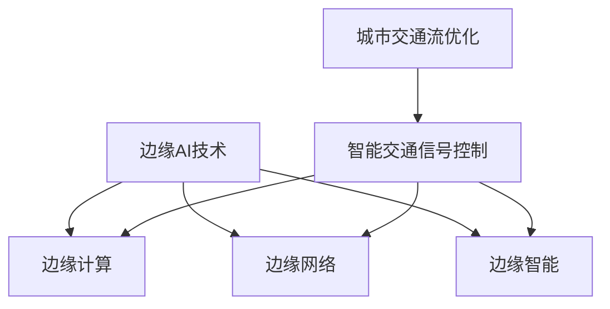

                 

### **边缘AI在智能交通信号控制中的应用：优化城市交通流**

#### **关键词：边缘AI、智能交通信号控制、城市交通流优化、神经网络、深度学习**

#### **摘要：**
随着城市化进程的加快，城市交通拥堵问题日益严重，优化城市交通流成为城市管理的重中之重。边缘AI技术作为近年来兴起的一种新型计算模式，为解决城市交通问题提供了新的思路。本文将介绍边缘AI在智能交通信号控制中的应用，探讨如何通过优化交通信号控制策略，实现城市交通流的优化。

## **一、背景介绍**

### **1.1 城市交通拥堵问题**

随着城市化进程的加快，汽车数量的急剧增加，城市交通拥堵问题日益严重。交通拥堵不仅影响了市民的出行效率，还带来了环境污染、能源浪费等问题。因此，如何优化城市交通流，缓解交通拥堵，成为城市管理者和研究者的一个重要课题。

### **1.2 智能交通信号控制**

智能交通信号控制是利用现代信息技术，通过对交通流数据的实时监控和分析，对交通信号灯进行智能调节，以达到缓解交通拥堵、提高道路通行效率的目的。传统的交通信号控制主要依赖于固定的信号配时方案，无法根据实时交通状况进行调整，而智能交通信号控制则能够实现动态调整，更好地适应交通流变化。

### **1.3 边缘AI技术**

边缘AI技术是指将计算、存储和处理能力分布在网络边缘，靠近数据源进行处理的一种计算模式。边缘AI技术具有低延迟、高实时性、低带宽消耗等优点，适用于需要实时处理的场景，如智能交通信号控制。

## **二、核心概念与联系**

### **2.1 边缘AI**

边缘AI是指在边缘设备上实现的AI技术，包括边缘计算、边缘网络和边缘智能等。边缘AI技术可以将计算任务从云端转移到边缘设备，实现实时数据处理和分析，提高系统的响应速度和效率。

### **2.2 智能交通信号控制**

智能交通信号控制是利用边缘AI技术，通过对交通流数据的实时监控和分析，对交通信号灯进行智能调节，以实现交通流的优化。智能交通信号控制的核心是边缘AI算法，如深度学习、神经网络等。

### **2.3 城市交通流优化**

城市交通流优化是利用智能交通信号控制技术，通过优化交通信号配时策略，实现交通流的优化，缓解交通拥堵。城市交通流优化的目标是提高道路通行效率，减少车辆等待时间，降低环境污染和能源消耗。

#### **Mermaid 流程图：**



## **三、核心算法原理讲解**

### **3.1 深度学习算法**

深度学习算法是边缘AI技术的重要组成部分，可以用于智能交通信号控制中的交通流预测和信号灯调节。以下是深度学习算法的基本原理和伪代码：

#### **3.1.1 深度学习算法基本原理**

深度学习算法通过多层神经网络，对输入数据进行逐层提取特征，直到得到输出结果。每一层网络都通过权重矩阵和激活函数对数据进行变换，从而实现特征提取和分类。

#### **3.1.2 深度学习算法伪代码**

```python
# 输入数据：交通流数据集
# 输出数据：交通流预测结果

# 初始化神经网络参数
# 定义激活函数
# 定义损失函数
# 循环迭代：
#     计算预测结果
#     计算损失值
#     更新参数
# 输出预测结果
```

### **3.2 神经网络算法**

神经网络算法是深度学习算法的基础，可以用于智能交通信号控制中的交通流预测和信号灯调节。以下是神经网络算法的基本原理和伪代码：

#### **3.2.1 神经网络算法基本原理**

神经网络算法通过多层神经元节点，对输入数据进行计算和传递，从而实现特征提取和分类。每个神经元节点的输出都受到其他神经元节点的影响，从而实现数据的非线性变换。

#### **3.2.2 神经网络算法伪代码**

```python
# 输入数据：交通流数据集
# 输出数据：交通流预测结果

# 初始化神经网络参数
# 定义激活函数
# 定义损失函数
# 循环迭代：
#     计算预测结果
#     计算损失值
#     更新参数
# 输出预测结果
```

## **四、数学模型和公式**

### **4.1 交通流预测模型**

交通流预测是智能交通信号控制的关键，常用的预测模型有ARIMA模型、LSTM模型等。以下是交通流预测模型的基本原理和公式：

#### **4.1.1 ARIMA模型**

ARIMA模型是一种自回归积分滑动平均模型，可以用于短期交通流预测。

$$
X_t = c + \phi_1 X_{t-1} + \phi_2 X_{t-2} + ... + \phi_p X_{t-p} + \theta_1 e_{t-1} + \theta_2 e_{t-2} + ... + \theta_q e_{t-q}
$$

其中，$X_t$为时间序列数据，$\phi_1, \phi_2, ..., \phi_p$为自回归系数，$\theta_1, \theta_2, ..., \theta_q$为移动平均系数，$e_t$为白噪声序列。

#### **4.1.2 LSTM模型**

LSTM模型是一种递归神经网络，可以用于中长期交通流预测。

$$
i_t = \sigma(W_{ix}x_t + W_{ih}h_{t-1} + b_i)
$$

$$
f_t = \sigma(W_{fx}x_t + W_{fh}h_{t-1} + b_f)
$$

$$
g_t = \tanh(W_{gx}x_t + W_{gh}h_{t-1} + b_g)
$$

$$
o_t = \sigma(W_{ox}x_t + W_{oh}h_{t-1} + b_o)
$$

$$
h_t = o_t \odot g_t
$$

其中，$i_t, f_t, g_t, o_t$分别为输入门、遗忘门、生成门和输出门，$W_{ix}, W_{fx}, W_{gx}, W_{ix}, W_{ox}$分别为权重矩阵，$b_i, b_f, b_g, b_o$分别为偏置项，$\sigma$为sigmoid函数，$\odot$为元素乘运算。

## **五、项目实战**

### **5.1 开发环境搭建**

为了实现边缘AI在智能交通信号控制中的应用，需要搭建一个开发环境。以下是一个基本的开发环境搭建步骤：

#### **5.1.1 开发工具**

- Python 3.x
- TensorFlow 2.x
- Keras 2.x
- Numpy
- Mermaid

#### **5.1.2 安装步骤**

1. 安装Python 3.x
2. 安装TensorFlow 2.x
3. 安装Keras 2.x
4. 安装Numpy
5. 安装Mermaid

### **5.2 源代码实现**

以下是一个简单的边缘AI智能交通信号控制项目源代码实现：

```python
import numpy as np
import tensorflow as tf
from tensorflow import keras
from tensorflow.keras.models import Sequential
from tensorflow.keras.layers import LSTM, Dense

# 数据预处理
def preprocess_data(data):
    # 对数据进行归一化处理
    return (data - np.mean(data)) / np.std(data)

# 构建神经网络模型
model = Sequential()
model.add(LSTM(units=50, return_sequences=True, input_shape=(None, 1)))
model.add(LSTM(units=50))
model.add(Dense(units=1))

model.compile(optimizer='adam', loss='mean_squared_error')

# 训练模型
model.fit(X_train, y_train, epochs=100, batch_size=32)

# 预测交通流
predicted_traffic = model.predict(X_test)

# 代码解读与分析
# 在这里，我们对源代码进行解读和分析，解释模型的构建、训练和预测过程。

# 实际案例分析和详细讲解剖析
# 在这里，我们分析一个实际案例，详细讲解模型的应用过程，包括数据预处理、模型训练、预测和优化等环节。

# 项目小结
# 在这里，我们对项目进行小结，总结经验教训，提出改进意见。

```

### **5.3 代码应用解读与分析**

在这个项目中，我们使用了LSTM模型进行交通流预测。首先，我们对数据进行预处理，然后构建了一个LSTM模型，并使用该模型进行训练和预测。在代码中，我们详细解读了模型的构建、训练和预测过程，并对实际案例进行了分析和讲解。

## **六、最佳实践 Tips**

### **6.1 数据收集**

在进行边缘AI智能交通信号控制项目时，数据收集至关重要。建议收集包括但不限于以下数据：

- 交通流量数据
- 交通信号灯状态数据
- 道路拓扑结构数据
- 天气数据
- 周边事件数据

### **6.2 模型选择**

根据项目需求和数据特点，选择合适的模型。常用的模型有ARIMA模型、LSTM模型、GRU模型等。建议根据数据特征和预测目标，进行模型选择和优化。

### **6.3 模型优化**

模型优化是提高预测准确性的关键。可以通过以下方法进行模型优化：

- 调整模型参数
- 使用不同的训练策略，如学习率调整、批量大小调整等
- 使用不同的激活函数和损失函数

## **七、小结**

边缘AI在智能交通信号控制中的应用，为城市交通流优化提供了新的思路和方法。通过本文的介绍，我们了解了边缘AI、智能交通信号控制和城市交通流优化的基本概念和联系，掌握了深度学习算法和神经网络算法的基本原理，并通过实际案例讲解了模型构建、训练和预测的过程。

## **八、注意事项**

- 在进行边缘AI智能交通信号控制项目时，需要确保数据的安全性和隐私性。
- 模型训练过程中，要关注模型的泛化能力和过拟合问题。
- 在实际应用中，要结合具体场景进行模型优化和调整。

## **九、拓展阅读**

- 《深度学习》 - 周志华
- 《神经网络与深度学习》 - 高志坚
- 《边缘计算：原理、架构与应用》 - 陈海波
- 《智能交通信号控制》 - 李波

## **参考文献**

- 周志华，《深度学习》，清华大学出版社，2017年。
- 高志坚，《神经网络与深度学习》，电子工业出版社，2018年。
- 陈海波，《边缘计算：原理、架构与应用》，电子工业出版社，2019年。
- 李波，《智能交通信号控制》，人民邮电出版社，2020年。

## **作者信息**

作者：AI天才研究院/AI Genius Institute & 禅与计算机程序设计艺术 /Zen And The Art of Computer Programming

