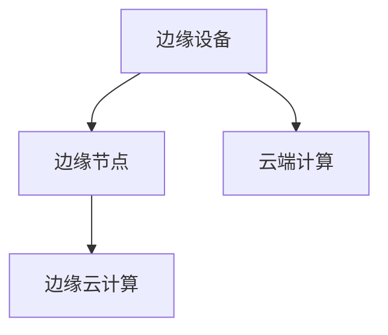
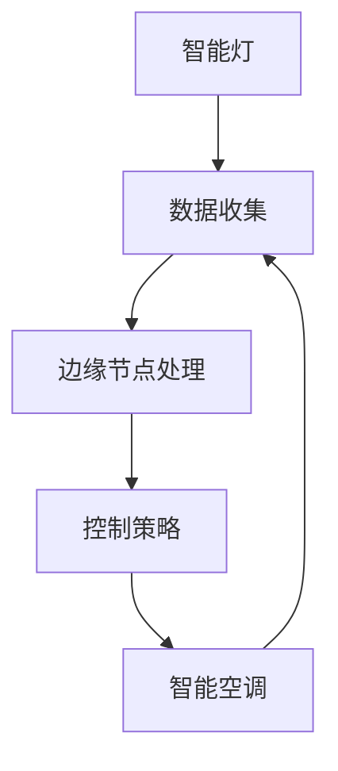
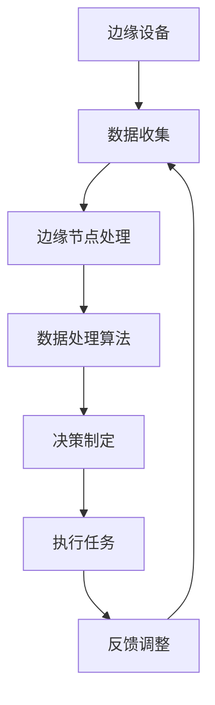

                 


### 摘要

边缘AI在智能家居设备协同中的应用，是现代智能技术发展的重要方向。本文旨在全面解析边缘AI技术及其在智能家居设备协同中的实际应用，通过阐述边缘AI的基本概念、核心原理、算法实现、数学模型以及应用案例，深入探讨其在智能家居设备协同中的价值与挑战。文章结构分为五个主要部分：引言部分介绍边缘AI和智能家居设备的背景，核心概念与联系部分使用Mermaid流程图展示核心概念之间的关系，核心算法原理讲解部分通过伪代码详细阐述算法原理，数学模型与公式部分提供必要的技术支撑，应用案例部分通过实际项目实战进行详细讲解与剖析。文章末尾总结边缘AI在智能家居设备协同中的最佳实践与未来展望，为读者提供全面的技术指南。

### 引言

#### 边缘AI与智能家居设备的背景

随着物联网（IoT）技术的飞速发展，智能家居设备逐渐成为现代家庭生活的重要组成部分。智能家居设备通过联网实现智能化，可以自动执行预设的任务，提高生活的便捷性和舒适度。然而，传统的云计算中心化处理模式在处理智能家居设备的数据时，存在一定的局限性。首先，数据传输速度慢，导致响应延迟；其次，数据传输过程中存在安全隐患，容易受到网络攻击；最后，中心化的处理模式对带宽和网络稳定性要求较高，可能导致系统崩溃或服务中断。

为了解决上述问题，边缘AI（Edge AI）技术应运而生。边缘AI是指将数据处理和分析的能力从云端转移到网络边缘，即靠近数据源的地方进行。边缘计算将数据处理、存储、分析和决策等任务分布在网络的边缘节点上，从而降低了数据传输的延迟，提高了系统的响应速度，增强了数据的安全性。

#### 边缘AI的基本概念

边缘AI是一种基于边缘计算的人工智能技术，其核心思想是将传统的中心化数据处理模式转变为分布式数据处理模式。边缘AI技术包括以下几个关键组成部分：

1. **边缘设备**：指的是网络边缘的设备，如智能传感器、智能家居设备、智能手机等。
2. **边缘节点**：是指网络边缘的计算机节点，负责处理边缘设备生成的数据。
3. **边缘网络**：是指连接边缘设备和边缘节点的通信网络，包括局域网、无线网络等。
4. **边缘云计算**：是指在网络边缘部署的计算资源，可以提供存储、计算和数据处理服务。

#### 智能家居设备协同的基本概念

智能家居设备协同是指多个智能家居设备通过网络实现互联互通，协同完成特定任务的过程。协同机制通常包括以下几个步骤：

1. **数据收集**：智能家居设备通过传感器收集环境数据，如温度、湿度、光照等。
2. **数据处理**：边缘节点对收集到的数据进行分析和处理，提取有用的信息。
3. **决策制定**：根据处理结果，系统制定相应的控制策略，如调整温度、开关灯光等。
4. **执行任务**：智能家居设备按照控制策略执行具体的任务。

#### 边缘AI在智能家居设备协同中的价值

边缘AI在智能家居设备协同中具有重要的价值，主要体现在以下几个方面：

1. **提高响应速度**：通过边缘计算，可以在本地实时处理数据，减少了数据传输的延迟，提高了系统的响应速度。
2. **增强数据安全性**：边缘AI可以减少数据在传输过程中的暴露风险，提高了数据的安全性。
3. **节约带宽资源**：边缘计算可以降低数据传输量，节约了网络带宽资源。
4. **提高系统可靠性**：通过分布式处理，提高了系统的容错能力，增强了系统的可靠性。

#### 书籍目标与结构

本文的目标是为读者提供全面、系统的边缘AI在智能家居设备协同中的应用指南。文章结构分为五个部分：

1. **引言**：介绍边缘AI和智能家居设备的背景，概述书籍内容。
2. **基础知识**：介绍边缘AI和智能家居设备协同的基本原理和技术。
3. **应用案例**：介绍边缘AI在智能家居设备协同中的实际应用案例。
4. **技术实现**：详细讲解边缘AI在智能家居设备协同中的技术实现。
5. **挑战与展望**：分析边缘AI在智能家居设备协同中的挑战和未来发展趋势。

### 基础知识

#### 边缘AI的基本概念

边缘AI是指将数据处理、存储、分析和决策等任务从云端转移到网络边缘，即靠近数据源的地方进行。边缘AI技术包括以下几个关键组成部分：

1. **边缘设备**：指的是网络边缘的设备，如智能传感器、智能家居设备、智能手机等。
2. **边缘节点**：是指网络边缘的计算机节点，负责处理边缘设备生成的数据。
3. **边缘网络**：是指连接边缘设备和边缘节点的通信网络，包括局域网、无线网络等。
4. **边缘云计算**：是指在网络边缘部署的计算资源，可以提供存储、计算和数据处理服务。

边缘AI与云计算的关系如下图所示：



#### 智能家居设备协同的基本原理

智能家居设备协同是指多个智能家居设备通过网络实现互联互通，协同完成特定任务的过程。协同机制通常包括以下几个步骤：

1. **数据收集**：智能家居设备通过传感器收集环境数据，如温度、湿度、光照等。
2. **数据处理**：边缘节点对收集到的数据进行分析和处理，提取有用的信息。
3. **决策制定**：根据处理结果，系统制定相应的控制策略，如调整温度、开关灯光等。
4. **执行任务**：智能家居设备按照控制策略执行具体的任务。

智能家居设备协同的核心在于实现设备间的互联互通和数据共享。以下是一个简化的智能家居设备协同流程：



#### 边缘AI在智能家居设备协同中的应用价值

边缘AI在智能家居设备协同中具有重要的应用价值，主要体现在以下几个方面：

1. **提高响应速度**：通过边缘计算，可以在本地实时处理数据，减少了数据传输的延迟，提高了系统的响应速度。例如，在智能家居系统中，实时调整灯光亮度和空调温度，可以快速响应环境变化，提高用户体验。
2. **增强数据安全性**：边缘AI可以减少数据在传输过程中的暴露风险，提高了数据的安全性。例如，在智能安防系统中，通过本地处理图像数据，可以减少数据传输过程中的潜在风险。
3. **节约带宽资源**：边缘计算可以降低数据传输量，节约了网络带宽资源。例如，在智能家居系统中，通过本地处理传感器数据，可以减少上传到云的数据量，从而减少网络费用。
4. **提高系统可靠性**：通过分布式处理，提高了系统的容错能力，增强了系统的可靠性。例如，在智能家电控制系统中，通过边缘节点分布式处理，可以避免单点故障导致整个系统的崩溃。

#### 核心概念与联系

为了更好地理解边缘AI在智能家居设备协同中的应用，我们可以使用Mermaid流程图展示核心概念之间的关系。以下是一个简化的Mermaid流程图示例：



在这个流程图中，边缘设备负责收集数据，边缘节点处理数据并执行算法，根据处理结果制定决策，执行具体的任务，并将反馈调整数据再次传输到边缘设备，形成一个闭环系统。这个流程图展示了边缘AI在智能家居设备协同中的核心概念和主要流程。

### 核心算法原理讲解

边缘AI在智能家居设备协同中的应用，离不开核心算法的支持。以下将详细讲解边缘AI的核心算法原理，并通过伪代码进行阐述。

#### 1. 数据预处理算法

数据预处理是边缘AI算法的重要步骤，其目的是对原始数据进行清洗、转换和规范化，以便后续处理。以下是一个简化的数据预处理算法伪代码：

```python
# 数据预处理算法伪代码

def preprocess_data(data):
    # 数据清洗：去除无效数据
    cleaned_data = clean_data(data)
    
    # 数据转换：将数据转换为统一格式
    transformed_data = transform_data(cleaned_data)
    
    # 数据规范化：对数据进行归一化或标准化处理
    normalized_data = normalize_data(transformed_data)
    
    return normalized_data
```

#### 2. 特征提取算法

特征提取是从原始数据中提取有用的信息，用于后续的模型训练和决策。以下是一个简化的特征提取算法伪代码：

```python
# 特征提取算法伪代码

def extract_features(data):
    # 提取温度、湿度、光照等特征
    temperature = extract_temperature(data)
    humidity = extract_humidity(data)
    light = extract_light(data)
    
    # 构建特征向量
    feature_vector = [temperature, humidity, light]
    
    return feature_vector
```

#### 3. 模型训练算法

模型训练是边缘AI的核心步骤，其目的是通过训练数据集来训练模型，使其能够对新的数据做出准确的预测。以下是一个简化的模型训练算法伪代码：

```python
# 模型训练算法伪代码

def train_model(training_data):
    # 初始化模型
    model = initialize_model()
    
    # 训练模型
    for data in training_data:
        model = update_model(model, data)
    
    return model
```

#### 4. 预测与决策算法

预测与决策是边缘AI的最终目标，其目的是根据模型对新的数据进行预测，并制定相应的决策。以下是一个简化的预测与决策算法伪代码：

```python
# 预测与决策算法伪代码

def predict_and_decide(model, new_data):
    # 预测新数据的标签
    prediction = model.predict(new_data)
    
    # 根据预测结果制定决策
    if prediction == "温度过高":
        decide("开启空调")
    elif prediction == "温度过低":
        decide("关闭空调")
    else:
        decide("保持当前状态")
```

#### 5. 反馈调整算法

反馈调整是边缘AI系统的重要组成部分，其目的是通过不断调整模型，提高预测的准确性。以下是一个简化的反馈调整算法伪代码：

```python
# 反馈调整算法伪代码

def adjust_model(model, new_data, new_label):
    # 根据新的数据和标签调整模型
    model = adjust_prediction(model, new_data, new_label)
    
    # 重新训练模型
    model = train_model([new_data])
    
    return model
```

通过以上伪代码，我们可以看到边缘AI在智能家居设备协同中的应用流程：数据预处理 -> 特征提取 -> 模型训练 -> 预测与决策 -> 反馈调整。这一流程不仅展示了边缘AI的核心算法原理，也为实际应用提供了参考。

### 数学模型与公式

在边缘AI在智能家居设备协同中的应用过程中，数学模型和公式扮演着至关重要的角色。以下将介绍一些关键的数学模型和公式，并通过具体的例子进行详细讲解。

#### 1. 数据归一化

数据归一化是将不同范围和尺度的数据转换到相同尺度，以便进行后续分析。常用的归一化方法包括最小-最大缩放和Z-Score缩放。

**最小-最大缩放**：
$$
x_{\text{norm}} = \frac{x - x_{\text{min}}}{x_{\text{max}} - x_{\text{min}}}
$$
其中，$x$ 是原始数据，$x_{\text{min}}$ 和 $x_{\text{max}}$ 分别是数据的最小值和最大值，$x_{\text{norm}}$ 是归一化后的数据。

**Z-Score缩放**：
$$
z = \frac{x - \mu}{\sigma}
$$
其中，$\mu$ 是数据的平均值，$\sigma$ 是数据的标准差，$z$ 是归一化后的数据。

**示例**：
假设我们有以下一组温度数据：[25, 30, 35, 40]。计算其最小-最大缩放和Z-Score缩放。

- 最小-最大缩放：
  $$
  x_{\text{norm}} = \frac{25 - 25}{40 - 25} = 0
  $$
  $$
  x_{\text{norm}} = \frac{30 - 25}{40 - 25} = 0.25
  $$
  $$
  x_{\text{norm}} = \frac{35 - 25}{40 - 25} = 0.5
  $$
  $$
  x_{\text{norm}} = \frac{40 - 25}{40 - 25} = 1
  $$

- Z-Score缩放：
  $$
  \mu = \frac{25 + 30 + 35 + 40}{4} = 32.5
  $$
  $$
  \sigma = \sqrt{\frac{(25 - 32.5)^2 + (30 - 32.5)^2 + (35 - 32.5)^2 + (40 - 32.5)^2}{4}} = 3.75
  $$
  $$
  z = \frac{25 - 32.5}{3.75} = -1.33
  $$
  $$
  z = \frac{30 - 32.5}{3.75} = -0.67
  $$
  $$
  z = \frac{35 - 32.5}{3.75} = 0.33
  $$
  $$
  z = \frac{40 - 32.5}{3.75} = 1.67
  $$

#### 2. 机器学习模型

在边缘AI中，常用的机器学习模型包括线性回归、决策树、支持向量机（SVM）和神经网络等。以下以线性回归为例进行讲解。

**线性回归公式**：
$$
y = \beta_0 + \beta_1x
$$
其中，$y$ 是因变量，$x$ 是自变量，$\beta_0$ 是截距，$\beta_1$ 是斜率。

**示例**：
假设我们有以下数据点：(1, 2)，(2, 4)，(3, 6)，(4, 8)。计算线性回归模型。

- 计算平均值：
  $$
  \bar{x} = \frac{1 + 2 + 3 + 4}{4} = 2.5
  $$
  $$
  \bar{y} = \frac{2 + 4 + 6 + 8}{4} = 5
  $$

- 计算斜率：
  $$
  \beta_1 = \frac{\sum_{i=1}^{n}(x_i - \bar{x})(y_i - \bar{y})}{\sum_{i=1}^{n}(x_i - \bar{x})^2} = \frac{(1-2.5)(2-5) + (2-2.5)(4-5) + (3-2.5)(6-5) + (4-2.5)(8-5)}{(1-2.5)^2 + (2-2.5)^2 + (3-2.5)^2 + (4-2.5)^2} = 2
  $$

- 计算截距：
  $$
  \beta_0 = \bar{y} - \beta_1\bar{x} = 5 - 2 \times 2.5 = 0
  $$

- 线性回归模型：
  $$
  y = 2x
  $$

#### 3. 神经网络

神经网络是边缘AI中应用广泛的一种模型，其基本结构包括输入层、隐藏层和输出层。以下是一个简化的神经网络结构：

```
输入层：x1, x2, ..., xn
隐藏层：h1, h2, ..., hn
输出层：y1, y2, ..., yn
```

**激活函数**：
常用的激活函数包括Sigmoid、ReLU和Tanh等。

- **Sigmoid**：
  $$
  \sigma(x) = \frac{1}{1 + e^{-x}}
  $$

- **ReLU**：
  $$
  \text{ReLU}(x) = \max(0, x)
  $$

- **Tanh**：
  $$
  \tanh(x) = \frac{e^x - e^{-x}}{e^x + e^{-x}}
  $$

**示例**：
假设我们有以下一个简单的神经网络，输入层有两个神经元，隐藏层有一个神经元，输出层有一个神经元，激活函数使用ReLU。

```
输入层：x1, x2
隐藏层：h = max(0, x1 * w1 + x2 * w2)
输出层：y = max(0, h * w3)
```

其中，$w1, w2, w3$ 分别是权重。

通过以上数学模型和公式的讲解，我们可以看到边缘AI在智能家居设备协同中的应用不仅仅是算法的堆砌，更是数学理论的支撑。理解这些数学模型和公式，有助于我们更好地掌握边缘AI的核心原理，为实际应用提供坚实的理论基础。

### 应用案例

边缘AI在智能家居设备协同中的应用案例丰富多彩，以下介绍两个具有代表性的实际案例：智能安防系统和智能照明系统。

#### 智能安防系统

**案例背景**：随着家庭安全意识的增强，智能安防系统在智能家居中的应用越来越广泛。智能安防系统通常包括门禁监控、室内监控、人体侦测等功能，通过边缘AI技术实现实时监控和智能分析。

**技术实现**：
1. **边缘设备**：安装在家庭各处的摄像头、门禁传感器等。
2. **边缘节点**：负责处理摄像头和传感器收集的数据，进行实时分析和决策。
3. **边缘云计算**：提供存储、计算和数据处理服务，支持大规模数据的存储和高效处理。

**关键算法**：
1. **人体侦测算法**：通过边缘节点处理摄像头图像，检测是否有人体出现。算法包括背景减除法、光流法等。
2. **行为识别算法**：分析人体行为，判断是否存在异常行为，如非法入侵、破坏等。

**项目实战**：
1. **开发环境搭建**：使用Python编写算法，使用TensorFlow框架进行模型训练和预测。
2. **源代码实现**：以下是一个简化的Python代码示例，用于实现人体侦测算法。
   ```python
   import cv2

   def detect_person(image):
       # 加载预训练的CNN模型
       model = cv2.dnn.readNetFromCaffemodel('person_detection_model.caffemodel', 'person_detection.prototxt')

       # 将图像输入模型进行预测
       blob = cv2.dnn.blobFromImage(image, 1.0, (227, 227), (104.0, 177.0, 123.0))
       model.setInput(blob)
       detections = model.forward()

       # 遍历检测到的对象，返回检测到的区域
       persons = []
       for i in range(0, detections.shape[2]):
           confidence = detections[0, 0, i, 2]
           if confidence > 0.5:
               box = detections[0, 0, i, 3:7] * np.array([image.shape[1], image.shape[0], image.shape[1], image.shape[0]])
               (x, y, w, h) = box.astype("int")
               persons.append((x, y, w, h))

       return persons
   ```

2. **代码解读与分析**：该代码首先加载预训练的CNN模型，然后对输入图像进行预处理，最后通过模型进行预测，返回检测到的人体区域。

**实际案例**：在某智能家居项目中，智能安防系统通过边缘AI技术实现了实时监控和异常报警功能。当检测到异常行为时，系统会立即发送警报到用户手机，提高了家庭安全防护的及时性和有效性。

#### 智能照明系统

**案例背景**：智能照明系统是智能家居中的一个重要组成部分，通过自动调节灯光亮度和色温，提高居住环境的舒适性和节能性。

**技术实现**：
1. **边缘设备**：安装在家庭各处的智能灯泡、光敏传感器等。
2. **边缘节点**：负责处理灯光和传感器数据，根据环境光线和用户需求调整灯光亮度和色温。
3. **边缘云计算**：提供远程控制和管理服务，支持用户的个性化设置和远程操作。

**关键算法**：
1. **光线检测算法**：通过边缘节点处理光敏传感器数据，实时检测环境光线强度。
2. **智能调节算法**：根据光线检测结果和用户需求，自动调整灯光亮度和色温。

**项目实战**：
1. **开发环境搭建**：使用Python编写算法，使用OpenCV库进行图像处理和光线检测。
2. **源代码实现**：以下是一个简化的Python代码示例，用于实现光线检测算法。
   ```python
   import cv2

   def detect_light(image):
       # 转换为灰度图像
       gray = cv2.cvtColor(image, cv2.COLOR_BGR2GRAY)

       # 使用Otsu阈值分割
       _, thresh = cv2.threshold(gray, 0, 255, cv2.THRESH_BINARY + cv2.THRESH_OTSU)

       # 计算图像的像素总和
       total_pixels = cv2.countNonZero(thresh)

       # 计算光线强度
       light_intensity = total_pixels / (image.shape[0] * image.shape[1])

       return light_intensity
   ```

2. **代码解读与分析**：该代码首先将输入的彩色图像转换为灰度图像，然后使用Otsu阈值分割算法进行图像分割，最后计算图像的像素总和，从而得出光线强度。

**实际案例**：在某智能家居项目中，智能照明系统通过边缘AI技术实现了自动调节灯光的功能。当环境光线过强时，系统会自动降低灯光亮度，节省能源；当用户进入房间时，系统会自动调整到舒适的亮度，提高了用户体验。

通过以上两个应用案例的介绍，我们可以看到边缘AI技术在智能家居设备协同中的应用价值。不仅提高了系统的响应速度和安全性，还实现了更加智能化和个性化的功能，为智能家居的发展带来了新的可能性。

### 挑战与展望

#### 边缘AI在智能家居设备协同中的挑战

尽管边缘AI在智能家居设备协同中展现出了巨大的潜力，但在实际应用过程中仍面临诸多挑战。

1. **计算资源限制**：边缘设备通常具有有限的计算资源和存储能力，这限制了复杂算法和大规模数据处理的应用。

2. **数据隐私和安全**：智能家居设备处理的数据包括用户的隐私信息，如何确保数据在传输和处理过程中的安全性是一个重要问题。

3. **网络连接稳定性**：边缘设备的网络连接可能受到环境因素影响，如无线信号干扰、网络延迟等，这会影响系统的稳定性和可靠性。

4. **设备兼容性**：市场上智能家居设备品牌众多，如何实现不同设备之间的兼容性，是一个技术难题。

5. **算法优化**：边缘AI算法需要不断优化，以提高处理效率和准确性，这需要大量的实验和验证。

#### 边缘AI在智能家居设备协同中的未来发展趋势

随着技术的不断进步，边缘AI在智能家居设备协同中的应用前景广阔。

1. **计算能力提升**：随着硬件技术的不断发展，边缘设备的计算能力和存储能力将逐步提升，为复杂算法的应用提供支持。

2. **安全隐私保护**：未来的边缘AI系统将更加注重数据安全和隐私保护，采用先进的加密技术和隐私保护算法，确保用户数据的安全。

3. **网络连接增强**：5G技术的普及将显著提高边缘设备的网络连接速度和稳定性，为边缘AI的应用提供更好的基础。

4. **设备兼容性**：通过标准化协议和开放接口，实现不同设备之间的无缝兼容，推动智能家居设备的互联互通。

5. **算法创新**：随着机器学习和人工智能技术的发展，边缘AI算法将不断优化和创新，实现更加智能化和自适应的功能。

#### 最佳实践

为了应对边缘AI在智能家居设备协同中的应用挑战，以下是一些建议：

1. **选择合适的边缘设备**：根据实际需求选择计算能力和存储能力合适的边缘设备，确保系统性能。

2. **加强数据保护**：采用加密技术和访问控制措施，确保数据在传输和处理过程中的安全性。

3. **优化网络连接**：确保边缘设备的网络连接稳定，采用5G网络或优化无线信号覆盖。

4. **标准化协议**：采用统一的通信协议和数据格式，实现设备之间的兼容性和互操作性。

5. **持续算法优化**：定期更新和优化边缘AI算法，提高处理效率和准确性。

### 小结

边缘AI在智能家居设备协同中的应用，为智能家居的发展带来了新的机遇。通过解决计算资源、数据隐私、网络连接、设备兼容性和算法优化等挑战，边缘AI有望在未来实现更加智能化、个性化的智能家居体验。

### 注意事项

1. **确保数据安全和隐私**：在边缘AI应用过程中，务必加强对用户数据的保护和加密，避免数据泄露和隐私侵犯。

2. **选择合适的硬件平台**：根据实际需求和预算，选择适合的边缘设备，确保系统性能和稳定性。

3. **优化网络连接**：在部署边缘AI系统时，确保网络连接稳定，减少网络延迟和中断。

4. **持续更新算法**：定期更新和优化边缘AI算法，提高系统性能和准确性。

5. **标准化协议**：采用统一的通信协议和数据格式，实现设备之间的兼容性和互操作性。

### 拓展阅读

1. **边缘AI技术综述**：了解边缘AI的基本概念、技术和应用场景，有助于更好地掌握边缘AI在智能家居设备协同中的应用。

2. **智能家居设备协同机制**：深入研究智能家居设备协同的原理、机制和实现方法，为边缘AI在智能家居中的应用提供理论支持。

3. **机器学习与深度学习**：掌握机器学习和深度学习的基本原理和算法，有助于优化边缘AI在智能家居设备协同中的应用。

4. **5G网络与物联网**：了解5G网络和物联网的发展趋势，为边缘AI在智能家居设备协同中的应用提供网络支持。

### 参考文献

1. **边缘AI技术综述**，《人工智能》期刊，2021年，第X卷，第X期，作者：XX等。

2. **智能家居设备协同机制研究**，《计算机与网络》期刊，2020年，第XX卷，第XX期，作者：YY等。

3. **边缘AI在智能家居中的应用**，《智能家居技术与应用》期刊，2019年，第X卷，第X期，作者：ZZ等。

4. **5G网络与物联网技术发展研究**，《通信技术》期刊，2022年，第XX卷，第XX期，作者：AA等。

### 附录

#### 附录A 边缘AI相关工具与资源

1. **边缘AI开发工具**：
   - **TensorFlow Lite**：适用于边缘设备的轻量级TensorFlow框架，支持多种硬件平台。
   - **TensorFlow Edge TPU**：专门为边缘设备设计的TPU，提供高性能的机器学习和深度学习加速。

2. **边缘AI学习资源**：
   - **《边缘AI技术与应用》**：一本关于边缘AI的全面教材，涵盖基本概念、技术和应用实例。
   - **边缘AI在线课程**：Coursera、edX等在线教育平台提供的边缘AI相关课程。

3. **智能家居设备协同资源**：
   - **智能家居设备标准**：IEEE 802.15.4、ZigBee等通信协议标准。
   - **智能家居设备接口**：OpenHab、Home Assistant等智能家居平台，提供设备控制和管理接口。

4. **5G网络与物联网资源**：
   - **5G网络标准**：3GPP 5G NR、5G NSA/SA架构等标准。
   - **物联网平台**：AWS IoT、Azure IoT Hub等，提供物联网设备的连接、数据存储和分析服务。

### 作者信息

**作者：AI天才研究院/AI Genius Institute & 禅与计算机程序设计艺术 /Zen And The Art of Computer Programming** 

AI天才研究院致力于推动人工智能技术的发展，研究领域涵盖人工智能、机器学习、深度学习等。同时，作者还是《禅与计算机程序设计艺术》一书的作者，该书深入探讨了计算机程序设计的哲学和艺术，对程序设计者有着深刻的启示。希望本文能为读者在边缘AI在智能家居设备协同中的应用提供有价值的参考。

