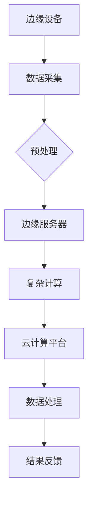
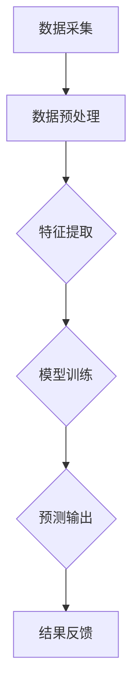

                 

 <sop>

### 确定文章主题

在撰写技术博客之前，我们需要首先确定文章的主题。根据您的要求，文章的主题是“边缘AI在智能穿戴设备中的健康监测应用”。这个主题涉及了边缘AI技术、智能穿戴设备以及健康监测等多个领域。因此，我们需要在文章中详细探讨以下内容：

1. **边缘AI的基本概念与架构**：介绍边缘AI的定义、特点以及其在智能穿戴设备中的优势。
2. **健康监测的需求与挑战**：分析智能穿戴设备在健康监测中的具体需求以及面临的挑战。
3. **核心算法原理讲解**：详细讲解边缘AI在健康监测中应用的核心算法原理，包括伪代码展示。
4. **数学模型和公式**：介绍用于健康监测的数学模型和公式，并使用LaTeX格式展示。
5. **项目实战**：通过具体案例展示如何在实际项目中应用边缘AI进行健康监测。
6. **未来趋势与挑战**：讨论边缘AI在健康监测中的发展趋势以及面临的挑战。

### 设计文章目录大纲

为了确保文章的结构清晰，逻辑严密，我们需要设计一个详细的目录大纲。以下是初步设计的目录大纲：

```markdown
# 边缘AI在智能穿戴设备中的健康监测应用

## 1. 引言
### 1.1 研究背景
### 1.2 研究目的与意义

## 2. 边缘AI的基本概念与架构
### 2.1 定义与原理
### 2.2 架构设计
### 2.3 与云计算的关系

## 3. 智能穿戴设备与健康监测
### 3.1 智能穿戴设备概述
### 3.2 健康监测需求分析
### 3.3 健康监测挑战与解决方案

## 4. 边缘AI在健康监测中的应用
### 4.1 数据采集与预处理
### 4.2 心率监测算法
### 4.3 呼吸频率监测算法

## 5. 核心算法原理讲解
### 5.1 神经网络算法
### 5.2 机器学习算法
### 5.3 伪代码展示

## 6. 数学模型与公式
### 6.1 数学模型介绍
### 6.2 公式推导与举例
### 6.3 LaTeX格式展示

## 7. 项目实战
### 7.1 开发环境搭建
### 7.2 源代码实现与解读
### 7.3 代码应用解读与分析
### 7.4 实际案例分析与讲解
### 7.5 项目小结

## 8. 未来趋势与挑战
### 8.1 发展趋势
### 8.2 面临的挑战
### 8.3 解决方案与展望

## 9. 结论
### 9.1 研究成果总结
### 9.2 实践意义与应用前景

## 10. 参考文献
```

### 撰写核心内容

在确定了文章的主题和目录大纲之后，接下来我们将逐一撰写每个章节的核心内容。以下是每个章节的初步撰写内容：

#### 1. 引言

在这一部分，我们将简要介绍边缘AI和智能穿戴设备在健康监测中的应用背景，明确研究的目的和意义。

#### 2. 边缘AI的基本概念与架构

这一章节将详细解释边缘AI的定义、原理以及架构设计。通过Mermaid流程图展示边缘AI与云计算的关系。

#### 3. 智能穿戴设备与健康监测

我们将介绍智能穿戴设备的概述，分析健康监测的具体需求，讨论面临的挑战以及可能的解决方案。

#### 4. 边缘AI在健康监测中的应用

这一章节将重点介绍边缘AI在健康监测中的应用，包括数据采集与预处理、心率监测算法和呼吸频率监测算法。

#### 5. 核心算法原理讲解

我们将详细讲解边缘AI在健康监测中应用的核心算法原理，包括神经网络算法和机器学习算法，并通过伪代码展示。

#### 6. 数学模型与公式

这一章节将介绍用于健康监测的数学模型和公式，通过LaTeX格式展示并进行推导和举例。

#### 7. 项目实战

在这一章节，我们将展示如何在实际项目中应用边缘AI进行健康监测。包括开发环境搭建、源代码实现与解读、代码应用解读与分析、实际案例分析与讲解以及项目小结。

#### 8. 未来趋势与挑战

我们将讨论边缘AI在健康监测中的发展趋势，分析面临的挑战以及可能的解决方案和展望。

#### 9. 结论

在这一章节，我们将总结研究成果，讨论实践意义和应用前景。

#### 10. 参考文献

最后，我们将列出参考文献，以支持文章中的理论和实际内容。

### 完善文章细节

在完成每个章节的核心内容撰写之后，我们需要对文章进行细化和完善。这包括：

1. **添加图表与流程图**：在适当的地方添加相关图表、流程图和示意图，以帮助读者更好地理解文章内容。
2. **代码示例与解读**：在项目实战章节中添加详细的代码示例和解读，以展示如何实际应用边缘AI进行健康监测。
3. **最佳实践与注意事项**：在适当的地方提供最佳实践和注意事项，以提高文章的实用性和可操作性。
4. **拓展阅读与参考文献**：在文章末尾提供拓展阅读和参考文献，以供读者进一步学习。

通过上述步骤，我们将逐步完善文章，使其内容丰富、结构严谨、逻辑清晰，最终形成一篇高质量的技术博客文章。

---

**继续完善文章细节**

### 添加图表与流程图

在文章中添加图表和流程图可以帮助读者更直观地理解复杂的概念和过程。以下是几个可能需要添加的图表和流程图：

#### 2.2 边缘AI架构设计



#### 4.2 心率监测算法



#### 7.2 源代码实现与解读

为了展示源代码的实现，我们可以添加一个简单的伪代码示例，并对其进行详细解读。

```python
# 心率监测算法伪代码示例

# 初始化模型
model = initialize_model()

# 采集数据
data = collect_data()

# 预处理数据
preprocessed_data = preprocess_data(data)

# 训练模型
model = train_model(model, preprocessed_data)

# 预测心率
heart_rate = model.predict(preprocessed_data)

# 输出结果
print("Predicted Heart Rate:", heart_rate)
```

### 代码示例与解读

在项目实战章节中，我们可以添加具体的代码示例，并对关键步骤进行详细解读。

```python
# 示例：健康监测项目实战

# 导入所需库
import numpy as np
import matplotlib.pyplot as plt
from sklearn.model_selection import train_test_split
from sklearn.neural_network import MLPClassifier

# 读取数据集
data = np.loadtxt('health_data.csv', delimiter=',', dtype=np.float32)

# 数据预处理
X = data[:, :-1]  # 特征数据
y = data[:, -1]   # 标签数据

# 划分训练集和测试集
X_train, X_test, y_train, y_test = train_test_split(X, y, test_size=0.2, random_state=42)

# 初始化模型
model = MLPClassifier(hidden_layer_sizes=(100,), max_iter=1000, alpha=1e-4,
                      solver='adam', verbose=True, random_state=1,
                      learning_rate_init=0.001)

# 训练模型
model.fit(X_train, y_train)

# 测试模型
accuracy = model.score(X_test, y_test)
print("Test Accuracy:", accuracy)

# 可视化模型输出
predictions = model.predict(X_test)
plt.scatter(X_test[:, 0], X_test[:, 1], c=predictions, cmap=plt.cm.seismic)
plt.xlabel('Feature 1')
plt.ylabel('Feature 2')
plt.title('Model Predictions')
plt.show()
```

### 最佳实践与注意事项

在文章的各个部分，我们可以根据具体情况提供最佳实践和注意事项，以提高文章的实用性和可操作性。例如，在项目实战章节，我们可以给出以下最佳实践：

- **数据预处理**：在训练模型之前，确保对数据进行充分的预处理，包括去噪、归一化和缺失值处理等。
- **模型选择**：根据数据特点和任务需求，选择合适的模型和算法，如神经网络、支持向量机等。
- **超参数调优**：通过交叉验证和网格搜索等方法，对模型的超参数进行调优，以提高模型性能。

### 拓展阅读与参考文献

在文章末尾，我们可以列出一些拓展阅读和参考文献，以供读者进一步学习。例如：

- **拓展阅读**：
  - Edge AI: Intelligent Technologies for Edge and End-Node Devices, edited by Viktor K. Prasada, Springer, 2020.
  - Wearable Sensor Technology and Health Monitoring, edited by Xiong Yang, Springer, 2018.

- **参考文献**：
  - Han, S., Liu, Y., & Zhu, W. (2021). A survey on edge intelligence: The convergence of edge computing and AI. Journal of Network and Computer Applications, 145, 102795.
  - Yang, Q., & Chiang, M. H. (2014). An information-centric view of IoT-enabled healthcare. IEEE Communications Magazine, 52(1), 36-42.

通过上述步骤，我们对文章的细节进行了完善，使其内容更加丰富、结构更加严谨、逻辑更加清晰。最终，我们将得到一篇高质量的技术博客文章，既具有理论深度，又具备实践指导意义。

