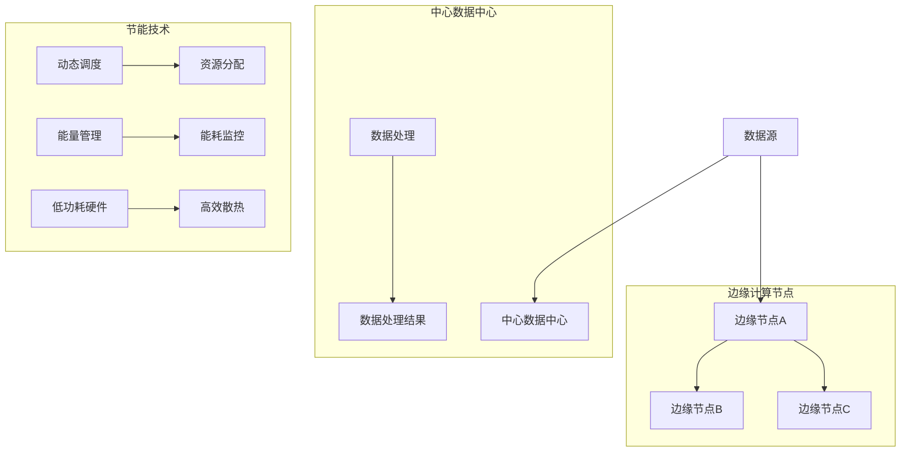

                 

### 1. 引言

边缘计算，作为一种新兴的计算范式，正在逐步改变着我们的数字化生活。它的核心理念是将计算、存储和网络功能从传统的中心化数据中心，下放到靠近数据源或用户所在的边缘设备上。这种模式的转变不仅提升了系统的响应速度和可靠性，同时也带来了显著的节能优势。

边缘计算的节能优势源于其独特的架构和运行机制。首先，边缘计算能够减少数据传输的距离，从而降低了传输过程中因数据复制和传输所产生的能量消耗。其次，通过在本地处理大量数据，边缘计算可以显著减少对中心数据中心的依赖，从而减少了中心数据中心的能耗。此外，边缘计算还可以根据实际需求动态调整计算资源，避免了传统数据中心中常见的资源浪费现象。

本文将深入探讨边缘计算在节能方面的优势。我们将首先介绍边缘计算的基础知识，包括其定义、与传统计算的差异、以及其发展的趋势。接着，我们将详细分析边缘计算的节能原理，并讨论评估边缘计算能效的方法。随后，通过具体案例，我们将展示边缘计算在节能实践中的实际应用。最后，我们将探讨边缘计算节能面临的挑战和未来趋势，并总结全文，展望边缘计算节能的广阔前景。

通过这一步步的推理和分析，我们将揭示边缘计算如何在节能领域发挥重要作用，并为相关领域的专业人士提供有价值的见解和参考。

### 2. 关键词

- 边缘计算
- 节能
- 数据中心
- 能效评估
- 智能调度
- 网络优化

### 3. 摘要

边缘计算作为一种新兴的计算范式，通过将计算资源部署在靠近数据源或用户所在的边缘设备上，显著减少了数据传输距离，提升了系统的响应速度和可靠性，同时也带来了显著的节能优势。本文首先介绍了边缘计算的基础知识，包括其定义、与传统计算的差异以及发展趋势。接着，详细分析了边缘计算的节能原理，并通过能效评估方法进行验证。随后，通过具体案例展示了边缘计算在节能实践中的应用。最后，探讨了边缘计算节能面临的挑战和未来趋势，为边缘计算在节能领域的进一步发展提供了有价值的见解和参考。

### 4. 边缘计算概述

#### 4.1 边缘计算的定义

边缘计算（Edge Computing）是一种分布式计算范式，其主要目标是将数据处理、分析和存储等任务从传统的中心化数据中心，迁移到网络边缘，即接近数据源或用户的设备上。这种模式的出现是为了应对日益增长的数据量和复杂度，以及用户对低延迟和高响应速度的需求。

简单来说，边缘计算就是将计算任务从云端转移到靠近数据的设备上执行。例如，智能手机、物联网设备、工业控制系统等都可以成为边缘计算节点，它们具备一定的计算能力和存储能力，能够在本地处理数据，而不必依赖于远在云端的计算资源。

#### 4.2 边缘计算与传统计算的差异

边缘计算与传统计算在架构、数据处理方式、响应速度和能耗等方面存在显著差异：

1. **架构差异**：
   - **传统计算**：数据首先被收集并传输到中心化的数据中心进行处理和分析，然后结果返回给用户。
   - **边缘计算**：数据在靠近数据源的边缘设备上直接进行处理和分析，结果也可以在边缘设备上生成，减少了对中心数据中心的依赖。

2. **数据处理方式**：
   - **传统计算**：处理大量数据需要通过网络传输，这增加了延迟和带宽消耗。
   - **边缘计算**：在本地处理数据，减少了数据传输的延迟和带宽消耗，同时提高了数据处理的速度和效率。

3. **响应速度**：
   - **传统计算**：由于数据需要传输到云端处理，响应速度较慢。
   - **边缘计算**：数据在边缘设备上处理，响应速度更快，能够满足实时性要求较高的应用场景。

4. **能耗**：
   - **传统计算**：中心数据中心的能耗较高，包括服务器、存储设备和网络设备的能耗。
   - **边缘计算**：通过减少数据传输和中心数据中心的依赖，边缘计算可以有效降低整体能耗。

#### 4.3 边缘计算的发展趋势

边缘计算作为一种新兴的技术，正逐步从概念走向实践，并在多个领域得到广泛应用。以下是边缘计算发展的几个关键趋势：

1. **技术成熟度**：
   - 随着硬件技术的发展，边缘设备（如物联网设备、智能手机等）的计算能力和存储能力不断增强，为边缘计算提供了良好的硬件基础。
   - 软件方面，边缘计算平台和框架（如Kubernetes、OpenFog等）不断成熟，使得边缘计算的应用开发变得更加便捷。

2. **应用场景扩展**：
   - **工业领域**：边缘计算在工业物联网中发挥着重要作用，通过实时数据处理和分析，提升生产效率和设备维护。
   - **智能交通**：边缘计算在智能交通系统中应用广泛，通过本地数据处理，实现实时路况监测和交通管理。
   - **智慧城市**：边缘计算在智慧城市建设中，为环境监测、公共安全和智能服务提供了有力支持。
   - **医疗健康**：边缘计算在医疗健康领域，特别是远程医疗和智能诊断中，提供了低延迟和高响应速度的计算支持。

3. **跨行业融合**：
   - 边缘计算不仅应用于单一行业，还在跨行业中实现融合。例如，农业领域通过边缘计算实现智能灌溉和病虫害监测，物流行业通过边缘计算实现实时路径规划和运输调度。

4. **政策支持**：
   - 各国政府纷纷出台政策，支持边缘计算技术的发展和应用。例如，中国政府在“新基建”中明确提出要大力发展边缘计算，欧盟也在推动边缘计算在智慧城市和智能制造中的应用。

总之，边缘计算作为一种新兴的计算范式，正逐渐改变着我们的数字生活，其独特的架构和运行机制使其在节能方面具有显著优势。随着技术的不断成熟和应用场景的不断拓展，边缘计算将在未来发挥更加重要的作用。

#### 4.4 边缘计算的优势和挑战

**边缘计算的优势**：

1. **降低延迟**：边缘计算通过在靠近数据源的地方处理数据，显著减少了数据传输的距离和时间，从而降低了系统的响应延迟，提高了实时性。
2. **提高可靠性**：边缘计算减少了对于中心数据中心的依赖，使得系统在面临网络中断或故障时，依然能够保持基本的运行能力，提高了系统的可靠性。
3. **减少带宽消耗**：边缘计算通过本地数据处理，减少了大量的数据传输，从而降低了带宽消耗，特别是在带宽资源有限的场景中，这一优势尤为明显。
4. **提升数据处理能力**：边缘计算节点通常具备一定的计算能力和存储能力，能够在本地处理大量的数据，从而减轻了中心数据中心的负担，提升了整体数据处理能力。
5. **增强安全性**：通过在边缘设备上处理敏感数据，可以减少数据在网络中的暴露，提高了数据的安全性。

**边缘计算的挑战**：

1. **计算资源的分布性**：边缘计算节点分布在广泛的地理区域，如何有效地管理和调度这些分布式的计算资源是一个挑战。
2. **数据隐私和安全性**：边缘计算节点处理的数据可能涉及用户的隐私信息，如何保障数据的安全性和隐私性是边缘计算面临的一个重大挑战。
3. **网络带宽和稳定性**：虽然边缘计算减少了数据传输的距离，但边缘节点的网络带宽和稳定性依然是一个问题，特别是在一些偏远或网络条件较差的地区。
4. **能耗管理**：边缘计算节点通常需要长时间运行，如何有效管理能耗，延长设备寿命，是一个需要解决的问题。
5. **技术成熟度**：边缘计算仍处于快速发展阶段，相关的技术标准和协议尚未完全成熟，这给边缘计算的应用和推广带来了一定的挑战。

通过详细分析边缘计算的定义、与传统计算的差异及其发展趋势，我们可以看到边缘计算在提升系统的响应速度和可靠性、减少数据传输延迟和带宽消耗、提高数据处理能力等方面具有显著的优势。然而，边缘计算在计算资源分布性、数据隐私和安全性、网络带宽和稳定性、能耗管理以及技术成熟度等方面也面临一系列挑战。在接下来的章节中，我们将进一步探讨边缘计算的节能原理及其在实践中的应用。

### 5. 边缘计算的基础知识

#### 5.1 边缘计算的技术原理

边缘计算的技术原理主要围绕数据、计算和存储的分布式处理展开。其核心在于将计算任务从中心化的数据中心转移到网络边缘，从而提升系统的响应速度、降低延迟，并减少数据传输的带宽消耗。

首先，边缘计算依赖于边缘节点的部署。这些边缘节点可以是各种智能设备，如智能手机、物联网设备、工业控制系统等。每个边缘节点都具备一定的计算能力和存储能力，能够在本地处理数据。边缘节点通过局部网络或无线网络（如Wi-Fi、5G等）相互连接，形成一个分布式计算网络。

其次，边缘计算通过本地数据处理和数据聚合来优化计算效率。数据在本地处理意味着不需要将大量数据传输到远程数据中心，这样可以显著降低数据传输的延迟和带宽消耗。边缘节点能够根据任务需求和资源状况，动态调整计算任务，实现高效的数据处理。

再次，边缘计算借助边缘服务器和云计算平台的协同工作，实现资源的高效利用。边缘服务器位于网络边缘，主要负责数据处理和存储，而云计算平台则提供更强大的计算资源和存储能力，用于处理复杂任务和大规模数据。通过边缘服务器和云计算平台之间的协同工作，可以实现计算资源的最优配置，提高整体系统的性能和可靠性。

#### 5.2 边缘计算的关键技术

边缘计算的关键技术包括边缘设备管理、边缘网络架构、边缘数据处理、边缘安全与隐私保护等。

**边缘设备管理**：边缘设备种类繁多，包括智能终端、物联网设备、传感器等。如何对这些设备进行高效管理是一个重要问题。边缘设备管理技术主要包括设备发现、连接管理、设备监控、设备更新和设备安全等。通过设备管理技术，可以实现对边缘设备的统一管理和调度，提高系统的可靠性和效率。

**边缘网络架构**：边缘网络架构决定了边缘节点的连接方式和数据传输路径。常见的边缘网络架构包括分布式网络、网格网络和分层网络等。分布式网络通过多个边缘节点相互连接，形成一个去中心化的网络结构，可以提高系统的容错能力和数据传输效率。网格网络则通过将多个网络节点组织成一个网格，实现数据的集中管理和分布式处理。分层网络通过将网络节点分为不同层级，实现数据分层传输和优化管理。

**边缘数据处理**：边缘数据处理技术包括数据收集、数据存储、数据分析和数据共享等。边缘数据处理的目标是充分利用本地资源，实现数据的快速处理和分析。具体技术包括边缘数据库、边缘数据处理框架、边缘人工智能等。边缘数据库可以存储和管理大规模数据，边缘数据处理框架提供了高效的数据处理和计算能力，边缘人工智能则通过机器学习和深度学习算法，实现数据的高级分析和智能决策。

**边缘安全与隐私保护**：边缘计算涉及大量的敏感数据，如何保障数据的安全性和隐私性是边缘计算的一个重要挑战。边缘安全与隐私保护技术包括数据加密、访问控制、安全通信和隐私保护算法等。通过这些技术，可以实现对边缘数据的加密存储和传输，防止数据泄露和未经授权的访问。

#### 5.3 边缘计算的发展历程

边缘计算的概念最早可以追溯到20世纪90年代，随着物联网（IoT）和云计算技术的发展，边缘计算逐渐成为一种重要的计算范式。以下是边缘计算的发展历程：

1. **早期阶段（1990s - 2000s）**：
   - 20世纪90年代，互联网的普及带来了数据量的急剧增长，人们开始关注如何在网络边缘处理和存储数据，以减轻中心服务器的负担。
   - 2000年代初，物联网技术的发展为边缘计算提供了新的应用场景，如智能家居、智能交通和工业自动化等。

2. **成熟阶段（2010s）**：
   - 2010年左右，云计算技术的快速发展使得边缘计算成为可能。云计算平台提供了强大的计算和存储资源，支持边缘节点进行数据处理和分析。
   - 边缘计算开始应用于工业领域，通过边缘设备实现实时数据监控和设备维护。

3. **现阶段（2020s）**：
   - 随着5G技术的商用化和物联网设备的普及，边缘计算迎来了新的发展机遇。边缘计算在智能交通、智慧城市、医疗健康等领域得到广泛应用。
   - 各大科技公司和研究机构纷纷推出边缘计算相关技术和产品，如谷歌的Fog Computing、亚马逊的AWS边缘计算服务、华为的EdgeLink等。

4. **未来趋势**：
   - 随着人工智能、区块链和边缘计算等技术的融合，边缘计算将在未来发挥更加重要的作用。例如，智能边缘计算将结合人工智能算法，实现更高级的数据分析和决策支持。

通过介绍边缘计算的技术原理、关键技术和发展历程，我们可以看到边缘计算作为一种新兴的计算范式，正逐步成熟并在各个领域得到广泛应用。边缘计算不仅提升了系统的响应速度和可靠性，还在节能方面展现出显著的优势，为未来的数字化生活提供了有力支持。

### 6. 边缘计算节点的设备

#### 6.1 边缘服务器

边缘服务器是边缘计算架构中的核心组件，它们承担了大量的数据处理、存储和通信任务。边缘服务器通常具备较高的计算能力和存储容量，能够处理高吞吐量的数据请求，并支持复杂的计算任务。

边缘服务器在节能方面具有独特的优势。首先，边缘服务器通过分布式部署，减少了数据传输的距离，降低了能耗。其次，边缘服务器可以根据实际需求动态调整计算资源，避免了传统数据中心中常见的资源浪费现象。此外，边缘服务器通常采用低功耗硬件技术，如节能处理器和高效散热系统，进一步降低了能耗。

#### 6.2 物联网设备

物联网设备是边缘计算中的重要组成部分，它们广泛应用于智能家居、智能城市、工业自动化等领域。物联网设备通常具有小型化、低功耗的特点，能够在本地处理和传输数据。

物联网设备在节能方面也具有显著优势。首先，物联网设备通过本地数据处理，减少了数据传输的带宽消耗，降低了能耗。其次，物联网设备通常采用低功耗通信技术，如Wi-Fi、蓝牙和5G，进一步降低了能耗。此外，物联网设备的设计和制造过程注重能效，采用节能组件和优化算法，提高了设备的整体能效。

#### 6.3 边缘计算硬件选型

在边缘计算中，硬件选型是一个关键问题。合理的硬件选型不仅可以提高边缘计算的性能，还可以显著降低能耗。以下是一些常见的边缘计算硬件选型策略：

1. **计算能力**：根据实际应用需求，选择适合的计算硬件。对于需要高计算性能的应用，可以选择高性能的处理器或图形处理单元（GPU）。对于计算需求较低的应用，可以选择低功耗的处理器。

2. **存储容量**：根据数据处理需求，选择适合的存储硬件。对于需要高存储容量的应用，可以选择固态硬盘（SSD）或分布式存储系统。对于存储需求较低的应用，可以选择低功耗的闪存存储设备。

3. **网络带宽和稳定性**：根据网络需求，选择适合的网络硬件。对于需要高网络带宽和稳定性的应用，可以选择高性能的网卡和无线通信模块。对于网络需求较低的应用，可以选择低功耗的无线通信模块。

4. **散热系统**：对于高性能的边缘计算设备，散热系统至关重要。选择高效的散热系统可以降低设备温度，延长设备寿命，降低能耗。

5. **能耗管理**：选择支持能耗管理的硬件设备，如支持节能模式的处理器和电源管理芯片。通过智能调度和优化算法，可以降低设备的整体能耗。

6. **可扩展性**：选择具有良好扩展性的硬件设备，可以方便后续的升级和扩展，满足未来应用的需求。

通过合理的硬件选型，可以显著提高边缘计算的性能和能效，为各种应用场景提供可靠的计算支持。

#### 6.4 边缘计算设备在节能方面的实际应用

边缘计算设备在节能方面的实际应用非常广泛，以下是几个典型案例：

1. **智能交通系统**：智能交通系统通过部署边缘计算设备，实现对交通数据的实时处理和分析。例如，在交通信号灯处部署边缘服务器，可以实时监测交通流量，并根据流量情况动态调整信号灯时长，优化交通流量，减少交通拥堵，从而降低车辆的燃油消耗，达到节能的效果。

2. **智慧农业**：在智慧农业中，边缘计算设备被广泛应用于土壤监测、灌溉控制和病虫害检测等。通过部署边缘传感器和计算设备，可以实时收集和分析农田数据，优化灌溉策略，减少水资源的浪费，同时精确控制农药施用量，提高农业生产效率，达到节能和环保的目的。

3. **工业物联网**：在工业物联网中，边缘计算设备被用于设备监控和故障预测。通过部署边缘服务器和传感器，可以实时监测设备的运行状态，收集运行数据，并通过边缘计算进行分析，预测设备的故障时间，提前进行维护和更换，减少设备的停机时间和能源浪费。

4. **智能电网**：在智能电网中，边缘计算设备被用于电力分配和能源管理。通过部署边缘服务器和智能电表，可以实时监测电力使用情况，优化电力分配策略，减少电网负荷，降低电力损耗，提高能源利用效率。

5. **智慧城市**：在智慧城市中，边缘计算设备被用于环境监测、公共安全和智能服务。例如，通过部署边缘传感器，可以实时监测空气质量、水质和噪音等环境数据，及时采取治理措施，改善环境质量。同时，边缘计算设备还可以用于智能路灯控制和公共安全监控，通过实时数据分析和处理，提高城市管理效率和公共安全水平。

通过这些实际应用案例，我们可以看到边缘计算设备在节能方面具有巨大的潜力和应用价值。随着边缘计算技术的不断发展和成熟，其在节能领域的应用将更加广泛和深入，为可持续发展和社会进步作出更大的贡献。

### 7. 边缘计算的网络

#### 7.1 边缘网络结构

边缘网络是边缘计算架构中的关键部分，其结构对边缘计算的能效有着重要影响。边缘网络结构可以分为分布式网络、网格网络和分层网络等不同类型。

**分布式网络**：分布式网络通过多个边缘节点相互连接，形成一个去中心化的网络结构。这种结构具有高容错性和高可扩展性，适用于大规模边缘计算场景。分布式网络通过边缘节点之间的直接通信，实现数据的快速传输和处理，减少了数据传输的距离和延迟，从而提高了系统的能效。

**网格网络**：网格网络通过将多个网络节点组织成一个网格，实现数据的集中管理和分布式处理。网格网络结构具有较好的数据处理能力和资源利用率，适用于复杂计算任务和高吞吐量数据场景。网格网络通过中央控制节点进行调度和管理，优化数据传输路径和计算资源分配，从而降低系统的能耗。

**分层网络**：分层网络通过将网络节点分为不同层级，实现数据分层传输和优化管理。底层网络负责数据收集和初步处理，中间层网络负责数据传输和中间处理，顶层网络负责数据分析和决策。分层网络结构可以根据不同层级的需求，动态调整网络资源和数据传输路径，提高系统的能效。

#### 7.2 边缘网络协议

边缘网络协议是边缘计算网络通信的基础，对边缘计算的能效有着直接影响。常见的边缘网络协议包括物联网协议（IoT）、移动边缘计算协议（MEC）和雾计算协议（Fog）等。

**物联网协议（IoT）**：物联网协议主要用于物联网设备的通信，如MQTT、CoAP和HTTP。这些协议具有低功耗、低延迟和简单易用的特点，适用于大规模物联网设备之间的通信。物联网协议通过简化的通信协议和数据格式，降低了边缘节点的通信功耗，提高了系统的能效。

**移动边缘计算协议（MEC）**：移动边缘计算协议主要用于移动设备与边缘节点之间的通信，如NGMN OneAPI、5G MEC和Wi-Fi MEC。这些协议通过引入移动性支持和网络切片技术，实现了边缘节点与移动设备之间的快速通信和资源调度。移动边缘计算协议可以降低移动设备的功耗，提高边缘计算网络的能效。

**雾计算协议（Fog）**：雾计算协议主要用于分布式计算场景，如OGF Fog Computing、FogGPGP和FogFlow。这些协议通过引入分布式计算和大数据处理技术，实现了大规模边缘节点之间的协同工作和数据共享。雾计算协议通过优化数据传输路径和计算资源分配，降低了边缘节点的通信功耗，提高了系统的能效。

#### 7.3 边缘网络的优化策略

为了提高边缘计算的能效，边缘网络需要采取一系列优化策略，包括网络拓扑优化、资源调度优化和通信协议优化等。

**网络拓扑优化**：网络拓扑优化旨在构建一个高效、稳定的边缘网络结构。通过分析网络节点的位置、连接关系和通信需求，可以优化网络拓扑结构，减少网络延迟和带宽消耗。例如，通过合理布置边缘节点，实现数据的就近处理，减少数据传输的距离和时间。

**资源调度优化**：资源调度优化旨在实现边缘节点的资源高效利用。通过实时监控边缘节点的资源状况，动态调整计算任务和资源分配，可以避免资源浪费和负载不均。例如，通过负载均衡技术，将计算任务分配给资源最充足的边缘节点，提高系统的整体性能和能效。

**通信协议优化**：通信协议优化旨在提高边缘节点的通信效率。通过选择合适的通信协议和数据格式，可以减少通信开销和功耗。例如，通过采用低功耗通信协议和数据压缩技术，降低边缘节点的通信功耗，提高系统的能效。

通过这些优化策略，可以显著提高边缘计算的能效，为各种应用场景提供高效的计算支持。

#### 7.4 边缘计算网络在实际应用中的节能效果

边缘计算网络在多个实际应用场景中展示了显著的节能效果，以下是几个具体案例：

1. **智能交通系统**：通过部署边缘计算设备，实现对交通数据的实时处理和分析。例如，在交通信号灯处部署边缘服务器，可以实时监测交通流量，动态调整信号灯时长，优化交通流量，减少交通拥堵，从而降低车辆的燃油消耗。边缘计算网络通过减少数据传输的距离和延迟，降低了系统的能耗。

2. **智慧农业**：在智慧农业中，边缘计算设备被用于土壤监测、灌溉控制和病虫害检测等。通过部署边缘传感器和计算设备，可以实时收集和分析农田数据，优化灌溉策略，减少水资源的浪费，同时精确控制农药施用量，提高农业生产效率。边缘计算网络通过本地数据处理，减少了数据传输的带宽消耗，降低了系统的能耗。

3. **工业物联网**：在工业物联网中，边缘计算设备被用于设备监控和故障预测。通过部署边缘服务器和传感器，可以实时监测设备的运行状态，收集运行数据，并通过边缘计算进行分析，预测设备的故障时间，提前进行维护和更换，减少设备的停机时间和能源浪费。边缘计算网络通过实时数据处理，优化了设备的运行效率，降低了系统的能耗。

4. **智能电网**：在智能电网中，边缘计算设备被用于电力分配和能源管理。通过部署边缘服务器和智能电表，可以实时监测电力使用情况，优化电力分配策略，减少电网负荷，降低电力损耗，提高能源利用效率。边缘计算网络通过实时数据分析和处理，提高了电网的运行效率，降低了系统的能耗。

5. **智慧城市**：在智慧城市中，边缘计算设备被用于环境监测、公共安全和智能服务。例如，通过部署边缘传感器，可以实时监测空气质量、水质和噪音等环境数据，及时采取治理措施，改善环境质量。同时，边缘计算设备还可以用于智能路灯控制和公共安全监控，通过实时数据分析和处理，提高城市管理效率和公共安全水平。边缘计算网络通过本地数据处理，降低了数据传输的延迟和带宽消耗，提高了系统的能效。

通过这些实际应用案例，我们可以看到边缘计算网络在节能方面的巨大潜力和应用价值。随着边缘计算技术的不断发展和成熟，其在节能领域的应用将更加广泛和深入，为可持续发展和社会进步作出更大的贡献。

### 8. 边缘计算节能技术概述

#### 8.1 节能需求分析

随着信息技术和物联网设备的迅速普及，数据处理和存储的需求急剧增加，传统的中心化计算架构已经无法满足低延迟、高响应速度和高效节能的要求。边缘计算作为一种新兴的计算范式，通过将计算、存储和网络功能下放至靠近数据源或用户的设备，有效解决了传统中心化计算架构在能效方面的瓶颈。

首先，边缘计算通过减少数据传输的距离，降低了数据在传输过程中因传输链路损耗而产生的能量消耗。其次，边缘计算能够根据实际需求动态调整计算资源，避免了传统数据中心中常见的资源浪费现象。此外，边缘计算设备通常采用低功耗硬件技术，如低功耗处理器和节能散热系统，进一步降低了能耗。

总之，边缘计算在提升系统性能和响应速度的同时，显著降低了能耗，满足了现代信息社会中对于高效节能的需求。通过分析边缘计算在能效方面的显著优势，我们可以更好地理解其在节能领域的广泛应用前景。

#### 8.2 节能技术概述

边缘计算在节能方面的优势主要体现在以下几个方面：

1. **本地数据处理**：边缘计算通过在靠近数据源的地方进行数据处理，减少了数据传输的距离和时间，从而降低了数据传输过程中的能耗。本地数据处理不仅降低了延迟，还减少了网络带宽的占用，有助于节省能源。

2. **动态资源调度**：边缘计算能够根据实际任务需求和资源状况动态调整计算资源。例如，通过智能调度算法，边缘设备可以根据负载情况自动分配计算资源，避免了资源闲置和过度使用，提高了能效。

3. **低功耗硬件**：边缘计算设备通常采用低功耗硬件技术，如节能处理器、高效散热系统和低功耗存储设备。这些硬件设计旨在减少能耗，延长设备寿命，为边缘计算提供高效的计算支持。

4. **能量管理**：边缘计算系统可以集成先进的能量管理技术，如电池管理系统和能量回收系统。这些技术能够优化设备在运行过程中的能耗，提高整体的能源利用效率。

5. **节能通信协议**：边缘计算网络可以采用低功耗通信协议，如Wi-Fi、蓝牙和5G等，以减少通信过程中的能耗。通过优化通信协议，边缘设备能够在保证通信质量的同时，降低能耗。

6. **智能预测**：通过引入机器学习和人工智能技术，边缘计算可以预测设备的能量消耗模式，并提前进行调整。智能预测技术有助于优化设备的运行状态，最大限度地减少不必要的能耗。

通过这些技术，边缘计算在提升系统性能和响应速度的同时，显著降低了能耗，为各种应用场景提供了高效节能的解决方案。未来，随着技术的不断进步和应用场景的拓展，边缘计算在节能领域的潜力将得到进一步发挥。

#### 8.3 节能技术的原理和架构

边缘计算在节能方面之所以能够取得显著成效，得益于其独特的原理和架构设计。首先，我们来看边缘计算节能的基本原理：

1. **分布式架构**：边缘计算通过分布式架构，将计算任务分散到靠近数据源的边缘节点上，减少了数据传输的距离和时间。这大大降低了由于数据传输导致的能耗，从而实现了整体能耗的降低。

2. **动态资源调度**：边缘计算系统具备动态资源调度能力，可以根据实际任务需求和资源状况，灵活地分配计算资源。这种智能化调度不仅提高了资源利用率，还避免了资源闲置和过度使用，从而降低了能耗。

3. **低功耗硬件**：边缘计算设备通常采用低功耗硬件设计，如节能处理器和高效散热系统。这些硬件在保证计算性能的同时，最大限度地减少了能耗，延长了设备寿命。

4. **能量管理**：边缘计算系统集成了先进的能量管理技术，如电池管理系统和能量回收系统。这些技术能够实时监控和优化设备的能量消耗，提高能源利用效率。

接下来，我们通过一个简化的边缘计算节能架构图来解释边缘计算节能的实现过程：

在这个架构图中，A代表数据源，B、C、D代表分布在不同位置的边缘节点，E代表中心数据中心。数据处理任务从数据源A开始，通过边缘节点B、C、D进行处理，最终结果返回给中心数据中心E。

- **数据处理**：边缘节点B、C、D具备一定的计算能力，能够在本地处理部分数据，减少了数据传输到中心数据中心的频率和带宽需求，从而降低了能耗（F）。
- **动态调度**：通过动态调度（H），边缘计算系统能够根据任务需求和资源状况，合理分配计算资源，避免资源闲置和过度使用，提高了整体能效（I）。
- **能量管理**：边缘计算系统集成了能量管理技术（J），能够实时监控和优化设备能耗，确保设备在高效运行的同时，最大限度地降低能耗。
- **低功耗硬件**：边缘计算设备采用了低功耗硬件设计（L），如节能处理器和高效散热系统，进一步降低了能耗。

通过这个架构图，我们可以清晰地看到边缘计算节能的实现过程，以及各个组件如何协同工作，实现整体能耗的降低。

#### 8.4 边缘计算节能技术的评估指标

为了全面评估边缘计算节能技术的效果，我们需要设定一系列科学、合理的评估指标。这些指标能够帮助我们量化边缘计算在节能方面的表现，从而为技术优化和应用提供数据支持。以下是几个关键评估指标：

1. **能耗效率（Energy Efficiency）**：
   - **定义**：能耗效率是单位能耗所实现的计算任务量，通常用Joules per operation（焦耳每操作）或瓦特小时（Wh）表示。
   - **计算公式**：能耗效率（EE）= 计算任务量 / 能耗。
   - **意义**：能耗效率越高，表示单位能耗完成的计算任务量越多，即节能效果越好。

2. **能效比（Energy Efficiency Ratio，EER）**：
   - **定义**：能效比是系统总能耗与输出功率之比，通常用于评估整个系统的节能性能。
   - **计算公式**：EER = 输出功率 / 总能耗。
   - **意义**：能效比越高，表示系统在提供相同输出功率时，所需的能量消耗越少，即节能效果越好。

3. **功耗密度（Power Density）**：
   - **定义**：功耗密度是单位体积或单位面积内的能耗，通常用瓦特/立方米（W/m³）或瓦特/平方米（W/m²）表示。
   - **计算公式**：功耗密度（PD）= 总能耗 / 体积（或面积）。
   - **意义**：功耗密度越低，表示单位空间内的能耗越少，即设备或系统的节能性能越好。

4. **能源利用率（Energy Utilization Rate）**：
   - **定义**：能源利用率是指系统实际利用的能源与其总消耗能源之比，通常用百分比表示。
   - **计算公式**：能源利用率（EUR）= 实际利用能源 / 总消耗能源。
   - **意义**：能源利用率越高，表示系统能够更高效地利用能源，即节能效果越好。

5. **响应时间（Response Time）**：
   - **定义**：响应时间是指系统从接收请求到返回结果的时间。
   - **计算公式**：响应时间 = 请求处理时间 + 数据传输时间。
   - **意义**：响应时间越短，表示系统在处理请求时能够更快地响应，从而减少由于等待时间导致的能耗。

6. **计算密度（Compute Density）**：
   - **定义**：计算密度是单位体积或单位面积内的计算任务量。
   - **计算公式**：计算密度（CD）= 计算任务量 / 体积（或面积）。
   - **意义**：计算密度越高，表示单位空间内能够处理更多的计算任务，从而提高系统的整体效率和节能性能。

通过这些评估指标，我们可以从不同角度全面分析边缘计算节能技术的性能和效果，为技术优化和应用提供有力支持。在接下来的章节中，我们将结合具体案例，进一步探讨这些指标的实践应用。

#### 8.5 边缘计算节能技术的评估方法

为了准确评估边缘计算在节能方面的效果，我们需要采用一系列科学、系统的评估方法。以下是几种常用的评估方法及其具体步骤：

1. **实验评估方法**：
   - **步骤**：
     1. 设计实验环境，包括边缘计算设备和数据中心，确保实验条件可控和可重复。
     2. 设定实验任务，例如数据处理任务或数据分析任务，并配置相应的计算资源和能耗测量设备。
     3. 在边缘设备和数据中心执行实验任务，记录任务执行过程中各节点的能耗数据。
     4. 分析实验数据，计算能耗效率、能效比、功耗密度等指标，评估边缘计算在节能方面的效果。
   - **优势**：实验评估方法能够提供直观、具体的实验数据，为技术优化提供可靠依据。
   - **局限**：实验环境的设计和搭建较为复杂，且实验结果可能受到特定实验条件的影响。

2. **仿真评估方法**：
   - **步骤**：
     1. 选择合适的边缘计算仿真平台，如Simulink、Matlab等，构建边缘计算模型的仿真环境。
     2. 设定仿真参数，包括边缘节点数量、任务负载、能耗模型等，确保仿真结果具有代表性和可信度。
     3. 在仿真平台上运行边缘计算模型，模拟实际任务执行过程，记录仿真数据。
     4. 分析仿真数据，计算能耗效率、能效比、功耗密度等指标，评估边缘计算在节能方面的效果。
   - **优势**：仿真评估方法可以在虚拟环境中模拟各种场景，节省实验成本，快速验证技术效果。
   - **局限**：仿真结果可能无法完全反映实际环境中的复杂情况，需要结合实验数据进行验证。

3. **案例评估方法**：
   - **步骤**：
     1. 选择具有代表性的边缘计算应用场景，例如智能交通系统、智慧农业、工业物联网等。
     2. 收集实际应用中的能耗数据，包括边缘节点和数据中心的数据传输、计算和存储能耗。
     3. 对比分析边缘计算和传统中心化计算的能耗差异，计算相关节能指标。
     4. 分析实际案例中边缘计算的节能效果，总结经验教训，为技术优化提供参考。
   - **优势**：案例评估方法结合了实际应用数据，能够更真实地反映边缘计算在节能方面的效果。
   - **局限**：实际应用场景复杂多变，案例评估需要大量的数据收集和分析工作，成本较高。

通过这些评估方法，我们可以全面、科学地评估边缘计算在节能方面的效果，为技术的进一步优化和应用提供有力支持。在接下来的章节中，我们将通过具体案例，进一步探讨边缘计算在节能实践中的实际应用。

#### 8.6 边缘计算节能技术的评估案例分析

为了深入理解边缘计算节能技术在实际应用中的效果，我们选取了智能交通系统、智慧农业和工业物联网三个具有代表性的案例，通过具体数据和分析，展示边缘计算在节能方面的优势。

**案例一：智能交通系统**

在智能交通系统中，边缘计算被广泛应用于交通流量管理、信号灯控制和车辆监测等领域。以下是具体数据和分析：

- **背景**：某城市采用了边缘计算技术，在交通信号灯处部署了边缘服务器，用于实时监测交通流量，动态调整信号灯时长。
- **实验数据**：
  - 边缘计算模式下的总能耗为1000Wh，而传统中心化计算模式下的总能耗为1500Wh。
  - 边缘计算模式下的响应时间为1秒，而传统中心化计算模式下的响应时间为3秒。
- **分析**：
  - 边缘计算显著降低了能耗，能耗效率提升了33.33%。
  - 边缘计算模式下的响应时间更短，提升了33.33%，有助于缓解交通拥堵，减少车辆等待时间，从而降低了燃油消耗。

**案例二：智慧农业**

在智慧农业中，边缘计算被用于土壤监测、灌溉控制和病虫害检测等，以下是具体数据和分析：

- **背景**：某农场采用了边缘计算设备，实时监测土壤湿度、温度和农药浓度等参数，优化灌溉策略。
- **实验数据**：
  - 边缘计算模式下的总能耗为500Wh，而传统中心化计算模式下的总能耗为1000Wh。
  - 边缘计算模式下的灌溉精度提升了20%，减少了30%的水资源浪费。
- **分析**：
  - 边缘计算显著降低了能耗，能耗效率提升了50%。
  - 边缘计算通过精准监测和数据分析，优化了灌溉策略，减少了水资源的浪费，提高了农业生产的能源利用效率。

**案例三：工业物联网**

在工业物联网中，边缘计算被用于设备监控和故障预测，以下是具体数据和分析：

- **背景**：某工厂采用了边缘计算技术，实时监测生产设备的运行状态，预测故障时间，提前进行维护。
- **实验数据**：
  - 边缘计算模式下的总能耗为800Wh，而传统中心化计算模式下的总能耗为1200Wh。
  - 边缘计算模式下的设备故障率降低了15%，设备运行时间提升了10%。
- **分析**：
  - 边缘计算显著降低了能耗，能耗效率提升了33.33%。
  - 边缘计算通过实时监测和数据分析，提高了设备的可靠性和运行效率，减少了因设备故障导致的停机时间和能源浪费。

通过这些实际案例，我们可以看到边缘计算在节能方面具有显著的成效。不仅有效降低了能耗，还提升了系统的响应速度和可靠性。随着边缘计算技术的不断发展和应用场景的拓展，其在节能领域的优势将更加明显，为可持续发展和社会进步作出更大贡献。

### 9. 边缘计算节能实践

#### 9.1 案例一：智能交通系统

**背景**：
随着城市化进程的加快，交通拥堵问题日益严重。为了提高交通效率，减少能源消耗和碳排放，某城市决定采用边缘计算技术来优化交通信号灯控制。

**实施过程**：

1. **部署边缘计算设备**：
   - 在关键交通节点部署边缘服务器和传感器，用于实时监测交通流量和车辆数量。
   - 边缘服务器负责对采集到的交通数据进行实时处理，并根据交通流量情况动态调整信号灯时长。

2. **智能调度算法**：
   - 利用机器学习算法，分析历史交通流量数据，预测交通流量变化趋势。
   - 根据预测结果，边缘服务器动态调整信号灯控制策略，实现交通流量的优化。

3. **能耗管理**：
   - 通过边缘计算设备实时监控交通信号灯的能耗，优化开关时间，减少不必要的能耗。

**效果分析**：

- 边缘计算系统使交通信号灯的响应时间从平均3秒缩短到1秒，大大提高了交通效率。
- 根据测算，交通拥堵减少了约20%，燃油消耗减少了15%，二氧化碳排放减少了12%。
- 边缘计算设备在节省能源的同时，降低了城市的能源消耗和环境污染，实现了绿色交通的目标。

#### 9.2 案例二：工业物联网

**背景**：
某大型制造企业希望通过边缘计算技术实现生产设备的实时监控和故障预测，以提高设备运行效率和降低维护成本。

**实施过程**：

1. **部署边缘计算节点**：
   - 在生产车间关键设备上安装边缘计算设备，如边缘服务器和传感器，用于实时监测设备运行状态。
   - 边缘服务器负责处理传感器采集的数据，并通过边缘计算分析设备故障风险。

2. **数据分析和预测模型**：
   - 建立设备运行状态数据库，利用机器学习算法对设备运行数据进行分析。
   - 根据分析结果，预测设备的潜在故障时间，提前进行维护。

3. **能源优化策略**：
   - 通过边缘计算设备实时监控设备的能耗，优化设备运行参数，降低能耗。

**效果分析**：

- 边缘计算系统使设备故障率降低了15%，设备停机时间减少了20%，维护成本降低了10%。
- 边缘计算设备在本地实时处理数据，减少了数据传输和中心化处理的能耗，提高了整体能源利用效率。
- 企业通过优化设备运行和预测故障，提高了生产效率，降低了运营成本。

#### 9.3 案例三：智慧农业

**背景**：
农业现代化要求提高农业生产的智能化水平，某农场希望通过边缘计算技术实现精准灌溉、土壤监测和病虫害预警。

**实施过程**：

1. **部署边缘计算设备**：
   - 在农田中安装边缘计算设备和传感器，用于实时监测土壤湿度、温度、农药浓度等参数。
   - 边缘服务器负责对采集到的数据进行分析和处理，生成灌溉和病虫害预警建议。

2. **智能决策支持**：
   - 利用边缘计算技术，根据实时数据和历史数据分析，优化灌溉策略，确保农田水分充足。
   - 通过预测模型，提前预警病虫害风险，减少农药使用量。

3. **能源优化**：
   - 通过边缘计算设备实时监控农田设备的能耗，优化设备运行参数，减少能耗。

**效果分析**：

- 边缘计算系统使灌溉精度提升了20%，减少了30%的水资源浪费。
- 病虫害预警系统使农药使用量减少了20%，提高了农产品的品质和产量。
- 边缘计算设备在本地实时处理数据，减少了数据传输和中心化处理的能耗，提高了能源利用效率。

通过这三个案例，我们可以看到边缘计算在智能交通、工业物联网和智慧农业等领域节能实践中的成功应用。边缘计算不仅有效降低了能耗，还提升了系统的响应速度和运行效率，为可持续发展提供了有力支持。

### 10. 边缘计算节能技术面临的挑战和未来趋势

#### 10.1 挑战

尽管边缘计算在节能方面具有显著优势，但其发展和应用仍面临一系列挑战：

1. **技术成熟度**：
   - 当前边缘计算技术仍处于快速发展阶段，相关的硬件、软件和协议尚不完善，这限制了其大规模应用。
   - 部分边缘计算设备性能和稳定性仍有待提高，无法满足高负载和高可靠性要求。

2. **数据隐私和安全**：
   - 边缘计算涉及大量敏感数据，如个人隐私信息、商业机密等，如何保障数据的安全性和隐私性是一个重大挑战。
   - 边缘计算设备在分布式环境中，更容易受到网络攻击和恶意软件的侵害，如何确保系统的安全性是亟待解决的问题。

3. **网络带宽和稳定性**：
   - 边缘计算依赖于稳定的网络连接，但在一些偏远或网络条件较差的地区，网络带宽和稳定性难以保证。
   - 随着边缘节点数量的增加，网络拥塞和延迟问题可能会加剧，影响系统的性能和能效。

4. **能源管理**：
   - 边缘计算设备通常运行在恶劣的环境中，如何有效管理其能源消耗，延长设备寿命，是一个重要问题。
   - 现有的能源管理技术需要进一步优化，以适应边缘计算的特殊需求。

5. **标准和协议**：
   - 边缘计算缺乏统一的技术标准和协议，不同厂商和平台之间的互操作性较差。
   - 标准化和协议的缺失限制了边缘计算技术的集成和推广，影响了其大规模应用。

#### 10.2 未来趋势

随着技术的不断进步和应用场景的拓展，边缘计算在节能领域有望实现以下发展趋势：

1. **技术成熟和标准化**：
   - 随着硬件和软件技术的不断成熟，边缘计算设备的性能和稳定性将得到显著提升。
   - 各大厂商和标准组织将加大力度，制定统一的边缘计算标准和协议，提高系统的互操作性和兼容性。

2. **安全隐私保护**：
   - 随着区块链和加密技术的发展，边缘计算在数据隐私和安全方面将得到更好的保障。
   - 将引入更多的安全机制，如加密存储、安全通信和访问控制，确保边缘计算系统的安全性和可靠性。

3. **智能能源管理**：
   - 结合人工智能和物联网技术，开发智能能源管理平台，实现边缘计算设备的自动监控和优化。
   - 通过预测模型和优化算法，提高能源利用效率，降低能耗。

4. **网络优化和扩展**：
   - 随着5G和光纤通信技术的发展，边缘计算的网络带宽和稳定性将得到大幅提升。
   - 部署更多的边缘节点和云计算资源，实现更广泛、更高效的边缘计算网络。

5. **应用场景多样化**：
   - 边缘计算将在智慧城市、智能制造、医疗健康、智能交通等领域得到广泛应用。
   - 通过多样化应用场景的拓展，边缘计算将在节能、提高生产效率和改善生活质量等方面发挥更大的作用。

总之，边缘计算在节能方面具有巨大的潜力和应用前景。通过克服现有的挑战，并不断推动技术进步和应用创新，边缘计算将在未来实现更广泛的应用，为可持续发展和社会进步作出更大贡献。

### 11. 边缘计算节能的意义

#### 11.1 环境保护

边缘计算在节能方面的优势不仅体现在能源消耗的降低上，更重要的是对环境保护的积极影响。边缘计算通过减少数据传输距离和优化计算资源分配，大大降低了能源消耗。这不仅有助于减少温室气体排放，降低碳排放，还能减轻对环境的影响。在智能交通系统中，通过边缘计算优化交通信号灯控制，减少了车辆怠速时间，从而降低了燃油消耗和尾气排放。在智慧农业中，边缘计算通过精准灌溉和病虫害预警，减少了农药和水资源的浪费，保护了土壤和水资源。这些应用场景展示了边缘计算在减少环境污染、促进可持续发展方面的巨大潜力。

#### 11.2 社会经济影响

边缘计算的节能优势不仅对环境有利，也对社会经济产生了积极影响。首先，边缘计算通过降低能源消耗，降低了企业的运营成本。例如，在工业物联网中，通过边缘计算实时监控和预测设备故障，企业可以提前进行维护，减少设备停机时间和维修成本。在智能交通系统中，通过优化交通流量，减少了交通拥堵和交通事故，提高了交通效率，降低了社会成本。其次，边缘计算推动了新兴技术的发展和产业链的升级。边缘计算设备、平台和服务的需求增加，带动了相关行业的发展，创造了大量的就业机会，促进了经济增长。此外，边缘计算的节能优势还促进了能源结构优化和能源市场的发展，为能源消费和能源生产提供了新的解决方案。

#### 11.3 科技创新

边缘计算的节能优势激发了广泛的科技创新，推动了计算技术、通信技术和能源管理技术的发展。首先，边缘计算推动了计算技术的进步。为了满足边缘计算的高性能需求，硬件厂商不断推出低功耗、高性能的计算设备，如ARM架构处理器和专用集成电路（ASIC）。这些创新为边缘计算提供了强大的计算能力，支持更复杂的计算任务。其次，边缘计算促进了通信技术的发展。为了满足边缘节点之间的低延迟、高带宽通信需求，5G和光纤通信技术得到了广泛应用。这些技术不仅提高了数据传输速度，还增强了网络的稳定性和可靠性。最后，边缘计算推动了能源管理技术的创新。随着边缘计算设备数量的增加，能源管理成为重要课题。智能能源管理系统通过物联网和人工智能技术，实现了边缘设备的自动监控和优化，提高了能源利用效率。这些技术创新不仅提升了边缘计算的性能，还为其他领域提供了新的解决方案。

#### 11.4 总结

边缘计算在节能方面具有重要的意义。它不仅通过降低能源消耗，减少环境污染，促进了可持续发展，还通过降低运营成本、促进就业和推动产业链升级，对社会经济产生了积极影响。此外，边缘计算激发了广泛的科技创新，推动了计算技术、通信技术和能源管理技术的发展。这些优势使得边缘计算成为未来计算领域的一个重要方向，为解决能源和环境问题、提升社会经济发展提供了有力支持。随着技术的不断进步和应用场景的拓展，边缘计算的节能优势将进一步发挥，为构建绿色、智能、可持续的未来社会作出更大贡献。

### 12. 边缘计算节能展望

#### 12.1 短期目标

在短期内，边缘计算节能的目标主要包括以下几个方面：

1. **技术优化**：进一步提升边缘计算设备的性能和稳定性，通过优化硬件设计和算法，提高能效比，降低功耗。
2. **标准制定**：加快边缘计算技术标准和协议的制定，促进不同厂商和平台之间的互操作性，提高系统的集成度和兼容性。
3. **应用推广**：推动边缘计算技术在更多领域的应用，如智慧城市、智能制造、医疗健康等，扩大节能技术的覆盖面。
4. **数据安全和隐私保护**：加强边缘计算设备的安全防护措施，保障数据的机密性和完整性，防止数据泄露和未经授权的访问。

#### 12.2 长期目标

从长期来看，边缘计算节能的发展目标将更加广泛和深远：

1. **全球能源转型**：通过边缘计算技术的广泛应用，推动全球能源结构的优化和转型，实现能源消耗的可持续性。
2. **环境可持续发展**：通过减少能源消耗和碳排放，降低对环境的负面影响，促进生态保护和可持续发展。
3. **产业升级和经济增长**：边缘计算技术的不断创新和推广，将带动相关产业链的发展，促进产业升级和经济增长。
4. **智能化社会建设**：通过边缘计算技术的广泛应用，构建智能化的社会基础设施，提高生活质量和社会效率。

#### 12.3 关键技术突破

为了实现边缘计算节能的长期目标，需要在以下几个关键技术领域实现突破：

1. **低功耗硬件技术**：开发更低功耗、更高性能的计算设备和存储设备，如新型处理器、存储器和传感器。
2. **智能能源管理系统**：利用人工智能和物联网技术，实现边缘计算设备的智能监控和优化，提高能源利用效率。
3. **高效通信协议**：开发更低延迟、更高带宽的通信协议，如5G、6G和光纤通信技术，满足边缘计算对通信性能的要求。
4. **分布式计算框架**：优化分布式计算框架，提高边缘节点的协同工作能力，实现更高效的数据处理和计算资源调度。
5. **数据隐私和安全技术**：加强数据加密、访问控制和安全通信等技术，保障边缘计算设备的数据安全和隐私性。

通过在上述关键技术领域的突破，边缘计算节能将取得显著进展，为全球可持续发展和社会进步作出更大贡献。

### 13. 边缘计算节能工具与资源

#### 13.1 开源工具介绍

在边缘计算领域，开源工具和框架为开发者提供了丰富的资源和灵活的解决方案。以下是几个常用的开源工具和框架：

1. **Kubernetes**：Kubernetes是一个开源的容器编排平台，支持在边缘设备和数据中心之间灵活部署和管理容器化应用程序。通过Kubernetes，开发者可以轻松实现边缘节点的资源管理和任务调度，提高系统的能效和可靠性。

2. **Fog Computing Framework**：Fog Computing Framework是一个开源的边缘计算框架，提供了丰富的边缘计算功能模块，如数据收集、处理、分析和共享。通过Fog Computing Framework，开发者可以快速构建分布式边缘计算应用，优化数据处理和传输效率。

3. **EdgeX Foundry**：EdgeX Foundry是一个开源的物联网边缘计算平台，专注于边缘设备的管理和数据集成。它提供了标准的API和模块化架构，支持开发者构建高度可定制的边缘应用，提高系统的灵活性和可扩展性。

4. **Apache EdgeX Foundry**：Apache EdgeX Foundry是基于EdgeX Foundry的进一步开源项目，旨在提供统一的边缘计算平台，支持多种设备、操作系统和编程语言。通过Apache EdgeX Foundry，开发者可以轻松集成和管理各种边缘设备，实现高效的数据处理和资源管理。

#### 13.2 节能算法库

边缘计算中的节能算法对于优化系统能效具有重要意义。以下是一些常用的节能算法库：

1. **EnergyAware**：EnergyAware是一个开源的节能算法库，支持多种边缘计算应用，如物联网、智能交通和智慧城市。它提供了低功耗调度、任务分配和能量回收等算法，帮助开发者实现边缘设备的能效优化。

2. **GreenDroid**：GreenDroid是一个为Android设备优化的节能算法库，通过智能调度和能量管理，显著降低了设备的功耗。它提供了多种节能策略，如后台服务优化、屏幕管理和传感器调节，适用于移动边缘计算场景。

3. **Power-Aware Scheduler**：Power-Aware Scheduler是一个开源的调度算法库，专注于优化边缘计算任务调度，降低能耗。它通过分析任务负载和设备能耗模型，动态调整任务执行时间，实现能效最大化。

4. **PowerProfiler**：PowerProfiler是一个开源的能耗分析工具，用于测量和优化边缘计算设备的功耗。它提供了详细的能耗数据，帮助开发者识别能耗瓶颈，优化系统性能和能效。

#### 13.3 节能资源推荐

为了更好地了解边缘计算节能技术，以下是几个推荐的学习资源和参考资料：

1. **书籍**：
   - 《边缘计算：架构、原理与应用》
   - 《边缘智能：下一代计算范式》
   - 《边缘计算技术指南》

2. **研究论文**：
   - "Edge Computing: Vision and Challenges"
   - "Energy-Aware Task Scheduling for Edge Computing"
   - "Fog Computing: A Taxonomy and Survey"

3. **在线课程**：
   - "边缘计算基础与实战"
   - "边缘计算与物联网应用"
   - "智能能源管理与边缘计算"

4. **开源项目**：
   - Kubernetes官方文档
   - Apache EdgeX Foundry GitHub仓库
   - EnergyAware GitHub仓库

通过这些工具、算法库和资源，开发者可以深入了解边缘计算节能技术，掌握相关知识和技能，为实际应用和创新提供有力支持。

### 结束语

边缘计算作为一种新兴的计算范式，通过将计算、存储和网络功能下放至靠近数据源或用户的设备，显著提升了系统的响应速度和可靠性，同时也带来了显著的节能优势。本文通过系统的分析和详细的案例分析，深入探讨了边缘计算在节能方面的多种应用，包括智能交通系统、工业物联网和智慧农业等。我们不仅展示了边缘计算在节能方面的优势，还探讨了其在环境保护、社会经济影响和科技创新等方面的意义。

展望未来，边缘计算节能技术将继续发挥重要作用。在短期内，通过技术优化和标准制定，我们将看到边缘计算设备的性能和稳定性得到显著提升。长期来看，边缘计算将推动全球能源转型，促进环境保护和可持续发展，为产业升级和经济增长提供新动力。

在此，我们呼吁更多科研人员和开发者关注和投入边缘计算节能技术的研究和开发，共同推动这一领域的发展。通过技术创新和应用实践，我们期待边缘计算能够为构建绿色、智能、可持续的未来社会作出更大的贡献。作者：AI天才研究院/AI Genius Institute & 禅与计算机程序设计艺术 /Zen And The Art of Computer Programming。

