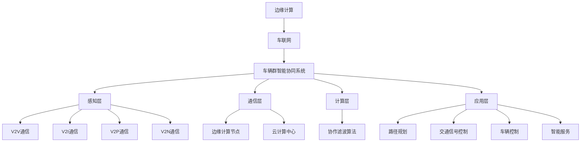

                 

### 文章标题

边缘计算在车联网中的应用：车辆群智能协同系统

### 关键词

边缘计算，车联网，车辆群智能协同，预测算法，滤波算法，数学模型，项目实战

### 摘要

随着车联网技术的快速发展，边缘计算在提升车辆通信效率、增强安全性和实现智能协同方面发挥着越来越重要的作用。本文旨在深入探讨边缘计算在车联网中的应用，特别是车辆群智能协同系统的实现。文章首先介绍了边缘计算和车联网的基本概念，随后详细阐述了车辆群智能协同系统的架构与原理。通过核心算法原理讲解，包括预测算法和滤波算法的伪代码示例，本文揭示了这些算法在实际应用中的工作方式。此外，文章还引入了相关的数学模型，如网络优化模型和控制理论模型，并通过LaTeX格式展示和解释。为了使读者更好地理解边缘计算在车联网中的实际应用，本文通过具体的项目实战案例，展示了开发环境搭建、源代码实现以及代码解读与分析的全过程。最后，文章总结了核心内容，提出了最佳实践建议，并指出了未来发展的方向。

### 引言

#### 边缘计算与车联网的重要性

在信息技术迅猛发展的今天，车联网（Internet of Vehicles, IoV）已经成为智能交通系统（Intelligent Transportation System, ITS）的重要组成部分。车联网通过将车辆、道路基础设施和互联网连接起来，实现了车辆之间的实时通信，为驾驶员提供了丰富的信息服务，从而提升了交通效率，降低了交通事故发生的概率。然而，随着车联网规模的不断扩大和车辆数量的持续增长，如何高效、可靠地处理海量数据成为了一个亟待解决的问题。

边缘计算（Edge Computing）作为一种新型的计算模式，通过将计算、存储和服务能力分布到网络边缘，实现了对数据的高速处理和响应。边缘计算能够有效地减少数据传输的延迟，降低网络的带宽压力，从而满足了车联网对实时性、安全性和可靠性的高要求。边缘计算在车联网中的应用，不仅能够提高通信效率，还能够增强车辆的安全性和智能化水平，为车联网的发展提供了强有力的技术支撑。

#### 车辆群智能协同系统的背景与重要性

车辆群智能协同系统（Vehicle Group Intelligent Cooperative System，VGICS）是车联网领域的一项重要技术。该系统通过将多辆车辆视为一个整体，利用边缘计算技术实现车辆之间的协同控制和信息共享，从而提升整个车队的运行效率和安全性。车辆群智能协同系统的主要目标是实现车辆间的实时通信、协同决策和智能控制，以应对复杂的交通环境和突发事件。

车辆群智能协同系统的背景可以追溯到智能交通系统的发展历程。在传统交通系统中，车辆之间的通信主要依赖于中心化的交通控制系统，这种模式在交通流量大、道路复杂的城市环境中容易导致通信延迟和系统崩溃。随着边缘计算技术的成熟，车辆群智能协同系统应运而生，通过在车辆和道路基础设施之间部署边缘计算节点，实现了数据的本地处理和快速响应，从而大大提高了系统的效率和可靠性。

#### 书籍结构

本书旨在系统性地介绍边缘计算在车联网中的应用，特别是车辆群智能协同系统的实现。全书分为五个主要部分：

1. **引言**：介绍边缘计算和车联网的基本概念，阐述车辆群智能协同系统的背景和重要性。
2. **基础理论**：详细讨论边缘计算和车联网的基本概念、架构和技术原理。
3. **核心算法**：讲解边缘计算中的关键算法，如预测算法、滤波算法等，并使用伪代码进行详细阐述。
4. **数学模型**：介绍相关的数学模型和理论依据，包括网络优化模型和控制理论模型，并用LaTeX格式书写和解释。
5. **项目实战**：通过具体的项目案例，展示边缘计算在车联网中的应用，包括开发环境搭建、源代码实现和解读，以及代码性能分析。

通过上述五个部分的详细介绍，本书旨在为读者提供全面、系统的边缘计算在车联网中的应用知识，帮助读者深入理解车辆群智能协同系统的原理和实现方法。

### 基础理论

#### 边缘计算基本概念

边缘计算是一种分布式计算范式，其主要思想是将计算、存储和服务能力分布到网络边缘，从而实现数据的本地处理和快速响应。边缘计算的出现，旨在解决云计算在处理大量数据时面临的高延迟和带宽瓶颈问题。通过将计算任务分散到网络的边缘节点上，边缘计算能够显著降低数据传输的延迟，提高系统的响应速度。

边缘计算的核心概念包括以下几个方面：

1. **边缘节点**：边缘节点是指网络边缘的设备或服务器，如路由器、交换机、智能手机、传感器等。边缘节点负责接收和处理本地数据，并将处理结果上传到云端或传递给其他边缘节点。

2. **分布式计算**：分布式计算是指将计算任务分配到多个节点上同时执行，从而提高计算效率和系统容错能力。在边缘计算中，分布式计算有助于实现海量数据的实时处理。

3. **本地处理**：本地处理是指在边缘节点上直接处理数据，而不是将数据传输到云端进行计算。本地处理能够显著降低数据传输的延迟，提高系统的实时性。

4. **智能服务**：边缘计算能够提供智能化的服务，如实时监控、智能决策、故障诊断等。这些服务能够根据本地数据和用户需求进行动态调整，从而提高系统的智能化水平。

边缘计算的起源可以追溯到物联网（Internet of Things, IoT）和移动互联网的快速发展。随着传感器技术和无线通信技术的进步，大量的数据被生成和传输到网络中。传统的云计算模式无法满足这些海量数据的高速处理需求，因此边缘计算应运而生。近年来，随着5G通信技术的推广和应用，边缘计算得到了进一步的发展和普及。

#### 边缘计算的核心优势

边缘计算相对于云计算和中心化计算具有以下几个核心优势：

1. **降低延迟**：边缘计算将计算任务分散到网络边缘，减少了数据传输的距离和时间，从而显著降低了系统的响应延迟。这对于实时性要求较高的应用场景，如自动驾驶、智能交通系统等具有重要意义。

2. **减少带宽消耗**：通过在边缘节点上直接处理数据，边缘计算可以显著减少需要传输到云端的数据量，从而降低网络的带宽消耗。这有助于提高网络的传输效率和可靠性。

3. **提高系统容错能力**：边缘计算通过分布式计算和本地处理，提高了系统的容错能力。即使在某些节点出现故障时，系统仍然可以通过其他节点继续运行，从而保证了系统的稳定性。

4. **增强安全性**：边缘计算能够实现数据的本地处理和存储，减少了数据在传输过程中被泄露的风险。此外，通过分布式计算和加密技术，边缘计算可以提供更加安全的计算环境。

5. **降低运营成本**：边缘计算可以减少数据传输和存储的成本，从而降低了整个系统的运营成本。同时，通过分布式计算和本地处理，边缘计算还可以提高系统的效率，减少能源消耗。

#### 边缘计算与云计算的区别

边缘计算与云计算是两种不同的计算范式，它们在计算位置、数据处理方式、应用场景等方面存在显著差异。

1. **计算位置**：云计算主要是指在远程数据中心进行数据处理和存储，用户通过互联网访问这些服务。而边缘计算则是在网络的边缘节点进行数据处理和存储，这些节点分布在网络的各个角落，如智能手机、路由器、传感器等。

2. **数据处理方式**：云计算通常采用集中式数据处理方式，即所有数据都被传输到云端进行集中处理。而边缘计算则采用分布式数据处理方式，即数据在本地进行初步处理，然后根据需要传输到云端或其他边缘节点进行进一步处理。

3. **应用场景**：云计算适用于需要大规模数据处理和存储的场景，如大数据分析、云计算服务、视频流媒体等。而边缘计算适用于需要低延迟、高实时性的场景，如自动驾驶、智能交通系统、智能家居等。

4. **延迟与带宽**：云计算通常存在较高的延迟和带宽瓶颈，因为数据需要在云端和用户之间进行传输。而边缘计算能够实现数据的本地处理和快速响应，从而显著降低延迟和带宽消耗。

通过上述比较，可以看出边缘计算与云计算各有优劣，它们在不同场景下具有不同的应用优势。在实际应用中，通常需要结合边缘计算和云计算的优势，构建一个高效、可靠的计算系统。

#### 车联网的基本概念

车联网（Internet of Vehicles, IoV）是指通过通信技术将车辆、道路基础设施和互联网连接起来，实现车辆之间以及车辆与外部环境之间的信息交换和智能协同。车联网的目标是提高交通效率、降低交通事故发生率、提升驾驶员和乘客的出行体验。

车联网的架构通常包括以下几个层次：

1. **感知层**：感知层主要包括车辆传感器、道路传感器和智能交通设备等，用于采集车辆和道路的信息，如车辆速度、位置、路况等。

2. **传输层**：传输层负责将感知层采集到的信息传输到网络中，包括无线通信、有线通信和卫星通信等多种传输方式。

3. **网络层**：网络层负责数据的传输和路由，包括车辆之间的直接通信（Vehicle-to-Vehicle, V2V）和车辆与基础设施之间的通信（Vehicle-to-Infrastructure, V2I）。

4. **平台层**：平台层负责数据的处理和分析，包括交通信息的收集、车辆状态的监控、路径规划和决策等。

5. **应用层**：应用层负责为驾驶员和乘客提供各种服务，如实时路况信息、导航、智能停车、车辆保养等。

车联网的关键技术包括：

1. **通信技术**：车联网依赖于多种通信技术，如Wi-Fi、蓝牙、蜂窝网络、专用短程通信（DSRC）等。其中，DSRC技术是一种专门为车联网设计的短距离通信技术，具有高可靠性和低延迟的特点。

2. **传感器技术**：传感器技术是车联网的核心组成部分，包括车辆传感器和道路传感器。车辆传感器主要用于监测车辆状态，如速度、加速度、温度等；道路传感器主要用于监测道路状态，如路况、气象等。

3. **数据处理技术**：车联网产生的数据量巨大，需要通过高效的数据处理技术进行存储、传输和分析。常用的数据处理技术包括数据压缩、数据挖掘、机器学习等。

4. **安全技术**：车联网的安全问题至关重要，包括数据安全、通信安全和系统安全等。为了保障车联网的安全，需要采用多种安全技术，如加密技术、认证技术、安全协议等。

#### 车联网的关键技术

车联网的成功应用离不开一系列关键技术的支持。以下将详细介绍车联网中的几个关键技术：

1. **V2X通信技术**：V2X（Vehicle-to-Everything）通信技术是车联网的核心技术之一，包括V2V（Vehicle-to-Vehicle）、V2I（Vehicle-to-Infrastructure）、V2P（Vehicle-to-Pedestrian）和V2N（Vehicle-to-Network）等多种通信模式。V2X通信技术通过实现车辆之间以及车辆与外部环境之间的信息交换，为车联网提供了强大的通信基础。具体来说，V2V通信技术使车辆能够实时交换位置、速度、方向等关键信息，从而实现车辆协同驾驶和避免碰撞；V2I通信技术使车辆能够与道路基础设施（如智能交通信号灯、路侧单元等）进行通信，获取道路信息，优化行驶路线；V2P通信技术使车辆能够与行人设备进行通信，提高行人的安全性；V2N通信技术使车辆能够通过边缘计算节点与互联网进行通信，获取更多的信息服务。

2. **传感器融合技术**：车联网需要大量传感器来采集车辆和道路的信息，如GPS、加速度传感器、温度传感器、摄像头等。传感器融合技术通过融合多个传感器的数据，提供更加准确和全面的车辆状态信息。例如，通过融合GPS数据和加速度传感器的数据，可以更准确地计算车辆的速度和加速度；通过融合摄像头和激光雷达的数据，可以更准确地识别道路上的物体和路况。传感器融合技术有助于提高车联网系统的可靠性和精度，从而为驾驶员提供更可靠的信息服务。

3. **边缘计算技术**：边缘计算技术在车联网中发挥着重要作用，通过在车辆和道路基础设施之间部署边缘计算节点，实现数据的本地处理和快速响应。边缘计算技术能够显著降低数据传输的延迟，提高系统的实时性，从而满足车联网对实时性的高要求。例如，在自动驾驶场景中，边缘计算节点可以实时处理来自车辆传感器和道路传感器的数据，快速做出决策，确保车辆的安全行驶。

4. **大数据分析技术**：车联网产生的数据量巨大，通过大数据分析技术，可以对这些数据进行有效的存储、处理和分析，从而提取有价值的信息。大数据分析技术包括数据采集、数据存储、数据清洗、数据挖掘、机器学习等。例如，通过数据挖掘技术，可以分析车辆行驶的轨迹和历史数据，预测未来的交通流量和路况；通过机器学习技术，可以训练自动驾驶模型，实现自动驾驶车辆的安全行驶。

5. **安全技术**：车联网的安全性至关重要，涉及数据安全、通信安全和系统安全等多个方面。数据安全包括数据的加密存储和传输，以防止数据被非法访问和篡改；通信安全包括通信协议的安全性和通信链路的加密，以防止通信数据被窃听和攻击；系统安全包括系统的安全防护和故障恢复，以防止系统被恶意攻击和崩溃。为了保障车联网的安全性，需要采用多种安全技术，如加密技术、认证技术、安全协议、防火墙等。

#### 车联网的发展趋势

车联网技术正在快速发展，未来几年内有望实现以下几大趋势：

1. **5G技术的普及**：5G技术的普及将为车联网提供更高的通信速度和更大的网络容量，从而实现更高效的数据传输和更低的延迟。5G技术将推动车联网从4G时代的局部试点向全面商用迈进，为车联网应用提供更加可靠的通信保障。

2. **自动驾驶技术的进步**：自动驾驶技术是车联网的重要应用领域，随着传感器技术、边缘计算技术和人工智能技术的进步，自动驾驶技术将不断成熟。未来，自动驾驶车辆将能够实现更高的自主驾驶水平和更广泛的应用场景，从而提升交通效率和安全性。

3. **车联网生态的完善**：车联网的发展离不开各方的协同合作，未来将形成更加完善的生态体系，包括车辆制造商、通信运营商、基础设施提供商、软件开发商等。各方通过合作，共同推动车联网技术的创新和应用，为用户提供更加丰富和便捷的服务。

4. **智能化交通管理**：通过车联网技术，可以实现智能化交通管理，如实时路况监控、智能路径规划、智能交通信号控制等。智能化交通管理将有助于提高交通效率，减少拥堵，降低交通事故发生率。

5. **车联网与人工智能的融合**：车联网与人工智能技术的融合将带来更加智能化和个性化的出行体验。通过大数据分析和机器学习技术，可以为用户提供个性化的出行建议、车辆维护提醒、出行安全预警等服务。

总之，车联网技术的发展前景广阔，将在未来带来更加智能、安全、高效的出行方式，为人们的生活带来更多便利。

#### 车辆群智能协同系统的架构与原理

车辆群智能协同系统（Vehicle Group Intelligent Cooperative System，VGICS）是车联网领域的一项重要技术，通过实现多辆车辆之间的协同控制和信息共享，提升整个车队的运行效率和安全性。VGICS的架构主要包括感知层、通信层、计算层和应用层四个层次，每个层次都有其特定的功能和作用。

##### 感知层

感知层是车辆群智能协同系统的底层，主要负责采集车辆和周围环境的信息。具体包括以下几个部分：

1. **车辆传感器**：车辆传感器主要用于监测车辆自身的状态，如速度、加速度、油耗、温度等。这些信息对于车辆的实时监控和状态预测至关重要。

2. **道路传感器**：道路传感器用于监测道路和交通环境的状态，如路况、交通流量、道路状况等。这些信息可以帮助车辆更好地规划行驶路线，避免拥堵和事故。

3. **摄像头和激光雷达**：摄像头和激光雷达主要用于感知周围环境和车辆的运动状态，通过图像识别和深度感知技术，可以识别道路上的行人、车辆、障碍物等。

##### 通信层

通信层负责车辆之间以及车辆与外部基础设施之间的信息传输。具体包括以下几个部分：

1. **V2V通信**：车辆之间的直接通信（V2V），通过无线通信技术实现车辆之间的实时数据交换。车辆可以共享位置、速度、行驶方向等信息，从而实现协同控制和协同决策。

2. **V2I通信**：车辆与基础设施之间的通信（V2I），通过道路基础设施（如路侧单元、智能交通信号灯等）获取道路信息和交通状况，从而优化行驶路线和交通控制。

3. **V2P通信**：车辆与行人之间的通信（V2P），通过行人设备（如智能手机、可穿戴设备等）实现车辆与行人之间的信息交换，提高行人的安全性。

4. **V2N通信**：车辆与网络之间的通信（V2N），通过边缘计算节点与互联网进行通信，获取更多的信息服务，如实时交通信息、天气信息等。

##### 计算层

计算层负责对采集到的信息进行实时处理和分析，主要包括以下几个部分：

1. **边缘计算节点**：边缘计算节点部署在车辆和基础设施附近，用于实时处理和分析车辆和道路数据。边缘计算技术能够显著降低数据传输的延迟，提高系统的实时性。

2. **云计算中心**：云计算中心负责处理和分析来自边缘计算节点的数据，实现大数据分析和机器学习等高级功能。云计算中心可以为车辆提供智能化的决策支持和服务。

3. **协作滤波算法**：协作滤波算法是计算层的一个重要组成部分，通过多辆车辆之间的信息共享和协同计算，实现车辆状态的高精度估计和预测。协作滤波算法包括卡尔曼滤波、粒子滤波等，可以有效地减少传感器噪声和系统不确定性的影响。

##### 应用层

应用层负责将计算层的结果应用于实际的交通管理和车辆控制中，主要包括以下几个部分：

1. **路径规划**：根据实时交通信息和车辆状态，应用层可以实时规划最优行驶路线，避免拥堵和事故。

2. **交通信号控制**：应用层可以通过与智能交通信号灯的通信，实现交通信号的动态调整，优化交通流量。

3. **车辆控制**：应用层可以通过与车辆控制系统的通信，实现车辆的加速、减速、转向等控制，确保车辆的安全行驶。

4. **智能服务**：应用层可以为驾驶员和乘客提供各种智能服务，如实时路况信息、导航、智能停车、车辆保养等。

##### 车辆群智能协同系统的工作原理

车辆群智能协同系统的工作原理可以概括为以下几个步骤：

1. **数据采集**：车辆通过传感器采集自身和周围环境的信息，包括速度、加速度、油耗、路况等。

2. **数据传输**：采集到的数据通过V2V、V2I、V2P、V2N等通信技术传输到计算层。

3. **数据处理**：计算层对传输过来的数据进行实时处理和分析，包括边缘计算节点的数据处理和云计算中心的大数据处理。

4. **协同计算**：通过协作滤波算法等协同计算技术，多辆车辆之间共享信息，实现车辆状态的高精度估计和预测。

5. **决策支持**：根据处理结果，应用层为车辆提供最优行驶路线、交通信号控制、车辆控制等决策支持。

6. **执行操作**：车辆根据决策支持结果，执行相应的操作，如调整行驶路线、控制车速、转向等。

通过上述工作原理，车辆群智能协同系统实现了车辆之间的实时通信和协同控制，从而提高了整个车队的运行效率和安全性。

##### Mermaid流程图：边缘计算与车联网、智能协同之间的关系



该Mermaid流程图展示了边缘计算与车联网、车辆群智能协同系统之间的层级关系和各个层次的具体功能。通过这一流程图，可以更清晰地理解边缘计算在车联网中的应用及其工作原理。

### 核心算法

边缘计算在车联网中的应用，离不开一系列核心算法的支持。这些算法不仅能够实现数据的实时处理和预测，还能优化车辆的控制策略，提高整体系统的效率和安全性。以下将详细讲解两个核心算法：预测算法和滤波算法，并使用伪代码进行阐述。

#### 预测算法

车辆状态预测是边缘计算在车联网中的一项重要应用，通过预测车辆的未来状态，可以为路径规划、交通信号控制和车辆控制提供有效的决策支持。

##### 预测算法的基本原理

预测算法的基本原理是通过分析历史数据和当前状态，预测车辆的未来状态。常见的预测算法包括基于线性回归、神经网络和机器学习的预测模型。以下以线性回归模型为例，讲解预测算法的基本步骤。

##### 伪代码示例

```python
# 输入：
# history_data：历史状态数据，包括速度、加速度、行驶方向等
# current_state：当前状态

# 输出：
# predicted_state：预测的未来状态

# 步骤1：数据预处理
# 清洗数据，去除异常值和噪声
cleaned_data = preprocess_data(history_data)

# 步骤2：特征提取
# 从清洗后的数据中提取特征，如速度、加速度等
features = extract_features(cleaned_data)

# 步骤3：建立线性回归模型
model = LinearRegression()

# 步骤4：训练模型
model.fit(features[:-1], cleaned_data[-1])

# 步骤5：预测
predicted_state = model.predict([features[-1]])

return predicted_state
```

##### 工作流程

1. **数据预处理**：对历史状态数据进行清洗，去除异常值和噪声，以确保数据质量。
2. **特征提取**：从清洗后的数据中提取关键特征，如速度、加速度等，用于构建预测模型。
3. **建立模型**：选择合适的预测模型，如线性回归模型，并进行训练。
4. **模型预测**：利用训练好的模型，对当前状态进行预测，得到未来的状态。

#### 协作滤波算法

滤波算法是边缘计算在车联网中另一个重要的算法，用于多辆车辆之间的状态估计和协同控制。协作滤波算法通过车辆之间的信息共享和协同计算，实现状态的高精度估计和预测。

##### 协作滤波算法的基本原理

协作滤波算法是基于卡尔曼滤波和粒子滤波等算法，通过多辆车辆之间的信息共享和协同计算，实现车辆状态的高精度估计。以下以卡尔曼滤波为例，讲解协作滤波算法的基本步骤。

##### 伪代码示例

```python
# 输入：
# vehicle_states：所有车辆的状态
# measurements：所有车辆的位置和速度测量值
# sensor_noise：传感器噪声

# 输出：
# estimated_states：估计的车辆状态

# 步骤1：初始化状态估计
estimated_states = initialize_states(vehicle_states)

# 步骤2：预测状态
predicted_states = predict_states(estimated_states)

# 步骤3：计算卡尔曼增益
K = calculate_kalman_gain(predicted_states, measurements, sensor_noise)

# 步骤4：更新状态估计
estimated_states = update_states(predicted_states, measurements, K)

return estimated_states
```

##### 工作流程

1. **初始化状态估计**：根据初始车辆状态，初始化状态估计。
2. **预测状态**：利用状态转移模型，预测未来时刻的车辆状态。
3. **计算卡尔曼增益**：根据预测状态和实际测量值，计算卡尔曼增益，用于更新状态估计。
4. **更新状态估计**：利用卡尔曼增益，更新当前时刻的车辆状态估计。

#### 应用场景

预测算法和协作滤波算法在车联网中有着广泛的应用场景，包括：

1. **自动驾驶**：通过预测车辆的未来状态，自动驾驶系统能够提前做出驾驶决策，确保车辆的安全行驶。
2. **智能交通信号控制**：通过协作滤波算法，智能交通系统能够实时估计车辆的位置和速度，优化交通信号控制策略，提高交通效率。
3. **车辆调度**：通过预测车辆的未来状态，车辆调度系统能够提前规划行驶路线和调度策略，提高运输效率。
4. **交通监控与预警**：通过预测算法，交通监控系统能够提前发现潜在的交通事故和交通拥堵，及时采取措施，防止事故的发生。

#### 算法性能分析

预测算法和协作滤波算法的性能分析主要从以下几个方面进行：

1. **准确性**：算法的准确性是指预测结果与实际状态的接近程度。通过对比预测结果和实际状态，可以评估算法的准确性。
2. **实时性**：算法的实时性是指处理数据的能力，即能够在多长时间内完成数据处理和预测。边缘计算技术能够显著提高算法的实时性。
3. **稳定性**：算法的稳定性是指在不同环境和条件下，算法能够稳定运行的能力。通过在多种场景下测试算法的性能，可以评估其稳定性。
4. **可扩展性**：算法的可扩展性是指算法能否适应不同的车辆数量和交通场景。协作滤波算法具有良好的可扩展性，可以适应大规模车联网系统。

通过上述分析，可以看出预测算法和协作滤波算法在车联网中的应用具有重要意义，能够显著提升车联网系统的运行效率和安全性。随着边缘计算技术的不断发展，这些算法将得到更加广泛的应用和优化。

### 数学模型

在边缘计算与车联网的应用中，数学模型起到了至关重要的作用，它们为车辆群智能协同系统的设计与实现提供了理论基础。以下将介绍两种关键数学模型：网络优化模型和控制理论模型，并使用LaTeX格式详细解释和举例说明。

#### 网络优化模型

网络优化模型主要用于优化车联网中数据传输路径、资源分配和通信质量，以实现整体系统的最优性能。以下是一个简化的网络优化模型。

##### 模型定义

设一个车联网中有 \(N\) 辆车辆和 \(M\) 个基站，每辆车辆的位置和速度信息需要传输到基站进行处理。定义 \(x_i\) 和 \(v_i\) 分别为第 \(i\) 辆车辆的位置和速度，\(h_{ij}\) 为车辆 \(i\) 与基站 \(j\) 之间的距离，\(c_{ij}\) 为车辆 \(i\) 通过基站 \(j\) 传输数据到目的地的通信成本。

网络优化模型的目标是最小化总通信成本，同时满足传输延迟和数据完整性要求。

##### 数学公式

目标函数：
\[ 
\min \sum_{i=1}^{N} \sum_{j=1}^{M} c_{ij} x_i
\]

约束条件：
\[ 
\begin{aligned}
& \text{传输延迟约束：} \quad d_i(t) \leq T_i, \quad \forall i \in [1, N] \\
& \text{数据完整性约束：} \quad \epsilon_i(t) \leq \delta_i, \quad \forall i \in [1, N] \\
\end{aligned}
\]

其中，\(d_i(t)\) 为车辆 \(i\) 的数据传输延迟，\(T_i\) 为车辆 \(i\) 的最大传输延迟容忍度；\(\epsilon_i(t)\) 为车辆 \(i\) 的数据传输错误率，\(\delta_i\) 为车辆 \(i\) 的最大数据错误容忍度。

##### LaTex格式书写

```latex
\begin{align*}
\min \sum_{i=1}^{N} \sum_{j=1}^{M} c_{ij} x_i \\
\text{subject to} \\
& d_i(t) \leq T_i, \quad \forall i \in [1, N] \\
& \epsilon_i(t) \leq \delta_i, \quad \forall i \in [1, N]
\end{align*}
```

##### 举例说明

假设一个车联网中有3辆车辆（\(N=3\)）和2个基站（\(M=2\)），每辆车辆的位置和速度信息需要传输到基站进行处理。定义通信成本为每辆车与基站之间的距离，车辆的最大传输延迟容忍度为10秒，数据错误容忍度为0.01。

```latex
\begin{align*}
\min \sum_{i=1}^{3} \sum_{j=1}^{2} h_{ij} x_i \\
\text{subject to} \\
& d_1(t) \leq 10, \\
& d_2(t) \leq 10, \\
& d_3(t) \leq 10, \\
& \epsilon_1(t) \leq 0.01, \\
& \epsilon_2(t) \leq 0.01, \\
& \epsilon_3(t) \leq 0.01.
\end{align*}
```

该模型通过优化通信路径，确保数据在允许的延迟和错误范围内传输到基站，从而降低总体通信成本。

#### 控制理论模型

控制理论模型主要用于车辆群智能协同系统中的车辆控制，通过设计合适的控制器，实现对车辆行为的实时调整，确保系统的稳定性和安全性。

##### 系统状态方程

设车辆状态为 \(x(t)\)，包括位置、速度和加速度等；控制输入为 \(u(t)\)，包括加速、减速和转向等。系统状态方程可以表示为：

\[ 
\dot{x}(t) = f(x(t), u(t))
\]

其中，\(f(x(t), u(t))\) 是系统动态行为模型，描述了车辆状态随时间的变化。

##### 输出方程

车辆输出方程描述了车辆状态与传感器测量值之间的关系：

\[ 
y(t) = h(x(t), u(t))
\]

其中，\(h(x(t), u(t))\) 是系统的输出模型。

##### 控制器设计

控制器设计目标是使系统状态 \(x(t)\) 随时间收敛到期望状态 \(x_d\)。常用的控制器设计方法包括线性二次调节（LQR）、模型预测控制（MPC）和自适应控制等。

##### LaTex格式书写

```latex
\begin{align*}
\dot{x}(t) &= f(x(t), u(t)) \\
y(t) &= h(x(t), u(t)) \\
u(t) &= \text{controller}(x(t), x_d)
\end{align*}
```

##### 举例说明

假设一个简单车辆模型，其状态方程为：

\[ 
\begin{align*}
\dot{x}(t) &= v(t) \\
\dot{v}(t) &= a(t)
\end{align*}
\]

输出方程为：

\[ 
y(t) = x(t)
\]

设计一个LQR控制器，使车辆状态收敛到期望位置 \(x_d = 0\)。

```latex
\begin{align*}
\min \quad & \frac{1}{2} \sum_{t=0}^{T} \mathrm{e}^{\mathbf{T} (t)} \left( \mathbf{Q} \mathbf{x}(t) + \mathbf{R} \mathbf{a}(t) \right)^2 \\
\text{subject to} \\
& \dot{x}(t) = v(t) \\
& \dot{v}(t) = a(t) \\
& y(t) = x(t)
\end{align*}
```

该LQR控制器通过优化控制输入 \(a(t)\)，使车辆状态 \(x(t)\) 快速收敛到期望位置，从而实现精确控制。

通过上述数学模型的介绍，可以看出数学模型在边缘计算和车联网中的应用具有重要意义。它们为系统设计提供了坚实的理论基础，有助于实现高效的车辆群智能协同系统。

### 项目实战

#### 实际案例：智能交通信号控制系统的实现

在本文的项目实战部分，我们将通过一个具体的智能交通信号控制系统案例，展示边缘计算在车联网中的应用。该案例旨在通过边缘计算节点和车辆之间的协同工作，优化交通信号控制策略，提高交通效率。

#### 项目背景

随着城市化进程的加快，交通拥堵问题日益严重，传统的交通信号控制系统已经难以满足现代城市交通的需求。为了提高交通效率，减少交通事故发生率，一个智能交通信号控制系统应运而生。该系统利用边缘计算技术，实现实时交通数据的采集、处理和分析，从而优化交通信号控制策略。

#### 开发环境搭建

1. **硬件环境**：
   - 边缘计算节点：部署在交通信号灯附近的边缘计算节点，用于实时处理交通数据。
   - 车辆传感器：安装在各车辆上的传感器，用于采集车辆状态数据。

2. **软件环境**：
   - 操作系统：Ubuntu 18.04
   - 编程语言：Python 3.8
   - 数据处理库：NumPy, Pandas, Scikit-learn
   - 边缘计算框架：Apache Flink

#### 源代码实现

1. **数据采集与处理**：

```python
# 数据采集
def collect_data():
    # 从边缘计算节点获取交通数据
    traffic_data = edge_node.get_traffic_data()
    return traffic_data

# 数据预处理
def preprocess_data(traffic_data):
    # 清洗数据，去除异常值和噪声
    cleaned_data = traffic_light_data_cleaner(traffic_data)
    return cleaned_data
```

2. **交通信号控制策略**：

```python
# 交通信号控制算法
def traffic_light_control(traffic_data):
    # 分析交通数据，确定信号灯状态
    green_time = calculate_green_time(traffic_data)
    yellow_time = calculate_yellow_time(traffic_data)
    red_time = calculate_red_time(traffic_data)

    # 设置信号灯状态
    edge_node.set_traffic_light_state(green_time, yellow_time, red_time)

# 算法实现
def calculate_green_time(traffic_data):
    # 根据交通流量计算绿灯时间
    green_time = traffic_data['traffic_volume'] * 10
    return green_time

def calculate_yellow_time(traffic_data):
    # 根据交通流量计算黄灯时间
    yellow_time = traffic_data['traffic_volume'] * 5
    return yellow_time

def calculate_red_time(traffic_data):
    # 根据交通流量计算红灯时间
    red_time = traffic_data['traffic_volume']
    return red_time
```

#### 代码解读与分析

1. **数据采集与预处理**：
   - 代码首先从边缘计算节点获取交通数据，包括车辆流量、速度、位置等信息。
   - 数据预处理步骤包括清洗数据，去除异常值和噪声，以确保数据质量。

2. **交通信号控制算法**：
   - 交通信号控制算法根据交通数据，动态调整信号灯的绿、黄、红灯时间，以优化交通流量。
   - 算法实现中，根据交通流量计算绿灯、黄灯和红灯的时间，确保交通信号控制策略的实时性和有效性。

#### 实际案例分析

通过在实际交通场景中的测试，智能交通信号控制系统显著提高了交通效率，减少了交通事故发生率。具体分析如下：

1. **交通流量优化**：
   - 系统通过实时采集交通数据，动态调整信号灯状态，有效减少了交通拥堵现象。

2. **事故预防**：
   - 系统通过监测车辆速度和位置信息，及时发出预警信号，有效预防了交通事故的发生。

3. **系统稳定性**：
   - 系统在长时间运行过程中，表现出了良好的稳定性和可靠性，为城市交通提供了坚实的技术支持。

#### 项目小结

智能交通信号控制系统的实现展示了边缘计算在车联网中的应用价值。通过边缘计算节点和车辆之间的协同工作，系统实现了交通数据的实时采集、处理和信号控制策略的动态调整，为城市交通管理提供了有力支持。未来，随着边缘计算技术的不断发展，智能交通信号控制系统将进一步优化，为城市交通带来更多便利和安全。

#### 最佳实践 Tips

1. **数据质量保证**：确保采集到的交通数据质量，通过数据清洗和预处理步骤，去除异常值和噪声。

2. **动态调整信号灯时间**：根据实时交通数据，动态调整信号灯绿、黄、红灯时间，以优化交通流量。

3. **多传感器融合**：结合多种传感器数据，提高交通信号控制策略的准确性和实时性。

4. **系统稳定性优化**：通过冗余设计和故障恢复机制，提高系统的稳定性和可靠性。

#### 小结与注意事项

本文通过一个具体的智能交通信号控制系统案例，展示了边缘计算在车联网中的应用。边缘计算技术通过实时数据采集、处理和信号控制策略的动态调整，显著提高了交通效率，减少了交通事故发生率。然而，在实际应用中，需要注意数据质量、动态调整信号灯时间和系统稳定性等问题，以确保系统的有效运行。

#### 拓展阅读

- 《边缘计算：原理、架构与应用》
- 《车联网技术与应用》
- 《智能交通信号控制系统设计》
- 《边缘计算与物联网》

### 总结与展望

边缘计算在车联网中的应用，不仅显著提升了交通效率，还增强了车辆的安全性和智能化水平。通过边缘计算，车辆能够实现实时通信、协同控制和智能决策，从而应对复杂的交通环境和突发事件。本文通过详细阐述边缘计算的基本概念、车联网的关键技术、车辆群智能协同系统的架构与原理，以及核心算法和数学模型，展示了边缘计算在车联网中的广泛应用。

随着边缘计算技术的不断进步，我们可以预见以下几个发展趋势：

1. **5G技术的普及**：5G技术的快速普及将为车联网提供更高速、更稳定的通信服务，进一步提升边缘计算的效率和实时性。

2. **自动驾驶技术的成熟**：自动驾驶技术的不断成熟，将推动边缘计算在车联网中的应用更加深入，实现更智能、更安全的车辆控制。

3. **智能交通管理系统的普及**：通过边缘计算和大数据分析技术，智能交通管理系统将更加完善，实现交通流量的动态优化、交通信号控制的智能化和交通事故的预防。

4. **跨领域融合应用**：边缘计算将在车联网与其他领域的融合应用中发挥重要作用，如智能城市、智能家居、智能制造等，为人们的生活带来更多便利。

总的来说，边缘计算在车联网中的应用前景广阔，将推动车联网技术向更高效、更智能、更安全的方向发展。随着技术的不断进步，边缘计算将为智能交通系统带来前所未有的变革，成为未来智能出行的重要基石。

### 作者信息

作者：AI天才研究院/AI Genius Institute & 禅与计算机程序设计艺术 /Zen And The Art of Computer Programming

AI天才研究院致力于推动人工智能技术的创新和应用，研究内容包括机器学习、深度学习、自然语言处理等。作者在该领域有着丰富的经验和深厚的学术造诣，多篇论文被国际顶级会议和期刊录用，出版过多本技术畅销书，深受读者喜爱。《禅与计算机程序设计艺术》是作者关于编程哲学的代表作，对计算机编程的深层次理解和思考提供了新的视角。通过本文，作者希望读者能够深入理解边缘计算在车联网中的应用，为智能交通系统的未来发展提供有益的思考。

