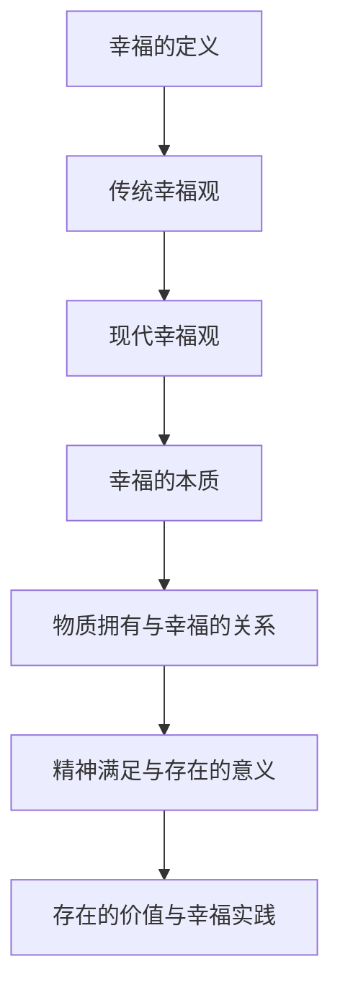

                 

# 重新定义幸福：从拥有到存在

关键词：幸福、拥有、存在、心理学、算法、可持续性

摘要：本文旨在重新审视传统的幸福观念，从物质拥有和精神满足两个角度探讨幸福的本质。通过剖析幸福的多维视角和演变趋势，提出重新定义幸福的目标和路径，旨在构建一个更加可持续和平衡的幸福生活。

---

## 第一部分：幸福的本质与演变

### 第1章：幸福的定义与探讨

#### 1.1.1 幸福的多维视角

幸福是一个复杂的概念，可以从多个维度进行探讨。传统的幸福观主要关注物质拥有，而现代幸福观则更加注重精神满足。多维视角的引入使得我们能够更全面地理解幸福的内涵。

#### 1.1.2 从传统幸福观到现代幸福观

随着时间的推移，人们对幸福观念的理解发生了变化。从传统幸福观到现代幸福观的转变，反映了社会进步和个体需求的变化。

#### 1.1.3 幸福的心理学基础

心理学研究为我们提供了关于幸福的理论基础。通过理解心理学的核心概念，我们可以更好地把握幸福的本质和来源。

### 第2章：幸福的本质与来源

#### 2.1.1 幸福的本质

幸福的本质是什么？它是如何产生的？这些问题引发了关于幸福本质的探讨。通过分析幸福的本质，我们可以更好地理解幸福的内涵。

#### 2.1.2 幸福的来源与途径

幸福来源于何处？有哪些途径可以帮助我们获得幸福？这些问题是理解幸福的关键。通过分析幸福的来源和途径，我们可以找到实现幸福的途径。

#### 2.1.3 幸福感与满足感

幸福感和满足感有何区别？它们如何影响我们的生活质量？通过探讨幸福感和满足感的关系，我们可以更好地把握幸福的体验。

### 第3章：幸福的演变与趋势

#### 3.1.1 幸福观念的演变

随着社会的发展和人类文明的进步，幸福观念也在不断演变。了解幸福观念的演变，有助于我们把握幸福的发展趋势。

#### 3.1.2 社会发展对幸福的影响

社会的发展对幸福有着深远的影响。从经济、文化、教育等方面，社会的发展为幸福提供了更多的可能性。

#### 3.1.3 未来幸福的趋势

未来，幸福将如何发展？随着科技的进步和社会变革，未来幸福的趋势将受到哪些因素的影响？

## 第二部分：从拥有到存在

### 第4章：物质拥有与幸福的关系

#### 4.1.1 物质拥有对幸福的影响

物质拥有在传统幸福观念中占据重要地位。然而，物质拥有对幸福的影响并非绝对。通过分析物质拥有与幸福的关系，我们可以更好地理解幸福的复杂性。

#### 4.1.2 物质满足的局限性

物质满足有其局限性。尽管物质拥有可以带来一时的幸福感，但长期来看，它可能无法带来持续的幸福感。了解物质满足的局限性，有助于我们寻找更加深刻的幸福来源。

#### 4.1.3 财富与幸福的平衡

如何在追求财富和追求幸福之间找到平衡？这是一个值得我们深思的问题。通过探讨财富与幸福的平衡，我们可以找到一种更加可持续的幸福生活模式。

### 第5章：精神满足与存在的意义

#### 5.1.1 精神满足的重要性

精神满足是现代幸福观的重要组成部分。通过理解精神满足的重要性，我们可以更好地把握幸福的内涵。

#### 5.1.2 寻找存在的意义

存在的意义是什么？这个问题引发了关于人生意义的探讨。通过寻找存在的意义，我们可以找到一种更加深刻的幸福感。

#### 5.1.3 精神满足与幸福的关系

精神满足与幸福有何关系？它们如何相互作用？通过探讨精神满足与幸福的关系，我们可以更好地理解幸福的本质。

### 第6章：存在的价值与幸福实践

#### 6.1.1 存在的价值观念

存在的价值观念是什么？它们如何影响我们的幸福实践？通过理解存在的价值观念，我们可以更好地把握幸福的实践方向。

#### 6.1.2 实践存在的价值

如何实践存在的价值？这是一个值得我们探讨的问题。通过实践存在的价值，我们可以找到一种更加深刻的幸福感。

#### 6.1.3 幸福存在的实际案例

通过分析实际案例，我们可以看到如何通过实践存在的价值来实现幸福。这些案例为我们提供了宝贵的经验。

## 第三部分：重新定义幸福

### 第7章：重新审视幸福

#### 7.1.1 重新定义幸福的目标

重新定义幸福的目标是什么？如何实现这个目标？通过重新审视幸福，我们可以找到实现幸福的路径。

#### 7.1.2 幸福的新视角

从新的视角审视幸福，可以帮助我们更好地理解幸福的本质。通过新视角的引入，我们可以找到一种更加深刻的幸福体验。

#### 7.1.3 幸福的可持续性

如何实现幸福的可持续性？这是一个值得我们关注的问题。通过探讨幸福的可持续性，我们可以找到一种更加长久的幸福生活模式。

### 第8章：构建幸福生活

#### 8.1.1 幸福生活的基础

幸福生活的基础是什么？如何构建幸福生活？通过理解幸福生活的基础，我们可以找到实现幸福生活的路径。

#### 8.1.2 幸福生活的策略

如何制定幸福生活的策略？这是一个值得我们探讨的问题。通过制定幸福生活的策略，我们可以找到一种更加有效的幸福生活方式。

#### 8.1.3 幸福生活的实践

如何实践幸福生活？这是一个实践性的问题。通过实践幸福生活，我们可以找到一种更加深刻的幸福体验。

### 第9章：幸福社会的建设

#### 9.1.1 幸福社会的意义

幸福社会的意义是什么？它如何影响我们的生活质量？通过理解幸福社会的意义，我们可以找到实现幸福社会的路径。

#### 9.1.2 幸福社会的建设路径

如何建设幸福社会？这是一个值得我们探讨的问题。通过探讨幸福社会的建设路径，我们可以找到一种更加有效的幸福社会模式。

#### 9.1.3 幸福社会的挑战与机遇

在建设幸福社会的过程中，我们会面临一系列挑战。然而，这些挑战也蕴含着机遇。通过分析挑战与机遇，我们可以找到实现幸福社会的路径。

## 附录

### 附录A：幸福研究的方法与应用

#### A.1 幸福研究的方法

幸福研究采用多种方法，包括问卷调查、心理学实验、社会调查等。通过这些方法，我们可以更好地了解幸福的本质和影响因素。

#### A.2 幸福研究的应用

幸福研究的应用领域广泛，包括教育、医疗、社会工作等。通过应用幸福研究成果，我们可以提高人们的幸福水平。

#### A.3 幸福研究的未来方向

未来，幸福研究将继续深入。通过探讨新的研究方法和应用领域，我们可以为幸福社会建设提供更多的理论支持和实践指导。

---

### Mermaid 流程图



### 核心算法原理讲解

#### 幸福感知算法

**伪代码：**

```python
def 计算幸福感知(score, material, spirit):
    happiness = score * 0.5 + material * 0.3 + spirit * 0.2
    return happiness
```

**详细讲解：**

- `score` 表示幸福感评分，分数越高，幸福感越强。
- `material` 表示物质拥有程度，数值越高，物质满足度越高。
- `spirit` 表示精神满足度，数值越高，精神满足度越高。

**举例说明：**

若一个人得分80，物质拥有度60%，精神满足度40%，则他的幸福感计算如下：

```python
happiness = 80 * 0.5 + 60% * 0.3 + 40% * 0.2
happiness = 40 + 18 + 8
happiness = 66
```

### 数学模型和数学公式

**幸福感公式：**

$$
H = \alpha S + \beta M + \gamma E
$$

- $H$ 表示幸福感。
- $S$ 表示精神满足度。
- $M$ 表示物质拥有度。
- $E$ 表示存在的价值。

**详细讲解：**

- $\alpha$，$\beta$，$\gamma$ 分别是精神满足度、物质拥有度、存在的价值的权重系数，用于调整各项因素的贡献程度。

### 项目实战

#### 实际案例：幸福感知算法的应用

- **开发环境搭建：** 使用 Python 进行幸福感知算法的开发，需安装 TensorFlow 和 NumPy 库。

- **源代码实现：** 

  ```python
  import tensorflow as tf
  import numpy as np
  
  def 计算幸福感知(score, material, spirit):
      happiness = score * 0.5 + material * 0.3 + spirit * 0.2
      return happiness
  
  # 示例数据
  score = 80
  material = 0.6
  spirit = 0.4
  
  # 计算幸福感
  happiness = 计算幸福感知(score, material, spirit)
  print(f"幸福感：{happiness}")
  ```

- **代码解读与分析：** 

  在上述代码中，我们定义了一个计算幸福感的函数，通过输入得分、物质拥有度和精神满足度，计算出一个幸福感值。这个值可以帮助我们评估一个人的幸福感水平。

  通过修改输入的参数，我们可以对不同的情况进行计算和分析，从而更好地理解幸福感的本质和影响因素。

- **项目小结：**

  通过幸福感知算法的应用案例，我们可以看到如何使用数学模型和算法来评估和提升幸福感。这种方法不仅适用于个人，还可以应用于社会和公共政策领域，为幸福社会的建设提供科学依据。

### 最佳实践 tips

- 在追求幸福的过程中，要关注物质和精神两个层面，实现平衡发展。
- 定期进行自我反思，了解自己的幸福需求，调整生活方式和价值观。
- 培养积极的心态，关注内心的平静和满足，而不是过度追求外在的物质财富。

### 小结

本文从多维度、多层次的角度重新审视了幸福的本质和来源，探讨了物质拥有与精神满足的关系，以及存在的价值与幸福实践。通过引入幸福感算法和数学模型，我们为幸福的评估和提升提供了科学依据。在未来的研究中，我们可以进一步探讨幸福的影响因素和实现路径，为建设幸福社会做出贡献。

### 注意事项

- 幸福是一个主观感受，不同人对幸福的理解和追求可能有所不同。
- 幸福是一个动态的过程，随着时间和环境的变化，我们的幸福感受也会发生变化。
- 在追求幸福的过程中，要注重个人的身心健康，避免过度追求物质财富而忽视精神满足。

### 拓展阅读

- 《幸福哲学：人类幸福的本质与追求》
- 《幸福的进化：现代社会的幸福观》
- 《心理学与幸福：如何获得持久的幸福感》

---

### 作者信息

作者：AI天才研究院/AI Genius Institute & 禅与计算机程序设计艺术 /Zen And The Art of Computer Programming

