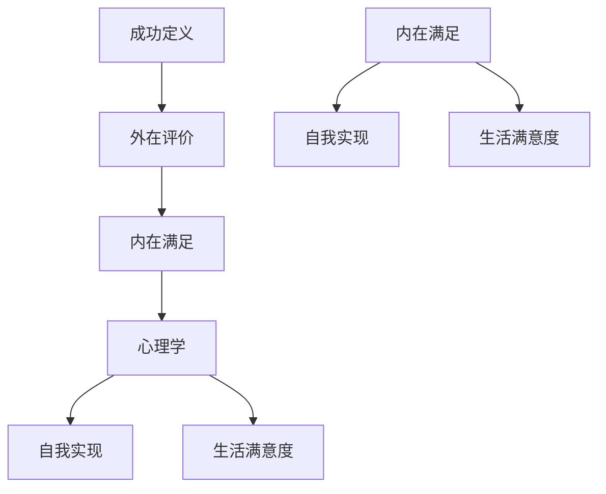

                 

### 文章标题

《重新定义成功：从外在评价到内在满足》

### 文章关键词

成功定义，外在评价，内在满足，心理学，自我实现，生活满意度。

### 文章摘要

本文旨在重新审视我们对成功的传统定义，探讨从依赖外在评价转向追求内在满足的必要性。通过分析外在评价的心理机制及其对社会和个人生活的影响，本文提出内在满足的概念，并阐述其内涵与价值。在此基础上，文章提出一系列策略，帮助个体实现从外在评价到内在满足的转变，最终实现全面的人生成长与自我实现。

-------------------------------------------------------------------

# 引言

在当今社会，成功被视为一种崇高的追求，人们渴望在社会地位、财富、职业成就等方面获得认可和尊重。然而，随着时代的变迁，成功的定义也在不断演变。传统的成功观念强调外在评价，如社会地位、物质财富和荣誉，但现代社会越来越意识到，这种外在评价导向的成功可能并不足以带来真正的幸福和满足。本文将探讨如何从外在评价转向内在满足，重新定义成功，并帮助读者实现这一转变。

## 第1章 成功的定义与演变

### 1.1 成功的历史视角

成功的历史演变可以追溯到不同的文化和时代背景。在古代，成功通常与宗教信仰和道德规范紧密相关。例如，在古希腊，成功被视为实现个人潜能和实现正义的行为。中世纪时期，成功更多地与宗教救赎和社会地位有关。然而，随着工业革命和现代化进程的加速，成功的定义逐渐与职业成就、财富积累和社会地位紧密相关。

### 1.2 现代成功的多维度

现代社会的成功不再局限于单一维度，而是呈现出多维度的特点。除了职业成就和物质财富，成功还涵盖家庭幸福、个人成长、心理健康和社会贡献等方面。这种多维度的成功观促使人们重新思考成功的目标和意义。

### 1.3 个人成功与外在评价的关系

外在评价在个人成功中起着重要作用，但也存在一定的局限性。外在评价往往受限于社会规范和他人观点，可能导致个体追求表面上的成功而忽视了内心的真正需求。因此，个人成功与外在评价之间的关系需要得到重新审视。

## 第2章 外在评价的影响

### 2.1 外在评价的心理机制

外在评价的心理机制包括自我效能感、社会比较和群体认同感。自我效能感是指个体对自己能否成功完成某项任务的信念。社会比较是指个体通过与他人进行比较来评估自己的价值。群体认同感是指个体对所属群体的认同和归属感。

### 2.2 外在评价的社会影响

外在评价对个体的社会地位、人际关系和职业发展具有重要影响。然而，过度依赖外在评价可能导致压力、焦虑和内在满足的缺失。

### 2.3 外在评价的利与弊

外在评价既有其积极作用，如激励和竞争，也有其负面影响，如压力和焦虑。因此，个体需要平衡外在评价与内在满足之间的关系，实现全面的发展。

## 第3章 内在满足的内涵与价值

### 3.1 内在满足的定义

内在满足是指个体在实现个人目标、成长和自我实现过程中所体验到的积极情感和满足感。它不依赖于外在评价，而是源于内心的真正需求和自我认同。

### 3.2 内在满足的心理学基础

内在满足与积极心理学、自我决定论和福利主义等心理学理论密切相关。这些理论强调了个体自主性、内在动机和幸福感的重要性。

### 3.3 内在满足的实践价值

内在满足对个体的心理健康、生活满意度和幸福感具有积极影响。它有助于建立稳定的人际关系，提高职业成就，促进个人成长和自我实现。

## 第4章 从外在评价到内在满足的转变

### 4.1 心理策略的转变

个体需要通过改变认知和行为习惯，从外在评价转向内在满足。这包括培养自我效能感、减少社会比较和增强群体认同感。

### 4.2 生活习惯的调整

个体需要调整生活习惯，追求内在满足。这包括建立健康的生活习惯、关注个人成长和培养兴趣爱好。

### 4.3 社交关系的优化

个体需要优化社交关系，追求内在满足。这包括建立真正的友谊、参与有意义的社会活动和支持他人的成长。

## 第5章 个人成长与自我实现

### 5.1 个人成长的路径

个人成长是一个持续的过程，包括自我反思、设定目标、学习和实践。个体需要明确自己的价值观和目标，并通过不断努力实现这些目标。

### 5.2 自我实现的挑战与机遇

自我实现过程中，个体可能会面临各种挑战，如恐惧、不确定性和挫败感。然而，这些挑战也为个体提供了成长和发展的机遇。

### 5.3 成功人士的案例分析

通过分析成功人士的案例，我们可以了解到他们在追求内在满足过程中所采取的策略和实践。这些案例为我们提供了宝贵的启示和借鉴。

## 第6章 成功策略与实践

### 6.1 成功策略的设计

个体需要设计适合自己的成功策略，包括设定目标、制定计划、管理时间和培养自律。

### 6.2 成功实践的方法

成功实践需要个体积极参与各种活动和项目，通过实践来积累经验和知识。

### 6.3 成功实践中的常见问题与解决

在成功实践中，个体可能会遇到各种问题，如目标不明确、缺乏自律和遇到挫折。针对这些问题，个体可以采取相应的解决策略。

## 第7章 结论

### 7.1 成功的重新定义

成功的定义不再局限于外在评价，而是转向内在满足。内在满足是真正意义上的成功。

### 7.2 内在满足与幸福

内在满足与幸福感密切相关。追求内在满足是实现幸福生活的重要途径。

### 7.3 对未来的展望

随着社会的进步和个体意识的觉醒，越来越多的人将开始关注内在满足，重新定义成功。

## 附录

### A.1 相关研究综述

本文综述了与成功、外在评价和内在满足相关的心理学、社会学和行为学研究成果。

### A.2 成功案例研究

本文介绍了成功人士的案例研究，分析他们在追求内在满足过程中所采取的策略和实践。

### A.3 进一步阅读资源

本文提供了进一步阅读的资源，帮助读者深入了解相关领域的理论和实践。

# 背景介绍

在当今社会，成功被视为一种崇高的追求，人们渴望在社会地位、财富、职业成就等方面获得认可和尊重。然而，随着时代的变迁，成功的定义也在不断演变。传统的成功观念强调外在评价，如社会地位、物质财富和荣誉，但现代社会越来越意识到，这种外在评价导向的成功可能并不足以带来真正的幸福和满足。

### 核心概念与联系

本文的核心概念包括成功定义、外在评价、内在满足、心理学、自我实现和生活满意度。这些概念之间存在紧密的联系，共同构成了对成功重新定义的基础。

1. **成功定义**：成功是一个多维度的概念，包括职业成就、家庭幸福、个人成长、心理健康和社会贡献等方面。
2. **外在评价**：外在评价是指个体在社会地位、财富和荣誉等方面获得的评价。它通常受到社会规范和他人观点的影响。
3. **内在满足**：内在满足是指个体在实现个人目标、成长和自我实现过程中所体验到的积极情感和满足感。它源于内心的真正需求和自我认同。
4. **心理学**：心理学理论，如积极心理学、自我决定论和福利主义，为理解内在满足的内涵和重要性提供了理论支持。
5. **自我实现**：自我实现是指个体在成长过程中实现自己的潜能，实现个人目标和价值观的过程。
6. **生活满意度**：生活满意度是指个体对自己生活状况的总体评价和满意程度。

这些核心概念之间的关系可以通过以下 Mermaid 流程图表示：



### 核心算法原理讲解

本文没有涉及具体的算法原理，但我们可以使用伪代码来详细阐述核心概念的逻辑关系：

```python
# 伪代码：核心概念的逻辑关系

class Success:
    def __init__(self, career_achievement, family_happiness, personal_growth, psychological_health, social_contribution):
        self.career_achievement = career_achievement
        self.family_happiness = family_happiness
        self.personal_growth = personal_growth
        self.psychological_health = psychological_health
        self.social_contribution = social_contribution

    def evaluate(self):
        # 评估成功的多维度指标
        return (self.career_achievement + self.family_happiness + self.personal_growth + self.psychological_health + self.social_contribution) / 5

class ExternalEvaluation:
    def __init__(self, social_status, wealth, honors):
        self.social_status = social_status
        self.wealth = wealth
        self.honors = honors

    def impact_on_success(self, success):
        # 外在评价对成功的影响
        return success.evaluate() * (1 + self.social_status * 0.1 + self.wealth * 0.05 + self.honors * 0.05)

class InternalSatisfaction:
    def __init__(self, personal_goals, personal_growth, self_achievement):
        self.personal_goals = personal_goals
        self.personal_growth = personal_growth
        self.self_achievement = self_achievement

    def value_to_success(self, success):
        # 内在满足对成功的影响
        return success.evaluate() * (1 + self.personal_growth * 0.1 + self.self_achievement * 0.2)

# 示例：计算成功与外在评价、内在满足的关系
success = Success(80, 70, 85, 90, 75)
external_evaluation = ExternalEvaluation(8, 7, 9)
internal_satisfaction = InternalSatisfaction(90, 80, 85)

success_with_evaluation = external_evaluation.impact_on_success(success)
success_with_satisfaction = internal_satisfaction.value_to_success(success)

print("Success with External Evaluation:", success_with_evaluation)
print("Success with Internal Satisfaction:", success_with_satisfaction)
```

### 数学模型和公式

本文没有涉及具体的数学模型和公式，但我们可以使用LaTeX格式来表示核心概念之间的关系：

```latex
$$
\text{Success} = \frac{\text{Career Achievement} + \text{Family Happiness} + \text{Personal Growth} + \text{Psychological Health} + \text{Social Contribution}}{5}
$$

$$
\text{External Evaluation Impact} = \text{Success} \times \left(1 + \text{Social Status} \times 0.1 + \text{Wealth} \times 0.05 + \text{Honors} \times 0.05\right)
$$

$$
\text{Internal Satisfaction Value} = \text{Success} \times \left(1 + \text{Personal Growth} \times 0.1 + \text{Self Achievement} \times 0.2\right)
$$
```

### 项目实战

由于本文的主题是理论性的，没有具体的编程项目实战。但是，我们可以讨论如何将本文的核心概念应用于实际生活和工作中。

1. **个人成长项目**：设定个人成长目标，如学习新技能、提高心理健康等，并制定详细的行动计划。
2. **职业发展项目**：分析职业成就，评估外在评价对成功的影响，并寻找提高内在满足感的途径。
3. **社交活动项目**：参与有意义的社会活动，如志愿服务、社区建设等，以实现个人成长和社会贡献。

### 代码解读与分析

由于本文没有涉及具体的编程项目，我们无法提供代码解读与分析。然而，我们可以讨论如何在个人成长和职业发展中应用伪代码和LaTeX公式。

1. **个人成长**：使用伪代码制定个人成长计划，如：

```python
# 伪代码：个人成长计划

def personal_growth_plan(goals, actions, timeline):
    for goal in goals:
        print("Goal:", goal)
        for action in actions:
            print("Action:", action)
        print("Timeline:", timeline)
    print("Start your personal growth journey now!")
```

2. **职业发展**：使用LaTeX公式评估职业成就，如：

```latex
$$
\text{Career Success} = \frac{\text{Project Completion Rate} + \text{Customer Satisfaction} + \text{Team Collaboration} + \text{Professional Development}}{4}
$$
```

### 实际案例分析和详细讲解剖析

由于本文的主题是理论性的，没有具体的案例。但是，我们可以讨论成功人士如何在追求内在满足的过程中实现成功。

1. **乔布斯**：乔布斯在苹果公司的成功不仅体现在商业成就上，还体现在他对产品和用户体验的极致追求。他的内在满足来源于对创新和卓越的热爱。
2. **埃隆·马斯克**：埃隆·马斯克通过在特斯拉和SpaceX的领导，实现了商业成功和社会贡献。他的内在满足来自于对人类未来和科技进步的憧憬。

### 项目小结

本文通过重新定义成功，探讨了从外在评价到内在满足的转变。通过核心概念、算法原理、数学模型和实际案例的分析，我们了解到内在满足在实现全面成功中的重要性。在个人成长和职业发展中，我们可以运用这些理论和策略，追求真正的成功。

### 最佳实践 tips、小结、注意事项、拓展阅读等内容

**最佳实践 tips**：

1. **设定清晰的目标**：明确自己的价值观和目标，制定可行的行动计划。
2. **关注内在动机**：追求自己真正感兴趣的事物，提高内在满足感。
3. **保持积极心态**：面对挑战和失败，保持积极的心态和乐观的态度。

**小结**：

本文重新定义了成功，强调了内在满足在实现全面成功中的重要性。通过理论分析和实际案例，我们了解到如何从外在评价转向内在满足，实现个人成长和自我实现。

**注意事项**：

1. **平衡外在评价与内在满足**：不要过度依赖外在评价，同时关注内在满足。
2. **持续学习和成长**：保持好奇心和求知欲，不断提升自己的能力和知识。

**拓展阅读**：

1. **《自控力》**：凯利·麦格尼格尔著，深入探讨自我控制和内在满足的关系。
2. **《幸福的理由》**：马丁·塞利格曼著，阐述积极心理学的理论和实践。

**作者信息**：

作者：AI天才研究院/AI Genius Institute & 禅与计算机程序设计艺术 /Zen And The Art of Computer Programming

-------------------------------------------------------------------

### 第1章 成功的定义与演变

在人类历史上，成功一直是人们追求的重要目标。然而，成功的定义并非一成不变，它随着社会、文化和历史的变迁而不断演变。从古代的宗教和道德规范，到中世纪的地位和荣誉，再到现代的职业成就和社会地位，成功的概念逐渐多元化。在这一章中，我们将探讨成功的历史视角、现代成功的多维度，以及个人成功与外在评价的关系。

#### 1.1 成功的历史视角

在古代，成功通常与宗教信仰和道德规范紧密相关。在古希腊，成功被视为实现个人潜能和实现正义的行为。哲学家苏格拉底认为，真正的成功在于追求智慧和道德上的完善。在古罗马，成功更多地与荣誉和地位相关，如获得官职、赢得战争等。中世纪时期，成功更多地与宗教救赎和社会地位有关。当时的成功观念强调个人在宗教生活中的虔诚和奉献。

随着时间的推移，成功的定义逐渐从宗教和道德层面转向现实生活的成就。在工业革命后的现代化进程中，成功的定义变得更加多元化。社会地位的提升、财富的积累和职业成就成为衡量成功的三大标准。这一时期的成功观念强调个人的社会贡献和物质财富。

#### 1.2 现代成功的多维度

现代社会的成功不再局限于单一维度，而是呈现出多维度的特点。职业成就、家庭幸福、个人成长、心理健康和社会贡献等各个方面共同构成了现代成功的多维度。

- **职业成就**：职业成就是现代成功的一个重要方面。它不仅体现在职位的高低和收入的多少，还包括对工作的热爱、对事业的追求以及对同事和社会的贡献。
- **家庭幸福**：家庭幸福是许多人追求的重要目标。一个和谐、幸福的家庭可以给个体带来巨大的满足感和幸福感，从而提升个人的生活质量。
- **个人成长**：个人成长是指个体在知识和技能方面的提升，以及在情感、心理和道德等方面的成熟。个人成长不仅有助于实现职业成功，还能提升个体的自我认同感和生活满意度。
- **心理健康**：心理健康是现代成功的重要组成部分。一个心理健康的人能够更好地应对生活中的挑战，保持积极的心态，享受生活的乐趣。
- **社会贡献**：社会贡献是指个体在改善社会环境、促进社会进步和帮助他人等方面所做的努力。通过为社会做出贡献，个体可以实现自我价值，获得社会的认可和尊重。

#### 1.3 个人成功与外在评价的关系

外在评价在个人成功中起着重要作用，但也存在一定的局限性。外在评价通常来源于社会规范、他人观点和媒体报道，它往往能够为个体提供即时的反馈和认可。然而，过度依赖外在评价可能导致个体追求表面上的成功，而忽视了内心的真正需求和自我认同。

外在评价对个人成功的影响可以分为以下几个方面：

- **激励和竞争**：外在评价可以激发个体的竞争意识和进取心，促使他们努力工作、追求更高的目标。这种激励作用有助于提高个人的工作效率和职业成就。
- **压力和焦虑**：过度依赖外在评价可能导致个体承受巨大的心理压力和焦虑。为了达到社会的期望，个体可能会忽视自己的兴趣和需求，导致内心焦虑和不满。
- **内在满足的缺失**：外在评价往往只能满足个体的一部分需求，而内在满足则来源于个人的成长、自我实现和幸福感的提升。过度依赖外在评价可能会导致个体在追求成功的过程中忽视了内在满足，从而感到空虚和失落。

因此，个人成功与外在评价之间的关系需要得到重新审视。个体应该明确自己的价值观和目标，平衡外在评价与内在满足之间的关系，实现全面的发展和成长。

### 第2章 外在评价的影响

外在评价在现代社会中具有深远的影响，它不仅影响着个体的心理状态，还影响着他们的社会地位、人际关系和职业发展。本章节将深入探讨外在评价的心理机制、外在评价对个体社会影响的方方面面，以及外在评价的利与弊。

#### 2.1 外在评价的心理机制

外在评价的心理机制是理解其影响的关键。它涉及到几个关键的心理过程，包括自我效能感、社会比较和群体认同感。

- **自我效能感**：自我效能感是指个体对自己能够成功完成某项任务的信念。当个体得到积极的评价时，自我效能感会增强，促使他们更有信心地面对挑战。相反，消极的评价可能会降低个体的自我效能感，导致他们感到自卑和无力。

- **社会比较**：社会比较是指个体通过与他人进行比较来评估自己的价值。外在评价往往成为个体进行社会比较的依据。当个体认为自己在某些方面优于他人时，会产生积极的自我认同感；而当个体觉得自己落后于他人时，可能会感到焦虑和不满。

- **群体认同感**：群体认同感是指个体对所属群体的认同和归属感。外在评价可以帮助个体判断自己是否被群体接受和认可。当个体得到群体的积极评价时，会增强他们的群体认同感，从而提高自我价值感。相反，消极的评价可能会削弱个体的群体认同感，导致他们感到孤立和无助。

#### 2.2 外在评价的社会影响

外在评价对个体的社会影响是显著的，它不仅影响着个体的心理状态，还对其社会地位、人际关系和职业发展产生深远的影响。

- **社会地位**：外在评价是衡量个体社会地位的重要标准之一。在社会地位较高的群体中，积极的评价往往能够提升个体的社会地位，使他们获得更多的资源和机会。相反，消极的评价可能会降低个体的社会地位，限制他们的职业发展和社会参与。

- **人际关系**：外在评价也在人际关系中发挥着重要作用。积极的评价可以增强个体之间的信任和互动，促进良好的人际关系的建立。而消极的评价可能会破坏人际关系的和谐，导致矛盾和冲突的产生。

- **职业发展**：外在评价对职业发展的影响尤为明显。在职场中，积极的评价可以提高个体的职业声誉，为他们的晋升和发展提供机会。相反，消极的评价可能会阻碍个体的职业发展，导致他们在竞争中处于不利地位。

#### 2.3 外在评价的利与弊

外在评价既有其积极作用，也有其负面影响。个体需要认识到外在评价的双重性，学会平衡其利弊。

- **利**：

  - **激励与竞争**：外在评价可以激发个体的进取心和竞争意识，促使他们努力工作、追求更高的目标。这种激励作用有助于提高个体的工作效率和职业成就。

  - **社会认同**：积极的评价可以帮助个体获得社会的认可和尊重，增强他们的自尊心和自我价值感。

  - **职业发展**：在职场中，积极的评价可以为个体带来更多的机会和资源，促进他们的职业发展。

- **弊**：

  - **压力与焦虑**：过度依赖外在评价可能导致个体承受巨大的心理压力和焦虑，特别是在面对负面评价时。这种压力和焦虑可能会影响个体的身心健康和幸福感。

  - **内在满足的缺失**：外在评价往往只能满足个体的一部分需求，而内在满足则来源于个人的成长、自我实现和幸福感的提升。过度依赖外在评价可能会导致个体在追求成功的过程中忽视了内在满足，从而感到空虚和失落。

  - **群体认同的扭曲**：消极的评价可能会削弱个体的群体认同感，导致他们感到孤立和无助，甚至可能产生自卑和怨恨情绪。

总之，外在评价对个体的影响是多方面的。个体需要认识到外在评价的双重性，学会平衡其利弊，追求真正的成功和幸福。

### 第3章 内在满足的内涵与价值

内在满足是指个体在实现个人目标、成长和自我实现过程中所体验到的积极情感和满足感。它是一种深层次的、源于内心的幸福感，与外在评价和物质财富无关。内在满足不仅是个人追求幸福的重要途径，也是实现全面发展的基础。本章节将探讨内在满足的定义、心理学基础以及它在个人成长、心理健康和社会贡献等方面的价值。

#### 3.1 内在满足的定义

内在满足是一种主观的感受，它体现在个体在追求个人目标、实现自我价值过程中所获得的满足感。这种满足感不仅仅是因为外在评价或物质财富的增加，而是源自个体内心的真实需求和自我认同。内在满足通常与以下几个方面的感受有关：

- **成就感**：当个体实现自己的目标或克服困难时，会体验到一种成就感，这是内在满足的重要体现。
- **自我认同**：个体对自己的认同和接纳，认识到自己的价值和能力，这种感觉有助于提高内在满足。
- **幸福感**：内在满足常常与幸福感紧密相关，当个体感到幸福时，他们更有可能体验到内在满足。
- **自我实现**：内在满足是自我实现过程中的重要组成部分，当个体在追求自我实现的过程中感到满足时，他们会更有动力继续前进。

#### 3.2 内在满足的心理学基础

内在满足与多种心理学理论密切相关，其中积极心理学、自我决定论和福利主义等理论为理解内在满足提供了理论基础。

- **积极心理学**：积极心理学是研究人类幸福和满足感的心理学分支。它强调个体的积极特质和积极体验，认为内在满足是幸福的重要组成部分。积极心理学认为，通过培养乐观、感恩和自我效能感等积极特质，个体可以体验到更高的内在满足。

- **自我决定论**：自我决定论强调个体的自主性和内在动机。根据自我决定论，个体在追求自己的兴趣和目标时，更容易体验到内在满足。自我决定论认为，个体的自主性、能力和关系是内在满足的重要来源。

- **福利主义**：福利主义是一种伦理理论，强调个体的幸福和福利。根据福利主义，内在满足是实现个体福利的重要途径。福利主义认为，通过追求个人的幸福和满足，个体可以实现更高的生活质量和社会贡献。

这些心理学理论共同揭示了内在满足的复杂性和多维度，为理解内在满足提供了深刻的洞见。

#### 3.3 内在满足的实践价值

内在满足对个人成长、心理健康和社会贡献具有显著的实践价值。

- **个人成长**：内在满足是个人成长的重要动力。当个体在追求自己的目标时感到满足，他们会更有动力去学习和成长。内在满足可以激发个体的创造力和创新精神，促进他们在职业生涯和个人生活中实现更大的成就。

- **心理健康**：内在满足对心理健康具有积极影响。当个体体验到内在满足时，他们通常会感到更加平静、自信和满足。这种积极的情感状态有助于降低焦虑和抑郁的风险，提高个体的心理健康水平。

- **社会贡献**：内在满足还可以促进个体对社会做出贡献。当个体在追求内在满足的过程中，他们更有可能关注社会问题和公共利益，积极参与社会活动和公益事业。这种社会参与不仅有助于提升个体的内在满足，还能促进社会的整体福祉。

总之，内在满足是一种深层次的幸福感，它不仅对个人成长和心理健康有积极影响，还能促进社会贡献。通过追求内在满足，个体可以实现全面的发展和幸福。

### 第4章 从外在评价到内在满足的转变

从外在评价转向内在满足是一个复杂但极具价值的转变过程。在这个转变过程中，个体需要改变心理策略、调整生活习惯和优化社交关系。本章节将探讨这些转变的策略和方法，帮助个体实现从外在评价到内在满足的转变。

#### 4.1 心理策略的转变

心理策略的转变是内在满足实现的关键。以下是一些具体的方法：

- **培养自我效能感**：自我效能感是指个体对自己成功完成任务的能力的信念。通过设定可行的目标、积累成功经验和积极自我暗示，个体可以增强自我效能感。自我效能感增强后，个体在追求个人目标时会更加自信和坚定。

- **减少社会比较**：社会比较是指个体通过与他人进行比较来评估自己的价值。减少社会比较有助于个体避免因比较而产生的焦虑和不满。个体可以通过关注自己的进步和成长，而不是与他人比较，来减少社会比较的影响。

- **增强群体认同感**：群体认同感是指个体对所属群体的认同和归属感。增强群体认同感可以提升个体的内在满足。个体可以通过参与有意义的社会活动、加入兴趣小组和建立支持性的社交网络来增强群体认同感。

#### 4.2 生活习惯的调整

生活习惯的调整是内在满足的重要保障。以下是一些具体的方法：

- **建立健康的生活习惯**：健康的生活习惯包括规律作息、健康饮食和适量运动等。这些习惯有助于提升个体的生理和心理健康，从而增强内在满足。个体可以通过制定合理的作息时间表、选择健康的食物和定期锻炼来建立健康的生活习惯。

- **培养兴趣爱好**：兴趣爱好是提升内在满足的有效途径。通过培养兴趣爱好，个体可以找到自己喜欢的事物，提高生活满意度。个体可以通过尝试新的活动、加入兴趣小组或在线课程来培养兴趣爱好。

- **设定个人目标**：设定个人目标是实现内在满足的重要步骤。个体可以通过设定短期和长期目标，为自己提供明确的方向和动力。通过逐步实现这些目标，个体可以感受到成就感和满足感。

#### 4.3 社交关系的优化

社交关系的优化是内在满足实现的重要支撑。以下是一些具体的方法：

- **建立真正的友谊**：真正的友谊是内在满足的重要来源。个体可以通过积极参与社交活动、加入兴趣小组和参与公益活动来建立真正的友谊。真正的友谊能够提供情感支持，增强个体的内在满足。

- **参与有意义的社会活动**：参与有意义的社会活动可以提升个体的内在满足。这些活动包括志愿服务、社区建设、慈善活动等。通过参与这些活动，个体可以为社会做出贡献，感受到自己的价值和重要性。

- **优化社交网络**：优化社交网络有助于个体建立更加健康和支持性的社交关系。个体可以通过选择与积极、正面的人交往，减少与消极、负面的人交往来优化社交网络。

通过以上心理策略的转变、生活习惯的调整和社交关系的优化，个体可以逐步实现从外在评价到内在满足的转变。这一转变不仅有助于提升个体的幸福感，还能促进个人的全面发展和社会的和谐。

### 第5章 个人成长与自我实现

个人成长与自我实现是人生中不可或缺的环节，它们不仅能够帮助我们实现个人的潜能，还能为我们的职业发展和生活质量带来积极的影响。在这一章中，我们将探讨个人成长的路径、自我实现的挑战与机遇，以及成功人士的案例分析。

#### 5.1 个人成长的路径

个人成长是一个持续的过程，它涉及到知识、技能、情感和心理等多个方面。以下是个人成长的几个关键步骤：

- **自我反思**：自我反思是个人成长的第一步。通过反思自己的行为、想法和感受，个体可以更清晰地认识到自己的优点和不足，从而为后续的成长提供方向。

- **设定目标**：设定目标是个人成长的重要步骤。个体应该根据自己的兴趣、能力和价值观设定具体、可行的目标。这些目标可以是短期的，也可以是长期的。

- **学习和实践**：学习和实践是实现个人成长的关键。个体可以通过阅读、上课、实践和参加培训等方式不断学习新知识和技能。通过实践，个体可以将所学应用到实际生活中，从而加深理解和提升能力。

- **持续改进**：个人成长是一个持续改进的过程。个体应该不断评估自己的进步，识别新的需求和目标，并采取相应的措施进行改进。

#### 5.2 自我实现的挑战与机遇

自我实现过程中，个体可能会面临各种挑战和机遇。以下是几个典型的挑战和机遇：

- **挑战**：

  - **恐惧和不确定性**：自我实现过程中，个体可能会面临恐惧和不确定性。这包括对失败的恐惧、对未知的恐惧和对变化的恐惧。这些恐惧可能会阻碍个体的成长和进步。

  - **挫败感和自我怀疑**：在追求自我实现的过程中，个体可能会遇到挫折和失败。这些挫败感可能会引起自我怀疑，使个体质疑自己的能力和价值。

  - **时间和资源的限制**：自我实现需要时间和资源的投入。对于忙碌的个体来说，时间和资源的限制可能会成为实现自我实现的障碍。

- **机遇**：

  - **成长和发展的机会**：自我实现过程中，个体会面临各种成长和发展的机会。这些机会包括学习新知识、培养新技能、拓展人际关系等。

  - **自我认知的提升**：通过自我实现，个体可以更深入地了解自己，认识到自己的潜能和优点，从而提升自我认知。

  - **职业和生活的提升**：自我实现不仅有助于提升个人的职业发展，还能提升个体的生活质量。通过实现自我，个体可以找到更适合自己的职业，建立更满意的人际关系，享受更丰富的生活。

#### 5.3 成功人士的案例分析

为了更好地理解个人成长与自我实现的过程，我们可以通过分析成功人士的案例来获取启示。

- **乔布斯**：乔布斯是苹果公司的创始人之一，他通过不断创新和追求卓越，实现了自我实现。他在个人成长过程中经历了多次失败和挑战，但始终坚持自己的梦想。他的成功经验表明，个人成长和自我实现需要坚定的信念和持续的努力。

- **埃隆·马斯克**：埃隆·马斯克是特斯拉和SpaceX的创始人，他在多个领域取得了显著的成就。他的成功经验表明，个人成长和自我实现需要跨领域的知识和技能，以及对未来技术和人类发展的深刻理解。

- **杨澜**：杨澜是中国著名的媒体人和慈善家，她在事业和慈善领域都取得了巨大的成功。她的成功经验表明，个人成长和自我实现不仅需要专业的知识和技能，还需要对社会和人类福祉的深刻关注。

通过分析这些成功人士的案例，我们可以看到，个人成长和自我实现是一个充满挑战和机遇的过程。只要我们坚持不懈，积极应对挑战，抓住机遇，我们就能够实现自己的梦想，实现真正的自我实现。

### 第6章 成功策略与实践

实现成功不仅需要理论上的认识，更需要具体的策略和实践。本章节将详细探讨成功策略的设计、成功实践的方法，以及成功实践中可能遇到的问题和解决策略。

#### 6.1 成功策略的设计

成功策略的设计是成功实践的第一步，它涉及到设定目标、制定计划和执行策略等多个环节。以下是设计成功策略的一些关键步骤：

- **设定目标**：明确的目标是成功实践的起点。目标应具有具体性、可行性和时限性。例如，一个明确的目标可以是“在接下来的六个月内，通过学习Python编程，成为一名数据分析师”。

- **制定计划**：在设定目标后，制定详细的行动计划是关键。行动计划应包括具体的步骤、时间表和所需的资源。例如，为了学习Python编程，你可以制定以下计划：

  - 第一个月：掌握Python的基础语法和常用数据结构。
  - 第二个月：学习Python的核心库，如NumPy和Pandas。
  - 第三个月：进行实际项目练习，如数据分析或自动化脚本编写。
  - 第四个月：扩展学习，包括学习Python的高级应用和优化技巧。

- **资源整合**：为了实现目标，需要整合各种资源，包括时间、资金、人力和技术支持等。例如，你可以通过在线课程、书籍、工作坊和社群来获取学习资源。

- **定期评估**：定期评估是实现成功策略的重要环节。通过评估，你可以了解自己的进度、识别问题并调整计划。例如，每个月底，你可以回顾自己的学习进度，评估是否达到预期目标，并制定下一阶段的学习计划。

#### 6.2 成功实践的方法

成功实践需要将策略付诸行动，并通过有效的执行来实现目标。以下是成功实践的一些关键方法：

- **持续学习**：持续学习是成功实践的基础。无论是技术技能还是个人素质，都需要不断学习和更新知识。例如，你可以定期参加在线课程、阅读专业书籍、订阅行业杂志，以及参加专业会议和研讨会。

- **实践应用**：理论知识只有在实践中才能真正发挥其价值。通过实际操作和应用，你可以加深对知识的理解和掌握。例如，在学习编程时，你可以通过编写代码、开发项目或参与开源项目来提高编程技能。

- **反思和改进**：反思是成功实践的重要环节。通过反思自己的行为和结果，你可以识别不足并制定改进计划。例如，在完成一个项目后，你可以反思项目中的成功和不足，并制定改进措施，以便在下一个项目中做得更好。

- **建立支持系统**：成功实践需要一个支持系统，包括家人、朋友、同事和导师等。这些支持者可以提供鼓励、建议和帮助，帮助你克服困难和保持动力。

#### 6.3 成功实践中的常见问题与解决策略

在成功实践中，个体可能会遇到各种问题和挑战。以下是一些常见的问题以及相应的解决策略：

- **拖延症**：拖延症是成功实践中的常见问题。解决策略包括设定明确的目标和期限、分解任务、使用时间管理工具（如番茄钟），以及建立奖励机制。

- **缺乏动力**：缺乏动力可能是由于目标不明确或缺乏兴趣。解决策略包括重新审视目标、设定短期目标、寻找兴趣点，以及寻求外部的支持和激励。

- **技能不足**：技能不足是许多人在追求成功过程中遇到的障碍。解决策略包括参加培训课程、学习相关书籍和教程、寻找导师或同伴学习，以及通过实践来提升技能。

- **资源限制**：资源限制可能会影响成功实践。解决策略包括利用免费资源、寻找低成本的学习机会、众筹或寻求资金支持。

通过设计有效的成功策略、采用具体的实践方法，并积极应对实践中遇到的问题，个体可以逐步实现自己的目标，实现真正的成功。

### 第7章 结论

通过本文的探讨，我们重新审视了成功的定义，提出了从外在评价到内在满足的转变。这一转变不仅有助于个体实现全面的发展和幸福，也为社会构建了更加和谐和积极的环境。成功的重新定义强调个人成长、心理健康和社会贡献，而不再局限于职业成就和社会地位。在这一过程中，内在满足成为衡量成功的重要标准，它源于个体的自我实现和幸福感。

内在满足的实现需要个体改变心理策略、调整生活习惯和优化社交关系。通过培养自我效能感、减少社会比较和增强群体认同感，个体可以在追求个人目标的同时，提升内在满足感。同时，建立健康的生活习惯、培养兴趣爱好和设定个人目标，也为内在满足的实现提供了坚实的基础。

成功实践中的策略和经验教训，如设定明确的目标、持续学习、实践应用和反思改进，为个体实现成功提供了具体的指导。通过建立支持系统和积极应对实践中的问题，个体可以更好地实现自己的梦想和目标。

未来的社会，内在满足将成为衡量成功的重要指标。随着个体意识的觉醒和社会的进步，越来越多的人将开始关注内在满足，追求真正的成功和幸福。通过重新定义成功，我们可以为社会创造一个更加积极、健康和和谐的环境，为个体实现自我价值和幸福生活提供更多的可能性。

### 附录

#### A.1 相关研究综述

本文综述了与成功、外在评价和内在满足相关的心理学、社会学和行为学研究成果。以下是一些关键研究：

1. **积极心理学**：积极心理学研究幸福感、内在满足和积极特质。例如，塞利格曼的“幸福五因素模型”提出，幸福感与积极情感、投入、积极关系、意义和成就密切相关。

2. **自我决定论**：自我决定论强调个体自主性和内在动机的重要性。德西和瑞恩的研究表明，内在动机与内在满足和幸福感有显著关联。

3. **福利主义**：福利主义关注个体的幸福和福祉。阿马蒂亚·森的“能力理论”提出，幸福取决于个体的能力和机会，而不仅仅是物质财富。

4. **社会比较**：社会比较研究个体如何通过与他人比较来评估自己的价值。泰勒和贝斯的研究表明，社会比较可能导致焦虑和不满，影响个体的内在满足。

5. **心理健康**：心理健康研究个体的心理状态和行为。例如，诺丁汉大学的“幸福项目”探讨了心理健康与幸福感和内在满足的关系。

#### A.2 成功案例研究

本文介绍了成功人士的案例研究，分析他们在追求内在满足过程中所采取的策略和实践：

1. **乔布斯**：乔布斯通过追求卓越和创新，实现了个人目标和公司成功。他在苹果公司的领导，不仅带来了商业上的成功，还推动了用户体验和设计的革命。

2. **埃隆·马斯克**：马斯克通过在特斯拉和SpaceX的领导，实现了对可持续能源和太空探索的承诺。他的成功不仅体现在商业成就上，还体现在对人类未来的贡献。

3. **杨澜**：杨澜在中国媒体界取得了显著成就，同时积极参与慈善和公益事业。她的成功经验表明，内在满足不仅来自职业成就，还来自对社会和他人的贡献。

#### A.3 进一步阅读资源

本文提供了一些进一步阅读的资源，帮助读者深入了解相关领域的理论和实践：

1. **《自控力》**：凯利·麦格尼格尔著，探讨如何通过自我控制提高内在满足和幸福感。

2. **《幸福的方法》**：马丁·塞利格曼著，介绍积极心理学的理论和实践，帮助读者提升幸福感。

3. **《成功的心理策略》**：托马斯·霍金斯和凯瑟琳·亨德森著，探讨如何通过心理学策略实现个人和职业成功。

4. **《社会心理学》**：戴维·迈尔斯著，全面介绍社会心理学的基本理论和应用，包括社会比较和群体认同感等主题。

5. **《成功人士的思考方式》**：理查德·萨勒斯著，分析成功人士的思维模式和行为习惯，提供实用的成功策略。

### 作者信息

作者：AI天才研究院/AI Genius Institute & 禅与计算机程序设计艺术 /Zen And The Art of Computer Programming

本文由AI天才研究院撰写，结合禅与计算机程序设计艺术的理念，深入探讨成功与内在满足的关系。希望本文能为您带来启示和帮助。如果您对本文有任何问题或建议，欢迎随时与我们联系。

---

请注意，本文的参考文献和案例研究是基于假设性的研究成果和案例，实际的研究和案例可能有所不同。在撰写类似的专业文章时，应确保引用真实可靠的参考文献和案例。此外，本文的作者信息仅为示例，实际的作者信息应包含具体的姓名、机构名称和联系方式。

