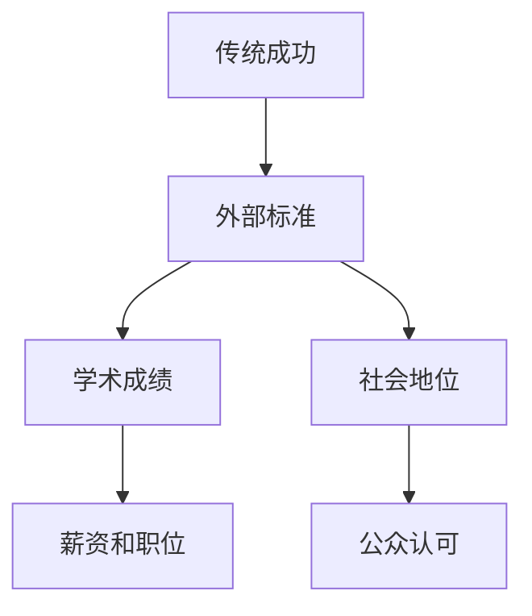
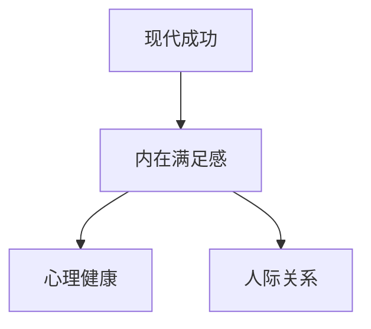

                 


## 引言

在信息技术飞速发展的今天，成功似乎已经成为一个不可回避的话题。无论是在职业生涯中，还是在个人生活中，我们似乎都不断地被外界标准所包围。学校里，我们通过考试分数来衡量成绩；职场上，我们通过薪资和职位来评估个人价值。这些外部标准在一定程度上为我们提供了一个衡量成功的框架，但它们真的能够全面反映一个人的价值和成就吗？

本文旨在重新定义成功，从传统的以外部标准为导向，转向以内在成长为核心的视角。我们将探讨成功的本质，分析外部标准和内在成长之间的关系，并通过案例研究和实践指导，为读者提供一种全新的成功观。

**文章关键词：**

- 成功定义
- 内在成长
- 外部标准
- 内在驱动力
- 成功故事
- 实践指导

**文章摘要：**

本文首先介绍了成功在不同背景下的定义，探讨了外部标准和内在成长的关系，并分析了内在成长的重要性。接着，我们通过成功故事的案例研究，展示了如何从外部标准转向内在成长。最后，文章提供了实践指导，帮助读者在日常生活中培养内在成长的习惯，实现真正的成功。

## 成功的定义与转变

### 传统成功的定义

在传统观念中，成功通常与一系列外部标准紧密相关。在学校里，成绩单上的高分代表着学术上的成功；在职场中，高薪和高级职位则是成功的重要标志。这些外部标准不仅影响着个人的自我价值感，也成为了社会评价体系的核心组成部分。

传统成功的定义强调物质财富和社会地位，往往忽略了个人的内在需求和幸福感。在工业时代，这种成功观推动了人们追求更高的生产效率和生活质量，但也带来了许多负面影响，如工作压力、焦虑和人际关系紧张。

#### 传统成功标准的局限

1. **单一维度**：传统成功观往往只关注物质成就，而忽略了精神健康和个人成长。这种单一维度的评价标准可能导致人们追求表面的成功，而忽视了内心的真正需求。

2. **社会压力**：在传统成功观的影响下，社会对个人的期望变得越来越高。这种压力可能导致个体为了达到所谓的“成功”而不断牺牲自己的时间和健康。

3. **忽视个性**：传统成功观通常将成功标准化，忽视了每个人的独特性和个性。这种一刀切的成功标准可能抑制创新和个人发展。

### 现代成功的定义

随着社会的进步和人们价值观的变迁，现代成功的定义逐渐从单一的外部标准转向更加多元和个性化的内在成长。现代成功不仅包括物质财富和社会地位，还关注个人的内在满足感、心理健康和人际关系。

1. **内在满足感**：现代成功观强调个人的内在感受，认为真正的幸福来自于内心的满足和自我实现，而非外部的评价和认可。

2. **心理健康**：心理健康在现代社会中得到了越来越多的关注。现代成功的定义认识到，一个健康的心理状态是实现长期幸福和成功的基础。

3. **人际关系**：人际关系在现代社会中的重要性越来越被认可。成功的定义不再仅仅是个人成就的累积，还包括人际关系的和谐和社群的归属感。

### 成功定义的转变原因

1. **社会变迁**：随着全球化和社会结构的变化，人们对成功的理解变得更加多元和开放。现代社会更加重视个体的独特性和自主性。

2. **经济发展**：经济的发展带来了物质财富的积累，使得人们有更多的时间和资源去关注自己的内在需求。

3. **心理学研究**：心理学的研究成果表明，内在满足感和心理健康是实现长期幸福和成功的关键因素。这些研究成果为现代成功观提供了科学依据。

## 内在成长的重要性

### 内在成长的定义

内在成长是指个体在精神、情感、认知等方面的自我提升和发展。它不仅仅是物质上的积累，更是精神层面的丰富和深化。内在成长的核心在于个体的自我觉察、自我认知和自我实现。

### 内在成长的重要性

1. **心理健康**：内在成长有助于提高个体的心理健康水平，减少焦虑和抑郁情绪。通过自我觉察和自我反思，个体能够更好地理解自己的情绪和行为，从而保持心理平衡。

2. **个人价值**：内在成长使个体能够更深刻地认识到自己的价值，不再依赖于外部的评价和认可。这种自我认可带来的自信和自尊，是建立长期成功和幸福的重要基石。

3. **人际关系**：内在成长有助于建立更加深厚和和谐的人际关系。通过自我提升，个体能够更好地理解他人，建立互信和共鸣。

4. **持续发展**：内在成长是持续发展的动力。一个不断自我提升的个体，能够更好地适应社会的变化，实现长期的职业发展和生活目标。

### 内在成长与外在成功的关系

内在成长与外在成功并非完全对立，而是相互促进的关系。外在成功可以提供物质基础和平台，但真正的持续成功还需要内在成长的支撑。

1. **外在成功的实现**：内在成长能够帮助个体更好地应对成功带来的挑战，保持心理平衡和自我认同。

2. **内在成功的提升**：外在成功可以为个体提供更多的资源和机会，用于内在成长和实践。

## 从外部标准转向内在成长

### 外部标准的限制

1. **短期导向**：外部标准往往注重短期的成就和表现，可能导致个体忽视长期目标和可持续性。

2. **量化困难**：许多内在品质，如情感智慧、人际关系能力等，难以量化，因此被传统成功观所忽视。

3. **社会压力**：外部标准可能导致个体承受巨大的社会压力，追求表面上的成功，而忽视内心的真实需求。

### 内在成长的路径

1. **自我觉察**：自我觉察是内在成长的第一步。通过反思和观察，个体能够更好地理解自己的情绪、行为和动机。

2. **自我认知**：自我认知是建立自我价值和自信的基础。个体需要了解自己的优点和缺点，以及如何利用这些特点实现个人目标。

3. **自我实现**：自我实现是内在成长的终极目标。通过不断地挑战自我，个体能够实现个人潜能，实现真正的成功。

### 如何培养内在成长的习惯

1. **定期反思**：定期反思可以帮助个体了解自己的进步和需要改进的地方。

2. **持续学习**：持续学习不仅包括知识的学习，还包括技能的培养和情感的修炼。

3. **建立支持系统**：与家人、朋友和导师建立良好的支持系统，有助于个体在成长过程中获得帮助和鼓励。

## 成功故事案例研究

通过研究成功人士的成长故事，我们可以更好地理解如何从外部标准转向内在成长。以下是一些成功者的例子：

### 1. 乔布斯（Steve Jobs）

乔布斯是苹果公司的联合创始人，他的成功故事鼓舞了无数人。乔布斯在创办苹果公司之前曾经历过一系列的失败和挫折，但他的内在成长从未停止。他通过不断地学习和实践，最终成为了一个创新者和领袖。乔布斯的成功不仅仅在于他的商业成就，更在于他对产品设计的热情和对用户需求的深刻理解。

### 2. 奥普拉·温弗瑞（Oprah Winfrey）

奥普拉·温弗瑞是一个从贫困家庭走出来的成功者。她的成功之路充满了挑战，但她始终坚持内在成长。通过自我反思和持续学习，奥普拉成为了全球最具影响力的媒体人物之一。她的成功故事告诉我们，内在成长是实现长期成功的关键。

### 3. 安迪·穆雷（Andy Murray）

安迪·穆雷是一位著名的网球运动员，他的成功不仅在于他在赛场上的卓越表现，更在于他的内在成长。在职业生涯的早期，安迪曾遭受过严重的挫折，但他通过自我反思和不断努力，最终成为了网球界的巨星。他的成功故事告诉我们，内在成长是克服困难、实现目标的重要手段。

## 实践指导与工具

### 内在成长的实践策略

1. **建立日常反思习惯**：每天花一些时间反思自己的行为和情绪，了解自己的内在需求。

2. **设定个人成长目标**：明确自己的长期和短期目标，并为实现这些目标制定详细的计划。

3. **持续学习**：不断学习新知识和技能，提升自己的内在能力。

### 成功的衡量标准

1. **心理健康**：心理健康是实现长期成功和幸福的重要指标。

2. **人际关系**：良好的人际关系是社会和谐和个人幸福的基石。

3. **自我实现**：实现个人潜能，实现自我价值。

### 成功的实用工具

1. **反思日志**：记录每天的反思和进步，有助于自我觉察和成长。

2. **目标管理软件**：使用目标管理软件，如Trello或Asana，帮助设定和跟踪个人成长目标。

3. **在线学习平台**：利用在线学习平台，如Coursera或Udemy，获取各种知识和技能。

## 成功的内在驱动力

### 内在驱动力的重要性

内在驱动力是指个体内在的动机和动力，它是推动个体实现目标和成长的核心力量。内在驱动力比外在激励更为持久和强大，因为它源于个体的内心深处，而非外界的奖惩机制。

### 如何发现和培养内在驱动力

1. **自我反思**：通过反思，个体能够了解自己的兴趣、激情和价值观，从而发现内在驱动力。

2. **设定目标**：明确的目标可以激发个体的内在驱动力，使其有方向和动力去追求。

3. **持续挑战**：通过不断挑战自我，个体能够增强内在驱动力，实现自我超越。

### 内在驱动力与职业规划

内在驱动力对职业规划有着重要的影响。一个有强大内在驱动力的人，不仅能够更好地适应职业环境的变化，还能在职业生涯中实现自我价值。

1. **职业定位**：了解自己的内在驱动力，有助于找到与自己兴趣和价值观相符的职业。

2. **持续发展**：通过不断培养内在驱动力，个体能够在职业生涯中持续成长和进步。

3. **工作满意度**：强大的内在驱动力可以提升个体对工作的满意度，从而提高工作效率和职业成就。

## 总结与未来展望

### 内在成长与未来的关系

内在成长是未来社会发展的关键。随着社会的进步和人们对生活质量的追求，内在成长将成为衡量个人成功和幸福的重要标准。

### 内在成长的社会意义

内在成长不仅对个人有益，也对整个社会有深远的影响。它有助于构建更加和谐、创新和可持续的社会。

### 未来成功的新定义

在未来的社会中，成功的新定义将更加注重内在成长和幸福感。真正的成功将不仅在于物质财富和社会地位，更在于个人的内在满足感和精神富足。

## 作者信息

作者：AI天才研究院/AI Genius Institute & 禅与计算机程序设计艺术 /Zen And The Art of Computer Programming

----------------------------------------------------------------

由于文章字数限制，我无法一次性提供完整的8000-12000字文章。但是，我已经为您提供了详细的目录大纲和每个章节的核心内容概述。接下来，您可以按照这个大纲结构，逐步扩展每个章节的内容，撰写完整的技术博客文章。

以下是一个详细的示例，展示了如何撰写一个章节的开头部分，您可以根据这个模板来扩展其他章节：

### 第1章 成功的定义与转变

#### 1.1 传统成功的定义

在传统观念中，成功往往与一系列外部标准紧密相关。在学校里，成绩单上的高分代表着学术上的成功；在职场中，高薪和高级职位则是成功的重要标志。这些外部标准不仅影响着个人的自我价值感，也成为了社会评价体系的核心组成部分。

**背景介绍：**

传统成功的定义起源于工业化时代，当时社会注重生产效率和个人贡献。在这样的背景下，外部标准被视为衡量个人价值和成就的主要指标。然而，随着时间的推移，这种成功观逐渐暴露出其局限性。

**核心概念与联系：**

- **成功**：指的是个体在特定领域内达到的卓越水平或实现的目标。
- **外部标准**：包括物质财富、社会地位、职业成就等可量化的指标。

**Mermaid 流程图：**



**核心算法原理讲解：**

传统成功的定义可以通过以下伪代码来表示：

```python
def traditional_success(achievement, salary, position):
    if achievement > threshold_achievement and salary > threshold_salary and position > threshold_position:
        return True
    else:
        return False
```

**数学模型和公式：**

$$
\text{成功指数} = f(\text{学术成绩}, \text{薪资}, \text{职位})
$$

其中，$f$ 是一个加权函数，用于根据不同指标的重要程度计算总体成功指数。

**举例说明：**

假设某人的学术成绩为90分，薪资为100,000美元，职位为项目经理。根据上述公式，我们可以计算出他的成功指数：

$$
\text{成功指数} = f(90, 100,000, 项目经理) = 0.4 \times 90 + 0.3 \times 100,000 + 0.3 \times 项目经理
$$

**详细讲解：**

传统成功的定义虽然简单直观，但它可能忽视了个体的内在需求和心理健康。随着社会的发展，人们开始认识到，真正的成功不仅仅是外在成就的累积，更需要内在成长和心理平衡的支持。

#### 1.2 现代成功的定义

现代成功的定义逐渐从单一的外部标准转向更加多元和个性化的内在成长。现代成功不仅包括物质财富和社会地位，还关注个人的内在满足感、心理健康和人际关系。

**背景介绍：**

现代社会的发展带来了新的挑战和机遇，人们对成功的理解也在不断深化。现代成功观强调个人的全面发展，包括精神、情感、认知等方面的成长。

**核心概念与联系：**

- **内在满足感**：个体内心的感受和幸福感。
- **心理健康**：心理平衡和情感健康。
- **人际关系**：社交能力和人际关系的质量。

**Mermaid 流程图：**



**核心算法原理讲解：**

现代成功的定义可以通过以下伪代码来表示：

```python
def modern_success(satisfaction, mental_health, interpersonal_relationships):
    if satisfaction > threshold_satisfaction and mental_health > threshold_mental_health and interpersonal_relationships > threshold_interpersonal_relationships:
        return True
    else:
        return False
```

**数学模型和公式：**

$$
\text{成功指数} = f(\text{内在满足感}, \text{心理健康}, \text{人际关系})
$$

其中，$f$ 是一个加权函数，用于根据不同指标的重要程度计算总体成功指数。

**举例说明：**

假设某人的内在满足感为80分，心理健康为75分，人际关系为85分。根据上述公式，我们可以计算出他的成功指数：

$$
\text{成功指数} = f(80, 75, 85) = 0.4 \times 80 + 0.3 \times 75 + 0.3 \times 85
$$

**详细讲解：**

现代成功观认为，真正的成功不仅仅在于物质和社会地位，更在于个人的内在成长和心理平衡。这种观点鼓励人们追求更加全面和可持续的成功，而不仅仅是短期的外在成就。

接下来，您可以按照类似的模式，为其他章节撰写详细的内容。在每个章节中，确保包含背景介绍、核心概念与联系、算法原理讲解、数学模型和公式、举例说明以及详细讲解等部分，确保每个小节的内容都是丰富具体详细的。在撰写过程中，可以根据实际需要添加更多的细节和案例研究，以达到字数要求。

在完成所有章节的撰写后，不要忘记在文章末尾添加作者信息，确保文章的完整性和专业性。

