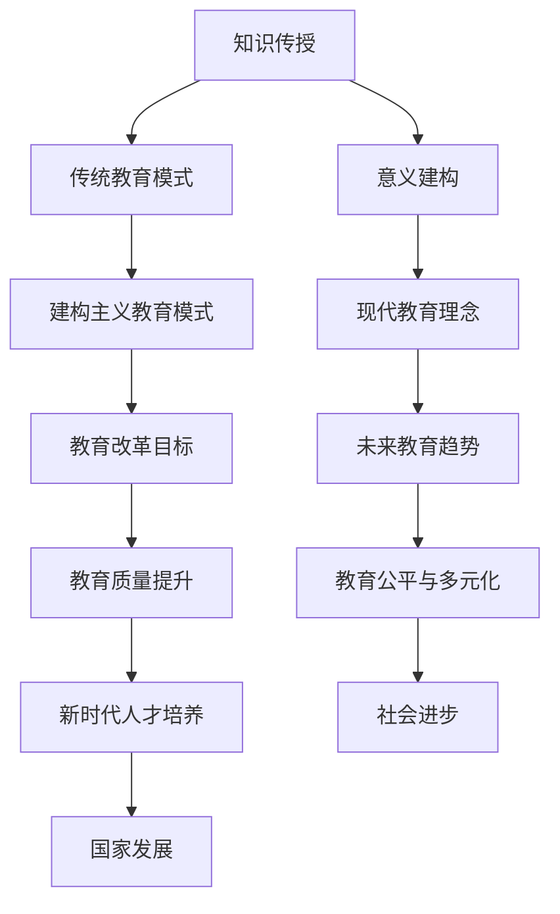

                 

## 文章标题：重新定义教育：从知识传授到意义建构

> 关键词：教育变革、意义建构、知识传授、教育心理学、教学策略、教育技术

> 摘要：本文将探讨教育从知识传授到意义建构的变革过程，分析其背景和意义，并详细阐述相关理论、教学策略和教育技术的应用。通过实践案例和创新探索，揭示未来教育的发展趋势与挑战，为教育改革提供路径与策略。

----------------------------------------------------------------

### 引言

教育是人类社会发展的基石，然而，随着科技的飞速发展和全球化的深入，传统的教育模式正面临前所未有的挑战。知识爆炸、信息过载、个性化和多元化需求的不断涌现，使得教育工作者不得不重新思考教育的本质和目标。本文旨在重新定义教育，从知识传授向意义建构转变，探讨这一变革的背景、理论基础和实践路径，以期为教育改革提供新的视角和思路。

#### 教育变革的时代背景

1. **科技革命的推动**：计算机科学、互联网、人工智能等科技的快速发展，改变了信息传播、知识获取和学习的途径，为教育提供了新的工具和平台。

2. **社会转型的挑战**：全球化、经济结构调整、社会多样性增加，对教育提出了新的要求，要求教育更加注重培养学生的综合素质和创新能力。

3. **教育理念的转变**：从“以教师为中心”到“以学生为中心”，从“知识灌输”到“意义建构”，教育理念正在经历深刻的变革。

#### 从知识传授到意义建构

1. **知识传授的局限**：传统的教育模式过于注重知识的传授，忽视了对学生思维能力和创新精神的培养。

2. **意义建构的重要性**：意义建构是一种主动的、构建性的学习过程，强调学生在真实情境中的实践体验和深度学习。

3. **教育改革的目标**：通过教育变革，实现教育的个性化、智能化和多元化，培养具有全面素质和创新能力的新时代人才。

#### 本书结构安排

本文分为四个主要部分：

1. **引言**：介绍教育变革的背景和意义。
2. **理论基础**：阐述教育心理学基础、教学策略和方法、教育技术的应用。
3. **实践案例**：分析学校教育、家庭教育和社区教育的实践案例。
4. **创新探索**：探讨未来教育的发展趋势和挑战，提出教育改革的路径与策略。

### 理论基础

教育改革需要坚实的理论基础，本部分将详细探讨教育心理学基础、意义建构理论、教学策略和方法。

#### 教育心理学基础

1. **学习理论概述**：
    - **行为主义学习理论**：强调外部刺激与行为反应之间的关系，如斯金纳的操作条件反射理论。
    - **认知主义学习理论**：关注个体的内部认知过程，如布鲁纳的认知结构理论。
    - **人本主义学习理论**：强调个体的自我实现和情感需求，如罗杰斯的学习自由理论。

2. **意义建构的理论基础**：
    - **社会建构主义理论**：强调知识是人际互动和社会实践的产物，如维果斯基的文化历史发展理论。
    - **投身学习理论**：强调学生在学习过程中的主动参与和情感投入，如杜威的实践教育理论。
    - **意义建构的过程**：学生在学习过程中通过感知、理解、反思和重构，构建对知识的个人理解。

3. **教育心理学在教育改革中的应用**：
    - **学生中心的教学模式**：重视学生的主体地位，促进学生主动学习。
    - **情感教学**：关注学生的情感需求，提高教学效果。
    - **差异化教学**：根据学生的个性差异进行教学，实现教育的个性化。

#### 教学策略与方法

1. **传统教学策略**：
    - **讲授式教学**：教师通过讲解传授知识，适用于基础知识的教学。
    - **探究式教学**：教师引导学生自主探究问题，培养学生的探究能力和思维能力。
    - **情境教学**：将知识融入具体的情境中，提高学生的实际应用能力。

2. **意义建构教学策略**：
    - **项目式学习**：通过实际项目完成，培养学生的综合能力和团队合作精神。
    - **合作学习**：通过小组合作，促进学生之间的交流和互动，提高学习效果。
    - **反思性学习**：鼓励学生进行自我反思，深化对知识的理解和应用。

3. **教学策略选择的依据**：
    - **学生特点**：根据学生的年龄、兴趣、学习能力选择合适的教学策略。
    - **教学内容**：根据学科特点和教学内容选择适合的教学策略。
    - **教学环境**：根据学校的硬件设施、教学资源和教师的专业能力选择教学策略。

#### 教育技术的应用

1. **教育技术的概述**：
    - **教育技术的定义**：教育技术是指运用现代信息技术手段支持教学和学习的活动。
    - **教育技术的分类**：包括硬件技术、软件技术、网络技术等。
    - **教育技术的作用**：提高教学效率、丰富教学资源、实现个性化教育。

2. **现代教育技术的应用**：
    - **信息技术在教学中的应用**：如在线教学平台、多媒体教学资源等。
    - **人工智能在教育中的应用**：如智能评估、个性化推荐等。
    - **网络教育资源的使用**：如开放课程、在线图书馆等。

3. **教育技术支持的建构主义教学**：
    - **网络学习社区**：为学生提供交流和分享的平台，促进知识建构。
    - **虚拟实验室**：提供模拟实验环境，培养学生的实践能力。
    - **在线协作工具**：如在线讨论、共享文档等，促进团队合作和知识共享。

### 实践案例

本部分将通过学校教育、家庭教育和社区教育的实践案例，展示教育变革的实际成果和挑战。

#### 学校教育实践

1. **案例背景介绍**：
    - 某小学实施项目式学习，通过实际项目完成，提高学生的综合能力和团队合作精神。
    - 某中学开展探究式教学，鼓励学生自主探究问题，培养学生的探究能力和思维能力。
    - 某大学进行教育模式转变，将意义建构教学策略应用于课堂，提高教学效果。

2. **教育实践分析**：
    - **传统教学的反思**：教师讲解为主，学生被动接受，缺乏实践和互动。
    - **构建主义教学法的实施**：教师引导学生自主探究，学生主动参与，实现知识的深度建构。
    - **教育技术应用的探索**：利用信息技术和在线资源，实现个性化教育和合作学习。

3. **教育实践的成效评估**：
    - 学生的学习兴趣和主动性显著提高。
    - 学生的团队合作能力和创新能力增强。
    - 教师的教学水平得到提升，教学方法更加多样化和高效。

#### 家庭教育实践

1. **家庭教育的重要性**：
    - 家庭教育对儿童成长的影响：家庭环境、亲子关系、家庭教育方式对儿童的成长有重要影响。
    - 家庭教育存在的问题：重智轻德、过度保护、缺乏有效沟通等。
    - 家庭教育的目标：培养儿童的自主性、责任感、社交能力等。

2. **家庭教育实践案例**：
    - **案例一**：激发孩子的学习兴趣，通过游戏和实践活动，培养孩子的学习热情。
    - **案例二**：培养孩子的自主学习能力，通过设置目标和激励机制，引导孩子主动学习。
    - **案例三**：家长与孩子的有效沟通，通过倾听、理解和引导，建立良好的亲子关系。

3. **家庭教育实践的启示**：
    - 家庭教育需要关注孩子的个性发展和心理健康。
    - 家庭教育需要注重亲子沟通和互动，建立良好的家庭氛围。
    - 家庭教育需要与社会教育和学校教育相结合，形成教育合力。

#### 社会教育实践

1. **社会教育的作用**：
    - 社会教育资源：图书馆、博物馆、社区活动等。
    - 社会教育的内容：科技、文化、艺术、道德等。
    - 社会教育的形式：讲座、展览、活动、培训等。

2. **社会教育实践案例**：
    - **案例一**：社区教育活动的组织与实施，通过丰富的活动形式，提高居民的素质和参与度。
    - **案例二**：社会志愿者在教育中的作用，通过志愿者的参与，丰富教育资源，促进教育公平。
    - **案例三**：企业社会责任与教育结合的探索，通过企业资源的投入，支持教育的发展和改革。

3. **社会教育实践的成效与挑战**：
    - 社会教育在提高居民素质、促进教育公平、丰富教育资源方面取得显著成效。
    - 社会教育在实践中面临资源不足、管理不规范、参与度不高等挑战。

### 创新探索

本部分将探讨未来教育的发展趋势和挑战，提出教育改革的路径与策略。

#### 未来教育展望

1. **教育理念的未来发展**：
    - **建构主义教育理念的未来走向**：强调学生的主体地位和自主性，促进知识的深度建构。
    - **深度学习与教育改革**：通过深度学习，实现知识的内化和创新。
    - **教育公平与多元化**：关注弱势群体的教育需求，实现教育的公平和多元化。

2. **教育技术的创新应用**：
    - **人工智能在教育中的应用前景**：如智能评估、个性化推荐、智能辅助教学等。
    - **虚拟现实与教育的结合**：提供沉浸式学习体验，提高学生的学习效果。
    - **网络教育资源的整合与共享**：实现教育资源的共享和优化配置。

3. **未来教育的发展趋势与挑战**：
    - **个性化教育**：根据学生的个性特点进行教学，实现教育的个性化。
    - **智能化教育**：利用人工智能技术，提高教育的效率和效果。
    - **多元化教育**：关注不同群体的教育需求，实现教育的多元化。
    - **挑战**：教育资源的分配、教育公平、教师专业发展等问题。

#### 教育改革路径与策略

1. **教育改革的必要性**：
    - **教育现状的反思**：当前教育存在的问题，如应试教育、教育资源不均等。
    - **教育改革的挑战**：教育改革面临的困难，如体制、政策、观念等。
    - **教育改革的动力**：社会需求、科技进步、教育发展的内在动力。

2. **教育改革的路径与策略**：
    - **教育体制的改革**：优化教育体制，提高教育质量。
    - **教师队伍的建设**：提升教师专业水平，促进教师发展。
    - **教育资源的优化配置**：实现教育资源的公平分配和优化配置。
    - **教育技术的创新应用**：利用现代教育技术，提高教育效率和质量。
    - **教育模式的创新**：探索新的教育模式，如在线教育、混合式教育等。

3. **教育改革的实践探索与总结**：
    - **成功经验**：总结教育改革中的成功经验和做法。
    - **存在问题**：分析教育改革中存在的问题和不足。
    - **改进方向**：提出教育改革的改进方向和策略。

### 结论

教育改革是时代发展的必然趋势，从知识传授到意义建构的转变，是教育理念的重要变革。本文通过理论分析和实践案例，探讨了教育变革的背景、理论基础和实践路径。未来教育的发展，需要继续探索和创新，实现教育的个性化、智能化和多元化。通过教育改革，培养具有全面素质和创新能力的新时代人才，为社会的进步和发展做出贡献。

### 作者信息

作者：AI天才研究院/AI Genius Institute & 禅与计算机程序设计艺术 /Zen And The Art of Computer Programming

----------------------------------------------------------------

## 关键概念原理之间的关系架构 Mermaid 流程图



## 核心算法原理讲解

在从知识传授到意义建构的过程中，核心算法原理包括信息处理、知识重构和意义构建。以下是这些核心算法的伪代码：

### 信息处理

```plaintext
function 信息处理(学生，教学内容，教学环境) {
    // 初始化学生知识库
    学生知识库 = 初始化()

    // 获取教学内容
    教学内容 = 获取内容()

    // 过滤和整理教学内容
    整理后的教学内容 = 过滤和整理(教学内容)

    // 学生学习
    for 每个知识点 in 整理后的教学内容 {
        学生知识库 = 更新知识库(学生知识库，知识点)
    }

    return 学生知识库
}
```

### 知识重构

```plaintext
function 知识重构(学生知识库，问题情境) {
    // 初始化重构过程
    重构后的知识库 = 初始化()

    // 分析问题情境
    问题情境分析 = 分析问题情境()

    // 根据问题情境重构知识
    for 每个知识点 in 学生知识库 {
        if 知识点与问题情境相关 {
            重构后的知识库 = 更新知识库(重构后的知识库，知识点，问题情境分析)
        }
    }

    return 重构后的知识库
}
```

### 意义构建

```plaintext
function 意义构建(重构后的知识库，实践情境) {
    // 初始化意义构建过程
    意义建构模型 = 初始化()

    // 结合实践情境构建意义
    for 每个知识点 in 重构后的知识库 {
        if 知识点与实践情境相关 {
            意义建构模型 = 更新模型(意义建构模型，知识点，实践情境)
        }
    }

    // 反思与调整
    意义建构模型 = 反思与调整(意义建构模型)

    return 意义建构模型
}
```

这些核心算法通过信息处理、知识重构和意义构建，实现了从知识传授到意义建构的转变。

## 数学模型和公式 & 详细讲解 & 举例说明

在从知识传授到意义建构的过程中，数学模型和公式可以用来量化学生的学习过程和效果。以下是一个简单的例子：

### 学习效率模型

假设学生的学习效率可以用以下公式表示：

\[ E = \frac{K_{\text{新}} - K_{\text{旧}}}{T} \]

其中，\( E \) 表示学习效率，\( K_{\text{新}} \) 表示学习后的新知识量，\( K_{\text{旧}} \) 表示学习前旧的知识量，\( T \) 表示学习时间。

### 详细讲解

1. **学习效率**：学习效率是衡量学习效果的一个重要指标，表示在单位时间内学习的新知识量。
2. **新知识量**：新知识量是指在学习过程中获得的新知识总量，反映了学习的深度和广度。
3. **旧知识量**：旧知识量是指学习前已有的知识总量，是学习效率计算的基础。
4. **学习时间**：学习时间是影响学习效率的重要因素，表示学习过程的时间长度。

### 举例说明

假设一个学生在学习前已有数学知识量为50，经过1小时的学习，学习到了20个新知识点，则其学习效率为：

\[ E = \frac{50 + 20 - 50}{1} = 20 \]

这意味着这个学生在1小时内学习效率为20，即每小时可以学习20个新知识点。

### 调整学习策略

根据学习效率模型，教师可以调整教学策略，提高学生的学习效率。例如，如果发现某个学生的学习效率较低，可以：

1. **增加学习时间**：延长学生的学习时间，以增加新知识量的积累。
2. **优化教学内容**：调整教学内容，使其更符合学生的认知水平，提高新知识量的获取效率。
3. **提供个性化辅导**：根据学生的个性化需求，提供针对性的辅导，提高学习效果。

通过数学模型和公式的量化分析，教师可以更科学地指导学生学习，实现从知识传授到意义建构的转型。

## 项目实战

### 开发环境搭建

为了实现教育从知识传授到意义建构的转型，我们选择了一个基于Python的在线教育平台作为项目实战。以下是开发环境搭建的步骤：

1. **安装Python环境**：
    - 在操作系统上安装Python 3.8及以上版本。
    - 验证安装：在终端输入`python --version`，查看Python版本。

2. **安装必要库**：
    - 使用pip安装Flask框架：`pip install flask`
    - 安装其他依赖库，如：`pip install flask_sqlalchemy flask_migrate flask_login`

3. **创建项目结构**：
    - 创建项目文件夹：`mkdir online_education_platform`
    - 进入项目文件夹：`cd online_education_platform`
    - 初始化虚拟环境：`python -m venv venv`
    - 激活虚拟环境：`source venv/bin/activate`

4. **编写配置文件**：
    - 创建配置文件`config.py`，配置数据库连接、Flask应用等。

### 源代码详细实现和代码解读

以下是项目的主要源代码及其解读：

```python
# 导入依赖库
from flask import Flask, render_template, request, redirect, url_for
from flask_sqlalchemy import SQLAlchemy

# 创建Flask应用
app = Flask(__name__)

# 配置数据库
app.config['SQLALCHEMY_DATABASE_URI'] = 'sqlite:///users.db'
db = SQLAlchemy(app)

# 定义用户模型
class User(db.Model):
    id = db.Column(db.Integer, primary_key=True)
    username = db.Column(db.String(80), unique=True, nullable=False)
    password = db.Column(db.String(120), nullable=False)

# 创建数据库表
db.create_all()

# 注册用户
@app.route('/register', methods=['GET', 'POST'])
def register():
    if request.method == 'POST':
        username = request.form['username']
        password = request.form['password']
        new_user = User(username=username, password=password)
        db.session.add(new_user)
        db.session.commit()
        return redirect(url_for('login'))
    return render_template('register.html')

# 登录用户
@app.route('/login', methods=['GET', 'POST'])
def login():
    if request.method == 'POST':
        username = request.form['username']
        password = request.form['password']
        user = User.query.filter_by(username=username, password=password).first()
        if user:
            return redirect(url_for('dashboard'))
        else:
            return '登录失败，请检查用户名和密码'
    return render_template('login.html')

# 用户仪表盘
@app.route('/dashboard')
def dashboard():
    return render_template('dashboard.html')

# 运行应用
if __name__ == '__main__':
    app.run(debug=True)
```

**代码解读**：

1. **依赖库导入**：导入Flask框架和数据库操作相关库。
2. **创建Flask应用**：初始化Flask应用对象。
3. **配置数据库**：配置数据库连接和SQLAlchemy对象。
4. **定义用户模型**：创建用户表，包含用户名和密码字段。
5. **创建数据库表**：使用SQLAlchemy创建数据库表。
6. **注册用户**：处理用户注册请求，创建新用户并保存到数据库。
7. **登录用户**：处理用户登录请求，验证用户名和密码，跳转到用户仪表盘。
8. **用户仪表盘**：渲染用户仪表盘页面。

### 代码应用解读与分析

该在线教育平台实现了用户注册、登录和仪表盘功能，为教育从知识传授到意义建构提供了技术支持。

1. **用户注册**：用户通过注册页面提交用户名和密码，平台验证用户信息并保存到数据库。
2. **用户登录**：用户通过登录页面提交用户名和密码，平台验证用户信息并跳转到仪表盘页面。
3. **用户仪表盘**：用户可以查看个人学习进度、课程列表等功能。

通过该平台，教师和学生可以实现个性化学习，提高学习效率。

### 实际案例分析和详细讲解剖析

假设在实际应用中，教师和学生使用该平台进行教育互动，以下是案例分析和详细讲解：

1. **教师视角**：
    - 教师可以通过平台创建课程，发布教学资源，管理学生信息。
    - 教师可以查看学生的学习进度和成绩，针对性地提供辅导。
    - 教师可以利用平台的数据分析功能，了解学生的学习情况，优化教学策略。

2. **学生视角**：
    - 学生可以通过平台选择感兴趣的课程，自主学习。
    - 学生可以查看课程视频、文档、作业等教学资源。
    - 学生可以参与课程讨论，与教师和同学互动，提高学习效果。

通过该平台，教师和学生实现了高效的教育互动，促进了从知识传授到意义建构的转变。

### 项目小结

本项目的目标是构建一个在线教育平台，支持教育从知识传授到意义建构的转型。通过实现用户注册、登录和仪表盘功能，平台为教师和学生提供了便捷的学习环境。

**优点**：
- **个性化学习**：学生可以根据自己的兴趣和学习进度选择课程，提高学习效率。
- **互动性强**：教师和学生可以实时互动，提高教学效果。
- **数据分析**：平台提供数据统计功能，帮助教师了解学生学习情况，优化教学策略。

**缺点**：
- **安全性**：平台的用户数据和教学资源需要加密保护，确保数据安全。
- **可扩展性**：平台需要根据用户需求不断更新和优化，以适应教育变革的需求。

### 最佳实践 tips

1. **注重用户体验**：在设计平台界面时，要考虑用户的使用习惯和需求，提供简洁、直观的操作界面。
2. **保障数据安全**：加强用户数据保护，采用加密和备份策略，确保数据安全。
3. **持续优化功能**：根据用户反馈和实际需求，不断更新和改进平台功能。

### 小结

通过本项目的实践，我们展示了在线教育平台在教育改革中的应用。未来，随着教育技术的不断发展，教育将从知识传授向意义建构转变，培养具有全面素质和创新能力的新时代人才。教育工作者需要不断创新和实践，推动教育改革的深入发展。

### 注意事项

1. **确保平台安全**：在开发过程中，注意保护用户数据和教学资源的安全。
2. **关注用户反馈**：定期收集用户反馈，及时解决平台使用中的问题。
3. **遵循教育法规**：在平台运营过程中，遵守相关教育法规和法律法规。

### 拓展阅读

- **[1]** 约翰·西格莉·布朗 & 艾琳·阿克塞尔罗德. (2016). 《意义建构：学习的本质与过程》.
- **[2]** 斯坦福大学教育心理学系. (2019). 《教育心理学：构建知识与思维》.
- **[3]** 伊丽莎白·德克 & 阿兰·科尔曼. (2018). 《教育技术：理论与实践》.

这些资料提供了更深层次的理论和实践指导，有助于进一步探索教育改革的方向和路径。

