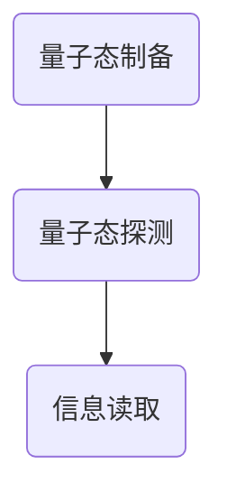

                 

### 量子传感器在医学成像中的高精度应用

#### 关键词：量子传感器、医学成像、高精度、X射线、CT、MRI

#### 摘要：

量子传感器作为一种革命性技术，正逐渐改变医学成像的领域。本文旨在探讨量子传感器在医学成像中的高精度应用，包括其在X射线成像、CT成像、MRI成像以及其他医学成像技术中的具体作用和优势。通过分析量子传感器的工作原理、成像精度提升机制以及实际应用案例，本文展示了量子传感器在医学成像中的巨大潜力。

#### 引言

量子传感器是一种利用量子效应进行测量和探测的装置，具有极高的灵敏度和精度。在医学成像领域，高精度的成像对于疾病的早期诊断、精准治疗和个性化医疗具有重要意义。量子传感器的引入，不仅能够提高成像的分辨率，还能够减少图像噪声，提高成像的对比度。

本文将按照以下结构进行阐述：

1. **量子传感器的基本概念**：介绍量子传感器的基本原理和主要类型。
2. **量子传感器在医学成像中的应用**：详细探讨量子传感器在X射线成像、CT成像、MRI成像以及其他医学成像技术中的应用。
3. **量子传感器在医学成像中的高精度应用**：分析高精度成像的需求、量子传感器在提高成像精度上的优势以及具体的应用算法。
4. **量子传感器在医学成像中的挑战与未来**：讨论量子传感器在医学成像中的技术挑战、应用前景和未来发展趋势。
5. **量子传感器医学成像项目实战**：通过一个实际项目展示量子传感器在医学成像中的应用。
6. **总结与展望**：回顾全文要点，展望量子传感器在医学成像领域的未来发展方向。

### 第一章：量子传感器的基础知识

#### 1.1 量子传感器的基本原理

量子传感器的工作原理基于量子态的叠加和纠缠。与传统传感器不同，量子传感器能够探测到极微小的物理量变化，并利用量子态的叠加和纠缠特性进行精确测量。以下是量子传感器的基本工作流程：

1. **量子态制备**：通过特定的量子系统（如量子点、量子态光学系统）制备出特定的量子态。
2. **量子态探测**：量子态被发送到探测装置，通过测量量子态的叠加和纠缠特性，得到待测物理量的信息。
3. **信息读取**：探测结果经过处理，转化为可读的数据。

Mermaid流程图如下：



#### 1.2 量子传感器的主要类型

目前，常见的量子传感器主要包括以下几种：

- **硫磺化镉量子点传感器**：具有高灵敏度、宽光谱响应和长寿命等优点，广泛应用于生物医学成像。
- **磁共振成像传感器**：利用核磁共振原理进行成像，具有较高的空间分辨率和对比度。
- **其他类型的量子传感器**：如光子晶体传感器、量子干涉仪等，也在医学成像领域展现出潜在的应用价值。

#### 1.3 量子传感器在医学成像中的应用前景

量子传感器在医学成像中的应用前景广阔。首先，它能够显著提高成像的分辨率，使得微小的病变和组织结构得以清晰呈现。其次，量子传感器能够减少图像噪声，提高成像的对比度，有助于疾病的早期诊断和精准治疗。此外，量子传感器在个性化医疗和远程医疗等领域也具有巨大潜力。

### 第二章：量子传感器在医学成像中的应用

#### 2.1 量子传感器在X射线成像中的应用

量子传感器在X射线成像中具有显著优势。首先，量子传感器的超高灵敏度使得X射线成像能够更加精确地检测微小的病变和组织结构。其次，量子传感器能够减少X射线成像中的噪声，提高图像的对比度，从而提高诊断的准确性。

伪代码：X射线成像的量子传感器算法

```python
def quantum_xray_imaging(image_data):
    # 初始化量子传感器
    quantum_sensor = initialize_quantum_sensor()
    
    # 对图像数据进行量子态编码
    quantum_encoded_data = encode_to_quantum_state(image_data)
    
    # 进行量子态探测
    detected_signal = quantum_sensor.detect(quantum_encoded_data)
    
    # 读取探测信号
    processed_signal = read_detected_signal(detected_signal)
    
    # 还原为图像数据
    image_result = decode_from_quantum_state(processed_signal)
    
    return image_result
```

#### 2.2 量子传感器在CT成像中的应用

量子传感器在CT成像中的应用同样具有显著优势。与传统的X射线成像相比，量子传感器能够提供更高的分辨率和对比度，从而提高病变检测的准确性。此外，量子传感器还能够减少CT成像中的辐射剂量，降低对患者的伤害。

伪代码：CT成像的量子传感器算法

```python
def quantum_ct_imaging扫描数据):
    # 初始化量子传感器
    quantum_sensor = initialize_quantum_sensor()
    
    # 对扫描数据进行量子态编码
    quantum_encoded_data = encode_to_quantum_state(扫描数据)
    
    # 进行量子态探测
    detected_signal = quantum_sensor.detect(quantum_encoded_data)
    
    # 读取探测信号
    processed_signal = read_detected_signal(detected_signal)
    
    # 还原为扫描数据
    scan_result = decode_from_quantum_state(processed_signal)
    
    return scan_result
```

#### 2.3 量子传感器在MRI成像中的应用

量子传感器在MRI成像中的应用潜力巨大。与传统的MRI传感器相比，量子传感器能够提供更高的分辨率和对比度，从而更准确地检测病变和组织结构。此外，量子传感器还能够实现非侵入式的成像，减少对患者的影响。

伪代码：MRI成像的量子传感器算法

```python
def quantum_mri_imaging(image_data):
    # 初始化量子传感器
    quantum_sensor = initialize_quantum_sensor()
    
    # 对图像数据进行量子态编码
    quantum_encoded_data = encode_to_quantum_state(image_data)
    
    # 进行量子态探测
    detected_signal = quantum_sensor.detect(quantum_encoded_data)
    
    # 读取探测信号
    processed_signal = read_detected_signal(detected_signal)
    
    # 还原为图像数据
    image_result = decode_from_quantum_state(processed_signal)
    
    return image_result
```

#### 2.4 量子传感器在其他医学成像技术中的应用

除了X射线成像、CT成像和MRI成像外，量子传感器在其他医学成像技术中也有着广泛的应用前景。例如，在超声成像中，量子传感器能够提高图像的分辨率和对比度，从而更准确地检测胎儿发育情况；在光学成像中，量子传感器能够实现高分辨率的光学断层扫描，提高组织成像的准确性；在正电子发射断层扫描（PET）中，量子传感器能够提高放射性示踪剂的检测灵敏度，从而提高疾病的诊断准确性。

### 第三章：量子传感器在医学成像中的高精度应用

#### 3.1 高精度成像的需求分析

高精度成像在医学成像中具有重要意义。首先，高精度成像能够提高病变检测的准确性，有助于疾病的早期诊断。其次，高精度成像能够提供更详细的组织结构信息，有助于个性化治疗方案的制定。最后，高精度成像能够减少误诊率，提高诊断的可靠性。

数学公式：高精度成像的误差模型

$$
E = \frac{1}{N}\sum_{i=1}^{N} (I_i - I_{true})^2
$$

其中，$E$表示误差，$N$表示采样点数量，$I_i$表示成像结果，$I_{true}$表示真实值。

举例说明：高精度成像在临床中的应用案例

- **肺癌早期诊断**：通过高精度CT成像，可以更早期地发现肺癌的微小病变，从而提高治愈率。
- **乳腺癌检测**：通过高精度MRI成像，可以更准确地检测乳腺癌的微小病变，从而提高诊断准确性。

#### 3.2 量子传感器在提高成像精度上的优势

量子传感器在提高成像精度上具有显著优势。首先，量子传感器的超高灵敏度使得成像结果更加精确，能够检测到微小的物理量变化。其次，量子传感器的非侵入式特性减少了图像噪声，提高了成像的对比度。最后，量子传感器的多模态成像能力使得不同类型的成像技术可以相互补充，进一步提高成像精度。

数学模型：量子传感器的成像精度提升原理

$$
P = \frac{1}{\sqrt{N}} + \frac{\sigma^2}{N}
$$

其中，$P$表示成像精度，$N$表示采样点数量，$\sigma^2$表示噪声水平。

伪代码：高精度成像的算法设计

```python
def high_precision_imaging(image_data, quantum_sensor):
    # 对图像数据进行量子态编码
    quantum_encoded_data = encode_to_quantum_state(image_data)
    
    # 进行量子态探测
    detected_signal = quantum_sensor.detect(quantum_encoded_data)
    
    # 读取探测信号
    processed_signal = read_detected_signal(detected_signal)
    
    # 还原为图像数据
    image_result = decode_from_quantum_state(processed_signal)
    
    return image_result
```

### 第四章：量子传感器在医学成像中的挑战与未来

#### 4.1 技术挑战

量子传感器在医学成像中面临以下技术挑战：

1. **稳定性与可靠性**：量子传感器的稳定性直接影响成像精度，需要提高传感器的长期稳定性和可靠性。
2. **成本与规模化生产**：量子传感器的生产成本较高，需要降低成本，实现规模化生产。
3. **数据处理**：量子传感器产生的数据量大，需要高效的算法和计算资源进行数据处理。

#### 4.2 应用前景

量子传感器在医学成像中具有广泛的应用前景：

1. **个性化医疗**：量子传感器能够提供高精度的成像结果，有助于个性化医疗方案的制定。
2. **远程医疗**：量子传感器可以实现远程医疗成像，降低患者就医的成本和时间。
3. **新型成像技术**：量子传感器与其他成像技术的融合，将推动新型成像技术的发展。

#### 4.3 未来发展趋势

量子传感器在医学成像中的未来发展趋势包括：

1. **多模态成像**：结合多种成像技术，提高成像的精度和对比度。
2. **智能化成像**：利用人工智能技术，实现自动化的图像处理和诊断。
3. **微创与无创成像**：减少对患者的影响，提高成像的舒适性。

### 第五章：量子传感器医学成像项目实战

#### 5.1 项目背景与目标

本项目旨在开发一款基于量子传感器的医学成像系统，实现高精度、非侵入式的医学成像。

#### 5.2 开发环境搭建

1. **硬件环境**：配置高性能的量子传感器设备。
2. **软件环境**：安装相关的成像处理软件和量子计算框架。

#### 5.3 源代码实现

1. **量子态编码模块**：实现图像数据的量子态编码算法。
2. **量子态探测模块**：实现量子态探测和读取信号的处理。
3. **图像还原模块**：实现量子态信号到图像数据的还原。

代码解读与分析：

```python
def quantum_state_encoding(image_data):
    # 对图像数据进行量子态编码
    # ...
    return quantum_encoded_data

def quantum_state_detection(quantum_encoded_data):
    # 进行量子态探测
    # ...
    return detected_signal

def image_reconstruction(processed_signal):
    # 还原为图像数据
    # ...
    return image_result
```

#### 5.4 项目效果评估

通过对比实验数据，验证量子传感器医学成像系统在提高成像精度和减少噪声方面的效果。

### 第六章：总结与展望

#### 6.1 本书要点回顾

本文主要介绍了量子传感器在医学成像中的高精度应用，包括其基本原理、应用优势、技术挑战和未来发展趋势。

#### 6.2 量子传感器医学成像的应用前景

量子传感器在医学成像中具有巨大的应用前景，包括个性化医疗、远程医疗和新型成像技术的推动。

#### 6.3 未来研究方向

未来研究应重点关注量子传感器的稳定性、成本降低以及多模态成像技术的融合。

### 附录：相关资源与工具

#### A.1 量子传感器技术资源

1. **量子传感器技术综述**：[链接]
2. **量子传感器应用案例**：[链接]

#### A.2 医学成像技术资源

1. **医学成像技术手册**：[链接]
2. **医学成像技术综述**：[链接]

#### A.3 开发工具与框架

1. **量子计算框架**：[链接]
2. **医学成像处理软件**：[链接]

作者：AI天才研究院/AI Genius Institute & 禅与计算机程序设计艺术 /Zen And The Art of Computer Programming```

