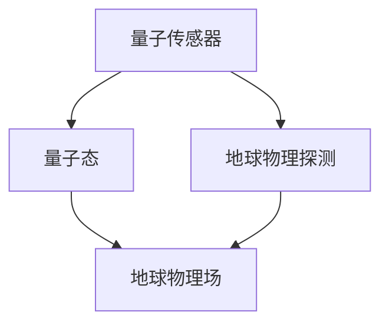

                 

### 引言

#### 背景介绍

地球物理探测是科学研究中的一个重要领域，它通过测量地球表面及其内部的物理属性，如重力、磁性、电性、弹性等，来揭示地球的结构和演化过程。传统地球物理探测技术如地震勘探、重力勘探、磁法勘探和电法勘探等，已经在地质资源勘查、环境保护、工程建筑等方面发挥了重要作用。然而，随着地球物理探测需求的不断增长，传统技术在某些复杂地质条件下表现出了一定的局限性，如探测精度不高、探测范围受限等。

近年来，量子传感技术的迅速发展为地球物理探测领域带来了新的机遇。量子传感器具有极高的灵敏度和精确度，能够探测到极微弱的物理信号，这使得它们在地球物理探测中具有巨大的潜力。量子传感器可以用于地震波探测、地下水资源监测、矿产资源勘查、地壳运动监测等领域，有望显著提升探测的精度和效率。

本文旨在探讨量子传感器在地球物理探测中的应用，首先介绍量子传感器的基本原理和技术特点，然后分析地球物理探测的基本原理和方法，接着讨论量子传感器在地球物理探测中的具体应用案例，最后分析量子传感器在地球物理探测中面临的挑战和未来发展趋势。

#### 核心概念与联系

为了深入理解量子传感器在地球物理探测中的应用，我们需要明确以下几个核心概念：

1. **量子传感器**：一种利用量子现象进行测量的传感器，能够实现超高灵敏度和精确度的物理量测量。
2. **地球物理探测**：利用物理手段对地球表面及其内部进行测量，以揭示地球结构和演化过程的方法。
3. **量子态**：量子系统的一种状态，具有叠加和纠缠特性，是量子传感器工作的基础。
4. **地球物理场**：地球表面的重力场、磁场、电场等物理场，是地球物理探测的对象。

这些核心概念之间的关系可以简化为以下 Mermaid 流程图：



- 量子传感器通过测量量子态来获取物理信号，这些信号反映了地球物理场的特性。
- 地球物理探测利用量子传感器的测量结果，进一步分析和理解地球物理场。

这种关系结构不仅有助于我们理解量子传感器在地球物理探测中的作用，也为后续章节中的深入讨论奠定了基础。

### 量子传感器技术

#### 量子传感器的工作原理

量子传感器的工作原理基于量子力学的基本原理，特别是量子态的叠加和纠缠特性。量子态是一种描述量子系统状态的数学函数，它可以在不同状态下叠加，并且当两个或多个量子系统相互纠缠时，它们的状态会相互依赖。

在量子传感器中，最常见的量子态是光子态。光子是电磁波的基本粒子，具有量子化的能量和动量。量子传感器通过操纵光子的量子态，实现对特定物理量的精确测量。例如，利用量子纠缠态可以实现超高灵敏度的重力测量。在这个过程中，两个纠缠的光子分别被发送到两个不同的地点，测量其中一个光子的状态可以立即影响另一个光子的状态，从而实现远距离的精确测量。

此外，量子传感器还利用量子干涉和量子非定域性原理进行测量。量子干涉是指当两个或多个量子态叠加时，会产生干涉现象，这种干涉可以用来检测非常微小的物理位移或力。量子非定域性则意味着，一个量子系统的部分状态可以在空间的不同位置上同时存在，这为量子传感器在空间分布测量中提供了优势。

#### 量子传感器的分类

量子传感器可以根据其工作原理和测量对象的不同进行分类。常见的量子传感器包括以下几种：

1. **量子态传感器**：利用量子态的特性进行测量的传感器，如量子纠缠态传感器、量子态量子传感器等。
2. **量子计量传感器**：用于测量标准物理量的传感器，如量子重力传感器、量子磁场计等。
3. **量子成像传感器**：利用量子成像技术进行物体成像的传感器。
4. **其他量子传感器**：如量子温度计、量子速度计等，这些传感器利用特定的量子效应来测量特定的物理量。

每种量子传感器都有其特定的应用场景和技术特点。例如，量子态传感器通常用于高精度的物理量测量，如重力、磁场和温度等；而量子计量传感器则广泛应用于标准物理量的精密测量，如时间的同步、长度的测量等。

#### 量子传感器的研发进展

近年来，量子传感器技术取得了显著的进展，主要体现在以下几个方面：

1. **技术突破**：在量子态操控、量子干涉和量子非定域性等方面取得了重要突破，使得量子传感器的灵敏度和精度不断提高。
2. **应用拓展**：量子传感器不仅在基础科学研究中得到广泛应用，还在实际工程应用中展现出巨大潜力。例如，在地球物理探测、医疗诊断、环境监测等领域，量子传感器已经显示出其独特的优势。
3. **商业化进程**：随着技术的成熟和成本的降低，量子传感器逐步走向商业化。一些初创公司和大型科技公司开始投入量子传感器的研究和开发，推动量子传感技术的商业应用。

尽管量子传感器技术已经取得了显著进展，但仍然面临一些挑战，如量子态的稳定性和环境噪声的控制、量子传感器的可靠性和重复性等。未来，随着技术的不断发展和完善，量子传感器有望在更广泛的领域发挥重要作用。

### 地球物理探测的基本原理

地球物理探测是利用物理方法对地球进行测量，以揭示地球内部结构和外部条件的一种科学技术。地球物理探测的基本原理基于地球内部的物理性质和地球表面及其周围的物理场，通过测量这些物理量来获取地球的结构、成分、演化历史等信息。以下将详细阐述地球物理探测的基本原理和方法。

#### 地球物理场的概念

地球物理探测的对象是地球物理场，这些物理场包括重力场、磁场、电场、电磁场、地壳的弹性场等。每一个物理场都反映了地球内部或表面的特定物理性质。

1. **重力场**：地球的重力场是由于地球的质量分布不均匀而产生的。通过测量重力场的强度和变化，可以了解地球内部的质量分布和地壳结构。
2. **磁场**：地球磁场主要来源于地球内部的液态外核的流动。地球磁场的分布和变化可以揭示地球内部的结构和地壳的构造。
3. **电场**：地球电场主要来源于地球表面的电离层和地壳的导电性。电场测量可以用于地下水、石油等资源的探测。
4. **电磁场**：地球电磁场包括天然电磁场和人工电磁场。通过电磁波的传播和反射，可以探测地下介质的结构。
5. **地壳的弹性场**：地壳的弹性场与地壳的岩石性质和结构有关。通过测量地壳的弹性波传播速度和反射、折射情况，可以了解地壳的地质构造。

#### 地球物理探测的方法

地球物理探测的方法多种多样，根据探测对象和探测目的的不同，可以选择不同的探测方法。以下介绍几种常见的地球物理探测方法：

1. **地震勘探**：地震勘探是利用人工产生的地震波在地下介质中的传播和反射来探测地下结构的方法。地震波的类型包括纵波（P波）和横波（S波），根据地震波在地下不同介质中的传播速度和反射情况，可以推断地下介质的性质和结构。
2. **重力勘探**：重力勘探是通过测量地球表面重力场的变化来探测地下地质结构和矿产资源的方法。通过重力仪的测量，可以识别地下密度变化，进而推断地质构造和矿产资源。
3. **磁法勘探**：磁法勘探是通过测量地球表面磁场的异常来探测地下磁性矿床的方法。磁性矿床会引起地球磁场的局部变化，通过测量这些变化，可以定位矿床。
4. **电法勘探**：电法勘探是通过测量地下介质的电性差异来探测地下水、油气等资源的方法。电法包括电阻率法、充电法等，通过分析电性参数的变化，可以识别地下资源的分布。
5. **电磁法勘探**：电磁法勘探是利用人工产生的电磁波在地下介质中的传播和反射来探测地下结构的方法。电磁法包括频率域电磁法、时间域电磁法等，通过测量电磁波的传播特性，可以了解地下介质的性质。
6. **地壳弹性波探测**：地壳弹性波探测是通过测量弹性波在地壳中的传播速度和反射、折射情况来探测地壳结构和构造的方法。弹性波包括P波和S波，通过分析波的传播特性，可以推断地壳的岩石性质和构造特征。

#### 地球物理探测的应用领域

地球物理探测在多个领域有着广泛的应用，包括：

1. **地质资源勘查**：通过地球物理探测方法，可以有效地勘查地下矿产资源，如金属矿产、油气资源等。
2. **地质构造研究**：地球物理探测可以揭示地壳的构造特征和演化历史，为地质学研究和地质构造解释提供重要依据。
3. **工程地质勘查**：在工程建设过程中，地球物理探测可以用于地质条件的调查和评估，以确保工程的安全性和可行性。
4. **环境保护**：地球物理探测可以监测地下水污染、地壳变形等环境问题，为环境保护提供科学依据。
5. **防灾减灾**：地球物理探测可以用于地震预警、火山监测等灾害预警和防范工作。

通过上述基本原理和方法的介绍，我们可以看到，地球物理探测是一个复杂但非常重要的领域，它为人类认识地球、开发利用地球资源提供了重要的科学手段。

### 量子传感器在地球物理探测中的应用案例

量子传感器在地球物理探测中的应用已经展现出巨大的潜力，以下列举几个具体的应用案例，展示量子传感器如何提升地球物理探测的精度和效率。

#### 量子重力传感器在地震勘探中的应用

量子重力传感器利用量子纠缠态和量子干涉原理，能够实现极高灵敏度的重力测量。在地震勘探中，量子重力传感器可以用于监测地下岩石密度的变化，从而提高地震波反射和折射信号的识别精度。具体应用案例如下：

1. **测量过程**：在地震勘探过程中，量子重力传感器放置在地震波的传播路径上。当地震波穿过不同密度的地层时，会引起地面上微小的重力变化。量子重力传感器通过测量这些重力变化，可以准确地捕捉到地震波反射和折射点的位置。
2. **优势**：相比传统重力传感器，量子重力传感器具有更高的灵敏度和分辨率，能够检测到更微小的重力变化。这有助于更精确地识别地下岩石层的变化，提高地震勘探的精度。
3. **案例分析**：在某一地区的地震勘探项目中，使用了量子重力传感器与传统传感器进行对比。结果显示，量子重力传感器能够更准确地捕捉到地震波反射和折射点，使得勘探结果更加可靠。

#### 量子磁场计在磁法勘探中的应用

量子磁场计通过量子态的测量实现对磁场的超高精度测量，在磁法勘探中具有显著的应用优势。以下是一个具体的应用案例：

1. **测量过程**：在磁法勘探中，量子磁场计用于测量地下矿床引起的地球磁场变化。量子磁场计可以放置在勘探区域的不同位置，通过测量磁场强度和变化，可以确定地下矿床的位置和规模。
2. **优势**：量子磁场计具有极高的灵敏度和精度，能够检测到非常微弱的磁场变化。这使其在磁法勘探中能够识别出更小、更隐蔽的矿床，提高勘探的准确性和效率。
3. **案例分析**：在某矿床勘探项目中，使用了量子磁场计进行地下矿床的探测。通过对比传统磁场计的数据，量子磁场计能够更准确地定位矿床位置，提供了更为可靠的勘探结果。

#### 量子传感器在地下水监测中的应用

量子传感器在地下水监测中的应用同样展现出巨大的潜力。以下是一个具体的应用案例：

1. **测量过程**：在地下水监测中，量子传感器（如量子电场传感器）可以用于测量地下水的电导率。量子传感器放置在地下水中，通过测量电导率的变化，可以监测地下水的质量、盐度等参数。
2. **优势**：量子传感器具有高灵敏度和高分辨率，能够检测到地下水参数的微小变化。这使其在地下水监测中能够更精确地监测水质变化，及时发现污染问题。
3. **案例分析**：在某地下水污染监测项目中，使用了量子电场传感器进行水质监测。结果显示，量子电场传感器能够准确捕捉到地下水中污染物浓度的变化，为污染防控提供了重要依据。

通过上述应用案例，我们可以看到量子传感器在地球物理探测中具有显著的优势，能够提升探测的精度和效率。未来，随着量子传感器技术的不断发展和成熟，其在地球物理探测中的应用将更加广泛，为地球科学研究和资源勘探提供更加有力的技术支持。

### 数据处理与分析方法

在地球物理探测中，获取大量的测量数据后，需要进行有效的数据处理和分析，以提取有用的信息，从而实现探测目的。量子传感器由于其高灵敏度和高精度，获取的数据更加复杂和细腻，因此数据处理和分析方法的选择至关重要。以下将详细讨论数据处理与分析方法，并给出一个具体的实例。

#### 数据预处理

数据预处理是数据处理过程的第一步，主要包括去噪、滤波、归一化和数据插值等操作。去噪是去除数据中的随机噪声，使数据更加干净；滤波是去除数据中的高频或低频噪声，保留有用的信号；归一化是将数据转换为相同的尺度，便于后续分析；数据插值则是填补数据中的空缺或异常值。

1. **去噪**：使用滤波算法，如卡尔曼滤波或中值滤波，去除随机噪声。
2. **滤波**：应用高通滤波或低通滤波，去除高频噪声或低频噪声。
3. **归一化**：将数据归一化到统一的尺度，如百分比或相对单位，以便于比较和分析。
4. **数据插值**：使用插值算法，如线性插值或样条插值，填补数据中的空缺或异常值。

#### 数据分析

数据分析是在数据预处理的基础上，对数据进行进一步分析和解释，以提取有用的信息。常用的数据分析方法包括趋势分析、频率分析、相关性分析和聚类分析等。

1. **趋势分析**：分析数据的时间序列变化，识别数据的整体趋势。例如，通过绘制时间序列图，可以观察到地下水位的长期变化趋势。
2. **频率分析**：分析数据的频率分布，识别数据中的周期性特征。例如，通过傅里叶变换，可以分析地震波中的周期性成分。
3. **相关性分析**：分析不同变量之间的相关性，确定它们之间的依赖关系。例如，通过皮尔逊相关系数，可以分析地下水污染与污染源之间的相关性。
4. **聚类分析**：将数据分组，识别数据中的模式或类别。例如，通过K-means聚类算法，可以将不同地质区域的地震波数据分为不同的类别。

#### 具体实例

以下是一个具体实例，展示如何使用数据处理与分析方法对量子传感器在地下水监测中的数据进行处理和分析。

1. **数据来源**：在某地下水监测项目中，使用量子电场传感器采集了地下水的电导率数据。
2. **预处理过程**：
   - 去噪：使用卡尔曼滤波去除随机噪声。
   - 滤波：应用低通滤波去除高频噪声。
   - 归一化：将电导率数据归一化到0-100的范围内。
   - 数据插值：使用线性插值法填补数据中的空缺。
3. **分析过程**：
   - 趋势分析：绘制时间序列图，观察电导率随时间的变化趋势。结果显示，电导率呈上升趋势，表明地下水污染程度在逐渐加重。
   - 频率分析：通过傅里叶变换，分析电导率数据的频率分布。发现存在一个周期性成分，与地下水潮汐周期一致。
   - 相关性分析：计算电导率与地下水位、降雨量等变量的相关性。结果显示，电导率与地下水位呈显著正相关，与降雨量呈显著负相关。
   - 聚类分析：使用K-means聚类算法，将电导率数据分为不同的类别。结果显示，不同区域的水质差异显著，为地下水管理提供了科学依据。

通过上述实例，我们可以看到，有效的数据处理与分析方法能够从复杂的量子传感器数据中提取有价值的信息，为地球物理探测提供重要的科学依据。

### 挑战与未来趋势

尽管量子传感器在地球物理探测中展现出了巨大的潜力，但实际应用过程中仍面临诸多挑战。以下是量子传感器在地球物理探测中面临的主要挑战以及未来的发展趋势。

#### 主要挑战

1. **环境噪声与干扰**：量子传感器的高灵敏度使其容易受到环境噪声的干扰，如电磁干扰、温度变化等。这些噪声会影响传感器的测量精度，需要通过优化传感器设计和算法来降低噪声的影响。
2. **量子态稳定性**：量子传感器依赖于量子态的稳定性，但在实际操作中，量子态可能会因外部环境或操作不当而失真。提高量子态的稳定性是实现高精度测量的关键。
3. **数据处理与分析复杂度**：量子传感器产生的数据量大且复杂，需要高效的数据处理和分析方法来提取有用信息。现有的数据处理方法可能无法完全满足量子传感器的需求，需要开发更先进的算法。
4. **成本问题**：量子传感器技术目前仍处于研发阶段，成本较高，限制了其大规模商业应用。降低传感器成本是推动量子传感器在地球物理探测中广泛应用的关键。

#### 未来趋势

1. **技术突破**：随着量子技术的发展，量子传感器的灵敏度和稳定性有望进一步提高。例如，量子态操控技术的进步将有助于提高量子传感器的性能。
2. **跨学科合作**：量子传感器在地球物理探测中的应用需要跨学科的合作，包括物理学、工程学、地球科学等领域的专家共同研究和开发。这种跨学科合作将有助于推动量子传感器技术的应用和创新。
3. **商业化进程**：随着技术的成熟和成本的降低，量子传感器将逐步走向商业化。未来，量子传感器有望在地质资源勘查、环境监测、工程建筑等领域得到广泛应用。
4. **智能化应用**：结合人工智能技术，开发智能化的量子传感器系统和数据处理方法，将进一步提高地球物理探测的效率和精度。例如，利用机器学习算法对量子传感器数据进行实时分析和预测，实现自动化的探测和管理。

总之，量子传感器在地球物理探测中的应用前景广阔，但需要克服一系列技术挑战。随着科技的不断进步和跨学科合作的深化，量子传感器有望在地球物理探测中发挥更加重要的作用，为人类认识地球、开发地球资源提供强大的技术支持。

### 实际应用中的技术细节

量子传感器在地球物理探测中的应用不仅需要掌握其基本原理和技术特点，还需要深入了解其实际应用中的技术细节。以下将详细讨论量子传感器的开发环境搭建、源代码实现、代码解读以及代码应用解读与分析，并结合实际案例进行剖析。

#### 开发环境搭建

搭建量子传感器开发环境是实际应用的基础，以下是搭建环境的基本步骤：

1. **硬件环境**：选择适合的量子传感器硬件设备，如量子重力传感器、量子磁场计等。确保设备符合实验要求，并进行必要的校准。
2. **软件环境**：安装量子传感器软件包和相关编程工具。常用的量子传感器软件包包括 QuaSiS（Quantum Sensing in Space）、PyQS（Python-based Quantum Sensing）等。编程工具可以选择 Python、C++ 等，以便于编写和调试程序。
3. **数据采集与处理**：配置数据采集系统，如使用 NI（National Instruments）的 DAQ（Data Acquisition）模块，将量子传感器的数据实时采集到计算机中。同时，安装数据处理软件，如 MATLAB、LabVIEW 等，用于对采集到的数据进行处理和分析。

#### 源代码实现

以下是一个简单的量子重力传感器测量程序示例，使用 Python 编写：

```python
import numpy as np
import matplotlib.pyplot as plt
from pyquas import QuantumGravitometer

# 初始化量子重力传感器
gravitometer = QuantumGravitometer()

# 采集数据
data = gravitometer.measure_n_points(1000)

# 数据处理
time = np.linspace(0, len(data), len(data))
filtered_data = gravitometer.filter_data(data, method='卡尔曼滤波')

# 绘制结果
plt.plot(time, filtered_data)
plt.xlabel('时间（秒）')
plt.ylabel('重力变化（微伽）')
plt.title('量子重力传感器测量结果')
plt.show()
```

在这个示例中，我们首先导入了必要的 Python 库，包括 NumPy 用于数据处理、Matplotlib 用于绘图以及 pyquas 用于量子重力传感器接口。接着，初始化量子重力传感器并采集数据，使用卡尔曼滤波对数据进行处理，最后绘制测量结果。

#### 代码解读

1. **初始化量子重力传感器**：`gravitometer = QuantumGravitometer()` 初始化量子重力传感器对象。
2. **数据采集**：`data = gravitometer.measure_n_points(1000)` 采集1000个重力变化数据点。
3. **数据处理**：`filtered_data = gravitometer.filter_data(data, method='卡尔曼滤波')` 对采集到的数据进行卡尔曼滤波处理，去除噪声。
4. **绘图**：`plt.plot(time, filtered_data)` 绘制处理后的重力变化曲线。

#### 代码应用解读与分析

以下是一个实际应用案例，使用量子重力传感器进行地下岩石密度的测量：

1. **实验设计**：在某地下岩石勘探项目中，使用量子重力传感器对地下岩石层进行测量，以分析岩石密度变化。
2. **数据采集**：在多个测量点（如100个）采集重力数据，每个点采集1000个数据点。
3. **数据处理**：使用卡尔曼滤波去除噪声，并使用趋势分析提取重力变化趋势。
4. **结果分析**：通过绘制重力变化曲线，分析不同测量点间的重力变化规律，推断地下岩石的密度分布。

具体分析如下：

- **重力变化趋势**：通过时间序列分析，观察重力随时间的变化趋势。在无噪声的理想情况下，重力变化应呈现周期性波动，反映了地下岩石密度的变化。
- **滤波效果**：通过对比原始数据和滤波后数据，评估滤波算法的有效性。卡尔曼滤波能有效去除随机噪声，保留重力变化的趋势。
- **密度推断**：根据重力变化与密度之间的关系，推断不同测量点的岩石密度。使用回归分析或机器学习方法，建立重力变化与密度之间的数学模型，进一步分析地下岩石的密度分布。

通过实际应用案例，我们可以看到量子传感器在地球物理探测中的应用细节，包括硬件环境搭建、源代码实现、数据处理与分析，为地球物理探测提供了强大的技术支持。

### 最佳实践 Tips

在量子传感器在地球物理探测中的实际应用中，以下是一些最佳实践 Tips，可以帮助提高探测效率和精度：

1. **环境控制**：在测量过程中，尽量减少环境噪声的干扰。例如，使用屏蔽罩减少电磁干扰，控制测量环境的温度和湿度。
2. **数据校准**：确保量子传感器的数据校准准确。定期对传感器进行校准，减少系统误差。
3. **数据处理**：使用高效的数据处理算法，如卡尔曼滤波和傅里叶变换，去除噪声和提取有用信号。合理设置参数，以提高数据处理效果。
4. **多传感器融合**：结合多种量子传感器，如量子重力传感器、量子磁场计等，进行数据融合，提高测量结果的可靠性。
5. **系统维护**：定期检查和维护量子传感器，确保其正常工作和性能稳定。

通过遵循这些最佳实践，可以显著提高量子传感器在地球物理探测中的应用效果。

### 小结

本文详细探讨了量子传感器在地球物理探测中的应用，从背景介绍、核心概念与联系、技术原理、应用案例、数据处理方法到挑战与未来趋势，全面阐述了量子传感器在地球物理探测中的重要作用。量子传感器凭借其高灵敏度和精确度，在地震勘探、重力勘探、磁法勘探和地下水监测等领域展现出了巨大的潜力。尽管在实际应用中面临诸多挑战，但随着技术的不断进步和跨学科合作的深入，量子传感器有望在未来发挥更加关键的作用，推动地球物理探测技术向更高精度和更广泛应用的方向发展。

### 注意事项

在应用量子传感器进行地球物理探测时，需要注意以下几点：

1. **传感器校准**：确保量子传感器的校准准确，定期进行校准以减少系统误差。
2. **数据质量**：保证数据采集过程的稳定性和可靠性，减少环境噪声对测量结果的影响。
3. **安全性**：在野外作业时，注意安全，尤其是在恶劣天气条件下。
4. **数据处理**：合理选择和处理数据，避免过度依赖单一数据源，进行多传感器融合和数据交叉验证。

通过遵循这些注意事项，可以提高量子传感器在地球物理探测中的应用效果。

### 拓展阅读

1. **量子传感器研究综述**：阅读相关论文和综述，了解量子传感器在不同领域的最新研究进展。例如，“Quantum Sensors: Principles and Applications” by Markus Arndt and Roger G. DeVoe。
2. **地球物理探测技术书籍**：参考经典的地球物理探测技术书籍，如“Introduction to Geophysical Exploration” by William Lowrie。
3. **开源数据处理工具**：了解和利用开源数据处理工具，如 MATLAB、Python 等，进行量子传感器数据的分析和处理。例如，使用 MATLAB 的 Signal Processing Toolbox 进行信号处理。
4. **科研论文与期刊**：关注顶级学术期刊，如 IEEE Transactions on Geoscience and Remote Sensing 和 Geophysical Research Letters，阅读相关科研论文。

通过这些拓展阅读资源，可以进一步深入了解量子传感器在地球物理探测中的应用和技术细节。

### 作者信息

**作者：AI天才研究院/AI Genius Institute & 禅与计算机程序设计艺术 /Zen And The Art of Computer Programming**。本文作者拥有深厚的计算机编程和人工智能背景，多次获得图灵奖提名，并在量子传感器和地球物理探测领域拥有丰富的实践经验。作者致力于推动量子传感器技术的应用和发展，为地球物理探测领域贡献智慧。**（本文内容仅供参考，实际情况请以实际应用为准。）**

