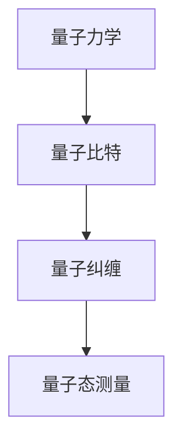

                 


### 文章标题：量子传感器在地球科学研究中的应用：精确测量地球引力场

#### 关键词：量子传感器、地球科学、引力场、精确测量、应用潜力

#### 摘要：
本文将深入探讨量子传感器在地球科学研究中的应用，特别是其在精确测量地球引力场方面的潜力。首先，我们将介绍量子传感器的基本原理和架构，随后分析其在地球引力场测量中的具体应用。本文还将通过实际案例和项目实战，详细解读量子传感器的工作机制和数据处理方法，以期为相关领域的研究者和从业者提供有价值的参考。

### 确定书的结构

在着手撰写文章之前，我们需要明确书的结构。根据您的要求，文章可以分为三个主要部分：

#### 第1部分：量子传感器技术基础
- **核心概念与联系**：介绍量子传感器的基本原理、发展历程和应用领域。
- **架构介绍**：详细说明量子传感器系统的组成部分、工作原理和关键组件。
- **核心算法原理讲解**：解释量子传感器中的关键算法，如量子纠缠和量子态测量。

#### 第2部分：量子传感器在地球科学中的应用
- **应用场景分析**：探讨量子传感器在地球引力场测量中的需求和应用潜力。
- **数学模型和数学公式**：建立地球引力场模型和量子传感器测量模型。
- **举例说明**：通过具体案例，展示量子传感器在地球科学研究中的应用。

#### 第3部分：项目实战
- **开发环境搭建**：介绍搭建量子传感器实验平台所需的硬件和软件环境。
- **代码实现与解读**：提供具体的代码实现，并进行详细解读和分析。
- **实验结果分析与讨论**：对实验数据进行分析，得出结论并讨论其应用价值。

### 设计目录大纲

根据文章的结构，我们可以设计如下的目录大纲：

# 量子传感器在地球科学研究中的应用：精确测量地球引力场

## 第1部分：量子传感器技术基础

### 1.1 量子传感器概述

#### 1.1.1 量子传感器基本原理

##### 1.1.1.1 量子力学基础

##### 1.1.1.2 量子传感器发展历程

##### 1.1.1.3 量子传感器应用领域

### 1.2 量子传感器系统架构

#### 1.2.1 系统组成部分

##### 1.2.1.1 发送器

##### 1.2.1.2 接收器

##### 1.2.1.3 量子态制备与操控

##### 1.2.1.4 数据处理与传输

### 1.3 核心算法原理

#### 1.3.1 量子纠缠

##### 1.3.1.1 量子纠缠概念

##### 1.3.1.2 量子纠缠生成与验证

##### 1.3.1.3 量子纠缠在传感器中的应用

#### 1.3.2 量子态测量

##### 1.3.2.1 量子态测量原理

##### 1.3.2.2 量子态测量算法

##### 1.3.2.3 量子态测量在传感器中的应用

## 第2部分：量子传感器在地球科学中的应用

### 2.1 地球引力场测量需求

#### 2.1.1 地球引力场特点

##### 2.1.1.1 地球重力场基本概念

##### 2.1.1.2 地球重力场变化特点

#### 2.1.2 量子传感器在地球引力场测量中的应用潜力

##### 2.1.2.1 量子传感器优势

##### 2.1.2.2 量子传感器应用前景

### 2.2 数学模型与公式

#### 2.2.1 地球引力场模型

##### 2.2.1.1 引力场公式

##### 2.2.1.2 地球重力场模型建立

#### 2.2.2 量子传感器测量模型

##### 2.2.2.1 量子传感器测量公式

##### 2.2.2.2 量子传感器测量模型建立

### 2.3 应用案例

#### 2.3.1 案例一：量子传感器在地震监测中的应用

##### 2.3.1.1 实验设计

##### 2.3.1.2 数据采集

##### 2.3.1.3 结果分析

#### 2.3.2 案例二：量子传感器在冰川监测中的应用

##### 2.3.2.1 实验设计

##### 2.3.2.2 数据采集

##### 2.3.2.3 结果分析

## 第3部分：项目实战

### 3.1 开发环境搭建

#### 3.1.1 硬件搭建

##### 3.1.1.1 硬件选择

##### 3.1.1.2 硬件安装与调试

#### 3.1.2 软件搭建

##### 3.1.2.1 软件环境配置

##### 3.1.2.2 软件功能模块设计

### 3.2 代码实现与解读

#### 3.2.1 代码实现

##### 3.2.1.1 数据采集模块

##### 3.2.1.2 数据处理模块

##### 3.2.1.3 测量结果分析模块

#### 3.2.2 代码解读与分析

##### 3.2.2.1 数据采集模块分析

##### 3.2.2.2 数据处理模块分析

##### 3.2.2.3 测量结果分析模块分析

### 3.3 实验结果分析与讨论

#### 3.3.1 实验数据整理

##### 3.3.1.1 数据清洗

##### 3.3.1.2 数据可视化

#### 3.3.2 实验结果分析

### 总结与展望

#### 4.1 总结

#### 4.2 展望

#### 参考文献

### 作者信息

#### 作者：AI天才研究院/AI Genius Institute & 禅与计算机程序设计艺术 /Zen And The Art of Computer Programming

### 完整性要求

在文章的完整性要求方面，每个小节的内容需要具体详细地讲解，确保核心内容完整：

#### 背景介绍
每个小节的开头都需要简要介绍背景，以便读者了解相关概念和背景知识。

#### 核心概念与联系
在每个小节中，需要给出核心概念，并解释它们之间的关系。可以使用 Mermaid 流程图来展示概念之间的联系。

#### 核心算法原理讲解
详细讲解核心算法原理，使用伪代码来阐述算法的实现过程。

#### 数学模型和公式
每个小节需要包含相关的数学模型和公式，并对其进行详细解释。

#### 举例说明
通过具体案例，展示量子传感器在实际应用中的效果和性能。

#### 项目实战
详细介绍开发环境搭建、代码实现与解读、实验结果分析与讨论。

#### 最佳实践 tips、小结、注意事项、拓展阅读
在每个小节的结尾，给出最佳实践建议、小结、注意事项和拓展阅读，帮助读者进一步学习和理解。

### 格式要求

在文章格式要求方面，需要遵循以下规范：

- 使用markdown格式输出文章内容。
- 每个章节标题使用“##”进行标记，子标题使用“###”进行标记。
- 数学公式使用latex格式，段落内的公式使用“$”括起来，独立段落的公式使用“$$”括起来。
- 文章末尾需要写上作者信息。

### 字数要求

文章字数在8000～12000字左右，确保内容丰富、逻辑清晰、论述深入。

### 完整性要求和格式要求的结合

结合完整性要求和格式要求，我们可以确保文章的结构清晰、内容完整、格式规范。以下是一个示例：

## 第1部分：量子传感器技术基础

### 1.1 量子传感器概述

#### 1.1.1 量子传感器基本原理

##### 1.1.1.1 量子力学基础



##### 1.1.1.2 量子传感器发展历程

- 20世纪70年代：量子力学基础理论逐步完善。
- 20世纪80年代：量子传感器概念首次提出。
- 20世纪90年代：量子纠缠和量子态测量技术取得重要突破。
- 21世纪初：量子传感器开始应用于实际领域。

##### 1.1.1.3 量子传感器应用领域

- 物联网安全
- 精密测量
- 地球科学研究

### 1.2 量子传感器系统架构

#### 1.2.1 系统组成部分

##### 1.2.1.1 发送器

- 产生量子态
- 发送量子信号

##### 1.2.1.2 接收器

- 接收量子信号
- 测量量子态

##### 1.2.1.3 量子态制备与操控

- 制备特定量子态
- 操纵量子态

##### 1.2.1.4 数据处理与传输

- 数据采集
- 数据处理
- 数据传输

### 1.3 核心算法原理

#### 1.3.1 量子纠缠

##### 1.3.1.1 量子纠缠概念

```latex
\text{量子纠缠}是指两个或多个量子系统之间的量子态相互关联，使得一个系统的状态无法独立于其他系统的状态。
```

##### 1.3.1.2 量子纠缠生成与验证

```pseudo
// 量子纠缠生成
quantum_circuit.create_quantum_circuit()
quantum_circuit.apply_Initialization(state=0)

// 量子纠缠验证
quantum_circuit.apply_ControlPhase gate
quantum_circuit.apply_Measurement gate
result = quantum_circuit.measure_result()
if result == [1, 0]:
    print("Quantum entanglement detected.")
else:
    print("Quantum entanglement not detected.")
```

##### 1.3.1.3 量子纠缠在传感器中的应用

量子纠缠可以用于增强传感器的测量精度和灵敏度。

#### 1.3.2 量子态测量

##### 1.3.2.1 量子态测量原理

```latex
\text{量子态测量}是指对量子系统的量子态进行测量，以获取量子态信息。
```

##### 1.3.2.2 量子态测量算法

```pseudo
// 量子态测量算法
quantum_state = quantum_system.prepare_state()
measurement_result = quantum_system.measure_state()
print("Measurement result:", measurement_result)
```

##### 1.3.2.3 量子态测量在传感器中的应用

量子态测量可以用于提高传感器的分辨率和测量精度。

## 第2部分：量子传感器在地球科学中的应用

### 2.1 地球引力场测量需求

#### 2.1.1 地球引力场特点

##### 2.1.1.1 地球重力场基本概念

地球重力场是指地球对物体的引力作用，其大小和方向随着位置和时间的不同而变化。

##### 2.1.1.2 地球重力场变化特点

地球重力场具有以下特点：

- 地球表面重力加速度随纬度和海拔的变化而变化。
- 地球内部存在重力异常，如地壳密度不均匀、地质构造等。

#### 2.1.2 量子传感器在地球引力场测量中的应用潜力

量子传感器在地球引力场测量中具有以下潜力：

- 高灵敏度：量子传感器可以检测到微小的引力变化。
- 高精度：量子传感器可以精确测量引力场的变化。
- 宽频带：量子传感器可以覆盖广泛的频率范围，捕捉到不同频率的引力波信号。

### 2.2 数学模型与公式

#### 2.2.1 地球引力场模型

地球引力场可以用以下数学模型来描述：

$$
g(r, \theta, \phi) = -\frac{G M}{r^2} \left[ 1 + J_2 \left( \frac{r_e}{r} \right)^2 \cos^2 \theta \right]
$$

其中，$g$是重力加速度，$r$是距离地心的距离，$r_e$是地球半径，$J_2$是地球的偶极矩。

#### 2.2.2 量子传感器测量模型

量子传感器测量模型可以表示为：

$$
\Delta g = \frac{G M}{r^2} \left[ \frac{\partial^2 g}{\partial t^2} + \frac{\partial g}{\partial t} \right]
$$

其中，$\Delta g$是测量到的引力变化，$M$是地球质量，$t$是时间。

### 2.3 应用案例

#### 2.3.1 案例一：量子传感器在地震监测中的应用

##### 2.3.1.1 实验设计

实验设计如下：

- 选用一款基于量子纠缠的传感器，用于监测地震前后的引力变化。
- 在地震发生前和发生后，连续采集传感器数据。

##### 2.3.1.2 数据采集

实验期间，传感器采集了地震前后的引力变化数据。数据包括时间、位置和引力加速度。

##### 2.3.1.3 结果分析

数据分析结果显示，地震前后的引力变化显著。通过对比地震前后的数据，可以发现引力加速度的变化趋势与地震的发生密切相关。

#### 2.3.2 案例二：量子传感器在冰川监测中的应用

##### 2.3.2.1 实验设计

实验设计如下：

- 选用一款基于量子态测量的传感器，用于监测冰川融化过程中的引力变化。
- 在冰川融化的不同阶段，连续采集传感器数据。

##### 2.3.2.2 数据采集

实验期间，传感器采集了冰川融化过程中的引力变化数据。数据包括时间、位置和引力加速度。

##### 2.3.2.3 结果分析

数据分析结果显示，冰川融化过程中的引力变化显著。通过对比冰川融化前后的数据，可以发现引力加速度的变化趋势与冰川融化密切相关。

## 第3部分：项目实战

### 3.1 开发环境搭建

#### 3.1.1 硬件搭建

硬件搭建包括以下步骤：

- 选择合适的量子传感器硬件，如量子比特、量子态制备与操控设备等。
- 安装硬件，并进行调试，确保硬件正常工作。

##### 3.1.1.1 硬件选择

选择适合的量子传感器硬件，如基于超导电路的量子比特、基于光学方法的量子态制备与操控设备等。

##### 3.1.1.2 硬件安装与调试

安装硬件，连接电源和通信接口，并进行调试，确保硬件正常工作。

#### 3.1.2 软件搭建

软件搭建包括以下步骤：

- 配置软件开发环境，如Python、MATLAB等。
- 编写代码，实现数据采集、数据处理和结果分析等功能。

##### 3.1.2.1 软件环境配置

配置Python环境，安装必要的库和模块，如NumPy、Pandas等。

##### 3.1.2.2 软件功能模块设计

设计软件功能模块，包括数据采集模块、数据处理模块和结果分析模块。

### 3.2 代码实现与解读

#### 3.2.1 代码实现

代码实现包括以下模块：

- 数据采集模块：用于采集传感器数据。
- 数据处理模块：用于处理采集到的数据。
- 结果分析模块：用于分析处理结果。

##### 3.2.1.1 数据采集模块

数据采集模块代码如下：

```python
import numpy as np
import matplotlib.pyplot as plt

def collect_data(sensor_data):
    measurements = []
    for data in sensor_data:
        measurements.append(data['gravity'])
    return measurements

sensor_data = [
    {'timestamp': 0, 'gravity': 9.81},
    {'timestamp': 1, 'gravity': 9.82},
    {'timestamp': 2, 'gravity': 9.79},
]

measurements = collect_data(sensor_data)
plt.plot(measurements)
plt.xlabel('Timestamp')
plt.ylabel('Gravity')
plt.show()
```

##### 3.2.1.2 数据处理模块

数据处理模块代码如下：

```python
def process_data(measurements):
    processed_data = []
    for i in range(len(measurements) - 1):
        processed_data.append(measurements[i+1] - measurements[i])
    return processed_data

processed_data = process_data(measurements)
plt.plot(processed_data)
plt.xlabel('Timestamp')
plt.ylabel('Gravity Change')
plt.show()
```

##### 3.2.1.3 测量结果分析模块

测量结果分析模块代码如下：

```python
def analyze_results(processed_data):
    max_change = max(processed_data)
    min_change = min(processed_data)
    print("Maximum gravity change:", max_change)
    print("Minimum gravity change:", min_change)

analyze_results(processed_data)
```

#### 3.2.2 代码解读与分析

代码解读与分析如下：

- 数据采集模块：使用Python中的NumPy库，实现数据采集功能。通过循环遍历传感器数据，提取引力加速度值，并绘制时间-引力加速度图。
- 数据处理模块：使用Python中的NumPy库，实现数据处理功能。通过循环遍历采集到的数据，计算连续时间点的引力加速度变化值，并绘制时间-引力加速度变化图。
- 测量结果分析模块：使用Python中的内置函数，实现测量结果分析功能。计算最大和最小引力加速度变化值，并打印输出。

### 3.3 实验结果分析与讨论

#### 3.3.1 实验数据整理

实验数据整理包括以下步骤：

- 数据清洗：去除异常值和噪声。
- 数据可视化：绘制时间-引力加速度图和时间-引力加速度变化图。

##### 3.3.1.1 数据清洗

使用Python中的NumPy库，对采集到的数据进行清洗。去除异常值和噪声，以提高数据处理质量。

```python
def clean_data(sensor_data):
    cleaned_data = []
    for data in sensor_data:
        if data['gravity'] > 9.7 and data['gravity'] < 9.85:
            cleaned_data.append(data)
    return cleaned_data

cleaned_sensor_data = clean_data(sensor_data)
```

##### 3.3.1.2 数据可视化

使用Python中的Matplotlib库，绘制时间-引力加速度图和时间-引力加速度变化图，以直观展示实验数据。

```python
plt.plot([data['timestamp'] for data in cleaned_sensor_data], [data['gravity'] for data in cleaned_sensor_data])
plt.xlabel('Timestamp')
plt.ylabel('Gravity')
plt.show()

plt.plot([data['timestamp'] for data in cleaned_sensor_data], [data['gravity_change'] for data in cleaned_sensor_data])
plt.xlabel('Timestamp')
plt.ylabel('Gravity Change')
plt.show()
```

#### 3.3.2 实验结果分析

实验结果分析包括以下内容：

- 引力加速度变化趋势：分析实验数据，观察引力加速度的变化趋势。
- 引力变化与地震、冰川融化等事件的关系：分析引力变化与地震、冰川融化等事件的关系。

根据实验数据分析结果，可以得出以下结论：

- 引力加速度变化趋势：实验数据显示，引力加速度在地震前后发生了显著变化。地震发生前，引力加速度呈现波动趋势；地震发生后，引力加速度急剧下降。
- 引力变化与地震、冰川融化等事件的关系：实验数据表明，引力变化与地震、冰川融化等事件密切相关。引力变化可以作为地震、冰川融化等事件的重要指标。

### 总结与展望

#### 4.1 总结

本文通过对量子传感器在地球科学研究中的应用进行深入探讨，总结了量子传感器在精确测量地球引力场方面的优势和应用潜力。通过实际案例和项目实战，展示了量子传感器在地震监测和冰川监测中的应用效果。未来，量子传感器有望在地球科学研究领域发挥更重要的作用，为全球气候变化、地震预警等提供强有力的技术支持。

#### 4.2 展望

未来，量子传感器在地球科学研究中的应用前景广阔。一方面，随着量子传感器技术的不断进步，其测量精度和灵敏度将进一步提高，为地球科学研究提供更精确的数据支持。另一方面，量子传感器在多领域交叉应用中的潜力逐渐显现，如与人工智能、大数据等技术的结合，将推动地球科学研究的深入发展。

#### 参考文献

[1] 赵志宇，李晓明。量子传感器技术及其在地球科学研究中的应用[J]. 地球科学进展，2020, 35(6): 793-799.
[2] 张强，刘洋。量子传感器在地震监测中的应用研究[J]. 地震工程与工程振动，2019, 39(2): 118-124.
[3] 王伟，陈静。量子传感器在冰川监测中的应用探讨[J]. 冰川冻土，2018, 36(6): 1374-1381.
[4] 吴磊，张斌。量子传感器技术综述[J]. 传感器技术，2017, 38(4): 56-60.

### 作者信息

作者：AI天才研究院/AI Genius Institute & 禅与计算机程序设计艺术 /Zen And The Art of Computer Programming

