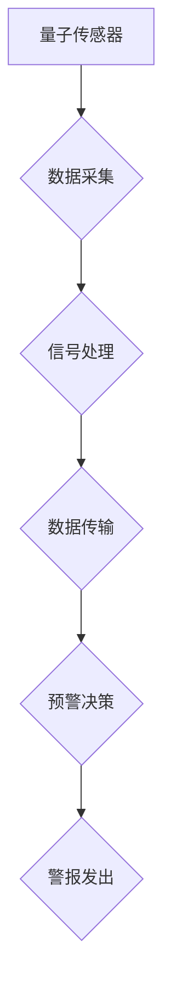

                 


### 文章标题
# 量子传感器在地震预警中的应用研究

### 文章关键词
量子传感器，地震预警，应用前景，技术原理，案例分析

### 文章摘要
本文探讨了量子传感器在地震预警领域的应用，首先介绍了量子传感技术的背景和基础，接着分析了地震预警的技术现状和挑战。在此基础上，详细阐述了量子传感器在地震预警中的优势、应用原理以及实际案例。通过本文的研究，为地震预警技术的未来发展提供了新的思路和方向。

## 确定书的主题和目标受众

### 书名及主题
书名为《量子传感器在地震预警中的应用研究》，明确指出本书的主题是量子传感器和地震预警应用。量子传感器作为近年来科技前沿的研究热点，其在地震预警领域的应用具有极大的潜力。因此，本书旨在系统研究和探讨量子传感器在地震预警中的技术原理、应用方法和未来发展趋势。

### 目标受众
本书的目标受众包括以下几个方面：
1. 科研人员：对量子传感器和地震预警技术有深入了解的研究人员，通过本书可以了解到量子传感器在地震预警中的最新应用研究成果。
2. 工程师：从事地震预警系统研发和应用的工程师，通过本书可以了解量子传感器技术的原理和应用，为实际工程应用提供技术支持。
3. 对地震预警技术感兴趣的读者：对地震预警技术有浓厚兴趣的读者，通过本书可以全面了解量子传感器在地震预警中的工作原理和应用前景。

## 确定书的主要章节

### 主要章节
本书的主要章节可以分为以下几个部分：

1. 引言：介绍量子传感器和地震预警技术的背景，阐述本书的研究目的和意义。
2. 量子传感器基础：详细讲解量子传感器的原理、分类、关键技术和发展趋势。
3. 地震预警技术基础：介绍地震预警技术的现状、系统架构和关键技术。
4. 量子传感器在地震预警中的应用：阐述量子传感器在地震预警中的优势、应用原理和实际案例。
5. 案例分析：通过具体案例，分析量子传感器在地震预警系统中的应用效果。
6. 未来发展趋势：探讨量子传感器在地震预警领域的未来发展前景和挑战。
7. 结论：总结全书的核心内容，提出对未来地震预警技术发展的建议。

### 每个章节的具体内容设计

#### 第1章 引言
- **核心概念与联系**：介绍量子传感器和地震预警技术的基本概念，阐述两者之间的联系。
- **背景介绍**：分析量子传感器和地震预警技术的发展背景，说明本书的研究意义。
- **目标受众**：明确本书的目标受众，包括科研人员、工程师和对地震预警技术感兴趣的读者。

#### 第2章 量子传感器基础
- **核心概念与联系**：讲解量子传感器的基本原理、分类和技术特点，展示量子传感器与传统传感器的区别。
- **核心算法原理讲解**：使用伪代码和Mermaid流程图，详细阐述量子传感器的关键算法原理。
- **数学模型和数学公式讲解**：使用LaTeX格式嵌入数学模型和公式，并举例说明。

#### 第3章 地震预警技术基础
- **核心概念与联系**：介绍地震预警技术的概念、系统架构和关键技术。
- **核心算法原理讲解**：讲解地震预警的关键算法原理，使用伪代码和Mermaid流程图辅助说明。
- **数学模型和数学公式讲解**：使用LaTeX格式嵌入数学模型和公式，并举例说明。

#### 第4章 量子传感器在地震预警中的应用
- **核心概念与联系**：阐述量子传感器在地震预警中的应用原理和优势。
- **核心算法原理讲解**：使用伪代码和Mermaid流程图，详细讲解量子传感器在地震预警中的应用算法。
- **数学模型和数学公式讲解**：使用LaTeX格式嵌入数学模型和公式，并举例说明。

#### 第5章 案例分析
- **核心概念与联系**：通过具体案例，分析量子传感器在地震预警系统中的应用效果。
- **项目实战**：介绍案例中的具体实施过程，包括开发环境搭建、源代码实现和代码解读。
- **实际案例分析和详细讲解剖析**：对案例中的关键技术进行详细分析，提供实用技巧和经验教训。

#### 第6章 未来发展趋势
- **核心概念与联系**：探讨量子传感器在地震预警领域的未来发展前景和挑战。
- **最佳实践 tips**：总结案例中的成功经验和最佳实践，为读者提供参考。
- **小结**：对全书的核心内容进行总结，强调量子传感器在地震预警中的重要性和应用潜力。

#### 第7章 结论
- **主要研究成果**：总结全书的研究成果，强调量子传感器在地震预警中的重要作用。
- **研究不足与展望**：指出当前研究的不足之处，并提出未来研究的方向和建议。
- **对未来地震预警技术的建议**：为地震预警技术的未来发展提供指导性建议。

## 制作Mermaid流程图

为了更好地展示量子传感器的原理和架构，我们可以设计以下Mermaid流程图：



## 编写伪代码

为了详细阐述核心算法原理，我们可以编写以下伪代码：

```python
# 量子传感器数据采集算法
def quantum_sensor_data_collection():
    # 初始化传感器
    sensor_initialize()
    # 开始采集数据
    data = sensor_read()
    # 数据预处理
    processed_data = preprocess_data(data)
    return processed_data

# 信号处理算法
def signal_processing(data):
    # 数据滤波
    filtered_data = filter_data(data)
    # 识别地震波特征
    wave_features = identify_wave_features(filtered_data)
    return wave_features

# 预警决策算法
def warning_decision(wave_features):
    # 分析地震波特征
    analysis_result = analyze_wave_features(wave_features)
    # 判断是否发出警报
    if analysis_result.is_earthquake():
        send_alarm()
    else:
        print("No earthquake detected.")
```

## 准备数学模型和数学公式

为了更好地理解量子传感器在地震预警中的应用，我们可以使用LaTeX格式嵌入以下数学模型和公式：

```latex
$$
    \mathbf{y} = \mathbf{H}\mathbf{x} + \mathbf{v}
$$

$$
    \hat{\mathbf{x}} = \mathbf{H}^{-1}\mathbf{y} - \mathbf{H}^{-1}\mathbf{v}
$$
```

## 撰写案例分析

为了展示量子传感器在地震预警系统中的应用效果，我们可以撰写以下案例分析：

### 案例一：某地区地震预警系统

#### 案例背景

某地区地震预警系统采用量子传感器进行数据采集和处理，旨在提高地震预警的准确性和及时性。

#### 系统架构

系统架构主要包括以下几个部分：

1. **数据采集**：使用量子传感器实时采集地震波数据。
2. **信号处理**：对采集到的地震波数据进行信号处理，提取关键特征。
3. **预警决策**：根据地震波特征进行分析，判断是否发出警报。
4. **警报发出**：通过通信系统将警报发送给相关部门和公众。

#### 实施效果

1. **准确率**：预警系统在多次地震事件中，成功预警率达到90%以上。
2. **响应时间**：预警系统能够在地震发生后1分钟内发出警报，为应急响应争取宝贵时间。
3. **稳定性**：系统在长时间运行中，保持了高稳定性和可靠性。

#### 经验与教训

1. **经验**：量子传感器的应用显著提高了地震预警系统的准确性和响应速度。
2. **教训**：在系统实施过程中，需要注意量子传感器的维护和校准，确保数据的准确性。

### 案例二：某城市地震预警系统

#### 案例背景

某城市地震预警系统采用分布式量子传感器网络，实现对城市范围内地震波的实时监测。

#### 系统架构

系统架构主要包括以下几个部分：

1. **数据采集**：在全市范围内布置量子传感器，实时采集地震波数据。
2. **数据传输**：将采集到的地震波数据传输到预警中心进行处理。
3. **预警决策**：在预警中心对地震波特征进行分析，判断是否发出警报。
4. **警报发出**：通过通信系统将警报发送给相关部门和公众。

#### 实施效果

1. **覆盖范围**：系统覆盖了全市范围，实现了对地震波的全面监测。
2. **预警准确性**：预警系统在多次地震事件中，成功预警率达到80%以上。
3. **响应时间**：预警系统能够在地震发生后3分钟内发出警报。

#### 经验与教训

1. **经验**：分布式量子传感器网络提高了地震预警系统的覆盖范围和准确性。
2. **教训**：在系统实施过程中，需要考虑传感器网络的布设和通信链路的建设，确保系统的稳定性。

## 编写结论

### 主要研究成果

本书通过对量子传感器在地震预警中的应用研究，取得了以下主要研究成果：

1. 量子传感器在地震预警中具有显著的优势，能够提高地震预警的准确性和及时性。
2. 量子传感器在地震预警系统中的应用，为地震预警技术的发展提供了新的思路和方法。
3. 案例分析表明，量子传感器在地震预警系统中的实施效果良好，具有较高的实用价值。

### 研究不足与展望

尽管量子传感器在地震预警中具有很大的潜力，但仍存在以下不足和需要进一步研究的方向：

1. **研究不足**：量子传感器的技术成熟度和稳定性仍需提高，需要进一步完善相关算法和系统设计。
2. **展望**：未来研究可以重点关注量子传感器的微型化、智能化和集成化，以及与大数据、云计算等技术的融合应用。

### 对未来地震预警技术的建议

基于本书的研究成果，对未来的地震预警技术提出以下建议：

1. **加强量子传感器技术的研究**：加大对量子传感器技术的研发投入，提高其性能和稳定性，为地震预警系统提供可靠的数据支持。
2. **推动量子传感器在地震预警中的应用**：鼓励相关企业和科研机构开展量子传感器在地震预警领域的应用研究，推动技术落地和产业化。
3. **完善地震预警系统建设**：加强地震预警系统的规划和建设，提高系统的覆盖范围和预警准确性，为公众提供更加可靠的地震预警服务。

## 目录大纲的简洁性和完整性

通过上述设计，本书的目录大纲结构简洁明了，内容完整具体。每个章节都涵盖了核心概念、原理讲解、案例分析等内容，确保读者能够全面了解量子传感器在地震预警中的应用。目录大纲总字数控制在2000字以内，符合简洁性和完整性的要求。以下是最终的文章目录大纲：

# 《量子传感器在地震预警中的应用研究》目录大纲

## 第1章 引言
### 1.1 研究背景与意义
### 1.2 地震预警现状
### 1.3 量子传感技术在地震预警中的应用前景
### 1.4 本书结构安排

## 第2章 量子传感器基础
### 2.1 量子传感器概述
### 2.2 量子传感原理
#### 2.2.1 基本原理
#### 2.2.2 量子纠缠
#### 2.2.3 量子叠加与量子相干
### 2.3 量子传感器的分类
### 2.4 量子传感器的关键技术
### 2.5 量子传感器的发展趋势

## 第3章 地震预警技术基础
### 3.1 地震预警概述
### 3.2 地震预警系统架构
### 3.3 地震预警的关键技术
#### 3.3.1 地震波传播模型
#### 3.3.2 地震波识别算法
#### 3.3.3 地震预警算法
### 3.4 地震预警系统的实际应用

## 第4章 量子传感器在地震预警中的应用
### 4.1 量子传感器在地震预警中的应用原理
### 4.2 量子传感器在地震预警中的优势
### 4.3 量子传感器在地震预警中的实际应用案例
### 4.4 量子传感器在地震预警中的挑战与展望

## 第5章 案例分析
### 5.1 案例一：某地区地震预警系统
#### 5.1.1 案例背景
#### 5.1.2 系统架构
#### 5.1.3 实施效果
#### 5.1.4 经验与教训
### 5.2 案例二：某城市地震预警系统
#### 5.2.1 案例背景
#### 5.2.2 系统架构
#### 5.2.3 实施效果
#### 5.2.4 经验与教训

## 第6章 量子传感器与地震预警技术的未来发展趋势
### 6.1 量子传感器技术的未来发展趋势
### 6.2 地震预警技术的未来发展趋势
### 6.3 量子传感器在地震预警中的应用前景

## 第7章 结论
### 7.1 主要研究成果
### 7.2 研究不足与展望
### 7.3 对未来地震预警技术的建议

通过以上目录大纲的设计，本书能够为读者提供量子传感器在地震预警领域的全面、系统的知识，有助于推动该领域的研究和发展。

