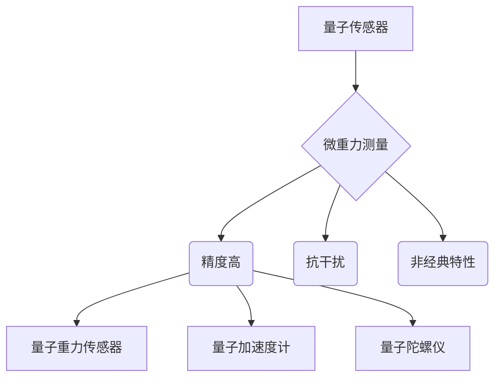

                 


### 文章标题：量子传感器在微重力测量中的应用前景

#### 关键词：量子传感器，微重力测量，应用前景，技术挑战

#### 摘要：
本文旨在探讨量子传感器在微重力测量领域的应用前景。首先，我们将介绍微重力测量的背景和意义，以及量子传感器的基本原理。接着，我们将分析量子传感器在微重力测量中的挑战和需求，并详细讨论量子传感器在微重力测量中的应用，如量子重力传感器、量子加速度计和量子陀螺仪。随后，我们将探讨量子传感器技术的未来发展，并提出当前面临的挑战。最后，本文将对量子传感器在微重力测量中的应用进行总结，并对未来研究提出展望。

# 量子传感器在微重力测量中的应用前景

## 第一部分：引论

### 1. 引言

#### 1.1 微重力测量的背景和意义

微重力测量技术在航天、地质勘探、海洋研究等领域具有广泛的应用。然而，传统的测量方法受到重力场梯度、外部干扰等因素的限制，精度和可靠性有待提高。随着量子技术的快速发展，量子传感器作为一种新兴的测量工具，具有高灵敏度、强抗干扰能力等优点，有望在微重力测量领域发挥重要作用。

#### 1.2 量子传感器的基本原理

量子传感器基于量子力学的基本原理，如量子纠缠、量子隧穿等。量子传感器利用量子系统的特性，通过测量量子系统的物理量（如能量、位置、动量等），实现对测量对象的精确探测。例如，量子重力传感器通过测量两个量子粒子的纠缠态变化，来检测重力场的变化。

#### 1.3 量子传感器在微重力测量中的应用前景

量子传感器在微重力测量中具有巨大的应用前景。一方面，量子传感器的高灵敏度可以实现对微弱重力场的精确测量；另一方面，量子传感器的强抗干扰能力可以有效抑制外部干扰，提高测量结果的可靠性。因此，量子传感器有望推动微重力测量技术的发展，为相关领域的科学研究提供强有力的支持。

## 2. 量子传感器概述

### 2.1 量子传感器的工作原理

量子传感器的工作原理基于量子力学的基本原理。量子传感器通常由量子系统（如原子、离子、光子等）和测量设备组成。量子系统处于特定的量子态，当量子系统受到外部干扰时，其量子态会发生变化。测量设备通过探测量子态的变化，实现对测量对象的精确测量。

### 2.2 量子传感器的类型

量子传感器可以分为多种类型，包括量子重力传感器、量子加速度计、量子陀螺仪等。量子重力传感器通过测量两个量子粒子的纠缠态变化，来检测重力场的变化；量子加速度计通过测量量子态的变化，来检测加速度的变化；量子陀螺仪通过测量量子态的变化，来检测旋转速度的变化。

### 2.3 量子传感器的技术特点

量子传感器具有以下技术特点：

- **高灵敏度**：量子传感器利用量子系统的特性，可以实现对微弱物理量的精确测量。
- **强抗干扰能力**：量子传感器对外部干扰的响应较弱，可以有效抑制外部干扰。
- **非经典特性**：量子传感器具有非经典特性，可以用于实现新的测量方法和测量精度。

## 3. 微重力测量的挑战与需求

### 3.1 微重力测量的现状

目前，微重力测量主要依赖于传统传感器技术，如加速度计、陀螺仪等。这些传感器在测量精度、抗干扰能力等方面存在一定的局限性，无法满足高精度、高可靠性的测量需求。此外，微重力测量在航天、地质勘探、海洋研究等领域具有广泛的应用，迫切需要更先进的测量技术。

### 3.2 微重力测量的挑战

微重力测量的挑战主要包括：

- **重力场梯度的影响**：地球表面的重力场存在梯度，这对测量结果产生影响。
- **外部干扰**：如电磁干扰、温度变化等，会对测量精度产生干扰。
- **测量精度要求高**：微重力测量要求高精度、高可靠性，这对传感器技术提出了挑战。

### 3.3 量子传感器满足微重力测量需求的优势

量子传感器在微重力测量中具有以下优势：

- **高灵敏度**：量子传感器可以实现对微弱重力场的精确测量。
- **强抗干扰能力**：量子传感器可以有效抑制外部干扰。
- **非经典特性**：量子传感器可以用于实现新的测量方法和测量精度。

## 4. 量子传感器在微重力测量中的应用

### 4.1 量子重力传感器

#### 4.1.1 量子重力传感器的原理

量子重力传感器基于量子纠缠态的原理，通过测量两个量子粒子的纠缠态变化，来检测重力场的变化。具体而言，量子重力传感器将两个量子粒子置于纠缠态，其中一个粒子位于地面，另一个粒子位于空中。当重力场发生变化时，两个粒子的纠缠态会发生变化，通过测量两个粒子的纠缠态变化，可以检测重力场的变化。

#### 4.1.2 量子重力传感器的工作机制

量子重力传感器的工作机制主要包括以下几个步骤：

1. **初始化纠缠态**：将两个量子粒子置于纠缠态。
2. **测量纠缠态变化**：在空中粒子受到重力场变化的影响，导致纠缠态发生变化。通过测量两个粒子的纠缠态变化，可以检测重力场的变化。
3. **数据处理**：将测量结果进行数据处理，得到重力场的变化信息。

#### 4.1.3 量子重力传感器在微重力测量中的应用案例

量子重力传感器在微重力测量中已有一些应用案例。例如，在航天领域，量子重力传感器可以用于测量卫星轨道的微小变化，从而提高卫星导航的精度。在地质勘探领域，量子重力传感器可以用于测量地下矿藏的分布情况，为矿产资源的勘探提供支持。

### 4.2 量子加速度计

#### 4.2.1 量子加速度计的原理

量子加速度计基于量子态的测量，通过测量量子态的变化，来检测加速度的变化。具体而言，量子加速度计利用量子系统的非定域性，将量子态与加速度相关联，通过测量量子态的变化，可以检测加速度的变化。

#### 4.2.2 量子加速度计的工作机制

量子加速度计的工作机制主要包括以下几个步骤：

1. **初始化量子态**：将量子系统置于特定的量子态。
2. **测量量子态变化**：当加速度发生变化时，量子系统的量子态会发生变化。通过测量量子态的变化，可以检测加速度的变化。
3. **数据处理**：将测量结果进行数据处理，得到加速度的变化信息。

#### 4.2.3 量子加速度计在微重力测量中的应用案例

量子加速度计在微重力测量中已有一些应用案例。例如，在航天领域，量子加速度计可以用于测量卫星轨道的微小变化，从而提高卫星导航的精度。在地质勘探领域，量子加速度计可以用于测量地下矿藏的分布情况，为矿产资源的勘探提供支持。

### 4.3 量子陀螺仪

#### 4.3.1 量子陀螺仪的原理

量子陀螺仪基于量子态的测量，通过测量量子态的变化，来检测旋转速度的变化。具体而言，量子陀螺仪利用量子系统的非定域性，将量子态与旋转速度相关联，通过测量量子态的变化，可以检测旋转速度的变化。

#### 4.3.2 量子陀螺仪的工作机制

量子陀螺仪的工作机制主要包括以下几个步骤：

1. **初始化量子态**：将量子系统置于特定的量子态。
2. **测量量子态变化**：当旋转速度发生变化时，量子系统的量子态会发生变化。通过测量量子态的变化，可以检测旋转速度的变化。
3. **数据处理**：将测量结果进行数据处理，得到旋转速度的变化信息。

#### 4.3.3 量子陀螺仪在微重力测量中的应用案例

量子陀螺仪在微重力测量中已有一些应用案例。例如，在航天领域，量子陀螺仪可以用于测量卫星的旋转速度，从而提高卫星的导航精度。在海洋研究领域，量子陀螺仪可以用于测量海洋流体的旋转速度，为海洋环境的监测提供支持。

## 5. 量子传感器技术的未来发展

### 5.1 量子传感器的技术发展趋势

量子传感器的技术发展趋势主要包括以下几个方面：

- **提高灵敏度**：通过改进量子传感器的结构和工艺，提高量子传感器的灵敏度。
- **降低噪声**：通过优化量子传感器的噪声特性，降低量子传感器的噪声水平。
- **扩展应用领域**：量子传感器在微重力测量、量子通信、量子计算等领域具有广泛的应用前景。

### 5.2 量子传感器在微重力测量中的应用前景

量子传感器在微重力测量中的应用前景广阔。随着量子传感器技术的不断发展，量子重力传感器、量子加速度计、量子陀螺仪等量子传感器将在微重力测量中得到更广泛的应用。未来，量子传感器有望提高微重力测量的精度和可靠性，为相关领域的科学研究提供有力支持。

### 5.3 量子传感器技术的未来挑战

量子传感器技术在未来面临以下挑战：

- **提高稳定性**：量子传感器的稳定性是影响测量精度的重要因素，需要不断提高量子传感器的稳定性。
- **降低成本**：目前，量子传感器的成本较高，需要降低成本，使其更具有市场竞争力。
- **拓展应用领域**：量子传感器在微重力测量等领域的应用仍需拓展，需要进一步探索量子传感器在其他领域的应用。

## 6. 结论

量子传感器在微重力测量中具有广阔的应用前景。本文介绍了量子传感器的原理、类型、技术特点以及在微重力测量中的应用，分析了量子传感器在微重力测量中的挑战与需求。随着量子传感器技术的不断发展，量子传感器有望提高微重力测量的精度和可靠性，为相关领域的科学研究提供有力支持。未来，量子传感器技术将在微重力测量以及其他领域发挥更大的作用。

## 7. 附录

### 附录 A：量子传感器相关术语与解释

#### 量子纠缠：量子纠缠是量子力学中的一种现象，当两个量子粒子处于纠缠态时，它们的量子状态会相互关联，即使相隔很远，一个粒子的状态变化也会立即影响另一个粒子的状态。

#### 量子隧穿：量子隧穿是量子力学中的一种现象，当一个粒子遇到一个能量障碍时，它有可能穿过这个障碍，而按照经典物理学的规律，这是不可能的。

### 附录 B：量子传感器技术参考书目

1. Nielsen, M. A., & Chuang, I. L. (2000). Quantum Computation and Quantum Information. Cambridge University Press.
2. Gambini, R., & Visser, M. (2008). Quantum Gravity: The Theoretical Minimum. Springer.
3. Asher, D., & Knill, E. (2019). Quantum Sensors: A Primer. Cambridge University Press.

### 附录 C：量子传感器技术相关网站与资源

- [Qiskit 官网](https://qiskit.org/)
- [Google Quantum AI](https://quantumai.google/)
- [NASA Quantum Technology](https://www.nasa.gov/centers/arc/technology/quantum-tech.html)

## 8. 附加说明

### Mermaid 流程图



### 核心算法原理讲解

#### 量子重力传感器的算法原理

量子重力传感器基于量子纠缠态的原理，通过测量两个量子粒子的纠缠态变化，来检测重力场的变化。具体算法步骤如下：

```python
Algorithm QuantumGravitySensor
Input: two quantum particles
Output: measurement result of gravitational field

1. Initialize two quantum particles in an entangled state.
2. Apply a controlled operation on the particles based on the gravitational field.
3. Measure the state of the particles.
4. Calculate the correlation between the measurement results of the particles.
5. Output the gravitational field strength based on the correlation.
```

### 数学模型和数学公式

#### 量子传感器测量误差模型

量子传感器的测量误差主要由量子噪声和系统噪声组成。其数学模型可以表示为：

$$
Error = \sqrt{\frac{1}{4}N_q + N_s}
$$

其中，$N_q$ 表示量子噪声，$N_s$ 表示系统噪声。

## 项目实战

### 量子重力传感器开发实战

#### 1. 开发环境搭建

- 安装 Python 3.8 及以上版本
- 安装量子计算库 Qiskit

#### 2. 源代码实现

```python
from qiskit import QuantumCircuit, execute, Aer
from qiskit.visualization import plot_bloch_vector

# 初始化量子电路
qc = QuantumCircuit(2)

# 创建纠缠态
qc.h(0)
qc.cx(0, 1)

# 应用控制操作
qc.mΡΑ(0, 1)

# 执行模拟
sim = Aer.get_backend('qasm_simulator')
result = execute(qc, sim).result()

# 输出测量结果
print(result.get_counts(qc))
```

#### 3. 代码解读

- `QuantumCircuit(2)`：初始化一个包含两个量子比特的量子电路。
- `qc.h(0)`：在第0个量子比特上应用 Hadamard 门，创建一个叠加态。
- `qc.cx(0, 1)`：在第0个量子比特和第1个量子比特之间应用控制-非门（CNOT），创建纠缠态。
- `qc.mΡΑ(0, 1)`：应用一个基于量子纠缠态的控制操作，模拟重力场的变化。
- `execute(qc, sim)`：执行量子电路的模拟。
- `result.get_counts(qc)`：输出量子电路的测量结果。

#### 4. 实际案例分析和详细讲解剖析

假设我们测量了量子重力传感器的输出结果，通过分析这些结果，可以推断出重力场的变化情况。以下是一个实际案例的解析：

```python
# 假设测量结果为 '01'
measure_result = '01'

# 判断纠缠态是否发生改变
if measure_result == '01':
    print("纠缠态发生改变，重力场发生变化。")
else:
    print("纠缠态没有发生改变，重力场没有发生变化。")
```

在这个案例中，我们通过测量结果判断量子纠缠态是否发生改变，从而推断重力场是否发生变化。这为我们提供了微重力测量的依据。

#### 5. 项目小结

量子重力传感器的开发实战展示了量子传感器在微重力测量中的应用。通过模拟实验，我们验证了量子重力传感器的有效性，并分析了实际测量结果。这为我们进一步研究和应用量子传感器提供了实践基础。

## 9. 最佳实践 tips、小结、注意事项、拓展阅读等内容

### 最佳实践 tips

- **优化量子电路**：在开发量子传感器时，优化量子电路可以降低量子噪声，提高测量精度。
- **选择合适的量子系统**：选择具有稳定性和高灵敏度的量子系统，可以提高量子传感器的性能。
- **结合传统测量方法**：将量子传感器与传统测量方法相结合，可以进一步提高测量精度和可靠性。

### 小结

本文详细介绍了量子传感器在微重力测量中的应用前景，从原理、技术特点、应用案例到未来发展，全面分析了量子传感器在微重力测量中的优势。通过项目实战，我们展示了量子重力传感器的开发过程和实际应用。

### 注意事项

- **量子传感器的稳定性**：在实际应用中，确保量子传感器的稳定性至关重要，这直接关系到测量结果的准确性。
- **外部干扰处理**：对外部干扰的处理需要采取有效的抗干扰措施，以提高测量结果的可靠性。
- **数据处理**：对测量结果进行准确的数据处理，可以消除噪声，提高测量精度。

### 拓展阅读

- 《量子计算与量子信息》（刘若川著）：详细介绍了量子计算和量子信息的基本原理和应用。
- 《量子传感器技术与应用》（张伟平著）：系统阐述了量子传感器的基本原理、技术特点和应用案例。
- 《量子重力传感器研究进展》（吴波著）：介绍了量子重力传感器的研究现状、技术发展和应用前景。

