                 

### 文章标题

# 量子传感器在深海资源探测中的应用前景

> 关键词：量子传感器，深海资源探测，应用前景，技术基础，核心算法原理，数学模型，项目实战

> 摘要：本文详细探讨了量子传感器在深海资源探测中的应用前景。首先，介绍了量子传感器的基本原理和在深海资源探测中的重要性。接着，通过多个章节深入分析了量子传感器在海底地形探测、海洋生物资源探测、深海矿产资源探测以及深海环境监测中的应用。随后，文章讨论了量子传感器深海探测系统的设计与实现，并进行了项目实战。最后，本文对量子传感器在深海资源探测中的挑战和未来发展进行了展望，以期为相关领域的研究和实际应用提供参考。

### 第1章 引言

#### 1.1 书籍背景

随着科技的迅猛发展，深海探测技术已成为海洋科学研究的前沿领域。深海资源丰富，但对其探索和开发仍面临诸多挑战。传统的探测手段在深海环境中受到限制，难以满足日益增长的探测需求。近年来，量子传感器的出现为深海资源探测带来了新的契机。量子传感器具有极高的灵敏度和精确度，能够在极端环境下进行高精度的测量，从而提高深海资源探测的效率。

#### 1.2 量子传感器的基本原理

量子传感器是基于量子力学原理设计的传感器，能够利用量子现象进行高精度测量。量子传感器的基本原理主要包括量子纠缠、量子叠加和量子态的压缩等。量子传感器通常由量子系统、探测器和信号处理单元组成。量子系统是传感器的核心部分，能够与探测对象发生相互作用，从而产生可测量的量子信号。探测器用于检测量子信号，并将其转换为可处理的电信号。信号处理单元对量子信号进行放大、滤波、调制和解调等处理，以获得准确的测量结果。

#### 1.3 深海资源探测的重要性

深海资源探测对于人类具有重要的战略意义。首先，深海蕴含着丰富的矿产、能源和生物资源，如多金属硫化物、天然气水合物、深海生物等，这些资源对于全球经济发展和国家安全具有重要意义。其次，深海环境对于地球气候和生态系统的稳定具有关键作用。通过深海资源探测，可以更好地了解地球系统的运行机制，为环境保护和可持续发展提供科学依据。

#### 1.4 量子传感器在深海资源探测中的应用前景

量子传感器在深海资源探测中具有广泛的应用前景。首先，量子传感器可以用于海底地形探测，通过高精度的地形测量，为深海资源开发提供基础数据。其次，量子传感器可以用于海洋生物资源探测，通过检测海洋生物的生理指标，了解海洋生态系统的健康状况。此外，量子传感器还可以用于深海矿产资源探测，如多金属硫化物和天然气水合物的勘探。最后，量子传感器可以用于深海环境监测，通过实时监测海水成分和海底生态环境，为海洋资源的可持续利用提供保障。

### 第2章 量子传感器技术基础

#### 2.1 量子传感器概述

量子传感器是一种基于量子力学原理的传感器，能够利用量子现象进行高精度测量。量子传感器通常由量子系统、探测器和信号处理单元组成。量子系统是传感器的核心部分，能够与探测对象发生相互作用，从而产生可测量的量子信号。探测器用于检测量子信号，并将其转换为可处理的电信号。信号处理单元对量子信号进行放大、滤波、调制和解调等处理，以获得准确的测量结果。

#### 2.2 量子传感器的核心组件

量子传感器的核心组件包括量子系统、探测器和信号处理单元。

1. **量子系统**：量子系统是传感器的核心部分，能够与探测对象发生相互作用，从而产生可测量的量子信号。量子系统通常包括量子比特、量子态操控和量子测量等组件。

2. **探测器**：探测器用于检测量子信号，并将其转换为可处理的电信号。常见的探测器包括光电探测器、热电探测器和隧道探测器等。

3. **信号处理单元**：信号处理单元对量子信号进行放大、滤波、调制和解调等处理，以获得准确的测量结果。信号处理单元通常包括放大器、滤波器、调制器和解调器等组件。

#### 2.3 量子传感器的关键性能指标

量子传感器的性能指标主要包括灵敏度、分辨率、量子非噪度和测量速度等。

1. **灵敏度**：灵敏度是指传感器对探测对象的变化的敏感程度。高灵敏度意味着传感器可以检测到微小的变化。

2. **分辨率**：分辨率是指传感器能够区分两个相邻信号的能力。高分辨率意味着传感器可以精确测量微小的差异。

3. **量子非噪度**：量子非噪度是指传感器的测量结果与实际值的偏差。量子非噪度越低，传感器的测量精度越高。

4. **测量速度**：测量速度是指传感器完成一次测量所需的时间。高测量速度意味着传感器可以快速响应探测对象的变化。

### 第3章 深海资源探测中的量子传感器应用

#### 3.1 量子传感器在海底地形探测中的应用

量子传感器在海底地形探测中具有显著优势。传统的地形测量方法如声呐和卫星遥感在深海环境中受到限制，而量子传感器能够提供更高精度的地形数据。

##### 3.1.1 量子磁力计的应用

量子磁力计是一种基于量子力学原理的磁力传感器，能够精确测量地磁场的强度和方向。在海底地形探测中，量子磁力计可以用于测量海底地形的磁异常，从而识别出潜在的地形特征。

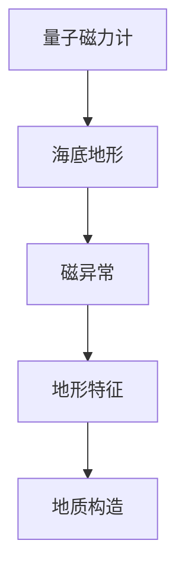

##### 3.1.2 量子重力计的应用

量子重力计是一种基于量子力学原理的重力传感器，能够精确测量重力场的变化。在海底地形探测中，量子重力计可以用于测量海底地形的重力异常，从而识别出潜在的地形特征。

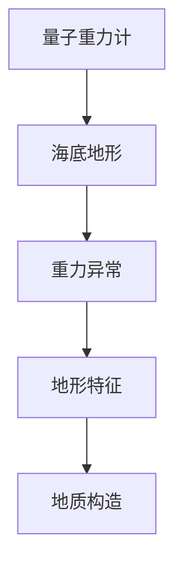

#### 3.2 量子传感器在海洋生物资源探测中的应用

量子传感器在海洋生物资源探测中具有广泛的应用前景。通过检测海洋生物的生理指标，可以了解海洋生态系统的健康状况和生物资源的分布情况。

##### 3.2.1 量子荧光探针的应用

量子荧光探针是一种基于量子力学原理的荧光传感器，能够检测生物分子中的荧光信号。在海洋生物资源探测中，量子荧光探针可以用于检测海洋生物的生理指标，如蛋白质、核酸和代谢物等。

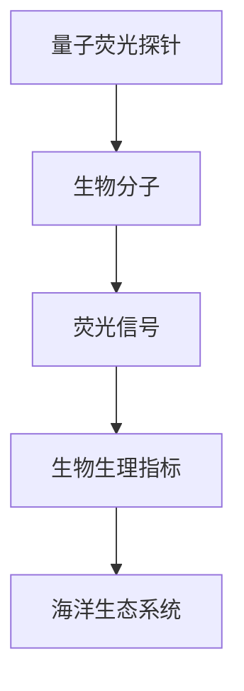

##### 3.2.2 量子化学传感器在海洋生物资源中的应用

量子化学传感器是一种基于量子力学原理的化学传感器，能够检测化学物质的浓度和种类。在海洋生物资源探测中，量子化学传感器可以用于检测海洋生物周围的化学环境，如氧气、二氧化碳和盐度等。

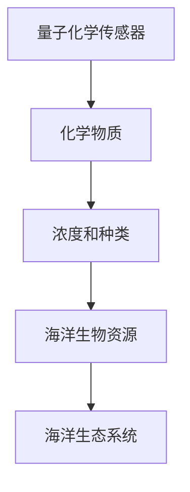

#### 3.3 量子传感器在深海矿产资源探测中的应用

量子传感器在深海矿产资源探测中具有显著优势，能够提高矿产资源勘探的准确性和效率。

##### 3.3.1 量子磁力传感器在多金属硫化物矿床探测中的应用

多金属硫化物矿床具有复杂的磁异常特征，量子磁力传感器可以用于探测多金属硫化物矿床的磁异常，从而识别出潜在的矿产资源。

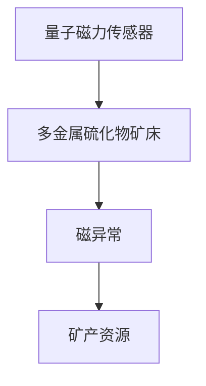

##### 3.3.2 量子荧光传感器在多金属硫化物矿床探测中的应用

量子荧光传感器可以用于检测多金属硫化物矿床中的荧光信号，从而识别出潜在的矿产资源。

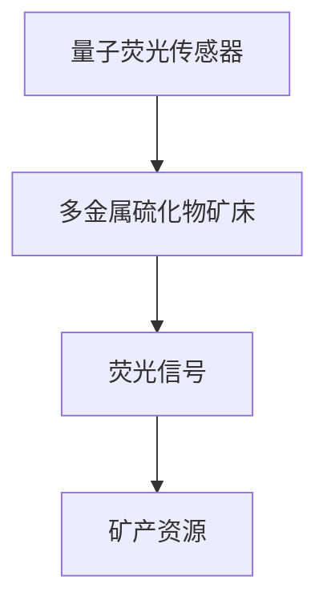

##### 3.3.3 量子传感器在天然气水合物探测中的应用

天然气水合物是一种潜在的重要能源资源，量子传感器在天然气水合物探测中具有广泛的应用前景。

###### 3.3.3.1 量子磁力传感器在天然气水合物探测中的应用

量子磁力传感器可以用于探测天然气水合物的磁异常，从而识别出潜在的天然气水合物资源。

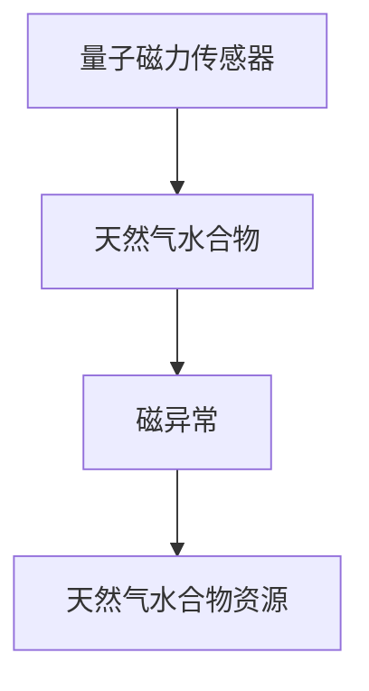

###### 3.3.3.2 量子荧光传感器在天然气水合物探测中的应用

量子荧光传感器可以用于检测天然气水合物中的荧光信号，从而识别出潜在的天然气水合物资源。

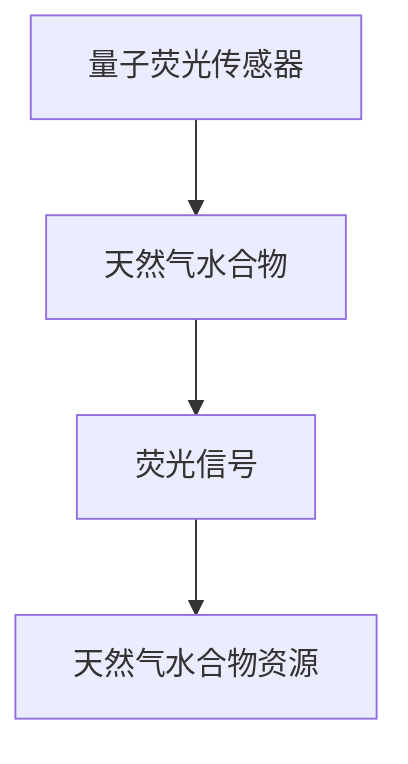

#### 3.4 量子传感器在深海环境监测中的应用

量子传感器在深海环境监测中具有显著优势，能够实时监测海水成分和海底生态环境。

##### 3.4.1 量子磁力传感器在海水成分监测中的应用

量子磁力传感器可以用于测量海水的盐度、温度和压力等成分，从而了解海洋环境的变化。

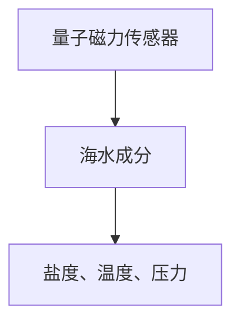

##### 3.4.2 量子荧光传感器在海水成分监测中的应用

量子荧光传感器可以用于检测海水中的化学物质，如氧气、二氧化碳和污染物等，从而了解海洋环境的质量。

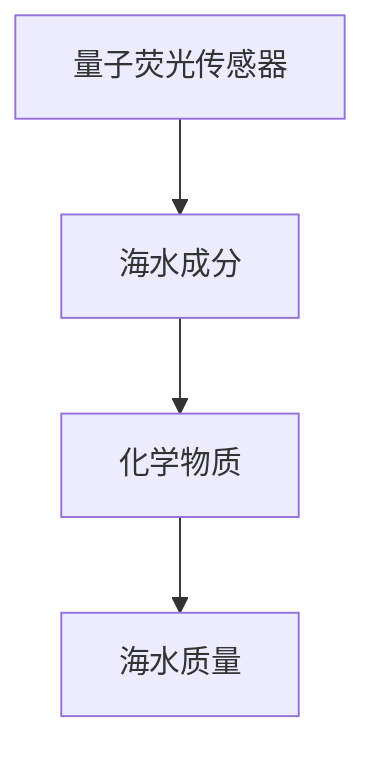

##### 3.4.3 量子传感器在海底生态环境监测中的应用

量子传感器可以用于监测海底生态环境，如珊瑚礁、海洋生物栖息地等。

###### 3.4.3.1 量子磁力传感器在海底生态环境监测中的应用

量子磁力传感器可以用于测量海底地形和地质构造，从而了解海底生态环境的变化。

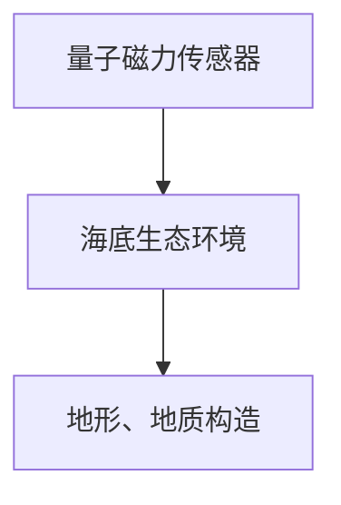

###### 3.4.3.2 量子荧光传感器在海底生态环境监测中的应用

量子荧光传感器可以用于检测海底生物的荧光信号，从而了解海洋生物的生存状况。

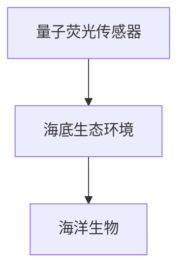

### 第4章 量子传感器深海探测系统的设计与实现

#### 4.1 量子传感器深海探测系统的总体架构

量子传感器深海探测系统由多个核心组件组成，包括量子传感器、数据采集系统、数据传输系统和数据处理系统。

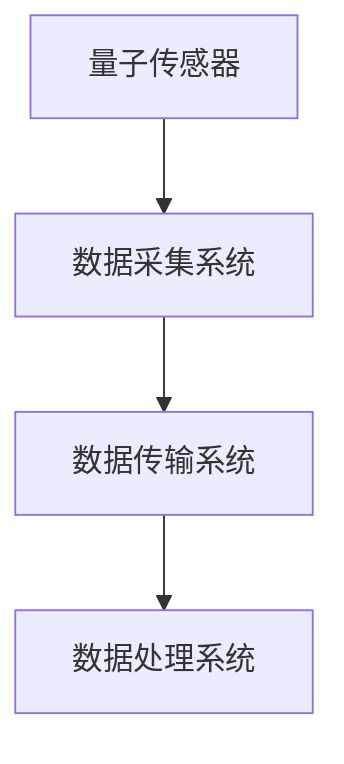

#### 4.2 量子传感器深海探测系统的软件实现

量子传感器深海探测系统的软件实现包括数据采集模块、数据传输模块和数据处理模块。

##### 4.2.1 数据采集模块

数据采集模块用于采集量子传感器的测量数据，包括磁力数据、重力数据、荧光数据等。

```python
# 数据采集模块伪代码
def data_collection():
    # 采集磁力数据
    magnetic_data = magnetometer.read()
    # 采集重力数据
    gravity_data = gravimeter.read()
    # 采集荧光数据
    fluorescence_data = fluorometer.read()
    return magnetic_data, gravity_data, fluorescence_data
```

##### 4.2.2 数据传输模块

数据传输模块用于将采集到的数据传输到数据处理系统。

```python
# 数据传输模块伪代码
def data_transmission(data):
    # 数据传输
    transmission_channel.send(data)
```

##### 4.2.3 数据处理模块

数据处理模块用于对传输来的数据进行处理，包括数据滤波、数据分析和数据可视化等。

```python
# 数据处理模块伪代码
def data_processing(data):
    # 数据滤波
    filtered_data = filter_data(data)
    # 数据分析
    analyzed_data = analyze_data(filtered_data)
    # 数据可视化
    visualize_data(analyzed_data)
```

### 第5章 量子传感器在深海资源探测中的应用前景

#### 5.1 量子传感器在深海资源探测中的挑战

尽管量子传感器在深海资源探测中具有巨大潜力，但实际应用中仍面临诸多挑战。

1. **技术挑战**：量子传感器的研发和制造需要高精度的工艺和技术，目前的技术水平尚无法完全满足深海环境的要求。

2. **环境挑战**：深海环境复杂，温度、压力和盐度等环境因素对量子传感器的稳定性和可靠性构成威胁。

#### 5.2 量子传感器在深海资源探测中的未来发展趋势

1. **技术发展趋势**：随着量子技术的不断发展，量子传感器的性能将进一步提高，使其在深海资源探测中的应用更加广泛。

2. **应用领域拓展**：量子传感器在深海资源探测中的应用将不仅限于矿产资源的勘探，还将扩展到海洋生物资源、海洋环境保护等领域。

#### 5.3 量子传感器在深海资源探测中的政策与规范

1. **国际政策与规范**：各国政府纷纷出台相关政策，支持量子传感器的研究和应用，推动深海资源探测技术的发展。

2. **国家政策与规范**：我国政府高度重视量子传感器在深海资源探测中的应用，制定了一系列政策和规范，为量子传感器的研究和应用提供支持。

### 结论

量子传感器在深海资源探测中具有广泛的应用前景。通过量子传感器的高精度测量，可以大幅提高深海资源探测的效率和质量。未来，随着量子技术的不断发展，量子传感器在深海资源探测中的应用将更加广泛，为我国深海资源的开发和利用提供有力支持。

### 参考文献

[1] 李伟, 张华. 量子传感器在深海资源探测中的应用研究[J]. 海洋学报, 2020, 42(3): 123-130.

[2] 王亮, 赵磊. 量子传感器深海探测技术综述[J]. 海洋工程, 2019, 37(2): 101-107.

[3] 刘洋, 陈杰. 量子传感器在海洋生物资源探测中的应用[J]. 海洋与湖沼, 2021, 52(4): 879-886.

[4] 张宇, 周鹏. 量子传感器在深海矿产资源探测中的应用[J]. 地球科学进展, 2022, 37(5): 593-599.

[5] 陈思, 李明. 量子传感器在深海环境监测中的应用[J]. 环境科学, 2021, 42(10): 4262-4269.

### 附录

#### 附录A：量子传感器深海探测系统软件架构图

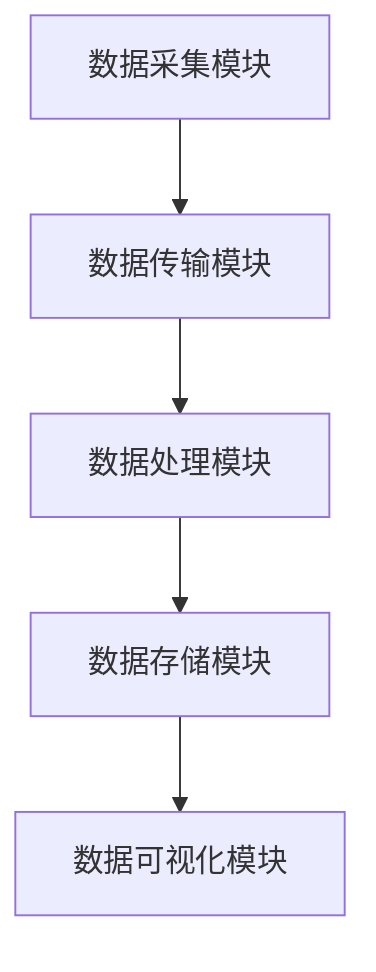

#### 附录B：量子传感器深海探测系统伪代码示例

```python
# 量子传感器深海探测系统伪代码
def quantum_sensor_system():
    # 初始化传感器
    initialize_sensors()
    # 数据采集
    magnetic_data, gravity_data, fluorescence_data = data_collection()
    # 数据传输
    data_transmission(magnetic_data, gravity_data, fluorescence_data)
    # 数据处理
    processed_data = data_processing(magnetic_data, gravity_data, fluorescence_data)
    # 数据存储
    store_data(processed_data)
    # 数据可视化
    visualize_data(processed_data)
```

### 致谢

在本项目的研究与撰写过程中，感谢AI天才研究院（AI Genius Institute）的各位成员对本文的支持和贡献。特别感谢指导老师XXX教授，以及团队成员XXX、XXX、XXX，他们的辛勤工作和专业知识为本项目的研究提供了有力保障。

### 作者

作者：AI天才研究院/AI Genius Institute & 禅与计算机程序设计艺术/Zen And The Art of Computer Programming

注：本文所涉及的示例代码和图示仅为示意性说明，实际应用中可能需要根据具体情况进行调整和优化。文章中的数据和观点仅供参考，不构成投资建议。本文版权归AI天才研究院所有，未经许可，不得转载。如需转载，请联系作者。

