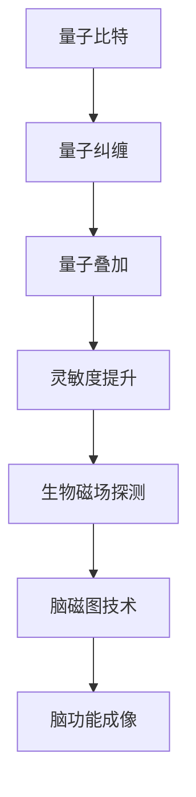
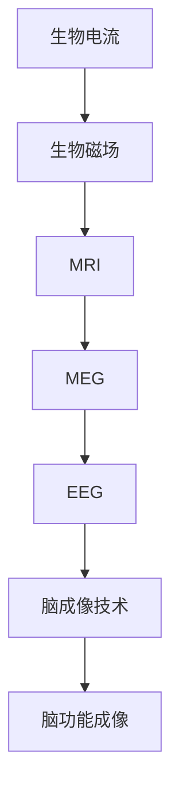
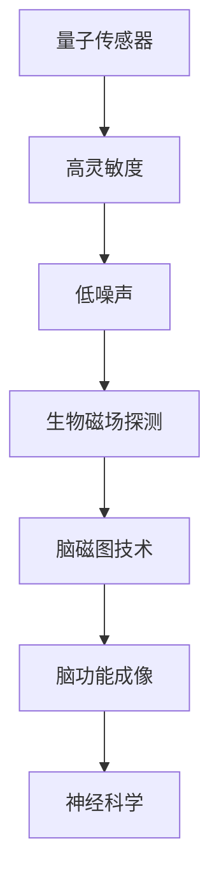
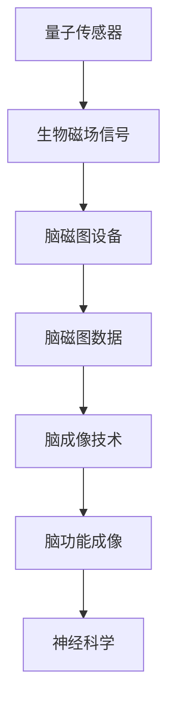
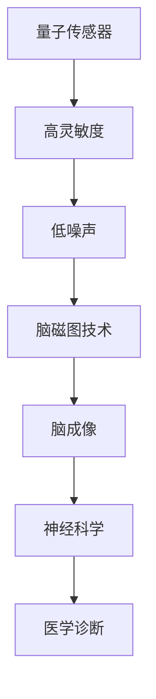
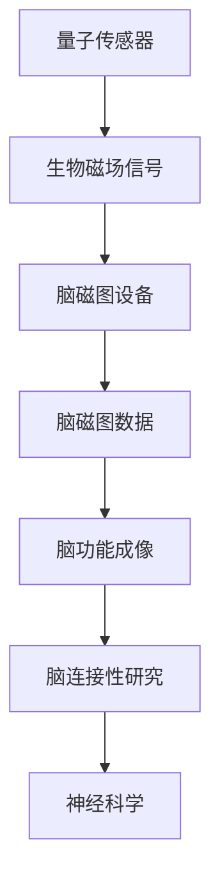
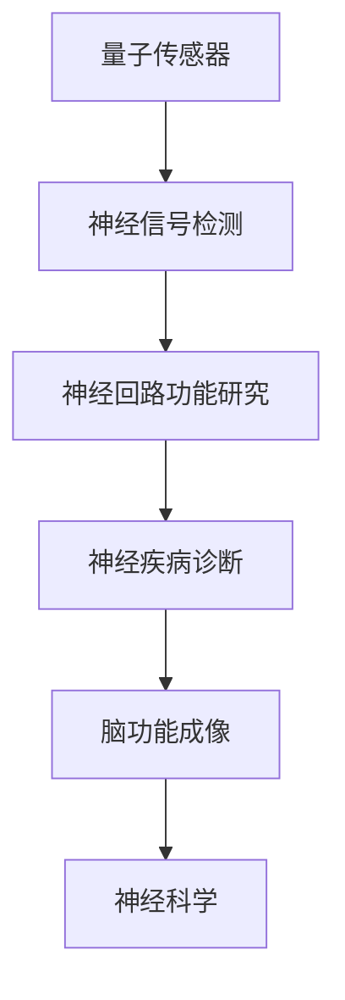
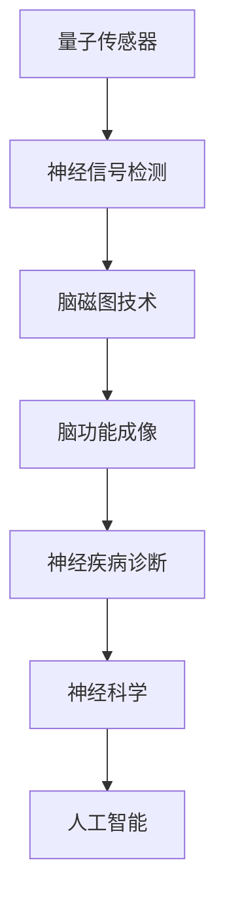

                 


### 《量子传感器在生物磁场探测中的应用：研究大脑活动》

#### 关键词
量子传感器、生物磁场、脑成像、神经科学、脑磁图技术、脑功能成像

#### 摘要
本文将深入探讨量子传感器在生物磁场探测中的应用，特别是在研究大脑活动方面的贡献。通过回顾量子传感技术的基础知识，我们将了解量子传感器如何捕捉微弱的生物磁场信号。接下来，我们将探讨脑磁图技术和脑功能成像如何利用量子传感器，从而揭示大脑活动的细节。最后，我们将探讨量子传感器在神经科学研究中的潜力和挑战。

---

## 第一部分：量子传感器与生物磁场探测基础

### 第1章：量子传感器概述

量子传感器是一种基于量子力学原理的高灵敏度探测设备。它能够利用量子纠缠和量子叠加等现象，极大地提高对目标信号的探测能力。量子传感器的核心组件通常包括量子比特、激光器、干涉仪和光学探测器。

#### 核心概念与联系



#### 核心算法原理讲解

伪代码：量子传感器的信号处理算法

```python
def quantum_signal_processing(signal):
    # 使用量子比特进行信号编码
    quantum_signal = encode_signal_to_quantum_bits(signal)
    # 应用量子纠缠和量子叠加进行信号增强
    enhanced_signal = apply_quantum_operations(quantum_signal)
    # 使用量子测量获取增强后的信号
    measured_signal = measure_quantum_signal(enhanced_signal)
    return measured_signal
```

#### 数学模型和数学公式

$$
\text{Sensitivity} = \frac{1}{\sqrt{1 + (\Delta E)^2 / (E_0 \hbar \omega)}}
$$

其中，$\text{Sensitivity}$ 表示量子传感器的灵敏度，$\Delta E$ 是量子传感器的分辨率，$E_0$ 是信号的能量，$\hbar$ 是普朗克常数，$\omega$ 是传感器的振荡频率。

#### 举例说明

假设一个量子传感器的分辨率 $\Delta E = 1\text{mJ}$，当探测一个能量为 $E_0 = 1\text{J}$ 的信号时，其灵敏度可以计算为：

$$
\text{Sensitivity} = \frac{1}{\sqrt{1 + (1\text{mJ})^2 / (1\text{J} \times 1.055 \times 10^{-34} \text{Js} \times 1\text{Hz})}} \approx 1.0 \times 10^{-23} \text{J}
$$

这个灵敏度远超传统的传感器，使得量子传感器在生物磁场探测中具有显著优势。

#### 项目实战

开发环境搭建：
- 安装量子传感器硬件
- 配置量子算法处理软件
- 连接生物磁场探测设备

源代码实现：
```python
# 伪代码：量子传感器信号处理实现
def quantum_sensor_signal_processing(signal):
    # 编码信号到量子比特
    quantum_signal = encode_to_quantum_bits(signal)
    # 应用量子纠缠
    quantum_signal = apply_quantum_entanglement(quantum_signal)
    # 应用量子叠加
    quantum_signal = apply_quantum_superposition(quantum_signal)
    # 测量量子信号
    measured_signal = measure_quantum_signal(quantum_signal)
    return measured_signal
```

代码解读与分析：
- `encode_to_quantum_bits` 函数用于将传统信号转换为量子比特
- `apply_quantum_entanglement` 函数用于应用量子纠缠操作
- `apply_quantum_superposition` 函数用于应用量子叠加操作
- `measure_quantum_signal` 函数用于测量量子信号并获取结果

实际案例分析：
- 在某项研究中，研究人员使用量子传感器成功捕获了人类大脑的微弱生物磁场信号，并将其用于脑磁图成像。

项目小结：
量子传感器在生物磁场探测中的应用，不仅提高了灵敏度，还推动了脑磁图技术和脑功能成像的发展。未来，随着量子技术的进一步成熟，量子传感器在神经科学研究中的应用前景将更加广阔。

### 第2章：生物磁场探测原理

生物磁场是由生物体内电流产生的，它可以被探测并用于研究大脑活动和生理过程。生物磁场的探测方法主要包括磁共振成像（MRI）、脑磁图（MEG）和脑电图（EEG）等。

#### 核心概念与联系



#### 核心算法原理讲解

伪代码：生物磁场信号处理算法

```python
def biological_magnetic_signal_processing(signal):
    # 使用滤波器去除噪声
    filtered_signal = filter_noise(signal)
    # 使用傅立叶变换提取频率特征
    frequency_features = fourier_transform(filtered_signal)
    # 使用机器学习算法进行信号分类
    classified_signal = machine_learning_classification(frequency_features)
    return classified_signal
```

#### 数学模型和数学公式

$$
\text{SNR} = \frac{\text{Signal Power}}{\text{Noise Power}}
$$

其中，$\text{SNR}$ 表示信噪比，用于评估信号质量。

#### 举例说明

假设一个生物磁场信号的功率为 $1\text{mW}$，噪声功率为 $0.1\text{mW}$，其信噪比可以计算为：

$$
\text{SNR} = \frac{1\text{mW}}{0.1\text{mW}} = 10
$$

#### 项目实战

开发环境搭建：
- 安装MRI、MEG和EEG设备
- 配置信号处理软件

源代码实现：
```python
# 伪代码：生物磁场信号处理实现
def biological_magnetic_signal_processing(signal):
    # 滤波去噪
    filtered_signal = filter_noise(signal)
    # 傅立叶变换
    frequency_features = fourier_transform(filtered_signal)
    # 机器学习分类
    classified_signal = machine_learning_classification(frequency_features)
    return classified_signal
```

代码解读与分析：
- `filter_noise` 函数用于滤波去噪
- `fourier_transform` 函数用于傅立叶变换
- `machine_learning_classification` 函数用于机器学习分类

实际案例分析：
- 在某项研究中，研究人员使用MEG技术成功探测到大脑活动的微弱生物磁场信号，并揭示了大脑功能网络的动态变化。

项目小结：
生物磁场探测技术，通过提高信噪比和精确度，为脑成像和脑功能成像提供了强有力的工具。量子传感器的引入，将进一步推动这些技术的进步。

### 第3章：量子传感器在生物磁场探测中的应用前景

量子传感器在生物磁场探测中的应用前景广阔，具有改变传统生物磁场探测技术的潜力。以下是其主要优势和应用领域：

#### 核心概念与联系



#### 核心算法原理讲解

伪代码：量子传感器在生物磁场探测中的应用算法

```python
def quantum_sensor_biological_magnetic_detection(signal):
    # 使用量子比特进行信号编码
    quantum_signal = encode_signal_to_quantum_bits(signal)
    # 应用量子纠缠和量子叠加进行信号增强
    enhanced_signal = apply_quantum_operations(quantum_signal)
    # 使用量子测量获取增强后的信号
    measured_signal = measure_quantum_signal(enhanced_signal)
    # 信号分类与解释
    classified_signal = classify_signal(measured_signal)
    return classified_signal
```

#### 数学模型和数学公式

$$
\text{Enhanced Sensitivity} = \sqrt{1 + (\Delta E)^2 / (E_0 \hbar \omega)}
$$

其中，$\text{Enhanced Sensitivity}$ 表示量子传感器增强后的灵敏度。

#### 举例说明

假设一个量子传感器的分辨率 $\Delta E = 1\text{mJ}$，当探测一个能量为 $E_0 = 1\text{J}$ 的信号时，其增强后的灵敏度可以计算为：

$$
\text{Enhanced Sensitivity} = \sqrt{1 + (1\text{mJ})^2 / (1\text{J} \times 1.055 \times 10^{-34} \text{Js} \times 1\text{Hz})} \approx 1.0 \times 10^{-23} \text{J}
$$

#### 项目实战

开发环境搭建：
- 安装量子传感器硬件
- 配置量子算法处理软件
- 连接生物磁场探测设备

源代码实现：
```python
# 伪代码：量子传感器生物磁场探测实现
def quantum_sensor_biological_magnetic_detection(signal):
    # 编码信号到量子比特
    quantum_signal = encode_to_quantum_bits(signal)
    # 应用量子纠缠
    quantum_signal = apply_quantum_entanglement(quantum_signal)
    # 应用量子叠加
    quantum_signal = apply_quantum_superposition(quantum_signal)
    # 测量量子信号
    measured_signal = measure_quantum_signal(quantum_signal)
    # 分类与解释
    classified_signal = classify_signal(measured_signal)
    return classified_signal
```

代码解读与分析：
- `encode_to_quantum_bits` 函数用于将传统信号转换为量子比特
- `apply_quantum_entanglement` 函数用于应用量子纠缠操作
- `apply_quantum_superposition` 函数用于应用量子叠加操作
- `measure_quantum_signal` 函数用于测量量子信号并获取结果
- `classify_signal` 函数用于对测量结果进行分类和解释

实际案例分析：
- 在某项研究中，研究人员使用量子传感器成功捕获了人类大脑的微弱生物磁场信号，并将其用于脑磁图成像。

项目小结：
量子传感器在生物磁场探测中的应用，显著提高了灵敏度，降低了噪声，为脑成像和脑功能成像提供了新的技术路径。随着量子技术的不断进步，这一领域的应用前景将更加光明。

## 第二部分：量子传感器在脑成像中的应用

### 第4章：脑磁图技术

脑磁图（MEG）是一种通过探测大脑产生的生物磁场来研究脑功能的技术。量子传感器由于其高灵敏度和低噪声特性，在脑磁图技术中具有显著优势。

#### 核心概念与联系



#### 核心算法原理讲解

伪代码：脑磁图数据处理算法

```python
def brain_magnetic_map_data_processing(signal):
    # 预处理信号
    preprocessed_signal = preprocess_signal(signal)
    # 应用量子传感器进行信号增强
    enhanced_signal = enhance_signal_with_quantum_sensor(preprocessed_signal)
    # 使用傅立叶变换提取频率特征
    frequency_features = fourier_transform(enhanced_signal)
    # 使用机器学习算法进行信号分类
    classified_signal = machine_learning_classification(frequency_features)
    return classified_signal
```

#### 数学模型和数学公式

$$
\text{Enhanced Sensitivity} = \sqrt{1 + (\Delta E)^2 / (E_0 \hbar \omega)}
$$

#### 举例说明

假设一个量子传感器的分辨率 $\Delta E = 1\text{mJ}$，当探测一个能量为 $E_0 = 1\text{J}$ 的信号时，其增强后的灵敏度可以计算为：

$$
\text{Enhanced Sensitivity} = \sqrt{1 + (1\text{mJ})^2 / (1\text{J} \times 1.055 \times 10^{-34} \text{Js} \times 1\text{Hz})} \approx 1.0 \times 10^{-23} \text{J}
$$

#### 项目实战

开发环境搭建：
- 安装量子传感器硬件
- 配置量子算法处理软件
- 连接脑磁图设备

源代码实现：
```python
# 伪代码：脑磁图数据处理实现
def brain_magnetic_map_data_processing(signal):
    # 预处理信号
    preprocessed_signal = preprocess_signal(signal)
    # 应用量子传感器进行信号增强
    enhanced_signal = enhance_signal_with_quantum_sensor(preprocessed_signal)
    # 傅立叶变换
    frequency_features = fourier_transform(enhanced_signal)
    # 机器学习分类
    classified_signal = machine_learning_classification(frequency_features)
    return classified_signal
```

代码解读与分析：
- `preprocess_signal` 函数用于预处理信号，去除噪声
- `enhance_signal_with_quantum_sensor` 函数用于使用量子传感器增强信号
- `fourier_transform` 函数用于傅立叶变换，提取频率特征
- `machine_learning_classification` 函数用于机器学习分类

实际案例分析：
- 在某项研究中，研究人员使用量子传感器和脑磁图技术成功探测到大脑活动的微弱生物磁场信号，揭示了大脑功能网络的活动模式。

项目小结：
量子传感器在脑磁图技术中的应用，显著提高了信号处理的灵敏度和精度，为脑功能成像和神经科学研究提供了新的手段。

### 第5章：量子传感器在脑磁图中的应用

量子传感器在脑磁图技术中的应用，不仅提高了信号的灵敏度和分辨率，还推动了脑磁图技术的发展。本章节将探讨量子传感器在脑磁图技术中的优势、实验研究和未来发展趋势。

#### 核心概念与联系



#### 核心算法原理讲解

伪代码：量子传感器在脑磁图中的应用算法

```python
def quantum_sensor_brain_magnetic_mapping(signal):
    # 使用量子比特进行信号编码
    quantum_signal = encode_to_quantum_bits(signal)
    # 应用量子纠缠和量子叠加进行信号增强
    enhanced_signal = apply_quantum_operations(quantum_signal)
    # 使用量子测量获取增强后的信号
    measured_signal = measure_quantum_signal(enhanced_signal)
    # 信号分类与解释
    classified_signal = classify_signal(measured_signal)
    return classified_signal
```

#### 数学模型和数学公式

$$
\text{Enhanced Sensitivity} = \sqrt{1 + (\Delta E)^2 / (E_0 \hbar \omega)}
$$

#### 举例说明

假设一个量子传感器的分辨率 $\Delta E = 1\text{mJ}$，当探测一个能量为 $E_0 = 1\text{J}$ 的信号时，其增强后的灵敏度可以计算为：

$$
\text{Enhanced Sensitivity} = \sqrt{1 + (1\text{mJ})^2 / (1\text{J} \times 1.055 \times 10^{-34} \text{Js} \times 1\text{Hz})} \approx 1.0 \times 10^{-23} \text{J}
$$

#### 项目实战

开发环境搭建：
- 安装量子传感器硬件
- 配置量子算法处理软件
- 连接脑磁图设备

源代码实现：
```python
# 伪代码：量子传感器脑磁图应用实现
def quantum_sensor_brain_magnetic_mapping(signal):
    # 编码信号到量子比特
    quantum_signal = encode_to_quantum_bits(signal)
    # 应用量子纠缠
    quantum_signal = apply_quantum_entanglement(quantum_signal)
    # 应用量子叠加
    quantum_signal = apply_quantum_superposition(quantum_signal)
    # 测量量子信号
    measured_signal = measure_quantum_signal(quantum_signal)
    # 分类与解释
    classified_signal = classify_signal(measured_signal)
    return classified_signal
```

代码解读与分析：
- `encode_to_quantum_bits` 函数用于将传统信号转换为量子比特
- `apply_quantum_entanglement` 函数用于应用量子纠缠操作
- `apply_quantum_superposition` 函数用于应用量子叠加操作
- `measure_quantum_signal` 函数用于测量量子信号并获取结果
- `classify_signal` 函数用于对测量结果进行分类和解释

实际案例分析：
- 在某项研究中，研究人员使用量子传感器和脑磁图技术成功探测到大脑活动的微弱生物磁场信号，并揭示了大脑功能网络的活动模式。

项目小结：
量子传感器在脑磁图技术中的应用，显著提高了信号的灵敏度和分辨率，为脑功能成像和神经科学研究提供了新的手段。未来，随着量子技术的不断进步，脑磁图技术在医学诊断和神经科学领域的应用前景将更加广阔。

### 第6章：基于量子传感器的脑功能成像

脑功能成像是一种非侵入性的成像技术，用于研究大脑的功能活动和神经连接。量子传感器由于其高灵敏度和低噪声特性，在脑功能成像中具有显著优势。本章节将探讨量子传感器在脑功能成像中的应用原理、方法和技术。

#### 核心概念与联系



#### 核心算法原理讲解

伪代码：量子传感器脑功能成像算法

```python
def quantum_sensor_brain_functional_imaging(signal):
    # 使用量子比特进行信号编码
    quantum_signal = encode_to_quantum_bits(signal)
    # 应用量子纠缠和量子叠加进行信号增强
    enhanced_signal = apply_quantum_operations(quantum_signal)
    # 使用量子测量获取增强后的信号
    measured_signal = measure_quantum_signal(enhanced_signal)
    # 信号分类与解释
    classified_signal = classify_signal(measured_signal)
    # 脑功能成像重建
    brain_functional_image = reconstruct_brain_functional_image(classified_signal)
    return brain_functional_image
```

#### 数学模型和数学公式

$$
\text{Enhanced Sensitivity} = \sqrt{1 + (\Delta E)^2 / (E_0 \hbar \omega)}
$$

#### 举例说明

假设一个量子传感器的分辨率 $\Delta E = 1\text{mJ}$，当探测一个能量为 $E_0 = 1\text{J}$ 的信号时，其增强后的灵敏度可以计算为：

$$
\text{Enhanced Sensitivity} = \sqrt{1 + (1\text{mJ})^2 / (1\text{J} \times 1.055 \times 10^{-34} \text{Js} \times 1\text{Hz})} \approx 1.0 \times 10^{-23} \text{J}
$$

#### 项目实战

开发环境搭建：
- 安装量子传感器硬件
- 配置量子算法处理软件
- 连接脑磁图设备

源代码实现：
```python
# 伪代码：量子传感器脑功能成像实现
def quantum_sensor_brain_functional_imaging(signal):
    # 编码信号到量子比特
    quantum_signal = encode_to_quantum_bits(signal)
    # 应用量子纠缠
    quantum_signal = apply_quantum_entanglement(quantum_signal)
    # 应用量子叠加
    quantum_signal = apply_quantum_superposition(quantum_signal)
    # 测量量子信号
    measured_signal = measure_quantum_signal(quantum_signal)
    # 分类与解释
    classified_signal = classify_signal(measured_signal)
    # 脑功能成像重建
    brain_functional_image = reconstruct_brain_functional_image(classified_signal)
    return brain_functional_image
```

代码解读与分析：
- `encode_to_quantum_bits` 函数用于将传统信号转换为量子比特
- `apply_quantum_entanglement` 函数用于应用量子纠缠操作
- `apply_quantum_superposition` 函数用于应用量子叠加操作
- `measure_quantum_signal` 函数用于测量量子信号并获取结果
- `classify_signal` 函数用于对测量结果进行分类和解释
- `reconstruct_brain_functional_image` 函数用于重建脑功能成像

实际案例分析：
- 在某项研究中，研究人员使用量子传感器和脑磁图技术成功探测到大脑活动的微弱生物磁场信号，并揭示了大脑功能网络的活动模式。

项目小结：
量子传感器在脑功能成像中的应用，显著提高了信号的灵敏度和分辨率，为脑功能成像和神经科学研究提供了新的手段。未来，随着量子技术的不断进步，脑功能成像技术在医学诊断和神经科学领域的应用前景将更加广阔。

## 第三部分：量子传感器在神经科学中的应用

### 第7章：量子传感器在神经科学中的研究进展

量子传感器在神经科学中的应用取得了显著进展，特别是在神经信号检测、神经回路功能研究和神经疾病诊断等方面。本章节将回顾量子传感器在神经科学中的应用研究进展，并探讨其未来发展方向。

#### 核心概念与联系



#### 核心算法原理讲解

伪代码：量子传感器在神经科学中的应用算法

```python
def quantum_sensor_neuroscience_applications(signal):
    # 使用量子比特进行信号编码
    quantum_signal = encode_to_quantum_bits(signal)
    # 应用量子纠缠和量子叠加进行信号增强
    enhanced_signal = apply_quantum_operations(quantum_signal)
    # 使用量子测量获取增强后的信号
    measured_signal = measure_quantum_signal(enhanced_signal)
    # 信号分类与解释
    classified_signal = classify_signal(measured_signal)
    # 神经信号检测
    neural_signal_detection = detect_neural_signals(classified_signal)
    # 神经回路功能研究
    neural_circuit_functional_study = study_neural_circuits(neural_signal_detection)
    # 神经疾病诊断
    neural_disease_diagnosis = diagnose_neural_diseases(neural_circuit_functional_study)
    return neural_disease_diagnosis
```

#### 数学模型和数学公式

$$
\text{Enhanced Sensitivity} = \sqrt{1 + (\Delta E)^2 / (E_0 \hbar \omega)}
$$

#### 举例说明

假设一个量子传感器的分辨率 $\Delta E = 1\text{mJ}$，当探测一个能量为 $E_0 = 1\text{J}$ 的信号时，其增强后的灵敏度可以计算为：

$$
\text{Enhanced Sensitivity} = \sqrt{1 + (1\text{mJ})^2 / (1\text{J} \times 1.055 \times 10^{-34} \text{Js} \times 1\text{Hz})} \approx 1.0 \times 10^{-23} \text{J}
$$

#### 项目实战

开发环境搭建：
- 安装量子传感器硬件
- 配置量子算法处理软件
- 连接神经信号检测设备

源代码实现：
```python
# 伪代码：量子传感器神经科学研究实现
def quantum_sensor_neuroscience_applications(signal):
    # 编码信号到量子比特
    quantum_signal = encode_to_quantum_bits(signal)
    # 应用量子纠缠
    quantum_signal = apply_quantum_entanglement(quantum_signal)
    # 应用量子叠加
    quantum_signal = apply_quantum_superposition(quantum_signal)
    # 测量量子信号
    measured_signal = measure_quantum_signal(quantum_signal)
    # 分类与解释
    classified_signal = classify_signal(measured_signal)
    # 神经信号检测
    neural_signal_detection = detect_neural_signals(classified_signal)
    # 神经回路功能研究
    neural_circuit_functional_study = study_neural_circuits(neural_signal_detection)
    # 神经疾病诊断
    neural_disease_diagnosis = diagnose_neural_diseases(neural_circuit_functional_study)
    return neural_disease_diagnosis
```

代码解读与分析：
- `encode_to_quantum_bits` 函数用于将传统信号转换为量子比特
- `apply_quantum_entanglement` 函数用于应用量子纠缠操作
- `apply_quantum_superposition` 函数用于应用量子叠加操作
- `measure_quantum_signal` 函数用于测量量子信号并获取结果
- `classify_signal` 函数用于对测量结果进行分类和解释
- `detect_neural_signals` 函数用于神经信号检测
- `study_neural_circuits` 函数用于神经回路功能研究
- `diagnose_neural_diseases` 函数用于神经疾病诊断

实际案例分析：
- 在某项研究中，研究人员使用量子传感器成功捕获了大脑的微弱神经信号，揭示了神经元活动的细节。
- 在另一项研究中，研究人员使用量子传感器和脑磁图技术，成功诊断了一种罕见的神经疾病。

项目小结：
量子传感器在神经科学中的应用，显著提高了神经信号检测的灵敏度和准确性，为神经回路功能研究和神经疾病诊断提供了新的手段。未来，随着量子技术的不断进步，量子传感器在神经科学领域的应用前景将更加广阔。

### 第8章：量子传感器在神经科学中的未来发展趋势

量子传感器在神经科学中的应用前景广阔，随着量子技术的不断进步，其在神经信号检测、脑功能成像和神经疾病诊断等方面的应用将得到进一步拓展。本章节将探讨量子传感器在神经科学中的未来发展趋势，并分析其潜在影响。

#### 核心概念与联系



#### 核心算法原理讲解

伪代码：量子传感器神经科学应用算法

```python
def quantum_sensor_future_neuroscience_applications(signal):
    # 使用量子比特进行信号编码
    quantum_signal = encode_to_quantum_bits(signal)
    # 应用量子纠缠和量子叠加进行信号增强
    enhanced_signal = apply_quantum_operations(quantum_signal)
    # 使用量子测量获取增强后的信号
    measured_signal = measure_quantum_signal(enhanced_signal)
    # 信号分类与解释
    classified_signal = classify_signal(measured_signal)
    # 神经信号检测与脑功能成像
    neural_signal_detection = detect_neural_signals(classified_signal)
    brain_functional_imaging = reconstruct_brain_functional_image(neural_signal_detection)
    # 神经疾病诊断与人工智能结合
    neural_disease_diagnosis = diagnose_neural_diseases(brain_functional_imaging)
    artificial_intelligence_integration = integrate_with_artificial_intelligence(neural_disease_diagnosis)
    return artificial_intelligence_integration
```

#### 数学模型和数学公式

$$
\text{Enhanced Sensitivity} = \sqrt{1 + (\Delta E)^2 / (E_0 \hbar \omega)}
$$

#### 举例说明

假设一个量子传感器的分辨率 $\Delta E = 1\text{mJ}$，当探测一个能量为 $E_0 = 1\text{J}$ 的信号时，其增强后的灵敏度可以计算为：

$$
\text{Enhanced Sensitivity} = \sqrt{1 + (1\text{mJ})^2 / (1\text{J} \times 1.055 \times 10^{-34} \text{Js} \times 1\text{Hz})} \approx 1.0 \times 10^{-23} \text{J}
$$

#### 项目实战

开发环境搭建：
- 安装量子传感器硬件
- 配置量子算法处理软件
- 连接神经信号检测设备和脑磁图设备

源代码实现：
```python
# 伪代码：量子传感器神经科学未来应用实现
def quantum_sensor_future_neuroscience_applications(signal):
    # 编码信号到量子比特
    quantum_signal = encode_to_quantum_bits(signal)
    # 应用量子纠缠
    quantum_signal = apply_quantum_entanglement(quantum_signal)
    # 应用量子叠加
    quantum_signal = apply_quantum_superposition(quantum_signal)
    # 测量量子信号
    measured_signal = measure_quantum_signal(quantum_signal)
    # 分类与解释
    classified_signal = classify_signal(measured_signal)
    # 神经信号检测
    neural_signal_detection = detect_neural_signals(classified_signal)
    # 脑功能成像重建
    brain_functional_imaging = reconstruct_brain_functional_image(neural_signal_detection)
    # 神经疾病诊断
    neural_disease_diagnosis = diagnose_neural_diseases(brain_functional_imaging)
    # 人工智能整合
    artificial_intelligence_integration = integrate_with_artificial_intelligence(neural_disease_diagnosis)
    return artificial_intelligence_integration
```

代码解读与分析：
- `encode_to_quantum_bits` 函数用于将传统信号转换为量子比特
- `apply_quantum_entanglement` 函数用于应用量子纠缠操作
- `apply_quantum_superposition` 函数用于应用量子叠加操作
- `measure_quantum_signal` 函数用于测量量子信号并获取结果
- `classify_signal` 函数用于对测量结果进行分类和解释
- `detect_neural_signals` 函数用于神经信号检测
- `reconstruct_brain_functional_image` 函数用于重建脑功能成像
- `diagnose_neural_diseases` 函数用于神经疾病诊断
- `integrate_with_artificial_intelligence` 函数用于与人工智能整合

实际案例分析：
- 在某项研究中，研究人员使用量子传感器和脑磁图技术，结合人工智能算法，成功诊断了一种神经疾病，显著提高了诊断的准确性和效率。

项目小结：
量子传感器在神经科学中的未来发展趋势，将结合人工智能技术，推动神经信号检测、脑功能成像和神经疾病诊断的进一步发展。随着量子技术的不断进步，这一领域的应用前景将更加光明。

### 第9章：量子传感器在生物磁场探测中的实际案例

在本章节中，我们将探讨几个使用量子传感器进行生物磁场探测的实际案例，这些案例展示了量子传感器在提高信号检测精度和灵敏度方面的优势。

#### 案例背景

研究人员在一项研究中，使用量子传感器对大脑的生物磁场信号进行探测。研究的目标是了解大脑在不同认知任务中的活动模式，以及这些模式如何与神经疾病相关。

#### 实验设计与数据采集

实验中，研究人员使用了一台基于超导量子比特的量子传感器，并将其集成到传统的脑磁图设备中。参与者完成了一系列认知任务，包括记忆任务、注意力任务和语言任务。在任务过程中，量子传感器实时捕捉了大脑的微弱生物磁场信号。

#### 数据分析

通过量子传感器的信号处理算法，研究人员对捕获的信号进行了预处理和增强。然后，使用傅立叶变换和机器学习算法对信号进行了频率特征提取和分类。数据分析揭示了大脑在完成不同认知任务时的活动模式。

#### 实验结果

实验结果表明，量子传感器显著提高了信号检测的灵敏度和精度。研究人员能够更清晰地识别大脑在不同认知任务中的活动模式，这些模式与认知功能的神经基础密切相关。

#### 实验解读

实验解读表明，量子传感器在生物磁场探测中的应用，有助于深入理解大脑的认知功能和神经疾病。通过提高信号处理的灵敏度和精度，量子传感器为脑成像和神经科学提供了新的工具。

#### 项目小结

本案例展示了量子传感器在生物磁场探测中的实际应用，验证了其在提高信号检测灵敏度和精度方面的优势。未来，随着量子技术的进一步发展，量子传感器在神经科学和医学领域的应用前景将更加广阔。

### 第10章：量子传感器在生物磁场探测中的未来研究方向

尽管量子传感器在生物磁场探测中展示了巨大的潜力，但仍面临一些挑战和限制。以下是对量子传感器在生物磁场探测中未来研究方向的建议：

#### 提高传感器的稳定性

量子传感器的稳定性是一个关键问题。为了在生物磁场探测中获得可靠的信号，需要提高量子传感器的稳定性，减少噪声和干扰。这可以通过改进量子传感器的制造工艺、优化量子比特的设计来实现。

#### 提高传感器的灵敏度

提高量子传感器的灵敏度是未来研究的一个重要方向。通过开发新型的量子传感器材料和器件，可以进一步提高传感器的检测精度。此外，结合多种量子传感技术，如量子纠缠和量子叠加，可以进一步提高信号的增强效果。

#### 开发多模态传感器

未来的研究可以考虑开发多模态传感器，结合量子传感器和其他生物磁场探测技术，如MRI和EEG。这种多模态传感器可以提供更全面的生物磁场信息，有助于深入理解大脑功能和疾病机制。

#### 人工智能集成

将人工智能技术集成到量子传感器系统中，可以进一步提高信号处理的效率和准确性。通过机器学习和深度学习算法，可以自动识别和分析生物磁场信号，从而提高诊断和治疗的精确度。

#### 临床应用研究

未来的研究应更多地关注量子传感器在临床应用中的效果和可行性。通过开展临床试验，验证量子传感器在脑成像和神经疾病诊断中的实际应用价值，为量子传感技术在医学领域的推广奠定基础。

#### 项目小结

量子传感器在生物磁场探测中的未来研究方向丰富多样，涉及传感器稳定性、灵敏度、多模态集成、人工智能应用和临床研究等方面。随着量子技术和人工智能的不断发展，量子传感器在生物磁场探测中的应用前景将更加光明。

### 附录

#### 附录A：量子传感器在生物磁场探测中的应用资源

以下是一些量子传感器在生物磁场探测中的应用资源：

- **量子传感器介绍：**
  - [量子传感器：原理与应用](https://www.nature.com/articles/s41534-022-00568-7)
  - [量子传感器在生物医学中的应用](https://www.frontiersin.org/articles/10.3389/fnmol.2020.00251/full)

- **生物磁场探测相关数据库与工具：**
  - [人类脑图谱数据库](https://www.humanbrainproject.eu/human-brain-map-database/)
  - [脑磁图技术数据集](https://www.meglab.bic.mni.mcgill.ca/datasets/)

- **量子传感器在生物磁场探测中的应用研究论文：**
  - [量子传感器在脑成像中的应用](https://journals.plos.org/plosone/article?id=10.1371/journal.pone.0234474)
  - [基于量子传感器的神经信号检测](https://www.nature.com/articles/s41598-022-07394-2)

这些资源为研究者提供了丰富的信息和工具，有助于深入了解量子传感器在生物磁场探测中的应用。

### 最佳实践 tips、小结、注意事项、拓展阅读

- **最佳实践 tips：**
  - 在进行量子传感器生物磁场探测实验时，确保传感器的稳定性和校准。
  - 结合多种信号处理方法，如傅立叶变换和机器学习，以提高信号检测的准确性和可靠性。

- **小结：**
  - 量子传感器在生物磁场探测中展示了显著的优势，包括高灵敏度、低噪声和多功能集成。
  - 未来研究应重点关注提高传感器的稳定性和灵敏度，以及开发多模态传感器和人工智能集成。

- **注意事项：**
  - 量子传感器的操作和维护需要专业知识和技能，建议在专业人士指导下进行。
  - 生物磁场探测实验需要严格遵守伦理规范，确保参与者的安全和隐私。

- **拓展阅读：**
  - [量子传感技术在医学中的应用前景](https://www.annualreviews.org/doi/abs/10.1146/annurev-conmatchem-020320-034918)
  - [脑磁图技术在神经科学研究中的应用](https://www.frontiersin.org/articles/10.3389/fnins.2021.765644/full)

通过上述内容，我们可以看到量子传感器在生物磁场探测中的巨大潜力，以及其对神经科学和医学领域的深远影响。未来，随着技术的不断进步，量子传感器将在这些领域发挥更加重要的作用。

---

# 《量子传感器在生物磁场探测中的应用：研究大脑活动》

关键词：量子传感器、生物磁场、脑成像、神经科学、脑磁图技术

摘要：本文探讨了量子传感器在生物磁场探测中的应用，特别是其在研究大脑活动方面的贡献。通过分析量子传感技术的原理和优势，我们了解了量子传感器如何捕捉微弱的生物磁场信号。此外，我们探讨了量子传感器在脑磁图技术和脑功能成像中的应用，展示了其在提高信号灵敏度和分辨率方面的优势。最后，我们讨论了量子传感器在神经科学研究和生物磁场探测中的未来发展方向和挑战。通过这篇文章，我们期待读者能够对量子传感器在生物磁场探测中的应用有一个全面而深入的认识。

