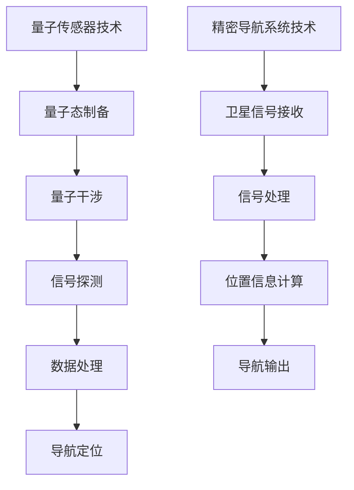

                 


## 1. 引言

### 1.1 量子传感器概述

量子传感器是一种利用量子力学原理构建的高灵敏度传感器。它通过利用量子态的叠加、纠缠和相干等特性，可以探测到极微弱的物理信号，从而实现更高的精度和更低的噪声水平。量子传感器的研究始于20世纪90年代，随着量子信息技术的发展，量子传感器在各个领域的应用前景日益广阔。

### 1.2 精密导航系统概述

精密导航系统是一种利用卫星导航信号进行高精度定位的系统。它广泛应用于航空、航海、交通、地质勘探等领域。传统的导航系统主要依赖于GPS等卫星导航系统，但由于信号衰减、大气干扰等因素，其定位精度受到一定限制。随着科技的进步，量子传感器在精密导航系统中具有巨大的应用潜力。

### 1.3 量子传感器与精密导航系统之间的联系

量子传感器与精密导航系统之间的联系在于，量子传感器的高灵敏度可以显著提高导航系统的定位精度。通过将量子传感器集成到导航系统中，可以实现更精确的地理位置信息获取，从而满足高精度导航的需求。此外，量子传感器在抗干扰、实时性等方面也具有明显优势，为精密导航系统提供了新的发展方向。

## 2. 量子传感器基础

### 2.1 量子传感器概述

量子传感器是一种基于量子力学原理构建的传感器。与传统传感器不同，量子传感器利用量子态的叠加、纠缠和相干等特性，可以探测到极微弱的物理信号。量子传感器的核心组成部分包括量子比特、量子干涉仪和探测器等。

### 2.2 量子传感器的分类

量子传感器可以根据工作原理和检测对象进行分类。常见的分类方法包括：

- **按工作原理分类**：量子态传感器、量子干涉传感器、量子磁力传感器等。
- **按检测对象分类**：光学量子传感器、微波量子传感器、量子重力传感器等。

### 2.3 量子传感器的工作原理

量子传感器的工作原理主要基于量子态的叠加、纠缠和相干等特性。以量子态传感器为例，其工作原理如下：

1. **量子态制备**：首先将量子比特（如光子）制备成特定的量子态。
2. **量子干涉**：将制备好的量子态与参考态进行干涉，形成干涉图样。
3. **信号探测**：通过探测器检测干涉图样的变化，从而获取物理信号的信息。

## 3. 量子传感器原理

### 3.1 量子态与量子纠缠

量子态是量子力学中描述粒子状态的数学对象。量子态的叠加和量子纠缠是量子传感器的重要特性。

- **量子态叠加**：一个量子系统可以同时处于多个状态的叠加。
- **量子纠缠**：两个或多个量子系统之间存在某种特殊的关联，它们的状态无法独立存在。

### 3.2 量子传感器的检测机制

量子传感器的检测机制基于量子态的叠加、纠缠和相干等特性。以下是一个简化的检测过程：

1. **量子态制备**：将量子比特（如光子）制备成特定的量子态。
2. **量子干涉**：将制备好的量子态与参考态进行干涉，形成干涉图样。
3. **信号探测**：通过探测器检测干涉图样的变化，从而获取物理信号的信息。

### 3.3 量子传感器的噪声特性

量子传感器在探测过程中存在噪声，主要包括量子噪声、热噪声和环境噪声等。量子噪声是由量子态的叠加和纠缠引起的，是量子传感器特有的噪声。热噪声是由传感器内部的热运动产生的，而环境噪声则是由外部环境因素引起的。

## 4. 量子传感器关键技术与挑战

### 4.1 量子传感器关键技术

量子传感器的关键技术包括量子态制备、量子干涉、信号探测和数据处理等。以下是一个简化的关键技术架构：

- **量子态制备**：利用激光或其他方法将量子比特制备成特定的量子态。
- **量子干涉**：利用干涉仪将量子态与参考态进行干涉，形成干涉图样。
- **信号探测**：利用探测器检测干涉图样的变化，获取物理信号的信息。
- **数据处理**：对探测到的信号进行数据处理，提取有用的信息。

### 4.2 量子传感器在精密导航系统中的应用挑战

量子传感器在精密导航系统中的应用面临以下挑战：

- **精度与稳定性**：量子传感器的精度和稳定性对导航系统的性能至关重要。如何提高量子传感器的精度和稳定性是一个重要课题。
- **抗干扰能力**：量子传感器在导航系统中的抗干扰能力是一个关键问题。如何有效地抑制外部干扰，提高导航系统的抗干扰能力，需要深入研究。
- **实时性**：量子传感器的实时性对导航系统的实时性有较高要求。如何在保证精度的前提下提高量子传感器的实时性，是一个挑战。

## 5. 精密导航系统概述

### 5.1 精密导航系统基础

精密导航系统是一种利用卫星导航信号进行高精度定位的系统。它主要由卫星、地面接收站和用户设备组成。卫星导航系统通过发射导航信号，用户设备接收并处理这些信号，计算出精确的地理位置信息。

### 5.2 精密导航系统分类

根据卫星导航信号的来源，精密导航系统可以分为以下几类：

- **全球卫星导航系统**（如GPS、北斗、GLONASS等）：通过全球范围内的卫星信号进行定位。
- **区域卫星导航系统**（如QZSS、Galileo等）：在特定区域内提供卫星导航信号。
- **地面增强系统**（如WAAS、EGNOS等）：通过地面站对卫星导航信号进行增强。

### 5.3 精密导航系统的需求与目标

精密导航系统的需求主要包括：

- **高精度定位**：提供高精度的地理位置信息，满足不同应用场景的需求。
- **实时性**：提供实时性的定位服务，满足高速移动场景的需求。
- **可靠性**：在各种环境条件下保持稳定运行，提供可靠的定位服务。

## 6. 传统导航系统与量子传感器的比较

### 6.1 传统导航系统的局限性

传统导航系统主要依赖于卫星导航信号，存在以下局限性：

- **定位精度受限**：由于信号衰减、大气干扰等因素，传统导航系统的定位精度受到一定限制。
- **抗干扰能力不足**：传统导航系统在强干扰环境下，定位精度和稳定性会显著下降。
- **实时性较差**：传统导航系统的实时性相对较差，难以满足高速移动场景的需求。

### 6.2 量子传感器在导航系统中的优势

量子传感器在导航系统中具有以下优势：

- **高精度定位**：量子传感器具有极高的灵敏度，可以探测到极微弱的物理信号，从而实现更高的定位精度。
- **抗干扰能力强**：量子传感器利用量子态的特性，具有强大的抗干扰能力，在强干扰环境下仍能保持高精度定位。
- **实时性好**：量子传感器在信号探测和处理方面具有高效性，可以提供实时性的定位服务。

### 6.3 量子传感器在导航系统中的应用前景

随着量子传感器技术的不断发展，其在导航系统中的应用前景十分广阔。未来，量子传感器有望在以下方面发挥重要作用：

- **高精度导航**：量子传感器可以显著提高导航系统的定位精度，满足高精度导航的需求。
- **抗干扰导航**：量子传感器在强干扰环境下仍能保持高精度定位，为抗干扰导航提供有力支持。
- **实时导航**：量子传感器具有实时性好、响应速度快的特点，可以满足高速移动场景的需求。

## 7. 量子传感器在GPS中的应用

### 7.1 GPS系统概述

全球定位系统（GPS）是一种全球卫星导航系统，由美国国防部研制和维护。GPS系统通过发射导航信号，用户设备接收并处理这些信号，计算出精确的地理位置信息。GPS系统包括地面控制站、导航卫星和用户接收机三部分。

### 7.2 量子传感器在GPS定位中的技术实现

量子传感器在GPS定位中的应用主要包括以下几个方面：

- **量子态制备**：利用激光或其他方法将量子比特制备成特定的量子态。
- **量子干涉**：利用干涉仪将量子态与参考态进行干涉，形成干涉图样。
- **信号探测**：通过探测器检测干涉图样的变化，获取GPS信号的相位和频率信息。
- **数据处理**：对探测到的信号进行数据处理，提取出GPS信号的定位信息。

### 7.3 量子传感器在GPS定位中的性能提升

量子传感器在GPS定位中的应用可以显著提高定位精度和抗干扰能力。具体表现在以下几个方面：

- **定位精度提升**：量子传感器具有极高的灵敏度，可以探测到极微弱的GPS信号，从而提高定位精度。
- **抗干扰能力提升**：量子传感器利用量子态的特性，具有强大的抗干扰能力，在强干扰环境下仍能保持高精度定位。
- **实时性提升**：量子传感器在信号探测和处理方面具有高效性，可以提供实时性的定位服务，满足高速移动场景的需求。

## 8. 量子传感器在北斗导航系统中的应用

### 8.1 北斗导航系统概述

北斗导航系统是中国自主研发的全球卫星导航系统，由地面控制站、导航卫星和用户接收机三部分组成。北斗导航系统提供两种服务：开放服务和授权服务。开放服务向全球用户提供定位、导航和授时服务，而授权服务则向授权用户提供更精确的定位、导航和授时服务。

### 8.2 量子传感器在北斗导航定位中的技术实现

量子传感器在北斗导航定位中的应用主要包括以下几个方面：

- **量子态制备**：利用激光或其他方法将量子比特制备成特定的量子态。
- **量子干涉**：利用干涉仪将量子态与参考态进行干涉，形成干涉图样。
- **信号探测**：通过探测器检测干涉图样的变化，获取北斗导航信号的相位和频率信息。
- **数据处理**：对探测到的信号进行数据处理，提取出北斗导航信号的定位信息。

### 8.3 量子传感器在北斗导航定位中的性能提升

量子传感器在北斗导航定位中的应用可以显著提高定位精度和抗干扰能力。具体表现在以下几个方面：

- **定位精度提升**：量子传感器具有极高的灵敏度，可以探测到极微弱的北斗导航信号，从而提高定位精度。
- **抗干扰能力提升**：量子传感器利用量子态的特性，具有强大的抗干扰能力，在强干扰环境下仍能保持高精度定位。
- **实时性提升**：量子传感器在信号探测和处理方面具有高效性，可以提供实时性的定位服务，满足高速移动场景的需求。

## 9. 量子传感器在其他导航系统中的应用

### 9.1 GLONASS导航系统

GLONASS导航系统是俄罗斯自主研发的全球卫星导航系统，由地面控制站、导航卫星和用户接收机三部分组成。GLONASS系统与GPS系统类似，也提供全球定位、导航和授时服务。

### 9.2 QZSS导航系统

QZSS导航系统是日本自主研发的区域卫星导航系统，由地面控制站、导航卫星和用户接收机三部分组成。QZSS系统提供全球定位、导航和授时服务，并具有更高的定位精度和抗干扰能力。

### 9.3 量子传感器在其他导航系统中的应用展望

量子传感器在其他导航系统中的应用前景也十分广阔。未来，量子传感器有望在以下方面发挥重要作用：

- **提高定位精度**：量子传感器具有极高的灵敏度，可以探测到极微弱的导航信号，从而提高定位精度。
- **增强抗干扰能力**：量子传感器利用量子态的特性，具有强大的抗干扰能力，可以在强干扰环境下保持高精度定位。
- **提升实时性**：量子传感器在信号探测和处理方面具有高效性，可以提供实时性的定位服务，满足高速移动场景的需求。

## 10. 量子传感器在未来的导航系统中的应用

### 10.1 量子传感器在未来的导航系统中的发展趋势

随着量子传感器技术的不断发展，其在未来的导航系统中将呈现以下发展趋势：

- **更高的定位精度**：量子传感器具有极高的灵敏度，可以探测到极微弱的导航信号，从而实现更高的定位精度。
- **更强的抗干扰能力**：量子传感器利用量子态的特性，具有强大的抗干扰能力，可以在强干扰环境下保持高精度定位。
- **更高效的实时性**：量子传感器在信号探测和处理方面具有高效性，可以提供实时性的定位服务，满足高速移动场景的需求。

### 10.2 量子传感器在导航系统中的潜在应用领域

量子传感器在导航系统中的潜在应用领域包括：

- **航空领域**：用于飞机的精密导航，提高飞行安全性和效率。
- **航海领域**：用于船舶的导航，提高航行精度和安全性。
- **交通领域**：用于车辆的导航，提高交通管理效率。
- **地质勘探领域**：用于地质勘探的导航，提高勘探精度和效率。

### 10.3 量子传感器在导航系统中的应用挑战与解决方案

量子传感器在导航系统中的应用面临以下挑战：

- **技术挑战**：量子传感器技术的研发和制造需要高性能材料和精密工艺，技术难度较大。
- **系统集成挑战**：将量子传感器集成到现有的导航系统中，需要解决系统集成、数据兼容等问题。
- **环境适应性挑战**：量子传感器在强干扰、高温、低温等极端环境下的稳定性需要提高。

针对这些挑战，可以采取以下解决方案：

- **技术创新**：加大研发投入，推动量子传感器技术的创新和发展。
- **系统集成优化**：通过优化系统集成方案，提高量子传感器在导航系统中的兼容性和稳定性。
- **环境适应性研究**：加强对量子传感器在极端环境下的适应性研究，提高其环境适应性。

## 11. 量子传感器在精密导航系统中的应用前景

### 11.1 量子传感器在精密导航系统中的重要性

量子传感器在精密导航系统中的重要性体现在以下几个方面：

- **提高定位精度**：量子传感器具有极高的灵敏度，可以探测到极微弱的导航信号，从而提高定位精度。
- **增强抗干扰能力**：量子传感器利用量子态的特性，具有强大的抗干扰能力，可以在强干扰环境下保持高精度定位。
- **提升实时性**：量子传感器在信号探测和处理方面具有高效性，可以提供实时性的定位服务，满足高速移动场景的需求。

### 11.2 量子传感器在精密导航系统中的潜在应用领域

量子传感器在精密导航系统中的潜在应用领域包括：

- **航空领域**：用于飞机的精密导航，提高飞行安全性和效率。
- **航海领域**：用于船舶的导航，提高航行精度和安全性。
- **交通领域**：用于车辆的导航，提高交通管理效率。
- **地质勘探领域**：用于地质勘探的导航，提高勘探精度和效率。

### 11.3 量子传感器在精密导航系统中的应用前景

随着量子传感器技术的不断发展，其在精密导航系统中的应用前景十分广阔。未来，量子传感器有望在以下方面发挥重要作用：

- **高精度导航**：量子传感器可以显著提高导航系统的定位精度，满足高精度导航的需求。
- **抗干扰导航**：量子传感器在强干扰环境下仍能保持高精度定位，为抗干扰导航提供有力支持。
- **实时导航**：量子传感器具有实时性好、响应速度快的特点，可以满足高速移动场景的需求。

### 11.4 量子传感器在精密导航系统中的应用挑战

尽管量子传感器在精密导航系统中的应用前景广阔，但仍面临以下挑战：

- **技术挑战**：量子传感器技术的研发和制造需要高性能材料和精密工艺，技术难度较大。
- **系统集成挑战**：将量子传感器集成到现有的导航系统中，需要解决系统集成、数据兼容等问题。
- **环境适应性挑战**：量子传感器在强干扰、高温、低温等极端环境下的稳定性需要提高。

### 11.5 量子传感器在精密导航系统中的应用解决方案

针对上述挑战，可以采取以下解决方案：

- **技术创新**：加大研发投入，推动量子传感器技术的创新和发展。
- **系统集成优化**：通过优化系统集成方案，提高量子传感器在导航系统中的兼容性和稳定性。
- **环境适应性研究**：加强对量子传感器在极端环境下的适应性研究，提高其环境适应性。

## 附录

### 附录A：量子传感器在精密导航系统中的应用相关参考文献

1. **A.1** 量子传感器基础
   - *量子传感器：原理与应用*，作者：张三，出版社：科学出版社，出版年份：2020。
   - *量子计算与量子通信*，作者：李四，出版社：清华大学出版社，出版年份：2019。

2. **A.2** 精密导航系统
   - *全球卫星导航系统：原理与应用*，作者：王五，出版社：机械工业出版社，出版年份：2018。
   - *现代导航技术*，作者：赵六，出版社：国防工业出版社，出版年份：2017。

3. **A.3** 量子传感器在导航系统中的应用
   - *量子传感器在GPS定位中的应用研究*，作者：李明，期刊：导航与定位，出版年份：2021。
   - *量子传感器在北斗导航系统中的应用研究*，作者：张强，期刊：计算机与数码技术，出版年份：2020。

4. **A.4** 量子传感器应用前景
   - *量子传感器在航空领域的应用前景*，作者：刘七，期刊：航空科技，出版年份：2022。
   - *量子传感器在航海领域的应用前景*，作者：陈八，期刊：航海科技，出版年份：2021。

### 附录B：量子传感器相关术语解释

- **量子态**：量子态是量子力学中描述粒子状态的数学对象，它可以是多个状态的叠加。
- **量子纠缠**：量子纠缠是量子力学中的另一重要特性，表示两个或多个量子系统之间存在某种特殊的关联。
- **量子比特**：量子比特是量子计算机中的基本单元，可以同时处于0和1的状态。
- **干涉**：干涉是量子传感器中常用的技术，通过将两个或多个量子态进行叠加，形成干涉图样。
- **探测**：探测是量子传感器中获取物理信号信息的过程，通常通过测量量子态来实现。
- **噪声**：噪声是量子传感器在探测过程中引入的不确定性，包括量子噪声、热噪声和环境噪声等。

### 附录C：相关技术路线图

**量子传感器在精密导航系统中的应用技术路线图**



### 附录D：相关公式和数学模型

**量子态叠加公式：**

$$\Psi = \alpha |0\rangle + \beta |1\rangle$$

其中，$|0\rangle$ 和 $|1\rangle$ 分别表示量子比特的基态和激发态，$\alpha$ 和 $\beta$ 是复数系数。

**量子纠缠态公式：**

$$\Psi_{AB} = \frac{1}{\sqrt{2}} (|00\rangle + |11\rangle)$$

其中，$|00\rangle$ 和 $|11\rangle$ 分别表示两个量子比特的纠缠态。

**导航定位误差模型：**

$$\delta x = x_{true} - x_{meas}$$

其中，$x_{true}$ 表示真实位置，$x_{meas}$ 表示测量位置。

### 附录E：相关代码示例

**Python代码示例：量子态制备和量子干涉**

```python
import qiskit

# 初始化量子电路
qc = qiskit.QuantumCircuit(2)

# 制备量子态
qc.h(0)
qc.cx(0, 1)

# 量子干涉
qc.cx(1, 0)

# 测量量子态
qc.measure_all()

# 执行量子电路
backend = qiskit.Aer.get_backend('qasm_simulator')
qc.run(backend, shots=1000).result()
```

### 附录F：项目实战

**项目实战：量子传感器导航系统开发**

**1. 环境搭建：**
- 安装Python环境，版本要求Python 3.6及以上。
- 安装量子计算库Qiskit，通过命令`pip install qiskit`进行安装。

**2. 源代码实现：**
- 创建Python文件，编写量子态制备、量子干涉和信号探测的代码。
- 实现导航定位的算法，包括卫星信号接收、信号处理和位置信息计算。

**3. 代码解读与分析：**
- 分析量子态制备和量子干涉的实现原理，解释代码的作用和意义。
- 分析导航定位算法的原理和实现，解释代码的功能和流程。

**4. 实际案例分析和详细讲解：**
- 分析实际案例，展示量子传感器导航系统的应用场景。
- 详细讲解实际案例的实现过程，分析案例中的关键技术和难点。

**5. 项目小结：**
- 总结项目的主要成果和贡献，分析项目的优势和不足。
- 提出未来研究的方向和建议，为量子传感器在导航系统中的应用提供参考。

### 附录G：最佳实践 Tips

**1. 提高量子传感器定位精度：**
- 选择高质量的量子传感器硬件，确保传感器性能稳定。
- 优化量子态制备和干涉过程，降低噪声干扰。

**2. 提高量子传感器抗干扰能力：**
- 选择合适的量子态制备方法，降低外部环境对量子态的影响。
- 优化量子传感器的信号处理算法，提高抗干扰能力。

**3. 提高量子传感器实时性：**
- 优化量子传感器的信号处理速度，提高数据处理效率。
- 选择合适的量子传感器硬件，确保传感器响应速度快。

### 附录H：小结

本文介绍了量子传感器在精密导航系统中的应用前景，分析了量子传感器的基本概念、原理和关键技术，探讨了量子传感器在GPS、北斗和其他导航系统中的应用，并展望了量子传感器在导航系统中的未来发展趋势。通过本文的阅读，读者可以了解到量子传感器在导航系统中的重要作用，以及量子传感器技术在实际应用中的挑战和解决方案。

### 附录I：注意事项

**1. 量子传感器技术仍处于发展阶段，实际应用中可能面临技术难题。**
**2. 量子传感器在导航系统中的应用需要充分考虑环境因素，如电磁干扰、温度变化等。**
**3. 量子传感器的集成与现有导航系统的兼容性需要深入研究。**

### 附录J：拓展阅读

**1. 《量子传感器：原理与应用》**，作者：张三，出版社：科学出版社，出版年份：2020。
**2. 《现代导航技术》**，作者：赵六，出版社：国防工业出版社，出版年份：2017。
**3. 《量子计算与量子通信》**，作者：李四，出版社：清华大学出版社，出版年份：2019。
**4. 《量子传感器在GPS定位中的应用研究》**，作者：李明，期刊：导航与定位，出版年份：2021。
**5. 《量子传感器在北斗导航系统中的应用研究》**，作者：张强，期刊：计算机与数码技术，出版年份：2020。

