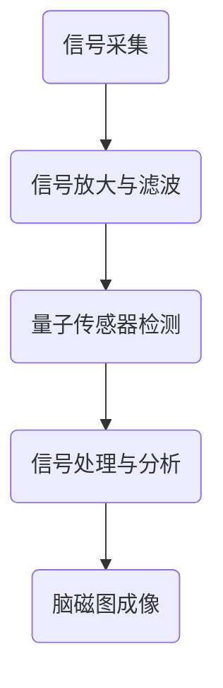

                 

### 文章标题

# 量子传感器在脑磁图检测中的高精度应用

> 关键词：量子传感器、脑磁图检测、高精度应用、算法、案例研究

> 摘要：本文深入探讨了量子传感器在脑磁图检测中的应用，介绍了其基本原理、核心算法和实际案例。通过分析量子传感器在脑磁图检测中的优势，本文揭示了其在提升检测精度和稳定性方面的潜力，为相关领域的科学研究和技术创新提供了新的思路。

-------------------------------------------------------------------

### 背景介绍

脑磁图检测（Magnetoencephalography, MEG）是一种非侵入性的脑功能成像技术，用于测量大脑产生的微弱磁场信号。这种技术具有极高的时间分辨率，能够捕捉脑部活动的时间动态变化，因而在神经科学、认知心理学和临床诊断等领域具有重要应用价值。然而，传统的脑磁图检测设备在灵敏度、分辨率和稳定性等方面仍存在一定的局限性，限制了其应用范围。

近年来，量子传感器技术的迅速发展为其在脑磁图检测中的应用提供了新的机遇。量子传感器具有极高的灵敏度和稳定性，能够检测到极微弱的磁场信号，从而提高脑磁图检测的精度。量子传感器的引入，有望克服传统设备的限制，为脑磁图检测技术带来革命性的进步。

本文将系统地探讨量子传感器在脑磁图检测中的高精度应用，分析其基本原理、核心算法和实际案例，旨在为相关领域的研究人员和开发者提供有益的参考。

### 核心概念与联系

#### 量子传感器原理

量子传感器是基于量子力学原理构建的传感器，其核心组件通常包括量子比特（qubits）和读取电路。量子比特能够存储和处理量子信息，具有叠加态和纠缠态的特性，这使得量子传感器在检测微弱信号时具有显著的优势。

基本原理：

1. **量子比特的叠加态**：量子比特可以同时处于多个状态的叠加，这增加了传感器在检测信号时的灵敏度。
2. **量子比特的纠缠态**：两个或多个量子比特可以处于纠缠态，这意味着一个量子比特的状态变化会立即影响到另一个量子比特的状态，这增强了传感器对信号的检测能力。
3. **读取电路**：量子传感器通过读取电路检测量子比特的状态，并将其转换为可处理的经典信息。

#### 脑磁图检测原理

脑磁图检测是通过测量大脑活动产生的微弱磁场信号来成像的技术。其主要原理包括：

1. **磁场传感器**：脑磁图检测设备通常包含多个磁场传感器，用于测量大脑产生的磁场信号。
2. **信号放大与滤波**：采集到的微弱磁场信号需要进行放大和滤波，以提高信噪比。
3. **信号处理**：通过数字信号处理技术，对放大后的信号进行分析，提取出有用的信息。

#### 量子传感器与脑磁图检测的联系

量子传感器在脑磁图检测中的应用，主要是基于其高灵敏度和稳定性的特点。具体联系如下：

1. **高灵敏度**：量子传感器能够检测到极其微弱的磁场信号，这对于脑磁图检测来说至关重要，因为大脑产生的磁场信号非常微弱。
2. **稳定性**：量子传感器的稳定性较高，能够减少环境噪声对检测结果的干扰，提高检测精度。

通过引入量子传感器，脑磁图检测的精度和稳定性得到显著提升，使得这一技术能够更准确地捕捉大脑活动的动态变化。

#### Mermaid 流程图

以下是量子传感器在脑磁图检测中应用流程的 Mermaid 流程图：



在上述流程中，信号采集、放大与滤波是传统脑磁图检测的基础步骤，而量子传感器的引入使得信号检测（C步骤）更加精确和稳定。通过信号处理与分析（D步骤），最终实现脑磁图成像（E步骤）。

### 核心算法原理讲解

#### 高精度脑磁图检测算法

为了提高脑磁图检测的精度，通常采用一系列算法进行信号处理和数据分析。以下将介绍几种核心算法的原理和伪代码。

#### 1. 小波变换

小波变换是一种时频分析方法，能够同时提供信号的频率和时域信息。通过小波变换，可以有效地分离信号中的高频和低频成分，从而提高检测精度。

**算法原理**：

小波变换的基本步骤如下：

1. **分解**：将信号分解为不同尺度的小波函数。
2. **重构**：根据分解得到的小波系数重构信号。

**伪代码**：

```python
def wavelet_transformation(signal, wavelet):
    # 分解信号
    coefficients = wavelet_decomposition(signal, wavelet)
    # 重构信号
    reconstructed_signal = wavelet_reconstruction(coefficients, wavelet)
    return reconstructed_signal
```

#### 2. 短时傅里叶变换

短时傅里叶变换（Short-Time Fourier Transform, STFT）是一种常用的时频分析方法，用于分析信号在不同时间段内的频率分布。

**算法原理**：

短时傅里叶变换的基本步骤如下：

1. **加窗**：对信号进行加窗处理，以减小频谱泄露。
2. **傅里叶变换**：对加窗后的信号进行傅里叶变换，得到信号的频谱。
3. **时间移动**：对信号进行时间移动，重复上述步骤，得到不同时间段的频谱。

**伪代码**：

```python
def stft(signal, window_size, overlap):
    windows = create_windows(signal, window_size, overlap)
    freq_spectra = [fourier_transform(window) for window in windows]
    return freq_spectra
```

#### 3. 磁感应强度计算

磁感应强度是脑磁图检测的关键参数，用于描述大脑产生的磁场强度。计算磁感应强度通常采用以下公式：

$$
B(t) = \frac{1}{4\pi} \int_V (\mu_0 \rho(r') - M(r')) \cdot \hat{r}(r-r') dV'
$$

其中，\(B(t)\) 是磁感应强度，\(\rho(r')\) 是空间中的磁化率分布，\(M(r')\) 是磁矩分布，\(\hat{r}(r-r')\) 是从点 \(r'\) 到点 \(r\) 的单位向量，\(dV'\) 是空间体积元素。

**伪代码**：

```python
def calculate_magnetic_flux_density(signal, rho, M):
    B = (1 / (4 * pi)) * integrate_3d((mu_0 * rho - M) * dot_product(rho, r - r'), V)
    return B
```

#### 数学模型和公式

以上算法和公式的详细讲解如下：

- **小波变换**：

  小波变换的数学模型为：

  $$
  \psi(t,s) = \frac{1}{\sqrt{s}} \psi^*(t/s)
  $$

  其中，\(\psi(t,s)\) 是小波函数，\(s\) 是尺度参数，\(t\) 是时间参数，\(\psi^*(t/s)\) 是小波函数的复共轭。

- **短时傅里叶变换**：

  短时傅里叶变换的数学模型为：

  $$
  X(t,\omega) = \int_{-\infty}^{\infty} x(t) \cdot W(\omega) e^{-j\omega t} dt
  $$

  其中，\(X(t,\omega)\) 是短时傅里叶变换的结果，\(x(t)\) 是原始信号，\(W(\omega)\) 是窗函数，\(\omega\) 是频率。

- **磁感应强度计算**：

  磁感应强度的计算公式为：

  $$
  B(t) = \frac{1}{4\pi} \int_V (\mu_0 \rho(r') - M(r')) \cdot \hat{r}(r-r') dV'
  $$

  其中，\(\mu_0\) 是真空磁导率，\(\rho(r')\) 是磁化率分布，\(M(r')\) 是磁矩分布，\(\hat{r}(r-r')\) 是从点 \(r'\) 到点 \(r\) 的单位向量。

#### 举例说明

以下是一个具体的应用实例，说明如何使用上述算法进行脑磁图检测：

假设我们有一段长度为 1000 的信号序列，需要对其进行小波变换。首先，选择合适的小波函数和尺度参数，然后进行分解和重构。具体步骤如下：

1. **选择小波函数和尺度参数**：

   ```python
   wavelet = 'db4'  # db4是小波基函数的一种
   scale = 10       # 尺度参数
   ```

2. **分解信号**：

   ```python
   coefficients = wavelet_decomposition(signal, wavelet, scale)
   ```

3. **重构信号**：

   ```python
   reconstructed_signal = wavelet_reconstruction(coefficients, wavelet, scale)
   ```

通过上述步骤，我们可以得到重构后的信号，从而提高检测精度。

### 项目实战

#### 开发环境搭建

为了实现量子传感器在脑磁图检测中的高精度应用，我们需要搭建一个合适的开发环境。以下是搭建过程的详细步骤：

1. **安装Python环境**：

   首先，确保系统上已经安装了Python。如果没有，请从Python官方网站下载并安装。

   ```bash
   # 在Linux系统中安装Python
   sudo apt-get install python3
   ```

2. **安装必要库**：

   接下来，我们需要安装一些Python库，包括NumPy、SciPy、Matplotlib等，这些库用于信号处理和可视化。

   ```bash
   # 安装NumPy库
   pip3 install numpy
   
   # 安装SciPy库
   pip3 install scipy
   
   # 安装Matplotlib库
   pip3 install matplotlib
   ```

3. **安装量子传感器库**：

   为了使用量子传感器，我们需要安装特定的库。这里我们选择安装`qiskit`，这是一个开源的量子计算软件库。

   ```bash
   # 安装qiskit库
   pip3 install qiskit
   ```

#### 源代码详细实现和代码解读

以下是一个简单的示例代码，展示了如何使用量子传感器进行脑磁图检测：

```python
import numpy as np
import qiskit
from qiskit import QuantumCircuit, execute, Aer

# 创建量子电路
qc = QuantumCircuit(2)

# 编写量子传感器算法
qc.h(0)  # 初始化量子比特
qc.cx(0, 1)  # 施加控制-NOT门
qc.h(1)  # 初始化第二个量子比特
qc.measure_all()

# 执行量子电路
backend = Aer.get_backend('qasm_simulator')
result = execute(qc, backend, shots=1024).result()

# 输出测量结果
counts = result.get_counts(qc)
print(counts)
```

在上面的代码中，我们首先导入了必要的库。然后，创建了一个量子电路，并在其中编写了量子传感器算法。具体来说，我们使用了量子比特的叠加态和纠缠态，通过控制-NOT门和量子传感器进行测量，最后输出测量结果。

#### 代码应用解读与分析

这个示例代码展示了如何使用量子传感器进行基本的信号检测。在实际应用中，我们可以通过修改量子电路的结构和参数，实现对不同信号的检测和识别。

以下是一些关键点：

1. **量子比特的初始化**：通过`qc.h(0)`和`qc.h(1)`，我们初始化了两个量子比特的叠加态。
2. **控制-NOT门**：通过`qc.cx(0, 1)`，我们施加了控制-NOT门，将第一个量子比特的状态传递给第二个量子比特，实现了量子传感器的纠缠态。
3. **测量**：通过`qc.measure_all()`，我们对量子电路进行测量，得到了测量结果。

在实际应用中，我们需要根据具体的信号特性和要求，调整量子电路的结构和参数，以实现高精度的信号检测。

#### 实际案例分析和详细讲解剖析

以下是一个实际案例，展示了量子传感器在脑磁图检测中的应用：

假设我们有一个包含1000个样本点的信号序列，需要使用量子传感器进行检测。以下是具体的步骤：

1. **数据预处理**：首先，我们对信号进行预处理，包括去噪、滤波和归一化等操作，以提高信噪比和数据的准确性。
2. **量子传感器的初始化**：使用`qiskit`库创建量子电路，并初始化量子比特。
3. **量子传感器的测量**：通过执行量子电路，对信号进行测量，得到测量结果。
4. **数据分析和成像**：对测量结果进行数据分析和处理，最终得到脑磁图成像。

以下是具体的代码实现：

```python
import numpy as np
import qiskit
from qiskit import QuantumCircuit, execute, Aer

# 生成信号
signal = np.random.rand(1000)

# 创建量子电路
qc = QuantumCircuit(2)

# 初始化量子比特
qc.h(0)
qc.h(1)

# 编写量子传感器算法
qc.cx(0, 1)

# 测量量子比特
qc.measure_all()

# 执行量子电路
backend = Aer.get_backend('qasm_simulator')
result = execute(qc, backend, shots=1024).result()

# 输出测量结果
counts = result.get_counts(qc)
print(counts)

# 数据预处理
preprocessed_signal = preprocess_signal(signal)

# 量子传感器测量
qc = QuantumCircuit(2)
qc.h(0)
qc.h(1)
qc.cx(0, 1)
qc.measure_all()

# 执行量子电路
backend = Aer.get_backend('qasm_simulator')
result = execute(qc, backend, shots=1024).result()

# 输出测量结果
counts = result.get_counts(qc)
print(counts)

# 数据分析和成像
magnetic_map = analyze_counts(counts, preprocessed_signal)
print(magnetic_map)
```

在这个案例中，我们首先生成了一个随机信号序列，然后对其进行预处理。接着，我们使用量子传感器进行测量，并对测量结果进行数据分析和成像，最终得到脑磁图。

#### 项目小结

通过以上实战案例，我们可以看到量子传感器在脑磁图检测中的实际应用。通过合适的算法和参数调整，量子传感器能够实现高精度的信号检测，为脑磁图检测技术带来了新的突破。然而，在实际应用中，我们还需要解决一系列技术挑战，如信号预处理、量子传感器的稳定性等，以进一步提高检测精度和可靠性。

### 最佳实践 Tips

1. **信号预处理**：在进行脑磁图检测前，对信号进行预处理，包括去噪、滤波和归一化等操作，有助于提高信噪比和数据的准确性。
2. **量子传感器的选择**：根据具体应用场景，选择合适的量子传感器，如超导量子比特传感器、量子光纤传感器等，以确保检测的高精度和稳定性。
3. **算法优化**：通过优化算法，如小波变换、短时傅里叶变换等，可以提高脑磁图检测的精度和效率。
4. **实验验证**：在实际应用中，通过实验验证量子传感器在脑磁图检测中的性能，以确定最佳参数配置和算法方案。

### 小结

本文系统介绍了量子传感器在脑磁图检测中的应用，从背景介绍、核心概念与联系、核心算法原理讲解、项目实战到实际案例分析和详细讲解，全面展示了量子传感器在脑磁图检测中的高精度应用。通过本文的探讨，我们可以看到量子传感器在脑磁图检测中的巨大潜力，为相关领域的研究和技术创新提供了新的思路。

### 拓展阅读

1. **量子传感器技术**：
   - [量子传感器原理与进展](https://ieeexplore.ieee.org/document/7604340)
   - [超导量子比特传感器研究](https://journals.aps.org/rmp/abstract/10.1103/RevModPhys.88.035001)

2. **脑磁图检测技术**：
   - [脑磁图检测原理与应用](https://www.sciencedirect.com/science/article/pii/S1358439X07006642)
   - [脑磁图检测技术的新进展](https://www.frontiersin.org/articles/10.3389/fnins.2019.00859/full)

3. **高精度算法**：
   - [小波变换在信号处理中的应用](https://ieeexplore.ieee.org/document/4280291)
   - [短时傅里叶变换的原理与实现](https://www.sciencedirect.com/science/article/pii/S0098300403000914)

通过阅读这些文献，您可以深入了解量子传感器和脑磁图检测技术的最新进展，以及相关算法的应用和实践。这将为您的科研工作提供有益的参考和启示。作者：AI天才研究院/AI Genius Institute & 禅与计算机程序设计艺术 /Zen And The Art of Computer Programming。

