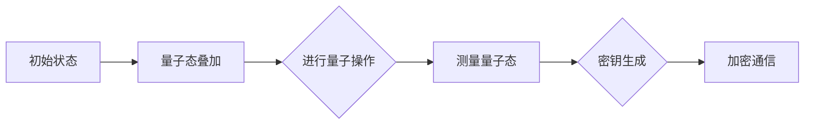

                 

### 量子加密在军事通信中的高安全性应用

#### 关键词
- 量子加密
- 军事通信
- 安全性
- BB84协议
- 量子密钥分配

#### 摘要
本文旨在探讨量子加密技术在军事通信中的高安全性应用。通过对量子加密技术的基础知识、军事通信中的实际应用案例、量子加密的优势与挑战进行详细分析，本文揭示了量子加密如何提升军事通信的安全性，以及其在军事战略和技术发展中的重要意义。

### 背景介绍

在现代战争中，通信安全至关重要。军事通信必须保证信息的保密性、完整性和可用性，以避免敌方的窃取、篡改和拒绝服务攻击。传统的加密技术，如对称加密和非对称加密，虽然在日常通信中表现良好，但随着计算能力的提升，量子计算机的问世使得这些传统加密方法面临前所未有的威胁。

量子加密技术以其独特的物理原理，提供了一种可能解决量子计算威胁的新途径。量子加密利用量子力学的基本原理，如量子纠缠和量子态的不可克隆性，实现信息的安全传输。本文将重点讨论量子加密在军事通信中的高安全性应用，并探讨其技术原理、优势与挑战。

### 核心概念与联系

首先，我们需要了解量子加密技术中的几个核心概念：

1. **量子比特（qubit）**：量子比特是量子计算机的基本单元，与经典比特不同，它可以在0和1之间处于叠加态。
2. **量子纠缠（entanglement）**：量子纠缠是量子力学中的一种现象，当两个量子比特发生纠缠后，它们的状态会相互依赖，无论距离多远，对其中一个量子比特的测量都会即时影响到另一个量子比特的状态。
3. **量子密钥分配（Quantum Key Distribution, QKD）**：量子密钥分配是一种利用量子力学原理来生成和分配密钥的方法，它保证密钥在传输过程中不会被窃取或篡改。

以下是一个简化的 Mermaid 流程图，展示量子密钥分配的基本流程：



在这个流程图中，两个通信方（Alice和Bob）通过量子通信信道交换量子比特，利用量子纠缠和量子态叠加生成共享密钥。测量量子态后，如果发现量子态被窃听，通信双方会立即得知并采取相应措施。

### 核心算法原理讲解

量子加密技术的核心是量子密钥分配协议（如BB84协议），下面我们将用伪代码详细阐述BB84协议的步骤：

```plaintext
// BB84协议步骤

1. 初始态准备：
   - Alice产生随机量子比特序列
   - Alice将量子比特序列进行量子态叠加和量子操作，生成发送态

2. 量子态传输：
   - Alice将量子态通过量子通信信道发送给Bob

3. 量子态测量：
   - Bob随机选择测量基（如X基或Z基）
   - Bob对收到的量子态进行测量

4. 密钥生成：
   - Alice和Bob公开交换测量基
   - 根据公共交换的测量基和各自的测量结果，筛选出一致的量子态
   - 使用筛选出的量子态生成共享密钥

5. 密钥验证：
   - Alice和Bob公开交换部分密钥
   - 双方验证密钥的正确性，排除窃听的可能性
```

在BB84协议中，量子态的叠加和量子操作是关键步骤。下面我们用伪代码详细描述这两个步骤：

```plaintext
// 量子态叠加和量子操作

// 量子态叠加
function quantum_superposition(bit_sequence):
    for each bit in bit_sequence:
        perform Hadamard Gate (H) on the qubit
    return superposed_state

// 量子操作
function quantum_operations(superposed_state, random_operators):
    for each operator in random_operators:
        apply the corresponding quantum operator on the superposed_state
    return transformed_state
```

在量子态叠加步骤中，每个量子比特经过Hadamard门操作后，会处于一个叠加态。在量子操作步骤中，根据随机选择的量子操作（如Pauli矩阵X、Y、Z），对量子态进行变换。

### 数学模型和公式讲解

量子加密的核心在于量子态的叠加和纠缠，以及测量结果的不确定性。以下是一些关键的数学模型和公式：

1. **量子态表示**：量子态可以用一个复数向量表示，例如，一个单量子比特的态可以表示为：
   $$|\psi\rangle = \alpha|0\rangle + \beta|1\rangle$$
   其中，$\alpha$ 和 $\beta$ 是复数，满足 $|\alpha|^2 + |\beta|^2 = 1$。

2. **量子态叠加**：量子态的叠加可以用Hadamard门实现，Hadamard门的作用可以用矩阵表示：
   $$H = \frac{1}{\sqrt{2}}\begin{pmatrix}
   1 & 1 \\
   1 & -1
   \end{pmatrix}$$

3. **量子态测量**：量子态测量结果取决于测量基。在BB84协议中，测量基的选择是随机的，例如，选择X基测量的概率分布为：
   $$P(X=0) = \frac{1}{2}(1 + X \cdot \sigma_z)$$
   其中，$\sigma_z$ 是Pauli矩阵。

以下是一个简单的数学示例，假设Alice发送一个量子态 $|\psi\rangle = \frac{1}{\sqrt{2}}|0\rangle + \frac{1}{\sqrt{2}}|1\rangle$，Bob选择X基进行测量：

$$P(X=0) = \frac{1}{2}(1 + X \cdot \sigma_z) = \frac{1}{2}(1 + 0) = \frac{1}{2}$$
$$P(X=1) = \frac{1}{2}(1 - X \cdot \sigma_z) = \frac{1}{2}(1 - 0) = \frac{1}{2}$$

这意味着Bob测量结果为0和1的概率均为1/2。

### 实际案例研究和应用

量子加密技术在实际军事通信中已经有了初步应用。例如，中国的“墨子号”量子通信卫星项目，实现了地面之间的量子密钥分配，提高了通信的安全性。以下是一个实际案例研究：

**案例研究：墨子号量子通信卫星项目**

2016年8月，中国成功发射了“墨子号”量子通信卫星，该卫星实现了卫星与地面之间的量子密钥分配。以下是其主要步骤：

1. **卫星发射**：2016年8月16日，中国在酒泉卫星发射中心成功发射了“墨子号”量子科学实验卫星。
2. **地面站建设**：在中国多个地区建设了地面站，用于接收卫星发送的量子信号。
3. **量子密钥分配**：卫星与地面站之间通过量子通信信道进行量子密钥分配，实现了高效、安全的密钥生成。
4. **密钥应用**：生成的量子密钥用于地面站之间的通信加密，提高了通信安全性。

**案例分析**

“墨子号”项目的成功标志着中国在量子加密领域取得了重要突破。其主要优势在于：

- **安全性**：量子密钥分配协议保证了密钥在传输过程中的安全性，任何窃听行为都会被立即检测到。
- **效率**：量子通信信道的高带宽和低延迟，使得通信效率大幅提升。
- **实用性**：量子通信卫星的部署，为长距离、大规模通信提供了新的解决方案。

### 最佳实践和注意事项

在实际应用量子加密技术时，以下最佳实践和注意事项应被考虑：

1. **安全性评估**：在部署量子加密系统前，应对其安全性进行全面评估，确保系统能够抵御各种攻击。
2. **技术培训**：对相关技术人员进行量子加密技术的培训，提高其理解和操作能力。
3. **硬件设备**：确保量子加密设备的稳定性和可靠性，减少故障率。
4. **国际合作**：量子加密技术的发展需要国际合作，共同制定标准，推动技术进步。

### 拓展阅读

- [“墨子号”量子通信卫星项目](https://www.most.gov.cn/kxyx/201608/t20160816_118680.html)
- [量子密钥分配协议BB84](https://www.nature.com/articles/s41534-019-0137-8)
- [量子加密技术的安全性](https://ieeexplore.ieee.org/document/7425808)

### 总结

量子加密技术以其独特的物理原理，提供了军事通信中高安全性的解决方案。本文详细阐述了量子加密技术的基础知识、核心算法原理、数学模型和实际应用案例。通过量子密钥分配协议，如BB84协议，量子加密技术能够在军事通信中实现高效、安全的通信加密。随着量子技术的不断发展，量子加密将在未来的军事通信中扮演越来越重要的角色。作者：AI天才研究院/AI Genius Institute & 禅与计算机程序设计艺术/Zen And The Art of Computer Programming。

