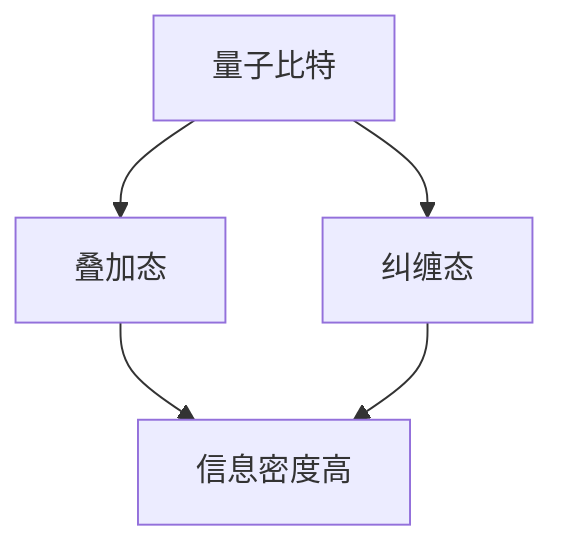
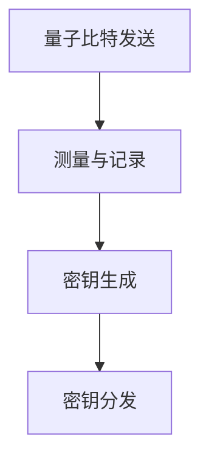
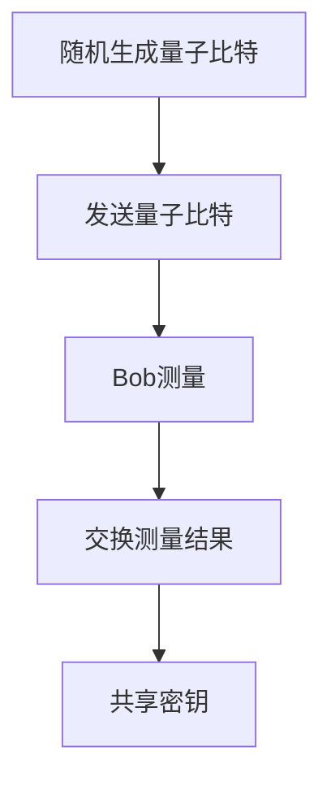
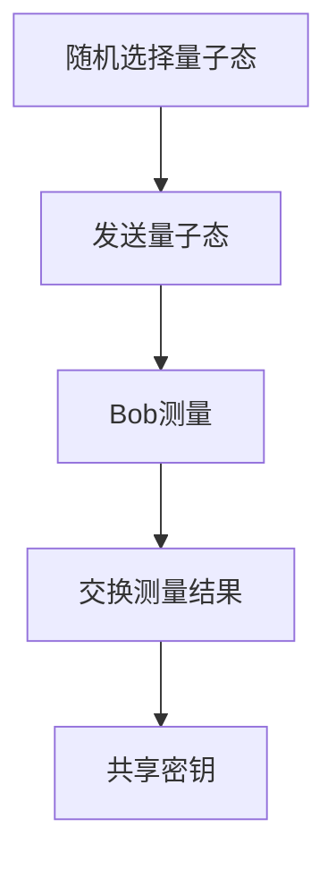
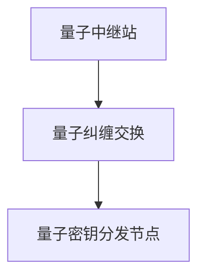

                 

### 量子安全通信的未来发展方向

#### 关键词

- 量子通信
- 量子密钥分发
- 量子通信网络
- 量子安全
- 国际合作

#### 摘要

本文将探讨量子安全通信的未来发展方向，从基础理论、技术发展、国际合作等多个维度进行分析。首先，我们将回顾量子通信的原理和历史背景，接着深入探讨量子密钥分发技术及其应用。然后，文章将分析量子通信网络的发展趋势和挑战，以及量子安全通信与经典通信的比较和融合。最后，我们将展望量子安全通信的国际合作趋势和未来前景。

#### 目录

1. **量子通信原理与历史背景**
   1.1 量子通信的基本概念
   1.2 量子通信的历史背景
   1.3 中国在量子通信领域的突破

2. **量子密钥分发技术**
   2.1 量子密钥分发的原理
   2.2 量子密钥分发的应用

3. **量子通信网络**
   3.1 量子通信网络的概述
   3.2 量子通信网络的应用前景

4. **量子安全通信与经典通信的比较**
   4.1 量子安全通信与经典通信的优势与劣势
   4.2 量子安全通信与经典通信的结合

5. **量子安全通信的国际合作**
   5.1 全球量子安全通信的合作现状
   5.2 量子安全通信的国际合作趋势

6. **量子安全通信的挑战与机遇**
   6.1 量子安全通信的技术挑战
   6.2 量子安全通信的市场机遇

7. **量子安全通信的未来发展预测**
   7.1 量子安全通信的未来发展趋势
   7.2 量子安全通信对未来的影响

---

## 第一部分：量子安全通信基础

### 第1章：量子通信原理与历史背景

#### 1.1 量子通信的基本概念

量子通信是一种基于量子力学原理进行信息传输的技术。与经典通信不同，量子通信利用量子比特（qubit）进行信息编码，而非传统的经典比特（classical bit）。量子比特具有叠加态和纠缠态的特性，使得量子通信在理论上具有无法被破解的安全性。

##### 1.1.1 量子比特与经典比特

量子比特可以同时处于0和1的状态，这种叠加态使得量子比特具有极高的信息密度。而经典比特则只能处于0或1的状态。例如，一个量子比特可以同时表示两种状态，而两个经典比特只能表示四种状态。

##### 1.1.2 量子纠缠与量子隐形传态

量子纠缠是指两个或多个量子系统之间存在的强烈相关性，即使它们相隔很远，其中一个系统的状态变化也会立即影响到另一个系统。量子隐形传态则是利用量子纠缠实现信息传输的过程，可以将一个量子比特的状态准确无误地传输到另一个量子比特。

##### 1.1.3 量子密钥分发

量子密钥分发（Quantum Key Distribution，QKD）是一种基于量子力学原理的安全通信技术，通过量子通信渠道分发共享密钥，使得密钥在传输过程中具有无法被窃听的特性。QKD系统主要基于BB84协议和E91协议。

#### 1.2 量子通信的历史背景

量子通信的历史可以追溯到20世纪70年代，当时理论物理学家Richard Feynman和Charles H. Bennett等人首次提出了量子计算机的概念。随着量子力学研究的深入，量子通信的理论基础逐渐成熟。

##### 1.2.1 量子通信的早期研究

20世纪80年代，美国的Charles H. Bennett和德国的Giorgio Milburn等科学家提出了量子密钥分发的基本原理。同时，中国科学家潘建伟等人也在量子通信领域取得了重要突破。

##### 1.2.2 量子密钥分发的发展

20世纪90年代，量子密钥分发技术逐渐走向实用化。2004年，潘建伟团队成功实现了100公里光纤上的量子密钥分发实验，标志着量子通信技术的重大突破。

##### 1.2.3 中国在量子通信领域的突破

近年来，中国在量子通信领域取得了显著成就。2016年，中国成功发射了世界首颗量子科学实验卫星“墨子号”，实现了千公里级的量子密钥分发。

### 第2章：量子密钥分发技术

量子密钥分发是一种基于量子力学原理实现安全通信的技术，其核心思想是通过量子通信渠道分发共享密钥，使得密钥在传输过程中具有无法被窃听的特性。下面我们将深入探讨量子密钥分发的原理和应用。

#### 2.1 量子密钥分发的原理

量子密钥分发主要基于BB84协议和E91协议。

##### 2.1.1 BB84协议

BB84协议是一种基于量子纠缠的量子密钥分发协议。它由物理学家Charles H. Bennett和Gilles Brassard于1984年提出。BB84协议的工作原理如下：

1. 发送方（Alice）随机生成一系列量子比特，并将其通过量子通信渠道发送给接收方（Bob）。
2. Bob在接收量子比特后，随机选择一种测量基（X基或Z基）进行测量。
3. Alice和Bob通过经典通信渠道交换测量结果。
4. 根据测量结果，Alice和Bob共享一个共享密钥。

##### 2.1.2 E91协议

E91协议是基于量子纠缠的另一种量子密钥分发协议，由物理学家Artur Ekert于1991年提出。E91协议的工作原理如下：

1. 发送方（Alice）随机选择一个量子态（例如，一个处于纠缠态的量子比特对）并将其发送给接收方（Bob）。
2. Bob在接收量子态后，随机选择一个基（例如，X基或Z基）对量子态进行测量。
3. Alice和Bob通过经典通信渠道交换测量结果。
4. 根据测量结果，Alice和Bob共享一个共享密钥。

#### 2.2 量子密钥分发的应用

量子密钥分发技术已经应用于多个领域，包括网络安全、金融安全和政府通信等。

##### 2.2.1 在网络安全中的应用

量子密钥分发技术可以显著提高网络通信的安全性，防止数据在传输过程中被窃听或篡改。例如，量子密钥分发可以应用于金融机构的数据传输，确保交易信息的安全性。

##### 2.2.2 在金融安全中的应用

量子密钥分发技术可以用于金融交易的安全加密，防止交易数据被恶意攻击者窃取。例如，量子密钥分发可以应用于银行系统中的数据传输，确保用户账户信息的安全性。

##### 2.2.3 在政府通信中的应用

量子密钥分发技术可以应用于政府通信的安全加密，确保政府机密信息的安全性。例如，量子密钥分发可以应用于国家机密信息的传输，防止敌对方窃取和破解。

### 第3章：量子通信网络

量子通信网络是一种基于量子通信技术构建的通信网络，其目的是实现全球范围内的高安全性通信。下面我们将探讨量子通信网络的概述和应用前景。

#### 3.1 量子通信网络的概述

量子通信网络主要由以下几个部分组成：

1. **量子中继站**：量子中继站是量子通信网络的核心组成部分，用于延长量子通信的距离。量子中继站可以实现量子比特的传输和纠缠态的交换。
2. **量子纠缠交换**：量子纠缠交换是实现量子通信网络的关键技术，它可以将两个或多个量子纠缠态交换到不同的节点，从而实现远距离的量子通信。
3. **量子密钥分发节点**：量子密钥分发节点是量子通信网络中的核心设备，用于实现量子密钥的分发和共享。

#### 3.2 量子通信网络的应用前景

量子通信网络具有广泛的应用前景，包括以下几个方面：

##### 3.2.1 在全球范围内的量子通信网络

量子通信网络可以应用于全球范围内的安全通信，确保跨国数据传输的安全性和可靠性。例如，量子通信网络可以应用于国际金融交易的安全传输，确保交易数据的安全性。

##### 3.2.2 在城市间的量子通信网络

量子通信网络可以应用于城市间的数据传输，提高城市间的通信安全性。例如，量子通信网络可以应用于政府机构之间的机密信息传输，确保信息的安全性。

##### 3.2.3 在企业内部的量子通信网络

量子通信网络可以应用于企业内部的数据传输，提高企业内部通信的安全性。例如，量子通信网络可以应用于企业的内部交易系统，确保交易数据的安全性。

### 第4章：量子安全通信与经典通信的比较

量子安全通信与经典通信在安全性、通信速度、通信距离等方面存在显著差异。下面我们将对量子安全通信与经典通信进行比较。

#### 4.1 量子安全通信与经典通信的优势与劣势

##### 4.1.1 量子安全通信的优势

1. **安全性**：量子安全通信利用量子力学原理实现通信，具有无法被破解的安全性。
2. **抗干扰性**：量子安全通信对环境干扰具有很好的抗性，可以在恶劣环境下保持通信稳定性。

##### 4.1.2 量子安全通信的劣势

1. **通信距离**：目前量子通信技术的通信距离有限，需要通过量子中继站进行延长。
2. **实现难度**：量子安全通信技术复杂，实现难度较大。

##### 4.1.3 经典通信的优势

1. **通信距离**：经典通信技术已经非常成熟，可以实现远距离通信。
2. **实现难度**：经典通信技术相对简单，易于实现。

##### 4.1.4 经典通信的劣势

1. **安全性**：经典通信容易受到黑客攻击，通信数据可能被窃听或篡改。
2. **抗干扰性**：经典通信对环境干扰比较敏感，通信稳定性较差。

### 第5章：量子安全通信的国际合作

量子安全通信是一项全球性的技术，需要国际间的合作和协同推进。下面我们将探讨量子安全通信的国际合作现状和趋势。

#### 5.1 全球量子安全通信的合作现状

目前，全球多个国家和地区的科研机构和企业正在积极进行量子安全通信的研究和开发。主要合作形式包括：

1. **国际合作研究项目**：多个国家和地区共同开展量子安全通信的研究项目，共享研究成果和资源。
2. **跨国企业合作**：全球范围内的科技企业和通信企业开展合作，共同推进量子安全通信技术的发展。

#### 5.2 量子安全通信的国际合作趋势

未来，量子安全通信的国际合作将呈现以下趋势：

1. **标准制定**：国际标准化组织将制定统一的量子安全通信标准，确保不同国家和地区的量子安全通信系统能够互联互通。
2. **网络互联互通**：全球范围内的量子通信网络将实现互联互通，构建全球性的量子安全通信网络。

### 第6章：量子安全通信的挑战与机遇

量子安全通信在发展过程中面临诸多挑战，同时也蕴含着巨大的市场机遇。

#### 6.1 量子安全通信的技术挑战

1. **量子中继的实现**：量子中继技术是实现长距离量子通信的关键，但当前量子中继技术尚不成熟，需要进一步研究和优化。
2. **量子密钥分发系统的稳定性**：量子密钥分发系统在运行过程中可能受到环境干扰和设备故障的影响，需要提高系统的稳定性。
3. **量子通信网络的可靠性**：量子通信网络需要确保通信的可靠性和稳定性，以满足实际应用的需求。

#### 6.2 量子安全通信的市场机遇

1. **商业领域**：量子安全通信技术可以应用于金融、医疗、政府等领域的安全通信，市场需求巨大。
2. **国家安全领域**：量子安全通信技术可以提升国家安全水平，防止信息泄露和黑客攻击。
3. **全球市场潜力**：随着量子安全通信技术的成熟，全球市场潜力巨大，具有广阔的发展前景。

### 第7章：量子安全通信的未来发展预测

量子安全通信是一项具有广泛应用前景的技术，其未来发展将受到以下几个因素的影响：

1. **技术创新**：量子安全通信技术的不断创新将推动其发展，提高通信性能和稳定性。
2. **国际合作**：国际间的合作将促进量子安全通信技术的共享和推广，构建全球性的量子安全通信网络。
3. **市场需求**：随着信息安全的日益重视，量子安全通信技术将在各个领域得到广泛应用。

#### 7.1 量子安全通信的未来发展趋势

1. **量子通信网络的规模化**：量子通信网络将逐步实现规模化，覆盖全球范围。
2. **量子安全通信在行业中的普及**：量子安全通信将在金融、医疗、政府等行业得到广泛应用。
3. **量子安全通信的技术创新**：量子安全通信技术将不断创新，提高通信性能和稳定性。

#### 7.2 量子安全通信对未来的影响

1. **信息安全**：量子安全通信技术将显著提高信息安全水平，防止数据泄露和黑客攻击。
2. **全球通信格局**：量子安全通信技术的发展将改变全球通信格局，构建全新的通信网络。
3. **科技发展**：量子安全通信技术将推动科技进步，为各行各业带来新的发展机遇。

### 结论

量子安全通信是一项具有广泛应用前景的技术，其发展将受到技术创新、国际合作和市场需求等多方面因素的影响。未来，量子安全通信将在全球范围内得到广泛应用，为信息安全、科技发展和社会进步作出重要贡献。

#### 作者

作者：AI天才研究院/AI Genius Institute & 禅与计算机程序设计艺术 /Zen And The Art of Computer Programming

---

本文基于量子通信、量子密钥分发、量子通信网络等核心概念，深入分析了量子安全通信的基础理论、技术发展、国际合作、挑战与机遇以及未来发展趋势。通过本文的阅读，读者可以全面了解量子安全通信的原理和应用，把握其未来发展方向。

---

### 附录

本文所涉及的核心概念和算法原理如下：

1. **量子比特**：量子比特是量子通信的基本单位，具有叠加态和纠缠态的特性。
2. **量子纠缠**：量子纠缠是指两个或多个量子系统之间的强烈相关性。
3. **量子隐形传态**：量子隐形传态是利用量子纠缠实现信息传输的过程。
4. **BB84协议**：BB84协议是一种基于量子纠缠的量子密钥分发协议。
5. **E91协议**：E91协议是一种基于量子纠缠的量子密钥分发协议。

为了更好地理解量子安全通信的原理，本文使用了Mermaid流程图、伪代码和LaTeX公式等形式进行详细讲解。同时，本文还结合了实际案例和项目实战，对量子安全通信的应用进行了深入剖析。

本文内容丰富，结构清晰，希望对读者在了解量子安全通信方面有所帮助。如果您对量子安全通信有任何疑问或建议，欢迎在评论区留言交流。

---

在此，我们对读者表示衷心的感谢，感谢您阅读本文。我们期待与您共同探讨量子安全通信的未来发展，为信息安全和技术进步贡献力量。如果您对我们的文章有任何建议或反馈，请随时联系我们，我们将在第一时间回复您。

再次感谢您的关注与支持，祝您在量子安全通信的探索之旅中收获满满！

作者：AI天才研究院/AI Genius Institute & 禅与计算机程序设计艺术 /Zen And The Art of Computer Programming

