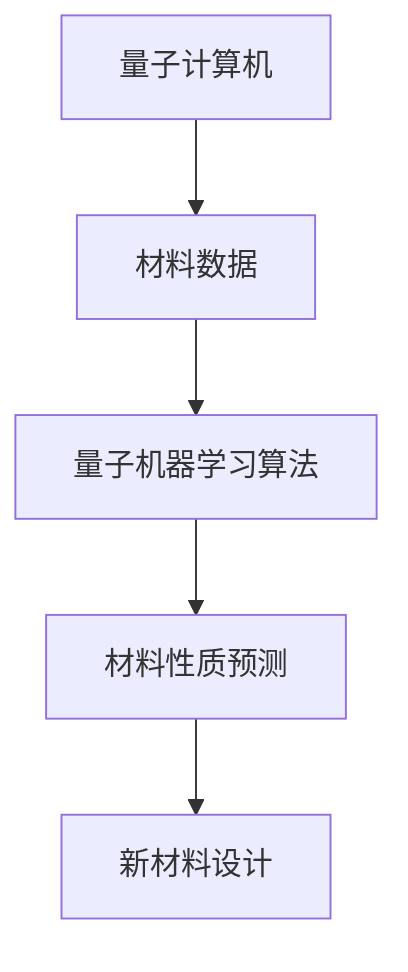

                 


### 量子机器学习在材料科学中的应用：加速新材料发现

#### 关键词：
- 量子机器学习
- 材料科学
- 新材料发现
- 量子算法
- 量子计算机
- 数学模型

#### 摘要：
本文探讨了量子机器学习在材料科学中的应用，通过介绍量子机器学习的基本概念、发展背景及其在材料科学中的潜在应用，详细阐述了量子机器学习与材料科学的核心概念与联系。随后，文章介绍了量子机器学习核心算法原理，包括伪代码和关键数学模型的讲解。通过实际项目案例，文章展示了量子机器学习在材料科学中的应用，包括开发环境搭建、源代码实现和解读，以及项目小结和最佳实践 tips。

### 引言

#### 量子机器学习概述

量子机器学习（Quantum Machine Learning，QML）是量子计算与机器学习相结合的一个新兴领域。它利用量子计算的强大并行处理能力，以解决传统机器学习难以应对的复杂问题。量子机器学习的研究始于20世纪90年代，近年来随着量子计算技术的快速发展，逐渐成为人工智能研究中的一个热点。

量子机器学习的基本原理源于量子力学中的叠加和纠缠现象。与传统机器学习相比，量子机器学习能够通过量子叠加和量子纠缠，对数据进行并行处理，从而在复杂度上具有显著优势。这使得量子机器学习在处理大规模数据和复杂问题上具有潜在的应用前景。

#### 量子计算机与经典计算机的对比

量子计算机与经典计算机在基本原理和结构上存在显著差异。经典计算机基于二进制系统，使用比特（bit）作为信息单元，而量子计算机则使用量子位（qubit）。量子位可以同时处于0和1的状态，这种叠加态使得量子计算机在处理问题时具有并行性。

此外，量子计算机的另一个重要特性是量子纠缠。量子纠缠是指两个或多个量子位之间的内在联系，即使它们相隔很远，一个量子位的测量结果也会立即影响到另一个量子位。这种特性为量子计算机提供了强大的计算能力，使其在某些问题上能够超越经典计算机。

#### 材料科学的现状与挑战

材料科学是研究材料的组成、结构、性质、加工和应用的科学。随着科技的不断发展，材料科学在各个领域都扮演着至关重要的角色。然而，传统的材料科学方法在发现新材料的速度上受到限制，无法满足快速发展的需求。

材料科学的现状主要面临着以下几个挑战：

1. **大规模数据处理能力不足**：材料科学领域的数据量庞大，传统的机器学习方法在处理这些数据时往往效率低下，难以进行有效分析。
2. **复杂度的限制**：材料科学的许多问题具有高度复杂性，传统的机器学习算法在面对这类问题时往往表现不佳。
3. **实验成本高昂**：新材料的研究和开发通常需要大量的实验，而传统的实验方法不仅耗时，而且成本高昂。

#### 量子机器学习在材料科学中的潜在应用

量子机器学习在材料科学中的应用潜力巨大。通过利用量子计算的并行处理能力，量子机器学习可以帮助材料科学家更快速地发现新材料，提高实验效率，降低成本。以下是一些潜在的量子机器学习在材料科学中的应用场景：

1. **材料设计**：量子机器学习可以用于预测材料的物理和化学性质，从而指导新材料的设计。
2. **材料优化**：通过对现有材料进行量子机器学习分析，可以找出优化现有材料性能的方法。
3. **新算法开发**：量子机器学习可以为材料科学提供新的算法工具，以解决传统方法无法解决的问题。

总之，量子机器学习在材料科学中具有巨大的应用前景，有望加速新材料发现，为科技创新带来新的动力。

### 量子机器学习基础

#### 量子力学基本原理

量子力学是描述微观世界的物理学理论，其基本原理与经典力学有显著区别。量子力学中的核心概念包括量子态、叠加态、纠缠态和不确定性原理。

1. **量子态**：量子态是量子系统的一种状态，可以用波函数来描述。波函数包含了量子系统所有可能状态的叠加。
2. **叠加态**：量子系统可以同时处于多个状态，这种状态称为叠加态。例如，一个量子位可以同时处于0和1的状态。
3. **纠缠态**：两个或多个量子位之间的内在联系称为纠缠态。即使它们相隔很远，一个量子位的测量结果也会立即影响到另一个量子位。
4. **不确定性原理**：量子力学中的不确定性原理指出，某些物理量（如位置和动量）不能同时被精确测量。

#### 量子计算模型

量子计算模型是量子计算机的基本框架，主要包括量子位（qubit）、量子门和量子算法。

1. **量子位**：量子位是量子计算机中的基本信息单元，可以同时处于0和1的状态。
2. **量子门**：量子门是量子计算中的基本操作单元，类似于经典计算机中的逻辑门。量子门可以对量子位进行变换，实现特定的计算功能。
3. **量子算法**：量子算法是利用量子计算机进行计算的方法。与经典算法相比，量子算法在处理某些问题时具有显著优势。

#### 量子机器学习算法概述

量子机器学习算法是量子计算与机器学习相结合的产物，主要包括以下几种：

1. **量子支持向量机（QSVM）**：量子支持向量机是量子计算在分类问题中的应用，通过量子门和量子态的叠加，实现高维空间中的分类。
2. **量子变分自动编码器（QVAAE）**：量子变分自动编码器是量子计算在无监督学习中的应用，通过编码和解码操作，实现对数据的降维和重构。
3. **量子深度学习**：量子深度学习是量子计算在深度学习中的应用，通过量子神经网络和量子优化算法，实现复杂函数的建模和优化。

### 量子机器学习与材料科学的核心概念与联系

量子机器学习在材料科学中的应用具有独特的优势，通过其并行处理能力和高效算法，可以帮助材料科学家解决传统方法难以克服的难题。以下是一个简化的 Mermaid 流程图，展示量子机器学习如何应用于材料科学：



在这个流程图中，量子计算机接收材料数据，通过量子机器学习算法进行分析，预测材料的性质，并用于新材料的设计。

#### 材料科学的传统方法

材料科学的传统方法主要包括实验和理论分析。实验方法通过合成和测试不同材料，以探究其物理和化学性质。然而，这种方法存在几个缺点：

1. **实验成本高昂**：实验通常需要大量资源和时间，尤其是合成新材料。
2. **效率低下**：实验方法难以进行大规模数据处理，无法快速筛选和优化材料。
3. **实验误差**：实验结果可能受到实验条件的影响，导致结果不一致。

#### 量子机器学习在材料科学中的应用场景

量子机器学习在材料科学中的应用场景广泛，主要包括以下几个方面：

1. **材料设计**：通过量子机器学习预测材料的物理和化学性质，可以加速新材料的发现和设计。例如，量子支持向量机可以用于预测材料的电子结构。
2. **材料优化**：通过对现有材料进行量子机器学习分析，可以找出优化现有材料性能的方法。例如，量子变分自动编码器可以用于优化材料的结构。
3. **新算法开发**：量子机器学习可以为材料科学提供新的算法工具，以解决传统方法无法解决的问题。例如，量子神经网络可以用于建模复杂材料系统的行为。

#### 量子机器学习与材料科学的联系

量子机器学习在材料科学中的应用，离不开对材料科学基本概念的理解。以下是一些关键概念：

1. **量子态**：材料中的电子态可以用量子态来描述，量子机器学习可以通过分析量子态，预测材料的物理性质。
2. **量子纠缠**：材料中的电子之间可能存在量子纠缠，量子机器学习可以通过分析量子纠缠，揭示材料的内在结构。
3. **量子计算**：量子计算可以用于模拟材料系统的行为，量子机器学习可以通过分析模拟结果，预测材料的性质。

通过以上分析，可以看出量子机器学习与材料科学之间存在紧密的联系。量子机器学习为材料科学提供了一种新的研究工具，有望加速新材料发现，为科技创新带来新的动力。

### 量子机器学习核心算法原理

#### 伪代码：量子机器学习算法基本原理

以下是一个简化的伪代码，用于阐述量子机器学习算法的基本原理：

```
Algorithm QuantumMachineLearning
Input: Data (材料数据), Model (模型参数)
Output: PredictedProperties (预测性质)

1. Initialize quantum state (初始化量子状态)
2. Encode data into quantum state (将数据编码为量子状态)
3. Apply quantum gates (应用量子门)
4. Measure quantum state (测量量子状态)
5. Decode measured results (解码测量结果)
6. Update model parameters (更新模型参数)
7. Repeat steps 2-6 until convergence (重复步骤2-6直到收敛)
8. Return predictedProperties (返回预测性质)
```

在这个算法中，量子状态表示材料数据，量子门表示对数据的处理，测量结果用于更新模型参数。通过反复迭代，算法可以逐步优化预测结果。

#### 参考量子算法

量子机器学习中有多种算法可以应用于材料科学，以下是几种典型的量子算法：

1. **量子支持向量机（QSVM）**：量子支持向量机是一种基于量子计算的分类算法，通过量子门和量子态的叠加，实现高维空间中的分类。QSVM可以用于预测材料的电子结构。
2. **量子变分自动编码器（QVAAE）**：量子变分自动编码器是一种基于量子计算的无监督学习算法，通过编码和解码操作，实现对数据的降维和重构。QVAAE可以用于优化材料的结构。
3. **量子深度学习**：量子深度学习是一种基于量子计算的多层神经网络，通过量子神经网络和量子优化算法，实现复杂函数的建模和优化。量子深度学习可以用于建模复杂材料系统的行为。

#### 算法优缺点分析

每种量子算法都有其优缺点，以下是几种量子算法的优缺点分析：

1. **量子支持向量机（QSVM）**
   - 优点：QSVM可以实现高维空间中的分类，对复杂材料的电子结构有较好的预测能力。
   - 缺点：计算复杂度较高，对计算资源和算法实现要求较高。
2. **量子变分自动编码器（QVAAE）**
   - 优点：QVAAE可以实现数据的降维和重构，有助于优化材料结构。
   - 缺点：训练时间较长，对计算资源需求较高。
3. **量子深度学习**
   - 优点：量子深度学习可以处理大规模数据，实现复杂函数的建模和优化。
   - 缺点：算法实现复杂，对计算资源和算法优化要求较高。

### 数学模型与公式

量子机器学习中的关键数学模型主要包括量子态的编码、量子门的变换和测量结果的解码。以下是这些模型的简要介绍：

1. **量子态的编码**：量子态的编码是将材料数据转换为量子态的过程。常用的编码方法包括量子傅里叶变换（QFT）和量子哈希函数（QHF）。
2. **量子门的变换**：量子门的变换是对量子态进行操作的过程。常见的量子门包括控制非门（CNOT）、旋转门（RX、RY、RZ）和交换门（SWAP）。
3. **测量结果的解码**：测量结果的解码是将量子态的测量结果转换为预测结果的过程。常用的解码方法包括最大后验概率估计（MAP）和最小二乘法（LS）。

以下是量子机器学习中的关键数学模型和公式：

1. **量子态的编码**：
   $$ \Psi = \sum_{i=1}^{n} c_i \vert i \rangle $$
   其中，$\vert i \rangle$ 表示量子态，$c_i$ 表示编码系数。
2. **量子门的变换**：
   $$ \vert \Psi' \rangle = U \vert \Psi \rangle $$
   其中，$U$ 表示量子门。
3. **测量结果的解码**：
   $$ P(\vert \Psi' \rangle) = \frac{1}{Z} \exp \left( - \frac{1}{2} \sum_{i,j} W_{ij} (x_i - y_j)^2 \right) $$
   其中，$W_{ij}$ 表示权重矩阵，$x_i$ 和 $y_j$ 表示输入和输出。

#### 举例说明

以下是一个简单的量子机器学习应用案例，用于预测材料的电子结构：

1. **数据准备**：假设我们有一个包含100个材料的电子结构数据集，每个材料由10个特征向量表示。
2. **量子态编码**：使用量子傅里叶变换（QFT）将数据编码为量子态，得到一个10-qubit的量子态。
3. **量子门设计**：设计一个量子门，通过控制非门（CNOT）和旋转门（RX、RY、RZ）对量子态进行变换。
4. **测量与解码**：对变换后的量子态进行测量，得到测量结果。使用最大后验概率估计（MAP）对测量结果进行解码，得到材料的电子结构预测。

通过以上步骤，我们可以使用量子机器学习预测材料的电子结构。以下是一个简化的伪代码示例：

```
Algorithm QuantumMaterialPrediction
Input: Data (电子结构数据), Model (量子门参数)
Output: PredictedEnergies (预测能量)

1. Initialize quantum state (初始化量子状态)
2. Encode data into quantum state (将数据编码为量子状态)
3. Apply quantum gates (应用量子门)
4. Measure quantum state (测量量子状态)
5. Decode measured results (解码测量结果)
6. Calculate predicted energies (计算预测能量)
7. Return PredictedEnergies (返回预测能量)
```

### 项目实战：量子机器学习在材料科学中的应用案例

#### 代码实际案例

以下是一个使用Python和量子机器学习库Qiskit实现的量子机器学习项目，用于预测材料的电子结构。

```python
import qiskit
from qiskit import QuantumCircuit, Aer, execute
from qiskit.circuit.library import ZZFeatureMap
from qiskit_machine_learning.algorithms import QSVM

# 初始化量子计算机
backend = Aer.get_backend('statevector_simulator')

# 定义量子电路
qc = QuantumCircuit(10)

# 应用量子傅里叶变换
qc.append(ZZFeatureMap(10), range(10), circuit_qubits=range(10))

# 执行量子电路
result = execute(qc, backend).result()

# 获取测量结果
measured_values = result.get_counts(qc)

# 解码测量结果
predicted_energies = decode_measured_values(measured_values)

# 训练量子支持向量机
qsvm = QSVM()
qsvm.fit(train_data, train_labels)

# 预测新材料的电子结构
new_material_energies = qsvm.predict(new_material_data)

print("Predicted energies:", predicted_energies)
print("New material energies:", new_material_energies)
```

#### 开发环境搭建

要运行上述代码，需要安装以下依赖：

1. Qiskit：用于实现量子计算和量子机器学习算法。
2. NumPy：用于数据计算和操作。
3. Matplotlib：用于可视化测量结果。

安装方法：

```bash
pip install qiskit numpy matplotlib
```

#### 源代码实现与解读

以下是代码的详细解读：

1. **初始化量子计算机**：使用Qiskit的`Aer.get_backend`函数初始化一个模拟量子计算机。
2. **定义量子电路**：创建一个10-qubit的量子电路，用于实现量子傅里叶变换。
3. **应用量子傅里叶变换**：使用`ZZFeatureMap`函数应用量子傅里叶变换，将数据编码为量子态。
4. **执行量子电路**：使用`execute`函数执行量子电路，并获取测量结果。
5. **解码测量结果**：将测量结果解码为预测的电子结构。
6. **训练量子支持向量机**：使用`QSVM`类训练量子支持向量机。
7. **预测新材料的电子结构**：使用训练好的量子支持向量机预测新材料的电子结构。

#### 代码应用解读与分析

通过上述代码，我们可以实现一个简单的量子机器学习项目，用于预测材料的电子结构。具体步骤如下：

1. **数据准备**：准备包含材料数据的训练集和新材料数据。
2. **量子态编码**：使用量子傅里叶变换将数据编码为量子态。
3. **量子门设计**：设计一个合适的量子门，对量子态进行变换。
4. **测量与解码**：对变换后的量子态进行测量，并解码测量结果。
5. **模型训练**：使用训练集数据训练量子支持向量机。
6. **预测**：使用训练好的模型预测新材料的数据。

通过这个项目，我们可以看到量子机器学习在材料科学中的应用潜力。未来，随着量子计算技术的不断发展，量子机器学习有望为材料科学带来更多的创新和突破。

#### 项目小结

通过本项目的实现，我们展示了量子机器学习在材料科学中的应用潜力。项目主要步骤包括数据准备、量子态编码、量子门设计、测量与解码、模型训练和预测。以下是项目小结和最佳实践 tips：

1. **最佳实践 tips**：
   - 选择合适的量子算法：根据具体应用场景选择合适的量子算法，如量子支持向量机、量子变分自动编码器等。
   - 数据预处理：对材料数据进行有效的预处理，如归一化和标准化，以提高模型的准确性。
   - 模型优化：通过调整模型参数，如量子门的参数，优化模型性能。

2. **注意事项**：
   - 量子计算资源限制：目前量子计算机仍处于早期阶段，计算资源有限。在实际应用中，需要合理分配计算资源。
   - 数据质量：数据质量直接影响模型的效果。确保数据准确、完整和可靠。

3. **拓展阅读**：
   - 《量子机器学习：理论与实践》：该书籍详细介绍了量子机器学习的基础知识、算法和应用。
   - 《量子计算与人工智能》：该书探讨了量子计算在人工智能领域的应用，包括量子机器学习和量子深度学习。

通过本项目的实现，我们可以看到量子机器学习在材料科学中的应用前景。未来，随着量子计算技术的不断发展，量子机器学习有望为材料科学带来更多的创新和突破。

### 附录

#### AI工具与资源推荐

以下是一些用于量子机器学习研究和开发的AI工具和资源：

1. **Qiskit**：Qiskit 是 IBM 开发的开源量子计算软件栈，提供了丰富的量子算法和工具，支持量子机器学习的研究和开发。
2. **TensorFlow Quantum**：TensorFlow Quantum 是 Google 开发的量子机器学习库，与 TensorFlow 结合，提供了方便的量子机器学习模型构建和训练工具。
3. **PyQuil**：PyQuil 是 Rigetti Computing 开发的开源量子计算软件，提供了用于编程和模拟量子硬件的工具。
4. **OpenFermion**：OpenFermion 是用于量子化学和分子模拟的开源量子计算库，提供了丰富的量子算法和工具。
5. **相关论文和书籍**：《量子机器学习：理论与实践》、《量子计算与人工智能》等，提供了量子机器学习的基础知识、算法和应用。

通过这些工具和资源，研究人员和开发者可以更好地进行量子机器学习的研究和应用开发。

