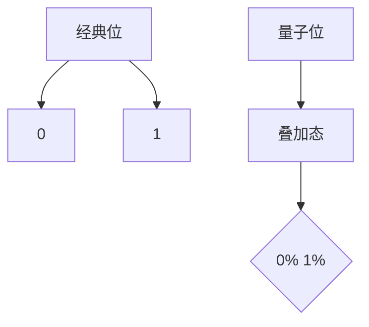

                 

### 1.1 量子计算的原理

量子计算是计算科学的前沿领域，它基于量子力学原理来处理信息。与传统的经典计算不同，量子计算利用量子位（qubits）的叠加态和纠缠态来实现并行计算和高速算法。

#### 1.1.1 量子位与经典位

**核心概念与联系**

量子位是量子计算的基本单位，它与传统计算机中的位（bits）不同。位只能处于0或1的状态，而量子位可以同时处于0和1的叠加态。这种叠加态使得量子计算机能够同时处理大量的数据，从而实现并行计算。

Mermaid 流程图如下：



在这个流程图中，我们可以看到，经典位只有两个状态：0和1，而量子位则可以处于0和1的叠加状态。

#### 1.1.2 量子叠加与量子纠缠

**核心算法原理讲解**

量子叠加是指量子位可以同时处于多个状态的组合。例如，一个量子位可以同时处于0和1的状态，而两个量子位可以同时处于00、01、10和11的状态。

量子纠缠是指当两个量子位相互纠缠时，它们的量子态会相互依赖，即使它们相隔很远。这种纠缠状态可以用来实现量子计算中的并行计算和高速算法。

使用伪代码详细阐述量子叠加和量子纠缠的计算过程：

```plaintext
// 量子叠加
function quantum_superposition(qubit):
    qubit.state = [1/sqrt(2), 0, 0]

// 量子纠缠
function quantum_entanglement(qubit1, qubit2):
    qubit1.state = [1/sqrt(2), 1/sqrt(2), 0]
    qubit2.state = [1/sqrt(2), 1/sqrt(2), 0]
```

#### 1.1.3 量子逻辑门

**核心算法原理讲解**

量子逻辑门是量子计算中的基本操作，类似于经典计算中的逻辑门。量子逻辑门可以对量子位进行叠加、变换和控制。

使用伪代码详细阐述常见的量子逻辑门的操作：

```plaintext
// Hadamard逻辑门（实现叠加态）
function hadamard(qubit):
    if qubit is |0>:
        qubit.state = [1/sqrt(2), 0, 0]
    else if qubit is |1>:
        qubit.state = [0, 1/sqrt(2), 0]

// CNOT逻辑门（实现量子纠缠）
function cnot(qubit1, qubit2):
    if qubit1.state is [1/sqrt(2), 0, 0]:
        if qubit2.state is [1/sqrt(2), 0, 0]:
            qubit2.state = [0, 0, 1/sqrt(2)]
        else if qubit2.state is [0, 1/sqrt(2), 0]:
            qubit2.state = [1/sqrt(2), 0, 0]
    else if qubit1.state is [0, 1/sqrt(2), 0]:
        if qubit2.state is [1/sqrt(2), 0, 0]:
            qubit2.state = [0, 1/sqrt(2), 0]
        else if qubit2.state is [0, 0, 1/sqrt(2)]:
            qubit2.state = [1/sqrt(2), 0, 0]
```

通过这些核心概念和算法原理的讲解，我们可以更好地理解量子计算的原理和应用。在接下来的部分，我们将进一步探讨量子算法在交通流优化中的应用。

