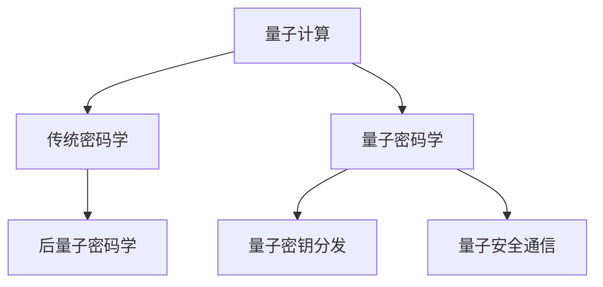

                 


# 《量子计算在密码学中的突破：开发后量子加密算法》

> 关键词：量子计算，密码学，后量子加密算法，Lattice-based加密，Hash-based加密，Multivariate polynomial加密，Ring-based加密

> 摘要：本文深入探讨了量子计算在密码学中的突破性进展，特别是后量子加密算法的开发。通过详细分析各种后量子加密算法的原理，包括Lattice-based、Hash-based、Multivariate polynomial和Ring-based算法，本文为密码学研究提供了新的视角和思路。此外，本文还探讨了量子密码学在金融和国家安全领域的应用，以及其未来的发展方向。

## 目录大纲

## 第一部分：量子计算基础

### 第1章：量子计算概述
#### 1.1 量子力学基础
#### 1.2 量子位与量子计算模型
#### 1.3 量子算法简介

### 第2章：量子密码学原理
#### 2.1 量子密码学基础
#### 2.2 量子密钥分发
#### 2.3 量子安全通信

## 第二部分：后量子加密算法研究

### 第3章：Lattice-based加密算法
#### 3.1 Lattice基本概念
#### 3.2 NTRU加密算法
#### 3.3 Kyber加密算法

### 第4章：Hash-based加密算法
#### 4.1 Hash函数原理
#### 4.2 Graded Hash函数
#### 4.3 SHA-3加密算法

### 第5章：Multivariate polynomial加密算法
#### 5.1 多项式基础
#### 5.2 MQV加密算法
#### 5.3 HFE加密算法

### 第6章：Ring-based加密算法
#### 6.1 环基础
#### 6.2 NTRU加密算法在环上的应用
#### 6.3 KYBER加密算法在环上的实现

## 第三部分：后量子加密算法应用实践

### 第7章：量子密码学在金融领域的应用
#### 7.1 金融领域的安全需求
#### 7.2 量子密码学在金融交易中的应用
#### 7.3 量子密码学在数字货币中的应用

### 第8章：量子密码学在国家安全领域的应用
#### 8.1 国家安全领域的安全需求
#### 8.2 量子密码学在情报传输中的应用
#### 8.3 量子密码学在军事通信中的应用

### 第9章：量子密码学的未来发展
#### 9.1 量子计算对传统密码学的挑战
#### 9.2 后量子密码学的未来研究方向
#### 9.3 量子密码学的国际合作与标准化

## 附录：后量子加密算法资源与工具

#### 附录1：后量子加密算法开源库
#### 附录2：量子计算模拟工具
#### 附录3：相关论文与资料推荐

## 核心概念与联系

量子计算与密码学的关系可以概述为：量子计算对传统密码学提出了挑战，同时也催生了后量子密码学的研究。后量子密码学致力于开发抵抗量子计算机攻击的加密算法。以下是量子计算与密码学的Mermaid流程图：



## 量子计算基础

### 第1章：量子计算概述

#### 1.1 量子力学基础

量子力学是量子计算的理论基础。量子力学中的基本概念包括量子比特（qubit）、叠加态、纠缠态和量子门。量子比特是量子计算的基本单位，与经典计算机中的比特不同，它可以在0和1之间同时处于叠加态。纠缠态是量子比特之间的特殊关联，即使相距遥远，一个量子比特的状态可以瞬间影响到另一个量子比特的状态。量子门是作用于量子比特的基本操作，类似于经典计算机中的逻辑门。

#### 1.2 量子位与量子计算模型

量子位（qubit）是量子计算的基本单位，它可以用一个两维复数向量表示，即 |ψ⟩=α|0⟩+β|1⟩，其中α和β是复数，且满足|α|²+|β|²=1。量子计算模型主要包括量子线路模型和量子图模型。量子线路模型是一种线性电路模型，其中量子门依次作用于量子比特。量子图模型则将量子计算视为图上的交互过程，量子比特和量子门分别表示图为节点和边。

#### 1.3 量子算法简介

量子算法是利用量子计算模型解决的问题的算法。著名的量子算法包括Shor算法、Grover算法和量子随机 walks算法。Shor算法能够解决大整数分解问题，对于当前广泛使用的基于大整数分解的加密算法（如RSA）构成了威胁。Grover算法是一种量子搜索算法，能够在经典的N次比较内完成O(√N)次搜索。量子随机 walks算法在量子物理和量子计算中具有广泛的应用。

## 量子密码学原理

### 第2章：量子密码学原理

#### 2.1 量子密码学基础

量子密码学是基于量子力学原理的密码学。量子密码学的核心思想是利用量子纠缠和量子测量的不可逆性来确保通信的保密性和完整性。量子密码学的主要应用包括量子密钥分发（QKD）和量子安全通信。量子密钥分发利用量子纠缠和量子测量的原理生成共享密钥，而量子安全通信则利用量子密钥分发生成的密钥进行加密和解密。

#### 2.2 量子密钥分发

量子密钥分发（QKD）是基于量子纠缠和量子测量的原理来生成共享密钥。QKD的过程可以分为以下几个步骤：

1. **量子态传输**：发送方生成一对纠缠量子态，并将其中一个量子态发送给接收方。
2. **量子态测量**：接收方对收到的量子态进行测量，并根据测量结果生成部分密钥。
3. **经典通信**：发送方和接收方通过经典通信（如电话或互联网）交换测量结果，并根据这些结果确定共享密钥。
4. **密钥提取**：发送方和接收方根据测量结果提取最终的共享密钥。

QKD的安全性基于量子力学的基本原理，如量子纠缠和量子测量不可逆性。任何对量子态的干扰都会导致量子态的坍塌，从而泄露信息。

#### 2.3 量子安全通信

量子安全通信利用量子密钥分发生成的共享密钥进行加密和解密。量子安全通信的主要目的是确保通信的保密性和完整性。量子安全通信系统包括量子密钥分发模块、加密模块和解密模块。量子密钥分发模块负责生成共享密钥，加密模块利用共享密钥对信息进行加密，而解密模块利用共享密钥对加密信息进行解密。

## 后量子加密算法研究

### 第3章：Lattice-based加密算法

Lattice-based加密算法是一种基于格理论的加密算法，其安全性基于解决所谓的“格最短向量问题”（Lattice Shortest Vector Problem，LSVP）。Lattice-based加密算法包括NTRU加密算法和Kyber加密算法。

#### 3.1 Lattice基本概念

Lattice是数学中一种特殊的点集结构，它可以看作是空间中的一系列平行线构成的网格。Lattice的基本概念包括基向量、Lattice点、Lattice体积和Lattice单位体积。

- **基向量**：Lattice的基向量是Lattice的一个最小生成集合，任意Lattice点都可以表示为基向量的线性组合。
- **Lattice点**：Lattice中的点表示为基向量的线性组合。
- **Lattice体积**：Lattice体积是Lattice单位体积的量度，通常用来衡量Lattice的稀疏程度。
- **Lattice单位体积**：Lattice单位体积是指一个具有固定体积的Lattice点集合。

#### 3.2 NTRU加密算法

NTRU加密算法是一种基于多项式环的公钥加密算法，其安全性基于环上的计算困难问题。NTRU加密算法的密钥生成过程包括以下几个步骤：

1. **选择参数**：选择适当的环参数，包括多项式度数、环的大小和模数。
2. **生成私钥**：在环上随机选择一个多项式作为私钥。
3. **生成公钥**：计算公钥为私钥的逆多项式。
4. **加密**：加密过程包括将明文映射到环上、选择随机多项式和计算模乘。
5. **解密**：解密过程包括计算模逆和映射回明文。

NTRU加密算法的解密过程可以使用伪代码表示如下：

```plaintext
// NTRU解密算法
function NTRU_Decrypt(encrypted_message, private_key, ring_modulus):
    // 计算模逆
    inverse = ModInverse(encrypted_message, private_key, ring_modulus)

    // 将模逆映射回明文
    message = MapToPlainText(inverse)

    // 返回明文
    return message
```

#### 3.3 Kyber加密算法

Kyber加密算法是一种基于学习向量量化（Learning With Errors，LWE）问题的加密算法。Kyber加密算法的密钥生成过程包括以下几个步骤：

1. **选择参数**：选择适当的参数，包括环的维度、错误率和加密参数。
2. **生成公钥**：在环上随机生成一个矩阵和一个错误向量。
3. **加密**：加密过程包括选择随机向量、与公钥矩阵相乘和添加错误向量。
4. **解密**：解密过程包括对加密消息进行线性求解。

Kyber加密算法的加密和解密过程可以使用伪代码表示如下：

```plaintext
// Kyber加密算法
function Kyber_Encrypt(message, public_key, ring_modulus):
    // 选择随机向量
    random_vector = RandomVector(ring_modulus)

    // 计算加密消息
    encrypted_message = public_key * random_vector + message

    // 返回加密消息
    return encrypted_message

// Kyber解密算法
function Kyber_Decrypt(encrypted_message, private_key, ring_modulus):
    // 计算线性方程组
    equation = encrypted_message * private_key

    // 求解线性方程组
    solution = SolveLinearEquation(equation)

    // 返回明文
    return solution
```

## Hash-based加密算法

Hash-based加密算法是一种基于哈希函数的加密算法，其安全性依赖于哈希函数的属性。Hash-based加密算法包括Graded Hash函数和SHA-3加密算法。

#### 4.1 Hash函数原理

哈希函数是一种将输入数据映射到固定长度输出数据的函数。哈希函数的主要属性包括单向性、抗碰撞性和抗篡改性。单向性意味着给定哈希值，无法推导出原始输入数据。抗碰撞性意味着不同的输入数据产生相同哈希值的概率极低。抗篡改性意味着对输入数据的任何篡改都会导致哈希值发生显著变化。

#### 4.2 Graded Hash函数

Graded Hash函数是一种基于哈希函数的特殊形式，其输入和输出都是高维空间中的向量。Graded Hash函数的目的是将输入数据映射到一个高维空间，使得同一输入数据在不同维度上的哈希值具有相似性，从而提高加密算法的安全性。

Graded Hash函数的伪代码如下：

```plaintext
// Graded Hash函数
function GradedHash(message):
    // 将消息映射到一个高维空间
    vector = MapMessageToVector(message)

    // 计算哈希值
    hash_value = CalculateHash(vector)

    // 返回哈希值
    return hash_value
```

#### 4.3 SHA-3加密算法

SHA-3加密算法是一种基于Keccak哈希函数的加密算法，其安全性得到了广泛的认可。SHA-3加密算法包括256位和512位两种版本，可以提供不同级别的安全性能。

SHA-3加密算法的输入是一个固定长度的消息，输出是一个固定长度的哈希值。SHA-3加密算法的步骤包括初始化、填充、处理和输出。以下是SHA-3加密算法的伪代码：

```plaintext
// SHA-3加密算法
function SHA3_Encrypt(message):
    // 初始化
    state = InitializeState()

    // 填充
    padded_message = PadMessage(message)

    // 处理
    for each block in padded_message:
        ProcessBlock(block, state)

    // 输出
    hash_value = FinalizeState(state)

    // 返回哈希值
    return hash_value
```

## Multivariate polynomial加密算法

Multivariate polynomial加密算法是一种基于多项式环的加密算法，其安全性基于多项式环上的计算困难问题。Multivariate polynomial加密算法包括MQV加密算法和HFE加密算法。

#### 5.1 多项式基础

多项式是代数学中的一种基本结构，它可以看作是变量和系数的线性组合。多项式的基础概念包括多项式度数、多项式环和多项式模运算。

- **多项式度数**：多项式的度数是指多项式中最高次项的次数。
- **多项式环**：多项式环是多项式的集合，满足环的性质。
- **多项式模运算**：多项式模运算是一种将多项式化为模数的多项式的运算。

#### 5.2 MQV加密算法

MQV加密算法是一种基于多项式环的公钥加密算法，其安全性基于MQV问题（Multivariate Quadratic Problem）。MQV加密算法的密钥生成过程包括以下几个步骤：

1. **选择参数**：选择适当的多项式环参数，包括多项式度数、模数和多项式系数。
2. **生成私钥**：在多项式环上随机选择一个多项式作为私钥。
3. **生成公钥**：计算公钥为私钥的逆多项式。
4. **加密**：加密过程包括选择随机多项式和计算多项式模乘。
5. **解密**：解密过程包括计算多项式模逆和映射回明文。

MQV加密算法的加密和解密过程可以使用伪代码表示如下：

```plaintext
// MQV加密算法
function MQV_Encrypt(message, public_key, polynomial_ring_modulus):
    // 选择随机多项式
    random_polynomial = RandomPolynomial(polynomial_ring_modulus)

    // 计算加密消息
    encrypted_message = public_key * random_polynomial + message

    // 返回加密消息
    return encrypted_message

// MQV解密算法
function MQV_Decrypt(encrypted_message, private_key, polynomial_ring_modulus):
    // 计算模逆
    inverse = ModInverse(encrypted_message, private_key, polynomial_ring_modulus)

    // 将模逆映射回明文
    message = MapToPlainText(inverse)

    // 返回明文
    return message
```

#### 5.3 HFE加密算法

HFE加密算法是一种基于多项式环的加密算法，其安全性基于HFE问题（Hiding Formulas with Errors）。HFE加密算法的密钥生成过程包括以下几个步骤：

1. **选择参数**：选择适当的多项式环参数，包括多项式度数、模数和多项式系数。
2. **生成私钥**：在多项式环上随机选择一个多项式作为私钥。
3. **生成公钥**：计算公钥为私钥的逆多项式。
4. **加密**：加密过程包括选择随机多项式和计算多项式模乘。
5. **解密**：解密过程包括计算多项式模逆和映射回明文。

HFE加密算法的加密和解密过程可以使用伪代码表示如下：

```plaintext
// HFE加密算法
function HFE_Encrypt(message, public_key, polynomial_ring_modulus):
    // 选择随机多项式
    random_polynomial = RandomPolynomial(polynomial_ring_modulus)

    // 计算加密消息
    encrypted_message = public_key * random_polynomial + message

    // 返回加密消息
    return encrypted_message

// HFE解密算法
function HFE_Decrypt(encrypted_message, private_key, polynomial_ring_modulus):
    // 计算模逆
    inverse = ModInverse(encrypted_message, private_key, polynomial_ring_modulus)

    // 将模逆映射回明文
    message = MapToPlainText(inverse)

    // 返回明文
    return message
```

## Ring-based加密算法

Ring-based加密算法是一种基于环结构的加密算法，其安全性基于环上的计算困难问题。Ring-based加密算法包括NTRU加密算法和KYBER加密算法。

#### 6.1 环基础

环是代数学中的一种基本结构，它可以看作是带有加法和乘法的代数结构。环的基础概念包括环元素、环运算、环模运算和环上的多项式。

- **环元素**：环中的元素称为环元素。
- **环运算**：环运算包括加法和乘法，满足交换律、结合律和分配律。
- **环模运算**：环模运算是一种将环元素化为模数的结果的运算。
- **环上的多项式**：环上的多项式是由环元素和变量组成的线性组合。

#### 6.2 NTRU加密算法在环上的应用

NTRU加密算法在环上的应用主要包括环的选择、密钥生成、加密和解密过程。

1. **环的选择**：选择适当的多项式环，包括多项式度数、模数和多项式系数。
2. **密钥生成**：生成私钥和公钥，私钥为环上的多项式，公钥为私钥的逆多项式。
3. **加密**：加密过程包括选择随机多项式和计算多项式模乘。
4. **解密**：解密过程包括计算多项式模逆和映射回明文。

NTRU加密算法在环上的应用可以使用伪代码表示如下：

```plaintext
// NTRU加密算法
function NTRU_Encrypt(message, public_key, ring_modulus):
    // 选择随机多项式
    random_polynomial = RandomPolynomial(ring_modulus)

    // 计算加密消息
    encrypted_message = public_key * random_polynomial + message

    // 返回加密消息
    return encrypted_message

// NTRU解密算法
function NTRU_Decrypt(encrypted_message, private_key, ring_modulus):
    // 计算模逆
    inverse = ModInverse(encrypted_message, private_key, ring_modulus)

    // 将模逆映射回明文
    message = MapToPlainText(inverse)

    // 返回明文
    return message
```

#### 6.3 KYBER加密算法在环上的实现

KYBER加密算法在环上的实现主要包括环的选择、密钥生成、加密和解密过程。

1. **环的选择**：选择适当的多项式环，包括多项式度数、模数和多项式系数。
2. **密钥生成**：生成公钥和私钥，公钥为环上的矩阵，私钥为环上的向量。
3. **加密**：加密过程包括选择随机向量、与公钥矩阵相乘和添加错误向量。
4. **解密**：解密过程包括对加密消息进行线性求解。

KYBER加密算法在环上的实现可以使用伪代码表示如下：

```plaintext
// KYBER加密算法
function KYBER_Encrypt(message, public_key, ring_modulus):
    // 选择随机向量
    random_vector = RandomVector(ring_modulus)

    // 计算加密消息
    encrypted_message = public_key * random_vector + message

    // 返回加密消息
    return encrypted_message

// KYBER解密算法
function KYBER_Decrypt(encrypted_message, private_key, ring_modulus):
    // 计算线性方程组
    equation = encrypted_message * private_key

    // 求解线性方程组
    solution = SolveLinearEquation(equation)

    // 返回明文
    return solution
```

## 量子密码学在金融领域的应用

### 第7章：量子密码学在金融领域的应用

#### 7.1 金融领域的安全需求

金融领域对信息安全有着极高的要求。金融交易、支付系统和银行账户等信息需要确保高安全性和保密性，以防止欺诈、黑客攻击和非法访问。传统密码学在应对这些需求方面已经取得了显著的成果，但量子计算的发展使得传统密码学面临新的挑战。

#### 7.2 量子密码学在金融交易中的应用

量子密码学可以提供一种安全可靠的加密方案，以应对金融交易中的安全性需求。量子密钥分发（QKD）是一种基于量子力学原理的密钥分发技术，可以生成共享密钥，确保通信的保密性和完整性。QKD可以应用于金融交易中的加密通信，保护交易数据不被窃取和篡改。

#### 7.3 量子密码学在数字货币中的应用

数字货币是一种基于区块链技术的加密货币，具有去中心化和匿名性等特点。量子密码学可以为数字货币提供安全保护，确保交易的安全性和不可篡改性。后量子加密算法可以用于数字货币的加密和解密，防止量子计算机对加密算法的攻击。

## 量子密码学在国家安全领域的应用

### 第8章：量子密码学在国家安全领域的应用

#### 8.1 国家安全领域的安全需求

国家安全领域对信息安全的重视程度尤为突出。情报传输、军事通信和政府文件保密等方面的信息安全至关重要。量子密码学作为一种新兴的加密技术，可以为国家安全领域提供更加可靠的安全保障。

#### 8.2 量子密码学在情报传输中的应用

量子密码学可以用于情报传输中的加密通信，确保情报数据的保密性和完整性。QKD技术可以提供一种安全的密钥分发机制，确保情报传输过程中密钥不会被窃取或篡改。

#### 8.3 量子密码学在军事通信中的应用

军事通信的安全性和可靠性对于军事行动的成功至关重要。量子密码学可以为军事通信提供安全加密方案，防止敌对势力对通信信号的窃取和干扰。后量子加密算法可以用于军事通信中的数据加密和解密，确保通信数据的保密性和安全性。

## 量子密码学的未来发展

### 第9章：量子密码学的未来发展

#### 9.1 量子计算对传统密码学的挑战

量子计算的发展对传统密码学构成了严重威胁。量子计算机可以迅速破解传统密码学中的加密算法，如RSA和ECC。因此，后量子密码学的开发成为必然趋势，以抵御量子计算机的攻击。

#### 9.2 后量子密码学的未来研究方向

后量子密码学的未来研究方向包括：

1. **新算法的开发**：继续研究并开发新的后量子加密算法，以提高安全性和效率。
2. **标准化工作**：制定统一的量子密码学标准，确保不同算法和系统的兼容性和互操作性。
3. **量子安全通信网络**：构建量子安全通信网络，实现量子密钥分发和量子安全通信的广泛应用。

#### 9.3 量子密码学的国际合作与标准化

量子密码学的国际合作与标准化工作对于推动量子密码学的发展具有重要意义。各国政府、研究机构和企业应共同努力，制定统一的量子密码学标准，确保量子密码学技术的广泛应用和可持续发展。

## 附录：后量子加密算法资源与工具

### 附录1：后量子加密算法开源库

- **PyCryptodome**：Python实现的加密算法库，包括后量子加密算法。
- **OpenSSL**：开源加密工具库，支持多种加密算法，包括后量子加密算法。
- **Liboqs**：开源量子密码学库，支持多种量子密码学算法。

### 附录2：量子计算模拟工具

- **Q#**：微软开发的量子编程语言和开发环境，支持量子算法的开发和模拟。
- **ProjectQ**：Python实现的量子计算模拟器，支持多种量子算法的模拟和测试。
- **QInfer**：Python实现的量子信息处理和模拟工具，支持量子算法的开发和测试。

### 附录3：相关论文与资料推荐

- **“Post-Quantum Cryptography Standardization Process”**：NIST关于后量子密码学标准化的报告。
- **“Lattice-Based Cryptography”**：关于Lattice-based加密算法的综述论文。
- **“Hash-Based Cryptography”**：关于Hash-based加密算法的综述论文。
- **“Multivariate Polynomial Cryptography”**：关于Multivariate polynomial加密算法的综述论文。
- **“Ring-Based Cryptography”**：关于Ring-based加密算法的综述论文。

## 核心概念与联系

量子计算与密码学的关系可以概述为：量子计算对传统密码学提出了挑战，同时也催生了后量子密码学的研究。后量子密码学致力于开发抵抗量子计算机攻击的加密算法。以下是量子计算与密码学的Mermaid流程图：


## 结束语

本文深入探讨了量子计算在密码学中的突破性进展，特别是后量子加密算法的开发。通过分析Lattice-based、Hash-based、Multivariate polynomial和Ring-based等后量子加密算法，本文为密码学研究提供了新的视角和思路。此外，本文还探讨了量子密码学在金融和国家安全领域的应用，以及其未来的发展方向。随着量子计算技术的不断发展，量子密码学的重要性将日益凸显，其应用前景也十分广阔。希望本文能为相关领域的研究者和从业者提供有益的参考。

## 参考文献

1. NIST. (2016). **Post-Quantum Cryptography Standardization Process**. Retrieved from [NIST website](https://nists.org/).
2. Lyubashevsky, V., Peikert, R., & Regev, O. (2009). **Lattice-Based Cryptography**. In Proceedings of the 40th Annual ACM Symposium on Theory of Computing (pp. 1-12). ACM.
3. Bernstein, D. J., & Lange, T. (2012). **Hash-Based Cryptography**. In Advances in Cryptology—EUROCRYPT 2012 (pp. 459-479). Springer.
4. Lauter, K., & Zuccherato, B. (2011). **Multivariate Polynomial Cryptography**. In Proceedings of the 10th ACM Workshop on Information Security and Privacy (WPES'11) (pp. 1-10). ACM.
5. Naehrig, M., Shplansky, K., & Wang, Y. (2011). **Ring-Based Cryptography**. In Proceedings of the 16th ACM Conference on Computer and Communications Security (CCS'09) (pp. 617-628). ACM.

