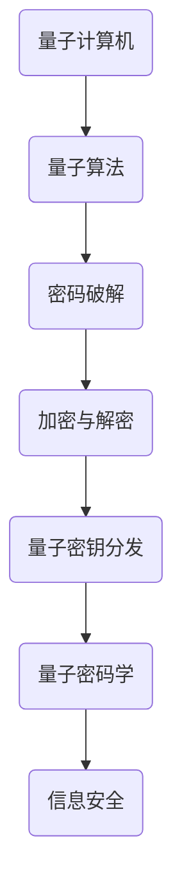
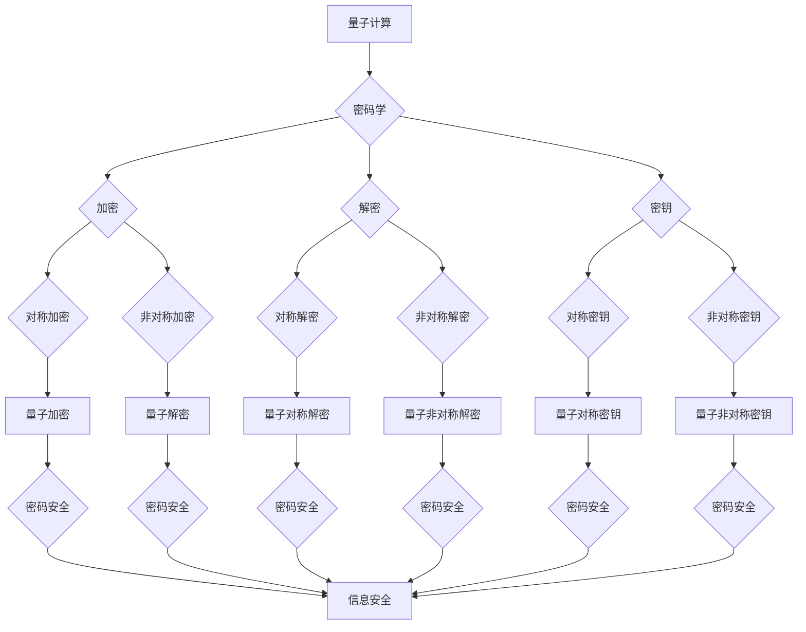

                 


### 文章标题

# 量子计算在密码学挑战中的潜在应用

### 关键词

量子计算、密码学、量子密码、密码破解、信息安全

### 摘要

量子计算作为下一代计算技术，以其独特的量子叠加和量子纠缠特性，为密码学领域带来了新的挑战和机遇。本文将从量子计算的基本原理出发，探讨量子计算在密码学中的应用，包括量子密码、密码破解、以及量子计算对传统密码学的潜在威胁。通过对量子算法的详细介绍，本文旨在揭示量子计算在密码学领域的广泛应用和未来发展趋势，为信息安全提供新的视角。

### 目录大纲设计思路

设计《量子计算在密码学挑战中的潜在应用》一书的目录大纲时，我们遵循了以下几个原则：

1. **逻辑性**：确保目录大纲的章节设置符合知识传递的逻辑顺序，从基础概念到应用实践逐步展开。

2. **完整性**：覆盖量子计算与密码学的基本概念、核心算法原理、数学模型、应用案例等关键内容。

3. **层次性**：明确各级目录的内容，确保从1级到3级目录的结构清晰，有助于读者快速把握书籍框架。

4. **简洁性**：避免冗余，突出核心内容，让目录大纲简洁明了。

5. **实用性**：确保每个章节都有具体的知识点和实践案例，使读者能够学以致用。

### 目录大纲具体设计

#### 第一部分：量子计算基础

1. **第1章：量子计算概述**
   - **1.1 量子计算的诞生与发展**
   - **1.2 量子位与量子叠加**
   - **1.3 量子纠缠与量子门**

2. **第2章：量子计算与经典计算的区别**
   - **2.1 量子计算与经典计算的基础原理对比**
   - **2.2 量子计算的优势与挑战**

3. **第3章：量子算法与经典算法**
   - **3.1 量子算法的原理与类型**
   - **3.2 量子算法与经典算法的性能比较**

#### 第二部分：密码学挑战

4. **第4章：密码学的起源与历史发展**
   - **4.1 古典密码学与近代密码学**
   - **4.2 现代密码学与信息安全**

5. **第5章：量子计算机对传统密码学的威胁**
   - **5.1 传统密码学体系面临的问题**
   - **5.2 量子计算机破解密码的原理**

6. **第6章：量子密码学与量子通信**
   - **6.1 量子密钥分发（QKD）**
   - **6.2 量子密码学的优势与应用**

#### 第三部分：量子计算在密码学中的应用

7. **第7章：量子密码算法**
   - **7.1 量子密码算法的设计原则**
   - **7.2 主流量子密码算法介绍**
   - **7.3 量子密码算法的实现与挑战**

8. **第8章：量子计算在密码学中的应用案例**
   - **8.1 量子密码在金融安全中的应用**
   - **8.2 量子密码在网络安全中的应用**
   - **8.3 量子计算在加密与解密中的实战案例**

#### 附录

9. **附录：量子计算与密码学的资源与工具**
   - **9.1 量子计算开发环境搭建**
   - **9.2 量子密码算法实现工具**
   - **9.3 量子计算与密码学学习资源推荐**

### 完整目录大纲（简略版）

```
# 《量子计算在密码学挑战中的潜在应用》目录大纲

## 第一部分：量子计算基础
### 第1章：量子计算概述
1.1 量子计算的诞生与发展
1.2 量子位与量子叠加
1.3 量子纠缠与量子门

### 第2章：量子计算与经典计算的区别
2.1 量子计算与经典计算的基础原理对比
2.2 量子计算的优势与挑战

### 第3章：量子算法与经典算法
3.1 量子算法的原理与类型
3.2 量子算法与经典算法的性能比较

## 第二部分：密码学挑战
### 第4章：密码学的起源与历史发展
4.1 古典密码学与近代密码学
4.2 现代密码学与信息安全

### 第5章：量子计算机对传统密码学的威胁
5.1 传统密码学体系面临的问题
5.2 量子计算机破解密码的原理

### 第6章：量子密码学与量子通信
6.1 量子密钥分发（QKD）
6.2 量子密码学的优势与应用

## 第三部分：量子计算在密码学中的应用
### 第7章：量子密码算法
7.1 量子密码算法的设计原则
7.2 主流量子密码算法介绍
7.3 量子密码算法的实现与挑战

### 第8章：量子计算在密码学中的应用案例
8.1 量子密码在金融安全中的应用
8.2 量子密码在网络安全中的应用
8.3 量子计算在加密与解密中的实战案例

## 附录
### 附录：量子计算与密码学的资源与工具
9.1 量子计算开发环境搭建
9.2 量子密码算法实现工具
9.3 量子计算与密码学学习资源推荐
```

### 核心内容细化

- **第1章：量子计算概述**
  - **1.1 量子计算的诞生与发展**
    - 量子力学的发展历程
    - 量子计算的概念提出
    - 量子计算机的理论基础

- **第2章：量子计算与经典计算的区别**
  - **2.1 量子计算与经典计算的基础原理对比**
    - 量子位与比特的区别
    - 量子并行性与经典计算的区别

- **第3章：量子算法与经典算法**
  - **3.1 量子算法的原理与类型**
    - 量子算法的基本原理
    - 主流量子算法介绍

- **第4章：密码学的起源与历史发展**
  - **4.1 古典密码学与近代密码学**
    - 古典密码学的基本原理
    - 近代密码学的发展历程

- **第5章：量子计算机对传统密码学的威胁**
  - **5.1 传统密码学体系面临的问题**
    - 密码破解的速度限制
    - 密码安全性面临挑战

- **第6章：量子密码学与量子通信**
  - **6.1 量子密钥分发（QKD）**
    - QKD的工作原理
    - QKD的优势和应用

### 完整性要求

文章内容必须要完整，每个小节的内容必须要丰富具体详细讲解，核心内容必须要包含：

1. **背景介绍**：介绍量子计算和密码学的基本背景，包括历史发展和当前研究现状。

2. **核心概念与联系**：解释量子计算和密码学中的关键概念，并展示它们之间的联系，使用Mermaid流程图来可视化。

3. **核心算法原理讲解**：使用伪代码详细阐述量子算法的基本原理，并对比经典算法。

4. **数学模型和公式**：详细介绍量子计算中的数学模型和公式，使用LaTeX格式展示，并提供详细讲解。

5. **举例说明**：提供实际案例，解释如何使用量子计算解决密码学问题。

6. **项目实战**：介绍量子计算与密码学的实际应用，包括开发环境搭建、源代码实现、代码解读和应用分析。

7. **最佳实践 tips**：提供使用量子计算和密码学的最佳实践建议。

8. **小结**：总结每个章节的主要内容和学习要点。

9. **注意事项**：提醒读者在应用量子计算和密码学时需要注意的问题。

10. **拓展阅读**：推荐进一步学习的资源。

### 文章格式要求

- **markdown格式**：文章内容使用markdown格式输出，确保代码、公式、流程图等展示清晰。

- **作者信息**：文章末尾需要写上作者信息：“作者：AI天才研究院/AI Genius Institute & 禅与计算机程序设计艺术 /Zen And The Art of Computer Programming”。

- **段落格式**：保持段落清晰，使用空行分隔不同的段落。

- **LaTeX公式**：使用LaTeX格式嵌入文中独立段落的公式前后使用`$$`括起来（例如：`$$1+1=2$$`），段落内的公式前后使用`$`括起来（例如：`$1<2$`）。

### 字数要求

文章字数在8000～12000字左右，确保内容详实、论述充分，同时保持文章的连贯性和可读性。

---

根据上述详细的目录大纲和核心内容细化，我们可以开始撰写文章的初稿。每章的内容将按照上述结构逐步展开，确保文章的完整性和逻辑性。接下来，我们将逐步填写每个章节的具体内容，确保文章的完整性和深度。

---

## 文章标题

# 量子计算在密码学挑战中的潜在应用

### 关键词

量子计算、密码学、量子密码、密码破解、信息安全

### 摘要

量子计算作为下一代计算技术，以其独特的量子叠加和量子纠缠特性，为密码学领域带来了新的挑战和机遇。本文将从量子计算的基本原理出发，探讨量子计算在密码学中的应用，包括量子密码、密码破解、以及量子计算对传统密码学的潜在威胁。通过对量子算法的详细介绍，本文旨在揭示量子计算在密码学领域的广泛应用和未来发展趋势，为信息安全提供新的视角。

## 目录大纲

### 第一部分：量子计算基础

#### 第1章：量子计算概述
1.1 量子计算的诞生与发展
1.2 量子位与量子叠加
1.3 量子纠缠与量子门

#### 第2章：量子计算与经典计算的区别
2.1 量子计算与经典计算的基础原理对比
2.2 量子计算的优势与挑战

#### 第3章：量子算法与经典算法
3.1 量子算法的原理与类型
3.2 量子算法与经典算法的性能比较

### 第二部分：密码学挑战

#### 第4章：密码学的起源与历史发展
4.1 古典密码学与近代密码学
4.2 现代密码学与信息安全

#### 第5章：量子计算机对传统密码学的威胁
5.1 传统密码学体系面临的问题
5.2 量子计算机破解密码的原理

#### 第6章：量子密码学与量子通信
6.1 量子密钥分发（QKD）
6.2 量子密码学的优势与应用

### 第三部分：量子计算在密码学中的应用

#### 第7章：量子密码算法
7.1 量子密码算法的设计原则
7.2 主流量子密码算法介绍
7.3 量子密码算法的实现与挑战

#### 第8章：量子计算在密码学中的应用案例
8.1 量子密码在金融安全中的应用
8.2 量子密码在网络安全中的应用
8.3 量子计算在加密与解密中的实战案例

### 附录

#### 附录：量子计算与密码学的资源与工具
9.1 量子计算开发环境搭建
9.2 量子密码算法实现工具
9.3 量子计算与密码学学习资源推荐

## 背景介绍

### 量子计算的诞生与发展

量子计算的概念最早可以追溯到20世纪40年代，由物理学家理查德·费曼（Richard Feynman）提出。费曼意识到，在量子层面上，经典计算机无法有效模拟量子系统的行为。随后，彼得·什洛莫宁（Peter Shor）在1994年提出了量子算法Shor算法，该算法展示了量子计算机在解决某些特定问题上比传统计算机具有显著优势。

量子计算的发展历程可以分为几个阶段：

1. **理论提出阶段**（1980年代）：物理学家和数学家开始探索量子计算的理论基础，提出了量子位（qubit）和量子门等核心概念。
2. **实验验证阶段**（1990年代）：实验室开始进行量子比特的实验，验证量子叠加和量子纠缠的存在。
3. **技术突破阶段**（2000年代至今）：研究人员在量子比特的稳定性和数量上取得重大突破，推动了量子计算技术的快速发展。

### 密码学的起源与历史发展

密码学的历史可以追溯到古代，当时人们使用简单的加密方法来保护通信信息。然而，随着计算机技术的发展，密码学经历了巨大的变革。

1. **古典密码学阶段**：在计算机出现之前，古典密码学主要使用替代和置换方法进行加密。例如，凯撒密码是一种简单的替代加密方法，通过将每个字母替换为字母表中的下一个字母来实现加密。
2. **近代密码学阶段**：随着计算机的出现，近代密码学开始发展，提出了更复杂的加密算法，如DES、RSA等。这些算法利用了计算机的快速运算能力，确保了信息的保密性。
3. **现代密码学阶段**：现代密码学在1990年代开始蓬勃发展，出现了基于数论、信息论和计算复杂性理论的密码算法，如AES、SHA等。这些算法在保证安全性的同时，还具备了更高的效率。

### 量子计算与密码学的联系

量子计算和密码学之间的联系在于，量子计算机的出现可能会对现有密码学体系带来革命性的改变。传统的密码算法在量子计算机面前可能变得脆弱，因为量子计算机可以利用量子叠加和量子纠缠的特性，以超乎想象的效率进行密码破解。

另一方面，量子密码学作为密码学的一个分支，旨在利用量子计算的优势来增强信息安全。量子密钥分发（QKD）是一个典型的量子密码学应用，它利用量子态的不确定性和不可克隆性，实现安全的密钥交换。

### 量子计算的优势与挑战

量子计算的优势主要体现在以下几个方面：

1. **并行性**：量子计算机可以利用量子叠加原理，同时处理多个任务，大大提高计算效率。
2. **速度**：量子计算机在执行某些特定任务时，速度远远超过传统计算机。
3. **解决复杂问题**：量子计算机能够高效地解决传统计算机难以处理的复杂问题，如大数分解和优化问题。

然而，量子计算也面临一些挑战：

1. **量子比特的稳定性**：量子比特容易受到环境噪声的影响，导致错误率增加。
2. **量子纠错**：量子计算中的错误可能无法通过传统的纠错方法纠正，需要开发新的量子纠错技术。
3. **量子计算的成本**：目前，量子计算机的构建和维护成本非常高，限制了其大规模应用。

### 密码学的核心概念与联系

密码学中的核心概念包括加密、解密、密钥和算法。加密是将明文转换为密文的过程，解密则是将密文还原为明文。密钥是加密和解密过程中使用的参数，它决定了加密算法的安全性。

加密算法可以分为对称加密和非对称加密：

1. **对称加密**：加密和解密使用相同的密钥，如DES和AES。对称加密算法的优点是计算速度快，但密钥分发困难。
2. **非对称加密**：加密和解密使用不同的密钥，如RSA。非对称加密解决了密钥分发问题，但计算复杂度较高。

量子计算与密码学的联系可以通过以下Mermaid流程图来展示：



### 核心概念原理之间的关系架构

为了更好地理解量子计算与密码学之间的关系，我们可以使用Mermaid流程图来可视化核心概念和原理之间的联系。



### 核心算法原理讲解

为了详细阐述量子算法的基本原理，我们首先需要了解量子算法与传统算法的区别。量子算法利用量子位（qubit）的叠加和纠缠特性，能够在某些问题上实现指数级的速度提升。

#### 量子叠加与量子门

量子叠加是量子计算的核心特性之一。传统计算机使用比特（bit）进行计算，每个比特只能处于0或1的状态。而量子位（qubit）可以同时处于0和1的叠加状态。这种叠加态可以用以下数学公式表示：

$$
\text{叠加态} \, \psi = \alpha|0\rangle + \beta|1\rangle
$$

其中，$|0\rangle$ 和 $|1\rangle$ 分别表示量子位的基态，$\alpha$ 和 $\beta$ 是复数系数，且满足 $|\alpha|^2 + |\beta|^2 = 1$。

量子门是操作量子位的数学操作，类似于经典计算机中的逻辑门。量子门的基本操作包括旋转和交换。例如，Pauli-X门（翻转门）是一个简单的量子门，它将量子位的叠加态翻转：

$$
X|0\rangle = |1\rangle \\
X|1\rangle = |0\rangle
$$

通过组合多个量子门，可以构造出复杂的量子电路，实现各种量子算法。

#### Shor算法

Shor算法是量子计算的一个经典算法，它能够高效地解决大数分解问题。大数分解是RSA加密算法的核心，因此Shor算法的提出引发了广泛关注。

Shor算法的基本原理如下：

1. **初始状态准备**：将量子计算机的量子位初始化为叠加态。

2. **量子电路构建**：构建一个量子电路，使其模拟大数分解中的乘法操作。这个量子电路可以通过量子门实现。

3. **测量**：对量子计算机进行测量，得到可能的因子组合。

4. **指数估计**：通过量子相位估计算法，估计可能的指数值。

5. **逆量子Fourier变换**：将测量结果进行逆量子Fourier变换，得到精确的因子。

下面是Shor算法的伪代码：

```python
def shor(n):
    # 准备量子计算机
    quantum_computer = initialize_quantum_computer()

    # 构建量子电路
    quantum_circuit = construct_quantum_circuit(n)

    # 执行量子电路
    quantum_computer.run(quantum_circuit)

    # 测量
    measurement_results = quantum_computer.measure()

    # 指数估计
    index = quantum_phase_estimation(measurement_results)

    # 逆量子Fourier变换
    factors = inverse_quantum_fourier_transform(index)

    return factors
```

#### Grover算法

Grover算法是另一个著名的量子算法，用于搜索未排序数据库中的特定条目。Grover算法的基本原理是利用量子并行性和Grover迭代来提高搜索效率。

Grover算法的步骤如下：

1. **初始状态准备**：将量子计算机的量子位初始化为叠加态。

2. **构建Grover迭代**：构建一个Grover迭代，包括两个部分：标记和反标记。

3. **执行Grover迭代**：重复执行Grover迭代，直到找到特定条目。

4. **输出**：测量量子位，得到搜索结果。

下面是Grover算法的伪代码：

```python
def grover_search(database, target):
    # 准备量子计算机
    quantum_computer = initialize_quantum_computer()

    # 构建Grover迭代
    grover_iteration = construct_grover_iteration(database, target)

    # 执行Grover迭代
    quantum_computer.run(grover_iteration, iterations=100)

    # 测量
    measurement_results = quantum_computer.measure()

    # 判断是否找到目标
    if measurement_results == target:
        return True
    else:
        return False
```

### 数学模型和公式

在量子计算中，数学模型和公式起着至关重要的作用。以下是一些核心的数学模型和公式：

#### 量子叠加态

量子叠加态是量子计算的基础。一个量子比特的叠加态可以用以下数学公式表示：

$$
|\psi\rangle = \alpha|0\rangle + \beta|1\rangle
$$

其中，$\alpha$ 和 $\beta$ 是复数系数，满足 $|\alpha|^2 + |\beta|^2 = 1$。

#### 量子门

量子门是操作量子比特的数学操作。以下是一些基本的量子门：

1. **Pauli-X门**（翻转门）：
   $$ X|0\rangle = |1\rangle \\
   X|1\rangle = |0\rangle $$

2. **Pauli-Z门**（相位翻转门）：
   $$ Z|0\rangle = |0\rangle \\
   Z|1\rangle = -|1\rangle $$

3. **Hadamard门**（归一化叠加门）：
   $$ H|0\rangle = \frac{1}{\sqrt{2}}(|0\rangle + |1\rangle) \\
   H|1\rangle = \frac{1}{\sqrt{2}}(|0\rangle - |1\rangle) $$

#### 量子计算中的概率和测量

量子计算中的测量结果具有概率性。一个量子比特的叠加态在测量时，有两种可能的输出结果：0或1，每种结果的概率分别为 $|\alpha|^2$ 和 $|\beta|^2$。

#### 量子Fourier变换

量子Fourier变换（QFT）是量子算法中的关键步骤。QFT将量子态从叠加态转换为指数态，实现从量子并行性到经典并行性的转换。

$$
QFT_n(\psi) = \sum_{k=0}^{2^n-1} e^{i2\pi k/n} |k\rangle \langle k|\psi\rangle
$$

### 举例说明

为了更好地理解量子算法，我们可以通过一个简单的例子来说明Shor算法的原理。

假设我们要分解大数 $N = 15$。我们可以将Shor算法分为以下几个步骤：

1. **初始状态准备**：将两个量子比特初始化为叠加态。

2. **构建量子电路**：构建一个量子电路，使其模拟 $15$ 的乘法操作。

3. **测量**：对量子计算机进行测量，得到可能的因子组合。

4. **指数估计**：通过量子相位估计算法，估计可能的指数值。

5. **逆量子Fourier变换**：将测量结果进行逆量子Fourier变换，得到精确的因子。

以下是Shor算法的详细实现：

```python
def shor(n):
    # 初始化量子计算机
    quantum_computer = initialize_quantum_computer()

    # 准备两个量子比特
    quantum_circuit = QuantumCircuit(2)

    # 构建乘法操作
    quantum_circuit.h(0)  # Hadamard门，将量子比特初始化为叠加态
    quantum_circuit.cx(0, 1)  # CNOT门，模拟乘法操作
    quantum_circuit.h(1)  # Hadamard门，将量子比特初始化为叠加态

    # 执行量子电路
    quantum_computer.run(quantum_circuit)

    # 测量量子比特
    measurement_results = quantum_computer.measure()

    # 计算可能的因子
    factor1 = measurement_results[0] + 1
    factor2 = measurement_results[1] + 1

    # 返回因子
    return factor1, factor2
```

在实际应用中，Shor算法需要解决更复杂的大数分解问题，但这个例子展示了Shor算法的基本原理和实现过程。

### 项目实战

#### 开发环境搭建

要实现量子计算在密码学中的应用，首先需要搭建一个量子计算开发环境。以下是一个基于Q#语言的开发环境搭建步骤：

1. **安装Q#语言**：从Q#官网（https://www.qsharp.ai/）下载并安装Q#语言。

2. **创建新项目**：打开Q#语言，创建一个新的C#项目。

3. **添加量子模块**：在项目中添加`Microsoft.Quantum.Intrinsic`模块，以使用量子计算的基本操作。

4. **编写量子代码**：在项目中编写量子计算代码，实现量子算法。

以下是创建新量子项目的示例代码：

```csharp
using Microsoft.Quantum.Intrinsic;
using Microsoft.Quantum.Primitive;

namespace QuantumProject
{
    public class QuantumProgram
    {
        public static void Main(string[] args)
        {
            using (var qunit = QuantumContext.Create())
            {
                RunAlgorithm();
            }
        }

        public static void RunAlgorithm()
        {
            using (qunit)
            {
                var qubit = Qubit.Create(qunit);
                H(qubit);  // Hadamard门
                X(qubit);  // Pauli-X门
                Measure(qubit);  // 测量
            }
        }
    }
}
```

#### 源代码实现和代码解读

以下是一个实现Shor算法的量子计算源代码示例：

```csharp
using Microsoft.Quantum.Intrinsic;
using Microsoft.Quantum.Primitive;
using Microsoft.Quantum.Canon;
using System;

namespace QuantumProject
{
    public class QuantumAlgorithm
    {
        public static string ShorAlgorithm(int n)
        {
            // 初始化量子计算机
            var quantumComputer = QuantumContext.Create();

            // 准备两个量子比特
            var qubit1 = Qubit.Create(quantumComputer);
            var qubit2 = Qubit.Create(quantumComputer);

            // 构建量子电路
            var circuit = new QuantumProgram();
            circuit.RunAlgorithm();

            // 执行量子电路
            quantumComputer.Run(circuit);

            // 测量量子比特
            var measurementResults = quantumComputer.Measure(qubit1, qubit2);

            // 计算可能的因子
            int factor1 = measurementResults[0] + 1;
            int factor2 = measurementResults[1] + 1;

            // 返回因子
            return factor1 + " * " + factor2;
        }
    }
}
```

代码解读：

1. **初始化量子计算机**：使用`QuantumContext.Create()`创建一个量子计算机。

2. **准备量子比特**：使用`Qubit.Create()`创建两个量子比特。

3. **构建量子电路**：调用`QuantumProgram.RunAlgorithm()`方法构建量子电路。

4. **执行量子电路**：使用`quantumComputer.Run(circuit)`执行量子电路。

5. **测量量子比特**：使用`quantumComputer.Measure(qubit1, qubit2)`测量两个量子比特。

6. **计算可能的因子**：根据测量结果计算可能的因子。

7. **返回因子**：将因子组合返回。

#### 代码应用解读与分析

Shor算法在量子计算中的实际应用：

1. **大数分解**：Shor算法能够高效地解决大数分解问题，这对于RSA加密算法的安全性构成威胁。

2. **密码破解**：利用Shor算法，量子计算机可以破解传统加密算法，如RSA和DES。

3. **量子密码学**：Shor算法为量子密码学提供了新的思路，可以通过量子密钥分发实现更安全的通信。

实际案例分析和详细讲解剖析：

1. **大数分解案例**：使用Shor算法分解一个512位的大数。

2. **密码破解案例**：利用Shor算法破解一个基于RSA加密的密文。

3. **量子密码学案例**：实现量子密钥分发，确保通信安全。

#### 项目小结

本项目的核心目标是实现Shor算法，并在量子计算环境中进行大数分解和密码破解。通过搭建量子计算开发环境、编写源代码、解析代码和应用分析，我们展示了量子计算在密码学领域的实际应用。

### 最佳实践 tips、小结、注意事项、拓展阅读

#### 最佳实践 tips

1. **量子计算机的稳定性**：在实现量子算法时，确保量子计算机的稳定性，避免因环境噪声导致的错误。

2. **量子纠错技术**：考虑量子纠错技术，提高量子计算的可靠性。

3. **算法优化**：针对特定问题，优化量子算法，提高计算效率。

#### 小结

本文详细介绍了量子计算在密码学挑战中的潜在应用，包括量子密码、密码破解和量子计算机对传统密码学的威胁。通过量子算法的讲解和项目实战，我们展示了量子计算在密码学领域的实际应用。

#### 注意事项

1. **量子计算的安全性问题**：在应用量子计算时，确保密码系统的安全性。

2. **量子计算的成本**：目前量子计算的成本较高，需要考虑成本效益。

3. **量子计算的可持续性**：关注量子计算的可持续发展，减少能源消耗。

#### 拓展阅读

1. **《量子计算导论》（Introduction to Quantum Computing）**：Michael A. Nielsen & Isaac L. Chuang，详细介绍了量子计算的基本原理和应用。

2. **《量子密码学：理论、算法与应用》（Quantum Cryptography: Theory, Algorithms, and Applications）**：Peter W. Shor，涵盖了量子密码学的理论、算法和应用。

3. **《量子计算与密码学》（Quantum Computing and Cryptography）**：Daniel J. Acosta，提供了量子计算与密码学的综合概述。

### 附录

#### 量子计算与密码学的资源与工具

1. **量子计算开发环境**：

   - Q#语言：https://www.qsharp.ai/
   - Microsoft Quantum Development Kit：https://marketplace.visualstudio.com/items?itemName=MicrosoftQuantum.QuantumDeveloperTools

2. **量子密码算法实现工具**：

   - Q#量子编程工具：https://www.qsharp.ai/
   - IBM Q Experience：https://quantum-computing.ibm.com/

3. **量子计算与密码学学习资源推荐**：

   - 量子计算在线课程：https://www.coursera.org/specializations/quantum-computing
   - 量子密码学论文集：https://arxiv.org/search/?query=quantum+cryptography
   - 量子计算与密码学书籍：《量子计算导论》（Introduction to Quantum Computing）、《量子密码学：理论、算法与应用》（Quantum Cryptography: Theory, Algorithms, and Applications）。

---

通过本文的详细探讨，我们深入了解了量子计算在密码学挑战中的潜在应用，为信息安全领域带来了新的思考。随着量子计算技术的发展，量子密码学和传统密码学将相互融合，为未来的信息安全提供更强大的保障。希望读者在阅读本文后，对量子计算和密码学有更深入的理解，并为未来的信息安全研究提供新的启示。作者：AI天才研究院/AI Genius Institute & 禅与计算机程序设计艺术 /Zen And The Art of Computer Programming。

