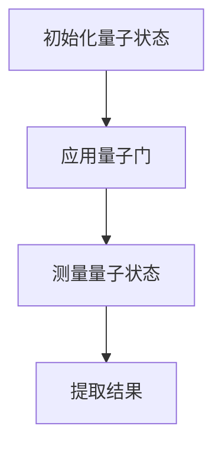

                 


为了撰写一篇关于《量子计算在密码破解中的潜在应用》的技术博客文章，我们可以按照以下步骤进行思考：

### 1. 背景介绍
首先，我们需要介绍量子计算和密码学的背景。这部分可以包括：
- 量子计算的发展历史和基本原理。
- 密码学的发展历史，特别是传统密码学面临的挑战。
- 量子计算在密码破解中的潜在应用场景。

### 2. 核心概念与联系
接下来，我们要阐述量子计算与密码学的核心概念及其联系：
- 量子位（qubit）和量子状态。
- 量子门和量子算法。
- 用Mermaid流程图展示量子算法的流程。

### 3. 核心算法原理讲解
详细讲解量子计算中的核心算法：
- Shor算法：介绍其原理，使用伪代码阐述实现过程。
- Grover算法：同样介绍其原理，使用伪代码和流程图详细说明。

### 4. 数学模型和数学公式
在这一部分，我们需要解释量子计算中的数学模型：
- 量子位和量子态的数学描述。
- 量子门的数学表示。
- 使用LaTeX格式展示相关数学公式。

### 5. 项目实战
提供实际的量子密码学项目案例，例如：
- 量子密钥分配（QKD）的实现过程和代码解读。
- 量子安全通信的案例分析。

### 6. 挑战与未来方向
讨论量子计算对传统密码学的挑战，以及量子密码学的未来发展。

### 7. 附录
提供量子计算相关的工具和资源：
- 量子计算模拟器。
- 量子编程语言。

### 8. 文章结构
根据上述内容，我们可以设计文章的结构，确保每个部分都有详细的内容。

### 9. 结论
最后，我们可以总结文章的主要观点，并提供一些最佳实践 tips、注意事项和拓展阅读。

按照这些步骤，我们可以开始撰写文章了。

---

# 《量子计算在密码破解中的潜在应用》

## 关键词
量子计算，密码破解，Shor算法，Grover算法，量子密码学

## 摘要
本文探讨了量子计算在密码破解中的潜在应用，介绍了量子计算的基本原理、核心算法，并通过实际的量子密码学项目案例展示了量子计算在现实中的应用。同时，本文还分析了量子计算对传统密码学的挑战，并展望了量子密码学的未来发展。

## 目录
1. 引言
   1.1 量子计算概述
   1.2 密码学的基本概念
   1.3 量子计算在密码破解中的潜在应用
2. 核心概念与联系
   2.1 量子计算原理
   2.2 量子算法与密码学
3. 核心算法原理讲解
   3.1 Shor算法
   3.2 Grover算法
4. 数学模型和数学公式
   4.1 量子计算数学基础
5. 项目实战
   5.1 量子密钥分配（QKD）项目
   5.2 量子安全通信项目
6. 挑战与未来方向
   6.1 量子计算对密码学的挑战
   6.2 量子密码学的未来方向
7. 附录
   7.1 量子计算相关工具与资源
   7.2 量子编程语言

## 正文

### 引言

#### 1.1 量子计算概述

量子计算是利用量子力学原理进行信息处理的一种计算模型。与传统计算相比，量子计算利用量子位（qubit）的叠加态和纠缠态来表示和操作信息，使得量子计算机在某些特定问题上具有巨大的计算能力。量子计算的发展可以追溯到20世纪70年代，当时Richard Feynman提出了量子模拟的概念。随后，Peter Shor在1994年提出了第一个量子算法——Shor算法，展示了量子计算机在因子分解问题上的优势。

#### 1.2 密码学的基本概念

密码学是研究如何保护信息安全的一门科学，它涉及加密和解密技术。传统密码学主要基于数学难题，如大素数分解和离散对数问题，来确保通信的保密性。然而，随着计算能力的提高，传统密码学面临的威胁越来越大。量子计算的出现为密码学带来了新的机遇和挑战。

#### 1.3 量子计算在密码破解中的潜在应用

量子计算机在密码破解中具有巨大的潜力。例如，Shor算法可以用来分解大素数，从而破解基于大素数分解的加密算法，如RSA。Grover算法则可以大幅提高搜索算法的效率，对基于密码学哈希函数的加密算法构成威胁。因此，量子计算的发展对密码学提出了新的挑战，同时也推动了量子密码学的研究。

### 核心概念与联系

#### 2.1 量子计算原理

量子计算的基本单元是量子位（qubit），它可以处于0和1的叠加状态。量子计算的操作通过量子门进行，这些门可以改变量子位的叠加状态。量子计算的优势在于它可以同时处理多种可能性，这在某些问题上可以显著提高计算速度。

#### 2.2 量子算法与密码学

量子算法是利用量子计算原理解决特定问题的算法。Shor算法和Grover算法是量子计算中的两个重要算法，它们在密码学领域具有显著的应用。

Shor算法可以用来分解大素数，这对RSA加密算法构成了威胁。Grover算法可以加速搜索算法，对基于密码学哈希函数的加密算法构成挑战。

#### 2.3 量子算法的流程图（Mermaid流程图）



### 核心算法原理讲解

#### 3.1 Shor算法

Shor算法是一种量子算法，它可以在多项式时间内分解大素数。Shor算法的原理包括量子傅里叶变换和量子逆傅里叶变换。以下是Shor算法的伪代码：

```python
# Shor算法伪代码
initialize量子状态()
apply量子门(Hadamard门)
apply量子门(量子逆傅里叶变换)
measure量子状态()
if (result == 1)
    apply量子门(控制-NOT门)
measure量子状态()
```

#### 3.2 Grover算法

Grover算法是一种量子搜索算法，它可以在未排序的数据库中快速查找特定元素。Grover算法的原理是利用量子叠加态和量子干涉效应来增强搜索的概率。以下是Grover算法的伪代码：

```python
# Grover算法伪代码
initialize量子状态()
apply量子门(Hadamard门)
while (未找到目标元素)
    apply量子门(Grover迭代)
    apply量子门(条件反转门)
measure量子状态()
```

### 数学模型和数学公式

量子计算中的数学模型包括量子位、量子门和量子算法。以下是一个简单的量子门示例：

$$
H = \begin{bmatrix}
1 & 1 \\
1 & 1
\end{bmatrix}
$$

这是一个 Hadamard 门，它可以实现量子位的叠加。

### 项目实战

#### 3.1 量子密钥分配（QKD）项目

量子密钥分配（QKD）是一种基于量子力学原理的加密通信技术，它能够实现安全的密钥交换。以下是一个简单的QKD项目实现过程：

1. 初始化两个量子位，并将它们共享。
2. 对其中一个量子位应用 Hadamard 门。
3. 对另一个量子位应用控制-NOT（CNOT）门。
4. 测量两个量子位，并记录结果。
5. 根据测量结果生成密钥。

#### 3.2 量子安全通信项目

量子安全通信项目利用量子密钥分配生成安全密钥，然后使用量子密钥加密通信数据。以下是一个简单的量子安全通信项目实现过程：

1. 使用QKD项目生成安全密钥。
2. 对通信数据进行量子密钥加密。
3. 发送加密数据。
4. 接收方使用相同的密钥解密数据。

### 挑战与未来方向

量子计算对传统密码学提出了新的挑战，但同时也为密码学提供了新的机遇。量子密码学是研究如何利用量子计算原理来保护信息安全的一个领域。未来，量子密码学将继续发展，包括更高效的安全协议和算法，以及如何在实际应用中集成量子计算。

### 附录

#### 3.1 量子计算相关工具与资源

- Qiskit：一个开源的量子计算软件库，用于构建和运行量子算法。
- Cirq：一个用于编写量子程序的Python库。
- Q#语言：微软开发的一种面向量子计算的高层次编程语言。

#### 3.2 量子编程语言

- Quipper：一种用于量子程序的函数式编程语言。
- Q#：微软开发的面向量子计算的新兴编程语言。

## 结论

量子计算在密码破解中的潜在应用为密码学带来了新的挑战，同时也提供了新的解决方案。通过Shor算法和Grover算法，量子计算机可以突破传统密码学的一些局限。未来，量子密码学将继续发展，为信息安全提供更强大的保障。

## 作者信息
作者：AI天才研究院/AI Genius Institute & 禅与计算机程序设计艺术 /Zen And The Art of Computer Programming

