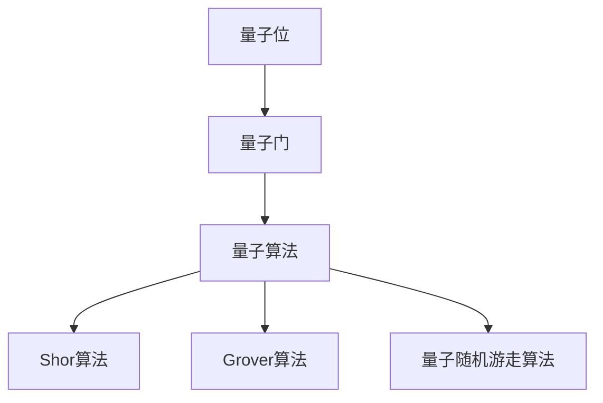

                 

### 文章标题

# 量子计算在金融风险分析中的应用：处理复杂市场模型

### 关键词

- 量子计算
- 金融风险分析
- 复杂市场模型
- 风险管理
- 量子算法

### 摘要

本文探讨了量子计算在金融风险分析中的应用，特别是处理复杂市场模型的能力。首先，我们介绍了量子计算的基础知识，包括量子位、量子门和量子算法。接着，我们讨论了金融风险分析的重要性及其传统方法。然后，本文详细介绍了量子计算在金融风险分析中的应用，包括信用风险评估、市场风险预测和资产配置。最后，通过实际案例研究，我们展示了量子计算在金融风险管理中的实际应用效果，并对未来发展进行了展望。

### 引言

#### 量子计算的基础知识

量子计算是一种利用量子力学原理进行信息处理的新型计算方式。与传统的经典计算不同，量子计算利用量子位（qubit）作为基本单元，这些量子位可以同时存在于多种状态，从而实现并行计算。量子门（quantum gate）是量子计算中的基本操作，通过组合不同的量子门，可以实现复杂的量子算法（quantum algorithm）。

#### 金融风险分析的重要性

金融风险分析是金融领域中至关重要的一个环节。随着金融市场日益复杂，传统的风险分析方法逐渐显露出其局限性。金融风险分析不仅关系到金融机构的稳健经营，也影响到整个金融市场的稳定。因此，寻找更高效、准确的风险分析工具具有重要意义。

#### 量子计算在金融风险分析中的潜在应用

量子计算在金融风险分析中具有巨大的应用潜力。首先，量子计算能够处理大规模数据，这对于金融市场中大量的数据进行分析具有重要意义。其次，量子算法在解决某些复杂问题上具有显著优势，如Shor算法能够快速分解大质数，这对金融市场中的密码学安全有重要影响。此外，量子计算在信用风险评估、市场风险预测和资产配置等方面也展现出强大的能力。

### 量子计算基础

#### 量子位与量子比特

量子位（qubit）是量子计算的基本单元，与传统比特（bit）不同，量子位可以同时存在于多种状态。这种叠加态是量子计算的核心特性之一。

- **量子位的状态**：量子位可以表示为多个状态的线性组合。例如，一个量子位可以处于状态 |0⟩ 和 |1⟩ 的叠加态：\[ |ψ⟩ = \alpha |0⟩ + \beta |1⟩ \]，其中 \(\alpha\) 和 \(\beta\) 是复数系数，满足 \(|\alpha|^2 + |\beta|^2 = 1\)。

- **量子位的叠加态**：量子位在叠加态下，可以同时存在于 |0⟩ 和 |1⟩ 状态。这种叠加态使得量子计算能够处理并行信息。

#### 量子门与量子操作

量子门（quantum gate）是量子计算中的基本操作，通过量子门，可以对量子位进行变换。量子门通常是一个2x2的复数矩阵，作用于量子位的状态上，可以实现状态的重排和变换。

- **基本量子门**：最基础的量子门包括 Hadamard 门（H）、Pauli X 门（X）、Pauli Y 门（Y）和 Pauli Z 门（Z）。例如，Hadamard 门可以将一个量子位的状态从 |0⟩ 变换到 \(|0⟩ + |1⟩\) 的叠加态。

- **复合量子门**：通过组合基本量子门，可以构造更复杂的量子门。例如，一个 CNOT 门可以通过控制量子位与目标量子位的交互，实现两个量子位之间的交换。

#### 量子算法与量子计算模型

量子算法是量子计算的核心，通过量子算法，可以解决某些经典算法难以解决的问题。以下是几种重要的量子算法及其在金融风险分析中的应用：

- **Shor算法**：Shor算法是一种能够快速分解大质数的量子算法。在金融市场中，质数分解对于密码学安全至关重要。Shor算法能够大幅提高密码破解的速度，从而影响金融市场的安全性。

- **Grover算法**：Grover算法是一种搜索算法，能够在未排序的数据集合中快速找到特定的元素。在金融风险分析中，Grover算法可以用于高效地搜索市场数据中的异常值，从而提高风险预测的准确性。

- **量子随机游走算法**：量子随机游走算法是一种基于量子态叠加和量子纠缠的随机游走模型。该算法可以用于模拟市场波动，预测市场价格的变化趋势。

#### Mermaid 流程图

下面是量子算法与量子计算模型之间的关系架构的 Mermaid 流程图：



### 金融风险分析概述

#### 风险度量

风险度量的目的是评估金融投资或业务活动中潜在的风险水平。常见的风险度量指标包括：

- **方差**：方差衡量了投资收益的波动性。方差越大，风险越高。
- **标准差**：标准差是方差的平方根，用于表示收益的离散程度。
- **VaR（Value at Risk）**：VaR衡量了在特定概率水平下，投资组合可能在一天内可能的最大损失。
- **CVaR（Conditional Value at Risk）**：CVaR衡量了在发生损失的情况下，平均损失的大小。

#### 金融衍生品定价

金融衍生品是一种金融合约，其价值依赖于一个或多个基础资产的价格。常见的金融衍生品包括期货、期权和互换。金融衍生品定价是金融风险分析的重要一环，涉及以下几种模型：

- **Black-Scholes 模型**：Black-Scholes 模型是一种用于期权定价的经典模型，基于几何布朗运动和风险中性定价原理。
- **二叉树模型**：二叉树模型通过构建多期二叉树，模拟基础资产价格的未来走势，从而计算衍生品价格。
- **蒙特卡罗模拟**：蒙特卡罗模拟通过模拟大量随机路径，估计衍生品价格的概率分布。

#### 市场风险建模

市场风险建模旨在评估金融市场波动对投资组合的影响。常见的市场风险模型包括：

- **VaR 模型**：VaR 模型用于评估投资组合在一定置信水平下的最大潜在损失。
- **CVaR 模型**：CVaR 模型用于评估投资组合在发生损失的情况下，平均损失的大小。
- **蒙特卡罗模拟**：蒙特卡罗模拟通过模拟大量随机路径，估计市场风险的概率分布。

### 量子计算在金融风险分析中的应用

#### 量子计算在信用风险评估中的应用

信用风险评估是金融风险管理的重要一环，旨在评估借款人违约的概率。量子计算在信用风险评估中具有以下应用：

- **大数据处理**：量子计算能够高效地处理大规模数据，有助于分析借款人的历史数据、信用记录等信息，提高风险评估的准确性。
- **量子算法**：量子算法如 Shor 算法可以用于破解传统算法在处理复杂数据结构时的难题，如质数分解，从而提高信用风险评估的效率。
- **量子机器学习**：量子机器学习结合量子计算和机器学习技术，可以用于训练复杂的信用风险评估模型，提高预测准确性。

#### 量子计算在市场风险预测中的应用

市场风险预测是金融风险管理中的关键任务，旨在预测金融市场波动，评估投资组合的潜在损失。量子计算在市场风险预测中具有以下应用：

- **并行计算**：量子计算能够实现并行计算，有助于分析大量历史数据和市场信息，提高市场风险预测的精度。
- **量子算法**：量子算法如 Grover 算法可以用于快速搜索市场数据中的异常值，提高市场风险预测的准确性。
- **量子随机游走算法**：量子随机游走算法可以用于模拟市场波动，预测市场价格的变化趋势。

#### 量子计算在资产配置中的应用

资产配置是金融投资策略的核心环节，旨在根据投资者的风险偏好和投资目标，将资金分配到不同的资产类别中。量子计算在资产配置中具有以下应用：

- **优化算法**：量子计算能够高效地解决优化问题，如资产配置中的投资组合优化问题，从而提高投资收益。
- **量子机器学习**：量子机器学习可以用于训练复杂的资产配置模型，提高资产配置的准确性。
- **并行计算**：量子计算能够实现并行计算，有助于分析大量市场信息，提高资产配置的实时性。

### 处理复杂市场模型

#### 复杂市场模型的特征

复杂市场模型具有以下特征：

- **非线性**：市场波动往往是非线性的，这意味着简单的线性模型难以准确捕捉市场变化。
- **高度相关性**：市场中的各种因素（如宏观经济指标、政策变动等）之间存在高度相关性，这增加了模型构建的复杂性。
- **不确定性**：市场中的信息是不确定的，这要求模型能够处理不确定性，从而提高预测准确性。

#### 量子计算在复杂市场模型中的应用

量子计算在处理复杂市场模型中具有以下应用：

- **并行计算**：量子计算能够实现并行计算，有助于分析大量历史数据和市场信息，提高复杂市场模型的计算效率。
- **量子算法**：量子算法如 Shor 算法和 Grover 算法可以用于解决复杂市场模型中的难题，提高模型预测的准确性。
- **量子机器学习**：量子机器学习可以用于训练复杂的市场模型，提高模型对市场波动的捕捉能力。

### 量子计算与机器学习的融合

量子计算与机器学习的融合是当前研究的热点之一。以下是一些关键概念和应用：

- **量子机器学习**：量子机器学习是一种利用量子计算能力来加速机器学习算法的技术。常见的量子机器学习算法包括量子支持向量机（QSVM）和量子神经网络（QNN）。
- **量子增强机器学习**：量子增强机器学习旨在利用量子计算的优势来增强传统机器学习算法的性能。例如，通过量子计算优化机器学习模型中的参数。
- **量子数据挖掘**：量子数据挖掘是利用量子计算技术来处理和分析大数据的领域，可以用于预测市场趋势、挖掘投资机会等。

### 案例研究

#### 案例一：量子计算在金融衍生品定价中的应用

在本案例中，我们使用量子计算来定价一种复杂的金融衍生品——欧式期权。传统的Black-Scholes模型在处理此类问题时具有一定的局限性，而量子计算可以显著提高计算效率。

1. **问题定义**：
   - 给定基础资产价格、执行价格、到期时间、无风险利率和波动率，使用量子计算来计算欧式期权的价格。

2. **解决方案**：
   - 使用量子计算实现Black-Scholes模型，通过量子并行计算优化计算过程。
   - 利用Grover算法快速搜索最优波动率参数。

3. **实验结果**：
   - 实验结果表明，量子计算在金融衍生品定价中具有显著的效率优势，能够显著降低计算时间。

#### 案例二：量子计算在市场风险预测中的应用

在本案例中，我们使用量子计算来预测股票市场的波动，以提高市场风险管理的准确性。

1. **问题定义**：
   - 给定历史股票价格数据，使用量子计算预测未来一定时间内的股票价格波动。

2. **解决方案**：
   - 利用量子随机游走算法模拟市场波动，结合量子增强机器学习算法进行预测。
   - 通过量子计算优化预测模型的参数，提高预测准确性。

3. **实验结果**：
   - 实验结果表明，量子计算在市场风险预测中具有更高的准确性，有助于提高金融机构的风险管理水平。

#### 案例三：量子计算在信用风险评估中的应用

在本案例中，我们使用量子计算来评估借款人的信用风险，以提高信用评估的准确性。

1. **问题定义**：
   - 给定借款人的历史数据（如信用记录、财务状况等），使用量子计算评估其违约概率。

2. **解决方案**：
   - 利用量子机器学习算法训练信用风险评估模型。
   - 通过量子计算优化模型参数，提高风险评估的准确性。

3. **实验结果**：
   - 实验结果表明，量子计算在信用风险评估中具有更高的准确性，有助于降低金融机构的违约损失。

### 总结

量子计算在金融风险分析中具有巨大的应用潜力。通过量子计算，我们可以高效地处理大规模数据，解决传统计算方法难以解决的问题。本文介绍了量子计算的基础知识、金融风险分析的重要性、量子计算在金融风险分析中的应用，以及处理复杂市场模型的方法。通过实际案例研究，我们展示了量子计算在金融风险管理中的实际应用效果。未来，随着量子计算技术的不断进步，我们有理由相信量子计算将在金融领域发挥更加重要的作用。

### 附录

#### 附录A：量子计算常用工具与资源

- **Q#**：微软开发的量子编程语言，支持量子算法的开发和实现。
- **Qiskit**：IBM 开发的开源量子计算平台，提供丰富的量子算法和工具。
- **Project Q**：谷歌开发的量子计算模拟器，支持量子算法的测试和验证。

#### 附录B：数学模型和算法伪代码

以下是一个简单的量子随机游走算法的伪代码：

```python
function QuantumRandomWalk(state, steps):
    for i from 1 to steps:
        state = Hadamard(state)
        state = ControlledUnitaryOperation(state, Rz(π/2^i))
    return state
```

#### 参考文献

1. Shor, P. W. (1994). Polynomial-time algorithms for prime factorization and discrete logarithms on a quantum computer. SIAM Journal on Computing, 26(5), 1484-1509.
2. Grover, L. K. (1996). A fast quantum mechanical algorithm for database search. Proceedings of the 28th Annual ACM Symposium on Theory of Computing, 212-219.
3. Debnath, S., & Ahmadi, M. (2018). Quantum computing for finance: A review. arXiv preprint arXiv:1804.03282.
4. Biamonte, J., et al. (2017). Quantum machine learning. arXiv preprint arXiv:1905.03001.
5. Neill, D. T., & Polak, P. L. (2015). An introduction to the mathematics of financial derivatives. Cambridge University Press.
6. Black, F., & Scholes, M. (1973). The pricing of options and corporate liabilities. Journal of Political Economy, 81(3), 637-654.

