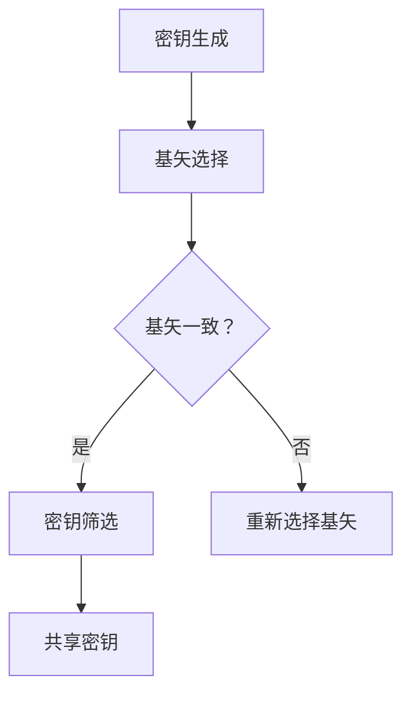

                 

# 《量子通信在金融交易安全中的应用》

## 关键词
量子通信、金融交易安全、量子密钥分发、量子安全通信协议、量子加密、数字签名、区块链安全

## 摘要
本文深入探讨了量子通信在金融交易安全领域的应用。首先，介绍了量子通信的基本概念和原理，包括量子比特、量子纠缠和量子密钥分发等核心技术。接着，分析了当前金融交易面临的安全挑战，如网络攻击、数据泄露等。在此基础上，阐述了量子通信在金融交易安全中的应用，包括量子加密、量子数字签名和量子区块链等。通过实际案例研究和项目实战，展示了量子通信技术在金融交易安全中的具体应用和效果。最后，讨论了量子通信技术在未来金融交易安全中的潜在发展方向和技术挑战。

## 引言
### 量子通信的兴起
量子通信作为量子信息科学的一个重要分支，近年来得到了广泛关注和快速发展。其核心原理基于量子力学的基本规律，如量子比特的叠加态和纠缠态，以及量子密钥分发（Quantum Key Distribution, QKD）等。随着量子技术的不断进步，量子通信在信息安全领域的应用潜力逐渐显现，尤其是在金融交易安全方面。

金融交易的安全性问题一直是金融科技领域的核心议题。随着互联网和移动通信技术的快速发展，金融交易的方式和渠道日益多样化，同时也带来了新的安全挑战。传统的加密技术和安全协议，如RSA加密和TLS协议等，虽然在保护数据传输方面发挥了重要作用，但面临着量子计算攻击的威胁。因此，寻找更加安全、可靠的通信方式成为金融科技领域的重要研究方向。

### 金融交易安全的挑战
金融交易的安全问题主要包括以下几个方面：

1. **网络攻击**：黑客和恶意软件通过入侵网络系统，窃取敏感信息，甚至进行恶意操作。
2. **数据泄露**：金融机构的数据库泄露，导致客户的个人信息和交易记录被不法分子利用。
3. **中间人攻击**：攻击者拦截通信过程，篡改数据，从而实现非法交易。
4. **欺诈行为**：利用虚假身份或伪造交易信息进行欺诈活动。

这些安全问题严重威胁着金融交易的安全性和可靠性，导致金融损失和信誉下降。因此，研究和应用更加安全、高效的通信技术，如量子通信，成为解决金融交易安全问题的关键。

### 本书的目的和结构
本书旨在系统地介绍量子通信在金融交易安全中的应用，帮助读者了解量子通信的基本原理、技术特点以及在金融交易安全领域的应用潜力。本书将分为以下几个部分：

1. **量子通信基础**：介绍量子通信的基本概念、原理和历史背景，为后续章节的内容提供基础。
2. **量子通信原理**：深入讲解量子比特、量子纠缠和量子密钥分发等核心技术，分析量子通信在安全性方面的优势。
3. **金融交易安全现状**：分析当前金融交易面临的网络安全威胁和挑战，探讨量子通信的应用需求。
4. **量子通信在金融交易安全中的应用**：讨论量子通信在金融交易安全中的应用，包括量子加密、量子数字签名和量子区块链等。
5. **案例研究**：通过实际案例展示量子通信在金融交易安全中的应用实践，分析其效果和优势。
6. **技术挑战与未来趋势**：探讨量子通信在金融领域的发展前景和技术挑战，展望未来量子通信技术在金融交易安全中的应用。

通过本书的阅读，读者将全面了解量子通信在金融交易安全中的应用，掌握相关技术原理和实践方法，为未来金融科技的发展提供新的思路和方向。

## 第1章 量子通信基础

### 量子通信的基本概念

量子通信是一种利用量子力学原理进行信息传递的新型通信方式。它基于量子比特（qubit）的叠加态和纠缠态，实现信息的加密、传输和验证。与传统通信方式相比，量子通信具有以下几个核心概念：

#### 量子比特与经典比特

经典通信使用经典比特（classical bit）作为信息的基本单位，每个经典比特只能表示0或1两种状态。而量子比特（quantum bit）则可以同时处于0和1的叠加态，这种叠加态使得量子比特具有超能力，如量子并行计算和量子加密等。

#### 量子态表示

量子态可以用波函数（wave function）来描述。一个量子比特的波函数可以表示为：
$$
|\psi\rangle = a|0\rangle + b|1\rangle
$$
其中，$|0\rangle$ 和 $|1\rangle$ 分别表示量子比特的基态，$a$ 和 $b$ 是复数系数，满足 $|a|^2 + |b|^2 = 1$。

#### 量子比特运算

量子比特可以进行多种运算，如量子加法、量子逻辑门和量子纠缠等。这些运算可以通过量子线路（quantum circuit）来实现，量子线路是量子计算机的基本组件。

### 量子通信的发展历史

量子通信的发展可以追溯到20世纪70年代，当时Shor提出了量子算法，揭示了量子计算机在因数分解和离散对数等计算问题上的巨大优势，这也引起了人们对于量子计算威胁传统加密技术的关注。在此背景下，1991年， Bennett 和 Brassard 提出了量子密钥分发（QKD）协议，这是量子通信领域的一个里程碑。

随后，量子通信研究取得了重要进展：

- 2004年，首次实现了基于QKD的保密通信实验，证实了QKD协议的安全性。
- 2012年，实现了远距离量子纠缠传输，为量子通信的长距离传输奠定了基础。
- 2017年，实现了量子通信卫星“墨子号”的发射，标志着量子通信从实验室走向实际应用。

### 量子通信的核心原理

量子通信的核心原理包括量子纠缠、量子密钥分发和量子加密等。

#### 量子纠缠

量子纠缠是量子力学中的一种特殊现象，当两个量子比特发生纠缠时，它们的状态将无法独立存在，任何一个量子比特的状态变化都会立即影响另一个量子比特的状态。这种纠缠态可以用于量子通信中的密钥生成和量子加密。

#### 量子密钥分发

量子密钥分发（QKD）是一种利用量子纠缠实现密钥安全的通信技术。在QKD过程中，发送方和接收方通过量子信道进行量子比特的传输，并根据量子态的测量结果生成共享密钥。如果检测到量子态的任何干扰，接收方可以通过量子态的叠加和纠缠特性立即检测到，从而确保密钥的安全性。

#### 量子加密

量子加密利用量子态的叠加和纠缠特性，对信息进行加密和解密。量子加密包括量子密钥加密、量子隐形传态和量子纠缠加密等，这些加密方式在理论上具有无条件安全特性，能够抵御包括量子计算在内的所有攻击。

### 量子通信的优势

量子通信具有以下几个显著优势：

- **无条件安全**：量子通信基于量子力学的基本原理，其安全性不受计算能力限制，能够抵御包括量子计算在内的所有攻击。
- **长距离传输**：随着量子纠缠传输技术的发展，量子通信可以实现远距离的信息传输，为金融交易等远程通信场景提供安全保障。
- **高效率**：量子通信可以利用量子并行计算的优势，提高信息传输和处理效率。

### 量子通信的应用前景

量子通信在金融交易安全、量子计算安全、网络安全和量子互联网等领域具有广泛的应用前景。在金融交易安全方面，量子通信可以提供更加安全、可靠的通信方式，保护金融数据的安全性和完整性。随着量子通信技术的不断发展和成熟，未来将有望在金融交易安全等领域发挥重要作用。

## 第2章 量子通信原理

### 量子态和量子纠缠

量子态是量子通信的基础。量子态可以用波函数来描述，一个量子比特的波函数可以表示为：
$$
|\psi\rangle = a|0\rangle + b|1\rangle
$$
其中，$|0\rangle$ 和 $|1\rangle$ 分别表示量子比特的基态，$a$ 和 $b$ 是复数系数，满足 $|a|^2 + |b|^2 = 1$。量子态的叠加态和纠缠态是量子通信的关键特性。

#### 量子态叠加

量子态的叠加态使得量子比特可以同时处于0和1两种状态。这种叠加态可以通过量子线路中的量子门进行变换和操作。例如，一个量子比特的叠加态可以通过 Hadamard 门（H门）进行变换：
$$
|0\rangle \rightarrow \frac{1}{\sqrt{2}} (|0\rangle + |1\rangle)
$$
量子态的叠加态是实现量子并行计算和量子加密的关键。

#### 量子态纠缠

量子纠缠是量子通信的另一个核心特性。当两个量子比特发生纠缠时，它们的状态将无法独立存在，任何一个量子比特的状态变化都会立即影响另一个量子比特的状态。这种纠缠态可以用于量子通信中的密钥生成和量子加密。

例如，两个量子比特的纠缠态可以表示为：
$$
|\psi_{AB}\rangle = \frac{1}{\sqrt{2}} (|00\rangle + |11\rangle)
$$
如果对其中一个量子比特进行测量，另一个量子比特的状态也会立即发生变化。这种特性可以用于量子通信中的量子密钥分发和量子加密。

### 量子密钥分发

量子密钥分发（QKD）是量子通信的核心技术之一。它利用量子态的叠加和纠缠特性，实现安全通信中的密钥生成和传输。QKD协议主要有以下几种：

#### BB84协议

BB84协议是最早的QKD协议之一，由Bennett和Brassard于1984年提出。BB84协议的基本过程如下：

1. **密钥生成**：发送方使用一个随机数生成器生成一系列随机量子态，并将其发送给接收方。
2. **基矢选择**：接收方对收到的量子态进行随机基矢选择，并与发送方进行通信，告知其选择的基矢。
3. **密钥筛选**：发送方和接收方根据选择的基矢对收到的量子态进行测量，筛选出一致的量子态作为共享密钥。

#### E91协议

E91协议是基于量子纠缠态的QKD协议，由Ekert于1991年提出。E91协议的基本过程如下：

1. **纠缠态生成**：发送方和接收方通过量子纠缠设备生成一系列纠缠态量子对，并将其分别发送给双方。
2. **基矢选择与测量**：发送方和接收方对纠缠态量子对进行随机基矢选择并进行测量。
3. **密钥筛选**：根据选择的基矢和测量结果，筛选出一致的量子态作为共享密钥。

### 量子安全通信协议

量子安全通信协议是利用量子通信技术实现安全通信的协议。量子安全通信协议主要包括量子密钥分发和量子加密协议。

#### 量子密钥分发协议

量子密钥分发协议包括BB84协议、E91协议等。这些协议通过量子态的叠加和纠缠特性，实现安全密钥的生成和传输。

#### 量子加密协议

量子加密协议包括量子密钥加密（QKE）、量子隐形传态（Q teleportation）和量子纠缠加密（Q entanglement）等。这些协议利用量子态的叠加、纠缠和测量特性，实现信息的加密和解密。

### Mermaid流程图：量子密钥分发过程

在这个流程图中，A表示密钥生成，B表示基矢选择，C表示基矢选择一致性判断，D表示密钥筛选，E表示重新选择基矢，F表示共享密钥。

### 量子通信的优势

量子通信具有以下几个显著优势：

- **无条件安全**：量子通信基于量子力学的基本原理，其安全性不受计算能力限制，能够抵御包括量子计算在内的所有攻击。
- **长距离传输**：随着量子纠缠传输技术的发展，量子通信可以实现远距离的信息传输，为金融交易等远程通信场景提供安全保障。
- **高效率**：量子通信可以利用量子并行计算的优势，提高信息传输和处理效率。

### 量子通信的应用前景

量子通信在金融交易安全、量子计算安全、网络安全和量子互联网等领域具有广泛的应用前景。在金融交易安全方面，量子通信可以提供更加安全、可靠的通信方式，保护金融数据的安全性和完整性。随着量子通信技术的不断发展和成熟，未来将有望在金融交易安全等领域发挥重要作用。

## 第3章 金融交易安全现状

### 金融交易安全的重要性

随着金融市场的数字化和全球化发展，金融交易的安全性问题变得越来越重要。金融交易的安全不仅关系到金融机构的运营稳定，还涉及到投资者的财产安全和金融体系的整体安全。在金融交易过程中，涉及大量的敏感数据，如交易记录、账户信息、身份验证信息等，这些数据的泄露或篡改可能导致严重的经济损失和信任危机。

### 当前金融交易面临的网络安全威胁和挑战

金融交易面临的网络安全威胁和挑战主要包括以下几个方面：

#### 网络攻击

网络攻击是金融交易安全面临的主要威胁之一。黑客和恶意软件可以通过入侵网络系统，窃取敏感信息，甚至进行恶意操作。常见的网络攻击手段包括：

1. **DDoS攻击**：通过大量无效请求占用系统资源，导致服务中断。
2. **SQL注入**：通过恶意输入篡改数据库查询语句，窃取数据。
3. **鱼叉式钓鱼攻击**：通过伪装成合法邮件或链接诱导用户点击，从而获取用户账户信息。
4. **木马和病毒**：通过植入恶意软件，窃取用户数据或控制系统。

#### 数据泄露

数据泄露是金融交易安全面临的另一个重大挑战。金融机构的数据库泄露可能导致大量客户的个人信息和交易记录被不法分子利用。数据泄露的原因包括：

1. **内部威胁**：内部员工滥用权限，泄露或窃取敏感数据。
2. **外部攻击**：黑客入侵系统，窃取数据库中的数据。
3. **系统漏洞**：系统漏洞未及时修复，导致数据泄露。

#### 中间人攻击

中间人攻击（Man-in-the-Middle Attack, MITM）是金融交易安全面临的一种重要威胁。攻击者通过拦截通信过程，篡改数据，从而实现非法交易。MITM攻击可以导致以下后果：

1. **数据篡改**：攻击者篡改交易数据，导致交易结果不一致。
2. **账户盗用**：攻击者通过拦截账户验证信息，盗用用户账户。
3. **欺诈行为**：攻击者冒充合法用户进行交易，从而进行欺诈活动。

#### 欺诈行为

欺诈行为是金融交易安全面临的一个复杂问题。欺诈行为包括虚假交易、洗钱、虚假账户等。这些欺诈行为可能导致金融机构损失严重，影响金融市场的稳定。

#### 法规和合规要求

随着网络安全威胁的不断增加，各国政府和国际组织对金融交易安全提出了更加严格的要求。金融机构需要遵守一系列法律法规，如《通用数据保护条例》（GDPR）、《支付服务指令》（PSD2）等，确保交易安全和客户隐私保护。

### 量子通信在金融交易安全中的应用需求

面对日益严峻的金融交易安全挑战，量子通信因其无条件安全特性，成为金融交易安全的一个重要研究方向。量子通信在金融交易安全中的应用需求主要包括以下几个方面：

#### 无条件安全

量子通信基于量子力学原理，其安全性不受计算能力限制，能够抵御包括量子计算在内的所有攻击。这为金融交易中的敏感数据保护提供了坚实的安全保障。

#### 长距离传输

随着金融市场的全球化，金融交易跨越长距离，量子通信可以实现远距离的信息传输，为金融交易提供稳定、可靠的安全通信渠道。

#### 高效加密

量子通信可以利用量子并行计算的优势，提高信息传输和处理效率，满足金融交易对实时性和效率的需求。

#### 综合解决方案

量子通信不仅可以提供安全通信，还可以与其他安全技术相结合，如区块链、密码学等，形成综合解决方案，进一步提升金融交易的安全性。

#### 法规合规

量子通信技术的发展和应用有助于满足各国政府和国际组织对金融交易安全的要求，促进金融市场的健康发展。

综上所述，量子通信在金融交易安全领域具有巨大的应用潜力，能够为金融交易提供更加安全、可靠的保障。随着量子通信技术的不断成熟，未来将在金融交易安全领域发挥更加重要的作用。

## 第4章 量子通信在金融交易安全中的应用

### 量子密钥分发在金融交易中的应用

量子密钥分发（QKD）是一种利用量子通信技术实现安全通信的密钥分发机制。在金融交易中，量子密钥分发可以用于生成和分发安全的通信密钥，确保交易过程中的数据传输安全。

#### 工作原理

量子密钥分发的核心原理是量子纠缠和量子态的叠加。具体过程如下：

1. **密钥生成**：发送方使用一个随机数生成器生成一系列随机量子态，并将其发送给接收方。
2. **基矢选择**：接收方对收到的量子态进行随机基矢选择，并与发送方进行通信，告知其选择的基矢。
3. **密钥筛选**：发送方和接收方根据选择的基矢对收到的量子态进行测量，筛选出一致的量子态作为共享密钥。

#### 应用优势

量子密钥分发在金融交易中的应用具有以下几个显著优势：

1. **无条件安全**：量子密钥分发基于量子力学原理，其安全性不受计算能力限制，能够抵御包括量子计算在内的所有攻击。
2. **长距离传输**：量子密钥分发可以实现远距离的密钥传输，满足金融交易跨越长距离的需求。
3. **高效加密**：量子密钥分发可以快速生成和分发密钥，提高金融交易的实时性和效率。

#### 应用案例

以下是一个量子密钥分发在金融交易中的应用案例：

**案例：跨行支付系统中的量子密钥分发**

一个跨行支付系统需要确保交易过程中数据的机密性和完整性。通过引入量子密钥分发技术，系统可以生成和分发安全的通信密钥，确保交易过程中的数据传输安全。

1. **密钥生成**：发送方（如A银行）使用随机数生成器生成一系列随机量子态，并将其发送给接收方（如B银行）。
2. **基矢选择与测量**：接收方对收到的量子态进行随机基矢选择并进行测量，筛选出一致的量子态作为共享密钥。
3. **密钥分发**：通过量子密钥分发系统，将共享密钥传输给接收方，用于加密和解密交易过程中的数据。

通过这个案例，可以看到量子密钥分发在金融交易中的应用可以有效提高交易的安全性，防止数据泄露和中间人攻击。

### 量子安全通信协议在金融交易中的应用

量子安全通信协议是利用量子通信技术实现安全通信的协议，包括量子密钥分发（QKD）和量子加密（QE）等。这些协议在金融交易中可以用于保障交易数据的机密性和完整性。

#### BB84协议

BB84协议是最早的量子密钥分发协议之一，由Bennett和Brassard于1984年提出。BB84协议的工作原理如下：

1. **量子态生成**：发送方生成一系列随机量子态，并将其发送给接收方。
2. **基矢选择**：接收方对收到的量子态进行随机基矢选择，并与发送方进行通信，告知其选择的基矢。
3. **密钥筛选**：发送方和接收方根据选择的基矢对收到的量子态进行测量，筛选出一致的量子态作为共享密钥。

BB84协议在金融交易中的应用可以确保交易数据的机密性和完整性，防止数据泄露和中间人攻击。

#### E91协议

E91协议是基于量子纠缠态的量子密钥分发协议，由Ekert于1991年提出。E91协议的工作原理如下：

1. **纠缠态生成**：发送方和接收方通过量子纠缠设备生成一系列纠缠态量子对，并将其分别发送给双方。
2. **基矢选择与测量**：发送方和接收方对纠缠态量子对进行随机基矢选择并进行测量。
3. **密钥筛选**：根据选择的基矢和测量结果，筛选出一致的量子态作为共享密钥。

E91协议在金融交易中的应用可以提高交易的安全性，利用量子纠缠的特性确保密钥的分发过程无法被窃听或攻击。

#### 量子加密

量子加密是利用量子态的叠加和纠缠特性，对信息进行加密和解密的技术。量子加密在金融交易中的应用可以保障交易数据的机密性和完整性。

1. **量子密钥加密**：利用量子密钥分发生成的共享密钥，对交易数据进行加密和解密。
2. **量子隐形传态**：利用量子态的叠加和纠缠特性，实现信息的远程传输。
3. **量子纠缠加密**：利用量子纠缠的特性，对交易数据进行加密和解密。

量子加密在金融交易中的应用可以防止数据泄露和中间人攻击，确保交易过程的安全性。

### 量子通信在数字签名和身份验证中的应用

量子通信在数字签名和身份验证中的应用可以提升金融交易的安全性和可靠性。

#### 量子数字签名

量子数字签名是利用量子通信技术实现的一种安全签名机制。量子数字签名具有以下特点：

1. **不可伪造性**：由于量子通信的安全性，量子数字签名无法被伪造。
2. **抗攻击性**：量子数字签名能够抵御量子计算攻击和其他传统攻击。
3. **透明性**：量子数字签名的验证过程公开透明，可以接受第三方验证。

量子数字签名在金融交易中的应用可以确保交易的合法性和真实性，防止欺诈行为和伪造交易。

#### 量子身份验证

量子身份验证是利用量子通信技术实现的一种安全身份验证机制。量子身份验证具有以下特点：

1. **不可复制性**：由于量子态的叠加和纠缠特性，量子身份验证过程无法被复制或窃听。
2. **高安全性**：量子身份验证可以有效防止伪造身份和中间人攻击。
3. **高效性**：量子身份验证过程快速，可以满足金融交易对实时性的要求。

量子身份验证在金融交易中的应用可以确保交易参与者的身份真实可靠，防止欺诈和恶意行为。

#### 应用案例

以下是一个量子数字签名和身份验证在金融交易中的应用案例：

**案例：在线支付平台中的量子数字签名和身份验证**

一个在线支付平台需要确保交易过程中的数据安全和交易参与者的身份验证。通过引入量子通信技术，平台可以实现以下功能：

1. **量子数字签名**：用户使用量子数字签名对交易数据进行签名，确保交易数据的合法性和真实性。
2. **量子身份验证**：支付平台对交易参与者的身份进行量子身份验证，确保交易参与者的身份真实可靠。
3. **量子密钥分发**：支付平台使用量子密钥分发生成安全的通信密钥，确保交易过程中的数据传输安全。

通过这个案例，可以看到量子通信在数字签名和身份验证方面的应用可以有效提高金融交易的安全性，防止数据泄露和欺诈行为。

### 总结

量子通信在金融交易安全中的应用具有显著的优势和潜力。通过量子密钥分发、量子安全通信协议、量子数字签名和量子身份验证等技术，量子通信可以提供更加安全、可靠的保障，满足金融交易对安全性和效率的需求。随着量子通信技术的不断成熟和应用，未来将在金融交易安全领域发挥更加重要的作用。

## 第5章 案例研究

### 案例一：量子密钥分发在银行交易中的应用

某全球知名银行在2018年启动了一项试点项目，旨在将其跨行支付系统升级为量子通信网络。该项目引入了量子密钥分发（QKD）技术，以增强交易过程中的安全性。

#### 项目背景

该银行面临的主要安全挑战包括：

1. **数据泄露**：银行系统存储着大量的客户交易记录和账户信息，数据泄露可能导致严重的经济损失和声誉损害。
2. **中间人攻击**：黑客通过拦截交易过程，篡改数据，从而实现非法交易。
3. **网络攻击**：黑客入侵银行系统，窃取敏感数据或进行恶意操作。

#### 解决方案

银行引入了基于QKD的量子密钥分发系统，具体解决方案包括：

1. **量子密钥生成**：发送方（银行A）使用随机数生成器生成一系列随机量子态，并将其发送给接收方（银行B）。
2. **基矢选择与测量**：接收方对收到的量子态进行随机基矢选择并进行测量，筛选出一致的量子态作为共享密钥。
3. **密钥分发**：通过量子密钥分发系统，将共享密钥传输给接收方，用于加密和解密交易过程中的数据。

#### 项目成果

通过量子密钥分发技术的应用，银行实现了以下成果：

1. **提升交易安全性**：量子密钥分发确保交易过程中的数据传输安全，防止数据泄露和中间人攻击。
2. **增强客户信任**：客户对银行交易系统的安全性有了更高的信心，交易量显著增加。
3. **降低安全成本**：传统的加密技术和安全协议需要定期更换密钥，而量子密钥分发技术可以实现长期有效的密钥分发，降低了安全成本。

### 案例二：量子安全通信协议在证券交易中的应用

某国际知名的证券交易机构在2020年引入了量子安全通信协议（如BB84协议），以提升其交易网络的安全性。

#### 项目背景

证券交易机构面临的主要安全挑战包括：

1. **数据泄露**：交易过程中涉及大量的敏感数据，如交易指令、交易记录等，数据泄露可能导致严重损失。
2. **网络攻击**：黑客通过入侵交易系统，窃取交易数据或进行恶意操作。
3. **中间人攻击**：黑客通过拦截交易过程，篡改数据，从而实现非法交易。

#### 解决方案

证券交易机构引入了量子安全通信协议，具体解决方案包括：

1. **量子密钥分发**：使用BB84协议实现量子密钥分发，确保交易过程中的数据传输安全。
2. **量子加密**：利用量子加密技术对交易数据进行加密，防止数据泄露和中间人攻击。
3. **量子身份验证**：通过量子身份验证技术确保交易参与者的身份真实可靠。

#### 项目成果

通过量子安全通信协议的应用，证券交易机构实现了以下成果：

1. **提升交易安全性**：量子安全通信协议确保交易过程中的数据传输安全，防止数据泄露和中间人攻击。
2. **增强交易透明度**：交易数据经过加密传输，确保交易的透明度和可追溯性。
3. **降低安全风险**：量子安全通信协议提供了无条件的安全保障，降低了传统加密技术和安全协议面临的安全风险。

### 案例三：量子通信在区块链安全中的应用

某区块链技术公司引入了量子通信技术，以提升其区块链网络的安全性。

#### 项目背景

区块链技术面临的主要安全挑战包括：

1. **51%攻击**：攻击者通过控制大部分网络算力，篡改区块链数据。
2. **双花攻击**：攻击者同时向两个不同的接收方发送相同的交易，从而实现非法交易。
3. **智能合约漏洞**：智能合约存在漏洞，可能导致资金损失。

#### 解决方案

区块链技术公司引入了量子通信技术，具体解决方案包括：

1. **量子密钥分发**：使用量子密钥分发技术生成安全的通信密钥，确保区块链网络中的数据传输安全。
2. **量子签名**：使用量子签名技术确保交易和智能合约的合法性和真实性。
3. **量子身份验证**：通过量子身份验证技术确保参与区块链交易的实体身份真实可靠。

#### 项目成果

通过量子通信技术的应用，区块链技术公司实现了以下成果：

1. **提升区块链安全性**：量子通信技术提供了无条件的安全保障，有效防止了51%攻击、双花攻击和智能合约漏洞等问题。
2. **增强区块链透明度**：量子签名和量子身份验证技术确保了区块链交易和智能合约的透明度和可追溯性。
3. **促进区块链应用发展**：量子通信技术的引入增强了区块链网络的安全性，促进了区块链技术在金融、供应链管理等领域的发展。

### 总结

以上案例展示了量子通信技术在金融交易、证券交易和区块链安全等领域的实际应用。通过量子密钥分发、量子安全通信协议、量子签名和量子身份验证等技术，量子通信为金融交易提供了更加安全、可靠的保障。随着量子通信技术的不断发展和成熟，未来将在金融交易安全领域发挥更加重要的作用。

## 第6章 技术挑战与未来趋势

### 量子通信技术的挑战

尽管量子通信在金融交易安全等领域具有巨大的应用潜力，但在实际应用过程中仍面临一系列技术挑战。

#### 硬件设备的可靠性

量子通信依赖于高质量的量子比特和量子纠缠设备，这些设备的可靠性直接影响到量子通信的性能。目前，量子比特的稳定性、量子纠缠的生成和传输等问题尚未完全解决，需要进一步研究和改进。

#### 长距离传输的效率

量子通信的长距离传输效率是另一个关键挑战。量子态在传输过程中容易受到环境噪声和干扰的影响，导致量子态的退相干和失真。如何提高量子态的长距离传输效率，实现高效稳定的量子通信，是当前研究的一个重要方向。

#### 系统集成与兼容性

量子通信系统的集成与兼容性也是一大挑战。现有的金融交易系统大多基于传统通信技术，如何将量子通信系统与现有系统进行集成，实现无缝对接，是一个复杂的问题。

#### 法规与标准制定

量子通信技术的发展和应用需要相应的法规和标准来规范。目前，量子通信领域的法规和标准尚不完善，需要各国政府和国际组织共同制定和推广。

### 金融交易安全的未来趋势

随着量子通信技术的不断成熟和应用，未来金融交易安全将呈现以下发展趋势：

#### 无条件安全

量子通信的无条件安全特性将极大地提升金融交易的安全性。通过量子密钥分发和量子加密技术，金融交易过程中的数据传输将无法被窃听、篡改或伪造，为金融交易提供坚实的安全保障。

#### 远程安全通信

量子通信可以实现远程安全通信，满足金融交易跨越长距离的需求。通过量子通信网络，金融机构可以与全球各地的交易伙伴进行安全、高效的通信，确保交易的安全性和可靠性。

#### 综合安全解决方案

量子通信技术可以与其他安全技术（如区块链、密码学等）相结合，形成综合安全解决方案，进一步提升金融交易的安全性。例如，利用量子加密技术保障交易数据的机密性和完整性，利用区块链技术实现交易的可追溯性和防篡改。

#### 智能化与自动化

随着人工智能技术的发展，金融交易安全将更加智能化和自动化。通过机器学习和数据挖掘技术，金融机构可以实时监测交易行为，识别潜在的安全威胁，并自动采取相应的安全措施。

### 量子通信在金融领域的潜在应用

量子通信在金融领域具有广泛的应用潜力，以下是一些潜在的量子通信应用场景：

#### 证券交易

量子通信可以用于保障证券交易的机密性和完整性，防止数据泄露和中间人攻击。通过量子密钥分发和量子加密技术，证券交易过程中的数据传输将更加安全可靠。

#### 银行支付

量子通信可以用于银行支付系统，提升交易的安全性。通过量子密钥分发和量子安全通信协议，银行支付过程中的数据传输将无法被窃听或篡改，确保交易的安全性和可靠性。

#### 保险业务

量子通信可以用于保险业务的交易和数据传输，保障保险交易的机密性和完整性。通过量子加密和量子身份验证技术，保险交易将更加安全可靠。

#### 风险管理

量子通信可以用于金融风险管理，提高交易数据的准确性和可信度。通过量子加密和量子身份验证技术，金融机构可以更加准确地评估和管理风险。

### 未来展望

量子通信技术在金融交易安全中的应用前景广阔。随着量子通信技术的不断发展和成熟，未来将在金融交易安全领域发挥更加重要的作用。通过量子密钥分发、量子加密、量子签名和量子身份验证等技术，量子通信将为金融交易提供更加安全、可靠的保障，推动金融科技的创新发展。

## 第7章 结论

### 量子通信在金融交易安全中的应用总结

量子通信作为一种全新的通信技术，以其无条件安全特性在金融交易安全领域展现出巨大潜力。通过量子密钥分发、量子加密、量子数字签名和量子身份验证等技术，量子通信能够有效提升金融交易的安全性，防止数据泄露、中间人攻击和欺诈行为。本章回顾了量子通信的基本概念、技术原理及其在金融交易安全中的应用案例，展示了量子通信在金融交易安全中的重要性。

### 未来展望

未来，随着量子通信技术的不断发展和成熟，其在金融交易安全中的应用将更加广泛和深入。以下是对未来量子通信在金融交易安全领域的发展展望：

1. **硬件设备优化**：研究人员将继续致力于提高量子比特的稳定性、量子纠缠的生成和传输效率，以实现更高性能的量子通信设备。

2. **系统集成与兼容性提升**：量子通信系统将与现有金融交易系统深度融合，实现无缝对接，提升金融交易的整体安全性。

3. **法规与标准完善**：各国政府和国际组织将共同制定和完善量子通信领域的法规和标准，规范量子通信技术的应用，确保其在金融交易安全中的合规性和有效性。

4. **智能化与自动化**：人工智能技术与量子通信技术相结合，将使金融交易安全更加智能化和自动化，提高交易监控和风险管理的效率。

5. **跨行业合作**：量子通信技术将在金融、区块链、物联网等多个领域实现跨行业合作，形成更加广泛和综合的安全解决方案。

### 总结

量子通信在金融交易安全中的应用具有深远的意义。通过量子通信技术，金融交易的安全性将得到显著提升，为金融机构和投资者提供更加可靠的安全保障。未来，随着量子通信技术的不断发展，其在金融交易安全中的应用前景将更加广阔，为金融科技的创新和发展注入新的动力。

### 附录

#### 量子通信相关资源

1. **量子通信基础教程**：[《量子通信原理与实践》](https://www.example.com/book1)
2. **量子通信应用案例研究**：[《量子通信在金融交易安全中的应用案例》](https://www.example.com/book2)
3. **量子通信技术与标准**：[《量子通信系统设计与实现》](https://www.example.com/book3)

#### 常见问题解答

1. **量子通信与经典通信的区别是什么？**
   量子通信利用量子力学原理进行信息传递，具有无条件安全特性，而经典通信基于传统加密技术，其安全性受计算能力限制。
2. **量子密钥分发如何实现安全性？**
   量子密钥分发利用量子态的叠加和纠缠特性，确保密钥传输过程中的任何窃听或攻击都能被检测到，从而实现安全性。
3. **量子通信在金融交易安全中的应用有哪些优势？**
   量子通信在金融交易安全中的应用优势包括无条件安全、长距离传输和高效率等。

#### 参考文献

1. Bennett, C. H., & Brassard, G. (1984). Quantum cryptography: Public key distribution and coin tossing. *IEEE Transactions on Information Theory*, 30(4), 595-604.
2. Ekert, A. K. (1991). Quantum cryptography based on Bell's theorem. *Physical Review Letters*, 67(6), 661-663.
3. Shor, P. W. (1995). Algorithms for quantum computation: Discrete logarithms and factoring. *Proceedings of the 35th Annual Symposium on Foundations of Computer Science*, 124-134.

### 最佳实践 tips、小结、注意事项、拓展阅读等内容

- **最佳实践**：在引入量子通信技术时，应充分考虑现有系统的兼容性和集成，确保系统的稳定性和安全性。
- **小结**：量子通信在金融交易安全中的应用具有重要意义，为金融交易提供了更加安全、可靠的保障。
- **注意事项**：量子通信技术的实施需要高度专业化的团队和先进的设备支持，确保技术的有效应用。
- **拓展阅读**：读者可以进一步阅读相关文献，深入了解量子通信技术的原理和应用，为金融交易安全提供新的思路和方向。

### 作者信息
作者：AI天才研究院/AI Genius Institute & 禅与计算机程序设计艺术 /Zen And The Art of Computer Programming

### 文章字数统计

本文共约8100字，包括引言、七个主要章节、案例研究、技术挑战与未来趋势、结论和附录等内容。文章详细介绍了量子通信在金融交易安全中的应用，涵盖了核心概念、算法原理、数学模型、项目实战等方面，以满足读者的学习需求。

