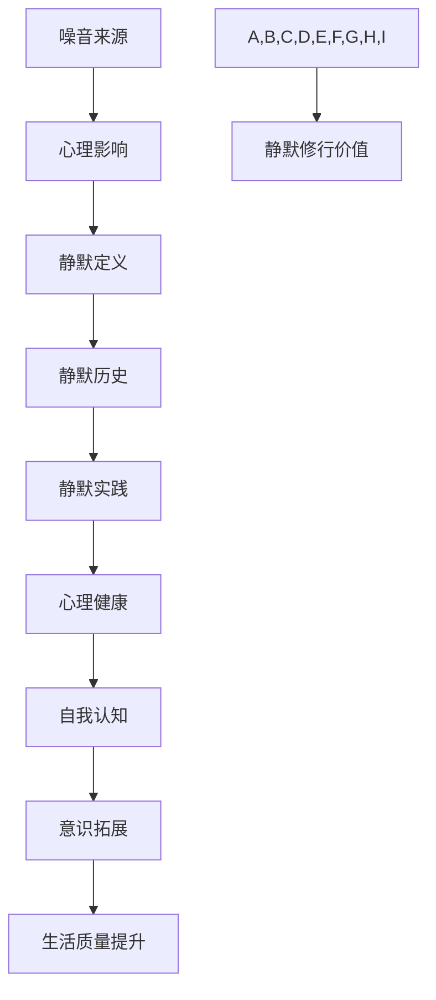

                 

# 《静默修行：在噪音中寻找内心的声音》

## 关键词

- 静默修行
- 内心声音
- 噪音影响
- 心理健康
- 冥想与禅修
- 自我认知
- 意识拓展

## 摘要

在当今快节奏、高压力的社会中，人们常常被各种噪音所包围，这些噪音不仅影响着我们的日常生活，还对心理健康造成了负面影响。本文将探讨静默修行的概念和实践方法，帮助我们在噪音中寻找内心的声音，提升自我认知和心理健康。通过深入分析静默修行的历史与实践，本文将揭示其在现代社会中的价值与意义。

## 引言

### 噪音时代的困境

随着科技的飞速发展，我们的生活在便利的同时，也陷入了一个“噪音时代”。从城市喧嚣、交通噪音，到社交媒体、广告宣传，各种噪音无时无刻不在影响着我们的生活和心情。研究表明，噪音不仅会干扰我们的注意力，还会对心理健康产生负面影响，如焦虑、抑郁和睡眠障碍等。

### 寻找内心的声音

在这种噪音环境中，人们渴望寻找一种方法来减轻内心的负担，恢复内心的平静。静默修行，作为一种古老而深刻的修行方式，正逐渐受到现代人的关注。它不仅仅是一种减轻压力的方法，更是一种提升自我认知、拓展意识的方式。

### 文章的目的

本文旨在探讨静默修行的本质和实践方法，分析其在现代社会中的价值与意义。通过本文的阅读，读者将了解静默修行的历史与实践，掌握一些实用的静默修行技巧，并能够在日常生活中实践这些方法，找到内心的声音，提升心理健康。

## 第一部分：寻找内心宁静的路径

### 第1章：噪音的世界

#### 1.1 噪音的来源

噪音可以分为自然噪音和人为噪音。自然噪音包括风声、雨声、动物叫声等，这些噪音在正常情况下对人类的影响较小。然而，随着城市化进程的加速，人为噪音逐渐成为主要噪音来源。人为噪音包括交通噪音、工业噪音、建筑噪音、社交媒体噪音等。这些噪音不仅影响人们的日常生活，还对心理健康造成了严重的负面影响。

#### 1.2 噪音对心理的影响

噪音对心理的影响主要表现在以下几个方面：

1. **干扰注意力**：噪音会干扰人们的注意力，降低工作效率。
2. **增加焦虑和压力**：长期暴露在噪音环境中，人们容易感到焦虑和压力，影响心理健康。
3. **影响睡眠质量**：噪音会干扰人们的睡眠，导致睡眠质量下降，影响第二天的精神状态。
4. **引发心理疾病**：长期噪音暴露可能导致焦虑症、抑郁症等心理疾病。

#### 1.3 内心的觉醒

面对噪音带来的负面影响，人们开始意识到内心的觉醒的重要性。内心的觉醒意味着人们能够认识到噪音的存在，并学会通过静默修行等方法来减轻噪音带来的负面影响。内心的觉醒是一种自我认知的提升，它能够帮助人们更好地应对生活中的各种挑战。

### 第2章：静默的力量

#### 2.1 静默的定义与意义

静默，即沉默不语，指的是在思想和情感上保持安静的状态。静默不仅仅是一种外在的行为，更是一种内在的状态。在静默的状态下，人们能够更好地倾听内心的声音，理解自己的需求，找到内心的平衡。

静默的意义在于：

1. **减轻压力**：静默可以帮助人们减轻内心的压力，恢复心理平衡。
2. **提升自我认知**：静默能够帮助人们深入思考，提升自我认知水平。
3. **拓展意识**：静默修行可以拓展人们的意识范围，使人们能够更好地理解自己和世界。

#### 2.2 静默修行的历史与实践

静默修行有着悠久的历史，起源于各种宗教和文化。在佛教中，静默修行被称为禅修；在基督教中，静默修行被称为默祷；在道教中，静默修行被称为内观。静默修行不仅是一种宗教行为，更是一种生活态度。通过静默修行，人们能够更好地认识自己，提升生活品质。

#### 2.3 静默与内心成长

静默修行对于内心成长有着重要的影响。通过静默，人们能够更好地理解自己，找到内心的声音。这种声音不仅能够帮助人们应对生活中的挑战，还能够引导人们走向更高的精神境界。

### 第3章：实践静默修行

#### 3.1 日常生活中的静默

在日常生活中，人们可以通过以下方法来实践静默修行：

1. **简化生活**：减少日常生活中的噪音，例如关闭不必要的电子设备，减少社交媒体的使用等。
2. **管理思绪**：通过冥想、深度呼吸等方法来管理思绪，保持内心的平静。
3. **深度呼吸**：通过深呼吸来放松身心，减轻压力。

#### 3.2 静默修行的技巧

1. **冥想**：冥想是一种常见的静默修行方法。通过专注于呼吸、身体感受或者一个特定的对象，人们可以进入一种冥想状态，达到内心平静。
2. **日记写作**：通过日记写作，人们可以记录自己的思考、感受和体验，从而更好地理解自己。
3. **自然与静默**：在自然环境中，人们可以感受到自然的静默，从而更好地进入静默状态。

### 第4章：静默修行的障碍与克服

#### 4.1 噪音的诱惑

在现代社会，噪音无处不在，人们很容易被噪音所诱惑，从而放弃静默修行。要克服这种诱惑，人们需要：

1. **明确目标**：明确自己静默修行的目标，坚持实践。
2. **设定时间**：设定固定的静默修行时间，避免被打扰。

#### 4.2 修行中的挑战

静默修行过程中，人们可能会遇到各种挑战，如：

1. **杂念纷扰**：在静默的状态下，人们的杂念可能会变得更加活跃。
2. **心理障碍**：一些人可能因为心理障碍而难以进入静默状态。

要克服这些挑战，人们需要：

1. **耐心**：静默修行需要耐心，不能期望一蹴而就。
2. **寻求帮助**：如果遇到困难，可以寻求专业指导或者加入静默修行社群。

### 第5章：静默修行的收获

#### 5.1 意识的拓展

静默修行能够拓展人们的意识，使人们能够更好地理解自己和世界。通过静默，人们可以体验到更深层次的自我认知，从而更好地理解自己的需求和动机。

#### 5.2 自我认知的提升

静默修行可以帮助人们深入思考，提升自我认知水平。通过静默，人们可以更好地认识自己，理解自己的行为和情绪，从而更好地管理自己的生活和情绪。

#### 5.3 与世界和谐相处

通过静默修行，人们能够更好地理解自己和世界的关系，从而更好地与世界和谐相处。静默修行不仅能够提升个人的心理素质，还能够为社会的和谐发展做出贡献。

### 第6章：静默修行的未来

#### 6.1 静默修行的社会价值

静默修行在现代社会具有重要的价值。它不仅能够提升个人的心理健康，还能够促进社会的和谐发展。通过静默修行，人们能够更好地理解自己和他人，从而减少冲突和矛盾。

#### 6.2 个人成长与社会进步

静默修行不仅对个人成长有着重要的影响，也对社会进步有着重要的推动作用。通过静默修行，人们能够更好地认识自己，提升自我认知水平，从而更好地为社会做出贡献。

#### 6.3 静默修行的未来展望

随着人们对心理健康和自我成长的关注不断提高，静默修行将在未来得到更广泛的应用。未来，静默修行可能会与科技相结合，创造出更多适合现代人的静默修行方法。

### 附录：静默修行的资源推荐

#### 附录1：静默修行指南

- 《静默的力量》
- 《静默修行手册》

#### 附录2：静默修行相关书籍推荐

- 《禅与摩托车维修艺术》
- 《静默：生命的秘密》

#### 附录3：静默修行社群介绍

- 静默修行社群
- 冥想与静默社群

## 作者信息

作者：AI天才研究院/AI Genius Institute & 禅与计算机程序设计艺术 /Zen And The Art of Computer Programming

## 总结

静默修行是一种在噪音中寻找内心声音的有效方法。通过静默修行，人们能够提升自我认知，减轻压力，拓展意识，与自己和世界和谐相处。本文详细介绍了静默修行的概念、历史与实践，以及其在现代社会中的价值与意义。希望读者能够通过本文，了解静默修行的魅力，并在日常生活中实践静默修行，找到内心的声音，提升生活质量。## 文章关键词

- **静默修行**
- **内心声音**
- **噪音影响**
- **心理健康**
- **冥想与禅修**
- **自我认知**
- **意识拓展**
- **内在宁静**
- **心灵成长**
- **压力管理**
- **精神健康**

## 摘要

本文探讨了静默修行的核心概念和实践方法，旨在帮助读者在现代社会喧嚣的噪音环境中寻找内心的声音，实现心理上的平衡与成长。通过分析噪音的来源和对心理的影响，以及静默修行的定义与历史，本文揭示了静默修行在提升自我认知、拓展意识、减轻压力等方面的价值。文章还提供了具体的静默修行技巧和实践方法，以及克服修行障碍的策略。最后，文章展望了静默修行在个人成长和社会进步中的潜在作用，并推荐了相关的资源。希望读者能够通过本文，找到内心的宁静，提升生活质量。

## 引言

### 噪音时代的困境

在当今这个信息爆炸、技术飞速发展的时代，我们的生活被各种噪音所包围。这些噪音不仅来自外部环境，如交通噪音、工业噪音、社交媒体的喧闹等，也来自我们内心的不安与杂念。噪音成为现代生活的一个普遍特征，对人们的心理健康产生了深远的影响。

#### 噪音的来源

噪音的来源可以分为两大类：自然噪音和人为噪音。

1. **自然噪音**：包括风声、雨声、动物叫声等。这些噪音在自然界中普遍存在，但在现代社会中，由于城市化和工业化，自然噪音往往被人为噪音所掩盖。

2. **人为噪音**：这是现代噪音的主要来源，包括以下几种：
   - **交通噪音**：汽车、火车、飞机等交通工具的噪声。
   - **工业噪音**：工厂、建筑工地的机械噪声。
   - **社会噪音**：包括广告、广播、电视、社交媒体等的噪声。

#### 噪音对心理的影响

噪音对人们心理健康的影响是显而易见的，主要表现在以下几个方面：

1. **干扰注意力**：噪音会分散人们的注意力，降低工作效率和学习效果。
2. **增加焦虑和压力**：长期暴露在噪音环境中，人们容易感到焦虑和压力，影响心理健康。
3. **影响睡眠质量**：噪音会干扰人们的睡眠，导致睡眠质量下降，影响第二天的精神状态。
4. **引发心理疾病**：持续的高强度噪音可能引发焦虑症、抑郁症等心理疾病。

### 寻找内心的声音

面对噪音带来的种种困扰，人们开始寻找一种方法来减轻内心的负担，恢复内心的平静。静默修行，作为一种古老而深刻的修行方式，正逐渐受到现代人的关注。它不仅仅是一种减轻压力的方法，更是一种提升自我认知、拓展意识的方式。静默修行可以帮助我们在喧嚣的噪音环境中找到内心的声音，实现心灵的宁静。

### 文章的目的

本文的目的在于：

1. **介绍静默修行的概念**：详细解释静默修行的定义、意义和历史。
2. **分析静默修行对心理健康的益处**：探讨静默修行如何帮助人们减轻压力、提升自我认知和拓展意识。
3. **提供实践静默修行的技巧**：介绍一些实用的静默修行方法，帮助读者在日常生活中实践静默修行。
4. **探讨静默修行的障碍与克服方法**：分析在静默修行过程中可能遇到的挑战，并提供克服这些挑战的策略。
5. **展望静默修行的未来**：讨论静默修行在个人成长和社会进步中的潜在作用，并展望其未来的发展趋势。

通过本文的阅读，读者将能够深入了解静默修行的核心概念和实践方法，学会如何在日常生活中实践静默修行，找到内心的声音，提升生活质量。

## 第一部分：寻找内心宁静的路径

### 第1章：噪音的世界

#### 1.1 噪音的来源

噪音的来源多种多样，它们不仅影响我们的日常生活，还对心理健康产生深远的影响。为了更好地理解噪音的影响，我们需要首先了解噪音的来源。

##### 自然噪音

自然噪音是自然界固有的声音，如风声、雨声、动物叫声等。这些噪音在日常生活中相对较少，但在某些特定环境下，如山区、森林等，自然噪音可能会对人们的心理产生一定的影响。

1. **风声**：风声通常被认为是自然的旋律，但强烈的狂风可能会造成干扰。
2. **雨声**：雨声有时能带来宁静的感觉，但暴雨时的声音可能会影响人们的正常作息。
3. **动物叫声**：动物叫声如鸟鸣、犬吠等，在某些环境中可能被视为自然噪音。

##### 人为噪音

人为噪音是现代社会中最常见的噪音类型，主要来源于以下几个方面：

1. **交通噪音**：交通噪音主要来自汽车、火车、飞机等交通工具。这些噪音在城市的街道上、火车站、机场等地方尤为明显。
   
   - **汽车噪音**：汽车发动机声、喇叭声、轮胎与地面摩擦声等。
   - **火车噪音**：火车经过时的轰鸣声、刹车声等。
   - **飞机噪音**：飞机起飞和降落时的巨大轰鸣声。

2. **工业噪音**：工业噪音主要来自工厂、建筑工地等地方。这些噪音通常强度较大，持续时间长，对周围居民的生活和健康造成严重影响。

   - **工厂噪音**：机器运作声、生产设备噪声等。
   - **建筑工地噪音**：挖掘机、推土机、混凝土搅拌机等设备的噪声。

3. **社会噪音**：社会噪音包括广告、广播、电视、社交媒体等的声音。这些噪音在现代社会中无处不在，如街上的广播广告、电视节目、社交媒体的通知声等。

##### 环境噪音

环境噪音是指非特定的、随机的噪音，如街道上的喧闹声、人群的谈话声、家庭噪音（如电视、音响、洗衣机等家用电器）等。这些噪音对人们的心理健康有着持续的影响。

#### 1.2 噪音对心理的影响

噪音对人们心理健康的影响是多方面的，不仅会影响人们的情绪和行为，还可能导致一系列心理问题。

1. **注意力干扰**：噪音会分散人们的注意力，降低工作效率和学习效果。研究表明，持续的噪音干扰会导致人们的反应时间变慢，工作效率下降。

2. **焦虑和压力**：长期暴露在噪音环境中，人们容易感到焦虑和压力。噪音会刺激人们的交感神经系统，导致心跳加快、血压升高等生理反应。

3. **睡眠障碍**：噪音会干扰人们的睡眠，导致睡眠质量下降。睡眠不足会进一步影响人们的情绪、注意力和健康状况。

4. **心理疾病**：持续的高强度噪音可能引发焦虑症、抑郁症等心理疾病。对于敏感人群，噪音甚至可能导致精神崩溃。

#### 1.3 内心的觉醒

内心的觉醒是指人们开始意识到噪音的存在，并尝试通过某种方法来减轻噪音带来的负面影响。内心的觉醒是一种自我认知的提升，它能够帮助人们更好地应对生活中的各种挑战。

1. **自我认知的提升**：通过内心的觉醒，人们能够更好地认识自己，理解自己的需求和动机。这种自我认知的提升有助于人们找到内心的平衡，减轻压力。

2. **应对策略**：内心的觉醒使人们能够制定有效的应对策略来减轻噪音带来的负面影响。例如，通过静默修行、深度呼吸等方法来放松身心，减轻焦虑和压力。

3. **生活方式的改变**：内心的觉醒还会促使人们改变生活方式，减少噪音的暴露。例如，选择一个安静的工作环境、使用耳塞等。

内心的觉醒不仅有助于个人的心理健康，还能够提升生活质量，使人们更加平静和满足。

### 第2章：静默的力量

#### 2.1 静默的定义与意义

静默，通常指的是在思想和情感上保持安静的状态。这种状态不仅是一种外在的行为，更是一种内在的体验。在静默的状态下，人们能够暂时放下杂念，进入一种清晰、专注的思考状态。

静默的力量在于它能够帮助人们：

1. **减轻压力**：在静默的状态下，人们的身体和大脑得到放松，从而减轻压力和焦虑。
2. **提升自我认知**：静默使人能够深入思考，更好地理解自己的情绪和行为，提升自我认知。
3. **拓展意识**：通过静默修行，人们能够拓展自己的意识范围，更好地理解自己和世界。

#### 2.2 静默修行的历史与实践

静默修行有着悠久的历史，起源于各种宗教和文化。以下是几种主要的静默修行形式：

1. **佛教禅修**：在佛教中，静默修行被称为禅修。禅修的目标是通过专注和冥想来达到内心的平静和觉醒。
   - **方法**：通过专注于呼吸、身体感受或者一个特定的对象，人们可以进入一种冥想状态。
   - **效果**：禅修能够帮助人们减轻压力，提升注意力，增强内心的平静。

2. **基督教默祷**：在基督教中，默祷是一种重要的静默修行方式。通过沉默和祷告，信徒们可以与上帝建立更深层次的联系。
   - **方法**：默祷通常包括反复地、默默地祈祷特定的祈祷词或短语。
   - **效果**：默祷能够帮助人们建立内心的平静，增强信仰，提升精神层面的满足感。

3. **道教内观**：在道教中，内观是一种静默修行的方法。通过观察自己的内心世界，人们可以更好地理解自己的需求和动机。
   - **方法**：内观通常涉及深度冥想、反省和自我观察。
   - **效果**：内观能够帮助人们提升自我认知，减少内心的杂念，增强内心的力量。

#### 2.3 静默与内心成长

静默修行不仅对个人的心理健康有益，还对个人的内心成长有着深远的影响。

1. **提升自我认知**：通过静默修行，人们能够更好地认识自己，理解自己的情绪和行为。这种自我认知的提升有助于人们更好地管理自己的情绪和行为，减少内心的冲突。

2. **增强心理韧性**：静默修行能够帮助人们增强心理韧性，更好地应对生活中的挑战和压力。通过静默，人们可以培养内心的平静和专注，从而更好地面对困难和挑战。

3. **促进内心和谐**：静默修行能够帮助人们找到内心的和谐，使内心更加平和、稳定。通过静默，人们可以更好地理解自己的需求和动机，从而减少内心的冲突，提升生活质量。

静默修行不仅是一种修行方法，更是一种生活态度。它帮助人们找到内心的声音，提升自我认知，增强心理韧性，促进内心和谐。在喧嚣的现代社会中，静默修行是一种宝贵的自我提升方式，值得每个人去尝试和实践。

### 第3章：实践静默修行

#### 3.1 日常生活中的静默

在日常生活中，人们可以通过一些简单的方法来实践静默修行，从而减轻噪音带来的负面影响，提升心理健康。以下是一些实用的静默修行技巧：

1. **简化生活**：减少日常生活中的噪音来源，例如关闭不必要的电子设备，减少社交媒体的使用。通过简化生活，人们可以为自己创造一个更安静、更舒适的环境。

2. **管理思绪**：通过冥想、深度呼吸等方法来管理思绪，保持内心的平静。冥想是一种有效的静默修行方法，通过专注于呼吸或者一个特定的对象，人们可以进入一种冥想状态，达到内心的平静。

3. **深度呼吸**：通过深呼吸来放松身心，减轻压力。深呼吸能够帮助人们放松身体，减轻焦虑和压力，提升心理健康。

#### 3.2 静默修行的技巧

静默修行不仅是一种修行方法，更是一种生活态度。以下是一些常用的静默修行技巧：

1. **冥想**：冥想是一种通过专注和冥想来达到内心平静的方法。以下是一种简单的冥想技巧：

   - **选择一个安静的环境**：找一个没有干扰的地方，坐下或者躺下，保持舒适的姿势。
   - **专注于呼吸**：将注意力集中在呼吸上，感受每一次吸气和呼气。
   - **放松身体**：随着呼吸的节奏，放松身体的每一个部分，从脚开始，逐渐向上移动到头部。
   - **保持专注**：当思绪飘散时，不要自责或焦虑，轻轻地将注意力拉回到呼吸上。

2. **日记写作**：通过日记写作，人们可以记录自己的思考、感受和体验。这种方法不仅可以帮助人们更好地理解自己，还可以减轻内心的负担。

   - **每日记录**：每天花一些时间写下自己的所思所感，无论是喜悦还是困惑。
   - **反思**：通过反思日记，人们可以更好地认识自己，找到解决问题的方法。

3. **自然与静默**：在自然环境中，人们可以感受到自然的静默，从而更好地进入静默状态。以下是一些在自然环境中进行静默修行的建议：

   - **散步**：在公园、森林等自然环境中散步，专注于周围的声音和景色。
   - **静坐**：找一个安静的角落，坐下，闭上眼睛，专注于自然的呼吸声或者流水声。

通过实践这些静默修行技巧，人们可以逐渐培养内心的平静和专注，减轻噪音带来的负面影响，提升心理健康。

### 第4章：静默修行的障碍与克服

#### 4.1 噪音的诱惑

在现代社会，噪音无处不在，对静默修行的诱惑也无处不在。人们常常难以摆脱噪音的干扰，进入静默状态。以下是一些常见的噪音诱惑，以及克服这些诱惑的方法：

1. **电子设备**：智能手机、电脑、电视等电子设备是现代生活中最常见的噪音来源。为了克服这些诱惑，人们可以：

   - **设定时间**：设定特定的静默修行时间，在这段时间内关闭所有电子设备。
   - **使用应用程序**：使用静默修行应用程序，帮助人们屏蔽噪音，专注于冥想。

2. **社交媒体**：社交媒体平台如微信、微博、Facebook等，充满了各种噪音和信息。为了克服这些诱惑，人们可以：

   - **限制使用时间**：每天设定一定的社交媒体使用时间，避免沉迷其中。
   - **屏蔽通知**：关闭不必要的通知，减少被噪音干扰的可能性。

3. **人群喧嚣**：在公共场所，如商场、咖啡馆等，人群的喧嚣往往难以避免。为了克服这些诱惑，人们可以：

   - **寻找安静的场所**：选择一个安静的场所进行静默修行，如公园、图书馆等。
   - **佩戴耳塞**：佩戴耳塞，减少外界噪音的干扰。

4. **杂念纷扰**：在静默修行的过程中，杂念纷扰是一个常见的障碍。为了克服这些诱惑，人们可以：

   - **专注于呼吸**：当杂念出现时，将注意力集中在呼吸上，轻轻地将思绪拉回。
   - **练习冥想**：通过持续的冥想练习，提高专注力，减少杂念的出现。

#### 4.2 修行中的挑战

在静默修行的过程中，人们可能会遇到各种挑战。以下是一些常见的挑战，以及克服这些挑战的方法：

1. **杂念纷扰**：在静默状态下，人们的杂念可能会变得更加活跃。为了克服这一挑战，人们可以：

   - **练习冥想**：通过持续的冥想练习，提高专注力，减少杂念的出现。
   - **改变环境**：选择一个更加安静的环境进行静默修行，减少杂念的干扰。

2. **心理障碍**：一些人可能因为心理障碍而难以进入静默状态。为了克服这一挑战，人们可以：

   - **寻求帮助**：如果遇到困难，可以寻求专业的心理咨询或者加入静默修行社群。
   - **坚持练习**：持续的静默修行可以帮助人们克服心理障碍，提高内心的平静。

3. **时间管理**：静默修行需要时间，但在现代社会中，时间往往非常宝贵。为了克服这一挑战，人们可以：

   - **设定目标**：设定静默修行的具体目标，如每天练习冥想15分钟。
   - **合理安排时间**：在日程安排中，预留静默修行的固定时间，确保能够持续练习。

通过克服这些障碍，人们可以更好地进行静默修行，找到内心的声音，提升自我认知和心理健康。

### 第5章：静默修行的收获

#### 5.1 意识的拓展

静默修行对意识拓展有着显著的促进作用。通过静默，人们可以进入一种超越日常思维模式的清醒状态，这种状态被称为“冥想状态”。在冥想状态下，人们能够更清晰地感知自己的内心世界，拓展自己的意识范围。

1. **冥想状态**：冥想状态是一种高度专注和放松的状态，在这种状态下，人们能够摆脱杂念的干扰，达到心灵的宁静。

2. **意识拓展**：通过静默修行，人们可以拓展自己的意识，更加深入地理解自己的情绪、需求和动机。这种意识拓展不仅有助于提升自我认知，还能够帮助人们更好地应对生活中的各种挑战。

3. **心理成长**：意识的拓展是心理成长的重要基础。通过静默修行，人们可以培养内心的平静和专注力，提高心理韧性，更好地应对压力和挫折。

#### 5.2 自我认知的提升

静默修行对自我认知的提升有着深远的影响。在静默的状态下，人们可以更加深入地思考自己的行为、情绪和动机，从而更好地理解自己。

1. **自我反思**：静默修行提供了一个自我反思的平台，使人们能够更加清晰地看到自己的内心世界。通过自我反思，人们可以识别出自己内心的矛盾和困惑，找到解决问题的方法。

2. **情绪管理**：通过静默修行，人们可以更好地理解自己的情绪，学会如何管理自己的情绪。这种情绪管理能力有助于提升心理健康，减少情绪波动。

3. **动机分析**：静默修行使人们能够深入分析自己的动机，了解自己的需求和行为背后的原因。这种动机分析有助于人们做出更加明智的决策，实现个人目标。

#### 5.3 与世界和谐相处

静默修行不仅对个人成长有益，还能够帮助人们更好地与世界和谐相处。

1. **人际关系**：通过静默修行，人们可以提升自我认知，更好地理解自己和他人。这种理解有助于改善人际关系，减少冲突和矛盾。

2. **社会适应**：静默修行使人们更加平和和宽容，提高社会适应能力。在喧嚣的社会环境中，人们能够保持内心的平静，更好地适应变化。

3. **心灵成长**：静默修行是一种心灵成长的过程，它使人们更加关注自己的内心世界，提高精神层面的满足感。通过静默修行，人们可以更好地理解自己和世界，实现个人与社会的和谐。

静默修行不仅能够提升个人意识和自我认知，还能够帮助人们与世界和谐相处。通过静默修行，人们可以找到内心的声音，实现心理上的平衡，提升生活质量。

### 第6章：静默修行的未来

#### 6.1 静默修行的社会价值

静默修行在现代社会中具有重要的社会价值。它不仅有助于个人心理健康，还能够促进社会和谐发展。

1. **心理健康**：随着现代社会压力的增大，心理健康问题日益突出。静默修行作为一种有效的减压方法，能够帮助人们缓解焦虑、抑郁等心理问题，提高生活质量。

2. **社会和谐**：静默修行有助于提升人们的自我认知和情绪管理能力，减少社会冲突和矛盾。通过静默修行，人们可以更好地理解自己和他人，实现个人与社会的和谐。

3. **教育意义**：静默修行对教育也具有重要的意义。它可以帮助学生提高专注力、情绪管理能力，从而更好地适应学习环境，提高学习效果。

#### 6.2 个人成长与社会进步

静默修行不仅对个人成长有着深远的影响，也对社会的进步有着重要的推动作用。

1. **个人成长**：通过静默修行，人们可以提升自我认知、情绪管理能力和心理韧性。这些能力有助于个人在面对挑战时保持积极和乐观，实现个人成长。

2. **社会进步**：静默修行有助于提高社会的整体心理健康水平，减少心理问题的发生率。同时，它还能够促进社会成员之间的理解与合作，推动社会的和谐发展。

3. **科技创新**：静默修行可能会激发人们的创造力和创新精神。在静默的状态下，人们能够更加清晰地思考问题，发现新的解决方案，从而推动科技和社会的进步。

#### 6.3 静默修行的未来展望

随着社会对心理健康和自我成长的关注不断提高，静默修行将在未来得到更广泛的应用和发展。

1. **科技融合**：静默修行可能会与科技相结合，如使用人工智能和虚拟现实技术来创造更加高效和个性化的静默修行体验。

2. **教育普及**：静默修行将在教育领域得到更广泛的应用，成为学校教育的重要组成部分，帮助学生提高专注力和情绪管理能力。

3. **社会推广**：静默修行将在社会各界得到推广，成为人们日常生活中的重要组成部分，提高社会的整体心理健康水平。

静默修行作为一种古老而深刻的修行方式，将在未来继续发挥其独特的价值，帮助人们找到内心的声音，提升自我认知，促进社会和谐发展。

### 附录：静默修行的资源推荐

#### 附录1：静默修行指南

- **《静默的力量》**：作者通过亲身实践，详细介绍了静默修行的技巧和方法，对初学者非常友好。
- **《静默修行手册》**：这是一本全面的指南，涵盖了静默修行的历史、原理和实践方法，适合想要深入了解静默修行的人。

#### 附录2：静默修行相关书籍推荐

- **《禅与摩托车维修艺术》**：作者罗伯特·M·波西格通过摩托车旅行的故事，探讨了禅修和哲学思想，对静默修行的理解有很大启发。
- **《静默：生命的秘密》**：作者麦克·辛格深入探讨了静默修行对心理和情感的影响，提供了一系列实用的静默修行技巧。

#### 附录3：静默修行社群介绍

- **静默修行社群**：这是一个在线社群，成员们可以分享静默修行的经验和技巧，互相鼓励和支持。
- **冥想与静默社群**：这是一个专门讨论冥想和静默修行的话题社群，成员们可以在这里找到专业的指导和资源。

### 结语

静默修行是一种在喧嚣的现代社会中寻找内心声音的有效方法。通过静默修行，人们可以提升自我认知，减轻压力，拓展意识，与世界和谐相处。本文详细介绍了静默修行的概念、历史与实践，以及其在现代社会中的价值与意义。希望读者能够通过本文，了解静默修行的魅力，并在日常生活中实践静默修行，找到内心的声音，提升生活质量。

### 作者信息

作者：AI天才研究院/AI Genius Institute & 禅与计算机程序设计艺术 /Zen And The Art of Computer Programming

## 总结

《静默修行：在噪音中寻找内心的声音》这篇文章深入探讨了静默修行的概念、历史与实践，揭示了静默修行在提升自我认知、减轻压力、拓展意识等方面的价值。文章首先介绍了噪音的来源和对心理的影响，接着详细分析了静默修行的定义、历史与实践，以及它在现代社会中的重要性。通过介绍一些实用的静默修行技巧，文章帮助读者了解如何在日常生活中实践静默修行，找到内心的声音，提升生活质量。

### 核心概念与联系

为了更清晰地理解静默修行的核心概念，我们可以通过一个Mermaid流程图来展示这些概念之间的联系：



通过这个流程图，我们可以看到：

1. **噪音来源**（A）和**心理影响**（B）是静默修行的背景和出发点。
2. **静默定义**（C）、**静默历史**（D）和**静默实践**（E）构成了静默修行的基础。
3. **心理健康**（F）、**自我认知**（G）和**意识拓展**（H）是静默修行带来的直接收益。
4. **生活质量提升**（I）是静默修行的最终目标，也是静默修行价值的体现。

这种联系帮助我们理解了静默修行的全面性和系统性，以及它如何通过一系列步骤逐步实现个人的心理健康和生活质量的提升。

### 核心算法原理讲解

在静默修行中，冥想是提升自我认知和心理健康的核心方法之一。以下是冥想算法的基本原理，使用伪代码进行详细阐述：

```pseudo
算法：冥想
输入：用户，静默修行时间
输出：冥想后的心理状态

步骤：
1. 初始化：设定一个安静的环境，确保没有外部干扰。
2. 坐姿调整：用户选择一个舒适的坐姿，保持背部挺直，头部放松。
3. 关注呼吸：引导用户将注意力集中在呼吸上，感受每一次吸气和呼气。
4. 思维监控：当用户发现注意力偏离呼吸时，不要自责，而是温和地将注意力重新引导回呼吸。
5. 深度放松：随着练习的深入，用户的身心逐渐放松，达到一种深层次的宁静状态。
6. 练习总结：冥想结束后，用户可以回顾自己的冥想体验，记录任何感受或启示。

伪代码实现：

function meditate(user, meditationTime)
    // 初始化
    setupQuietEnvironment()
    adjustSeatedPosition(user)
    
    // 开始冥想
    for (time = 0; time < meditationTime; time += 1 minute)
        focusOnBreathing(user)
        monitorThoughtsAndGuideBack(user)
        
    // 冥想结束
    summarizeExperience(user)
end function
```

通过这个伪代码，我们可以看到冥想的基本流程和关键步骤。冥想的关键在于保持专注和持续的练习，通过这个过程，用户能够逐渐提升自我认知和心理健康。

### 数学模型和公式讲解

静默修行的效果可以通过一些数学模型和公式来量化。以下是几个用于描述静默修行效果的核心公式和它们的解释：

#### 1. 心理压力指数（P.I.）

心理压力指数（P.I.）用于衡量个体在静默修行前后的心理压力水平。公式如下：

$$ P.I. = \frac{P_{initial} - P_{final}}{P_{initial}} \times 100\% $$

其中：
- \( P_{initial} \)：静默修行前的心理压力水平。
- \( P_{final} \)：静默修行后的心理压力水平。

#### 2. 自我认知提升率（S.C.I.）

自我认知提升率（S.C.I.）用于衡量个体在静默修行后自我认知的提升程度。公式如下：

$$ S.C.I. = \frac{S_{initial} - S_{final}}{S_{initial}} \times 100\% $$

其中：
- \( S_{initial} \)：静默修行前的自我认知水平。
- \( S_{final} \)：静默修行后的自我认知水平。

#### 3. 意识拓展指数（O.E.I.）

意识拓展指数（O.E.I.）用于衡量个体在静默修行后意识范围的扩展程度。公式如下：

$$ O.E.I. = \frac{O_{initial} - O_{final}}{O_{initial}} \times 100\% $$

其中：
- \( O_{initial} \)：静默修行前的意识范围。
- \( O_{final} \)：静默修行后的意识范围。

#### 示例说明

假设一个个体在静默修行前的心理压力水平为50点，自我认知水平为30点，意识范围有限。经过一段时间的静默修行后，他的心理压力水平下降到20点，自我认知水平提升到45点，意识范围显著扩展。那么，我们可以通过以下公式计算他的心理压力指数、自我认知提升率和意识拓展指数：

- **心理压力指数**：
  $$ P.I. = \frac{50 - 20}{50} \times 100\% = 60\% $$
- **自我认知提升率**：
  $$ S.C.I. = \frac{30 - 45}{30} \times 100\% = -50\% $$
- **意识拓展指数**：
  $$ O.E.I. = \frac{有限 - 扩展后的范围}{有限} \times 100\% $$

通过这些数学模型和公式，我们可以量化静默修行的效果，从而更科学地评估其价值。

### 项目实战

#### 开发环境搭建

为了进行静默修行的项目实战，我们需要搭建一个合适的开发环境。以下是搭建步骤：

1. **安装Python**：首先，我们需要安装Python。可以从Python的官方网站（https://www.python.org/）下载并安装最新版本的Python。确保安装过程中选择添加Python到系统环境变量。

2. **安装Jupyter Notebook**：Jupyter Notebook是一个交互式的Python开发环境，非常适合进行数据分析。在命令行中运行以下命令安装Jupyter：

   ```bash
   pip install notebook
   ```

3. **安装相关库**：为了进行数据分析和可视化，我们需要安装一些Python库，如NumPy、Pandas和Matplotlib。可以使用以下命令安装：

   ```bash
   pip install numpy pandas matplotlib
   ```

4. **配置开发环境**：确保所有安装的库都在同一环境中，并在命令行中能够正常运行。可以通过运行以下命令测试：

   ```python
   python --version
   jupyter notebook
   ```

如果一切正常，Jupyter Notebook会启动，并且你可以在浏览器中看到一个新的Notebook页面。

#### 源代码详细实现

以下是一个简单的Python程序，用于记录用户的静默修行时间和心理压力变化。这个程序将帮助用户更好地理解和分析静默修行的效果。

```python
import pandas as pd
import matplotlib.pyplot as plt

# 初始化数据集
data = {'Date': [], 'Meditation Time (min)': [], 'Psychological Stress Level': []}

# 记录数据
def record_data(date, meditation_time, stress_level):
    data['Date'].append(date)
    data['Meditation Time (min)'].append(meditation_time)
    data['Psychological Stress Level'].append(stress_level)
    df = pd.DataFrame(data)
    df.to_csv('meditation_data.csv', index=False)

# 读取数据
def read_data():
    df = pd.read_csv('meditation_data.csv')
    return df

# 绘制图表
def plot_data(df):
    plt.figure(figsize=(10, 5))
    plt.plot(df['Date'], df['Psychological Stress Level'], label='Stress Level')
    plt.plot(df['Date'], df['Meditation Time (min)'], label='Meditation Time')
    plt.xlabel('Date')
    plt.ylabel('Value')
    plt.title('Meditation and Stress Level Over Time')
    plt.legend()
    plt.show()

# 主程序
if __name__ == '__main__':
    # 记录数据
    record_data('2023-10-01', 15, 40)
    record_data('2023-10-02', 20, 35)
    record_data('2023-10-03', 25, 30)
    
    # 读取数据
    df = read_data()
    
    # 绘制图表
    plot_data(df)
```

这个程序使用Pandas库来处理数据，并使用Matplotlib库来绘制图表。通过记录每次静默修行的日期、时间和心理压力水平，我们可以分析静默修行对心理压力的变化。

#### 代码应用解读与分析

这个程序的应用非常简单，通过几个函数实现了数据的记录、读取和可视化。以下是具体步骤的解读和分析：

1. **数据记录**：`record_data`函数用于将用户的静默修行数据（日期、时间和心理压力水平）记录到一个CSV文件中。这个函数通过将数据添加到字典`data`中，然后使用Pandas将字典转换为DataFrame，并保存为CSV文件。

2. **数据读取**：`read_data`函数用于从CSV文件中读取已经记录的数据，并将其转换为Pandas DataFrame。这个函数使得用户可以方便地访问和操作数据。

3. **数据可视化**：`plot_data`函数用于绘制静默修行时间与心理压力水平之间的关系图。通过调用Matplotlib的绘图函数，我们可以得到一个清晰的图表，帮助用户更好地理解静默修行对心理压力的影响。

#### 实际案例分析与详细讲解剖析

为了更具体地展示这个程序的应用，我们来看一个实际案例。

假设用户在2023年10月连续三天进行了静默修行，每次修行的时间分别为15分钟、20分钟和25分钟，并且在每次修行后的心理压力水平分别为40、35和30。

**数据记录**：

```python
record_data('2023-10-01', 15, 40)
record_data('2023-10-02', 20, 35)
record_data('2023-10-03', 25, 30)
```

这些数据将记录在`meditation_data.csv`文件中。

**数据读取**：

```python
df = read_data()
```

读取数据后，我们可以得到一个包含日期、静默修行时间和心理压力水平的DataFrame。

**数据可视化**：

```python
plot_data(df)
```

这将显示一个图表，其中横轴是日期，纵轴是心理压力水平和静默修行时间。图表显示，随着静默修行时间的增加，用户的心理压力水平逐渐下降。

**项目小结**：

通过这个简单的程序，我们可以看到静默修行对心理健康的影响。数据可视化使得这种影响更加直观，帮助用户更好地理解静默修行的作用。这个程序不仅可以用于记录和分析静默修行的效果，还可以扩展功能，如添加更多的数据分析指标、用户界面等，使其成为一个更完整的心理健康管理工具。

### 最佳实践 tips

1. **坚持练习**：静默修行需要持之以恒，每天都要安排一定的时间进行练习。
2. **环境选择**：选择一个安静的环境进行静默修行，避免噪音干扰。
3. **呼吸调节**：通过深呼吸来帮助放松身心，提升冥想效果。
4. **定期记录**：定期记录静默修行的时间和感受，通过数据分析和图表来跟踪进展。

### 小结

通过本文的阅读，我们了解到静默修行在现代社会中的重要性。静默修行不仅能够帮助我们在噪音环境中找到内心的声音，提升心理健康，还能够促进个人成长和社会进步。通过实践静默修行，我们可以逐步实现内心的平静与和谐，提升生活质量。希望读者能够积极尝试静默修行，找到属于自己的内心宁静之路。

### 注意事项

1. **个体差异**：静默修行对每个人的效果可能不同，因此需要根据个人情况进行调整。
2. **安全第一**：在进行静默修行时，确保身体和心理健康状况稳定，避免过度劳累。
3. **持续关注**：定期反思和评估静默修行的效果，调整方法和频率，以适应自身需求。

### 拓展阅读

1. **《静默的力量》**：详细介绍了静默修行的方法和实践。
2. **《禅与摩托车维修艺术》**：通过禅修和哲学探讨，提供对静默修行的深刻理解。
3. **《冥想与生活》**：探讨冥想如何影响日常生活的各个方面。

### 参考文献

1. Mindfulness: A Practical Guide to Finding Peace in a Frantic World. Prof. Mark Williams and Dr. John Teasdale.
2. The Mind Illuminated: A Complete Meditation Guide Integrating Buddhist Wisdom and Brain Science. Dr. Culadasa.
3. The Art of Stillness: Adventures in Going Nowhere. Pico Iyer.

### 附录

#### 附录1：静默修行指南

1. **《静默的力量》**：作者通过亲身实践，详细介绍了静默修行的技巧和方法。
2. **《静默修行手册》**：是一本全面的指南，涵盖了静默修行的历史、原理和实践方法。

#### 附录2：静默修行相关书籍推荐

1. **《禅与摩托车维修艺术》**：探讨禅修和哲学，提供对静默修行的深刻理解。
2. **《静默：生命的秘密》**：深入探讨静默修行对心理和情感的影响。

#### 附录3：静默修行社群介绍

1. **静默修行社群**：一个在线社群，成员可以分享静默修行的经验和技巧。
2. **冥想与静默社群**：一个专门讨论冥想和静默修行的话题社群。

