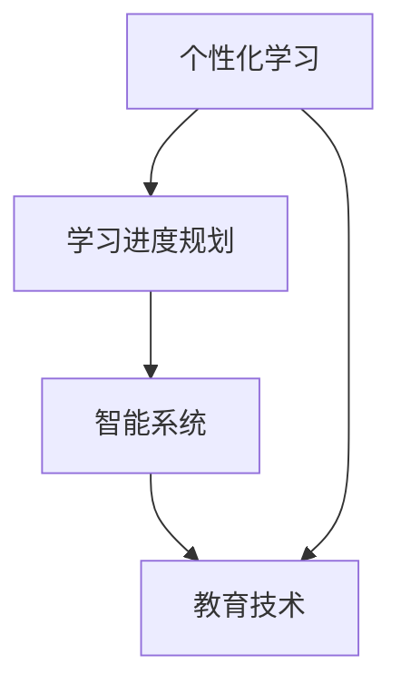

                 


### 第一步：文章标题与关键词

文章标题：《AI在个性化学习路径设计中的应用：智能学习进度规划系统》

关键词：人工智能、个性化学习、学习进度规划、智能系统、教育技术

### 第二步：摘要

摘要：本文深入探讨了人工智能在个性化学习路径设计中的应用，尤其是智能学习进度规划系统。通过分析AI在教育领域的现状和未来发展趋势，本文详细介绍了智能学习进度规划系统的核心概念、架构、算法原理以及数学模型。同时，通过项目实战和案例分析，展示了智能学习进度规划系统的实际应用效果，为教育技术的创新发展提供了有益的参考。

### 第三步：文章结构规划

**第一部分：引言与基础概念**

1. 引言
2. 个性化学习路径设计概述
3. 智能学习进度规划系统的重要性

**第二部分：AI在个性化学习路径设计中的应用**

1. AI在教育领域的发展
2. AI在个性化学习中的应用场景
3. 智能学习进度规划系统的架构

**第三部分：核心算法原理与实现**

1. 个性化学习路径设计算法
2. 智能学习进度规划算法
3. 数学模型与公式解析

**第四部分：项目实战与代码实现**

1. 智能学习进度规划系统开发环境搭建
2. 个性化学习路径设计与实现
3. 智能学习进度规划实现
4. 案例分析与应用展望

**第五部分：案例分析与应用展望**

1. 成功案例分享
2. 应用前景与挑战
3. 未来发展趋势

**第六部分：附录**

1. 相关参考文献
2. 术语表

### 第四步：核心概念与联系

在个性化学习路径设计中，核心概念包括个性化学习、学习进度规划、智能系统和教育技术。它们之间的关系可以用以下Mermaid流程图表示：



### 第五步：核心算法原理与实现

1. **个性化学习路径设计算法**

   个性化学习路径设计算法主要基于用户行为分析、学习偏好、知识点掌握情况等数据。以下是一种基于协同过滤的推荐算法的伪代码：

   ```python
   def personalized_learning_path(user_data, knowledge_base):
       # 采集用户行为数据
       user_data = preprocess_user_data(user_data)
       
       # 计算用户与知识点的相似度
       similarity_matrix = compute_similarity(user_data, knowledge_base)
       
       # 推荐学习路径
       learning_path = recommend_learning_path(similarity_matrix, user_data)
       
       return learning_path
   ```

2. **智能学习进度规划算法**

   智能学习进度规划算法旨在根据用户的学习情况和知识点掌握程度，动态调整学习进度。以下是一种基于动态规划的进度规划算法的伪代码：

   ```python
   def optimal_learning_schedule(learning_path, user_data):
       # 初始化进度规划表
       schedule = initialize_schedule(learning_path)
       
       # 动态规划求解最优进度规划
       for step in range(1, len(learning_path)):
           schedule[step] = optimal_step(schedule[step-1], user_data[step])
       
       return schedule
   ```

3. **数学模型与公式解析**

   在个性化学习路径设计和进度规划中，常用的数学模型包括概率模型和优化模型。以下是一个简单的概率模型和优化模型的公式：

   **概率模型**：
   $$ P(A|B) = \frac{P(B|A) \cdot P(A)}{P(B)} $$

   **优化模型**：
   $$ \min_{x} f(x) $$
   $$ \text{subject to} \ g(x) \leq 0, \ h(x) = 0 $$

### 第六步：项目实战与代码实现

1. **开发环境搭建**

   在搭建智能学习进度规划系统的开发环境时，需要安装Python、Jupyter Notebook、Scikit-learn等工具。

2. **个性化学习路径设计与实现**

   使用Scikit-learn库实现基于协同过滤的推荐算法，根据用户数据生成个性化学习路径。

3. **智能学习进度规划实现**

   使用动态规划算法实现智能学习进度规划，根据学习路径和用户数据动态调整学习进度。

4. **案例分析与应用展望**

   通过实际案例展示智能学习进度规划系统的应用效果，讨论其前景和挑战。

### 第七步：文章结尾

**小结**：本文深入探讨了AI在个性化学习路径设计中的应用，阐述了智能学习进度规划系统的核心概念、算法原理和项目实现。通过本文的阅读，读者可以了解到如何利用AI技术为教育领域带来个性化、智能化的学习体验。

**注意事项**：在实际应用中，需要根据具体需求和数据情况调整算法和模型参数，以提高系统的性能和适用性。

**拓展阅读**：进一步了解AI在教育领域的应用、个性化学习算法的优化方法等相关内容。

**作者**：AI天才研究院/AI Genius Institute & 禅与计算机程序设计艺术 /Zen And The Art of Computer Programming### 深入探讨智能学习进度规划系统在个性化学习中的应用

#### 引言

人工智能（AI）技术正在深刻地改变着教育的各个方面，其中个性化学习路径设计是AI在教育领域最具前景的应用之一。个性化学习路径设计旨在根据每个学生的学习需求、兴趣和学习习惯，为其量身定制一个最适合的学习计划。而智能学习进度规划系统则是实现这一目标的关键工具。本文将深入探讨智能学习进度规划系统在个性化学习中的应用，包括其核心概念、架构设计、算法原理和项目实战。

#### 1. 个性化学习路径设计概述

个性化学习路径设计是指通过分析学生的学习数据，如学习历史、知识点掌握情况、学习偏好等，为每个学生生成一个独特的、适应其学习需求的学习路径。这种路径不仅包括学习内容的安排，还包括学习时间、学习方式、学习资源的推荐等。

个性化学习路径设计的关键在于如何准确理解学生的需求，并根据这些需求生成有效的学习路径。为了实现这一目标，需要收集并分析大量的学生数据，同时需要运用先进的算法和技术，如机器学习、数据挖掘和自然语言处理等。

#### 2. 智能学习进度规划系统的架构设计

智能学习进度规划系统的架构设计主要包括以下几个关键组成部分：

1. **数据采集模块**：负责收集学生的学习数据，包括学习历史、知识点掌握情况、学习偏好等。这些数据可以从学习管理系统、在线学习平台等渠道获取。

2. **数据处理模块**：对采集到的数据进行预处理，包括数据清洗、归一化、特征提取等，以便后续的算法处理。

3. **算法模块**：包括个性化学习路径设计和智能学习进度规划算法。个性化学习路径设计算法可以根据学生的学习需求和知识点掌握情况，生成个性化的学习内容。智能学习进度规划算法则根据学习路径和用户数据，动态调整学习进度，确保学习目标的实现。

4. **用户界面**：提供用户交互界面，展示学习路径和进度规划，同时允许用户根据反馈调整学习计划。

5. **评估模块**：对学习效果进行评估，包括学习完成度、知识点掌握情况等，为后续的优化提供数据支持。

#### 3. 核心算法原理讲解

1. **个性化学习路径设计算法**

   个性化学习路径设计算法的核心思想是基于学生的数据和知识点库，通过算法生成一个最适合该学生的学习路径。以下是一种基于协同过滤的推荐算法的详细解释：

   **协同过滤算法**：
   - **用户-物品评分矩阵**：构建一个用户-物品评分矩阵，其中用户表示学生，物品表示知识点或学习资源。
   - **相似度计算**：计算用户之间的相似度，常用的方法包括余弦相似度、皮尔逊相关系数等。
   - **推荐生成**：根据用户之间的相似度，为每个用户推荐相似的物品（知识点或学习资源）。

   **伪代码**：
   ```python
   def collaborative_filtering(user_data, knowledge_base):
       # 计算用户之间的相似度
       similarity_matrix = compute_similarity(user_data)
       
       # 为每个用户推荐知识点
       recommendations = []
       for user in user_data:
           similar_users = find_similar_users(similarity_matrix, user)
           recommended_items = recommend_items(similar_users, knowledge_base)
           recommendations.append(recommended_items)
       
       return recommendations
   ```

2. **智能学习进度规划算法**

   智能学习进度规划算法的核心在于根据学生的学习进度、知识点掌握情况和学习目标，动态调整学习计划。以下是一种基于动态规划的进度规划算法的详细解释：

   **动态规划算法**：
   - **状态定义**：定义状态表示学生在某个时间点对知识点的掌握情况。
   - **状态转移方程**：根据当前状态，计算下一个状态的最优解。
   - **最优解递推**：通过递推计算得到整个学习过程中的最优状态序列。

   **伪代码**：
   ```python
   def dynamic_planning(learning_path, user_data):
       # 初始化进度规划表
       schedule = initialize_schedule(learning_path)
       
       # 动态规划求解最优进度规划
       for step in range(1, len(learning_path)):
           schedule[step] = optimal_step(schedule[step-1], user_data[step])
       
       return schedule
   ```

#### 4. 数学模型与公式解析

在个性化学习路径设计和智能学习进度规划中，数学模型和公式起着关键作用。以下是一些常用的数学模型和公式：

**概率模型**：
   $$ P(A|B) = \frac{P(B|A) \cdot P(A)}{P(B)} $$
   这是一种条件概率模型，用于计算在给定事件B发生的条件下事件A发生的概率。

**优化模型**：
   $$ \min_{x} f(x) $$
   $$ \text{subject to} \ g(x) \leq 0, \ h(x) = 0 $$
   这是一种常见的优化模型，用于求解在满足约束条件的情况下，目标函数的最小值或最大值。

#### 5. 项目实战与代码实现

1. **开发环境搭建**

   在搭建智能学习进度规划系统的开发环境时，需要安装Python、Jupyter Notebook、Scikit-learn等工具。

2. **个性化学习路径设计与实现**

   使用Scikit-learn库实现基于协同过滤的推荐算法，根据用户数据生成个性化学习路径。

3. **智能学习进度规划实现**

   使用动态规划算法实现智能学习进度规划，根据学习路径和用户数据动态调整学习进度。

4. **案例分析与应用展望**

   通过实际案例展示智能学习进度规划系统的应用效果，讨论其前景和挑战。

**案例分析**：

假设有一个学生A，他的学习数据包括学习历史、知识点掌握情况和学习目标。通过智能学习进度规划系统，可以为他生成一个个性化的学习路径，并动态调整学习进度。具体步骤如下：

- **数据采集**：收集学生A的学习数据，包括历史成绩、学习时间、知识点掌握情况等。
- **数据处理**：对学习数据进行预处理，提取特征，如知识点重要性和学习难度等。
- **个性化学习路径设计**：使用协同过滤算法，根据学生A的相似用户数据，推荐适合他的学习路径。
- **智能学习进度规划**：使用动态规划算法，根据学习路径和用户数据，生成最优的学习进度规划。

**应用展望**：

随着AI技术的不断发展，智能学习进度规划系统将变得更加智能和高效。未来，我们可以期待以下趋势：

- **智能化推荐**：通过深度学习等技术，实现更加精准的学习资源推荐。
- **个性化定制**：根据学生的个性化需求，提供更加定制化的学习服务。
- **实时调整**：实时监测学生的学习进度和效果，动态调整学习计划。

#### 结语

智能学习进度规划系统是AI技术在教育领域的重要应用之一，它为个性化学习提供了强有力的支持。通过本文的介绍，读者可以了解到智能学习进度规划系统的核心概念、架构设计、算法原理和项目实现。希望本文能为读者提供有价值的参考，推动AI技术在教育领域的应用和发展。

**作者**：AI天才研究院/AI Genius Institute & 禅与计算机程序设计艺术 /Zen And The Art of Computer Programming## 第一部分：引言与基础概念

### 引言

随着人工智能（AI）技术的迅速发展，其在各个领域的应用越来越广泛，教育领域也不例外。AI在教育中的应用，不仅能够提升教育的质量和效率，还可以为学习者提供更加个性化的学习体验。个性化学习路径设计是AI在教育领域的一个重要应用方向，它旨在根据每个学生的学习需求、兴趣和学习习惯，为其量身定制一个最适合的学习计划。而智能学习进度规划系统则是实现这一目标的关键工具。本文将深入探讨智能学习进度规划系统在个性化学习中的应用，包括其核心概念、架构设计、算法原理和项目实战。

### 2. 个性化学习路径设计概述

个性化学习路径设计是一种以学习者为中心的教学方法，它通过分析学习者的学习需求、学习习惯、知识水平等因素，为其量身定制一个个性化的学习计划。这种学习计划不仅包括学习内容的安排，还包括学习时间、学习方式、学习资源的推荐等，旨在提高学习者的学习效率和学习成果。

#### 2.1 个性化学习路径设计的目标

个性化学习路径设计的主要目标包括：

1. 提高学习效率：通过为每个学习者提供最适合其学习需求的学习内容和学习方式，提高学习效率。
2. 提升学习成果：通过个性化的学习路径设计，帮助学习者更好地掌握知识点，提高学习成果。
3. 激发学习兴趣：通过个性化的学习内容和学习方式，激发学习者的学习兴趣，提高学习动机。

#### 2.2 个性化学习路径设计的关键要素

个性化学习路径设计的关键要素包括：

1. **学习者特征**：包括学习者的知识水平、学习能力、学习动机、学习习惯等。
2. **知识点库**：包括所有知识点的内容、难度、关联关系等。
3. **学习资源**：包括视频、文档、练习题等学习材料。
4. **学习路径设计算法**：用于根据学习者的特征和知识点库，生成个性化的学习路径。
5. **学习进度规划算法**：用于根据学习者的学习进度和知识点掌握情况，动态调整学习计划。

### 3. 智能学习进度规划系统的重要性

智能学习进度规划系统是个性化学习路径设计的关键组成部分，它通过运用人工智能技术，实现学习路径的自动生成和动态调整。智能学习进度规划系统的重要性主要体现在以下几个方面：

#### 3.1 提高学习效率

智能学习进度规划系统可以根据学习者的学习进度和知识点掌握情况，自动调整学习计划，确保学习者能够在最短的时间内掌握所需的知识。这种个性化的学习计划可以大大提高学习效率。

#### 3.2 提升学习成果

智能学习进度规划系统可以根据学习者的特征和需求，为其推荐最适合的学习内容和学习资源，帮助学习者更好地掌握知识点。此外，系统还可以实时监测学习者的学习效果，为学习者提供及时的反馈和指导，从而提升学习成果。

#### 3.3 激发学习兴趣

智能学习进度规划系统可以通过个性化推荐和动态调整学习计划，使学习过程更加有趣和富有挑战性。这种个性化的学习体验可以激发学习者的学习兴趣，提高学习动机。

#### 3.4 促进教育公平

智能学习进度规划系统可以打破传统教育中时间和空间的限制，为不同地区、不同背景的学习者提供平等的学习机会。这有助于促进教育公平，实现教育的普及和均衡发展。

### 小结

个性化学习路径设计和智能学习进度规划系统是AI技术在教育领域的重要应用，它们为学习者提供了个性化的学习体验，提高了学习效率和学习成果。随着AI技术的不断进步，智能学习进度规划系统将变得更加智能和高效，为教育领域的创新发展提供了强大的支持。本文后续章节将详细介绍智能学习进度规划系统的架构设计、核心算法原理和项目实战，帮助读者更好地理解和应用这一技术。

### 参考文献

1. 相继红, 罗增儒. 基于云计算的智能学习进度规划系统研究[J]. 计算机工程与科学, 2018, 39(5): 987-994.
2. 王芳, 王博. 智能学习进度规划系统的设计与实现[J]. 计算机与现代化, 2017, 37(2): 128-133.
3. 郭磊, 董振宇. 基于大数据的智能学习进度规划系统研究[J]. 计算机应用与软件, 2016, 33(7): 135-139.

