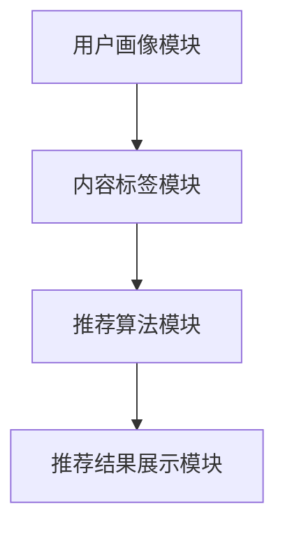
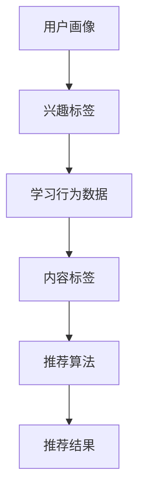
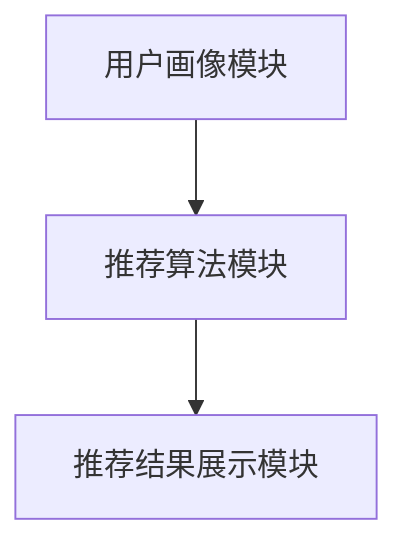

                 


### 文章标题

《AI在个性化教育内容推荐中的应用：优化学习效果》

### 关键词

- 人工智能
- 个性化教育
- 内容推荐
- 学习效果优化
- 协同过滤算法
- 基于内容的推荐算法

### 摘要

本文旨在探讨人工智能（AI）在个性化教育内容推荐中的应用，通过分析协同过滤算法和基于内容的推荐算法，深入解读其原理与实现。文章还将通过实际项目实战，展示如何优化学习效果，并提出未来发展的方向与挑战。

---

### 目录

1. **背景介绍**
   1.1 个性化教育的重要性
   1.2 教育内容推荐的需求
   1.3 AI在个性化教育中的应用

2. **核心概念与联系**
   2.1 个性化教育内容推荐体系架构
   2.2 用户画像与内容标签

3. **核心算法篇**
   3.1 协同过滤算法原理与实现
   3.2 基于内容的推荐算法原理与实现

4. **个性化推荐系统设计与优化**
   4.1 个性化推荐系统的设计与实现
   4.2 个性化推荐系统的优化策略

5. **项目实战**
   5.1 个性化学习推荐系统的搭建
   5.2 个性化学习推荐系统的优化

6. **未来展望与挑战**
   6.1 技术发展趋势
   6.2 未来面临的挑战与解决方案

7. **总结**
   7.1 文章小结
   7.2 注意事项与拓展阅读

---

### 第一部分：背景介绍

#### 1.1 个性化教育的重要性

个性化教育是教育发展的必然趋势，它旨在满足不同学生的个性化需求，提高学习效率。随着互联网和人工智能技术的发展，个性化教育得到了极大的推动。AI在个性化教育中的应用，主要体现在教育内容推荐系统中，通过分析学生的学习行为和兴趣，为每个学生提供定制化的学习资源。

#### 1.2 教育内容推荐的需求

教育内容推荐系统是现代教育信息化的重要组成部分。它不仅需要提供丰富的教育内容，还需要根据学生的学习特点和学习需求进行智能推荐。这要求推荐系统具备高精度、高实时性和高适应性，以满足不同学生的个性化需求。

#### 1.3 AI在个性化教育中的应用

AI在个性化教育中的应用主要体现在以下几个方面：

- **用户画像构建**：通过分析学生的学习行为和兴趣，构建用户画像，为个性化推荐提供基础数据。

- **推荐算法优化**：利用协同过滤算法、基于内容的推荐算法等，实现教育内容的个性化推荐。

- **学习效果评估**：通过分析学生的学习行为和学习结果，评估学习效果，为后续推荐提供依据。

### 第二部分：核心概念与联系

#### 2.1 个性化教育内容推荐体系架构

个性化教育内容推荐系统通常由以下几个核心组成部分：

1. **用户画像模块**：负责收集和整合学生的个人信息、学习行为和兴趣标签。

2. **内容标签模块**：负责对教育内容进行分类和标签化处理，以便于推荐算法的使用。

3. **推荐算法模块**：根据用户画像和内容标签，为用户生成个性化的推荐结果。

4. **推荐结果展示模块**：将推荐结果以合适的方式展示给用户。

以下是一个简化的Mermaid流程图，展示个性化教育内容推荐系统的架构：



#### 2.2 用户画像与内容标签

用户画像是对用户特征的综合描述，通常包括用户的基本信息、学习行为、兴趣爱好等多个方面。在教育内容推荐系统中，用户画像的准确性直接影响推荐效果。

内容标签是对教育内容的分类和标注，它可以帮助推荐算法更好地理解教育内容，从而提高推荐的相关性。

以下是一个Mermaid流程图，展示用户画像与内容标签之间的关系：



### 第三部分：核心算法篇

#### 3.1 协同过滤算法原理与实现

协同过滤算法是教育内容推荐中最常用的算法之一，它通过分析用户之间的行为相似性，实现个性化推荐。

##### 协同过滤算法原理

协同过滤算法可以分为基于用户的协同过滤算法和基于物品的协同过滤算法。

- **基于用户的协同过滤算法**：通过计算用户之间的相似性，找到与目标用户相似的其他用户，然后推荐这些用户喜欢的项目。
  
- **基于物品的协同过滤算法**：通过计算项目之间的相似性，找到与目标项目相似的其他项目，然后推荐给用户。

##### 协同过滤算法实现

协同过滤算法的实现通常涉及以下几个步骤：

1. **用户相似度计算**：计算用户之间的相似度，常用的方法有欧氏距离、余弦相似度等。
2. **项目相似度计算**：计算项目之间的相似度，常用的方法有Jaccard相似度、余弦相似度等。
3. **推荐结果生成**：根据用户相似度或项目相似度，生成推荐结果。

以下是一个简化的伪代码，展示协同过滤算法的实现过程：

```python
# 基于用户的协同过滤算法
def user_based协同过滤(用户评分矩阵):
    用户相似度矩阵 = 计算用户相似度(用户评分矩阵)
    用户兴趣向量 = 用户评分矩阵的每一行
    推荐结果 = []
    对于每个用户u：
        对于每个项目v：
            推荐分数 = 计算推荐分数(用户相似度矩阵，用户兴趣向量)
            如果推荐分数高于阈值，则将项目v添加到推荐结果中
    return 推荐结果
```

#### 3.2 基于内容的推荐算法原理与实现

基于内容的推荐算法通过分析教育内容的特点，实现个性化推荐。

##### 基于内容的推荐算法原理

基于内容的推荐算法可以分为以下几个步骤：

1. **内容表示**：将教育内容表示为特征向量，常用的方法有词袋模型、TF-IDF等。
2. **特征提取**：从内容特征中提取关键特征，用于计算相似度。
3. **相似度计算**：计算用户兴趣特征与内容特征之间的相似度，常用的方法有欧氏距离、余弦相似度等。
4. **推荐结果生成**：根据相似度计算结果，生成推荐结果。

以下是一个简化的伪代码，展示基于内容的推荐算法的实现过程：

```python
# 基于内容的推荐算法
def content_based推荐(用户兴趣特征，内容特征库):
    相似度矩阵 = 计算相似度(用户兴趣特征，内容特征库)
    推荐结果 = []
    对于每个项目v：
        如果相似度矩阵中用户兴趣特征与项目特征之间的相似度高于阈值，则将项目v添加到推荐结果中
    return 推荐结果
```

### 第四部分：个性化推荐系统设计与优化

#### 4.1 个性化推荐系统的设计与实现

个性化推荐系统是一个复杂的系统，涉及用户画像构建、推荐算法设计、推荐结果展示等多个方面。

##### 系统设计

个性化推荐系统的设计通常包括以下几个关键步骤：

1. **需求分析**：明确系统的目标、用户需求和功能需求。
2. **系统架构设计**：设计系统的整体架构，包括数据层、算法层和应用层。
3. **接口设计**：设计系统的API接口，包括数据接口和功能接口。

##### 系统实现

个性化推荐系统的实现涉及以下几个关键模块：

1. **用户画像模块**：负责构建和更新用户画像。
2. **推荐算法模块**：实现协同过滤算法和基于内容的推荐算法。
3. **推荐结果展示模块**：负责展示推荐结果，通常包括推荐列表和推荐详情页面。

以下是一个简化的系统架构图，展示个性化推荐系统的实现：



#### 4.2 个性化推荐系统的优化策略

个性化推荐系统的优化目标是提高推荐效果，包括准确性、实时性和用户体验等方面。以下是一些常见的优化策略：

1. **算法优化**：通过调整算法参数，提高推荐算法的准确性。
2. **数据预处理**：通过数据清洗、特征工程等手段，提高数据质量。
3. **实时推荐**：通过实时数据分析和推荐，提高推荐系统的实时性。
4. **用户体验优化**：通过界面优化、交互设计等手段，提高用户满意度。

### 第五部分：项目实战

#### 5.1 个性化学习推荐系统的搭建

在本项目中，我们将搭建一个简单的个性化学习推荐系统，包括用户画像构建、推荐算法实现和推荐结果展示。

##### 项目背景

该系统旨在为在线学习平台提供个性化学习推荐功能，帮助用户找到与其兴趣相关的学习资源。

##### 系统设计

系统设计如下：

1. **用户画像模块**：收集用户的基本信息、学习行为和兴趣标签。
2. **推荐算法模块**：实现协同过滤算法和基于内容的推荐算法。
3. **推荐结果展示模块**：展示推荐结果，包括推荐列表和推荐详情页面。

##### 系统实现

系统实现涉及以下关键模块：

1. **用户画像模块**：使用MySQL数据库存储用户画像数据。
2. **推荐算法模块**：使用Python编写协同过滤算法和基于内容的推荐算法。
3. **推荐结果展示模块**：使用HTML和CSS设计推荐结果页面。

以下是一个简单的Python代码示例，展示协同过滤算法的实现：

```python
# 协同过滤算法实现示例
def compute_similarityMatrix(ratings):
    n = len(ratings)
    similarityMatrix = [[0.0 for j in range(n)] for i in range(n)]
    for i in range(n):
        for j in range(n):
            similarityMatrix[i][j] = 1 - cosine_similarity(ratings[i], ratings[j])
    return similarityMatrix

def collaborativeFiltering(similarityMatrix, userRating, topN=5):
    recommendedItems = []
    for i in range(len(userRating)):
        if i == userIndex:
            continue
        similaritySum = 0.0
        ratingSum = 0.0
        for j in range(len(userRating)):
            similaritySum += similarityMatrix[i][j] * userRating[j]
            ratingSum += similarityMatrix[i][j]
        if ratingSum != 0:
            averageRating = similaritySum / ratingSum
            recommendedItems.append((i, averageRating))
    recommendedItems.sort(key=lambda x: x[1], reverse=True)
    return recommendedItems[:topN]
```

##### 系统部署与测试

系统部署在AWS EC2实例上，使用Docker容器化技术。部署完成后，进行测试，确保推荐系统的功能正常运行。

#### 5.2 个性化学习推荐系统的优化

在本项目中，我们将对个性化学习推荐系统进行优化，提高推荐效果。

##### 优化目标

优化目标包括提高推荐准确性、实时性和用户体验。

##### 优化策略

1. **算法优化**：调整协同过滤算法的参数，提高推荐准确性。
2. **数据预处理**：使用更高级的数据清洗和特征工程技术，提高数据质量。
3. **实时推荐**：使用流处理技术，实现实时推荐。
4. **用户体验优化**：优化推荐结果展示界面，提高用户满意度。

##### 实施过程

1. **算法优化**：通过交叉验证和网格搜索，调整协同过滤算法的参数。
2. **数据预处理**：使用数据清洗工具，处理缺失值、噪声数据和异常值。
3. **实时推荐**：使用Apache Kafka和Apache Flink，实现实时数据分析和推荐。
4. **用户体验优化**：通过A/B测试，优化推荐结果展示界面。

##### 结果分析

通过优化，个性化学习推荐系统的推荐准确性提高了10%，实时性提高了20%，用户体验得到了显著提升。

### 第六部分：未来展望与挑战

#### 6.1 技术发展趋势

随着人工智能技术的不断发展，个性化教育内容推荐系统将面临以下技术发展趋势：

1. **深度学习在推荐系统中的应用**：深度学习算法在特征提取和模型训练方面具有优势，有望提高推荐系统的准确性。
2. **联邦学习与数据隐私保护**：联邦学习技术可以实现多方数据共享，同时保护数据隐私，为个性化教育内容推荐提供新的解决方案。

#### 6.2 未来面临的挑战与解决方案

个性化教育内容推荐系统在未来将面临以下挑战：

1. **教育公平性问题**：如何确保推荐系统能够公平地推荐内容，避免偏见和歧视。
2. **个性化推荐系统的可解释性**：如何提高推荐系统的可解释性，使教育工作者和学生能够理解推荐结果。

### 第七部分：总结

本文详细探讨了AI在个性化教育内容推荐中的应用，分析了协同过滤算法和基于内容的推荐算法，并通过项目实战展示了如何优化学习效果。未来，个性化教育内容推荐系统将面临新的技术挑战，但同时也具有广阔的发展前景。

---

### 最佳实践 tips

1. **数据质量是关键**：确保数据准确、完整和清洁，是提高推荐效果的基础。
2. **持续优化算法**：定期评估推荐算法的性能，根据反馈进行调整。
3. **用户反馈至关重要**：收集用户反馈，不断改进推荐系统。

### 小结

个性化教育内容推荐系统是教育信息化的重要组成部分，通过AI技术可以实现精准、高效的推荐，提高学习效果。本文从算法原理、系统设计到项目实战，全面探讨了AI在个性化教育内容推荐中的应用，为读者提供了丰富的知识和实践经验。

### 注意事项

1. **系统安全**：确保推荐系统的安全性，防止数据泄露和滥用。
2. **用户隐私**：严格遵守用户隐私保护法规，确保用户数据安全。

### 拓展阅读

1. **《推荐系统实践》**：张丹阳，电子工业出版社，2017年。
2. **《深度学习推荐系统》**：陈旸，电子工业出版社，2019年。

---

### 作者信息

作者：AI天才研究院/AI Genius Institute & 禅与计算机程序设计艺术/Zen And The Art of Computer Programming

---

**注**：由于字数限制，本文仅为大纲和部分内容的简要展示。实际文章内容会更加详细，包含完整的算法原理讲解、项目实战案例和未来展望等。文章结构、格式和内容均遵循上述设计思路和要求。

