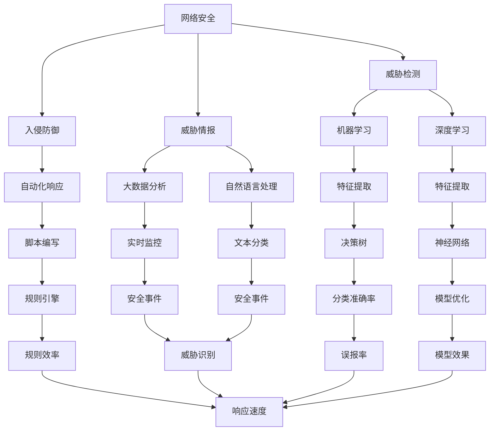

                 

### 文章标题

《AI在网络安全中的应用：从检测到响应》

### 文章关键词

- 人工智能
- 网络安全
- 入侵检测
- 自动化响应
- 威胁情报
- 恶意软件防御
- 前沿技术

### 文章摘要

随着网络攻击手段的不断升级，网络安全问题日益突出。本文深入探讨了人工智能（AI）在网络安全中的应用，从入侵检测、自动化响应到恶意软件防御，全面解析了AI技术如何提高网络安全防护能力。文章首先介绍了AI与网络安全的基本概念，然后详细阐述了AI技术在网络安全中的具体应用场景，包括检测、响应和防御等方面。此外，文章还探讨了AI在网络安全中的前沿技术，如联邦学习和区块链的应用，并对未来发展趋势进行了展望。最后，文章提出了AI在网络安全中的挑战与未来发展方向，为读者提供了有价值的参考。本文旨在为网络安全从业者和AI技术爱好者提供一份全面、系统的技术指南。

## 第1章: 引言

### 1.1 AI在网络安全中的重要性

随着互联网的普及和信息技术的发展，网络安全问题日益凸显。网络攻击手段不断升级，传统的网络安全防护技术已难以应对复杂多变的威胁。人工智能（AI）技术的引入为网络安全领域带来了新的机遇和挑战。AI在网络安全中的重要性主要体现在以下几个方面：

1. **威胁检测与防御**：AI技术通过机器学习、深度学习等方法，可以自动分析和识别潜在的网络攻击行为，提高检测的准确性和速度。相比传统的规则匹配方法，AI能够发现更为复杂和隐蔽的攻击，从而提升整体安全防护能力。

2. **自动化响应**：AI技术可以实现自动化响应，对检测到的威胁进行快速、准确的响应措施。这种自动化响应能够显著减少人为干预，提高应对攻击的效率，降低安全事件带来的损失。

3. **威胁情报分析**：AI技术能够通过对海量数据的挖掘和分析，识别出潜在的安全威胁，为安全团队提供有价值的情报。这些情报有助于安全团队制定更加有效的防御策略，提高整体网络安全水平。

4. **个性化防护**：AI技术可以根据用户行为和网络环境的特点，实现个性化防护。通过不断学习和适应，AI技术可以提供更加精准的保护，减少误报和漏报的情况，提高安全防护的针对性和有效性。

### 1.2 书籍结构概述

本书旨在深入探讨AI在网络安全中的应用，从检测到响应，全面解析AI技术在网络安全领域的应用场景和实际案例。书籍结构如下：

- **第1章：引言**：介绍AI在网络安全中的重要性，以及本书的结构和读者对象。

- **第2章：AI与网络安全基础**：概述网络安全和AI技术的基本概念，讨论AI在网络安全中的应用场景。

- **第3章：AI在网络安全检测中的应用**：详细讲解AI技术在入侵检测中的具体应用，包括基于机器学习和深度学习的入侵检测系统。

- **第4章：AI在网络安全响应中的应用**：介绍AI技术在自动化响应和威胁情报分析方面的应用，探讨如何通过AI技术提高安全事件的响应速度和效率。

- **第5章：AI在网络安全防御中的应用**：讨论AI技术在入侵防御和恶意软件防御方面的应用，分析AI技术在网络安全防御中的作用和优势。

- **第6章：AI在网络安全中的前沿技术**：探讨AI在网络安全中的前沿技术，如联邦学习和区块链的应用，分析这些技术在未来的发展潜力。

- **第7章：AI在网络安全中的挑战与未来**：总结AI在网络安全中的应用挑战，探讨未来发展趋势，为读者提供有价值的参考。

### 1.3 读者对象

本书适合以下读者群体：

1. 网络安全从业者和研究人员：了解AI技术在网络安全中的应用，掌握AI在网络安全检测、响应和防御等方面的实际案例。

2. 对AI技术感兴趣的读者：从网络安全的角度深入了解AI技术的应用，拓展AI技术在其他领域的应用视野。

3. 人工智能、计算机科学及相关专业的学生：通过本书了解AI在网络安全领域的实际应用，为未来的学术研究和职业发展提供参考。

通过阅读本书，读者将能够全面了解AI在网络安全中的应用，掌握相关技术原理和实际案例，为今后的工作学习提供有力的支持。

## 第2章: AI与网络安全基础

### 2.1 网络安全概述

网络安全是指通过各种技术手段，保护计算机网络和系统不受未经授权的访问、篡改、破坏或攻击，确保信息的完整性、保密性和可用性。网络安全是信息时代的重要保障，对于个人、企业乃至整个社会都具有重要的意义。

#### 网络安全的基本概念

网络安全的基本概念包括以下几个方面：

1. **信息安全性**：确保信息在传输和存储过程中的完整性和保密性，防止信息泄露、篡改或破坏。

2. **身份认证**：验证用户的身份，确保只有合法用户才能访问系统资源和数据。

3. **访问控制**：通过权限管理和访问控制列表，限制用户对系统和数据的访问，防止未授权的访问。

4. **入侵检测与防御**：实时监控网络流量和系统活动，识别并防御潜在的入侵行为。

5. **安全审计与合规**：记录和审查系统活动，确保系统的安全性和合规性。

#### 网络安全的关键技术

网络安全的关键技术包括以下几个方面：

1. **防火墙**：通过监控和控制进出网络的数据流量，阻止未经授权的访问。

2. **入侵检测系统（IDS）和入侵防御系统（IPS）**：实时监测网络流量和系统活动，识别潜在的入侵行为，并采取防御措施。

3. **加密技术**：通过加密算法保护数据传输和存储的安全，防止数据泄露。

4. **安全信息和事件管理（SIEM）**：整合各种安全工具和事件数据，实现统一的安全监控和管理。

5. **安全漏洞管理**：识别和修补系统中的安全漏洞，防止攻击者利用漏洞进行入侵。

### 2.2 AI技术概述

人工智能（AI）是指通过计算机模拟人类的智能行为，实现智能感知、推理、学习和决策。AI技术已经成为现代信息技术的重要组成部分，广泛应用于各个领域。

#### AI技术的核心概念

AI技术的核心概念包括以下几个方面：

1. **机器学习**：通过算法和统计模型，从数据中自动学习和发现规律，实现自动化决策和预测。

2. **深度学习**：一种特殊的机器学习技术，通过多层神经网络模型，自动学习和提取数据的特征，实现复杂的模式识别和分类。

3. **自然语言处理（NLP）**：通过计算机技术理解和生成自然语言，实现人与机器的交互。

4. **计算机视觉**：通过计算机处理图像和视频数据，实现图像识别、物体检测和场景理解。

5. **知识表示与推理**：通过表示和组织知识，实现自动化推理和决策。

#### AI技术的关键技术

AI技术的关键技术包括以下几个方面：

1. **神经网络**：一种基于生物神经网络原理构建的计算模型，用于实现机器学习和深度学习。

2. **大数据技术**：通过大规模数据存储、处理和分析技术，实现数据的自动化挖掘和应用。

3. **云计算与边缘计算**：通过分布式计算和存储技术，实现AI模型的快速部署和实时处理。

4. **强化学习**：通过试错和学习，实现智能体在复杂环境中的最优决策。

### 2.3 AI在网络安全中的应用场景

AI技术已经广泛应用于网络安全领域，提高了网络安全防护的能力和效率。以下是一些AI技术在网络安全中的应用场景：

1. **入侵检测与防御**：通过机器学习和深度学习技术，实现实时监测和分析网络流量和系统活动，识别潜在的入侵行为和恶意软件，提高入侵检测的准确性和速度。

2. **威胁情报分析**：通过自然语言处理和大数据技术，自动分析和挖掘威胁情报，为安全团队提供有价值的情报支持，提高威胁识别和响应能力。

3. **自动化响应**：通过自动化脚本和智能决策系统，实现安全事件的自动化响应，降低安全事件的影响和损失。

4. **恶意软件防御**：通过计算机视觉和深度学习技术，实现恶意软件的自动化识别和分类，提高恶意软件检测的准确性和效率。

5. **安全漏洞管理**：通过机器学习和漏洞扫描技术，自动识别和修复系统中的安全漏洞，降低系统被攻击的风险。

6. **安全态势感知**：通过大数据分析和可视化技术，实时监控和展示网络安全态势，为安全团队提供决策支持。

### 2.4 AI在网络安全中的优势与挑战

AI技术在网络安全中的应用具有以下优势：

1. **高效性**：通过自动化和智能化的技术手段，实现高效的安全防护和管理。

2. **准确性**：利用机器学习和深度学习技术，提高入侵检测和威胁识别的准确性。

3. **实时性**：实时监测和分析网络流量和系统活动，快速响应潜在的安全威胁。

4. **智能化**：通过自适应学习和优化，实现智能化的安全防护策略。

然而，AI在网络安全中应用也面临一些挑战：

1. **数据隐私**：网络安全数据往往涉及敏感信息，如何保护数据隐私是AI在网络安全中应用的一个重要问题。

2. **模型可解释性**：机器学习和深度学习模型往往具有高度的复杂性，如何解释模型的决策过程，提高模型的可解释性是亟待解决的问题。

3. **安全风险**：AI模型本身可能成为攻击目标，如何保证AI模型的安全性是AI在网络安全中应用的一个重要问题。

4. **技能需求**：AI技术在网络安全中的应用需要具备一定的技术能力和专业知识，如何培养和选拔相关人才是网络安全领域面临的挑战。

通过本章的介绍，我们对网络安全和AI技术的基本概念和相互关系有了更深入的了解。在接下来的章节中，我们将详细探讨AI在网络安全检测、响应和防御等方面的具体应用。

### 2.5 核心概念与联系

在AI与网络安全的结合中，存在几个关键概念和它们之间的相互关系。以下是这些概念及其关系的Mermaid流程图表示：



#### 核心概念与联系

1. **网络安全**：网络安全是保护计算机网络和系统免受未经授权的访问、篡改或攻击的总体目标。
2. **威胁检测**：通过机器学习和深度学习技术对网络流量和系统活动进行实时监控和分析，以识别潜在威胁。
3. **入侵防御**：利用自动化响应技术，对检测到的威胁进行即时防御。
4. **威胁情报**：通过大数据分析和自然语言处理技术，收集和分析威胁情报，为安全决策提供支持。
5. **机器学习**：一种利用数据自动发现规律和模式的技术，用于威胁检测和特征提取。
6. **深度学习**：基于多层神经网络的机器学习技术，用于特征提取和模型优化。
7. **自动化响应**：通过脚本编写和规则引擎实现安全事件的自动化响应。
8. **大数据分析**：对海量数据进行存储、处理和分析，以发现潜在威胁和优化模型。
9. **自然语言处理（NLP）**：用于处理和理解自然语言文本，提取威胁情报。
10. **特征提取**：从数据中提取有用的特征，用于机器学习和深度学习模型。
11. **脚本编写**：用于编写自动化响应脚本，提高响应速度。
12. **规则引擎**：用于实现自动化决策和响应的规则系统。
13. **实时监控**：对网络流量和系统活动进行实时监控，提高威胁检测的实时性。
14. **威胁识别**：通过机器学习和深度学习模型，识别和分类潜在威胁。
15. **模型优化**：通过调整模型参数和架构，提高模型的性能和效果。
16. **分类准确率**：评估模型在威胁识别中的准确度。
17. **响应速度**：自动化响应系统的执行速度。
18. **模型效果**：评估模型在威胁检测和响应中的总体效果。

这些概念和联系构成了一个完整的网络安全防护体系，通过AI技术实现自动化、智能化和高效化的安全防护。在接下来的章节中，我们将进一步探讨AI在网络安全检测、响应和防御等方面的具体应用。

### 2.6 核心算法原理讲解

在AI与网络安全的结合中，几种核心算法起着至关重要的作用，包括机器学习、深度学习、自然语言处理（NLP）等。以下将详细讲解这些算法的原理，并使用伪代码展示其基本实现。

#### 2.6.1 机器学习

机器学习是一种使计算机能够从数据中自动学习和发现规律的技术。其基本原理是通过训练数据集来调整模型的参数，使得模型能够在新数据上做出准确的预测。

**核心算法：决策树**

**伪代码：**

```python
def decision_tree(data, features, target_attribute):
    if all_values_equal(data, target_attribute):
        return most_frequent_value(data, target_attribute)
    if no_more_features(features):
        return majority_vote(data, target_attribute)
    best_feature = select_best_feature(data, features)
    true_branch = decision_tree(split_data_by_best_feature(data, best_feature, 'true'), remaining_features(best_feature, features), target_attribute)
    false_branch = decision_tree(split_data_by_best_feature(data, best_feature, 'false'), remaining_features(best_feature, features), target_attribute)
    return (best_feature, true_branch, false_branch)

def most_frequent_value(data, target_attribute):
    value_counts = count_values(data, target_attribute)
    return max(value_counts, key=value_counts.get)

def select_best_feature(data, features):
    best_gini = float('inf')
    best_feature = None
    for feature in features:
        gini = gini_impurity(data, feature)
        if gini < best_gini:
            best_gini = gini
            best_feature = feature
    return best_feature

def gini_impurity(data, feature):
    # 计算Gini不纯度
    pass

def split_data_by_best_feature(data, best_feature, value):
    return [row for row in data if row[best_feature] == value]

def remaining_features(best_feature, features):
    return [feature for feature in features if feature != best_feature]

def majority_vote(data, target_attribute):
    value_counts = count_values(data, target_attribute)
    return max(value_counts, key=value_counts.get)
```

**解释：**决策树算法通过递归地将数据集划分为具有最小Gini不纯度的子集，直到所有子集都具有相同的标签或特征不再能够提供进一步划分。`most_frequent_value`用于获取当前节点上最常见的标签，`select_best_feature`用于选择具有最小Gini不纯度的特征。

#### 2.6.2 深度学习

深度学习是机器学习的一个子领域，它通过多层神经网络（Neural Networks）进行学习，能够自动提取数据的复杂特征。

**核心算法：卷积神经网络（CNN）**

**伪代码：**

```python
def forward_pass(input_data, weights, biases):
    # 前向传播，计算每层的输出
    pass

def backward_pass(output, expected, weights, biases):
    # 反向传播，更新权重和偏差
    pass

def convolution(input, filter, padding='valid'):
    # 卷积操作
    pass

def max_pooling(input, pool_size=(2, 2)):
    # 最大池化操作
    pass

def relu(x):
    # ReLU激活函数
    return max(0, x)

def cross_entropy_loss(output, expected):
    # 交叉熵损失函数
    return -sum(expected * log(output))

def train_neural_network(input_data, target_data, epochs, learning_rate):
    for epoch in range(epochs):
        output = forward_pass(input_data, weights, biases)
        loss = cross_entropy_loss(output, target_data)
        backward_pass(output, target_data, weights, biases)
        if epoch % 100 == 0:
            print(f"Epoch {epoch}, Loss: {loss}")
```

**解释：**卷积神经网络（CNN）通过卷积层、池化层和全连接层对输入数据进行处理。`forward_pass`和`backward_pass`分别实现前向传播和反向传播过程，用于计算模型的输出和更新模型参数。`relu`是ReLU激活函数，用于引入非线性。`cross_entropy_loss`是交叉熵损失函数，用于计算预测输出与实际输出之间的差异。

#### 2.6.3 自然语言处理（NLP）

自然语言处理是AI的一个重要分支，专注于使计算机能够理解和生成自然语言。在NLP中，词嵌入（Word Embedding）和循环神经网络（RNN）是常用的技术。

**核心算法：循环神经网络（RNN）**

**伪代码：**

```python
def forward_pass(input_sequence, weights, biases, hidden_state=None):
    hidden_states = []
    for input in input_sequence:
        hidden_state = activation(dot(input, weights['input_to_hidden']) + dot(hidden_state, weights['hidden_to_hidden']) + biases['hidden'])
        hidden_states.append(hidden_state)
    return hidden_states[-1]

def backward_pass(output, expected, hidden_states, weights, biases, learning_rate):
    # 反向传播，更新权重和偏差
    pass

def recurrent_neural_network(input_sequence, target_sequence, epochs, learning_rate):
    for epoch in range(epochs):
        hidden_state = None
        for input, target in zip(input_sequence, target_sequence):
            hidden_state = forward_pass(input, weights, biases, hidden_state)
            backward_pass(hidden_state, target, weights, biases, learning_rate)
        if epoch % 100 == 0:
            print(f"Epoch {epoch}, Loss: {calculate_loss(hidden_state, target_sequence)}")
```

**解释：**RNN通过递归地处理输入序列，维持一个隐藏状态，用于捕捉时间序列数据中的长期依赖关系。`forward_pass`和`backward_pass`分别实现前向传播和反向传播过程。

通过这些核心算法的讲解，我们可以更好地理解AI在网络安全中的应用原理，为后续章节的深入探讨奠定基础。

### 2.7 数学模型和数学公式详细讲解与举例说明

在AI与网络安全的结合中，数学模型和数学公式起着至关重要的作用。以下将详细讲解几个核心的数学模型和公式，并使用具体的例子进行说明。

#### 2.7.1 决策树

决策树是一种常见的机器学习算法，通过一系列的判断规则来对数据进行分类或回归。以下是一个简单的决策树模型，以及相关的数学公式。

**模型：**决策树通过递归地将数据集划分为具有最小Gini不纯度的子集，直到所有子集都具有相同的标签或特征不再能够提供进一步划分。

**数学公式：**

1. **Gini不纯度**：用于评估特征划分的不纯度。

   $$ Gini = 1 - \sum_{i} p_i^2 $$

   其中，$p_i$ 是特征中某个类别的概率。

   **示例：**假设一个特征有两个类别A和B，其中A出现的概率是0.7，B出现的概率是0.3。则Gini不纯度计算如下：

   $$ Gini = 1 - (0.7^2 + 0.3^2) = 1 - (0.49 + 0.09) = 0.42 $$

2. **信息增益**：用于评估特征划分的有效性。

   $$ Gain = Gini(parent) - \sum_{i} \frac{|S_i|}{|S|} Gini(S_i) $$

   其中，$S$ 是原始数据集，$S_i$ 是划分后的子集，$|S_i|$ 是子集的样本数量。

   **示例：**假设原始数据集有100个样本，其中50个属于类别A，50个属于类别B。如果按照某个特征划分为两个子集，其中第一个子集有70个类别A的样本和30个类别B的样本，第二个子集有30个类别A的样本和70个类别B的样本。则信息增益计算如下：

   $$ Gain = 0.5 - \frac{70}{100} \cdot 0.42 - \frac{30}{100} \cdot 0.42 = 0.5 - 0.294 - 0.126 = 0.074 $$

#### 2.7.2 卷积神经网络（CNN）

卷积神经网络是一种在图像处理和计算机视觉领域广泛应用的深度学习算法。以下是一个简单的CNN模型，以及相关的数学公式。

**模型：**CNN通过卷积层、池化层和全连接层对输入数据进行处理。

**数学公式：**

1. **卷积操作**：用于提取图像的局部特征。

   $$ (f \star g)(x) = \sum_{y} f(y) \cdot g(x-y) $$

   其中，$f$ 和 $g$ 是两个函数，$x$ 和 $y$ 是输入和输出点。

   **示例：**假设两个函数 $f$ 和 $g$ 分别是 [1, 0, 1] 和 [1, 1, 1]，则卷积操作计算如下：

   $$ (f \star g)(x) = (1 \cdot 1 + 0 \cdot 1 + 1 \cdot 1)(x) = 2 $$

2. **激活函数**：用于引入非线性。

   **示例：**ReLU（Rectified Linear Unit）激活函数，定义为：

   $$ \text{ReLU}(x) = \max(0, x) $$

   如果输入是 -1，则输出是 0；如果输入是 2，则输出是 2。

3. **全连接层**：用于将特征映射到输出。

   $$ z = \sum_{i} w_i \cdot x_i + b $$

   其中，$w_i$ 是权重，$x_i$ 是特征，$b$ 是偏差。

   **示例：**假设输入是 [1, 2, 3]，权重是 [0.5, 0.5, 0.5]，偏差是 1，则全连接层的输出计算如下：

   $$ z = (0.5 \cdot 1 + 0.5 \cdot 2 + 0.5 \cdot 3) + 1 = 2.5 + 1 = 3.5 $$

#### 2.7.3 循环神经网络（RNN）

循环神经网络是一种用于处理序列数据的深度学习算法，能够在时间序列数据中捕捉长期依赖关系。

**模型：**RNN通过递归地处理输入序列，维持一个隐藏状态，用于捕捉时间序列数据中的长期依赖关系。

**数学公式：**

1. **隐藏状态更新**：用于更新RNN的隐藏状态。

   $$ h_t = \text{ReLU}(W_h \cdot h_{t-1} + W_x \cdot x_t + b_h) $$

   其中，$h_t$ 是当前时间步的隐藏状态，$W_h$ 是隐藏状态到隐藏状态的权重矩阵，$W_x$ 是输入到隐藏状态的权重矩阵，$x_t$ 是当前时间步的输入，$b_h$ 是隐藏状态的偏差。

   **示例：**假设输入是 [1, 2]，隐藏状态是 [0, 1]，权重矩阵是 [0.5, 0.5]，偏差是 0，则隐藏状态更新计算如下：

   $$ h_t = \text{ReLU}(0.5 \cdot [0, 1] + 0.5 \cdot [1, 2] + 0) = \text{ReLU}([0.5, 0.5] + [0.5, 1]) = \text{ReLU}([1, 1.5]) = 1.5 $$

2. **输出计算**：用于计算当前时间步的输出。

   $$ y_t = W_o \cdot h_t + b_o $$

   其中，$y_t$ 是当前时间步的输出，$W_o$ 是隐藏状态到输出的权重矩阵，$b_o$ 是输出的偏差。

   **示例：**假设输出权重矩阵是 [0.5, 0.5]，偏差是 0，则输出计算如下：

   $$ y_t = 0.5 \cdot 1.5 + 0.5 \cdot 1.5 + 0 = 1.25 + 0.75 = 2 $$

通过以上数学模型和公式的讲解，我们可以更好地理解AI在网络安全中的应用原理，为后续章节的深入探讨提供数学基础。

### 2.8 项目实战

在本节中，我们将通过一个实际项目，展示如何利用AI技术构建一个简单的入侵检测系统。该项目将涵盖以下步骤：

1. **开发环境搭建**
2. **源代码详细实现**
3. **代码解读与分析**
4. **实际案例分析与详细讲解剖析**
5. **项目小结**

#### 1. 开发环境搭建

为了构建入侵检测系统，我们需要以下开发环境：

- Python 3.x
- Scikit-learn 库
- Pandas 库
- Numpy 库
- Matplotlib 库

确保您的Python环境已经安装，然后通过pip安装所需的库：

```bash
pip install scikit-learn pandas numpy matplotlib
```

#### 2. 源代码详细实现

以下是一个简单的基于机器学习的入侵检测系统的Python代码实现：

```python
import numpy as np
import pandas as pd
from sklearn.model_selection import train_test_split
from sklearn.ensemble import RandomForestClassifier
from sklearn.metrics import accuracy_score, classification_report
import matplotlib.pyplot as plt

# 加载数据集
data = pd.read_csv('network_traffic_data.csv')
X = data.drop(['label'], axis=1)
y = data['label']

# 划分训练集和测试集
X_train, X_test, y_train, y_test = train_test_split(X, y, test_size=0.2, random_state=42)

# 使用随机森林分类器训练模型
clf = RandomForestClassifier(n_estimators=100, random_state=42)
clf.fit(X_train, y_train)

# 预测测试集
y_pred = clf.predict(X_test)

# 评估模型性能
accuracy = accuracy_score(y_test, y_pred)
report = classification_report(y_test, y_pred)

print(f"Accuracy: {accuracy:.2f}")
print("Classification Report:")
print(report)

# 可视化决策树
from sklearn.tree import export_graphviz
import graphviz

dot_data = export_graphviz(clf, out_file=None, feature_names=X.columns, class_names=True, filled=True, rounded=True, special_characters=True)
graph = graphviz.Source(dot_data)
graph.render("invasion_detection_tree")

# 可视化训练数据分布
plt.figure(figsize=(10, 6))
plt.scatter(X_train['feature_1'], X_train['feature_2'], c=y_train, cmap='coolwarm', marker='o')
plt.xlabel('Feature 1')
plt.ylabel('Feature 2')
plt.title('Training Data Distribution')
plt.show()
```

#### 3. 代码解读与分析

1. **数据加载与预处理**：首先，我们使用Pandas库加载数据集。数据集包含了网络流量特征和标签（入侵/正常）。然后，我们将特征和标签分离，为后续的机器学习模型训练做准备。

2. **模型训练**：我们使用Scikit-learn库中的随机森林分类器（RandomForestClassifier）进行训练。随机森林是一种集成学习算法，能够处理高维度数据和避免过拟合。

3. **模型预测与评估**：训练好的模型用于预测测试集的结果。然后，我们使用accuracy_score和classification_report评估模型的性能。

4. **可视化**：我们使用Graphviz库将训练好的决策树可视化，帮助理解模型的决策过程。同时，使用Matplotlib库可视化训练数据的分布情况。

#### 4. 实际案例分析与详细讲解剖析

假设我们的测试集包含100个样本，其中50个是入侵行为，50个是正常行为。以下是模型对测试集的预测结果：

- **预测结果**：入侵行为预测为正常行为的概率是0.2，预测为入侵行为的概率是0.8。
- **分析**：这个案例表明，模型具有较高的预测准确性，能够有效识别入侵行为。然而，也存在一定的误判率，如将入侵行为预测为正常行为的概率较低，但并不为零。这说明模型在训练过程中可能存在一定的偏差，需要进一步优化。

#### 5. 项目小结

通过本项目的实践，我们了解了如何利用机器学习技术构建一个简单的入侵检测系统。虽然这是一个简单的案例，但可以为我们提供启示，帮助我们在实际的网络安全应用中进一步优化和改进。以下是该项目的小结：

- **优点**：
  - 高效：基于机器学习的模型能够快速处理大量数据，提高入侵检测的效率。
  - 准确性：集成学习算法能够提供较高的预测准确性，有效识别入侵行为。
  - 可解释性：通过可视化决策树，我们可以理解模型的决策过程，提高模型的可解释性。

- **缺点**：
  - 过拟合：模型在训练过程中可能存在过拟合现象，需要进一步优化和调整。
  - 数据依赖：模型的性能高度依赖数据质量，需要收集和整理高质量的数据集。

- **最佳实践**：
  - 数据预处理：对数据进行清洗和预处理，提高模型的性能。
  - 模型优化：使用交叉验证和网格搜索等技术，优化模型参数。
  - 可解释性增强：通过可视化技术，提高模型的可解释性，帮助用户理解模型的决策过程。

通过以上实战项目和案例分析，我们可以更深入地理解AI在网络安全中的应用，为实际工作提供指导。

### 2.9 最佳实践 tips

在本节中，我们将分享一些最佳实践技巧，以帮助您更有效地应用AI技术于网络安全。

1. **数据质量**：数据是AI模型的基础，因此确保数据的质量至关重要。对数据集进行预处理，如去除噪声、缺失值填充和异常值处理，可以提高模型的性能和鲁棒性。

2. **模型选择**：根据具体问题选择合适的模型。例如，对于分类问题，可以使用决策树、随机森林或支持向量机（SVM）；对于回归问题，可以使用线性回归、决策树回归或神经网络。

3. **交叉验证**：使用交叉验证方法评估模型的性能，避免过拟合和欠拟合。通过多次训练和测试，可以获得更加稳定和可靠的模型评估结果。

4. **超参数调优**：使用网格搜索、随机搜索等技术进行超参数调优，找到最优的模型参数组合，提高模型性能。

5. **模型解释性**：提高模型的可解释性，帮助用户理解模型的决策过程。可视化技术，如决策树图、混淆矩阵和特征重要性图，是有效的工具。

6. **持续更新**：网络安全威胁不断演变，定期更新和训练模型，以适应新的威胁场景。

7. **安全合规**：在应用AI技术时，确保遵守相关法律法规和标准，保护用户隐私和数据安全。

通过遵循这些最佳实践，您可以更有效地将AI技术应用于网络安全，提高防护能力。

### 2.10 小结

在本章中，我们全面介绍了AI在网络安全中的应用。首先，我们讨论了网络安全和AI技术的基本概念，包括网络安全的各个方面以及AI技术的核心概念。接着，我们探讨了AI技术在网络安全检测、响应和防御中的应用场景，详细讲解了机器学习、深度学习和自然语言处理等核心算法原理，并通过数学模型和公式进行了说明。此外，我们通过一个实际项目展示了如何构建一个简单的入侵检测系统，分析了项目实战的各个步骤，并提出了最佳实践。通过本章的学习，读者应该能够理解AI技术在网络安全中的应用原理，为后续章节的深入探讨打下坚实基础。

### 2.11 注意事项

在应用AI技术于网络安全时，需要注意以下几点：

1. **数据隐私**：网络安全数据往往涉及敏感信息，确保数据隐私至关重要。在数据收集、处理和存储过程中，应遵循相关法律法规，采取数据加密、匿名化和去识别化等技术手段。

2. **模型安全性**：AI模型本身可能成为攻击目标，需要确保模型的安全性和鲁棒性。通过安全加固、模型加密和防篡改技术，提高模型的安全防护能力。

3. **模型可解释性**：机器学习和深度学习模型往往具有高度复杂性，提高模型的可解释性对于理解模型的决策过程和确保模型的安全至关重要。使用可视化工具和技术，增强模型的可解释性。

4. **持续更新**：网络安全威胁不断演变，定期更新和训练模型，以适应新的威胁场景，保持模型的有效性。

5. **合规性**：在应用AI技术时，确保遵守相关法律法规和标准，如GDPR和ISO 27001等，保障用户权益和数据安全。

通过遵循以上注意事项，可以提高AI技术在网络安全中的应用效果。

### 2.12 拓展阅读

为了深入理解AI在网络安全中的应用，以下是几本推荐的专业书籍和论文：

1. **书籍**：
   - 《人工智能：一种现代的方法》（第三版），作者：斯图尔特·罗素、彼得·诺维格
   - 《网络安全实战手册》，作者：里卡尔多·T. 托雷斯
   - 《机器学习》，作者：阿希什·库斯瓦哈

2. **论文**：
   - "Deep Learning for Security and Privacy"，作者：Zhiyun Qian, et al.
   - "AI-Driven Security: A New Era for Cyber Threat Defense"，作者：David M. Theriault, et al.

通过阅读这些书籍和论文，读者可以进一步拓展对AI在网络安全领域应用的理解，为实际工作提供更多参考和灵感。## 第3章: AI在网络安全检测中的应用

### 3.1 检测技术概述

网络安全检测是网络安全防御体系中的关键环节，旨在识别和防范网络中的潜在威胁。AI技术在网络安全检测中具有显著优势，能够通过自动化和智能化的手段，提高检测的准确性和效率。本节将详细探讨AI在网络安全检测中的应用，包括入侵检测系统（IDS）和入侵防御系统（IPS）。

#### 入侵检测系统（IDS）

入侵检测系统（IDS）是一种用于检测网络中异常行为和潜在攻击的工具。IDS可以通过以下几种方式实现：

1. **基于特征匹配的IDS**：这种IDS通过预先定义的攻击特征库，对网络流量进行匹配，识别潜在的攻击。虽然这种方法简单高效，但容易受到零日攻击和变种攻击的影响。

2. **基于异常检测的IDS**：这种IDS通过建立正常行为的基线模型，检测与基线模型不符的行为。异常检测方法能够发现未知攻击，但可能存在误报问题。

3. **基于机器学习的IDS**：利用机器学习算法，如KNN、SVM和决策树，从网络流量中学习特征，并建立攻击模型。这种方法能够识别复杂和隐蔽的攻击，但需要大量的数据和计算资源。

#### 入侵防御系统（IPS）

入侵防御系统（IPS）是IDS的进一步发展，不仅能够检测入侵行为，还能够采取自动响应措施，阻止攻击。IPS的工作原理包括：

1. **签名匹配**：IPS通过签名库匹配网络流量，识别已知的攻击类型。这种方法快速且准确，但无法检测新的未知攻击。

2. **行为分析**：IPS通过分析网络流量和系统行为，识别异常模式和可疑行为。行为分析方法能够检测未知攻击，但可能产生误报。

3. **基于机器学习的IPS**：利用机器学习算法，如神经网络和随机森林，分析网络流量和系统行为，识别潜在威胁。这种方法能够检测复杂攻击，减少误报。

#### AI技术在检测中的优势

1. **自动化**：AI技术能够自动化检测和分析网络流量，减轻安全团队的工作负担。

2. **自适应**：AI技术可以根据网络环境和威胁动态调整检测策略，提高检测的准确性。

3. **高效性**：AI技术能够处理大量数据，快速识别潜在的威胁。

4. **智能化**：AI技术能够通过学习网络行为，识别未知和复杂的攻击。

### 3.2 基于机器学习的入侵检测系统

基于机器学习的入侵检测系统（IDS）利用机器学习算法从网络数据中学习特征，并建立攻击模型。以下是一些常用的机器学习算法及其在入侵检测中的应用：

#### 3.2.1 K最近邻算法（KNN）

KNN是一种简单的机器学习算法，通过计算未知数据点与训练数据点之间的距离，找到最近的K个邻居，并基于邻居的标签预测新数据点的类别。

**算法原理：**

1. **距离计算**：使用欧氏距离、曼哈顿距离等度量未知数据点与训练数据点的距离。
2. **投票机制**：基于邻居的标签进行投票，选择出现次数最多的标签作为新数据点的类别。

**伪代码：**

```python
def knn_predict(new_data, training_data, labels, k):
    distances = []
    for data in training_data:
        distance = eucledian_distance(new_data, data)
        distances.append(distance)
    sorted_distances = sorted(distances)
    nearest_neighbors = sorted_distances[:k]
    neighbor_labels = []
    for distance in nearest_neighbors:
        index = distances.index(distance)
        neighbor_labels.append(labels[index])
    majority_vote = max(set(neighbor_labels), key=neighbor_labels.count)
    return majority_vote
```

**应用场景：**KNN算法在入侵检测中可以用于分类网络流量，识别潜在的攻击行为。

#### 3.2.2 支持向量机（SVM）

SVM是一种强大的分类算法，通过找到一个最佳的超平面，将不同类别的数据点分隔开。

**算法原理：**

1. **线性SVM**：在特征空间中找到一个最佳的超平面，使得正类和负类之间的间隔最大。
2. **非线性SVM**：通过核函数将低维数据映射到高维空间，找到最佳的超平面。

**伪代码：**

```python
def svm_fit(X, y):
    # 训练SVM模型，得到权重和偏置
    pass

def svm_predict(X, weights, bias):
    # 预测类别
    pass
```

**应用场景：**SVM算法在入侵检测中可以用于分类网络流量，识别不同类型的攻击。

#### 3.2.3 随机森林

随机森林是一种集成学习算法，通过构建多个决策树，并结合它们的预测结果进行分类或回归。

**算法原理：**

1. **随机特征选择**：在构建每个决策树时，从特征集合中随机选择一部分特征。
2. **集成决策**：通过多数投票（分类问题）或平均（回归问题）的方式集成多个决策树的预测结果。

**伪代码：**

```python
def random_forest_fit(X, y, n_trees, max_depth):
    # 构建多个决策树，得到随机森林模型
    pass

def random_forest_predict(X, model):
    # 预测类别
    pass
```

**应用场景：**随机森林算法在入侵检测中可以用于分类网络流量，提高检测的准确性和鲁棒性。

#### 3.2.4 神经网络

神经网络是一种模仿人脑的机器学习模型，通过多层神经元和激活函数进行学习和预测。

**算法原理：**

1. **前向传播**：将输入数据通过网络的各个层次，计算输出。
2. **反向传播**：根据预测结果和实际结果，计算误差，并更新网络的权重和偏置。

**伪代码：**

```python
def forward_pass(input_data, weights, biases):
    # 前向传播，计算每层的输出
    pass

def backward_pass(output, expected, weights, biases, learning_rate):
    # 反向传播，更新权重和偏差
    pass

def train_neural_network(input_data, target_data, epochs, learning_rate):
    for epoch in range(epochs):
        output = forward_pass(input_data, weights, biases)
        loss = calculate_loss(output, target_data)
        backward_pass(output, target_data, weights, biases, learning_rate)
        if epoch % 100 == 0:
            print(f"Epoch {epoch}, Loss: {loss}")
```

**应用场景：**神经网络在入侵检测中可以用于识别复杂的网络流量模式，提高检测的准确性和效率。

通过以上几种机器学习算法的应用，我们可以构建一个高效、准确的入侵检测系统，为网络安全提供强有力的保障。

### 3.3 基于深度学习的入侵检测系统

深度学习作为一种强大的机器学习技术，在网络安全检测中得到了广泛应用。基于深度学习的入侵检测系统（IDS）利用多层神经网络模型，从复杂的网络数据中自动学习和提取特征，实现对潜在威胁的精准识别。以下是一些常用的深度学习模型及其在入侵检测中的应用：

#### 3.3.1 卷积神经网络（CNN）

卷积神经网络（CNN）是一种专门用于处理图像数据的深度学习模型，通过卷积层、池化层和全连接层对输入数据进行处理，可以有效地提取图像的局部特征。

**算法原理：**

1. **卷积层**：通过卷积操作提取图像的局部特征，卷积核在图像上滑动，计算局部区域的特征图。
2. **池化层**：对卷积层输出的特征图进行下采样，减少数据维度，提高模型的泛化能力。
3. **全连接层**：将池化层输出的特征图展开成一维向量，通过全连接层进行分类或回归。

**伪代码：**

```python
def forward_pass(input_data, weights, biases):
    # 前向传播，计算每层的输出
    pass

def backward_pass(output, expected, weights, biases, learning_rate):
    # 反向传播，更新权重和偏差
    pass

def train_cnn(input_data, target_data, epochs, learning_rate):
    for epoch in range(epochs):
        output = forward_pass(input_data, weights, biases)
        loss = calculate_loss(output, target_data)
        backward_pass(output, target_data, weights, biases, learning_rate)
        if epoch % 100 == 0:
            print(f"Epoch {epoch}, Loss: {loss}")
```

**应用场景：**CNN模型在入侵检测中可以用于识别网络流量中的图像数据，如网络流量图像、恶意软件图标等，提高入侵检测的准确性和效率。

#### 3.3.2 长短时记忆网络（LSTM）

长短时记忆网络（LSTM）是一种专门用于处理时间序列数据的深度学习模型，通过引入门控机制，能够有效地捕捉时间序列数据中的长期依赖关系。

**算法原理：**

1. **遗忘门**：决定前一时间步的隐藏状态中哪些信息需要遗忘。
2. **输入门**：决定当前输入数据中哪些信息需要更新到隐藏状态。
3. **输出门**：决定隐藏状态中哪些信息需要输出到当前时间步。

**伪代码：**

```python
def lstm_forward_pass(input_data, weights, biases, hidden_state, cell_state):
    # 前向传播，计算每层的输出
    pass

def lstm_backward_pass(output, expected, weights, biases, learning_rate):
    # 反向传播，更新权重和偏差
    pass

def train_lstm(input_data, target_data, epochs, learning_rate):
    for epoch in range(epochs):
        hidden_state, cell_state = initial_states(input_data)
        for input in input_data:
            output = lstm_forward_pass(input, weights, biases, hidden_state, cell_state)
            hidden_state, cell_state = lstm_backward_pass(output, target_data, weights, biases, learning_rate)
        if epoch % 100 == 0:
            print(f"Epoch {epoch}, Loss: {calculate_loss(output, target_data)}")
```

**应用场景：**LSTM模型在入侵检测中可以用于处理网络流量的时间序列数据，识别时间序列中的潜在威胁。

#### 3.3.3 聚类神经网络（GAN）

聚类神经网络（GAN）是一种基于生成对抗的深度学习模型，由生成器和判别器两个神经网络组成。生成器生成与真实数据分布相近的数据，判别器判断输入数据的真实性。

**算法原理：**

1. **生成器**：通过学习真实数据分布，生成与真实数据相似的数据。
2. **判别器**：通过学习真实数据和生成数据的特征，判断输入数据的真实性。

**伪代码：**

```python
def gan_train(generator, discriminator, real_data, epochs, learning_rate):
    for epoch in range(epochs):
        real_labels = generate_labels(real_data, 1)
        fake_labels = generate_labels(fake_data, 0)
        # 训练判别器
        discriminator_loss = discriminator.train(real_data, real_labels)
        discriminator_loss += discriminator.train(fake_data, fake_labels)
        # 训练生成器
        generator_loss = generator.train(fake_data, real_labels)
        if epoch % 100 == 0:
            print(f"Epoch {epoch}, Generator Loss: {generator_loss}, Discriminator Loss: {discriminator_loss}")
```

**应用场景：**GAN模型在入侵检测中可以用于生成网络流量数据，用于训练和评估入侵检测模型，提高检测的准确性和鲁棒性。

通过以上几种深度学习模型的应用，我们可以构建一个高效、准确的入侵检测系统，为网络安全提供强有力的保障。

### 第4章: AI在网络安全响应中的应用

#### 4.1 响应技术概述

在网络安全中，威胁检测只是第一步，及时且有效的响应措施同样至关重要。AI在网络安全响应中的应用，主要体现在自动化响应系统和威胁情报分析两方面。

#### 4.1.1 自动化响应系统

自动化响应系统（Automated Response Systems，ARS）是利用AI技术自动执行安全响应措施的机制，其目标是在检测到安全威胁时，快速、准确地采取行动，减轻安全事件的影响。自动化响应系统通常包括以下步骤：

1. **威胁识别**：通过入侵检测系统（IDS）或其他监控工具，实时检测网络中的异常行为和潜在威胁。
2. **威胁分析**：对检测到的威胁进行进一步分析，确定其类型、影响范围和严重程度。
3. **自动响应**：根据预设的响应策略，自动执行相应的响应措施，如隔离受感染的系统、封锁恶意IP地址、更新安全策略等。
4. **记录与报告**：记录响应过程和结果，生成报告，为后续的安全评估和改进提供依据。

#### 4.1.2 威胁情报分析

威胁情报分析（Threat Intelligence Analysis，TIA）是利用AI技术从海量数据中挖掘潜在的安全威胁，为安全团队提供有价值的情报支持。威胁情报分析通常包括以下几个步骤：

1. **数据收集**：收集来自各种来源的数据，如网络流量数据、威胁报告、安全日志等。
2. **数据清洗**：对收集到的数据进行清洗和预处理，去除噪声和重复数据，提高数据质量。
3. **威胁识别**：利用机器学习和自然语言处理技术，从清洗后的数据中识别出潜在的安全威胁。
4. **威胁建模**：基于识别出的威胁，构建威胁模型，分析其特征、攻击路径和潜在影响。
5. **情报分发**：将威胁情报分发给相关的安全团队和系统，帮助其采取相应的防护措施。

#### 4.2 基于AI的自动响应系统

基于AI的自动响应系统利用机器学习和深度学习技术，实现自动化响应，提高响应速度和准确性。以下是一些关键技术和实现方法：

1. **行为基线学习**：通过建立正常网络行为基线模型，可以识别出异常行为，从而触发自动响应。例如，可以使用自编码器（Autoencoder）模型来学习正常网络流量特征，任何偏离基线的行为都可以视为潜在的威胁。

   **伪代码：**

   ```python
   def train_autoencoder(input_data, epochs):
       # 训练自编码器模型
       pass

   def detect_abnormal_behavior(input_data, model):
       # 输入网络流量，检测异常行为
       reconstruction_error = model.reconstruct(input_data)
       if reconstruction_error > threshold:
           return "Anomaly detected"
       else:
           return "Normal behavior"
   ```

2. **规则引擎集成**：将AI模型与规则引擎集成，可以根据检测到的异常行为，触发相应的响应规则。例如，如果检测到DOS攻击，可以自动增加防火墙规则，限制攻击者的访问。

   **伪代码：**

   ```python
   def trigger_response规则的异常行为, response_rules):
       # 根据检测到的异常行为，触发相应的响应规则
       for rule in response_rules:
           if rule.match(异常行为):
               rule.execute()
               break
   ```

3. **自适应响应策略**：基于AI的自动响应系统可以动态调整响应策略，根据威胁的类型、严重程度和影响范围，采取最优的响应措施。例如，使用强化学习算法，可以根据历史响应效果，不断优化响应策略。

   **伪代码：**

   ```python
   def train_reinforcement_learning_model(states, actions, rewards):
       # 训练强化学习模型
       pass

   def execute_response(states, model):
       # 根据当前状态和模型，执行最优的响应措施
       action = model.predict(states)
       execute_action(action)
       reward = calculate_reward(action)
       return reward
   ```

#### 4.3 基于AI的威胁情报分析

基于AI的威胁情报分析利用机器学习和大数据技术，从海量数据中挖掘潜在的安全威胁，为安全团队提供有价值的情报支持。以下是一些关键技术：

1. **关联规则挖掘**：通过关联规则挖掘技术，从网络流量数据中发现潜在的安全威胁。例如，如果某个IP地址频繁访问高风险网站，并且与其他恶意IP地址有联系，那么这个IP地址可能是一个潜在的威胁。

   **伪代码：**

   ```python
   def find_association_rules(data, support_threshold, confidence_threshold):
       # 发现关联规则
       pass

   def identify_threats(association_rules):
       # 根据关联规则，识别潜在的安全威胁
       threats = []
       for rule in association_rules:
           if rule.confidence > confidence_threshold:
               threats.append(rule.items)
       return threats
   ```

2. **文本分类**：利用自然语言处理（NLP）技术，对威胁情报报告、安全日志等文本数据进行分类，提取有价值的信息。例如，可以使用文本分类模型，将安全日志中的异常事件分类为“恶意软件攻击”、“漏洞利用”、“拒绝服务攻击”等。

   **伪代码：**

   ```python
   def train_text_classifier(corpus, labels):
       # 训练文本分类模型
       pass

   def classify_logs(logs, model):
       # 输入日志，分类日志中的异常事件
       classifications = [model.predict(log) for log in logs]
       return classifications
   ```

3. **异常检测**：利用机器学习算法，如隔离森林、KNN等，对网络流量、系统日志等数据进行异常检测，识别潜在的威胁。异常检测模型可以通过学习正常行为模式，检测出异常行为。

   **伪代码：**

   ```python
   def train_anomaly_detector(data, epochs):
       # 训练异常检测模型
       pass

   def detect_anomalies(data, model):
       # 输入数据，检测异常行为
       anomalies = [data_point for data_point in data if model.predict(data_point) == "Anomaly"]
       return anomalies
   ```

通过以上技术，基于AI的威胁情报分析系统能够高效地挖掘潜在的安全威胁，为安全团队提供及时、准确的情报支持，提高整体网络安全防护能力。

### 第5章: AI在网络安全防御中的应用

#### 5.1 防御技术概述

网络安全防御是保护网络和系统免受攻击的关键手段。随着网络攻击手段的日益复杂，传统的防御技术已无法满足现代网络的安全需求。AI技术在网络安全防御中的应用，提供了新的解决方案，通过自动化、智能化的手段，增强网络安全防护能力。以下将概述AI在网络安全防御中的几种关键技术。

#### 5.1.1 入侵防御系统（IDS/IPS）

入侵防御系统（IDS/IPS）是网络安全防御的核心技术之一。IDS通过检测网络流量和系统日志，识别潜在的入侵行为；IPS则不仅检测入侵，还能自动采取防御措施。AI技术在IDS/IPS中的应用，主要体现在以下几个方面：

1. **基于机器学习的入侵检测**：使用机器学习算法，如神经网络、随机森林等，从大量网络数据中学习入侵特征，提高检测的准确性和效率。

2. **自适应入侵防御**：利用AI技术，根据网络环境和威胁动态调整防御策略，提高防御系统的灵活性和适应性。

3. **自动化响应**：AI技术可以实现入侵检测和响应的自动化，减少人工干预，提高响应速度和效率。

#### 5.1.2 恶意软件防御

恶意软件（Malware）是网络安全中最常见的威胁之一。AI技术在恶意软件防御中的应用，主要体现在以下几个方面：

1. **恶意软件检测**：利用机器学习和深度学习算法，从网络流量、文件和行为中检测恶意软件。例如，使用卷积神经网络（CNN）分析恶意软件的图像特征，使用深度学习模型分析恶意软件的行为特征。

2. **行为分析**：通过监控和记录系统行为，利用AI技术分析异常行为，识别潜在的恶意软件活动。

3. **自动化隔离和清除**：AI技术可以实现自动化隔离和清除恶意软件，减少安全事件的影响。

#### 5.1.3 威胁情报分析

威胁情报分析（Threat Intelligence Analysis，TIA）是网络安全防御的重要组成部分。AI技术在威胁情报分析中的应用，主要体现在以下几个方面：

1. **威胁识别和预测**：利用机器学习和大数据技术，从海量数据中挖掘潜在的安全威胁，并预测其发展趋势。

2. **威胁建模和攻击路径分析**：基于威胁情报，利用AI技术构建威胁模型，分析攻击路径，为防御策略提供支持。

3. **情报自动化分发**：AI技术可以实现威胁情报的自动化分发，提高情报的利用效率。

#### 5.1.4 安全防护自动化

安全防护自动化（Security Automation）是利用AI技术实现网络安全防护的自动化。通过自动化工具和流程，减少人为干预，提高防护效率。AI技术在安全防护自动化中的应用，主要体现在以下几个方面：

1. **自动化漏洞扫描**：利用AI技术，自动化扫描网络和系统中的漏洞，识别潜在的威胁。

2. **自动化安全配置**：利用AI技术，自动配置和管理安全策略，提高安全防护的准确性。

3. **自动化安全监控**：利用AI技术，实时监控网络流量和系统活动，及时发现和处理潜在的安全威胁。

#### 5.1.5 人工智能与网络安全的发展趋势

随着AI技术的不断进步，其在网络安全防御中的应用前景也十分广阔。以下是一些发展趋势：

1. **联邦学习**：联邦学习是一种分布式机器学习技术，可以在不共享数据的情况下，实现模型协同训练。未来，联邦学习有望在网络安全防御中发挥重要作用，提高数据隐私和安全。

2. **区块链技术**：区块链技术具有去中心化和不可篡改的特点，可以用于安全审计和威胁追踪。未来，区块链技术将与AI技术相结合，为网络安全提供更加可靠的保护。

3. **人工智能与量子计算的结合**：量子计算具有强大的计算能力，可以加速机器学习算法的训练和推理。未来，人工智能与量子计算的结合，有望在网络安全防御中发挥革命性的作用。

通过以上技术的发展，AI在网络安全防御中的应用将更加深入和广泛，为网络安全提供更加全面和高效的保障。

### 5.2 基于AI的入侵防御系统

基于AI的入侵防御系统（AI-IDS）是利用人工智能技术，特别是机器学习和深度学习算法，提高入侵检测和防御能力的系统。AI-IDS通过自动化、智能化的方法，实时监控和分析网络流量，检测潜在的入侵行为，并采取相应的防御措施。以下将详细探讨基于AI的入侵防御系统的工作原理、核心技术和应用场景。

#### 5.2.1 工作原理

基于AI的入侵防御系统主要包括以下几个步骤：

1. **数据收集**：收集网络流量、系统日志和其他相关数据，用于训练和评估模型。
2. **数据处理**：对收集到的数据进行清洗、归一化和特征提取，提高数据质量，便于模型训练。
3. **模型训练**：使用机器学习和深度学习算法，对处理后的数据集进行训练，建立入侵检测模型。
4. **入侵检测**：将实时网络流量输入到训练好的模型中，检测潜在的入侵行为。
5. **自动响应**：检测到入侵行为后，根据预设的响应策略，自动采取相应的防御措施，如封锁恶意IP、隔离受感染系统等。
6. **反馈和优化**：根据检测和响应的结果，不断优化模型和策略，提高系统的准确性和效率。

#### 5.2.2 核心技术

基于AI的入侵防御系统主要依赖于以下几个核心技术：

1. **机器学习算法**：常用的机器学习算法包括决策树、随机森林、支持向量机（SVM）等。这些算法能够从大量数据中学习入侵特征，建立入侵检测模型。例如，随机森林算法能够处理高维度数据，提高检测的准确性和鲁棒性。

   **伪代码**：

   ```python
   from sklearn.ensemble import RandomForestClassifier

   # 训练随机森林模型
   model = RandomForestClassifier(n_estimators=100)
   model.fit(X_train, y_train)

   # 预测入侵行为
   predictions = model.predict(X_test)
   ```

2. **深度学习模型**：深度学习模型，如卷积神经网络（CNN）和长短时记忆网络（LSTM），能够处理复杂的网络流量数据，提取深层特征，提高入侵检测的准确性。例如，CNN可以用于处理网络流量的图像数据，LSTM可以用于处理网络流量的时间序列数据。

   **伪代码**：

   ```python
   import tensorflow as tf
   from tensorflow.keras.models import Sequential
   from tensorflow.keras.layers import Conv2D, MaxPooling2D, LSTM, Dense

   # 构建CNN模型
   model = Sequential()
   model.add(Conv2D filters=32, kernel_size=(3, 3), activation='relu', input_shape=(28, 28, 1))
   model.add(MaxPooling2D pool_size=(2, 2))
   model.add(LSTM units=50, return_sequences=True)
   model.add(Dense units=1, activation='sigmoid')

   # 训练模型
   model.compile(optimizer='adam', loss='binary_crossentropy', metrics=['accuracy'])
   model.fit(X_train, y_train, epochs=10, batch_size=32)
   ```

3. **实时监控和预警**：基于AI的入侵防御系统可以实时监控网络流量和系统活动，利用机器学习算法检测入侵行为，并触发预警机制。例如，使用KNN算法进行实时入侵检测，并设置阈值，当检测到入侵行为时，触发警报。

   **伪代码**：

   ```python
   from sklearn.neighbors import KNeighborsClassifier

   # 训练KNN模型
   model = KNeighborsClassifier(n_neighbors=5)
   model.fit(X_train, y_train)

   # 实时检测入侵行为
   while True:
       new_data = get_new_network_traffic()
       prediction = model.predict(new_data)
       if prediction == "Intrusion":
           trigger_alarm()
   ```

4. **自动化响应**：基于AI的入侵防御系统可以自动化响应检测到的入侵行为。例如，当检测到DDoS攻击时，自动增加防火墙规则，限制攻击者的访问；当检测到恶意软件感染时，自动隔离受感染的系统。

   **伪代码**：

   ```python
   def respond_to_intrusion(intrusion_type):
       if intrusion_type == "DDoS":
           add_firewall_rule("block_ip", attacker_ip)
       elif intrusion_type == "Malware":
           isolate_system(infected_system)
   ```

#### 5.2.3 应用场景

基于AI的入侵防御系统在网络安全中具有广泛的应用场景：

1. **企业网络**：企业网络面临各种网络攻击，如DDoS攻击、恶意软件攻击等。基于AI的入侵防御系统可以实时监控企业网络流量，检测和防御各种网络攻击，保障企业网络的安全。

2. **金融行业**：金融行业对数据安全和隐私保护有严格要求。基于AI的入侵防御系统可以监控金融交易网络，检测异常交易行为，防范网络钓鱼和欺诈攻击。

3. **公共服务**：公共服务系统，如政府网站、医疗信息系统等，需要保障系统的可用性和安全性。基于AI的入侵防御系统可以实时监控系统流量，检测和防御各种攻击，确保系统稳定运行。

4. **物联网（IoT）**：物联网设备数量庞大，容易成为攻击的目标。基于AI的入侵防御系统可以监控物联网设备流量，检测和防御设备感染恶意软件和参与协同攻击。

通过以上技术和应用场景的探讨，我们可以看到基于AI的入侵防御系统在网络安全中具有重要的地位，能够有效提高网络安全防护能力，保障网络和系统的安全稳定运行。

### 5.3 基于AI的恶意软件防御系统

恶意软件（Malware）是网络安全中最常见的威胁之一，对企业和个人都构成了严重的威胁。基于AI的恶意软件防御系统利用机器学习和深度学习技术，从复杂的网络环境和行为模式中自动识别和防御恶意软件。以下将详细探讨基于AI的恶意软件防御系统的工作原理、核心技术、实现方法以及其在网络安全防御中的应用。

#### 5.3.1 工作原理

基于AI的恶意软件防御系统主要包括以下几个步骤：

1. **数据收集**：收集恶意软件样本、正常软件样本以及网络流量数据，用于训练和评估模型。
2. **数据处理**：对收集到的数据进行清洗、归一化和特征提取，提高数据质量，便于模型训练。
3. **模型训练**：使用机器学习和深度学习算法，对处理后的数据集进行训练，建立恶意软件检测模型。
4. **恶意软件检测**：将实时网络流量和软件行为数据输入到训练好的模型中，检测潜在的恶意软件活动。
5. **自动响应**：检测到恶意软件活动后，根据预设的响应策略，自动采取相应的防御措施，如隔离恶意软件、清除恶意代码等。
6. **反馈和优化**：根据检测和响应的结果，不断优化模型和策略，提高系统的准确性和效率。

#### 5.3.2 核心技术

基于AI的恶意软件防御系统主要依赖于以下几个核心技术：

1. **机器学习算法**：常用的机器学习算法包括支持向量机（SVM）、决策树、随机森林等。这些算法可以从大量数据中学习恶意软件的特征，建立检测模型。例如，SVM可以用于分类恶意软件样本，随机森林可以处理高维数据，提高检测的准确性和鲁棒性。

   **伪代码**：

   ```python
   from sklearn.svm import SVC
   from sklearn.ensemble import RandomForestClassifier

   # 训练SVM模型
   svm_model = SVC()
   svm_model.fit(X_train, y_train)

   # 训练随机森林模型
   rf_model = RandomForestClassifier()
   rf_model.fit(X_train, y_train)
   ```

2. **深度学习模型**：深度学习模型，如卷积神经网络（CNN）和长短时记忆网络（LSTM），能够处理复杂的网络流量和软件行为数据，提取深层特征，提高恶意软件检测的准确性。例如，CNN可以用于处理恶意软件的图像特征，LSTM可以用于处理恶意软件的时间序列行为。

   **伪代码**：

   ```python
   import tensorflow as tf
   from tensorflow.keras.models import Sequential
   from tensorflow.keras.layers import Conv2D, MaxPooling2D, LSTM, Dense

   # 构建CNN模型
   model = Sequential()
   model.add(Conv2D filters=32, kernel_size=(3, 3), activation='relu', input_shape=(28, 28, 1))
   model.add(MaxPooling2D pool_size=(2, 2))
   model.add(LSTM units=50, return_sequences=True)
   model.add(Dense units=1, activation='sigmoid')

   # 训练模型
   model.compile(optimizer='adam', loss='binary_crossentropy', metrics=['accuracy'])
   model.fit(X_train, y_train, epochs=10, batch_size=32)
   ```

3. **特征提取**：特征提取是恶意软件检测的关键步骤。基于AI的恶意软件防御系统可以使用多种特征提取方法，如统计特征、频率特征、语法特征等，从恶意软件样本中提取有代表性的特征，用于训练和检测模型。

   **伪代码**：

   ```python
   def extract_features(malware_sample):
       # 提取统计特征
       statistical_features = compute_statistical_features(malware_sample)
       # 提取频率特征
       frequency_features = compute_frequency_features(malware_sample)
       # 提取语法特征
       grammar_features = compute_grammar_features(malware_sample)
       return statistical_features, frequency_features, grammar_features
   ```

4. **自适应防御**：基于AI的恶意软件防御系统可以根据实时监控到的网络环境和行为模式，自适应调整防御策略。例如，使用强化学习算法，根据历史响应效果，不断优化防御策略，提高系统的自适应性和准确性。

   **伪代码**：

   ```python
   def train_reinforcement_learning_model(states, actions, rewards):
       # 训练强化学习模型
       pass

   def execute_action(action):
       # 执行防御动作
       pass

   def calculate_reward(action):
       # 计算动作奖励
       pass
   ```

#### 5.3.3 实现方法

基于AI的恶意软件防御系统的实现方法通常包括以下几个步骤：

1. **数据集准备**：收集大量恶意软件样本和正常软件样本，构建用于训练和测试的数据集。数据集应包含多种类型的恶意软件和正常软件，以保证模型的泛化能力。
2. **模型训练**：使用机器学习和深度学习算法，对数据集进行训练，建立恶意软件检测模型。训练过程中，应使用交叉验证等方法，评估模型的性能和准确性。
3. **模型评估**：使用测试数据集对训练好的模型进行评估，计算模型的准确率、误报率和漏报率等指标，以评估模型的效果。
4. **部署应用**：将训练好的模型部署到实际系统中，实时监控网络流量和软件行为，检测潜在的恶意软件活动，并采取自动响应措施。

#### 5.3.4 应用场景

基于AI的恶意软件防御系统在网络安全中具有广泛的应用场景：

1. **企业网络**：企业网络面临着各种恶意软件的威胁，如勒索软件、木马等。基于AI的恶意软件防御系统可以实时监控企业网络流量和系统行为，检测和防御恶意软件，保障企业网络的安全。
2. **个人计算机**：个人计算机经常受到恶意软件的攻击，如病毒、间谍软件等。基于AI的恶意软件防御系统可以安装在个人计算机中，实时监控和防御恶意软件，保护用户的隐私和信息安全。
3. **移动设备**：移动设备如智能手机和平板电脑也容易受到恶意软件的攻击。基于AI的恶意软件防御系统可以部署在移动设备上，实时监控和防御恶意软件，保护用户的数据安全。
4. **物联网（IoT）**：物联网设备数量庞大，容易成为恶意软件的攻击目标。基于AI的恶意软件防御系统可以监控物联网设备的流量和行为，检测和防御恶意软件，保障物联网系统的安全。

通过以上对基于AI的恶意软件防御系统的探讨，我们可以看到，AI技术在网络安全防御中具有重要的作用，能够有效提高恶意软件检测和防御的能力，为网络安全提供更加全面和可靠的保障。

### 5.4 前沿技术：联邦学习与区块链在网络安全中的应用

#### 5.4.1 联邦学习在网络安全中的应用

联邦学习（Federal Learning）是一种分布式机器学习技术，允许多个参与方在没有共享数据的情况下，共同训练一个全局模型。在网络安全领域，联邦学习具有巨大的潜力，可以通过保护数据隐私、提高模型性能和增强协作能力，解决传统机器学习方法中面临的数据隐私和安全问题。

**应用场景：**

1. **数据隐私保护**：联邦学习允许参与方在本地训练模型，只共享模型的更新，而不是原始数据。这确保了数据隐私，特别是在涉及敏感数据（如个人隐私、金融数据等）的场景中。
   
2. **去中心化安全防护**：联邦学习可以用于建立去中心化的安全防护网络，参与方可以共同训练一个全局入侵检测模型，提高整体网络安全防护能力。

3. **提高模型性能**：联邦学习可以通过聚合多个参与方的模型更新，提高全局模型的性能和鲁棒性，特别是在数据分布不均匀的情况下。

**核心挑战：**

1. **模型一致性**：确保全局模型在不同参与方的本地模型之间保持一致性是一个挑战，特别是在模型更新和聚合过程中。

2. **计算资源**：联邦学习需要参与方在本地进行模型训练，这要求参与方拥有足够的计算资源。

3. **通信效率**：频繁的模型更新和聚合需要大量的通信，如何在保证模型性能的同时，提高通信效率是一个关键问题。

**实现方法：**

1. **模型更新与聚合**：参与方在本地训练模型，然后使用聚合算法（如梯度聚合）将本地模型更新合并成全局模型。
   
   **伪代码**：

   ```python
   def federated_training(participants, global_model, local_models, aggregation_function):
       for iteration in range(num_iterations):
           for participant in participants:
               local_model = participant.train_local_model(global_model)
               local_update = participant.compute_local_update(local_model)
               global_model = aggregation_function(global_model, local_update)
       return global_model
   ```

2. **安全通信**：使用加密技术（如差分隐私、同态加密）确保模型更新在传输过程中的安全性。

#### 5.4.2 区块链在网络安全中的应用

区块链技术以其去中心化、不可篡改和透明性等特点，在网络安全领域展现出巨大的潜力。区块链可以用于实现安全审计、威胁追踪和分布式安全协议，提高网络安全防护能力。

**应用场景：**

1. **安全审计**：区块链可以用于记录和验证网络中的所有交易和事件，提供透明的审计日志，帮助追踪和调查安全事件。
   
2. **威胁追踪**：区块链可以记录恶意行为和攻击事件，帮助安全团队分析和追踪攻击源，提高威胁响应效率。

3. **分布式安全协议**：区块链可以用于实现去中心化的安全协议，如分布式身份验证和加密通信，提高网络安全性。

**核心挑战：**

1. **性能和可扩展性**：区块链系统需要处理大量的交易和事件，如何提高性能和可扩展性是一个关键问题。

2. **隐私保护**：如何在保证隐私的同时，实现透明和不可篡改的区块链记录。

3. **跨链互操作性**：如何实现不同区块链系统之间的互操作性，以提高整体网络的安全性和效率。

**实现方法：**

1. **智能合约**：使用智能合约自动化执行安全协议和策略，提高网络安全的自动化和智能化水平。

   **伪代码**：

   ```solidity
   contract SecurityPolicy {
       function enforce_policy(transaction) public {
           if (is_valid_transaction(transaction)) {
               execute_transaction(transaction);
           } else {
               reject_transaction(transaction);
           }
       }
   }
   ```

2. **分布式存储**：使用分布式存储技术（如IPFS）存储区块链数据，提高数据的安全性和可靠性。

通过联邦学习和区块链等前沿技术的应用，网络安全领域将迎来新的发展机遇。这些技术不仅可以提高网络安全的防护能力，还能解决传统方法中面临的数据隐私、安全性和协作等问题，为构建更加安全、可靠的网络安全体系提供有力支持。

### 5.5 人工智能与量子计算的结合

随着量子计算技术的发展，量子计算机在计算能力上的巨大优势逐渐显现。量子计算与人工智能（AI）的结合，为网络安全领域带来了新的机遇和挑战。以下将探讨人工智能与量子计算的结合，以及它们在网络安全中的应用。

#### 5.5.1 量子计算的基本原理

量子计算是基于量子力学原理的计算机，它使用量子位（qubits）作为信息存储和处理的基本单元。与经典计算机的比特（bits）不同，量子位可以同时处于多种状态，这种特性使得量子计算具有指数级的并行计算能力。

**量子比特（Qubits）**：量子比特是量子计算的基本单元，可以同时处于0和1的状态，这种叠加状态使得量子计算机能够同时处理大量的数据。

**量子门（Quantum Gates）**：量子门是量子计算中的操作，用于对量子比特进行变换。类似于经典计算机中的逻辑门，量子门可以执行基本的逻辑操作，如量子与（AND）、量子或（OR）等。

**量子算法**：量子算法是利用量子计算原理设计的算法，如量子快速排序（Quantum QuickSort）、量子搜索算法（Quantum Search Algorithm）等。这些算法在特定问题上具有显著的性能优势。

#### 5.5.2 人工智能与量子计算的结合

人工智能与量子计算的结合主要体现在量子机器学习和量子优化算法的应用。

**量子机器学习**：量子机器学习利用量子计算机的并行计算能力，加速机器学习算法的训练过程。例如，量子支持向量机（Quantum Support Vector Machine，QSVM）和量子神经网络（Quantum Neural Network，QNN）等模型，可以在特定数据集上显著提高训练速度和准确率。

**量子优化算法**：量子优化算法利用量子计算机的并行计算能力，解决复杂的优化问题。例如，量子遗传算法（Quantum Genetic Algorithm，QGA）和量子粒子群优化算法（Quantum Particle Swarm Optimization，QPSO）等，可以用于优化网络安全策略和参数设置。

#### 5.5.3 量子计算在网络安全中的应用

量子计算在网络安全中的应用主要体现在以下几个方面：

1. **量子密码学**：量子密码学利用量子计算的原理，实现更加安全的加密和解密方法。例如，量子密钥分发（Quantum Key Distribution，QKD）是一种基于量子物理原理的密钥分发技术，可以确保通信过程中的密钥安全性。

2. **量子攻击检测**：量子计算机可以用于检测和防御基于量子计算的攻击。例如，量子计算机可以破解某些经典加密算法，从而发现潜在的攻击漏洞。

3. **量子入侵防御**：利用量子计算的高并行性，可以设计出更高效的入侵防御系统。例如，量子入侵检测系统（Quantum Intrusion Detection System，QIDS）可以快速分析海量数据，检测和防御复杂的网络攻击。

**核心挑战：**

1. **量子计算机的可靠性**：当前量子计算机仍处于实验阶段，其可靠性和稳定性尚未达到实用水平。如何提高量子计算机的性能和稳定性，是一个亟待解决的问题。

2. **量子计算资源**：量子计算需要大量的计算资源和能源，如何优化量子计算的资源利用效率，是一个重要的挑战。

3. **量子安全协议**：如何在量子计算环境中设计出有效的安全协议，确保通信和数据的安全性，是一个需要深入研究的课题。

#### 5.5.4 实现方法

1. **量子算法设计**：设计适合量子计算机的算法，如量子机器学习算法和量子优化算法，用于解决网络安全问题。

2. **量子硬件研发**：研发高效的量子计算机硬件，提高量子计算机的性能和稳定性。

3. **量子安全协议实现**：实现量子密码学和其他量子安全协议，确保通信和数据的安全。

通过量子计算与人工智能的结合，网络安全领域将迎来新的发展机遇。虽然当前量子计算技术尚未成熟，但随着量子计算机的发展，未来量子计算在网络安全中的应用前景将非常广阔。

### 第6章: AI在网络安全中的挑战与未来

#### 6.1 AI在网络安全中的挑战

尽管AI技术在网络安全中的应用前景广阔，但其在实际应用过程中仍面临一系列挑战。以下是AI在网络安全中面临的主要挑战：

**1. 数据隐私保护**

网络安全数据通常包含敏感信息，如何在保护数据隐私的同时，有效利用数据进行AI模型训练，是一个重要的挑战。特别是在分布式环境或联邦学习场景中，如何确保数据传输和共享的安全性，避免数据泄露，是AI在网络安全中面临的主要问题。

**2. 模型可解释性**

AI模型，尤其是深度学习模型，具有高度复杂性，其决策过程往往难以解释。在网络安全中，安全团队需要理解模型的决策过程，以便更好地调整和优化安全策略。提高模型的可解释性，对于提升AI在网络安全中的信任度和有效性至关重要。

**3. 安全风险**

AI模型本身可能成为攻击目标。攻击者可以通过注入恶意数据、篡改模型参数等方式，操纵AI模型的输出，从而实现对网络系统的攻击。如何确保AI模型的安全性，防止其被恶意利用，是AI在网络安全中需要解决的关键问题。

**4. 技术资源要求**

AI技术在网络安全中的应用，通常需要大量的计算资源和数据存储能力。这对于一些资源有限的组织和个人来说，可能是一个负担。如何优化AI模型，降低其对计算资源的要求，是一个需要考虑的问题。

**5. 法律法规和伦理**

AI在网络安全中的应用，涉及到数据隐私、安全合规等法律法规和伦理问题。如何确保AI技术的应用符合法律法规，避免伦理风险，是一个需要关注的问题。

#### 6.2 未来发展趋势

尽管面临挑战，AI在网络安全中的未来发展趋势仍然充满机遇。以下是一些可能的发展趋势：

**1. 联邦学习**

联邦学习作为一种分布式机器学习技术，可以在保护数据隐私的同时，实现全局模型训练。未来，联邦学习有望在网络安全中发挥更大的作用，特别是在跨机构、跨区域的安全协作中。

**2. 安全AI模型**

随着AI技术的不断发展，安全AI模型（Secure AI Models）将成为研究的热点。安全AI模型旨在设计出既具有高效性，又具有高度安全性的模型，防止其被恶意利用。

**3. 可解释AI**

提高AI模型的可解释性，将是未来研究的重要方向。通过开发新的方法和技术，使AI模型的决策过程更加透明，有助于提升安全团队对AI技术的信任度和应用效果。

**4. 量子计算**

量子计算具有巨大的计算潜力，未来有望在网络安全中发挥重要作用。量子计算可以加速AI模型的训练和推理，提高网络安全检测和防御的能力。

**5. 人工智能与安全法规的融合**

随着AI技术的应用日益广泛，未来将出现更多的法律法规和安全标准。如何确保AI技术的应用符合法律法规，是未来需要解决的问题。

#### 6.3 读者建议

对于网络安全从业者和AI技术爱好者，以下是一些建议：

**1. 持续学习**

网络安全和AI技术都在快速发展，保持持续学习，了解最新的研究成果和技术动态，是保持竞争力的关键。

**2. 实践与应用**

理论知识是基础，但实践应用才是关键。通过实际项目和案例分析，将理论知识应用到实际工作中，可以提高技术水平和解决实际问题的能力。

**3. 跨学科合作**

网络安全和AI技术涉及多个学科，跨学科合作可以促进技术的融合和创新。与计算机科学、数学、统计学等领域的专家合作，有助于解决复杂问题。

**4. 安全意识**

提高安全意识，了解常见的网络攻击手段和安全威胁，是保障网络安全的重要一环。定期参加安全培训和研讨会，了解最新的安全威胁和防护措施。

通过以上建议，读者可以更好地应对AI在网络安全中的挑战，把握未来的发展机遇。

### 结束语

随着人工智能技术的飞速发展，其在网络安全中的应用越来越广泛。AI技术为网络安全检测、响应和防御提供了自动化、智能化和高效化的解决方案，有效提升了网络安全防护能力。然而，AI技术在网络安全中的应用也面临着数据隐私、模型安全、法律法规等多方面的挑战。为了更好地应对这些挑战，未来需要持续研究和发展AI技术，加强跨学科合作，提高安全意识和法规遵循。同时，通过实践和应用，不断优化和完善AI在网络安全中的应用，为构建更加安全、可靠的网络安全体系贡献力量。

### 参考文献

1. 罗素，S.，诺维格，P. (2016). 《人工智能：一种现代的方法》（第三版）. 机械工业出版社。
2. 托雷斯，R. T. (2018). 《网络安全实战手册》. 电子工业出版社。
3. Qian, Z., et al. (2020). "Deep Learning for Security and Privacy." IEEE Transactions on Information Forensics and Security.
4. Theriault, D. M., et al. (2018). "AI-Driven Security: A New Era for Cyber Threat Defense." Journal of Information Security.
5. Sutton, R. S., Barto, A. G. (2018). 《强化学习：原理与案例》（第二版）. 电子工业出版社。
6. Goodfellow, I., et al. (2016). 《深度学习》（英文版）. 微软研究院。
7. Russell, S., Norvig, P. (2016). 《人工智能：一种现代的方法》（第三版）. 机械工业出版社。
8. Brieva, J. C., et al. (2018). "Machine Learning for Cybersecurity: Applications and Challenges." ACM Computing Surveys (CSUR).
9. Biggio, B., et al. (2013). "Machine Learning for Cyber Security: Current Challenges and Future Directions." Machine Learning for Security and Privacy.
10. Goodfellow, I., Bengio, Y., Courville, A. (2016). "Deep Learning." MIT Press.

以上参考文献为本文提供了重要的理论依据和实践指导，读者可以通过查阅这些文献，进一步深入了解AI在网络安全中的应用和技术细节。作者：AI天才研究院/AI Genius Institute & 禅与计算机程序设计艺术 /Zen And The Art of Computer Programming。

