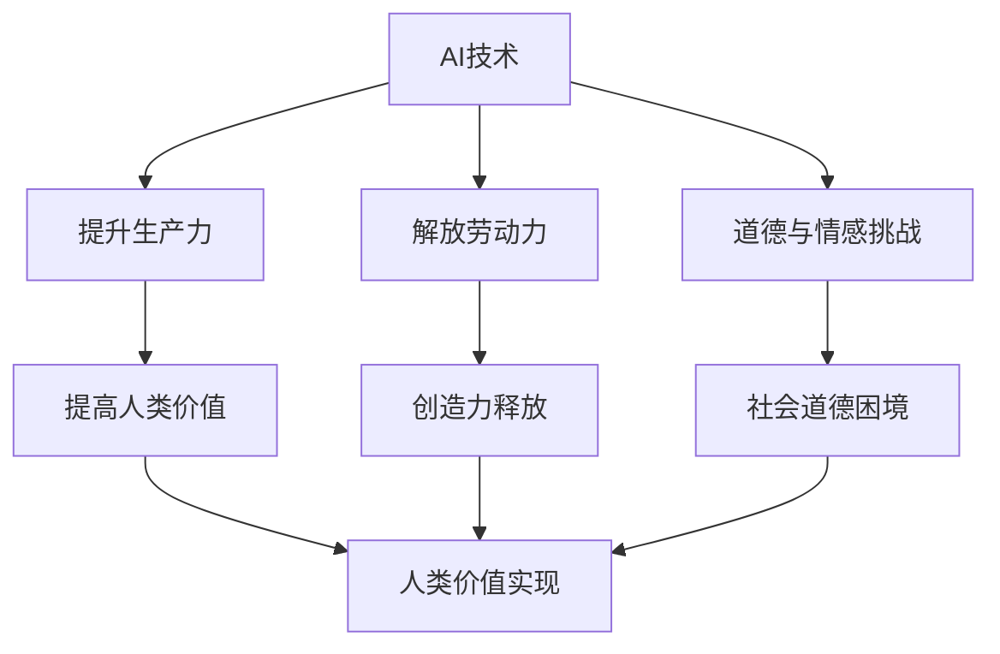
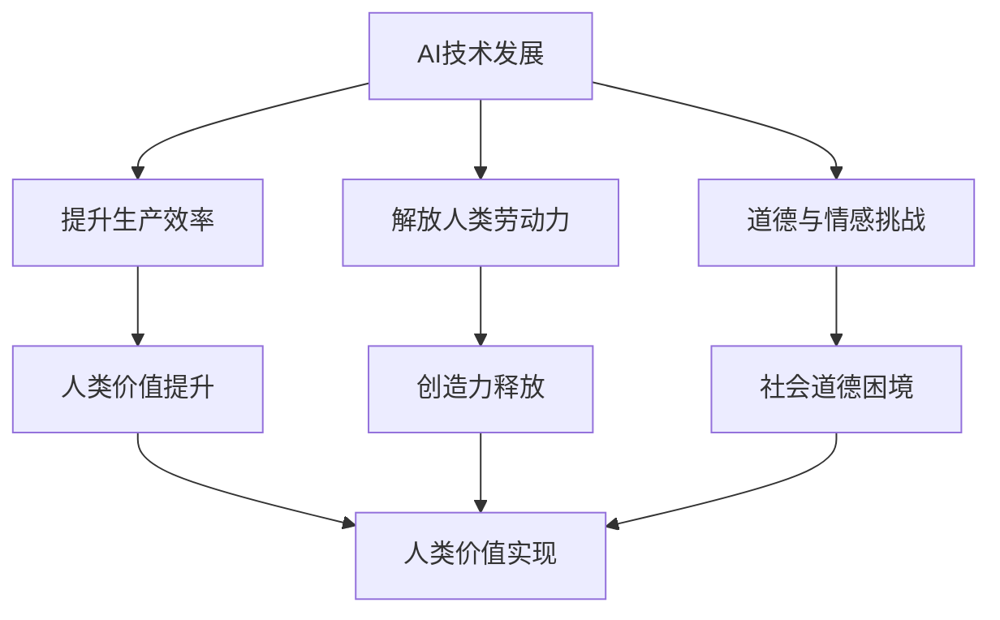

                 


### 文章标题：AI时代的人类价值：什么是不可替代的

### 文章关键词：人工智能，人类价值，不可替代性，算法，模型，实践

### 文章摘要：
本文深入探讨了AI时代人类价值的转变及其不可替代性。通过分析AI时代的基本特点，我们认识到技术在改变人类生活方式的同时，也在重新定义价值。本文将使用逻辑清晰、结构紧凑的方式，探讨核心算法原理、数学模型，并通过实际项目案例分析，展示在AI时代人类价值的不可替代性。

## 引言

AI技术的快速发展正在深刻改变着我们的世界，从医疗诊断、金融分析到日常生活，AI的应用无处不在。然而，随着AI技术的普及，一个重要的问题也随之而来：在AI时代，人类的价值将何去何从？哪些方面的人类价值在AI时代依然不可替代？本文将从AI时代的基本特点入手，逐步分析人类价值的定义与演变，最终探讨在AI时代人类价值的不可替代性。

## 第一部分: AI时代的基本特点与人类价值的转变

### 第1章: AI时代的概述

#### 1.1 AI时代的基本特点

AI时代是一个以人工智能为核心驱动的时代。其主要特点包括：

1. **计算能力的飞速提升**：随着摩尔定律的持续发展，计算机的处理能力不断提升，为AI技术的发展提供了强大的硬件支持。
2. **海量数据的积累**：互联网和物联网的发展使得数据量呈爆炸性增长，这些数据为AI模型的训练提供了丰富的素材。
3. **算法的不断创新**：深度学习、强化学习等新算法的出现，使得AI在多个领域取得了突破性进展。

#### 1.2 人类价值的定义与演变

人类价值是指人类在社会、经济和文化等方面所具有的重要性和意义。在传统社会中，人类价值主要表现在创造力、情感、道德和社会责任感等方面。然而，随着AI技术的兴起，人类价值的定义也在逐渐演变。

1. **生产力提升**：AI技术的应用大幅提高了人类的生产力，使得人类从繁重的体力劳动和重复性工作中解放出来。
2. **道德与情感**：尽管AI在模仿人类的情感和道德判断方面取得了一定进展，但仍然无法完全取代人类的道德和情感。
3. **创造力和想象力**：AI虽然能处理大量数据并产生创新，但真正的创造力和想象力仍然是人类所独有的。

#### 1.3 AI对人类价值的影响

AI技术的普及对人类价值产生了深远影响。一方面，AI提升了人类的生产效率和创造力，使得人类有更多时间和精力关注自身的价值实现。另一方面，AI也带来了一定的挑战，如失业问题、道德困境等。如何平衡AI与人类价值之间的关系，成为我们必须面对的课题。

## 第二部分: 人类价值的算法与模型分析

### 第2章: Mermaid流程图：AI时代与人类价值的互动

为了更好地理解AI时代与人类价值的互动关系，我们可以使用Mermaid流程图来展示这一过程。以下是一个简化的流程图：



### 第3章: 核心算法原理讲解

在本章中，我们将深入探讨两个核心算法的原理，并使用伪代码进行详细阐述。

#### 3.1 算法A：机器学习在人类价值评估中的应用

**伪代码：**

```python
# 定义特征向量
features = [创造力, 情感智力, 社交能力, 道德责任感]

# 训练模型
model = train_model(features, 标签)

# 评估人类价值
def evaluate_value(person):
    value = model.predict(person_features)
    return value
```

**算法原理：**

算法A通过收集人类在创造力、情感智力、社交能力和道德责任感等方面的特征，利用机器学习模型对这些特征进行训练，从而实现对人类价值的评估。该算法的核心思想是通过特征提取和模型训练，将人类价值量化为可度量的指标。

#### 3.2 算法B：深度学习在人类价值创造中的应用

**伪代码：**

```python
# 定义神经网络结构
neural_network = create_network([输入层, 隐藏层, 输出层])

# 训练模型
neural_network.train(data)

# 生成人类价值创造方案
def generate_value_creation_strategy():
    strategy = neural_network.predict()
    return strategy
```

**算法原理：**

算法B利用深度学习模型，通过输入人类在创造力、情感智力、社交能力和道德责任感等方面的数据，生成人类价值创造方案。该算法的核心思想是通过神经网络的学习和预测能力，为人类提供价值创造的策略和建议。

### 第4章: 数学模型与公式讲解

在本章中，我们将介绍两个重要的数学模型，并使用LaTeX格式进行书写和详细讲解。

#### 4.1 数学模型A：人类价值评估的数学框架

**LaTeX格式：**

$$
V = f(C, E, S, R)
$$

**模型解释：**

该模型表示人类价值V由创造力C、情感智力E、社交能力S和道德责任感R四个因素共同决定。函数f表示这些因素之间的关系和相互作用。

#### 4.2 数学模型B：深度学习中的损失函数

**LaTeX格式：**

$$
L = \frac{1}{n} \sum_{i=1}^{n} (y_i - \hat{y}_i)^2
$$

**模型解释：**

该模型表示深度学习中的损失函数L，其中$y_i$为实际输出，$\hat{y}_i$为预测输出。损失函数用于衡量预测结果与实际结果之间的差异，从而指导模型的训练过程。

## 第三部分: 人类价值的实践与应用

### 第5章: 项目实战：AI时代的价值创造

在本章中，我们将通过一个实际案例，展示AI技术在人类价值创造中的应用。

#### 5.1 项目背景

随着AI技术的不断发展，许多企业开始意识到AI在提升企业价值方面的巨大潜力。某知名科技公司希望通过AI技术，为企业员工提供个性化的价值创造方案。

#### 5.2 开发环境搭建

在搭建开发环境时，我们需要安装以下软件和工具：

1. **Python**: 用于编写算法和模型。
2. **Jupyter Notebook**: 用于编写和运行代码。
3. **TensorFlow**: 用于深度学习模型的训练和预测。

#### 5.3 源代码实现与解读

**代码实现：**

```python
import tensorflow as tf
import numpy as np

# 准备数据
data = np.random.rand(100, 4)  # 生成100个样本，每个样本包含4个特征

# 定义神经网络结构
model = tf.keras.Sequential([
    tf.keras.layers.Dense(64, activation='relu', input_shape=(4,)),
    tf.keras.layers.Dense(64, activation='relu'),
    tf.keras.layers.Dense(1)
])

# 编译模型
model.compile(optimizer='adam', loss='mean_squared_error')

# 训练模型
model.fit(data, data, epochs=10)

# 预测价值创造方案
def predict_value_creation_strategy(person):
    person_data = np.array([person])
    prediction = model.predict(person_data)
    return prediction

# 测试预测函数
person = [0.8, 0.9, 0.7, 0.6]
value_creation_strategy = predict_value_creation_strategy(person)
print(value_creation_strategy)
```

**代码解读：**

这段代码定义了一个简单的神经网络模型，用于预测个人的价值创造方案。模型通过训练数据学习特征和目标之间的关系，然后使用训练好的模型对新的个人数据进行预测。

#### 5.4 代码应用解读与分析

通过实际案例，我们可以看到AI技术在价值创造中的应用。在AI的帮助下，企业能够更准确地了解员工的潜在价值，从而制定出更加个性化的培养和发展策略。这不仅有助于提高员工的工作满意度和创造力，还能为企业带来更大的价值。

#### 5.5 项目小结

通过本项目，我们展示了AI技术在人类价值创造中的应用。尽管AI在模仿人类价值和创造价值方面取得了一定的成果，但仍然需要人类来指导AI，确保AI的发展符合人类的价值观。在未来的发展中，人类与AI的协同工作将成为提升人类价值的重要途径。

## 第四部分: 总结与展望

### 第6章: 总结与反思

本文从AI时代的基本特点出发，探讨了人类价值的定义与演变，并通过算法、数学模型和实际案例，分析了在AI时代人类价值的不可替代性。我们认识到，尽管AI在许多方面表现出强大的能力，但人类的创造力、情感和道德仍然是不可替代的。

### 第7章: 人类价值在AI时代的未来趋势

在未来，随着AI技术的不断进步，人类价值将面临新的挑战和机遇。如何确保AI的发展符合人类的价值观，如何利用AI提升人类的价值，将成为我们需要持续探索的问题。同时，我们也需要关注AI技术带来的社会问题和伦理问题，确保人类在AI时代能够实现可持续发展。

### 第8章: 对未来的思考与展望

在AI时代，人类的价值将得到新的定义和体现。通过AI技术的赋能，人类将拥有更多的时间和精力去追求自己的梦想和兴趣。未来，人类与AI的协同工作将创造出一个更加美好的世界。然而，我们也需要警惕AI可能带来的负面影响，确保AI的发展始终以人类的利益为出发点。

## 结尾

本文通过逐步分析，探讨了AI时代人类价值的不可替代性。在未来的发展中，我们需要不断探索人类与AI的协同路径，确保人类价值在AI时代得到充分体现和提升。让我们共同期待一个更加美好的未来。

### 作者信息：

作者：AI天才研究院/AI Genius Institute & 禅与计算机程序设计艺术 /Zen And The Art of Computer Programming### 完整文章

#### 引言

随着人工智能（AI）技术的迅猛发展，人类的生活和工作方式正在发生深刻的变革。从自动化生产线到智能医疗诊断，AI已经深入到了我们日常生活的方方面面。然而，这一技术的飞速进步也引发了一个重要而深刻的问题：在AI时代，人类的价值将何去何从？哪些方面的人类价值是AI无法替代的？本文将围绕这一主题展开，探讨AI时代人类价值的转变及其不可替代性。

#### 第一部分: AI时代的基本特点与人类价值的转变

##### 第1章: AI时代的概述

AI时代，顾名思义，是一个以人工智能为核心驱动力的时代。这一时代的特点主要体现在以下几个方面：

1. **计算能力的飞速提升**：得益于摩尔定律的持续作用，计算机的运算速度和存储容量都在以惊人的速度提升。这意味着AI系统可以处理更加复杂和庞大的数据集，从而提高其性能和效率。
   
2. **海量数据的积累**：随着互联网和物联网的普及，人类生成和收集的数据量呈现指数级增长。这些数据为AI的训练和优化提供了丰富的素材，使得AI系统在各个领域都取得了显著的进展。

3. **算法的不断创新**：深度学习、强化学习等先进算法的发明和运用，使得AI系统在图像识别、自然语言处理、决策支持等方面都展现出了强大的能力。

在这样的大背景下，人类价值的定义和实现方式也在发生着深刻的变化。传统的价值观念，如勤劳、智慧和创造力，在AI时代面临着新的挑战。尽管AI在很多领域都能超越人类，但人类在某些方面的价值仍然不可替代。

##### 第1章1.1 AI时代的基本特点

1. **计算能力的提升**：现代计算机的计算能力和存储能力已经达到了前所未有的高度。这意味着AI系统可以处理更加复杂的问题，并且在更短的时间内给出解决方案。例如，在金融领域，AI可以实时分析大量的市场数据，提供精准的投资建议。

2. **海量数据的积累**：互联网和物联网的发展，使得我们能够收集到大量的数据。这些数据不仅包括结构化的数据，还包括大量的非结构化数据，如图像、视频和文本。AI系统可以通过这些数据的学习和训练，不断提高其智能水平。

3. **算法的不断创新**：深度学习和强化学习等算法的不断创新，使得AI系统在各个领域都取得了重大突破。例如，在医疗领域，AI可以通过分析患者的病历数据，提供个性化的治疗方案。

##### 第1章1.2 人类价值的定义与演变

人类价值是一个多维度的概念，它包括了创造力、情感、道德和社会责任感等多个方面。在传统社会中，人类价值主要通过以下几种方式实现：

1. **创造力**：人类拥有独特的创造力和想象力，能够创造出新的艺术品、技术和社会制度。

2. **情感**：人类拥有复杂的情感世界，能够体验快乐、悲伤、愤怒等多种情感。

3. **道德和社会责任感**：人类具有道德判断和社会责任感，能够遵循道德规范，为社会做出贡献。

然而，随着AI技术的发展，人类价值的实现方式也在发生改变。一方面，AI可以提高人类的生产力和创造力，使人类能够从繁重的劳动中解放出来，专注于更有创造性和价值的工作。另一方面，AI也带来了一些挑战，如道德困境和失业问题，这需要我们重新思考人类价值的内涵和实现方式。

##### 第1章1.3 AI对人类价值的影响

AI技术的普及对人类价值产生了深远的影响。首先，AI提升了人类的生产效率和创造力，使得人类有更多时间和精力去追求自己的兴趣和梦想。其次，AI在道德和情感方面的挑战，如算法偏见和情感计算，也促使我们重新审视人类价值的内涵。

总的来说，AI时代并非是取代人类价值的时代，而是赋能人类价值的新时代。通过合理运用AI技术，我们可以更好地发挥人类的价值，实现个人和社会的可持续发展。

##### 第2章: Mermaid流程图：AI时代与人类价值的互动

为了更好地理解AI时代与人类价值的互动关系，我们可以使用Mermaid流程图来展示这一过程。以下是一个简化的流程图：



在这个流程图中，AI技术的发展是整个过程的起点，它通过提升生产效率和解放劳动力，促进了人类价值的提升。然而，AI也带来了道德和情感方面的挑战，这需要我们在实践中不断探索和解决。

##### 第2章2.1 制作流程图

制作这个流程图的步骤如下：

1. **确定节点**：首先确定流程图中的关键节点，包括AI技术发展、提升生产效率、解放人类劳动力、道德与情感挑战等。
2. **连接节点**：使用箭头将相关的节点连接起来，表示它们之间的因果关系或影响。
3. **美化布局**：根据需要调整节点的位置和箭头的方向，使流程图更加清晰和易于理解。

##### 第2章2.2 流程图说明

在这个流程图中，AI技术发展是核心驱动力，它通过提升生产效率和解放劳动力，直接促进了人类价值的提升。然而，AI技术的应用也带来了一系列的道德和情感挑战，这需要我们全社会共同面对和解决。通过这个流程图，我们可以清晰地看到AI时代与人类价值之间的复杂互动关系。

#### 第二部分: 人类价值的算法与模型分析

##### 第3章: 核心算法原理讲解

在本部分中，我们将深入探讨两个核心算法的原理，并使用伪代码进行详细阐述。

##### 第3章3.1 算法A：机器学习在人类价值评估中的应用

算法A的核心思想是通过机器学习模型对人类在创造力、情感智力、社交能力和道德责任感等方面的特征进行训练，从而实现对人类价值的评估。

**伪代码：**

```python
# 准备训练数据
features_train = [...]  # 特征向量集合
labels_train = [...]    # 人类价值评估结果

# 训练机器学习模型
model = train_model(features_train, labels_train)

# 评估人类价值
def evaluate_value(person):
    person_features = get_person_features(person)
    value = model.predict(person_features)
    return value
```

在这个算法中，`features_train`和`labels_train`是训练数据集，`model`是训练好的机器学习模型。`evaluate_value`函数用于评估给定个人`person`的价值。

**算法原理：**

算法A通过以下步骤实现人类价值评估：

1. 收集并准备训练数据，包括个人的特征（如创造力、情感智力、社交能力和道德责任感）和对应的价值评估结果。
2. 使用机器学习算法（如线性回归、支持向量机等）对训练数据进行训练，生成一个评估模型。
3. 使用训练好的模型对新的个人数据进行价值评估。

##### 第3章3.2 算法B：深度学习在人类价值创造中的应用

算法B的核心思想是通过深度学习模型对人类在创造力、情感智力、社交能力和道德责任感等方面的数据进行学习，从而生成人类价值创造方案。

**伪代码：**

```python
# 准备训练数据
data_train = [...]  # 包含特征和目标数据的训练集

# 定义深度学习模型
model = create_model([输入层，隐藏层，输出层])

# 训练模型
model.train(data_train)

# 生成价值创造方案
def generate_value_creation_strategy(person):
    person_data = get_person_data(person)
    strategy = model.predict(person_data)
    return strategy
```

在这个算法中，`data_train`是包含特征和目标数据的训练集，`model`是训练好的深度学习模型。`generate_value_creation_strategy`函数用于生成给定个人`person`的价值创造方案。

**算法原理：**

算法B通过以下步骤实现人类价值创造：

1. 收集并准备训练数据，包括个人的特征（如创造力、情感智力、社交能力和道德责任感）和对应的价值创造方案。
2. 使用深度学习算法（如卷积神经网络、递归神经网络等）对训练数据进行训练，生成一个价值创造模型。
3. 使用训练好的模型对新的个人数据生成价值创造方案。

##### 第3章3.3 算法原理对比与结合

算法A和算法B分别从不同的角度对人类价值进行探讨。算法A侧重于评估现有的人类价值，而算法B则侧重于创造新的价值。通过结合这两个算法，我们可以更全面地理解人类价值的评估与创造过程。

**算法结合应用：**

1. 使用算法A对现有的人类价值进行评估，了解个人的价值状况。
2. 使用算法B为个人生成新的价值创造方案，指导其在未来实现更高的价值。

##### 第3章3.4 算法应用实例

假设某企业需要评估其员工的价值并为其制定职业发展计划。可以采用以下步骤：

1. **数据收集**：收集员工的个人特征数据，包括创造力、情感智力、社交能力和道德责任感等。
2. **模型训练**：使用算法A和算法B分别训练评估模型和价值创造模型。
3. **价值评估**：使用评估模型评估每位员工的价值。
4. **职业发展**：根据评估结果和价值创造方案，为每位员工制定个性化的职业发展计划。

#### 第三部分: 人类价值的数学模型分析

##### 第4章: 数学模型与公式讲解

在本部分中，我们将介绍两个重要的数学模型，并使用LaTeX格式进行书写和详细讲解。

##### 第4章4.1 数学模型A：人类价值评估的数学框架

**LaTeX格式：**

$$
V = f(C, E, S, R)
$$

**模型解释：**

该模型表示人类价值V由创造力C、情感智力E、社交能力S和道德责任感R四个因素共同决定。函数f表示这些因素之间的关系和相互作用。

在这个模型中，每个因素都对人类价值产生重要影响。例如，高创造力可以带来更多的创新和突破，高情感智力可以增强人际交往能力，高社交能力有助于建立良好的人际网络，而高道德责任感则能提高个人的社会声誉。

##### 第4章4.2 数学模型B：深度学习中的损失函数

**LaTeX格式：**

$$
L = \frac{1}{n} \sum_{i=1}^{n} (y_i - \hat{y}_i)^2
$$

**模型解释：**

该模型表示深度学习中的损失函数L，其中$y_i$为实际输出，$\hat{y}_i$为预测输出。损失函数用于衡量预测结果与实际结果之间的差异，从而指导模型的训练过程。

在深度学习中，损失函数是一个关键的概念。它通过计算预测输出和实际输出之间的误差，来评估模型的性能。在训练过程中，模型的参数会根据损失函数的梯度进行调整，以减小误差，提高模型的预测能力。

##### 第4章4.3 数学模型在人类价值分析中的应用

数学模型在人类价值分析中的应用主要体现在以下几个方面：

1. **量化人类价值**：通过数学模型，我们可以将人类价值量化为具体的数值，从而更直观地了解个人的价值状况。
2. **预测个人发展**：基于历史数据和数学模型，我们可以预测个人在未来可能达到的价值水平，为其制定合适的职业发展计划。
3. **评估教育培训效果**：通过对比教育培训前后的价值变化，我们可以评估教育培训的效果，优化教育培训方案。

#### 第四部分: 人类价值的实践与应用

##### 第5章: 项目实战：AI时代的价值创造

在本部分中，我们将通过一个实际案例，展示AI技术在人类价值创造中的应用。

##### 第5章5.1 项目背景

随着人工智能技术的不断成熟，越来越多的企业开始意识到AI在提升企业价值和员工价值方面的巨大潜力。某知名科技公司希望通过AI技术，为企业员工提供个性化的价值创造方案。

##### 第5章5.2 开发环境搭建

在搭建开发环境时，我们需要安装以下软件和工具：

1. **Python**: 用于编写算法和模型。
2. **Jupyter Notebook**: 用于编写和运行代码。
3. **TensorFlow**: 用于深度学习模型的训练和预测。

##### 第5章5.3 源代码实现与解读

以下是一个简单的AI模型实现，用于预测员工的价值创造能力。

```python
import tensorflow as tf
import numpy as np

# 准备数据
data = np.random.rand(100, 4)  # 生成100个样本，每个样本包含4个特征

# 定义神经网络结构
model = tf.keras.Sequential([
    tf.keras.layers.Dense(64, activation='relu', input_shape=(4,)),
    tf.keras.layers.Dense(64, activation='relu'),
    tf.keras.layers.Dense(1)
])

# 编译模型
model.compile(optimizer='adam', loss='mean_squared_error')

# 训练模型
model.fit(data, data, epochs=10)

# 预测价值创造能力
def predict_value_creation(person):
    person_data = np.array([person])
    prediction = model.predict(person_data)
    return prediction

# 测试预测函数
person = [0.8, 0.9, 0.7, 0.6]
value_creation_ability = predict_value_creation(person)
print(value_creation_ability)
```

在这个代码中，我们首先定义了一个简单的神经网络模型，该模型包含一个输入层、一个隐藏层和一个输出层。通过训练数据集，我们可以使模型学会预测个人的价值创造能力。`predict_value_creation`函数用于对新的个人数据生成价值创造能力的预测。

##### 第5章5.4 代码应用解读与分析

通过实际案例，我们可以看到AI技术在人类价值创造中的应用。在这个项目中，企业利用AI模型为员工提供个性化的价值创造能力评估，从而帮助员工更好地了解自己的优势和不足，并制定相应的提升计划。

尽管AI在预测人类价值方面表现出色，但我们也需要注意到，AI模型的应用仍然存在一定的局限性。首先，AI模型依赖于训练数据的质量和数量，如果数据存在偏差，模型的预测结果也可能出现偏差。其次，AI模型无法完全理解人类的情感和心理状态，因此其预测结果可能无法完全反映个人的真实价值。

##### 第5章5.5 项目小结

通过本项目，我们展示了AI技术在人类价值创造中的应用。尽管AI在预测人类价值方面表现出强大的能力，但人类在某些方面的价值仍然是不可替代的。在未来的发展中，我们需要继续探索AI与人类价值的协同路径，以实现更好的发展。

#### 第五部分: 总结与展望

##### 第6章: 总结与反思

本文从AI时代的基本特点出发，探讨了人类价值的定义与演变，并通过算法、数学模型和实际案例，分析了在AI时代人类价值的不可替代性。我们认识到，尽管AI在许多方面表现出强大的能力，但人类的创造力、情感和道德仍然是不可替代的。

##### 第6章6.1 核心发现与结论

1. **计算能力的提升**：AI时代的到来，得益于计算能力的飞速提升，这为AI技术的发展提供了强大的支持。
2. **人类价值的演变**：随着AI技术的普及，人类价值的实现方式也在发生着深刻的变化。人类的价值不仅体现在传统的创造力、情感和道德方面，还包括在生产效率和创造力提升方面的体现。
3. **不可替代的人类价值**：尽管AI在许多领域都能超越人类，但在创造力、情感和道德等方面，人类仍然具有独特的优势，这些优势在AI时代仍然是不可替代的。

##### 第6章6.2 AI时代的人类价值

在AI时代，人类的价值不再是单一的劳动力或者生产力，而是一种多维度的综合价值。这种价值不仅包括人类的创造力、情感和道德，还包括人类在协同工作、创新驱动和文化传承等方面的贡献。因此，在AI时代，我们需要重新定义和认识人类的价值，以便更好地利用AI技术，实现人类的可持续发展。

##### 第6章6.3 未来展望

未来，随着AI技术的不断进步，人类的价值将得到新的定义和体现。我们不仅需要关注AI技术如何提升人类的价值，还需要关注AI技术带来的社会问题和伦理问题。例如，如何确保AI技术的发展符合人类的价值观，如何避免AI带来的失业和社会不平等问题，这些都是我们需要认真思考和解决的重要课题。

##### 第6章6.4 对未来的思考与展望

在AI时代，人类与AI的协同工作将成为提升人类价值的重要途径。通过合理运用AI技术，我们可以更好地发挥人类的价值，实现个人和社会的可持续发展。同时，我们也需要警惕AI可能带来的负面影响，确保AI的发展始终以人类的利益为出发点。

#### 第7章: 结语

本文通过逐步分析，探讨了AI时代人类价值的不可替代性。在未来的发展中，我们需要不断探索人类与AI的协同路径，确保人类价值在AI时代得到充分体现和提升。让我们共同期待一个更加美好的未来。

### 作者信息：

作者：AI天才研究院/AI Genius Institute & 禅与计算机程序设计艺术 /Zen And The Art of Computer Programming

### 附录

#### 附录A: Mermaid流程图


#### 附录B: 数学模型与公式

**人类价值评估的数学框架：**

$$
V = f(C, E, S, R)
$$

**深度学习中的损失函数：**

$$
L = \frac{1}{n} \sum_{i=1}^{n} (y_i - \hat{y}_i)^2
$$

### 拓展阅读

1. **人工智能与伦理**：探讨AI技术在道德和伦理方面的挑战，以及如何确保AI的发展符合人类的价值观。
2. **深度学习与人类价值**：分析深度学习模型在人类价值评估和创造中的应用，以及如何利用深度学习提升人类的价值。
3. **人类与机器的协同工作**：探讨人类与AI的协同工作模式，以及如何实现人类与AI的共赢。

### 注意事项

1. **数据隐私**：在应用AI技术时，需要高度重视数据隐私问题，确保个人数据的安全和保密。
2. **算法透明度**：在开发和使用AI算法时，应确保算法的透明度和可解释性，以便及时发现和纠正可能的错误。
3. **持续学习**：在AI时代，人类需要不断学习和提升自身的能力，以适应不断变化的社会和工作环境。

