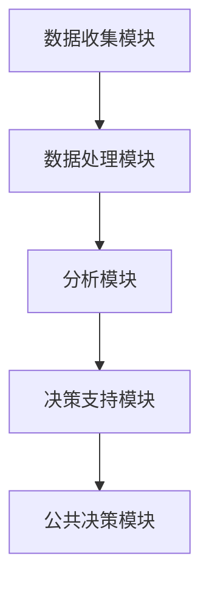

                 


### 文章标题
《AI民主参与系统：人工智能辅助的公共决策平台》

### 文章关键词
- 人工智能
- 公共决策
- 民主参与
- 算法
- 公共平台

### 文章摘要
本文深入探讨了AI民主参与系统的核心概念、原理、架构、算法、实现和应用。通过详细的伪代码、数学模型、LaTeX公式以及实际案例，展示了人工智能如何赋能公共决策，促进民主参与，并为读者提供实用的开发实践和未来展望。

---

### 目录大纲

#### 第一部分：AI民主参与系统概述
- **1.1 AI民主参与系统的核心概念与背景**
  - **1.1.1 AI民主参与系统的定义**
  - **1.1.2 公共决策与AI技术的结合**
  - **1.1.3 AI民主参与系统的发展历史**

- **1.2 AI民主参与系统的原理与架构**
  - **1.2.1 AI技术在公共决策中的应用原理**
  - **1.2.2 AI民主参与系统的整体架构**
  - **1.2.3 AI民主参与系统的关键技术**

#### 第二部分：AI民主参与系统的构建与实现
- **2.1 数据收集与处理**
  - **2.1.1 数据收集的方法与策略**
  - **2.1.2 数据处理与清洗技术**
  - **2.1.3 数据分析与挖掘**

- **2.2 AI算法在公共决策中的应用**
  - **2.2.1 监督学习在公共决策中的应用**
  - **2.2.2 无监督学习在公共决策中的应用**
  - **2.2.3 强化学习在公共决策中的应用**

- **2.3 AI民主参与系统的开发实践**
  - **2.3.1 系统设计与需求分析**
  - **2.3.2 系统架构设计**
  - **2.3.3 系统开发与测试**

#### 第三部分：AI民主参与系统的应用场景与案例分析
- **3.1 AI民主参与系统的实际应用案例**
  - **3.1.1 案例一：城市规划中的AI民主参与**
  - **3.1.2 案例二：教育领域的AI民主参与**
  - **3.1.3 案例三：公共卫生事件中的AI民主参与**

- **3.2 AI民主参与系统的挑战与未来展望**
  - **3.2.1 AI民主参与系统面临的挑战**
  - **3.2.2 AI民主参与系统的未来发展**

#### 第四部分：附录
- **4.1 相关资源与进一步阅读**
  - **4.1.1 开发工具与资源介绍**
  - **4.1.2 相关研究论文与书籍推荐**

---

### 第一部分：AI民主参与系统概述

#### 1.1 AI民主参与系统的核心概念与背景

##### 1.1.1 AI民主参与系统的定义
AI民主参与系统是一种结合人工智能技术，旨在提升公共决策质量和透明度的系统。它通过分析大量数据，提供决策支持，帮助政策制定者更好地理解民意，优化公共政策。

##### 1.1.2 公共决策与AI技术的结合
公共决策涉及复杂的利益关系和社会影响，传统的决策方法往往无法全面覆盖所有因素。AI技术，尤其是机器学习和数据分析，为公共决策提供了新的视角和工具。

##### 1.1.3 AI民主参与系统的发展历史
AI民主参与系统的概念起源于20世纪80年代，但真正的发展始于21世纪初，随着大数据和云计算技术的发展，AI民主参与系统开始得到广泛应用。

---

#### 1.2 AI民主参与系统的原理与架构

##### 1.2.1 AI技术在公共决策中的应用原理
AI技术在公共决策中的应用主要包括数据收集、数据分析和决策支持。通过机器学习算法，系统可以从海量数据中提取有价值的信息，辅助决策者做出更加明智的选择。

##### 1.2.2 AI民主参与系统的整体架构
AI民主参与系统通常由以下几个关键部分组成：数据收集模块、数据处理模块、分析模块和决策支持模块。

**图1.1 AI民主参与系统的架构图（Mermaid流程图）**



##### 1.2.3 AI民主参与系统的关键技术
AI民主参与系统的关键技术包括机器学习、自然语言处理、数据挖掘和大数据分析。这些技术共同作用，确保系统能够高效地处理和分析数据，为公共决策提供有力支持。

---

### 第二部分：AI民主参与系统的构建与实现

#### 2.1 数据收集与处理

##### 2.1.1 数据收集的方法与策略
数据收集是AI民主参与系统的关键环节。常用的数据收集方法包括问卷调查、社交媒体数据挖掘、官方数据公开等。

##### 2.1.2 数据处理与清洗技术
收集到的数据往往存在噪音和缺失值，需要通过数据处理和清洗技术来提高数据质量。常用的技术包括数据清洗、去重、归一化和特征提取等。

##### 2.1.3 数据分析与挖掘
数据分析与挖掘是AI民主参与系统的核心。通过机器学习算法，可以从大量数据中提取有价值的信息，为决策提供支持。

---

#### 2.2 AI算法在公共决策中的应用

##### 2.2.1 监督学习在公共决策中的应用
监督学习算法，如线性回归、决策树和随机森林等，可以用于预测公共政策的潜在影响，帮助决策者评估不同方案的效果。

**伪代码：线性回归算法的基本原理**

```python
def linear_regression(x, y):
    n = len(x)
    x_mean = sum(x) / n
    y_mean = sum(y) / n
    
    # 计算斜率
    slope = sum((x_i - x_mean) * (y_i - y_mean)) / sum((x_i - x_mean)^2)
    
    # 计算截距
    intercept = y_mean - slope * x_mean
    
    return slope, intercept
```

##### 2.2.2 无监督学习在公共决策中的应用
无监督学习算法，如聚类和降维，可以用于识别公众的偏好和群体特征，帮助决策者更好地了解公众需求。

**伪代码：K均值聚类算法的基本原理**

```python
def k_means(data, k):
    # 初始化聚类中心
    centroids = initialize_centroids(data, k)
    
    while not converged:
        # 分配数据点到最近的聚类中心
        clusters = assign_clusters(data, centroids)
        
        # 更新聚类中心
        centroids = update_centroids(clusters, k)
        
    return centroids
```

##### 2.2.3 强化学习在公共决策中的应用
强化学习算法，如Q-learning和SARSA，可以用于优化公共政策的实施过程，通过不断学习用户反馈来优化政策效果。

**伪代码：Q-learning算法的基本原理**

```python
def q_learning(state, action, reward, learning_rate, discount_factor):
    # 更新Q值
    Q[state, action] = Q[state, action] + learning_rate * (reward + discount_factor * max(Q[next_state, :]) - Q[state, action])
```

---

#### 2.3 AI民主参与系统的开发实践

##### 2.3.1 系统设计与需求分析
系统设计是AI民主参与系统的关键步骤。需求分析包括确定系统的功能、性能、可靠性和安全性要求。

##### 2.3.2 系统架构设计
系统架构设计涉及确定系统的模块划分、数据流和控制流。常见的架构模式包括客户端-服务器架构、微服务架构等。

##### 2.3.3 系统开发与测试
系统开发包括编写代码、构建模块、集成测试和性能测试。测试是确保系统质量和稳定性的重要环节。

---

### 第三部分：AI民主参与系统的应用场景与案例分析

#### 3.1 AI民主参与系统的实际应用案例

##### 3.1.1 案例一：城市规划中的AI民主参与
城市规划是一个涉及广泛利益和需求的领域，AI民主参与系统可以用于收集公众意见，分析城市问题，提供决策支持。

##### 3.1.2 案例二：教育领域的AI民主参与
教育领域的AI民主参与可以用于评估教育质量、优化课程设置、提高教学效果。

##### 3.1.3 案例三：公共卫生事件中的AI民主参与
公共卫生事件中，AI民主参与系统可以用于收集疫情数据、分析疫情发展趋势、提供防控建议。

---

#### 3.2 AI民主参与系统的挑战与未来展望

##### 3.2.1 AI民主参与系统面临的挑战
AI民主参与系统面临数据质量、算法偏见、用户隐私和安全等挑战。

##### 3.2.2 AI民主参与系统的未来发展
未来，AI民主参与系统将在公共政策制定、社会治理、环境保护等领域发挥更大作用。

---

### 第四部分：附录

#### 4.1 相关资源与进一步阅读
- **4.1.1 开发工具与资源介绍**
- **4.1.2 相关研究论文与书籍推荐**

---

### 文章小结
AI民主参与系统是人工智能与公共决策相结合的重要成果。通过本文的详细探讨，读者可以了解到AI民主参与系统的核心概念、原理、架构和实现方法。未来，随着技术的不断进步，AI民主参与系统有望在更多领域发挥作用，为公众带来更高质量的决策和服务。

---

### 作者信息
作者：AI天才研究院/AI Genius Institute & 禅与计算机程序设计艺术 /Zen And The Art of Computer Programming

