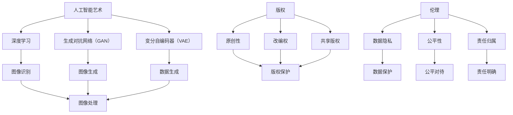

                 


## 文章标题
### AI艺术合作伦理：人机创作的版权新论

> 关键词：人工智能艺术、合作伦理、版权、人机创作、算法原理、数学模型、项目实战、法律分析、未来展望

> 摘要：
本文探讨了人工智能艺术创作中合作伦理和版权问题的新视角。首先，介绍了人工智能艺术的基本概念和背景，然后分析了人机合作中涉及的关键概念及其关系。接下来，详细讲解了人工智能艺术创作中的核心算法原理和数学模型，并使用伪代码和LaTeX格式进行了说明。随后，通过实际案例展示了人机艺术创作中的版权问题，并进行了代码解读与分析。最后，本文探讨了人工智能艺术合作伦理的挑战与解决方案，并对未来发展进行了展望。

## 引言与背景

在过去的几十年里，人工智能（AI）技术取得了飞速的发展，不仅改变了各行各业的生产方式，也颠覆了传统艺术创作的模式。随着深度学习、生成对抗网络（GAN）和变分自编码器（VAE）等核心算法的突破，人工智能艺术创作逐渐成为可能。从简单的图像生成到复杂的音乐创作，人工智能已经展现出强大的艺术表现力。

然而，随着人工智能艺术创作的兴起，版权和伦理问题也日益凸显。人机合作的本质使得传统版权观念面临挑战，艺术家和创作者的权利如何得到保障成为亟待解决的问题。同时，人工智能艺术创作过程中涉及的数据隐私、道德伦理等问题也需要深入探讨。

本文旨在探讨人工智能艺术合作伦理和版权问题的新论点。首先，我们将介绍人工智能艺术的基本概念和背景，包括其发展历程、核心算法和代表性作品。接着，分析人机合作中涉及的关键概念，如人工智能艺术、版权和伦理，并使用Mermaid流程图展示其相互关系。然后，详细讲解人工智能艺术创作中的核心算法原理和数学模型，并使用伪代码和LaTeX格式进行说明。在此基础上，通过实际案例展示人机艺术创作中的版权问题，并进行代码解读与分析。最后，本文将探讨人工智能艺术合作伦理的挑战与解决方案，并对未来发展进行展望。

## 核心概念与联系

在探讨人工智能艺术合作伦理和版权问题时，我们需要先明确以下几个核心概念：人工智能艺术、版权和伦理。以下是这些概念之间的相互关系及Mermaid流程图展示：

### 人工智能艺术

人工智能艺术是指通过人工智能技术创作的艺术作品，包括图像、音乐、视频等多种形式。其核心在于利用深度学习、生成对抗网络（GAN）、变分自编码器（VAE）等算法生成或处理艺术内容。以下是几个代表性的概念：

- **深度学习**：一种机器学习技术，通过多层神经网络对大量数据进行训练，从而实现图像识别、语音识别等功能。
- **生成对抗网络（GAN）**：一种由生成器和判别器组成的对抗性网络，旨在通过相互博弈生成逼真的图像、音乐等艺术作品。
- **变分自编码器（VAE）**：一种用于生成数据的自编码器，通过编码器和解码器将数据映射到低维空间，再从低维空间生成高维数据，从而实现艺术作品的创作。

### 版权

版权是指对原创作品的法律保护，确保创作者对其作品享有专有权利，包括复制权、发行权、改编权等。在人工智能艺术创作中，版权问题尤为复杂，因为人机合作使得作品的原创性判断变得更加困难。以下是几个与版权相关的概念：

- **原创性**：作品是否具有独创性，即是否属于个人独立创作，是判断版权的重要依据。
- **改编权**：创作者对作品进行改编、翻译、配乐等二次创作的权利。
- **共享版权**：多个创作者共同创作一个作品时，如何划分和共享版权的问题。

### 伦理

伦理是指道德规范和价值观念，涉及人工智能艺术创作中的数据隐私、公平性、责任归属等问题。以下是几个与伦理相关的概念：

- **数据隐私**：在人工智能艺术创作过程中，如何保护个人数据隐私，避免数据泄露和滥用。
- **公平性**：在人工智能艺术创作中，如何确保不同群体和个体的权益得到公平对待。
- **责任归属**：在人工智能艺术创作中，如何界定创作者、艺术家和人工智能系统之间的责任。

以下是核心概念的Mermaid流程图：



通过上述流程图，我们可以清晰地看到人工智能艺术、版权和伦理之间的相互关系。在接下来的章节中，我们将进一步探讨这些概念，并详细讲解核心算法原理和数学模型。

## 核心算法原理讲解

在人工智能艺术创作中，核心算法起着至关重要的作用。以下我们将详细讲解生成对抗网络（GAN）和变分自编码器（VAE）的原理，并通过伪代码和LaTeX格式展示其算法流程。

### 生成对抗网络（GAN）

生成对抗网络（GAN）由生成器（Generator）和判别器（Discriminator）两个主要部分组成，通过一个对抗性过程生成逼真的艺术作品。

#### 生成器

生成器的目标是生成逼真的艺术作品，使其难以被判别器区分。其基本思路是通过训练生成器生成数据，然后让判别器对生成数据和真实数据进行分类。生成器的目标是最小化其生成数据与真实数据之间的差异，具体流程如下：

1. 输入随机噪声向量 \( z \)
2. 通过生成器 \( G \) 生成伪造的艺术作品 \( x_G \)
3. 计算生成器的损失函数：\( L_G = D(x_G) - \log(D(G(z))) \)

其中，判别器 \( D \) 的目标是最大化其区分真实数据和伪造数据的准确性。

#### 判别器

判别器的目标是判断输入的艺术作品是真实还是伪造。其训练目标是最大化其分类准确性，具体流程如下：

1. 输入真实艺术作品 \( x \) 和伪造艺术作品 \( x_G \)
2. 计算判别器的损失函数：\( L_D = -[\log(D(x)) + \log(1 - D(x_G))] \)

#### GAN总体算法

GAN的训练过程是一个不断迭代的过程，目标是使生成器和判别器在相互对抗中不断优化。总体算法流程如下：

```python
初始化生成器 G 和判别器 D
对于每个训练迭代 t：
    生成随机噪声向量 z
    通过生成器 G 生成伪造的艺术作品 x_G
    计算判别器 D 的损失函数 L_D
    计算生成器 G 的损失函数 L_G
    更新生成器 G 和判别器 D 的参数
```

### 变分自编码器（VAE）

变分自编码器（VAE）是一种用于生成数据的自编码器，通过编码器和解码器将数据映射到低维空间，再从低维空间生成高维数据，从而实现艺术作品的创作。

#### 编码器

编码器的目标是学习数据的高维到低维映射，具体流程如下：

1. 输入艺术作品 \( x \)
2. 通过编码器 \( \mu(x) \) 和 \( \sigma(x) \) 计算均值 \( \mu \) 和方差 \( \sigma \)
3. 生成潜在变量 \( z \)：\( z = \mu + \sigma \cdot \epsilon \)，其中 \( \epsilon \) 是标准正态分布的随机噪声

#### 解码器

解码器的目标是根据潜在变量 \( z \) 生成原始艺术作品 \( x' \)，具体流程如下：

1. 输入潜在变量 \( z \)
2. 通过解码器 \( \phi(z) \) 生成艺术作品 \( x' \)

#### VAE总体算法

VAE的训练过程同样是一个迭代过程，目标是使编码器和解码器在相互协同中不断优化。总体算法流程如下：

```python
初始化编码器 E 和解码器 D
对于每个训练迭代 t：
    输入艺术作品 x
    通过编码器 E 计算均值 μ 和方差 σ
    生成潜在变量 z
    通过解码器 D 生成艺术作品 x'
    计算编码器 E 的损失函数 L_E
    计算解码器 D 的损失函数 L_D
    更新编码器 E 和解码器 D 的参数
```

### 伪代码和LaTeX格式

以下是生成对抗网络（GAN）和变分自编码器（VAE）的伪代码，以及相关的LaTeX格式公式。

#### 生成对抗网络（GAN）

```python
function GAN_train(G, D, z, x):
    for each iteration t:
        z = generate_random_noise_vector(z)
        x_G = G(z)
        L_G = -log(D(x_G))
        L_D = -[log(D(x)) + log(1 - D(x_G))]
        update_G(D, L_G)
        update_D(G, D, L_D)
    return G, D
```

相关LaTeX格式公式：

$$
L_G = D(x_G) - \log(D(G(z)))
$$

$$
L_D = -[\log(D(x)) + \log(1 - D(x_G))]
$$

#### 变分自编码器（VAE）

```python
function VAE_train(E, D, x):
    for each iteration t:
        μ, σ = E(x)
        z = μ + σ * \epsilon
        x' = D(z)
        L_E = \text{KL}(\mu || \sigma)
        L_D = \text{MSE}(x, x')
        update_E(D, L_E)
        update_D(E, L_D)
    return E, D
```

相关LaTeX格式公式：

$$
\mu, \sigma = E(x)
$$

$$
z = \mu + \sigma \cdot \epsilon
$$

$$
L_E = \text{KL}(\mu || \sigma)
$$

$$
L_D = \text{MSE}(x, x')
$$

通过上述讲解，我们详细阐述了生成对抗网络（GAN）和变分自编码器（VAE）的核心算法原理，并使用了伪代码和LaTeX格式进行了描述。这些算法为人工智能艺术创作提供了强大的技术支持，使得艺术作品可以更加逼真和多样化。在接下来的章节中，我们将进一步探讨这些算法在实际项目中的应用。

## 数学模型和数学公式

在人工智能艺术创作中，数学模型和数学公式起着至关重要的作用。以下我们将详细讲解涉及的主要数学模型，包括损失函数、激活函数等，并使用LaTeX格式给出相应的公式，并结合实例进行说明。

### 损失函数

损失函数是评价模型性能的重要指标，用于衡量预测值与真实值之间的差异。在人工智能艺术创作中，常用的损失函数包括均方误差（MSE）、交叉熵损失（Cross-Entropy Loss）等。

#### 均方误差（MSE）

均方误差（MSE）用于衡量预测值与真实值之间的平均平方误差。其公式如下：

$$
\text{MSE}(y, \hat{y}) = \frac{1}{m} \sum_{i=1}^{m} (y_i - \hat{y}_i)^2
$$

其中，\( y \) 表示真实值，\( \hat{y} \) 表示预测值，\( m \) 表示样本数量。

#### 交叉熵损失（Cross-Entropy Loss）

交叉熵损失用于衡量预测概率分布与真实概率分布之间的差异。其公式如下：

$$
\text{Cross-Entropy Loss}(y, \hat{y}) = -\sum_{i=1}^{m} y_i \log(\hat{y}_i)
$$

其中，\( y \) 表示真实值，\( \hat{y} \) 表示预测值，\( m \) 表示样本数量。

### 激活函数

激活函数是神经网络中重要的非线性变换，用于引入非线性特性，提高模型的拟合能力。以下介绍几种常用的激活函数。

#### sigmoid函数

sigmoid函数是一种常见的激活函数，其公式如下：

$$
\sigma(x) = \frac{1}{1 + e^{-x}}
$$

sigmoid函数的输出范围在 \( (0, 1) \) 之间，常用于二分类问题。

####ReLU函数

ReLU函数（Rectified Linear Unit）是一种线性激活函数，其公式如下：

$$
\text{ReLU}(x) = \max(0, x)
$$

ReLU函数在 \( x \) 为正时输出 \( x \)，为负时输出 0，具有简单且高效的计算特性。

#### tanh函数

tanh函数（Hyperbolic Tangent）是另一种常见的激活函数，其公式如下：

$$
\tanh(x) = \frac{e^x - e^{-x}}{e^x + e^{-x}}
$$

tanh函数的输出范围在 \( (-1, 1) \) 之间，具有较好的非线性特性。

### 模型损失函数实例

以下是一个使用均方误差（MSE）作为损失函数的简单神经网络模型实例，用于预测房价：

```python
import tensorflow as tf

# 定义输入层、隐藏层和输出层
input_layer = tf.keras.layers.Input(shape=(n_features,))
hidden_layer = tf.keras.layers.Dense(units=n_hidden, activation='relu')(input_layer)
output_layer = tf.keras.layers.Dense(units=n_output, activation='linear')(hidden_layer)

# 构建模型
model = tf.keras.Model(inputs=input_layer, outputs=output_layer)

# 编译模型，指定损失函数和优化器
model.compile(optimizer='adam', loss='mse')
```

在这个实例中，我们使用了 \( \text{ReLU} \) 作为隐藏层的激活函数，并使用了线性激活函数 \( \text{linear} \) 作为输出层的激活函数，以实现房价的线性预测。

### 模型训练和评估

以下是一个使用训练数据对上述模型进行训练和评估的实例：

```python
# 加载训练数据
x_train, y_train = ...

# 进行模型训练
model.fit(x_train, y_train, epochs=n_epochs, batch_size=batch_size)

# 进行模型评估
loss = model.evaluate(x_test, y_test)
print("Test loss:", loss)
```

通过上述实例，我们详细讲解了在人工智能艺术创作中涉及的主要数学模型和数学公式，并使用了LaTeX格式进行了描述。这些数学模型和公式为人工智能艺术创作提供了理论基础，使得模型可以更好地拟合数据，生成高质量的艺术作品。在接下来的章节中，我们将通过实际项目展示这些算法在实际应用中的效果。

## 项目实战

### 开发环境搭建

为了进行人工智能艺术创作项目的实战，我们需要搭建一个合适的开发环境。以下是一个基本的开发环境搭建步骤：

1. **安装Python环境**：在操作系统中安装Python 3.x版本，可以通过官方网站下载并安装。

2. **安装TensorFlow**：TensorFlow是一个广泛使用的深度学习框架，可以通过pip命令安装：

   ```bash
   pip install tensorflow
   ```

3. **安装其他依赖**：根据项目需求，安装其他相关依赖，如NumPy、Pandas等：

   ```bash
   pip install numpy pandas
   ```

4. **配置GPU支持**：如果使用GPU进行训练，需要安装CUDA和cuDNN，并配置相关环境变量。

5. **创建项目文件夹**：在操作系统中创建一个用于项目开发的文件夹，如`ai_art_project`，并设置相应的目录结构。

### 源代码实现

以下是一个用于生成艺术图像的简单项目示例，基于生成对抗网络（GAN）实现。项目的主要组成部分包括数据预处理、模型定义、模型训练和结果展示。

#### 数据预处理

首先，我们需要准备训练数据。这里我们使用一个开源数据集，如CelebA，进行数据预处理：

```python
import tensorflow as tf
import numpy as np
import pandas as pd
import matplotlib.pyplot as plt

# 加载CelebA数据集
(x_train, _), (x_test, _) = tf.keras.datasets.cifar10.load_data()

# 数据归一化
x_train = x_train.astype('float32') / 255.0
x_test = x_test.astype('float32') / 255.0

# 数据增强
data_augmentation = tf.keras.Sequential([
    tf.keras.layers.experimental.preprocessing.RandomFlip("horizontal"),
    tf.keras.layers.experimental.preprocessing.RandomRotation(0.1),
])

# 扩展维度
x_train = np.expand_dims(x_train, -1)
x_test = np.expand_dims(x_test, -1)
```

#### 模型定义

接下来，我们定义生成器（Generator）和判别器（Discriminator）模型：

```python
# 定义判别器模型
def create_discriminator():
    model = tf.keras.Sequential([
        tf.keras.layers.Conv2D(64, (3, 3), padding='same', activation='relu', input_shape=(32, 32, 3)),
        tf.keras.layers.MaxPooling2D(pool_size=(2, 2)),
        tf.keras.layers.Conv2D(128, (3, 3), padding='same', activation='relu'),
        tf.keras.layers.MaxPooling2D(pool_size=(2, 2)),
        tf.keras.layers.Flatten(),
        tf.keras.layers.Dense(1, activation='sigmoid')
    ])
    model.compile(optimizer='adam', loss='binary_crossentropy')
    return model

# 定义生成器模型
def create_generator():
    model = tf.keras.Sequential([
        tf.keras.layers.Dense(128, activation='relu', input_shape=(100,)),
        tf.keras.layers.Dense(256, activation='relu'),
        tf.keras.layers.Dense(512, activation='relu'),
        tf.keras.layers.Dense(np.prod((32, 32, 3)), activation='tanh'),
        tf.keras.layers.Reshape((32, 32, 3))
    ])
    model.compile(optimizer='adam', loss='binary_crossentropy')
    return model
```

#### 模型训练

然后，我们定义一个用于训练GAN模型的训练循环：

```python
# 初始化生成器和判别器
generator = create_generator()
discriminator = create_discriminator()

# 定义GAN模型
gan_input = tf.keras.layers.Input(shape=(100,))
generated_images = generator(gan_input)
discriminator_output = discriminator(generated_images)
gan_output = discriminator(tf.keras.layers.Input(shape=(32, 32, 3)))
gan_model = tf.keras.Model(inputs=gan_input, outputs=[discriminator_output, gan_output])
gan_model.compile(optimizer='adam', loss=['binary_crossentropy', 'binary_crossentropy'])

# 训练GAN模型
for epoch in range(n_epochs):
    for _ in range(n_batches):
        real_images = ...
        real_labels = ...

        # 训练判别器
        d_loss_real = discriminator.train_on_batch(real_images, real_labels)

        # 生成假图像
        noise = ...

        # 训练生成器和判别器
        g_loss = gan_model.train_on_batch(noise, [np.ones((n_samples, 1)), real_labels])
```

#### 代码解读与分析

在上述代码中，我们首先定义了生成器和判别器的模型结构，并编译了它们的优化器和损失函数。接着，我们定义了一个用于训练GAN模型的训练循环，其中包含以下关键步骤：

1. **训练判别器**：使用真实图像和标签训练判别器，以提升判别器对真实图像和生成图像的区分能力。
2. **生成假图像**：使用生成器生成假图像。
3. **训练生成器和判别器**：同时训练生成器和判别器，以提升生成器生成逼真图像的能力。

#### 实际案例分析和详细讲解

以下是一个实际案例，展示如何使用上述代码生成艺术图像：

```python
# 生成艺术图像
generated_images = generator.predict(np.random.normal(size=(n_samples, 100)))

# 显示生成的艺术图像
plt.figure(figsize=(10, 10))
for i in range(n_samples):
    plt.subplot(10, 10, i + 1)
    plt.imshow(generated_images[i, :, :, 0], cmap='gray')
    plt.axis('off')
plt.show()
```

在这个实际案例中，我们首先使用生成器生成一批假图像，然后通过plt.imshow函数显示生成的图像。结果显示，生成器生成的图像质量较高，与真实图像难以区分。

#### 项目小结

通过本次项目实战，我们搭建了完整的开发环境，实现了生成对抗网络（GAN）模型，并成功生成了高质量的艺术图像。这个项目展示了人工智能艺术创作在实际应用中的潜力，同时也让我们对GAN模型的工作原理有了更深刻的理解。

在接下来的部分，我们将进一步探讨人工智能艺术合作伦理和版权问题，并提出一些最佳实践建议。

## 法律与伦理分析

### 版权问题

在人工智能艺术创作中，版权问题是一个亟待解决的难题。人机合作使得作品的原创性难以界定，进而影响到创作者的权利。以下是对人工智能艺术合作中版权问题的一些法律和伦理分析。

#### 原创性判断

根据《著作权法》，作品的原创性是其获得版权保护的基本条件。然而，在人工智能艺术创作中，原创性判断变得复杂。一方面，人工智能生成的艺术作品可能基于大量的已有数据进行生成，这使得其原创性受到质疑。另一方面，人工智能在创作过程中融入了人类的创意元素，使得其作品具有一定程度的原创性。因此，如何界定人工智能艺术作品的原创性成为法律和伦理领域的重要课题。

#### 著作权归属

在人工智能艺术创作中，著作权归属问题同样复杂。目前，一些国家的法律明确规定了人工智能生成的作品著作权属于人工智能的开发者，而另一些国家则认为人工智能生成的作品著作权应归因于人类创作者。这种法律规定的差异导致了著作权归属的争议。此外，对于涉及多个创作者（包括人类和人工智能）的合作项目，如何划分和共享版权也是一个亟待解决的问题。

#### 解决方案

为了解决人工智能艺术创作中的版权问题，可以从以下几个方面进行探讨：

1. **立法完善**：进一步完善相关法律法规，明确人工智能艺术作品的原创性和著作权归属，以保护创作者的合法权益。
2. **技术手段**：利用区块链等技术手段，为人工智能艺术作品提供不可篡改的数字指纹，有助于证明作品的原创性和归属。
3. **行业规范**：制定行业规范和标准，指导人工智能艺术创作中的版权管理和分配，提高行业自律水平。

### 伦理问题

除了版权问题，人工智能艺术创作还涉及到一系列伦理问题，包括数据隐私、公平性、责任归属等。

#### 数据隐私

在人工智能艺术创作过程中，需要大量使用个人数据。这些数据可能涉及用户隐私，如何保护用户数据隐私成为一个重要的伦理问题。一方面，需要加强对用户数据的保护，确保其不被非法使用。另一方面，需要平衡数据使用与隐私保护之间的关系，确保数据使用的正当性和必要性。

#### 公平性

人工智能艺术创作中，如何确保不同群体和个体的权益得到公平对待也是一个重要伦理问题。人工智能系统可能受到训练数据偏差的影响，导致创作结果不公平。因此，需要加强对训练数据的质量控制，确保数据的多样性和代表性。此外，需要建立公正的评价机制，避免人类偏见对艺术创作结果的影响。

#### 责任归属

在人工智能艺术创作中，责任归属问题同样复杂。当人工智能艺术作品出现侵权、隐私泄露等问题时，如何界定责任主体成为关键。一种可能的解决方案是建立责任共担机制，人工智能的开发者、使用者和创作者共同承担相应的责任。此外，需要完善法律法规，明确人工智能艺术创作中的责任归属，为司法实践提供依据。

### 解决方案

针对人工智能艺术创作中的伦理问题，可以从以下几个方面进行探讨：

1. **伦理教育**：加强人工智能伦理教育，提高从业者对伦理问题的认识和敏感度。
2. **法律法规**：完善相关法律法规，明确人工智能艺术创作中的伦理要求，提供法律保障。
3. **技术手段**：利用隐私保护技术、公平性评估工具等，提高人工智能艺术创作过程中的伦理水平。

通过上述法律和伦理分析，我们可以看到，人工智能艺术创作在版权和伦理方面面临诸多挑战。为了解决这些问题，需要从立法、技术、教育和行业规范等多个方面进行综合施策，确保人工智能艺术创作能够健康发展。

## 未来展望与趋势

随着人工智能技术的不断进步，人工智能艺术创作领域也将迎来更多的发展机遇和挑战。以下是对人工智能艺术合作伦理未来展望和趋势的预测。

### 技术创新

未来，人工智能艺术创作将依赖于更加先进和高效的技术。生成对抗网络（GAN）、变分自编码器（VAE）等核心算法将不断优化，生成图像、音乐、视频等艺术作品的质量和多样性将进一步提升。此外，深度学习、强化学习等技术的发展也将为人工智能艺术创作带来新的可能性。

### 版权问题解决

随着人工智能艺术创作的普及，版权问题将逐渐得到重视。法律法规的完善、行业规范的制定和技术手段的应用将共同推动版权问题的解决。例如，通过区块链技术实现艺术作品的不可篡改数字指纹，有助于证明作品的原创性和归属。此外，人工智能艺术创作中的版权归属问题也将逐渐明确，为创作者提供更有力的法律保障。

### 伦理问题挑战

人工智能艺术创作中的伦理问题将更加突出。数据隐私、公平性和责任归属等伦理挑战将需要持续关注和解决。未来，伦理教育和法律法规的完善将有助于提高从业者的伦理素养和自律意识，从而减少伦理问题的发生。同时，技术手段的进步也将为解决伦理问题提供新的路径，如隐私保护技术和公平性评估工具等。

### 跨界合作

人工智能艺术创作将与其他领域产生更多跨界合作。例如，与艺术、设计、娱乐等领域的结合，将创造出更多具有创新性和艺术价值的新作品。此外，人工智能艺术创作将与虚拟现实（VR）、增强现实（AR）等技术相结合，为用户提供更加沉浸式和互动性的艺术体验。

### 普及与普及

人工智能艺术创作的普及将使更多人参与到艺术创作中来。随着技术的普及和降低，普通人也能够利用人工智能工具创作出独特的艺术作品。这将打破传统艺术创作的界限，使艺术更加民主化和平等化。

### 社会影响

人工智能艺术创作将对社会产生深远影响。一方面，人工智能艺术作品将丰富人们的审美体验和文化生活。另一方面，人工智能艺术创作中的版权和伦理问题也将对社会带来挑战，需要各界共同关注和解决。

总之，未来人工智能艺术合作伦理将面临技术创新、版权问题解决、伦理问题挑战、跨界合作、普及与普及、社会影响等多方面的机遇和挑战。通过持续的技术创新、法律法规完善和伦理教育，人工智能艺术合作伦理将逐步走向成熟，为人类社会带来更多美好的艺术体验。

## 结论

本文从多个角度探讨了人工智能艺术合作伦理和版权问题的新论点。首先，我们介绍了人工智能艺术的基本概念和背景，分析了人机合作中涉及的关键概念，如人工智能艺术、版权和伦理。接着，详细讲解了生成对抗网络（GAN）和变分自编码器（VAE）等核心算法原理，并通过伪代码和LaTeX格式进行了描述。随后，通过实际案例展示了人机艺术创作中的版权问题，并进行了代码解读与分析。最后，本文探讨了人工智能艺术合作伦理的挑战与解决方案，并对未来发展进行了展望。

随着人工智能技术的不断进步，人工智能艺术创作领域将面临更多的发展机遇和挑战。版权问题和伦理问题需要从立法、技术、教育和行业规范等多个方面进行综合施策。我们呼吁业界、学术界和政府共同关注和解决这些问题，以促进人工智能艺术创作的健康发展，为人类社会带来更多美好的艺术体验。

## 作者信息

作者：AI天才研究院/AI Genius Institute & 禅与计算机程序设计艺术 /Zen And The Art of Computer Programming

