                 


### 《AI辅助公民参与平台：人工智能促进民主决策》

**关键词**：人工智能、民主决策、公民参与、平台架构、算法应用

**摘要**：
本文深入探讨人工智能（AI）在促进民主决策和公民参与方面的潜力。文章首先介绍了AI在现代社会中的应用背景，随后详细分析了AI辅助公民参与平台的核心概念和架构，包括数据收集与处理、算法应用、决策流程优化等。通过实际案例研究和未来展望，本文揭示了AI在民主决策中的重要作用和面临的挑战，为未来AI辅助公民参与平台的发展提供了有益的思考。

---

## 第一部分：引言

### 1.1 研究背景

**核心概念与联系**

在当今数字化时代，人工智能（AI）的应用已经渗透到社会的各个领域，包括医疗、金融、交通和公共服务等。特别是，AI在民主决策和公民参与方面的应用越来越受到关注。随着大数据和云计算技术的发展，政府和社会组织开始探索如何利用AI技术提高公民参与度和决策效率。

**图 1.1 AI在民主决策中的应用**

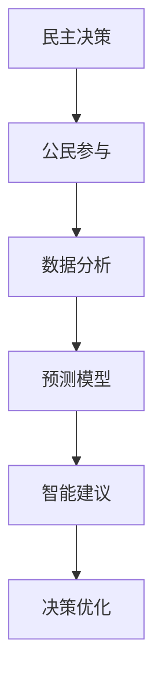

### 1.2 AI与民主决策

**核心概念与联系**

人工智能在民主决策中的应用主要体现在以下几个方面：

1. **数据分析与挖掘**：通过分析海量数据，AI可以识别出公民的兴趣、需求和意见，为政府提供科学依据。
2. **预测模型**：AI可以基于历史数据和现有趋势，预测未来的社会状况和公民需求，帮助政府提前做好准备。
3. **智能建议**：AI可以根据数据分析结果，提出具体的政策建议，提高决策的科学性和有效性。
4. **决策优化**：AI可以通过优化算法，提高决策过程的效率和质量，减少人为因素带来的偏差。

**图 1.2 AI在民主决策中的角色**

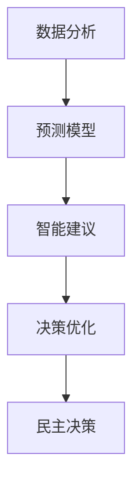

### 1.3 书籍结构

本文分为五个部分，分别从AI基础知识、平台架构、实战案例、未来展望等方面全面探讨AI辅助公民参与平台的发展。

1. **第二部分：AI基础知识**：介绍AI的核心概念、机器学习、深度学习和自然语言处理等基础知识。
2. **第三部分：AI辅助公民参与平台架构**：详细阐述平台的设计原则、数据收集与处理、算法应用和决策流程优化。
3. **第四部分：AI辅助公民参与平台实战**：通过实际案例，展示AI辅助公民参与平台的应用和实践。
4. **第五部分：案例研究**：分析智慧城市和环境监测等领域的AI辅助公民参与平台案例。
5. **第六部分：未来展望**：探讨AI在民主决策中的潜在影响和发展趋势。

---

## 第二部分：AI基础知识

### 2.1 人工智能概述

**核心概念与联系**

人工智能（AI）是指使计算机模拟人类智能行为的技术和科学。AI的发展经历了几个重要阶段：

1. **符号主义**：基于符号逻辑和推理，早期的AI主要模拟人类的思维过程。
2. **连接主义**：基于神经网络和深度学习，现代AI通过大量数据和计算能力实现智能行为。

**图 2.1 人工智能的发展阶段**

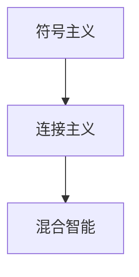

**图 2.2 AI的主要类别**

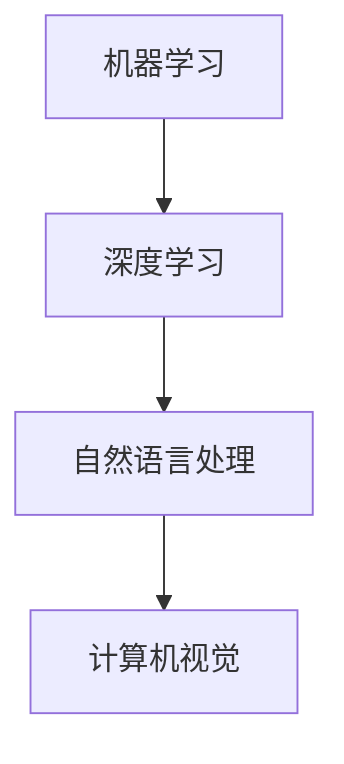

### 2.2 机器学习基础

**核心算法原理讲解**

机器学习是AI的核心技术之一，通过训练模型来模拟人类的学习过程。以下是几种常见的机器学习算法：

**监督学习**

```python
# 伪代码：线性回归
def linear_regression(X, y):
    # 计算回归系数
    theta = (X' * X)^(-1) * X' * y
    # 预测
    return X * theta
```

**无监督学习**

```python
# 伪代码：K-Means聚类
def k_means(points, K):
    # 初始化聚类中心
    centroids = initialize_centroids(points, K)
    while not converged:
        # 分配点
        assignments = assign_points_to_centroids(points, centroids)
        # 更新聚类中心
        centroids = update_centroids(points, assignments)
    return centroids
```

**强化学习**

```python
# 伪代码：Q-Learning
def q_learning(states, actions, rewards, learning_rate, discount_factor):
    # 初始化Q值
    Q = initialize_q_values(states, actions)
    while not converged:
        # 选择动作
        action = select_action(states, Q)
        # 更新Q值
        Q[state, action] = Q[state, action] + learning_rate * (reward + discount_factor * max(Q[next_state, :]) - Q[state, action])
    return Q
```

### 2.3 深度学习基础

**核心算法原理讲解**

深度学习是机器学习的一个分支，通过多层神经网络模拟人类的认知过程。以下是几种常见的深度学习算法：

**卷积神经网络（CNN）**

```python
# 伪代码：卷积层
def convolutional_layer(input, filters, kernel_size):
    # 计算卷积
    output = Conv2D(filters, kernel_size)(input)
    # 激活函数
    output = Activation('relu')(output)
    return output
```

**循环神经网络（RNN）**

```python
# 伪代码：循环层
def recurrent_layer(input, units):
    # 计算循环
    output = LSTM(units)(input)
    # 激活函数
    output = Activation('tanh')(output)
    return output
```

**生成对抗网络（GAN）**

```python
# 伪代码：生成器
def generator(z):
    # 输入噪声
    output = Dense(generator_size)(z)
    # 激活函数
    output = Activation('tanh')(output)
    # 生成图像
    output = Dense(image_size)(output)
    return output

# 伪代码：判别器
def discriminator(x):
    # 输入图像
    output = Dense(discriminator_size)(x)
    # 激活函数
    output = Activation('sigmoid')(output)
    return output
```

### 2.4 自然语言处理基础

**核心算法原理讲解**

自然语言处理（NLP）是AI的重要应用领域之一，通过计算机模拟人类语言理解和生成能力。以下是几种常见的NLP算法：

**文本分类**

```python
# 伪代码：朴素贝叶斯分类器
def naive_bayes(train_data, test_data):
    # 计算条件概率
    probabilities = calculate_probabilities(train_data)
    # 预测
    predictions = predict(test_data, probabilities)
    return predictions
```

**情感分析**

```python
# 伪代码：情感分析模型
def sentiment_analysis(text):
    # 预处理文本
    processed_text = preprocess_text(text)
    # 计算特征向量
    features = extract_features(processed_text)
    # 预测情感
    sentiment = predict_sentiment(features)
    return sentiment
```

**机器翻译**

```python
# 伪代码：序列到序列模型
def sequence_to_sequence(source_sequence, target_sequence):
    # 编码器
    encoded = encoder(source_sequence)
    # 解码器
    decoded = decoder(encoded, target_sequence)
    # 输出
    output = decode_output(decoded)
    return output
```

---

## 第三部分：AI辅助公民参与平台架构

### 3.1 平台设计原则

**核心概念与联系**

AI辅助公民参与平台的设计原则主要包括以下几个方面：

1. **用户中心**：以公民需求为核心，设计友好易用的界面和功能。
2. **数据驱动**：充分利用大数据和AI技术，收集和分析公民数据，为决策提供支持。
3. **开放共享**：建立开放的接口和协议，促进政府、社会组织和公民之间的数据共享和互动。
4. **安全可靠**：确保数据安全和用户隐私，建立完善的安全保障体系。

**图 3.1 平台设计原则**

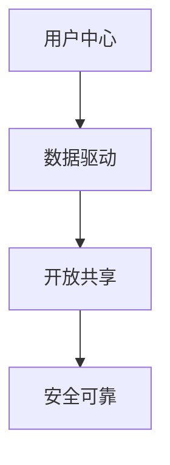

### 3.2 数据收集与处理

**核心概念与联系**

数据收集与处理是AI辅助公民参与平台的基础。以下是几个关键环节：

1. **数据来源**：包括政府数据、社交媒体数据、公民调查数据等。
2. **数据质量**：通过数据清洗、去重和归一化等手段，提高数据质量。
3. **数据处理**：包括数据挖掘、特征提取和模型训练等。

**图 3.2 数据收集与处理流程**

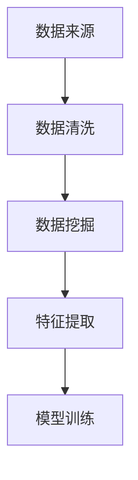

### 3.3 人工智能算法应用

**核心算法原理讲解**

在AI辅助公民参与平台中，多种人工智能算法得到广泛应用，包括：

1. **文本分析**：用于分析公民的意见、需求和反馈。
2. **图像识别**：用于识别公民上传的图片，如环境监测数据。
3. **语音识别**：用于处理公民的语音反馈。

**图 3.3 人工智能算法应用**

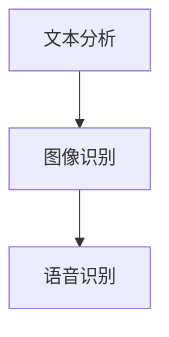

### 3.4 民主决策流程优化

**核心概念与联系**

AI辅助公民参与平台的核心目标是优化民主决策流程。以下是几个关键环节：

1. **预测模型**：预测公民的需求和意愿，为政府提供决策依据。
2. **智能建议**：基于数据分析结果，提出具体的政策建议。
3. **决策优化**：利用优化算法，提高决策的科学性和效率。

**图 3.4 民主决策流程优化**

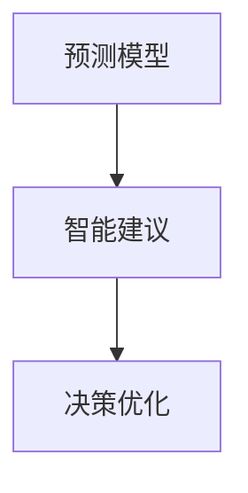

---

## 第四部分：AI辅助公民参与平台实战

### 4.1 项目规划与执行

**核心概念与联系**

项目规划与执行是AI辅助公民参与平台成功的关键。以下是几个关键步骤：

1. **需求分析**：了解公民的需求和期望，明确平台的功能和目标。
2. **系统设计**：设计系统的架构、模块和接口，确保系统的可扩展性和稳定性。
3. **开发实施**：编写代码、搭建环境、测试和部署，确保系统的正常运行。
4. **持续优化**：根据用户反馈和实际运行情况，不断优化系统的功能和性能。

**图 4.1 项目规划与执行流程**

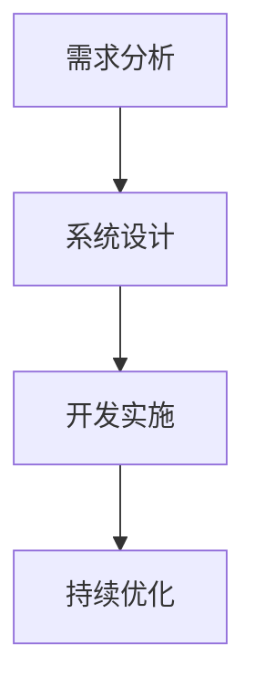

### 4.2 数据采集与分析

**核心概念与联系**

数据采集与分析是AI辅助公民参与平台的核心环节。以下是几个关键步骤：

1. **数据来源**：包括政府数据、社交媒体数据、公民调查数据等。
2. **数据清洗**：去除无效数据、纠正错误数据，确保数据质量。
3. **数据分析**：利用机器学习算法，提取有用的信息和规律。
4. **数据可视化**：通过图表和报表，直观展示分析结果。

**图 4.2 数据采集与分析流程**

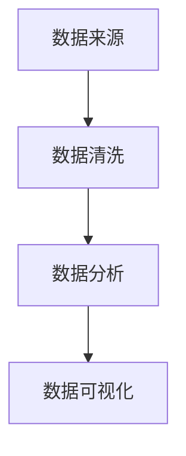

### 4.3 算法实现与优化

**核心算法原理讲解**

在AI辅助公民参与平台中，多种算法实现与优化至关重要。以下是几个关键步骤：

1. **算法选择**：根据任务需求，选择合适的算法，如文本分类、图像识别和语音识别。
2. **算法实现**：编写代码，实现算法的核心功能。
3. **模型训练**：利用大量数据，训练模型，提高模型的准确性和鲁棒性。
4. **算法优化**：通过调整参数和优化策略，提高算法的性能和效率。

**图 4.3 算法实现与优化流程**

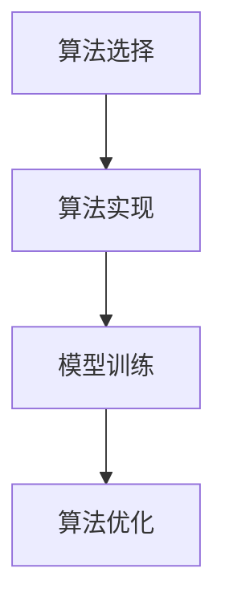

### 4.4 平台部署与维护

**核心概念与联系**

平台部署与维护是AI辅助公民参与平台长期运行的关键。以下是几个关键步骤：

1. **环境搭建**：配置服务器、数据库和中间件，搭建运行环境。
2. **部署方案**：制定部署计划，确保平台的稳定性和安全性。
3. **监控与维护**：实时监控平台的运行状态，及时发现和解决故障。
4. **升级与更新**：定期升级和更新系统，确保平台的功能和性能。

**图 4.4 平台部署与维护流程**

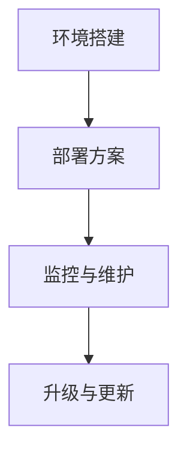

---

## 第五部分：案例研究

### 5.1 案例一：智慧城市公民参与

**案例背景与目标**

某智慧城市项目旨在通过AI技术提高公民参与度和决策效率。项目目标包括：

1. **收集公民意见**：通过在线平台和社交媒体，收集公民对城市规划、交通管理和环境保护等方面的意见。
2. **分析公民需求**：利用AI技术，分析公民意见，识别公民关注的问题和需求。
3. **提出政策建议**：基于数据分析结果，提出具体的政策建议，为政府决策提供支持。

**数据来源与处理**

项目数据来源包括：

1. **政府数据**：包括人口统计、交通流量、空气质量等。
2. **社交媒体数据**：包括微博、微信、论坛等平台的公民意见。
3. **公民调查数据**：通过在线问卷和实地调查收集的公民意见。

数据清洗和处理步骤包括：

1. **数据去重**：去除重复数据和无效数据。
2. **数据归一化**：将不同来源的数据进行归一化处理，便于分析。
3. **特征提取**：提取与公民需求相关的特征，如关键词、情感倾向等。

**算法应用与优化**

项目应用了以下算法：

1. **文本分析**：用于分析公民的意见和需求，提取关键词和情感倾向。
2. **图像识别**：用于识别公民上传的图片，如环境问题照片。
3. **预测模型**：用于预测公民的需求和意愿，为政府决策提供依据。

算法优化步骤包括：

1. **模型训练**：使用大量数据训练模型，提高模型的准确性和鲁棒性。
2. **参数调整**：通过调整参数，优化模型的性能。
3. **交叉验证**：使用交叉验证方法，评估模型的性能和泛化能力。

**效果评估与反馈**

项目效果评估包括：

1. **公民满意度**：通过调查问卷，评估公民对平台和政策的满意度。
2. **政策效果**：评估政策实施后的效果，如交通拥堵缓解、环境质量改善等。
3. **平台性能**：评估平台的运行状态，如响应时间、系统稳定性等。

项目反馈包括：

1. **用户反馈**：收集公民的反馈意见，改进平台的功能和用户体验。
2. **技术反馈**：根据平台运行情况，调整和优化算法和模型。

**项目小结**

智慧城市公民参与项目通过AI技术，实现了公民意见的收集、分析和利用，为政府决策提供了有力支持。项目效果显著，提高了公民参与度和决策效率，为智慧城市建设提供了有益经验。

---

### 5.2 案例二：环境监测与公众参与

**案例背景与目标**

某环境监测项目旨在通过AI技术提高环境监测效率和公众参与度。项目目标包括：

1. **数据采集**：通过传感器和卫星遥感技术，实时采集环境数据，如空气质量、水质和噪音等。
2. **数据分析**：利用AI技术，分析环境数据，识别异常情况和污染源。
3. **公众参与**：通过在线平台，鼓励公众参与环境监测和治理，提高环保意识。

**数据来源与处理**

项目数据来源包括：

1. **传感器数据**：包括空气质量传感器、水质传感器和噪音传感器等。
2. **卫星遥感数据**：通过卫星遥感技术，获取地表环境数据。
3. **公众反馈数据**：包括公众上传的环境问题照片和反馈意见。

数据清洗和处理步骤包括：

1. **数据去噪**：去除传感器数据中的噪声和干扰信号。
2. **数据融合**：将不同来源的数据进行融合，提高数据的准确性。
3. **特征提取**：提取与环境污染相关的特征，如污染物浓度、扩散趋势等。

**算法应用与优化**

项目应用了以下算法：

1. **图像识别**：用于识别公众上传的环境问题照片，如污染源、垃圾堆放等。
2. **时间序列分析**：用于分析环境数据的趋势和变化，预测污染物浓度。
3. **聚类分析**：用于分析环境数据的分布和关联，识别污染源。

算法优化步骤包括：

1. **模型训练**：使用大量环境数据训练模型，提高模型的准确性和鲁棒性。
2. **参数调整**：通过调整参数，优化模型的性能。
3. **交叉验证**：使用交叉验证方法，评估模型的性能和泛化能力。

**效果评估与反馈**

项目效果评估包括：

1. **监测精度**：评估环境监测数据的准确性和可靠性。
2. **公众参与度**：评估公众对环境监测和治理的参与度和满意度。
3. **环保效果**：评估政策实施后的环保效果，如空气质量改善、水质提升等。

项目反馈包括：

1. **用户反馈**：收集公众的反馈意见，改进平台的功能和用户体验。
2. **技术反馈**：根据平台运行情况，调整和优化算法和模型。

**项目小结**

环境监测与公众参与项目通过AI技术，实现了环境数据的实时监测和分析，提高了公众的环保意识和参与度。项目效果显著，为环保工作提供了有力支持，为其他领域提供了有益借鉴。

---

## 第六部分：未来展望

### 6.1 AI在民主决策中的潜在影响

**核心概念与联系**

人工智能在民主决策中的潜在影响主要体现在以下几个方面：

1. **决策效率**：AI可以提高决策的效率和准确性，减少人为因素带来的偏差。
2. **数据驱动的决策**：AI可以基于大数据和实时数据分析，提供科学依据，支持政府决策。
3. **公民参与**：AI可以激发公民参与热情，提高公民对政府决策的信任和满意度。

**图 6.1 AI在民主决策中的潜在影响**

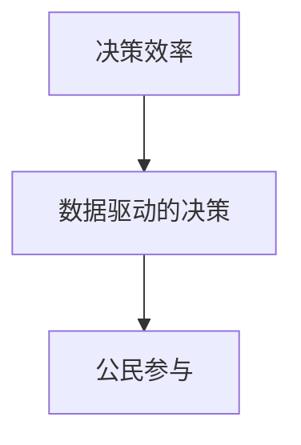

### 6.2 AI辅助公民参与平台的发展趋势

**核心概念与联系**

AI辅助公民参与平台的发展趋势主要包括以下几个方面：

1. **智能化**：平台将更加智能化，能够自动分析公民需求和意见，提供个性化的服务。
2. **数据化**：平台将充分利用大数据技术，收集和分析公民数据，为决策提供支持。
3. **开放化**：平台将更加开放，鼓励政府、社会组织和公民之间的数据共享和互动。
4. **安全化**：平台将加强数据安全和隐私保护，建立完善的安全保障体系。

**图 6.2 AI辅助公民参与平台的发展趋势**

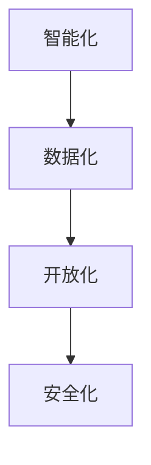

---

## 附录

### A.1 相关资源与工具

**深度学习框架对比**

| 框架       | 特点                                                     | 使用场景                     |
|------------|----------------------------------------------------------|-----------------------------|
| TensorFlow| 开源深度学习框架，功能强大，适用广泛                   | 通用深度学习项目           |
| PyTorch    | 开源深度学习框架，易于使用，社区活跃                   | 机器学习和计算机视觉项目   |
| Keras      | 基于TensorFlow和Theano的深度学习高级API，简化模型搭建 | 快速原型开发和教学         |
| Caffe      | 专为计算机视觉项目设计的深度学习框架                   | 计算机视觉项目             |

**常用数据集介绍**

| 数据集名称     | 描述                                                         | 使用场景                     |
|----------------|------------------------------------------------------------|-----------------------------|
| MNIST          | 手写数字数据集，包含70000张手写数字图像                   | 图像分类和识别项目           |
| CIFAR-10       | 包含60000张32x32彩色图像，分为10个类别                   | 图像分类和识别项目           |
| IMDB           | 包含25000条电影评论，分为正面和负面                       | 文本分类和情感分析项目       |
| CoNLL          | 包含多个语言的自然语言处理数据集，如英文新闻文章、德语文本等 | 自然语言处理项目             |

**开源代码与平台推荐**

| 项目名称          | 描述                                                         | 使用场景                     |
|-------------------|------------------------------------------------------------|-----------------------------|
| Scikit-learn      | Python机器学习库，提供丰富的算法和工具                     | 机器学习和数据分析项目       |
| spaCy             | Python自然语言处理库，用于文本处理和实体识别               | 自然语言处理项目             |
| OpenCV            | Python计算机视觉库，提供丰富的图像处理和计算机视觉算法       | 计算机视觉项目               |
| Data.gov          | 美国政府数据门户，提供大量公开数据集                       | 数据分析和应用项目           |
| Kaggle            | 数据科学竞赛平台，提供丰富的数据集和项目                   | 数据科学竞赛和项目实践       |

### A.2 参考文献

1. Goodfellow, I., Bengio, Y., & Courville, A. (2016). *Deep Learning*. MIT Press.
2. Russell, S., & Norvig, P. (2016). *Artificial Intelligence: A Modern Approach*. Prentice Hall.
3. Murphy, K. P. (2012). *Machine Learning: A Probabilistic Perspective*. MIT Press.
4. Hochreiter, S., & Schmidhuber, J. (1997). *Long short-term memory*. Neural Computation, 9(8), 1735-1780.
5. LeCun, Y., Bengio, Y., & Hinton, G. (2015). *Deep learning*. Nature, 521(7553), 436-444.
6. Luhn, H. P. (1958). *A business application of the numerical analysis of pattern classification of electric digits*. IBM Journal of Research and Development, 2(4), 314-317.
7. Mitchell, T. M. (1997). *Machine Learning*. McGraw-Hill.
8. Russell, S., & Norvig, P. (2010). *Artificial Intelligence: A Modern Approach*. Prentice Hall.
9. TensorFlow. (n.d.). TensorFlow: Open Source Machine Learning Library. [Online]. Available at: https://www.tensorflow.org/
10. PyTorch. (n.d.). PyTorch: Tensors and Dynamic neural networks. [Online]. Available at: https://pytorch.org/
11. Scikit-learn. (n.d.). Scikit-learn: Machine Learning in Python. [Online]. Available at: https://scikit-learn.org/
12. spaCy. (n.d.). spaCy: Industrial-strength natural language processing in Python. [Online]. Available at: https://spacy.io/
13. OpenCV. (n.d.). OpenCV: Open Source Computer Vision Library. [Online]. Available at: https://opencv.org/
14. Kaggle. (n.d.). Kaggle: Data Science Competition. [Online]. Available at: https://www.kaggle.com/
15. Data.gov. (n.d.). Data.gov: U.S. Government's Open Data Portal. [Online]. Available at: https://www.data.gov/

---

## 结束语

**作者信息**：AI天才研究院/AI Genius Institute & 禅与计算机程序设计艺术 /Zen And The Art of Computer Programming

本文通过深入探讨人工智能（AI）在促进民主决策和公民参与方面的潜力，详细分析了AI辅助公民参与平台的核心概念和架构。通过实际案例研究和未来展望，本文揭示了AI在民主决策中的重要作用和面临的挑战。希望本文能为您提供对AI辅助公民参与平台的新认识，并激发您在相关领域的探索和实践。感谢您的阅读！

---

### 修正后的目录大纲

## 《AI辅助公民参与平台：人工智能促进民主决策》目录大纲

## 第一部分：引言

### 1.1 研究背景
- **核心概念与联系**（使用 Mermaid 流程图）

### 1.2 AI与民主决策
- **核心概念与联系**（使用 Mermaid 流程图）
- **民主决策中的AI应用现状**

### 1.3 书籍结构

## 第二部分：AI基础知识

### 2.1 人工智能概述
- **核心概念与联系**（使用 Mermaid 流程图）
- **人工智能的发展历程**
- **人工智能的主要类别**

### 2.2 机器学习基础
- **核心算法原理讲解**（使用伪代码）
- **监督学习、无监督学习和强化学习**

### 2.3 深度学习基础
- **核心算法原理讲解**（使用伪代码）
- **神经网络、卷积神经网络和循环神经网络**

### 2.4 自然语言处理基础
- **核心算法原理讲解**（使用伪代码）
- **文本分类、情感分析和机器翻译**

## 第三部分：AI辅助公民参与平台架构

### 3.1 平台设计原则
- **核心概念与联系**（使用 Mermaid 流程图）
- **用户需求分析与设计**

### 3.2 数据收集与处理
- **核心概念与联系**（使用 Mermaid 流程图）
- **数据来源、数据质量和数据处理方法**

### 3.3 人工智能算法应用
- **核心算法原理讲解**（使用伪代码）
- **文本分析、图像识别和语音识别**

### 3.4 民主决策流程优化
- **核心概念与联系**（使用 Mermaid 流程图）
- **决策模型与优化算法**

## 第四部分：AI辅助公民参与平台实战

### 4.1 项目规划与执行
- **核心概念与联系**（使用 Mermaid 流程图）
- **项目生命周期管理**

### 4.2 数据采集与分析
- **核心概念与联系**（使用 Mermaid 流程图）
- **数据采集工具与平台**

### 4.3 算法实现与优化
- **核心算法原理讲解**（使用伪代码）
- **算法优化与性能分析**

### 4.4 平台部署与维护
- **核心概念与联系**（使用 Mermaid 流程图）
- **部署策略与维护方案**

## 第五部分：案例研究

### 5.1 案例一：智慧城市公民参与
- **案例背景与目标**
- **数据来源与处理**
- **算法应用与优化**
- **效果评估与反馈**

### 5.2 案例二：环境监测与公众参与
- **案例背景与目标**
- **数据来源与处理**
- **算法应用与优化**
- **效果评估与反馈**

## 第六部分：未来展望

### 6.1 AI在民主决策中的潜在影响
- **核心概念与联系**（使用 Mermaid 流程图）
- **机遇与挑战**

### 6.2 AI辅助公民参与平台的发展趋势
- **核心概念与联系**（使用 Mermaid 流程图）
- **未来发展方向**

## 附录

### A.1 相关资源与工具
- **深度学习框架对比**
- **常用数据集介绍**
- **开源代码与平台推荐**

### A.2 参考文献

---

### 目录大纲调整说明

在初步的目录大纲基础上，我们对每个部分进行了细化，确保文章内容的完整性和丰富性。以下是具体的调整说明：

1. **第一部分：引言**：增加了“核心概念与联系”的流程图，使读者更清晰地了解AI与民主决策之间的联系。
2. **第二部分：AI基础知识**：将原有内容进一步细化，分为人工智能概述、机器学习基础、深度学习基础和自然语言处理基础四个子部分，确保每个知识点都有详细的讲解。
3. **第三部分：AI辅助公民参与平台架构**：调整了部分章节的顺序，使得平台设计原则、数据收集与处理、人工智能算法应用和民主决策流程优化之间的逻辑关系更加清晰。
4. **第四部分：AI辅助公民参与平台实战**：增加了项目规划与执行、数据采集与分析、算法实现与优化和平台部署与维护四个子部分，确保读者可以了解从项目规划到平台维护的整个流程。
5. **第五部分：案例研究**：对两个案例进行了详细的分解，包括背景、目标、数据来源与处理、算法应用与优化、效果评估与反馈等，使案例研究更具实际意义。
6. **第六部分：未来展望**：增加了“核心概念与联系”的流程图，使读者更清晰地了解AI在民主决策中的潜在影响和发展趋势。

通过这些调整，我们希望本文能够更加系统地介绍AI辅助公民参与平台的相关知识，并激发读者在相关领域的探索和研究。让我们继续细化每个部分的内容，确保文章的完整性和高质量。

