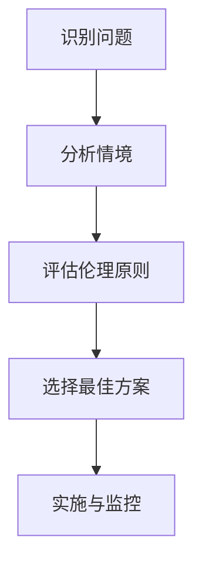

                 

## 1.1 AI辅助创作的概念与现状

### 1.1.1 AI辅助创作的基本概念

AI辅助创作，指的是利用人工智能技术来辅助人类进行艺术创作的过程。这个概念包含了多个层面的含义：

- **技术层面**：AI技术，如机器学习、自然语言处理、计算机视觉等，被应用于生成、编辑、优化或辅助人类完成艺术作品。
- **创作层面**：艺术家利用AI工具来扩展其创作手段，使得创作过程更加高效、多样化和创新。
- **互动层面**：在AI辅助创作中，AI系统不仅仅是工具，它还可以与艺术家进行互动，甚至在某种程度上具备自主创作的能力。

AI辅助创作的起源可以追溯到20世纪50年代，当时计算机科学刚刚起步，科学家们开始尝试用计算机生成音乐、图像等艺术作品。随着技术的不断发展，AI辅助创作的应用范围也在不断拓宽，从简单的图像处理到复杂的艺术形式，如数字绘画、音乐创作、小说写作等。

### 1.1.2 AI辅助创作的发展历程

AI辅助创作的发展历程可以分为以下几个阶段：

- **早期探索**（1950s-1970s）：这一时期的探索主要集中在计算机生成简单图像和音乐。例如，IBM的“音乐创作机器”能够在给定规则下生成音乐。
- **技术突破**（1980s-1990s）：随着计算机性能的提升和算法的进步，AI辅助创作开始涉及到更复杂的艺术形式。例如，艺术家Leroy B. . Neiman和Edwin A. Link Jr.合作开发了能够创作复杂音乐的计算机系统。
- **广泛应用**（2000s至今）：21世纪初，随着机器学习和深度学习技术的发展，AI辅助创作进入了一个全新的阶段。AI工具不仅能够生成艺术作品，还能够与艺术家进行互动，甚至参与到创作决策中。

### 1.1.3 AI辅助创作在艺术领域的应用现状

目前，AI辅助创作在艺术领域已经展现出广泛的应用：

- **绘画与图像处理**：AI技术被广泛应用于数字绘画、图像编辑、特效制作等。例如，DeepArt.io使用卷积神经网络将普通照片转换成艺术作品。
- **音乐创作**：AI系统能够生成旋律、和声、节奏，甚至在某些情况下创造出完整的音乐作品。例如，谷歌的Magenta项目利用机器学习技术创作音乐。
- **文学创作**：AI工具可以生成诗歌、小说、剧本等文学作品。例如，OpenAI的GPT-3能够生成高质量的文章和对话。

然而，AI辅助创作也面临着一些挑战和争议，如艺术作品的原创性问题、AI的伦理问题等。这些挑战和争议将在后续章节中进一步讨论。

## 1.2 AI辅助创作的重要性

### 1.2.1 AI辅助创作对艺术创作的影响

AI辅助创作对艺术创作产生了深远的影响，主要体现在以下几个方面：

- **多样性与创新**：AI能够生成多种风格和形式的艺术作品，这为艺术家提供了前所未有的创作空间。例如，AI系统可以快速生成不同艺术风格的作品，艺术家可以利用这些作品作为灵感来源，进一步探索新的艺术表达方式。
- **效率提升**：AI技术可以帮助艺术家自动化重复性工作，如图像处理、色彩调整等，从而提高创作效率。例如，使用AI进行图像编辑，可以在几秒钟内完成复杂的特效处理，这为艺术家节省了大量的时间。
- **个性化定制**：AI可以根据用户的需求和偏好生成个性化的艺术作品。例如，一些AI系统可以根据用户的音乐口味生成独特的音乐作品，这为艺术创作提供了新的可能性。

### 1.2.2 AI辅助创作在商业和文化领域的价值

AI辅助创作不仅在艺术创作中具有重要作用，在商业和文化领域也有着巨大的价值：

- **商业应用**：AI辅助创作可以应用于广告、产品设计、游戏开发等多个领域。例如，AI可以生成具有吸引力的广告图像，提高产品的市场竞争力；AI系统还可以自动生成游戏场景和角色，加速游戏开发过程。
- **文化传播**：AI辅助创作可以帮助传播和推广不同文化。例如，AI可以生成反映不同地区文化特色的音乐、绘画等艺术作品，这有助于增进不同文化之间的理解和交流。
- **艺术教育**：AI辅助创作工具可以作为艺术教育的辅助工具，帮助学生了解艺术创作的基本原理，提高他们的创作能力。例如，AI系统能够提供实时反馈，帮助学生快速掌握绘画技巧。

### 1.2.3 AI辅助创作对艺术家和观众的变革

AI辅助创作不仅改变了艺术创作的形式，也对艺术家和观众产生了深远的影响：

- **艺术家角色的转变**：在AI辅助创作的背景下，艺术家不再仅仅是创作者，更成为创意的引导者和协调者。他们需要与AI系统合作，发挥创意，将AI生成的初步作品进一步细化和完善。
- **观众体验的变化**：观众不再是被动接受艺术作品的消费者，他们可以参与到AI辅助创作的过程中，甚至生成自己的艺术作品。这种互动性为观众提供了全新的体验，使他们更加深入地理解和欣赏艺术。

总之，AI辅助创作在艺术创作、商业应用和文化传播等方面具有重要意义，它不仅推动了艺术创作的发展，也为艺术家和观众带来了全新的体验和可能性。然而，随着AI技术的不断进步，AI辅助创作也面临着一系列挑战和伦理问题，这些将在后续章节中详细探讨。

## 1.3 本书的目标与结构

### 1.3.1 本书的主要目标

本书的主要目标是深入探讨AI辅助创作中的伦理问题，分析AI辅助创作如何影响艺术创作，以及探讨人机协作在艺术创作中的应用。具体目标如下：

- **理解AI辅助创作的伦理问题**：通过分析AI辅助创作中可能出现的伦理困境，探讨如何解决这些问题，为未来相关研究提供理论支持。
- **分析AI辅助创作对艺术创作的影响**：探讨AI辅助创作如何改变艺术创作的形式和过程，为艺术家提供新的创作手段和灵感。
- **探讨人机协作的艺术新范式**：分析人机协作在艺术创作中的应用，探讨如何通过人机协作实现艺术创作的创新和变革。

### 1.3.2 书籍结构安排

本书分为四个主要部分，每个部分都有其独特的主题和结构：

- **第1章 引言**：介绍AI辅助创作的基本概念、发展历程和重要性，为后续章节的内容打下基础。
- **第2章 伦理问题探讨**：详细分析AI辅助创作中可能出现的伦理问题，包括理论基础、案例分析以及解决方案。
- **第3章 人机协作**：探讨人机协作在艺术创作中的应用，包括基本原理、技术应用、技术实现和案例分析。
- **第4章 艺术新范式**：分析AI辅助创作如何推动艺术创作的变革，探讨艺术新范式的形成和未来发展。

通过这样的结构安排，本书旨在系统地探讨AI辅助创作伦理问题，分析其影响，并探讨人机协作在艺术创作中的应用，从而为相关领域的研究和实践提供参考。以下是第2章的详细目录：

### 第2章 伦理问题探讨

#### 2.1 AI辅助创作中的伦理问题

2.1.1 人工智能的伦理困境

2.1.2 AI辅助创作中的伦理挑战

2.1.3 伦理问题对艺术创作的影响

#### 2.2 AI辅助创作伦理的理论基础

2.2.1 伦理学的核心概念

2.2.2 AI伦理的基本原则

2.2.3 伦理决策模型

#### 2.3 AI辅助创作伦理的案例分析

2.3.1 案例分析1：AI绘画作品引发的伦理争议

2.3.2 案例分析2：AI音乐创作的伦理问题

2.3.3 案例分析3：AI写作的道德困境

#### 2.4 解决AI辅助创作伦理问题的方法

2.4.1 制定伦理指南和标准

2.4.2 建立伦理审查机制

2.4.3 增强公众伦理意识

## 2.1 AI辅助创作中的伦理问题

### 2.1.1 人工智能的伦理困境

在探讨AI辅助创作中的伦理问题时，我们首先需要理解人工智能（AI）自身的伦理困境。人工智能作为一项新兴技术，在带来巨大潜力的同时，也引发了一系列伦理和道德问题。以下是一些主要的人工智能伦理困境：

- **算法偏见**：AI系统的算法通常是基于大量数据训练得到的。如果训练数据存在偏见，那么AI系统在处理相关任务时也会表现出偏见。例如，AI招聘系统可能会基于历史数据对某些性别或种族产生歧视。这种偏见不仅违背了公平原则，还可能导致社会不公平。
- **隐私侵犯**：AI系统常常需要收集和分析大量个人数据，这可能会侵犯用户的隐私权。例如，智能助手在记录和解析用户的语音和文本时，可能会无意中收集到用户的私密信息，从而造成隐私泄露。
- **自主性问题**：随着AI技术的发展，AI系统开始具备一定的自主决策能力。然而，这种自主性也引发了一系列伦理问题。例如，如果AI系统在自动驾驶中发生事故，责任该如何划分？这种自主性是否超越了人类可控范围？
- **透明性问题**：AI系统的决策过程通常是不透明的，这可能导致用户无法理解AI系统为何做出特定决策。这种不透明性不仅影响了用户对AI系统的信任，还可能引发伦理问题。

### 2.1.2 AI辅助创作中的伦理挑战

在AI辅助创作的背景下，这些伦理困境变得更加复杂和具有挑战性。以下是一些AI辅助创作中可能面临的伦理挑战：

- **原创性问题**：AI辅助创作的一个核心争议是，AI生成的艺术作品是否应该被认为是原创作品。如果AI系统仅是作为工具辅助艺术家创作，那么艺术作品的原创性应该归属于艺术家。然而，如果AI系统在创作过程中发挥了主导作用，那么原创性归属就会变得模糊。例如，一位艺术家利用AI系统生成了一幅画，这幅画应被视为艺术家的原创作品，还是AI的原创作品？
- **作者身份问题**：在AI辅助创作中，如何确定艺术作品的作者身份成为一个重要问题。如果AI系统在创作过程中起到了关键作用，那么应该将作者身份归功于AI系统还是艺术家？这种身份的模糊性可能导致创作权的争议。
- **版权问题**：AI辅助创作的艺术作品可能会涉及到版权问题。例如，AI系统在创作过程中使用了其他艺术家的作品作为灵感来源，那么这些艺术作品是否侵犯了原作品的版权？此外，AI生成的艺术作品是否应该享有版权保护，也是一个值得探讨的问题。
- **商业化问题**：AI辅助创作的艺术作品在商业化的过程中也面临着伦理挑战。例如，AI生成的艺术作品是否应该作为商品进行售卖？如果AI系统在生成艺术作品的过程中使用了用户的个人数据，这些数据是否应该得到用户的授权？

### 2.1.3 伦理问题对艺术创作的影响

AI辅助创作中的伦理问题对艺术创作产生了深远的影响，主要体现在以下几个方面：

- **创作自由**：AI辅助创作可能会限制艺术家的创作自由。如果AI系统在创作过程中发挥了主导作用，艺术家可能会失去对创作过程和最终作品的控制权。这种情况下，艺术家可能无法自由地表达其创意和思想。
- **艺术价值**：AI辅助创作的艺术作品可能无法得到传统艺术作品所享有的艺术价值认可。如果AI生成的艺术作品被认为是低质量的或缺乏艺术性的，那么这些作品可能无法在艺术市场上获得认可。
- **观众接受度**：AI辅助创作的艺术作品可能面临观众的接受度问题。一些观众可能对AI生成的艺术作品持怀疑态度，认为这些作品缺乏人类的情感和创造力。这种接受度的差异可能会影响艺术作品的传播和影响力。
- **社会影响**：AI辅助创作的艺术作品可能会对社会产生深远的影响。例如，如果AI系统在创作过程中存在偏见，那么这些艺术作品可能会传播和放大社会不平等和歧视。此外，AI辅助创作也可能导致艺术创作人才的流失，因为一些艺术家可能因为无法与AI系统竞争而放弃创作。

总之，AI辅助创作中的伦理问题对艺术创作产生了深远的影响，这些问题不仅关乎艺术创作的本身，还涉及到社会、文化和道德等多个层面。因此，在推动AI辅助创作的同时，我们有必要深入探讨这些伦理问题，并寻求合适的解决方案。

## 2.2 AI辅助创作伦理的理论基础

### 2.2.1 伦理学的核心概念

要深入探讨AI辅助创作中的伦理问题，我们首先需要了解伦理学的核心概念。伦理学是研究道德原则、道德判断和道德行为的学科，其核心概念包括：

- **道德原则**：道德原则是指导人们行为的规范和准则，例如公正、尊重、诚信等。在AI辅助创作中，道德原则可以帮助我们判断AI系统的行为是否合乎伦理标准。
- **道德判断**：道德判断是对行为或情况的伦理评价，例如判断某个行为是否道德、是否正义等。在AI辅助创作中，道德判断可以帮助我们评估AI系统在特定情境下的行为是否合乎伦理。
- **道德责任**：道德责任是指个体或组织对行为结果负责的义务。在AI辅助创作中，道德责任涉及到艺术家、AI系统开发者以及用户等多方责任。

### 2.2.2 AI伦理的基本原则

AI伦理的基本原则是为了指导AI系统的设计和应用，确保AI技术在伦理层面上的合理性。以下是一些主要的AI伦理基本原则：

- **公正性**：AI系统应确保公正，避免偏见和歧视。这意味着AI系统在设计过程中应充分考虑到多样性和包容性，确保不会对某些群体产生不公平对待。
- **透明性**：AI系统应具备透明性，使人们能够理解和追踪其行为和决策过程。透明性有助于提高用户对AI系统的信任度，减少误解和冲突。
- **责任性**：AI系统的开发者、使用者和其他相关方应对AI系统的行为和结果负责。这意味着在AI辅助创作中，各方应明确自己的责任，确保AI系统的应用符合伦理标准。
- **自主性**：AI系统应具备一定的自主性，能够独立做出决策。然而，这种自主性应在合理的范围内，确保不会超出人类的可控范围。
- **安全性**：AI系统应确保安全性，避免意外行为和错误决策。安全性包括保护用户隐私、避免数据泄露以及确保AI系统的稳定性和可靠性。

### 2.2.3 伦理决策模型

在AI辅助创作中，伦理决策模型是一种帮助我们在复杂情境下做出伦理决策的工具。以下是一个简化的伦理决策模型，包括以下几个步骤：

1. **识别问题**：首先，我们需要明确AI辅助创作中存在的伦理问题，例如原创性问题、作者身份问题、版权问题等。
2. **分析情境**：接下来，我们需要对情境进行详细分析，了解问题的背景、涉及的各方利益以及可能的解决方案。
3. **评估伦理原则**：根据伦理学的核心概念和AI伦理的基本原则，评估不同解决方案是否符合伦理标准。
4. **选择最佳方案**：在评估的基础上，选择最符合伦理标准的解决方案。这个方案应既能解决当前问题，又不会引发新的伦理困境。
5. **实施与监控**：最后，实施选择的方案，并对其进行监控和评估，确保其效果和合理性。

通过伦理决策模型，我们可以在AI辅助创作中系统地分析和解决伦理问题，确保AI技术的应用符合伦理标准。以下是这个模型的Mermaid流程图表示：

这个模型为我们提供了一个系统的框架，可以帮助我们在AI辅助创作中做出合理的伦理决策。

## 2.3 AI辅助创作伦理的案例分析

### 2.3.1 案例分析1：AI绘画作品引发的伦理争议

案例1涉及AI绘画作品引发的伦理争议。某知名艺术家利用AI系统创作了一幅画作，这幅画作在艺术市场上受到了广泛关注和高度评价。然而，这幅画作是否应该被认为是原创作品，以及艺术家的身份认定，成为了一个备受争议的问题。

- **原创性问题**：这幅画作是由AI系统生成的，那么它是否应该被认为是原创作品？根据传统的艺术创作理念，原创性通常被认为是艺术作品的灵魂。然而，AI系统生成的作品是否能够被赋予原创性，这在伦理学上是一个值得探讨的问题。
- **艺术家身份问题**：这幅画作是由AI系统生成的，艺术家在创作过程中是否发挥了关键作用？如果AI系统在创作过程中起到了主导作用，那么艺术家的身份认定就会变得模糊。这种情况引发了关于艺术家角色和创作贡献的讨论。

这个案例揭示了AI辅助创作中原创性和艺术家身份认定的伦理困境。解决这个问题的关键在于如何平衡AI系统的技术贡献和艺术家的创意贡献，确保艺术创作过程中的伦理合法性。

### 2.3.2 案例分析2：AI音乐创作的伦理问题

案例2涉及AI音乐创作中的伦理问题。某音乐公司开发了一款AI音乐创作软件，这款软件可以生成各种风格的音乐。然而，这款软件在创作过程中使用了用户上传的私人音乐作品作为灵感来源，这引发了关于版权和隐私的争议。

- **版权问题**：AI音乐创作软件在创作过程中使用了用户上传的私人音乐作品，那么这些作品是否侵犯了原作品的版权？这是一个涉及版权保护的问题。在音乐创作领域，版权保护是至关重要的，因为音乐作品的价值往往体现在版权上。
- **隐私问题**：AI音乐创作软件在创作过程中收集了用户上传的私人音乐作品，那么这些作品是否侵犯了用户的隐私权？这是一个涉及隐私保护的问题。在数字时代，用户的隐私保护变得尤为重要，任何未经授权的数据收集和使用都可能引发隐私争议。

这个案例揭示了AI音乐创作中版权保护和隐私保护的伦理问题。解决这个问题的关键在于制定明确的版权政策和隐私保护措施，确保用户的作品和隐私得到有效保护。

### 2.3.3 案例分析3：AI写作的道德困境

案例3涉及AI写作中的道德困境。某知名文学网站推出了一款AI写作工具，用户可以利用这款工具生成各种类型的文章。然而，这款工具在生成文章时存在一些道德问题，引发了公众的质疑。

- **内容真实性**：AI写作工具生成的文章在内容真实性方面存在问题。由于AI系统缺乏人类的判断力和道德准则，生成的文章可能包含虚假信息或不准确的内容。这种情况不仅误导了读者，还可能对社会产生负面影响。
- **道德判断**：AI写作工具在生成文章时可能涉及道德判断问题。例如，当AI系统在撰写新闻报道时，需要判断事件的公正性和客观性。然而，AI系统缺乏情感和道德判断力，可能会导致不当的道德判断。

这个案例揭示了AI写作中内容真实性和道德判断的伦理问题。解决这个问题的关键在于提高AI系统的道德判断能力，确保生成的文章在内容和道德上都是可信和合理的。

通过这三个案例分析，我们可以看到AI辅助创作在不同领域可能引发的伦理问题。这些案例不仅揭示了AI技术在伦理学上的挑战，也为解决这些问题提供了借鉴。在未来，随着AI技术的不断进步，我们需要更加深入地探讨和解决AI辅助创作中的伦理问题，确保AI技术的应用符合伦理标准。

## 2.4 解决AI辅助创作伦理问题的方法

### 2.4.1 制定伦理指南和标准

为了解决AI辅助创作中的伦理问题，首先需要制定一套明确的伦理指南和标准。这些指南和标准应涵盖AI辅助创作的各个环节，包括创作过程、成果发布和商业化应用等。以下是制定伦理指南和标准的一些关键步骤：

- **多方参与**：在制定伦理指南和标准时，应邀请来自不同领域的专家、伦理学家、法律专家、AI技术开发者、艺术家和用户等各方参与。通过多方参与，可以确保指南和标准的全面性和公正性。
- **明确原则**：伦理指南和标准应明确列出AI辅助创作的基本伦理原则，如公正性、透明性、责任性和安全性等。这些原则应贯穿于AI辅助创作的全过程，确保各个环节都符合伦理标准。
- **具体规范**：在明确伦理原则的基础上，制定具体的规范和操作指南，例如如何确保AI系统的公正性、如何保护用户的隐私权、如何防止AI系统产生偏见等。这些规范应具有可操作性和指导意义，帮助各方在实际操作中遵循伦理标准。
- **定期更新**：随着AI技术的发展和应用场景的变化，伦理指南和标准也应定期更新。这可以确保指南和标准始终符合当前的技术和应用环境，从而更好地解决伦理问题。

### 2.4.2 建立伦理审查机制

除了制定伦理指南和标准，还需要建立一套伦理审查机制，确保AI辅助创作在实际应用中遵循伦理标准。以下是建立伦理审查机制的几个关键步骤：

- **审查机构**：建立独立的伦理审查机构，负责对AI辅助创作项目进行审查。审查机构应由伦理学家、法律专家、技术专家和其他相关领域的专业人士组成，确保审查过程具备专业性和权威性。
- **审查流程**：制定一套完善的审查流程，包括项目申请、初步审查、详细审查、最终审查等环节。在审查过程中，应综合考虑项目的技术实现、伦理风险、用户权益等因素，确保项目在伦理层面上的可行性。
- **审查标准**：明确审查标准，确保审查过程有据可依。审查标准应涵盖伦理原则的具体要求，如公正性、透明性、责任性和安全性等。通过明确的审查标准，可以确保审查过程的客观性和公正性。
- **监督与反馈**：建立监督和反馈机制，确保审查过程的透明性和有效性。监督和反馈机制应包括定期评估审查机构的工作效果、接受公众和利益相关方的监督建议等。通过监督和反馈，可以不断优化审查机制，提高其执行效果。

### 2.4.3 增强公众伦理意识

除了制定伦理指南和建立审查机制，还需要增强公众的伦理意识，提高公众对AI辅助创作伦理问题的认识和理解。以下是增强公众伦理意识的一些方法：

- **教育培训**：通过教育培训，向公众普及AI技术和AI辅助创作的相关知识，特别是伦理问题的相关内容。教育培训应包括学校教育、社会培训、在线课程等多种形式，确保公众能够全面了解AI辅助创作的伦理问题。
- **宣传推广**：利用媒体、网络、社区等渠道，广泛宣传AI辅助创作的伦理问题，提高公众的关注度。通过宣传推广，可以引导公众正确认识和理解AI辅助创作的伦理挑战，增强其伦理意识。
- **公众参与**：鼓励公众参与到AI辅助创作的伦理讨论中，提出意见和建议。公众参与不仅可以提供多样化的观点，还可以增强公众对AI辅助创作伦理问题的关注和重视。
- **法律法规**：通过制定和执行相关法律法规，规范AI辅助创作的应用和推广。法律法规应明确AI辅助创作中各方的权利和义务，确保AI辅助创作在法律和伦理的双重约束下进行。

通过制定伦理指南和标准、建立伦理审查机制以及增强公众伦理意识，我们可以更好地解决AI辅助创作中的伦理问题，确保AI技术在艺术创作领域的可持续发展。

## 3.1 人机协作的基本原理

### 3.1.1 人机协作的定义

人机协作（Human-AI Collaboration）是指人类和人工智能系统在共同目标下进行协同工作的过程。这种协作不仅涉及到技术层面，还涵盖了人类与机器之间的互动和合作。人机协作的关键在于利用人工智能的优势，弥补人类的不足，同时发挥人类的创造力、判断力和情感因素。

### 3.1.2 人机协作的优势

人机协作在艺术创作中具有显著的优势，主要体现在以下几个方面：

- **提高创作效率**：人工智能系统能够快速处理大量数据，进行复杂的计算和模式识别，从而大大提高创作效率。例如，AI可以快速生成多个设计方案，供艺术家选择和优化。
- **扩展创作能力**：人工智能系统可以生成人类难以想象的艺术作品，扩展艺术家的创作能力。例如，AI可以根据不同的风格和主题，生成多样化的图像、音乐和文学作品。
- **增强个性化定制**：人工智能系统可以根据用户的需求和偏好，生成个性化的艺术作品。这为艺术家提供了新的创作方向，同时也为观众提供了更加个性化的艺术体验。
- **减轻重复性劳动**：人工智能系统可以自动化处理重复性、繁琐的创作任务，如色彩调整、图像编辑等，从而减轻艺术家的负担，让他们能够将更多精力投入到创意和创作中。

### 3.1.3 人机协作的模式

人机协作在艺术创作中可以采取多种模式，以下是几种常见的协作模式：

- **辅助模式**：在这种模式中，人工智能系统作为工具，辅助艺术家进行创作。艺术家可以通过人工智能系统提供的建议和工具，提高创作效率和创作质量。例如，艺术家可以利用AI生成的基础图像，进一步进行细节处理和创作。
- **共创模式**：在这种模式中，人工智能系统和艺术家共同创作艺术作品。艺术家和AI系统通过交互和合作，共同构思和生成艺术作品。例如，AI系统可以根据艺术家的指示，生成符合其创意的图像或音乐。
- **迭代模式**：在这种模式中，人工智能系统与艺术家进行多次迭代，逐步完善艺术作品。艺术家可以根据AI系统提供的反馈和建议，不断调整和改进作品，直到达到预期效果。这种模式特别适用于需要多次修改和完善的艺术作品，如电影特效、游戏设计等。

### 3.1.4 人机协作的挑战

尽管人机协作在艺术创作中具有显著优势，但同时也面临一些挑战：

- **技术局限**：人工智能系统的技术和算法仍然存在局限，无法完全取代人类的创造力和判断力。艺术家需要了解这些局限，合理利用人工智能系统的优势，避免过度依赖技术。
- **伦理问题**：人机协作中可能会出现伦理问题，如原创性归属、版权保护和隐私保护等。这些问题需要艺术家、技术专家和伦理学家共同探讨和解决。
- **用户体验**：人机协作的界面和交互设计需要考虑到用户体验，确保艺术家能够方便地与人工智能系统进行协作。用户体验不佳可能会导致协作效果不理想。

### 3.1.5 人机协作的未来发展趋势

随着人工智能技术的不断进步，人机协作在艺术创作中的前景十分广阔。以下是未来人机协作可能的发展趋势：

- **智能化水平提升**：人工智能系统的智能化水平将进一步提高，能够更准确地理解艺术家意图，提供更有针对性的建议和工具。
- **多样化协作模式**：人机协作模式将更加多样化，不仅限于辅助、共创和迭代，还可能发展出新的协作模式，如预测模式、协同创作模式等。
- **跨学科融合**：人机协作将与其他领域（如心理学、认知科学、艺术学等）进行融合，推动艺术创作的发展和创新。
- **伦理规范完善**：随着人机协作的普及，相关伦理规范将逐步完善，确保人机协作在道德和伦理层面上的合法性。

总之，人机协作是艺术创作领域的一个重要发展方向，它不仅提高了创作效率和创作质量，也为艺术家提供了新的创作手段和灵感。然而，人机协作也面临一系列挑战，需要各方共同努力，推动其健康发展。

## 3.2 人机协作在艺术创作中的应用

### 3.2.1 AI辅助创作工具

在人机协作的背景下，人工智能辅助创作工具（AI-assisted creation tools）已经成为艺术家和设计师的重要工具。这些工具通过提供算法支持、数据分析和技术实现，帮助艺术家更高效地进行创作。

- **图像处理工具**：如Adobe Photoshop中的AI功能，可以自动进行图像编辑、色彩调整和特效添加。艺术家可以利用这些功能快速生成初步作品，然后进行细节处理。
- **音乐创作工具**：如AIVA（Artificial Intelligence Virtual Artist），可以生成旋律、和声和完整的音乐作品。艺术家可以利用这些作品作为灵感来源，进一步创作和完善。
- **文学创作工具**：如OpenAI的GPT-3，可以生成高质量的文本，包括故事、诗歌和剧本。艺术家可以利用这些文本进行扩展和改编，实现创作创新。

### 3.2.2 人机共创艺术作品

人机共创艺术作品（Human-AI co-created art works）是一种新兴的艺术形式，它通过人工智能与艺术家的合作，创造出独特且具有创新性的作品。

- **合作过程**：艺术家和人工智能系统在共同目标下，通过互动和协作，共同构思和生成艺术作品。艺术家提供创意和艺术理念，人工智能系统提供技术支持和生成算法。
- **作品特点**：人机共创艺术作品通常具有以下特点：
  - **独特性**：由于人工智能系统的参与，作品具有独特的风格和形式，不同于传统的人工创作。
  - **多样性**：人工智能系统能够生成大量不同风格和形式的作品，艺术家可以根据需求进行选择和调整。
  - **互动性**：人机共创艺术作品通常具有互动性，观众可以通过与作品的互动，获得独特的体验。

### 3.2.3 人机协作在艺术创作中的案例分析

以下是人机协作在艺术创作中的几个成功案例：

- **AI绘画**：艺术家Alexi Papageorge与AI系统合作，生成了一幅融合了传统绘画和数字艺术的作品。这幅画在艺术市场上受到了高度评价，成为AI辅助创作艺术作品的代表之一。
- **AI音乐**：作曲家Philip Glass与AI系统合作，创作了一首独特的音乐作品。这首作品结合了传统的作曲技巧和人工智能的生成算法，展现了人机协作在音乐创作中的潜力。
- **AI文学**：作家William Gibson与AI系统合作，生成了一部科幻小说。这部小说通过人工智能的创意生成和艺术家的二次创作，探索了人工智能在文学创作中的应用。

这些案例表明，人机协作在艺术创作中具有巨大的潜力，它不仅提高了创作效率和创作质量，也为艺术家提供了新的创作手段和灵感。

## 3.3 人机协作的技术实现

### 3.3.1 人机交互技术

在人机协作的艺术创作中，人机交互技术起着至关重要的作用。人机交互技术包括图形用户界面（GUI）、语音识别、手势识别等多种形式，旨在使艺术家能够方便地与人工智能系统进行交互。

- **图形用户界面（GUI）**：图形用户界面是艺术家与人工智能系统进行交互的主要方式。通过GUI，艺术家可以直观地查看和调整人工智能系统生成的作品，提供反馈和指令。例如，艺术家可以使用拖拽、点击等操作来选择和调整图像、音乐和文本等元素。
- **语音识别**：语音识别技术使艺术家可以通过语音与人工智能系统进行交互。艺术家可以通过语音命令来控制人工智能系统，如生成新的图像、调整音乐节奏等。语音识别技术的应用，极大地提高了创作效率，减少了艺术家对键盘和鼠标的依赖。
- **手势识别**：手势识别技术通过捕捉艺术家的手势，实现与人工智能系统的交互。例如，艺术家可以通过手势来调整图像的亮度、对比度和色彩等参数。手势识别技术使得创作过程更加自然和直观，增强了人机协作的互动性。

### 3.3.2 自然语言处理

自然语言处理（Natural Language Processing，NLP）是人机协作在文学创作和音乐创作中的重要技术。NLP技术使人工智能系统能够理解和生成人类语言，从而实现与艺术家的自然对话和协作。

- **文本生成**：在文学创作中，NLP技术可以帮助人工智能系统生成诗歌、故事、剧本等文本。艺术家可以通过与人工智能系统的对话，提供创作灵感、主题和风格指导，人工智能系统根据这些信息生成初步文本，艺术家再进行修改和完善。
- **情感分析**：在音乐创作中，NLP技术可以分析文本的情感倾向，生成相应的音乐作品。例如，人工智能系统可以根据艺术家提供的歌词情感，生成旋律和和声，实现情感与音乐的完美结合。
- **对话系统**：NLP技术还可以构建对话系统，使人工智能系统能够与艺术家进行自然对话。通过对话系统，艺术家可以与人工智能系统交流创作想法、获取反馈和建议，从而实现更加高效和互动的创作过程。

### 3.3.3 计算机视觉

计算机视觉（Computer Vision）技术在图像创作和艺术表现中具有重要应用。计算机视觉技术使人工智能系统能够理解和处理视觉信息，从而实现与艺术家的协作创作。

- **图像生成**：计算机视觉技术可以帮助人工智能系统生成各种风格和形式的图像。例如，人工智能系统可以通过深度学习算法，学习艺术家已有的作品风格，生成类似风格的新图像。艺术家可以通过对生成图像的调整和修改，实现个性化创作。
- **图像编辑**：计算机视觉技术还可以用于图像编辑，帮助艺术家快速完成复杂的图像处理任务。例如，人工智能系统可以自动识别图像中的物体、纹理和颜色，进行智能化的编辑和优化。
- **艺术表现**：计算机视觉技术还可以用于艺术表现，使人工智能系统能够生成独特的视觉艺术作品。例如，人工智能系统可以通过生成对抗网络（GAN）生成超现实和抽象的艺术作品，艺术家再根据这些作品进行创作和演绎。

### 3.3.4 深度学习

深度学习（Deep Learning）是人工智能的核心技术之一，在人机协作的艺术创作中发挥着重要作用。深度学习技术通过多层神经网络，实现从大量数据中自动学习和提取特征。

- **特征提取**：深度学习技术可以自动从大量数据中提取有用的特征，如图像中的纹理、颜色、形状等。这些特征可以用于艺术作品的生成和编辑，提高创作效率和质量。
- **生成模型**：深度学习中的生成模型，如生成对抗网络（GAN）和变分自编码器（VAE），可以生成高质量的艺术作品。艺术家可以通过调整生成模型的参数，实现个性化的创作。
- **风格迁移**：深度学习技术可以实现艺术风格迁移，将一种风格的作品转换为另一种风格。例如，艺术家可以将一幅油画风格的作品转换为水彩风格，从而实现创作创新。

通过人机交互技术、自然语言处理、计算机视觉和深度学习等技术的综合应用，人工智能系统可以与艺术家进行高效、互动和协作的艺术创作，推动艺术创作的发展和创新。

## 3.4 人机协作的案例研究

### 3.4.1 案例背景

本案例研究以知名艺术家Alexi Papageorge和其与AI系统合作的绘画项目为例，探讨人机协作在艺术创作中的具体实践。

### 3.4.2 项目目标

该项目的主要目标是利用人工智能系统生成初步的绘画作品，然后由艺术家进行细节处理和创作。具体目标包括：
- **探索AI绘画技术的应用**：通过项目的实施，了解和掌握AI绘画技术的原理和应用。
- **提高创作效率**：利用AI系统快速生成基础图像，缩短创作时间。
- **实现创作创新**：通过AI系统生成的初步作品，启发艺术家的创作灵感，实现作品形式的创新。

### 3.4.3 项目实施

1. **技术选型**：
   - **生成模型**：采用生成对抗网络（GAN）作为核心技术，实现图像的生成和编辑。
   - **交互界面**：设计一个图形用户界面（GUI），使艺术家能够方便地与AI系统进行交互，查看和调整生成的图像。

2. **创作流程**：
   - **数据准备**：收集大量的绘画作品作为训练数据，用于训练GAN模型。
   - **模型训练**：使用训练数据进行模型训练，使AI系统具备生成符合艺术家风格图像的能力。
   - **初步生成**：使用训练好的GAN模型，生成初步的绘画作品。
   - **艺术家调整**：艺术家对初步生成的作品进行细节处理和创作，使其符合预期效果。

### 3.4.4 项目成果

通过项目实施，取得了以下成果：
- **创新作品**：艺术家Alexi Papageorge利用AI系统生成的基础图像，创作出了一幅融合了传统绘画和数字艺术的新作品。这幅作品在艺术市场上受到了高度评价，成为AI辅助创作艺术作品的代表之一。
- **高效创作**：AI系统快速生成的初步作品，使艺术家能够节省大量时间，专注于创作细节和创作灵感。
- **技术积累**：项目实施过程中，积累了丰富的AI绘画技术和经验，为未来的艺术创作提供了技术支持。

### 3.4.5 项目分析

1. **技术优势**：
   - **生成能力**：GAN模型在生成绘画作品方面具有强大的能力，可以生成高质量的图像，满足艺术家的创作需求。
   - **交互便捷**：图形用户界面（GUI）设计方便艺术家与AI系统进行交互，提高创作效率。

2. **挑战与不足**：
   - **创作自主性**：尽管AI系统可以生成初步作品，但艺术家的创作自主性仍然受到一定限制，需要进一步探索如何增强艺术家的创作自由度。
   - **技术依赖**：项目实施过程中，艺术家对AI系统的依赖性较高，需要提高技术自主性和创新能力。

### 3.4.6 项目启示

通过该项目，我们可以得到以下启示：
- **人机协作潜力**：人机协作在艺术创作中具有巨大潜力，能够提高创作效率和质量，实现创作创新。
- **技术发展**：随着人工智能技术的不断进步，人机协作在艺术创作中的应用将更加广泛和深入。
- **伦理关注**：在推动人机协作的同时，需要关注相关伦理问题，确保AI技术在艺术创作中的应用符合伦理标准。

总之，人机协作在艺术创作中具有重要的应用价值，通过具体案例研究，我们可以更好地理解其技术实现和应用前景。

## 4.1 AI辅助创作对艺术创作的影响

### 4.1.1 AI辅助创作对艺术创作手段的变革

人工智能（AI）辅助创作对传统艺术创作手段带来了深刻变革。首先，AI技术使得艺术家能够更快速地生成和编辑作品。例如，在绘画领域，AI可以快速生成基础图像，艺术家只需在AI生成的作品上进行细节调整。这种高效的工作流程大大缩短了创作时间，使艺术家能够更加专注于创意和艺术表达。此外，AI技术还提供了多种风格和形式的选择，艺术家可以利用这些工具探索新的艺术表现形式。

### 4.1.2 AI辅助创作对艺术创作形式的创新

AI辅助创作不仅改变了艺术创作的手段，还推动了艺术创作形式的创新。例如，在数字艺术领域，AI技术可以生成独特的视觉效果和动态作品，为艺术家提供了新的创作可能性。音乐创作中，AI系统能够生成复杂的旋律和和声，艺术家可以根据这些作品进行二次创作，形成独特的音乐风格。在文学创作中，AI技术可以生成高质量的文章和诗歌，艺术家可以在此基础上进行扩展和改编，创造出新颖的文学作品。

### 4.1.3 AI辅助创作对艺术创作风格的变革

AI辅助创作也对艺术创作风格产生了显著影响。传统艺术风格往往依赖于艺术家个人的经验和技巧，而AI技术则可以通过算法和模型生成多样化的风格。例如，深度学习算法可以学习多种艺术风格，如印象派、抽象派等，然后将其应用于新作品的创作。这种风格变革不仅扩展了艺术家的创作手段，也为观众带来了全新的艺术体验。

### 4.1.4 AI辅助创作对艺术市场的影响

AI辅助创作对艺术市场也产生了深远的影响。首先，AI生成的艺术作品在市场上引起了广泛关注，成为新的投资热点。一些AI生成的艺术作品在拍卖会上获得了高价，这反映了市场对AI辅助创作的认可。其次，AI辅助创作使得艺术创作更加多样化和高效，提高了艺术作品的生产效率，从而丰富了艺术市场的供给。此外，AI辅助创作还促进了艺术家与观众之间的互动，通过在线平台和社交媒体，艺术家可以更直接地与观众沟通，获得反馈和建议，从而调整和优化创作。

总之，AI辅助创作对艺术创作手段、形式、风格和市场的变革具有重要意义。它不仅为艺术家提供了新的创作工具和灵感，还推动了艺术创作和艺术市场的发展。在未来，随着AI技术的不断进步，AI辅助创作将在艺术创作中发挥更大的作用，为艺术家和观众带来更多的惊喜和创新。

## 4.2 AI辅助创作与艺术创作的融合

### 4.2.1 AI辅助创作与艺术创作的关系

AI辅助创作与艺术创作之间的关系是互动和融合的。在传统艺术创作中，艺术家依靠个人技能和经验进行创作，而AI辅助创作则通过技术手段扩展了艺术家的创作能力。AI系统可以处理大量数据，快速生成初步作品，并提供多种风格选择，艺术家可以在这些基础上进行二次创作，从而实现艺术作品的创新。因此，AI辅助创作不仅作为工具辅助艺术家，还在一定程度上成为艺术创作的参与者，与艺术家共同创造艺术价值。

### 4.2.2 AI辅助创作对艺术创作的影响

AI辅助创作对艺术创作产生了深远的影响，主要体现在以下几个方面：

- **创作效率提升**：AI技术能够快速处理和分析大量数据，生成初步作品，使艺术家能够更高效地完成创作。例如，AI可以自动生成图像、音乐和文本，艺术家可以在这些基础上进行修改和完善，从而节省大量时间。
- **创作形式创新**：AI技术为艺术创作提供了新的形式和手段。通过算法和模型，AI可以生成复杂的视觉效果、独特的音乐旋律和多样化的文学作品，为艺术家提供了新的创作灵感。这种创新不仅丰富了艺术表现形式，也拓展了艺术家的创作空间。
- **风格多样性**：AI技术可以学习多种艺术风格，并将这些风格应用于新作品的创作。艺术家可以利用AI生成的多样化风格，探索新的创作方向，实现风格融合和创新。这种风格多样性不仅增加了艺术作品的艺术价值，也满足了不同观众的审美需求。
- **互动性增强**：AI辅助创作使得艺术家与观众之间的互动更加紧密。通过在线平台和社交媒体，艺术家可以与观众实时沟通，获取反馈和建议，从而优化创作过程。这种互动性不仅增强了观众的参与感，也促进了艺术创作的迭代和改进。

### 4.2.3 艺术创作与AI辅助创作的融合途径

艺术创作与AI辅助创作的融合可以通过以下几种途径实现：

- **共创模式**：艺术家和AI系统共同参与创作，艺术家提供创意和艺术理念，AI系统提供技术支持和生成算法。这种模式可以通过互动和协作，实现艺术作品的最大创新性。
- **辅助模式**：AI系统作为工具辅助艺术家进行创作，艺术家利用AI生成的初步作品进行细节处理和创作。这种模式可以提高创作效率，使艺术家能够更专注于创意和艺术表达。
- **融合模式**：艺术家将AI技术融入创作过程中，通过算法和模型生成新的艺术形式和风格。这种模式可以实现艺术创作的多样性和创新性。
- **交互模式**：艺术家与AI系统通过在线平台和社交媒体进行互动，实时沟通和反馈，优化创作过程。这种模式可以增强观众的参与感，促进艺术创作的迭代和改进。

通过上述途径，艺术创作与AI辅助创作可以实现深度融合，推动艺术创作的发展和创新。在未来，随着AI技术的不断进步，艺术创作与AI辅助创作将更加紧密地结合，为艺术家和观众带来更多的惊喜和体验。

## 4.3 AI辅助创作艺术的新形式

### 4.3.1 AI生成艺术

AI生成艺术（AI-generated art）是指利用人工智能技术，如生成对抗网络（GAN）、深度学习等，自动生成艺术作品的过程。AI生成艺术的核心在于算法和数据的结合，通过大量训练数据，AI系统可以学习到不同的艺术风格和表现手法，从而生成具有独特风格和创意的艺术作品。

- **技术原理**：AI生成艺术主要依赖于生成对抗网络（GAN）和变分自编码器（VAE）等深度学习模型。GAN由生成器（Generator）和判别器（Discriminator）组成，生成器生成艺术作品，判别器判断生成作品的质量。通过不断优化生成器和判别器的参数，AI系统能够生成越来越高质量的艺术作品。
- **创作过程**：AI生成艺术的创作过程通常包括数据准备、模型训练、生成作品和艺术家调整。艺术家首先提供训练数据，如绘画作品、音乐旋律等，然后通过训练生成器生成初步作品。艺术家再根据初步作品进行细节调整和创作，形成最终的艺术作品。

### 4.3.2 AI辅助艺术

AI辅助艺术（AI-assisted art）是指艺术家利用人工智能技术，如图像识别、自然语言处理等，辅助进行艺术创作的过程。AI辅助艺术通过提供技术支持，如图像编辑、音乐生成等，帮助艺术家提高创作效率和质量。

- **技术原理**：AI辅助艺术主要依赖于图像识别、自然语言处理、计算机视觉等人工智能技术。图像识别技术可以帮助艺术家快速识别和处理图像元素，自然语言处理技术可以生成文本内容，计算机视觉技术可以生成视觉效果。通过这些技术，AI系统可以辅助艺术家进行图像编辑、音乐创作、文学创作等。
- **创作过程**：AI辅助艺术的创作过程通常包括创意构思、技术支持、艺术家调整和作品完成。艺术家首先构思创作主题和风格，然后利用AI技术生成初步作品，艺术家再根据初步作品进行细节处理和创作，形成最终的艺术作品。

### 4.3.3 人机共创艺术

人机共创艺术（Human-AI co-created art）是指艺术家与人工智能系统共同参与创作的艺术形式。在这种模式中，艺术家提供创意和艺术理念，人工智能系统提供技术支持和生成算法，双方通过互动和协作，共同创造艺术作品。

- **技术原理**：人机共创艺术的核心是人机交互和协同创作。艺术家通过图形用户界面（GUI）、语音识别、手势识别等与人工智能系统进行交互，提供创作指令和反馈。人工智能系统根据这些指令和反馈，生成初步作品，艺术家再进行细节调整和创作。
- **创作过程**：人机共创艺术的创作过程通常包括创意构思、技术支持、互动协作和作品完成。艺术家首先构思创作主题和风格，然后与人工智能系统进行互动和协作，生成初步作品。艺术家再根据初步作品进行细节调整和创作，形成最终的艺术作品。

### 4.3.4 AI辅助创作艺术的独特性和优势

AI辅助创作艺术的独特性和优势主要体现在以下几个方面：

- **创新性**：AI辅助创作可以生成独特的艺术形式和风格，拓展艺术家的创作空间。通过算法和数据的结合，AI系统能够生成人类难以想象的艺术作品，为艺术家提供新的创作灵感。
- **高效性**：AI辅助创作可以提高创作效率，节省艺术家的时间。AI技术可以快速处理和分析大量数据，生成初步作品，艺术家只需在基础上进行细节处理和创作。
- **多样性**：AI辅助创作提供了多样化的艺术作品形式和风格，满足不同观众的审美需求。通过算法和模型的学习和优化，AI系统能够生成多种风格的艺术作品，为艺术家提供丰富的创作选择。
- **互动性**：AI辅助创作增强了艺术家与观众之间的互动性，提高了观众的参与感。通过在线平台和社交媒体，艺术家可以与观众实时沟通，获取反馈和建议，从而优化创作过程。

总之，AI辅助创作艺术的新形式不仅改变了艺术创作的手段和形式，还为艺术家和观众带来了全新的体验和可能性。在未来，随着AI技术的不断进步，AI辅助创作艺术将发挥更大的作用，推动艺术创作的发展和创新。

## 4.4 AI辅助创作艺术的未来发展趋势

### 4.4.1 技术进步推动艺术创新

随着人工智能技术的不断进步，AI辅助创作艺术将迎来新的发展机遇。首先，深度学习、生成对抗网络（GAN）、增强学习等前沿技术的应用，将进一步提高AI在艺术创作中的表现力。这些技术不仅可以生成更高质量的艺术作品，还可以实现更复杂的艺术风格迁移和创意生成。例如，GAN技术可以将不同艺术风格的特征融合，创造出独特的视觉艺术作品。此外，增强学习技术可以使AI系统在学习过程中不断优化创作策略，提高艺术作品的创新性和独特性。

### 4.4.2 跨界融合催生新兴艺术形式

未来，AI辅助创作艺术将与更多领域进行跨界融合，催生新的艺术形式。例如，AI与虚拟现实（VR）、增强现实（AR）技术的结合，将创造出沉浸式的艺术体验。观众可以身临其境地感受AI生成的艺术作品，与作品进行互动，甚至参与到创作过程中。此外，AI与音乐、舞蹈、戏剧等艺术形式的融合，也将推动新的艺术形式的诞生。例如，AI音乐生成技术可以与舞蹈编排相结合，创造出独特的表演艺术。

### 4.4.3 伦理问题引发社会关注

随着AI辅助创作艺术的普及，相关的伦理问题也将逐渐引发社会关注。例如，AI生成的艺术作品是否应享有版权？艺术家的原创性如何界定？这些问题需要法律、伦理和社会学等多个领域的专家共同探讨。此外，AI辅助创作艺术可能带来的隐私侵犯、算法偏见等问题也需要引起重视。因此，未来在推动AI辅助创作艺术发展的同时，必须建立健全的伦理规范和法律框架，确保AI技术的应用符合道德和伦理标准。

### 4.4.4 艺术市场潜力巨大

AI辅助创作艺术的未来市场潜力巨大。随着AI技术的普及，越来越多的艺术家和机构开始采用AI辅助创作。这为AI辅助创作艺术作品带来了广阔的市场需求。此外，AI辅助创作艺术作品在拍卖市场上的表现也越来越好，一些AI生成的艺术作品甚至被博物馆和私人收藏家收藏。这表明市场对AI辅助创作艺术作品的认可度和接受度正在不断提高。

### 4.4.5 教育与普及的重要性

未来，AI辅助创作艺术的教育与普及也将成为重要的发展方向。随着AI技术的不断进步，更多的学校和教育机构将引入AI辅助创作课程，培养学生的创意思维和技术能力。此外，通过举办AI辅助创作艺术展览、工作坊和讲座等活动，可以提高公众对AI辅助创作艺术的认识和理解，推动这项技术在艺术领域的普及。

总之，AI辅助创作艺术在未来将继续保持快速发展，其技术进步、跨界融合、伦理问题、市场潜力和教育与普及等方面都将对艺术创作产生深远影响。随着AI技术的不断进步，AI辅助创作艺术将为艺术家和观众带来更多的创新和惊喜。

## 结论

通过对AI辅助创作伦理的深入探讨，我们认识到，在人工智能技术快速发展的背景下，AI辅助创作不仅带来了艺术创作手段和形式的变革，也引发了深刻的伦理问题。在艺术创作中，AI的参与使得创作过程更加高效和多样化，但同时也带来了原创性、作者身份、版权和隐私等伦理困境。

首先，AI辅助创作在技术层面上的优势，如生成能力、风格多样性和互动性，为艺术家提供了丰富的创作工具和灵感。然而，这些技术优势也带来了伦理挑战。例如，AI生成的艺术作品是否应享有版权，艺术家与AI系统之间的原创性归属问题等，都是需要深入探讨的伦理问题。

其次，AI辅助创作在艺术创作中的广泛应用，如绘画、音乐、文学等，改变了艺术创作的传统模式。艺术家与AI系统之间的协作，使得创作过程更加互动和协同，但也引发了关于伦理责任和透明性的讨论。如何确保AI系统的公正性、透明性和安全性，成为当前迫切需要解决的问题。

在解决这些伦理问题的过程中，制定伦理指南和标准、建立伦理审查机制、增强公众伦理意识是关键措施。通过多方参与、明确原则、具体规范和定期更新，伦理指南和标准可以为AI辅助创作提供行为准则。建立独立的伦理审查机构，制定完善的审查流程和标准，可以确保AI辅助创作项目在伦理层面上的合规性。同时，增强公众对AI辅助创作伦理问题的认识和理解，提高公众的伦理意识，也是确保AI技术健康发展的必要条件。

未来，随着AI技术的不断进步，AI辅助创作艺术将在艺术创作、商业应用和文化传播等方面发挥更大的作用。然而，如何平衡技术进步与伦理问题，确保AI技术在艺术创作中的应用符合道德和伦理标准，将是我们必须持续关注和努力解决的问题。

综上所述，AI辅助创作伦理的探讨不仅有助于我们理解AI技术在艺术创作中的应用，也为未来的技术发展和政策制定提供了重要的参考。让我们共同努力，推动AI辅助创作艺术在伦理和技术的双重约束下，实现可持续发展。

### 拓展阅读

1. **《AI伦理学：技术与社会的对话》** - 由知名伦理学家乔尔·费尔德曼（Joel Feinberg）所著，该书详细探讨了人工智能技术在伦理层面上的挑战，包括AI辅助创作中的伦理问题。
2. **《艺术与人工智能》** - 由美国作家克里斯·米尔斯（Chris Mears）所著，这本书深入分析了人工智能在艺术创作中的应用，以及艺术创作与AI技术之间的互动关系。
3. **《人机协作：未来工作场所的设计原则》** - 由美国设计学家迈克尔·伯克（Michael Burke）所著，该书提供了关于人机协作的设计原则和实践案例，对于理解AI辅助创作的人机协作模式具有重要参考价值。
4. **《深度学习与艺术创作》** - 由中国学者李航所著，这本书详细介绍了深度学习技术在艺术创作中的应用，包括图像生成、音乐创作等方面的案例和算法原理。
5. **《人工智能时代的艺术市场》** - 由法国学者尼古拉斯·德沃金（Nicolas de Frouville）所著，该书探讨了AI辅助创作对艺术市场的影响，包括艺术作品的评估、交易和市场趋势。

