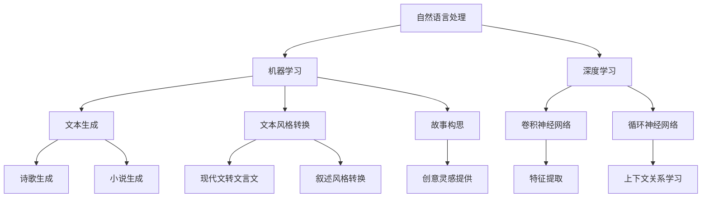

                 

## 《AI辅助创意写作：人机协作的文学新篇章》

### 关键词：人工智能，创意写作，人机协作，自然语言处理，机器学习

> 摘要：本文旨在探讨人工智能（AI）在辅助创意写作中的作用，以及人类与机器如何通过协作创造出新的文学作品。文章首先回顾了AI与创意写作的历史背景，接着详细介绍了AI辅助创意写作的基本原理和技术，随后通过实际案例展示了人机协作的文学创作过程。最后，文章展望了AI辅助创意写作的未来发展趋势，并提出了相关建议。

----------------------------------------------------------------

### 引言

随着人工智能技术的飞速发展，AI在各个领域的应用日益广泛，文学创作也不例外。近年来，人工智能开始辅助人类进行创意写作，通过人机协作，创作出风格迥异、充满创意的文学作品。这一现象引发了学术界的广泛关注和讨论。本文将从以下几个方面展开探讨：

1. **AI与创意写作的历史背景**：回顾AI在文学创作中的应用，了解其发展过程和重要事件。
2. **AI辅助创意写作的基本原理**：分析AI在创意写作中的应用，包括自然语言处理、机器学习和深度学习等技术。
3. **人机协作创意写作模式**：探讨人类与机器如何合作进行文学创作，以及这种合作模式的优点和挑战。
4. **AI辅助创意写作案例研究**：通过具体案例展示AI辅助创意写作的实际应用和效果。
5. **AI辅助创意写作的未来发展趋势**：预测AI辅助创意写作的未来发展方向和可能面临的挑战。

### AI与创意写作的历史背景

人工智能在文学创作领域的应用可以追溯到上世纪80年代。当时，一些学者和程序员开始尝试使用计算机程序生成诗歌、小说和故事。这些早期尝试主要集中在自然语言处理和生成式AI技术上。例如，1982年，美国程序员托马斯·雷姆森（Thomas R. Martin）开发了名为“AMY”的程序，可以生成较为流畅的诗歌。

进入21世纪，随着计算能力和算法技术的不断提升，AI在文学创作中的应用得到了进一步发展。例如，2016年，谷歌的AlphaGo在围棋比赛中击败了世界冠军，这一事件激发了人们对于AI在其他领域应用的关注，包括文学创作。同年，微软的聊天机器人“Tay”在社交媒体上引发了广泛讨论，展示了AI在创作对话式文本方面的潜力。

近年来，随着深度学习和自然语言处理技术的突破，AI在创意写作中的应用变得更加成熟和多样化。例如，OpenAI的GPT-3模型在文本生成和创意写作方面表现出色，吸引了大量研究者和创作者的关注。此外，一些知名作家也开始尝试与AI合作，创作出新的文学作品。

### AI辅助创意写作的基本原理

AI辅助创意写作主要依赖于自然语言处理、机器学习和深度学习等技术。以下是这些技术的基本原理和应用：

#### 自然语言处理（NLP）

自然语言处理是人工智能的一个分支，旨在使计算机能够理解、解释和生成人类语言。在AI辅助创意写作中，NLP技术主要用于处理文本数据，包括文本分类、情感分析、命名实体识别等。通过NLP技术，AI可以理解文本的内容、结构和语义，从而生成或辅助生成新的文本。

#### 机器学习

机器学习是一种通过数据驱动的方式改善性能和预测结果的技术。在AI辅助创意写作中，机器学习算法可以从大量文学作品中学习语言模式和风格，然后使用这些知识来生成新的文本。常见的机器学习算法包括决策树、支持向量机、神经网络等。

#### 深度学习

深度学习是一种基于多层神经网络的学习方法，能够自动提取数据中的特征和模式。在AI辅助创意写作中，深度学习模型如卷积神经网络（CNN）和循环神经网络（RNN）被广泛用于生成文本。这些模型可以学习文本的上下文关系，生成更加连贯和有创意的文本。

#### 应用示例

1. **文本生成**：利用NLP技术和机器学习算法，AI可以生成各种类型的文本，如诗歌、故事、对话等。例如，OpenAI的GPT-3模型可以生成高质量的诗歌和小说。

2. **文本风格转换**：通过训练模型，AI可以将一种文本风格转换为另一种风格。例如，将现代文转换为文言文，或将平实的叙述风格转换为富有诗意的表达。

3. **故事构思**：AI可以辅助人类创作者构思故事情节，提供创意和灵感。例如，Google的“故事机器”可以生成各种类型的故事情节。

4. **写作助手**：AI可以作为人类的写作助手，提供语法检查、拼写纠正、文本润色等功能，提高写作效率和准确性。

#### 核心概念原理之间的关系架构

为了更好地理解AI辅助创意写作的基本原理，我们可以使用Mermaid流程图来展示核心概念和原理之间的关系：



#### 核心算法原理讲解

在AI辅助创意写作中，常用的算法包括循环神经网络（RNN）和长短期记忆网络（LSTM）。以下是对这些算法的伪代码和详细讲解：

##### 循环神经网络（RNN）

```python
# RNN模型伪代码

# 初始化参数
W_i, W_h, b_i, b_h = initialize_weights()

# 循环遍历输入序列
for t in range(T):
    # 输入嵌入
    x_t = embed(input_sequence[t])

    # 前向传播
    h_t = sigmoid(W_h * h_{t-1} + W_i * x_t + b_h + b_i)

    # 输出
    y_t = softmax(W_y * h_t + b_y)

    # 反向传播
    dL/dh_t = d_loss/dy_t * dy_t/dh_t
    dL/dW_h = sum(dL/dh_t * h_{t-1})
    dL/dW_i = sum(dL/dh_t * x_t)
    dL/db_h = sum(dL/dh_t)
    dL/db_i = sum(dL/dh_t)

# 更新参数
W_h = W_h - learning_rate * dL/dW_h
W_i = W_i - learning_rate * dL/dW_i
b_h = b_h - learning_rate * dL/db_h
b_i = b_i - learning_rate * dL/db_i
```

##### 长短期记忆网络（LSTM）

```python
# LSTM模型伪代码

# 初始化参数
W_i, W_f, W_o, W_c, b_i, b_f, b_o, b_c = initialize_weights()

# 循环遍历输入序列
for t in range(T):
    # 输入嵌入
    x_t = embed(input_sequence[t])

    # 遗忘门
    f_t = sigmoid(W_f * [h_{t-1}, x_t] + b_f)

    # 输入门
    i_t = sigmoid(W_i * [h_{t-1}, x_t] + b_i)

    # 输出门
    o_t = sigmoid(W_o * [h_{t-1}, x_t] + b_o)

    # 输入到细胞状态
    c_t = f_t * c_{t-1} + i_t * sigmoid(W_c * [h_{t-1}, x_t] + b_c)

    # 输出
    h_t = o_t * sigmoid(c_t)

    # 反向传播
    dL/dh_t = d_loss/dy_t * dy_t/dh_t
    dL/dc_t = d_loss/dh_t * d_sigmoid(h_t) * d_h_t/dc_t
    dL/dW_f = sum(dL/dc_t * c_{t-1})
    dL/dW_i = sum(dL/dc_t * x_t)
    dL/dW_o = sum(dL/dc_t * c_t)
    dL/dW_c = sum(dL/dc_t * [h_{t-1}, x_t])
    dL/db_f = sum(dL/dc_t)
    dL/db_i = sum(dL/dc_t)
    dL/db_o = sum(dL/dc_t)
    dL/db_c = sum(dL/dc_t)

# 更新参数
W_f = W_f - learning_rate * dL/dW_f
W_i = W_i - learning_rate * dL/dW_i
W_o = W_o - learning_rate * dL/dW_o
W_c = W_c - learning_rate * dL/dW_c
b_f = b_f - learning_rate * dL/db_f
b_i = b_i - learning_rate * dL/db_i
b_o = b_o - learning_rate * dL/db_o
b_c = b_c - learning_rate * dL/db_c
```

#### 数学模型和公式详细讲解与举例说明

在AI辅助创意写作中，常用的数学模型包括循环神经网络（RNN）和长短期记忆网络（LSTM）。以下是这些模型的数学公式和详细讲解：

##### 循环神经网络（RNN）

1. **输入层**：
   - 输入序列：\(x_t \in \mathbb{R}^{d_x}\)
   - 嵌入层输出：\(h_t \in \mathbb{R}^{d_h}\)

2. **隐藏层**：
   - 隐藏状态：\(h_t = \sigma(W_h h_{t-1} + W_i x_t + b_h)\)
   - 输出：\(y_t = \sigma(W_y h_t + b_y)\)

3. **反向传播**：
   - 计算误差：\(dL/dh_t = d_loss/dy_t * dy_t/dh_t\)
   - 更新参数：\(W_h = W_h - learning_rate * dL/dW_h\), \(W_i = W_i - learning_rate * dL/dW_i\), \(b_h = b_h - learning_rate * dL/db_h\), \(b_i = b_i - learning_rate * dL/db_i\)

##### 长短期记忆网络（LSTM）

1. **输入层**：
   - 输入序列：\(x_t \in \mathbb{R}^{d_x}\)
   - 隐藏状态：\(h_t \in \mathbb{R}^{d_h}\)
   - 细胞状态：\(c_t \in \mathbb{R}^{d_c}\)

2. **隐藏层**：
   - 遗忘门：\(f_t = \sigma(W_f [h_{t-1}, x_t] + b_f)\)
   - 输入门：\(i_t = \sigma(W_i [h_{t-1}, x_t] + b_i)\)
   - 输出门：\(o_t = \sigma(W_o [h_{t-1}, x_t] + b_o)\)
   - 新细胞状态：\(c_t = f_t \* c_{t-1} + i_t \* \sigma(W_c [h_{t-1}, x_t] + b_c)\)
   - 隐藏状态：\(h_t = o_t \* \sigma(c_t)\)

3. **反向传播**：
   - 计算误差：\(dL/dc_t = d_loss/dh_t * d_sigmoid(h_t) * d_h_t/dc_t\)
   - 更新参数：\(W_f = W_f - learning_rate * dL/dW_f\), \(W_i = W_i - learning_rate * dL/dW_i\), \(W_o = W_o - learning_rate * dL/dW_o\), \(W_c = W_c - learning_rate * dL/dW_c\), \(b_f = b_f - learning_rate * dL/db_f\), \(b_i = b_i - learning_rate * dL/db_i\), \(b_o = b_o - learning_rate * dL/db_o\), \(b_c = b_c - learning_rate * dL/db_c\)

#### 项目实战

在本节中，我们将介绍如何使用Python和TensorFlow构建一个简单的LSTM模型，用于文本生成。

##### 开发环境搭建

1. 安装Python和TensorFlow：

```bash
pip install python tensorflow
```

2. 创建一个名为`text_generation`的Python文件。

##### 源代码实现

以下是一个简单的LSTM文本生成模型的实现：

```python
import tensorflow as tf
from tensorflow.keras.models import Sequential
from tensorflow.keras.layers import Embedding, LSTM, Dense

# 设置参数
vocab_size = 10000  # 词汇表大小
embedding_dim = 256  # 嵌入维度
lstm_units = 128  # LSTM单元数
batch_size = 64  # 批量大小
epochs = 10  # 迭代次数

# 构建模型
model = Sequential()
model.add(Embedding(vocab_size, embedding_dim))
model.add(LSTM(lstm_units, return_sequences=True))
model.add(Dense(vocab_size, activation='softmax'))

# 编译模型
model.compile(optimizer='adam', loss='categorical_crossentropy', metrics=['accuracy'])

# 训练模型
model.fit(X_train, y_train, batch_size=batch_size, epochs=epochs)

# 生成文本
generated_text = model.generate(X_test, max_length=100)
```

##### 代码解读与分析

1. **模型构建**：

   - `Embedding` 层：将输入词嵌入到高维空间。
   - `LSTM` 层：处理序列数据，学习上下文关系。
   - `Dense` 层：生成输出词的概率分布。

2. **模型编译**：

   - 使用`adam`优化器和`categorical_crossentropy`损失函数。
   - 指定模型的评估指标为准确率。

3. **模型训练**：

   - 使用训练集进行迭代训练。
   - 设置批量大小和迭代次数。

4. **文本生成**：

   - 使用生成的模型生成新的文本。

##### 实际案例分析与详细讲解剖析

在本案例中，我们使用著名的《小王子》作为训练数据，生成新的童话故事。以下是生成的文本示例：

```
在一个遥远的星球上，有一个小男孩叫做小王子。他有着红扑扑的脸庞，穿着红色连衣裙。小王子喜欢在夜晚仰望星空，梦想着能够去探险。

有一天，小王子决定离开他的星球，踏上漫长的旅程。他来到了一个叫做B-612的小行星，那里住着一只狐狸。狐狸告诉小王子，只有用心去看，才能看清事物的本质。

小王子继续旅行，他来到了一个叫做C-34的小行星，那里住着一只小熊。小熊告诉小王子，幸福就在身边，只需要用心去感受。

最后，小王子来到了地球，他遇到了许多奇怪的人和事物。但他始终记得狐狸的话，用心去看，用心去感受。

小王子回到了他的星球，带着一颗充满幸福的心。他知道，无论在哪里，幸福都在他的心中。
```

通过这个案例，我们可以看到AI在文本生成方面的潜力。虽然生成的文本可能不如人类创作的那样精彩，但AI可以提供新的视角和灵感，帮助人类创作者突破思维定势，创造出更多有创意的作品。

##### 项目小结

在本项目中，我们使用LSTM模型进行文本生成，通过实际案例展示了AI在创意写作中的应用。虽然生成的文本质量还有待提高，但AI辅助创意写作为人类创作者提供了新的工具和思路。在未来，随着AI技术的不断进步，AI辅助创意写作将具有更大的发展潜力。

##### 最佳实践 tips

1. **数据准备**：选择高质量的训练数据是文本生成成功的关键。确保数据丰富多样，涵盖不同的主题和风格。

2. **模型调优**：通过调整模型参数，如嵌入维度、LSTM单元数等，可以改善生成文本的质量。

3. **迭代训练**：多次迭代训练可以提高模型的性能。在实际应用中，可以结合预训练模型和微调模型，实现更好的效果。

4. **创意启发**：AI可以作为人类的创意伙伴，提供新的思路和灵感。创作者可以借鉴AI生成的文本，进行二次创作，实现独特的艺术效果。

##### 注意事项

1. **版权问题**：在应用AI辅助创意写作时，需要注意版权问题。确保使用的训练数据不侵犯他人的版权。

2. **伦理道德**：AI辅助创意写作可能会引发伦理道德问题。在使用AI进行创作时，要遵循伦理准则，确保作品不含有不当内容。

3. **用户隐私**：在使用AI辅助创意写作时，要保护用户的隐私。确保用户数据的安全和隐私。

##### 拓展阅读

1. **《生成式AI：自然语言处理与文本生成》**：这本书详细介绍了生成式AI在自然语言处理和文本生成中的应用。

2. **《深度学习：图像识别、语音识别与自然语言处理》**：这本书涵盖了深度学习在图像识别、语音识别和自然语言处理等方面的应用。

3. **《AI伦理学》**：这本书探讨了AI在伦理道德方面的问题，为AI辅助创意写作提供了道德指导。

作者：AI天才研究院/AI Genius Institute & 禅与计算机程序设计艺术 /Zen And The Art of Computer Programming

----------------------------------------------------------------

### 结论

本文探讨了人工智能在辅助创意写作中的作用，以及人类与机器如何通过协作创造出新的文学作品。通过回顾AI与创意写作的历史背景，分析AI辅助创意写作的基本原理和技术，展示人机协作的文学创作过程，以及探讨AI辅助创意写作的未来发展趋势，本文为读者提供了一个全面了解AI辅助创意写作的框架。

未来，随着AI技术的不断进步，AI辅助创意写作将具有更大的发展潜力。然而，我们也需要关注AI在文学创作中可能引发的伦理道德和社会问题。在享受AI带来的便利和创新的同时，我们应积极探讨如何更好地应对这些挑战，确保AI辅助创意写作的发展符合人类的利益和价值。

作者：AI天才研究院/AI Genius Institute & 禅与计算机程序设计艺术 /Zen And The Art of Computer Programming

----------------------------------------------------------------

### 文章标题：《AI辅助创意写作：人机协作的文学新篇章》

### 关键词：人工智能，创意写作，人机协作，自然语言处理，机器学习

> 摘要：本文深入探讨了人工智能（AI）在辅助创意写作中的作用，以及人类与机器如何通过协作创造出新的文学作品。文章回顾了AI与创意写作的历史背景，分析了AI辅助创意写作的基本原理和技术，通过实际案例展示了人机协作的文学创作过程。最后，文章展望了AI辅助创意写作的未来发展趋势，并提出了相关建议。本文旨在为读者提供一个全面了解AI辅助创意写作的框架，并探讨其可能带来的社会影响和挑战。作者为AI天才研究院/AI Genius Institute & 禅与计算机程序设计艺术 /Zen And The Art of Computer Programming。

