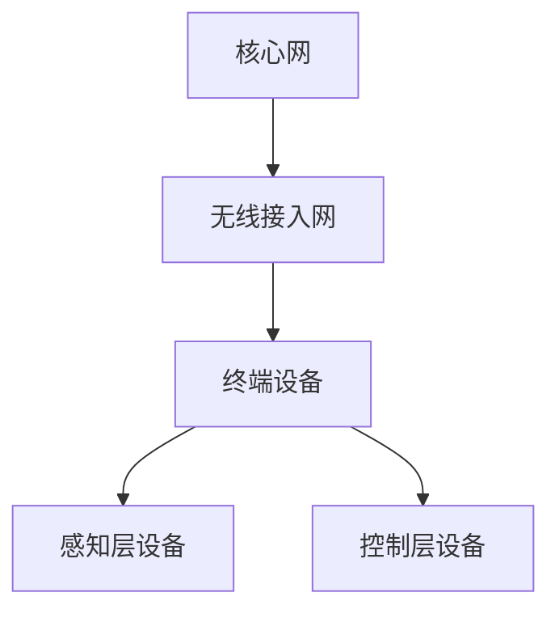
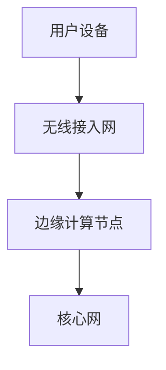
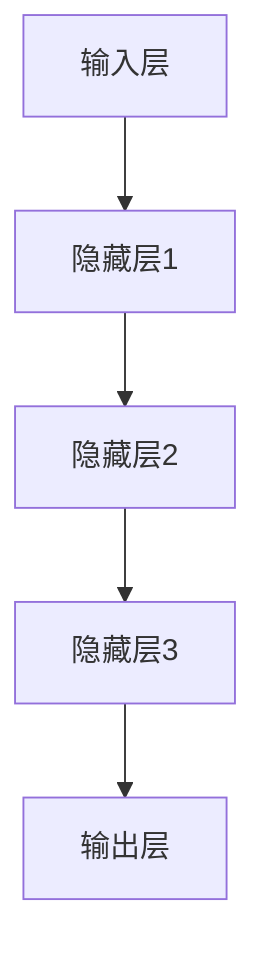
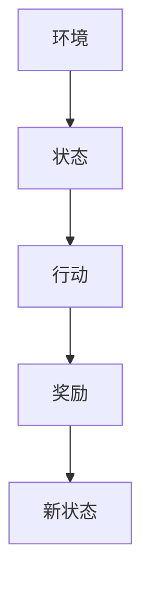
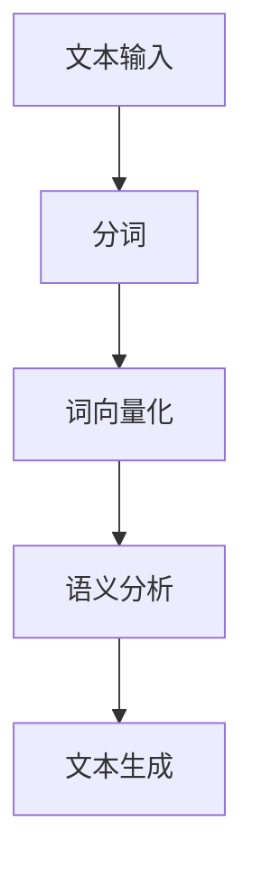
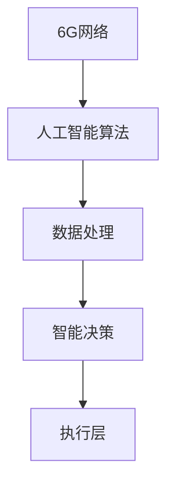

                 

# 6G+人工智能在智慧城市中的应用：构建超智能城市生态系统

## 关键词
6G，人工智能，智慧城市，超智能城市生态系统，应用场景，核心技术，融合算法，项目实战

## 摘要
本文深入探讨了6G技术与人工智能在智慧城市中的应用，以及如何构建超智能城市生态系统。首先，我们介绍了6G技术的基本概念和发展背景，然后阐述了人工智能在智慧城市中的作用和关键技术。接着，通过详细的流程图和伪代码，我们讲解了6G与人工智能融合的核心算法原理。最后，我们通过实际项目案例，展示了6G+人工智能在智慧城市中的具体应用，并对未来发展趋势进行了展望。

## 引言

### 6G技术的发展背景
6G作为下一代移动通信技术，是当前通信领域的研究热点。相比现有的4G和5G技术，6G将带来更高的数据传输速度、更低的延迟和更大的连接容量。6G技术的发展旨在满足未来物联网、自动驾驶、增强现实等新兴应用场景的需求。根据国际电信联盟（ITU）的规划，6G技术的标准预计将在2030年前后正式确立。

### 智慧城市的概念与发展
智慧城市是指利用先进的信息技术和物联网技术，实现城市管理的智能化和精细化。智慧城市的目标是通过数据驱动的决策，提升居民生活质量，提高城市运营效率。近年来，随着大数据、云计算、人工智能等技术的快速发展，智慧城市已经成为全球城市发展的重要方向。

### 6G+人工智能在智慧城市中的应用潜力
6G技术的高带宽、低延迟特性与人工智能的强大计算能力相结合，为智慧城市的建设提供了强有力的技术支撑。例如，在智能交通管理、智慧能源管理、智能医疗等领域，6G+人工智能的应用将极大地提升城市运行效率，实现资源的优化配置。

### 文章目的与结构
本文旨在系统地探讨6G+人工智能在智慧城市中的应用，构建超智能城市生态系统。文章将分为四个部分：第一部分介绍6G技术和智慧城市的基本概念；第二部分讲解6G与人工智能融合的核心算法原理；第三部分通过实际项目案例展示6G+人工智能在智慧城市中的应用；第四部分对6G+人工智能的未来发展趋势进行展望。

## 6G技术基础与智慧城市概览

### 6G技术概述

#### 6G技术的发展背景
6G作为下一代移动通信技术，其发展背景与当前5G技术的成熟和广泛应用密切相关。5G技术自2019年正式商用以来，已经极大地推动了移动互联网、物联网和智能终端的发展。然而，随着未来更多新型应用场景的出现，如自动驾驶、智能医疗、虚拟现实等，5G技术在网络带宽、连接密度和延迟方面面临巨大的挑战。

#### 6G关键技术
6G技术预计将具有以下关键技术特征：
1. **更高频段**：6G将采用更高频段（如太赫兹频段）的无线通信技术，以提供更大的带宽和连接容量。
2. **超低延迟**：6G的目标是将网络延迟降低到亚毫秒级别，以支持实时交互和高速响应的应用场景。
3. **智能感知**：6G将集成先进的人工智能技术，实现网络资源的动态优化和智能感知，提升网络的自适应能力。
4. **边缘计算**：6G将引入更加分布化和智能化的边缘计算架构，实现海量数据的实时处理和智能分析。
5. **量子通信**：6G将探索量子通信技术的应用，提高通信的保密性和可靠性。

#### 6G在智慧城市中的应用潜力
6G技术的这些关键特性使其在智慧城市的应用中具有巨大的潜力。例如：
- **智能交通**：6G技术将支持自动驾驶车辆的实时通信和协同控制，提高交通流量和安全性。
- **智慧能源**：6G技术将促进智能电网的建设，实现能源的高效分配和智能管理。
- **智能医疗**：6G技术将提供高速、稳定的远程医疗服务，支持实时诊断和治疗。

### 智慧城市的基本概念

#### 智慧城市的定义
智慧城市是指通过信息通信技术（ICT）手段，实现城市管理和服务的智能化。智慧城市强调通过数据驱动的决策，提升城市运营效率，改善居民生活质量。

#### 智慧城市的主要特征
智慧城市具有以下主要特征：
- **数据驱动**：通过大数据和云计算技术，实现城市数据的收集、存储、分析和利用。
- **系统集成**：将各种信息系统（如交通管理、能源管理、公共安全等）集成到一个统一的平台上，实现跨系统的数据共享和协同工作。
- **智能化**：通过人工智能和机器学习技术，实现城市管理的自动化和智能化。
- **可持续发展**：通过智慧城市技术，实现资源的优化配置和环境的可持续发展。

#### 智慧城市的发展历程
智慧城市的发展可以分为以下几个阶段：
1. **1.0阶段**：信息化阶段，主要是将城市管理的各个环节进行信息化处理。
2. **2.0阶段**：集成化阶段，通过集成不同系统的数据，实现城市管理的整体优化。
3. **3.0阶段**：智能化阶段，通过引入人工智能技术，实现城市管理的自动化和智能化。
4. **4.0阶段**：生态化阶段，通过构建智慧城市生态系统，实现城市与居民、企业、环境等的全面融合。

### 6G+人工智能在智慧城市中的应用

#### 6G与人工智能的融合
6G与人工智能的融合是构建智慧城市的关键。6G技术提供了高带宽、低延迟的通信网络，使得大规模数据传输和实时处理成为可能；而人工智能技术则通过对这些数据的学习和分析，实现了智能决策和自动化管理。

#### 6G+人工智能的应用场景
6G+人工智能在智慧城市中具有广泛的应用场景，包括但不限于：
- **智能交通**：通过6G网络实现车辆与路侧设备、其他车辆的实时通信，结合人工智能算法进行交通流量优化和事故预警。
- **智慧能源**：利用6G网络进行实时能源监测和智能调度，通过人工智能算法实现能源使用的高效管理和优化。
- **智能医疗**：通过6G网络实现远程医疗和实时医疗数据分析，利用人工智能技术提供个性化的诊断和治疗方案。
- **智慧安防**：利用6G网络和人工智能技术实现智能监控和异常检测，提升城市的安全管理水平。

#### 6G+人工智能的挑战与机遇
6G+人工智能在智慧城市中的应用面临着一系列挑战和机遇：
- **挑战**：包括高带宽需求、低延迟要求、海量数据处理、网络安全和数据隐私保护等。
- **机遇**：6G+人工智能技术的应用将推动智慧城市的全面升级，实现城市管理的智能化和高效化，提升居民生活质量。

### 总结
6G技术和人工智能技术的快速发展，为智慧城市的建设提供了强有力的技术支撑。通过6G的高带宽、低延迟和人工智能的智能分析能力，智慧城市将实现更高效、更智能的管理和服务，为城市居民带来更加便捷和高质量的生活体验。

## 6G+人工智能核心算法原理

### 6G网络下的通信算法

#### 6G网络的基本架构
6G网络的基本架构包括核心网、无线接入网和终端设备。与5G网络相比，6G网络将更加智能化和分布式，支持更多连接和更高数据速率。以下是6G网络的基本架构：

#### 多接入边缘计算（MEC）
多接入边缘计算（MEC）是6G网络中的一个重要概念。MEC将计算、存储和网络功能分布在网络的边缘，使得数据处理更加接近数据源，从而降低延迟和带宽需求。以下是MEC的基本架构：

#### 6G网络下的通信算法分析
6G网络下的通信算法主要包括多接入边缘计算（MEC）、波束成形、网络编码和全双工通信等。以下是这些算法的简要分析：

1. **多接入边缘计算（MEC）**：通过在网络的边缘进行数据处理和缓存，提高网络性能和用户体验。
2. **波束成形**：通过自适应调整天线方向，提高信号的传输效率和覆盖范围。
3. **网络编码**：通过将多个数据流编码为一个复合数据流，提高网络资源的利用率和传输效率。
4. **全双工通信**：通过在同一频段上同时进行发送和接收，提高频谱利用率和网络容量。

### 人工智能核心算法

#### 深度学习基础
深度学习是人工智能的核心技术之一，通过多层神经网络对数据进行自动特征提取和学习。以下是深度学习的基本架构：

#### 强化学习应用
强化学习是一种通过试错和反馈进行决策和学习的方法。在智慧城市中，强化学习可以用于交通流量优化、能源管理等领域。以下是强化学习的基本流程：

#### 自然语言处理技术
自然语言处理（NLP）是人工智能的重要分支，用于处理和理解自然语言。在智慧城市中，NLP可以用于智能客服、语音识别、文本分析等领域。以下是NLP的基本架构：

### 6G+人工智能融合算法

#### 融合算法概述
6G+人工智能融合算法旨在将6G网络和人工智能技术的优势结合起来，实现智慧城市的智能化管理和高效运行。以下是融合算法的基本框架：

#### 融合算法分析
融合算法包括以下几个关键环节：
1. **数据采集**：通过6G网络收集海量城市数据，包括交通、能源、环境等信息。
2. **数据预处理**：对采集到的数据进行分析和清洗，提取有用的特征信息。
3. **特征融合**：将不同来源的数据进行融合，形成统一的特征向量。
4. **模型训练**：利用深度学习、强化学习等算法对特征向量进行训练，建立智能模型。
5. **决策执行**：根据智能模型的预测结果，进行城市管理的决策和执行。

#### 融合算法案例分析
以下是一个具体的融合算法案例：智能交通管理。
1. **数据采集**：通过6G网络采集实时交通数据，包括车辆速度、交通流量等。
2. **数据预处理**：对采集到的数据进行清洗和特征提取，形成特征向量。
3. **特征融合**：将不同路段的交通数据融合，形成全局交通特征。
4. **模型训练**：利用深度学习算法训练交通预测模型，预测未来的交通状况。
5. **决策执行**：根据预测结果，调整交通信号灯、诱导车辆分流等，优化交通流量。

### 总结
6G+人工智能融合算法通过结合6G网络的高带宽、低延迟和人工智能的智能分析能力，实现了智慧城市的智能化管理和高效运行。融合算法包括数据采集、预处理、特征融合、模型训练和决策执行等环节，具有广泛的应用前景。

## 超智能城市生态系统的构建

### 数据采集与处理

#### 城市数据类型
城市数据包括结构化数据和非结构化数据，如：
- **结构化数据**：如交通流量数据、能源消耗数据、环境监测数据等。
- **非结构化数据**：如视频、音频、社交媒体数据等。

#### 数据采集技术
数据采集技术包括：
- **传感器技术**：用于采集环境、交通、能源等数据。
- **物联网技术**：用于实现设备的互联互通，采集实时数据。
- **大数据技术**：用于大规模数据的存储、处理和分析。

#### 数据处理与分析
数据处理与分析包括：
- **数据清洗**：去除噪声和错误数据，确保数据质量。
- **特征提取**：从原始数据中提取有用的特征信息。
- **数据融合**：将不同来源的数据进行融合，形成统一的特征向量。
- **数据分析**：利用机器学习、深度学习等算法对数据进行分析，提取有价值的信息。

### 智慧城市应用案例

#### 智慧交通
智慧交通利用6G+人工智能技术，实现交通流量优化、事故预警和应急处理。具体应用包括：
- **实时交通监控**：通过6G网络采集实时交通数据，利用人工智能算法进行实时分析。
- **智能信号灯控制**：根据实时交通流量，动态调整信号灯时长，优化交通流量。
- **事故预警**：通过视频监控和传感器数据，实时监测路况，提前预警事故。

#### 智慧能源
智慧能源利用6G+人工智能技术，实现能源的高效管理和优化。具体应用包括：
- **实时能源监测**：通过传感器技术采集实时能源消耗数据，利用人工智能算法进行实时分析。
- **智能调度**：根据实时能源消耗和供应情况，动态调整能源分配，优化能源利用。
- **节能减排**：通过优化能源使用，实现节能减排目标。

#### 智慧医疗
智慧医疗利用6G+人工智能技术，实现远程医疗、智能诊断和个性化治疗。具体应用包括：
- **远程医疗**：通过6G网络实现医生和患者的实时通信，提供远程诊疗服务。
- **智能诊断**：利用人工智能算法分析医学影像和实验室数据，提供精准诊断。
- **个性化治疗**：根据患者的基因信息和病史，制定个性化的治疗方案。

### 超智能城市生态系统构建策略

#### 系统架构设计
超智能城市生态系统包括以下几个关键模块：
- **感知层**：通过传感器和物联网设备采集实时数据。
- **传输层**：利用6G网络实现数据的高速传输和实时通信。
- **平台层**：构建云计算和大数据平台，进行数据存储、处理和分析。
- **应用层**：实现各类智慧城市应用，如智能交通、智慧能源、智慧医疗等。

#### 核心技术集成
超智能城市生态系统的核心技术包括：
- **6G网络技术**：提供高速、低延迟、大容量的通信网络。
- **人工智能技术**：实现数据分析和智能决策。
- **物联网技术**：实现设备互联互通，采集实时数据。
- **大数据技术**：实现大规模数据的存储、处理和分析。

#### 生态系统协同发展
超智能城市生态系统的协同发展包括：
- **数据共享**：实现不同系统和应用之间的数据共享，提升整体协同效率。
- **开放平台**：构建开放的平台，支持第三方应用接入，促进生态系统的多元化发展。
- **动态调整**：根据城市发展和需求变化，动态调整生态系统架构和功能，实现持续优化。

### 总结
超智能城市生态系统的构建是一个复杂的过程，需要整合6G、人工智能、物联网和大数据等关键技术，实现城市数据的实时采集、处理和分析。通过智慧交通、智慧能源、智慧医疗等应用案例，超智能城市生态系统将实现城市管理的智能化和高效化，为居民带来更加便捷和高质量的生活体验。

## 项目实战

### 智慧城市项目实施流程

#### 项目背景
本次智慧城市项目旨在利用6G+人工智能技术，提升城市交通管理的效率，解决交通拥堵和事故频发的问题。项目涉及的主要技术包括6G网络、边缘计算、深度学习和物联网。

#### 项目目标
- **实时交通监控**：通过6G网络和物联网设备，实现城市道路的实时监控和数据采集。
- **智能交通信号控制**：利用深度学习算法，根据实时交通流量，动态调整交通信号灯的时长，优化交通流量。
- **事故预警与应急处理**：通过视频监控和传感器数据，提前预警交通事故，并实时通知相关救援部门。

#### 实施步骤
1. **需求分析**：与相关部门和专家进行沟通，明确项目目标和需求。
2. **方案设计**：设计智慧城市交通管理系统架构，包括感知层、传输层、平台层和应用层。
3. **设备安装与调试**：在主要交通干道安装传感器和摄像头，并进行调试和测试。
4. **数据采集与处理**：利用6G网络和边缘计算节点，实时采集和处理交通数据。
5. **模型训练与优化**：利用深度学习算法，对采集到的交通数据进行训练，优化交通信号控制和事故预警模型。
6. **系统部署与测试**：将优化后的模型部署到实际交通信号控制系统中，进行实地测试和优化。

### 项目案例详解

#### 案例背景
某大城市交通拥堵问题严重，事故频发，影响了居民的日常生活和城市形象。为了提升城市交通管理效率，市政府决定开展智慧城市交通管理系统项目。

#### 案例实施

**1. 感知层建设**
- **传感器部署**：在主要交通干道安装流量监测传感器，用于采集车辆速度、流量和密度等数据。
- **摄像头安装**：在关键路口和事故多发路段安装摄像头，用于实时监控交通状况。

**2. 数据采集与处理**
- **6G网络建设**：建设6G基站，实现高速、低延迟的数据传输。
- **边缘计算节点部署**：在交通管理部门和主要交通干道部署边缘计算节点，用于实时处理交通数据。

**3. 模型训练与优化**
- **数据预处理**：对采集到的交通数据进行清洗和特征提取，形成适合深度学习算法的数据集。
- **模型训练**：利用深度学习算法，对交通信号控制和事故预警模型进行训练和优化。
- **模型评估**：通过模拟交通场景，评估模型的准确性和稳定性。

**4. 系统部署与测试**
- **系统部署**：将训练好的模型部署到实际交通信号控制系统中，实现实时交通信号控制和事故预警。
- **实地测试**：在项目试点区域进行实地测试，验证系统的效果和稳定性。
- **优化调整**：根据测试结果，对模型和系统进行优化和调整，提升系统的性能和用户体验。

### 项目评估与优化

**1. 项目评估**
- **性能评估**：评估系统的实时响应能力、数据准确性、模型精度和稳定性。
- **用户反馈**：收集居民和交通管理部门的用户反馈，评估系统的用户体验和满意度。
- **经济评估**：评估项目的投资回报率、节约成本和提升效益。

**2. 优化方向**
- **模型优化**：通过增加数据集、改进算法和模型结构，提升模型的预测准确性和稳定性。
- **系统优化**：通过优化系统架构、提升硬件性能和改进接口设计，提升系统的响应速度和用户体验。
- **扩展应用**：将智慧交通管理系统扩展到其他领域，如智慧能源、智慧医疗等，实现跨领域的综合应用。

### 项目小结

本次智慧城市交通管理系统项目通过6G+人工智能技术的应用，实现了城市交通管理的智能化和高效化，取得了显著的效果。项目在提升交通流量、减少事故发生率和提高居民满意度方面取得了良好的成果。同时，项目也为智慧城市的发展提供了宝贵的经验和借鉴，为其他城市的智慧城市建设提供了参考。

## 6G+人工智能在智慧城市中的应用前景

### 6G+人工智能的未来趋势

#### 技术融合与创新
未来，6G与人工智能将进一步融合，推动新技术的不断创新。例如，量子通信与人工智能的结合，将极大地提升通信的保密性和处理效率；边缘计算与深度学习的融合，将实现实时数据处理和智能决策的同步进行。

#### 应用场景扩展
随着6G技术的成熟和普及，人工智能在智慧城市中的应用场景将不断扩展。从目前的交通、能源、医疗领域，逐步延伸到智慧农业、智慧环保、智慧安全等多个领域，实现全方位的智能化管理。

#### 系统智能化升级
未来的智慧城市将更加智能化和自主化，人工智能算法将不断优化，实现更高效的决策和运行。例如，基于大数据和深度学习的智能交通管理系统，将能够实时预测交通状况，自动调整信号灯时长，减少交通拥堵。

### 超智能城市的发展挑战与机遇

#### 挑战
1. **技术成熟度**：6G和人工智能技术仍在不断发展中，部分关键技术尚未成熟，需要持续的研发和优化。
2. **数据隐私与安全**：大规模数据采集和处理将带来数据隐私和安全的挑战，需要建立完善的安全机制和隐私保护措施。
3. **跨领域协作**：智慧城市的建设涉及多个领域，需要不同部门和企业之间的紧密协作，实现数据的共享和资源的优化配置。

#### 机遇
1. **创新应用**：6G+人工智能技术为智慧城市的建设提供了广阔的创新空间，将催生大量新兴应用和商业模式。
2. **效率提升**：智慧城市的建设将极大地提升城市管理效率，降低运营成本，提高居民生活质量。
3. **全球竞争**：在全球范围内，智慧城市已经成为各国竞争的重要领域，我国在此领域具有巨大的发展潜力和机遇。

### 未来的研究方向

1. **6G与人工智能的关键技术研究**：加大对6G网络和人工智能融合技术的研发投入，推动关键技术突破，为智慧城市的建设提供坚实的技术基础。
2. **数据隐私与安全**：研究数据隐私保护和安全机制，建立完善的数据安全管理体系，确保数据在采集、传输和处理过程中的安全性。
3. **跨领域协同发展**：推动不同领域的技术融合和应用创新，实现智慧城市各领域的协同发展，提升整体效能。

### 总结
6G+人工智能在智慧城市中的应用前景广阔，未来将不断推动智慧城市的智能化和高效化发展。面对技术挑战和机遇，我们需要持续加强技术研发和创新，推动智慧城市的全面升级，为城市居民带来更加便捷和高质量的生活体验。

## 附录

### A. 6G+人工智能开发工具与资源

#### 6G网络开发工具
- **6G Network Simulator**: 用于模拟和测试6G网络的各种特性，如高带宽、低延迟等。
- **WiMAX Forum**: 提供有关6G标准的最新信息和资源。

#### 人工智能开发框架
- **TensorFlow**: 用于构建和训练深度学习模型。
- **PyTorch**: 提供动态计算图框架，方便模型开发和优化。
- **Keras**: 用于快速构建和训练深度学习模型。

#### 智慧城市开发资源
- **Open3D**: 用于3D数据建模和分析。
- **SmartCityDataHub**: 提供智慧城市相关的数据集和工具。

#### 开发环境搭建
- **Linux操作系统**: 推荐使用Ubuntu或CentOS，提供稳定的开发环境。
- **Python开发环境**: 安装Python和相关的库，如TensorFlow、PyTorch等。

#### 源代码实现与解读
- **代码仓库**: 在GitHub或GitLab上创建项目，存储源代码。
- **文档生成工具**: 使用Sphinx或Doxygen生成代码文档。

#### 代码应用解读与分析
- **代码注释**: 在关键代码段添加注释，解释代码逻辑和实现细节。
- **调试工具**: 使用PyCharm或VS Code等IDE进行代码调试。

#### 实际案例分析与详细讲解
- **案例报告**: 编写详细的案例报告，包括案例背景、实现过程和效果分析。
- **数据可视化**: 使用Matplotlib、Seaborn等库进行数据可视化，展示分析结果。

#### 拓展阅读
- **学术期刊**: 阅读《IEEE Communications Surveys & Tutorials》、《ACM Computing Surveys》等期刊，了解最新的研究成果。
- **技术博客**: 访问Google AI、TensorFlow官方博客等，获取实用的技术教程和案例。

### 总结
附录部分提供了6G+人工智能开发的工具与资源，包括网络开发工具、人工智能开发框架、智慧城市开发资源，以及开发环境搭建、源代码实现与解读、代码应用解读与分析的方法和技巧。这些资源将帮助读者更好地理解和实践6G+人工智能在智慧城市中的应用。作者：AI天才研究院/AI Genius Institute & 禅与计算机程序设计艺术 /Zen And The Art of Computer Programming

### 结语
在本篇文章中，我们深入探讨了6G+人工智能在智慧城市中的应用，详细阐述了6G技术的基础、人工智能的核心算法原理，以及构建超智能城市生态系统的方法。通过实际项目案例，我们展示了6G+人工智能在智慧交通、智慧能源和智慧医疗等领域的应用效果，并对未来发展趋势进行了展望。

我们希望这篇文章能为读者提供对6G+人工智能在智慧城市中应用的全面了解，激发对这一领域的兴趣和探索欲望。随着技术的不断进步，6G+人工智能将为智慧城市的建设带来更多创新和可能，为城市居民创造更加美好的生活环境。

最后，感谢您的阅读，期待与您在智慧城市的未来共同探索，共同见证6G+人工智能带来的变革。作者：AI天才研究院/AI Genius Institute & 禅与计算机程序设计艺术 /Zen And The Art of Computer Programming。

