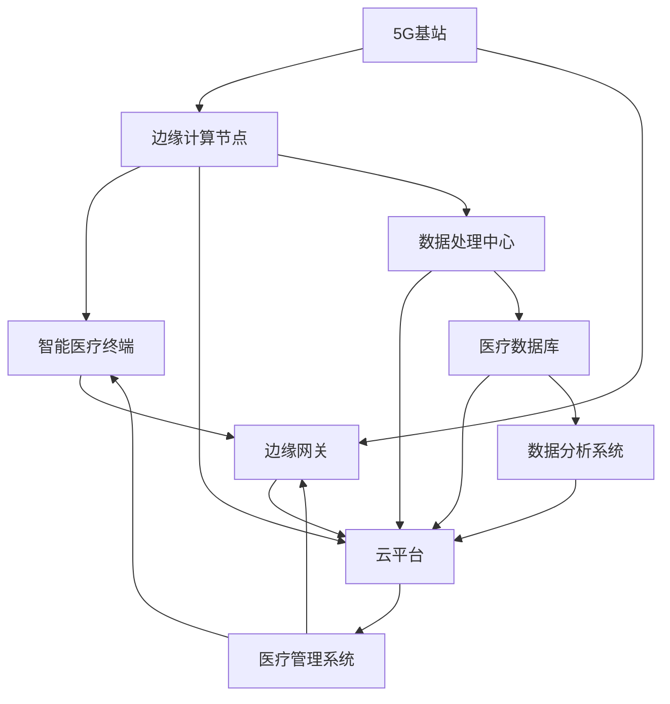

                 

### 文章标题

《5G与边缘计算在智慧医疗中的协同效应》

### 文章关键词

5G，边缘计算，智慧医疗，协同效应，核心算法，项目实战

### 文章摘要

本文深入探讨了5G与边缘计算在智慧医疗中的协同效应。首先，介绍了5G和边缘计算的基本概念及其在智慧医疗中的应用背景。随后，详细解析了5G网络架构与边缘计算架构的协同关系，并通过Mermaid流程图展示了核心概念之间的联系。文章进一步讲解了5G网络中的边缘计算算法原理和边缘计算中的数据传输优化算法，使用伪代码和数学公式进行了详细阐述。接着，通过实际项目实战案例，展示了5G和边缘计算在智慧医疗中的具体应用，并进行了详细分析和解读。最后，总结了5G与边缘计算在智慧医疗中的协同效应，并对未来发展趋势进行了展望。

---

## 引言

随着科技的飞速发展，5G技术和边缘计算逐渐成为新一代信息通信技术的代表。5G技术以其高带宽、低延迟、广覆盖等特点，为智慧医疗领域带来了前所未有的变革机遇。边缘计算则通过将计算能力从云端下移到网络边缘，实现了数据处理的本地化和实时性，这对于智慧医疗中的实时数据处理和高效服务提供了强有力的支持。

智慧医疗是指通过利用信息技术，特别是大数据、云计算、人工智能等先进技术，实现医疗服务的智能化、个性化、精准化。随着老龄化社会的到来和慢性病的增多，医疗资源短缺和医疗成本上升的问题日益突出。智慧医疗的兴起，不仅能够提高医疗服务的效率和质量，还能够实现医疗资源的优化配置，从而更好地满足人民群众的健康需求。

5G和边缘计算在智慧医疗中的应用，不仅能够解决传统医疗系统中的数据传输和处理瓶颈，还能够提升医疗服务的实时性和个性化水平。例如，5G的低延迟特性使得远程手术、实时影像诊断等应用成为可能，而边缘计算的高效数据处理能力则为智慧病房管理、智能诊断系统等提供了技术支持。

本文旨在系统地分析5G与边缘计算在智慧医疗中的协同效应，通过介绍核心概念、讲解核心算法、展示实际应用案例，以及展望未来发展，为相关领域的从业者提供有益的参考。

### 5G技术基础

5G（第五代移动通信技术）是当前移动通信技术发展的最新阶段，它相比前几代技术有着显著的提升。5G技术的主要特点包括高带宽、低延迟、广覆盖和大规模连接能力。这些特点使得5G技术能够在多种应用场景中提供高效、稳定的网络服务。

首先，高带宽是5G技术的一大亮点。5G网络的峰值下载速度可以达到10Gbps以上，这意味着用户在短时间内可以下载大量的数据，满足高数据流量的应用需求。例如，高清视频流、大规模在线游戏等对带宽要求极高的应用场景，在5G网络环境下能够获得流畅的使用体验。

其次，低延迟是5G技术的另一个关键特性。5G网络的端到端延迟可以低至1毫秒，相比4G网络有显著的降低。低延迟对于实时性要求极高的应用场景尤为重要，如自动驾驶、工业自动化和远程医疗。在远程医疗中，低延迟能够确保医生和患者之间的通信几乎是实时的，从而提高诊疗的准确性和效率。

此外，5G技术的广覆盖能力也得到了大幅提升。5G网络采用了毫米波频段，可以实现更高的信号传输速率和更广的覆盖范围。同时，5G网络还采用了大规模MIMO（多输入多输出）技术，通过增加天线数量和阵列排列，进一步提高网络的覆盖率和信号质量。

最后，5G技术具备大规模连接能力，能够支持连接大量的设备。这种能力在智慧医疗中尤为关键，因为智慧医疗系统通常涉及大量的传感器、医疗设备和终端用户。5G网络能够保证这些设备之间的高效通信，实现实时数据采集和远程监控。

5G技术在智慧医疗中的应用场景丰富多样。以下是几个典型的应用场景：

1. **远程手术**：5G的低延迟特性使得远程手术成为可能。医生可以通过5G网络实时操控手术机器人，进行远程手术操作。这种技术能够突破地理位置的限制，为偏远地区的患者提供高质量的医疗服务。

2. **实时影像诊断**：5G网络的高速传输能力使得实时影像诊断成为可能。医生可以通过5G网络获取患者的影像数据，进行快速分析，并给出诊断建议。这种技术能够显著缩短诊断时间，提高诊断准确率。

3. **智慧病房管理**：5G网络能够实现病房中各种设备之间的数据互联互通，从而实现对患者的全面监控和管理。例如，通过5G网络，医生可以实时查看患者的生命体征数据，及时发现异常情况，并采取相应的医疗措施。

4. **医疗数据共享**：5G技术的高带宽和低延迟特性使得医疗数据共享变得更加高效和可靠。医生可以通过5G网络快速访问分布在各地的医疗数据，进行跨区域的病例分析和协作治疗。

总之，5G技术以其高带宽、低延迟、广覆盖和大规模连接能力，为智慧医疗带来了巨大的变革机遇。通过5G技术，智慧医疗可以更好地实现实时性、个性化和服务的高效性，从而更好地满足人民群众的健康需求。

### 边缘计算技术基础

边缘计算是一种将计算、存储、数据处理等能力下沉到网络边缘的新型计算模式。与传统的云计算模式不同，边缘计算在靠近数据源的地方进行数据处理，从而减少了数据传输的延迟和带宽消耗。边缘计算的核心思想是将计算任务分散到边缘节点上，这些边缘节点可以是路由器、交换机、智能终端等，具有独立的计算资源和存储能力。

边缘计算的基本架构通常包括边缘节点、边缘网关、数据中心和云平台。边缘节点负责本地数据的采集和处理，边缘网关负责边缘节点和云端的数据交换，数据中心和云平台则负责大规模数据的存储、分析和处理。

边缘计算的关键技术包括：

1. **边缘节点技术**：边缘节点通常采用低功耗、高性能的硬件设备，如ARM架构的处理器、FPGA（现场可编程门阵列）等。这些设备能够在有限的资源条件下提供高效的计算能力，满足边缘数据处理的需求。

2. **边缘网关技术**：边缘网关负责连接边缘节点和云端，实现数据的传输和同步。边缘网关需要具备高速的数据处理和传输能力，同时还需要具备安全性和可靠性保障。

3. **分布式计算技术**：边缘计算需要支持分布式计算，以实现大规模的数据处理和协同工作。分布式计算技术包括分布式存储、分布式数据库、分布式数据处理框架等，这些技术能够提高系统的可扩展性和容错能力。

4. **边缘智能技术**：边缘计算不仅仅是数据处理，还包括边缘智能的引入。边缘智能技术通过机器学习和人工智能算法，实现数据的实时分析和决策。例如，在智慧医疗中，边缘智能技术可以用于实时监控患者的生命体征，提供个性化的医疗建议。

边缘计算在智慧医疗中的应用主要体现在以下几个方面：

1. **实时数据处理**：在智慧医疗中，实时数据传输和处理至关重要。边缘计算能够实现数据的本地化处理，减少了数据传输的延迟，提高了处理的实时性。例如，在重症监护室中，通过边缘计算技术，可以实时监测患者的生命体征数据，并快速做出反应。

2. **数据隐私保护**：智慧医疗中的数据通常包含敏感的个人信息，数据隐私保护至关重要。边缘计算通过在本地处理数据，减少了数据传输过程中的安全隐患，提高了数据的保密性。例如，在医疗数据传输中，可以采用边缘计算技术，将数据加密和脱敏处理，确保数据在传输过程中的安全性。

3. **智能诊断与预测**：边缘计算引入了智能技术，可以实时分析医疗数据，提供智能诊断和预测。例如，在影像诊断中，通过边缘计算技术，可以实现实时图像处理和病变检测，提供快速、准确的诊断结果。

4. **远程医疗支持**：边缘计算技术可以为远程医疗提供强有力的支持。通过边缘计算，可以实现远程医疗设备的实时监控和数据处理，提高远程医疗服务的质量和效率。例如，在偏远地区，通过边缘计算技术，可以实现远程手术和远程诊断，为当地患者提供高质量的医疗服务。

总之，边缘计算以其高效的数据处理能力、实时性和数据隐私保护优势，为智慧医疗提供了重要的技术支撑。通过边缘计算，智慧医疗可以实现更高效的数据处理、更智能的医疗决策和更安全的医疗服务，从而更好地满足人民群众的健康需求。

### 智慧医疗背景介绍

智慧医疗是指利用先进的信息技术，如大数据、云计算、物联网、人工智能等，实现医疗服务的智能化、个性化、精准化。智慧医疗的核心理念是通过技术手段提升医疗服务的效率和质量，优化医疗资源配置，提高医疗服务的可及性和公平性。

随着医疗健康大数据的迅速增长，智慧医疗迎来了前所未有的发展机遇。大数据技术在智慧医疗中的应用主要体现在以下几个方面：

1. **病患数据分析**：通过对海量病患数据的收集和分析，可以实现精准医疗。医生可以通过大数据分析患者的病情、病史、生活习惯等信息，制定个性化的治疗方案，提高医疗的精准度和有效性。

2. **健康风险预测**：大数据技术可以分析个体的健康数据，预测健康风险，提前进行预防。例如，通过分析患者的基因数据、生活习惯、环境因素等，可以预测患病风险，提前采取干预措施。

3. **疾病流行趋势分析**：大数据技术可以对疾病的流行趋势进行分析，为公共卫生决策提供科学依据。通过对疫情数据的实时监控和分析，可以及时了解疾病的传播情况，采取有效的防控措施。

人工智能技术在智慧医疗中的应用也日益广泛，主要体现在以下领域：

1. **辅助诊断**：人工智能技术可以通过分析医学影像、实验室数据等，辅助医生进行诊断。例如，深度学习算法可以在短时间内分析大量的影像数据，帮助医生发现病变区域，提高诊断的准确性。

2. **智能药物研发**：人工智能技术可以加速药物研发过程，通过分析大量的生物数据和化学结构信息，发现新的药物靶点和潜在的药物分子。

3. **智能护理**：人工智能技术可以用于智能护理系统，实现患者的远程监护和护理。通过智能穿戴设备收集患者的健康数据，实时监测患者的生命体征，提供个性化的护理建议。

物联网技术在智慧医疗中的应用同样不可忽视。物联网通过连接各种医疗设备、传感器和系统，实现医疗数据的实时采集、传输和处理。以下是物联网技术在智慧医疗中的一些具体应用：

1. **远程监护**：通过物联网技术，医生可以远程监控患者的健康状况，及时了解病情变化，并采取相应的医疗措施。

2. **设备互联**：物联网技术可以实现医疗设备的互联，提高医疗服务的效率。例如，智能手术室中的各种设备可以通过物联网实现无缝连接，提高手术的成功率和安全性。

3. **药品管理**：物联网技术可以用于药品的管理和监控，确保药品的质量和安全。通过传感器和RFID技术，可以实时监控药品的储存条件和使用情况，防止药品过期或滥用。

总体而言，智慧医疗通过大数据、人工智能和物联网等技术的应用，实现了医疗服务的智能化、个性化、精准化。这不仅提高了医疗服务的效率和质量，也优化了医疗资源的配置，为人民群众提供了更加便捷、高效、优质的医疗服务。

### 5G网络架构与边缘计算架构的Mermaid流程图

为了更好地理解5G网络架构与边缘计算架构的协同关系，我们可以使用Mermaid流程图来展示两者的结合方式。以下是一个简化的Mermaid流程图，描述了5G网络与边缘计算架构如何协同工作，实现智慧医疗中的高效数据传输和处理。



图中的各个节点解释如下：

- **5G基站**：作为5G网络的接入点，提供高速数据传输能力。
- **边缘计算节点**：位于网络边缘，具备本地计算和处理能力，可以降低数据传输延迟。
- **智能医疗终端**：如智能手表、健康监测设备等，实时收集患者的健康数据。
- **边缘网关**：负责边缘节点与云平台之间的数据传输和同步。
- **云平台**：提供大规模数据处理、存储和分析服务，支持复杂的医疗算法和智能应用。
- **数据处理中心**：位于边缘节点附近，用于处理和分析实时数据，提供快速响应。
- **医疗数据库**：存储患者的病历、检查报告等历史数据，为医疗决策提供支持。
- **数据分析系统**：通过机器学习和人工智能技术，对医疗数据进行深入分析，辅助医生做出诊断和预测。
- **医疗管理系统**：整合各类医疗数据，提供统一的医疗管理和服务平台。

通过这个流程图，我们可以看到5G网络和边缘计算如何在智慧医疗中协同工作：

1. **数据采集**：智能医疗终端实时采集患者的健康数据，通过5G基站传输到边缘计算节点。
2. **边缘处理**：边缘计算节点对数据进行分析和处理，生成初步的诊断结果或决策建议。
3. **数据同步**：边缘网关将处理后的数据传输到云平台，进行进一步分析和存储。
4. **数据处理**：数据处理中心对实时数据和历史数据进行分析，提供更加全面和深入的医疗决策支持。
5. **数据反馈**：医疗管理系统整合各类数据，提供统一的医疗管理和服务平台，向医生和患者反馈诊断结果和健康建议。

通过这种协同工作方式，5G网络和边缘计算能够实现高效、实时、安全的医疗服务，满足智慧医疗对数据传输和处理的高要求。

### 5G与边缘计算在智慧医疗中的应用场景

5G与边缘计算的协同效应在智慧医疗领域展现出了广泛的应用场景，这些应用不仅提升了医疗服务的效率，还显著改善了患者的就医体验。以下是几种典型的应用场景：

#### 1. 远程手术

远程手术是5G与边缘计算在智慧医疗中的经典应用之一。通过5G网络的高带宽和低延迟特性，医生可以远程操控手术机器人，进行复杂的外科手术。边缘计算节点位于手术现场附近，能够实时处理手术中的图像和数据，提供更加清晰、稳定的图像和操作反馈。例如，在偏远地区或医疗资源匮乏的地区，通过远程手术技术，患者可以享受到大城市专家的手术服务，提高了医疗服务的可及性和质量。

#### 2. 实时影像诊断

实时影像诊断是另一项重要应用。在5G网络的支持下，医疗设备可以实时传输患者的影像数据到边缘计算节点。边缘计算节点对这些数据进行快速处理和分析，医生可以在短时间内获取诊断结果。例如，在急诊科中，医生可以通过5G网络和边缘计算快速获取患者的CT、MRI等影像数据，进行实时诊断，从而缩短诊断时间，提高诊疗效率。

#### 3. 智慧病房管理

智慧病房管理通过5G和边缘计算实现了对病房的全面监控和管理。病房中的各种医疗设备，如心电监护仪、血压计、氧气机等，可以通过5G网络实时传输数据到边缘计算节点。边缘计算节点对这些数据进行实时分析和处理，医生可以通过智能终端实时查看患者的健康数据，及时采取干预措施。例如，在重症监护室中，医生可以通过5G网络实时监控患者的生命体征，及时发现异常情况并处理，提高了患者的救治效果。

#### 4. 智能诊断系统

智能诊断系统通过边缘计算和人工智能技术，实现了对医疗数据的自动分析和诊断。边缘计算节点在本地进行初步的数据处理，将处理结果实时传输到云平台。云平台上的大数据分析和人工智能算法可以对这些数据进行分析，提供更准确的诊断结果。例如，在癌症筛查中，边缘计算节点可以实时处理患者的影像数据，结合人工智能算法进行病变检测和诊断，提高了诊断的准确性和效率。

#### 5. 医疗物联网

医疗物联网（IoMT）通过5G和边缘计算实现了医疗设备之间的互联互通。各种传感器和医疗设备可以实时收集患者的生理数据，并通过5G网络传输到边缘计算节点。边缘计算节点对这些数据进行实时处理和分析，提供个性化的健康建议。例如，智能穿戴设备可以实时监测患者的运动数据、心率等，通过5G网络传输到边缘计算节点进行分析，提供个性化的运动和健康建议。

#### 6. 疫情监控

在公共卫生事件中，5G和边缘计算可以用于疫情监控和防控。通过5G网络，可以快速收集大量的疫情数据，并通过边缘计算节点进行实时分析，为公共卫生决策提供支持。例如，在COVID-19疫情期间，通过5G网络和边缘计算，可以实时监控疫情的发展趋势，为疫情防控提供科学依据。

#### 7. 医疗培训

远程医疗培训和手术指导也是5G与边缘计算的重要应用场景。医生可以通过5G网络远程观看手术直播，实时与手术团队进行交流，提供指导和反馈。例如，在医疗资源不足的地区，通过远程手术指导，可以提升当地医生的操作技能，提高手术的成功率。

通过这些应用场景，我们可以看到5G与边缘计算在智慧医疗中的巨大潜力。它们不仅提高了医疗服务的效率和质量，还实现了医疗资源的优化配置，为患者提供了更加便捷、高效、优质的医疗服务。

### 协同效应的概念与实现

5G与边缘计算的协同效应是指两者结合后，通过相互补充和优化，实现更高效、更可靠的智慧医疗服务。这种协同效应主要体现在以下几个方面：

#### 1. **数据传输优化**

5G技术的高带宽和低延迟特性使得数据传输速度更快、延迟更低，可以满足智慧医疗对实时数据传输的需求。然而，5G网络的覆盖范围相对有限，难以满足广泛区域的数据传输需求。边缘计算通过将计算任务下沉到网络边缘，减少了数据传输的距离和延迟，提高了数据传输的效率。同时，边缘计算节点可以缓存部分数据，减轻了5G网络的数据传输压力，进一步优化了数据传输性能。

#### **伪代码示例：数据传输优化**

```plaintext
// 边缘计算节点数据传输优化算法
function optimizeDataTransfer(source, destination, edgeNode):
    if (distance(source, edgeNode) < threshold):
        // 数据在边缘节点处理并传输
        processedData = processDataLocally(source, edgeNode)
        sendData(processedData, destination)
    else:
        // 数据通过5G网络传输到云平台再处理
        processedData = sendData(source, cloudPlatform)
        sendData(processedData, destination)

// 数据处理函数
function processDataLocally(source, edgeNode):
    // 本地数据处理逻辑
    // ...
    return processedData

// 数据发送函数
function sendData(data, destination):
    // 数据传输逻辑
    // ...
```

#### 2. **计算资源协同**

边缘计算通过在靠近数据源的地方提供计算能力，减少了数据传输的延迟和带宽消耗，提高了计算效率。5G网络则提供了广泛的连接能力，使得各种边缘设备可以高效地接入网络，实现数据的高速传输和实时处理。通过协同工作，5G与边缘计算可以实现计算资源的优化配置，满足不同应用场景的计算需求。

#### **伪代码示例：计算资源协同**

```plaintext
// 资源协同算法
function协同计算资源(request, edgeNode, cloudPlatform):
    if (isHighLatencyRequest(request)):
        // 在边缘节点处理高延迟请求
        response = processRequestLocally(request, edgeNode)
    else:
        // 在云平台处理高带宽请求
        response = sendRequest(request, cloudPlatform)
    return response

// 高延迟请求判断函数
function isHighLatencyRequest(request):
    // 判断请求类型，例如影像处理
    return request.type == "imageProcessing"

// 本地处理请求函数
function processRequestLocally(request, edgeNode):
    // 本地请求处理逻辑
    // ...
    return response

// 发送请求函数
function sendRequest(request, destination):
    // 请求发送逻辑
    // ...
    return response
```

#### 3. **安全性提升**

5G与边缘计算的协同效应还可以提升智慧医疗的安全性。5G网络提供了强大的加密和认证机制，确保数据在传输过程中的安全性。边缘计算通过本地数据处理，减少了数据传输过程中的安全隐患，进一步提高了数据的安全性。此外，边缘计算节点可以采用分布式存储和计算，提高系统的容错能力，降低单点故障的风险。

#### **伪代码示例：安全性提升**

```plaintext
// 数据加密传输函数
function encryptData(data, edgeNode):
    encryptedData = applyEncryptionAlgorithm(data, edgeNode.publicKey)
    return encryptedData

// 数据解密函数
function decryptData(encryptedData, edgeNode):
    decryptedData = applyDecryptionAlgorithm(encryptedData, edgeNode.privateKey)
    return decryptedData

// 分布式存储算法
function distributeData(data, edgeNodes):
    // 将数据分布存储在多个边缘节点
    for (node in edgeNodes):
        storeDataLocally(data, node)
```

通过这些协同效应，5G与边缘计算能够实现更高效、更可靠、更安全的智慧医疗服务，为医疗行业的数字化转型提供了强有力的支持。

### 5G网络中的边缘计算算法原理

在5G网络中，边缘计算发挥着至关重要的作用，其算法原理主要涉及数据传输优化、负载均衡和网络拓扑优化等方面。以下是对这些算法的详细解析，包括伪代码和数学模型。

#### 数据传输优化算法

数据传输优化算法旨在减少数据在传输过程中的延迟和带宽消耗，提高数据传输效率。以下是一个简化的数据传输优化算法的伪代码示例：

```plaintext
// 数据传输优化算法
function optimizeDataTransfer(source, destination, edgeNodes):
    if (isLowLatencyNode(destination)):
        // 直接传输到目标节点
        sendData(source, destination)
    else:
        // 选择最优边缘节点进行传输
        optimalNode = selectOptimalEdgeNode(edgeNodes, source, destination)
        sendData(source, optimalNode)
        processedData = processDataLocally(optimalNode)
        sendData(processedData, destination)

// 判断目标节点是否为低延迟节点
function isLowLatencyNode(destination):
    latency = measureLatency(source, destination)
    return latency < latencyThreshold

// 选择最优边缘节点
function selectOptimalEdgeNode(edgeNodes, source, destination):
    minLatencyNode = None
    minLatency = Infinity
    for (node in edgeNodes):
        latency = measureLatency(source, node) + measureLatency(node, destination)
        if (latency < minLatency):
            minLatency = latency
            minLatencyNode = node
    return minLatencyNode

// 数据发送函数
function sendData(source, destination):
    // 实现数据传输逻辑
    // ...

// 数据处理函数
function processDataLocally(node):
    // 实现本地数据处理逻辑
    // ...
    return processedData
```

#### 数学模型

在数据传输优化中，可以使用以下数学模型来衡量延迟和带宽：

\[ L = L_s + L_t \]

其中：
- \( L \) 是总延迟（Latency）。
- \( L_s \) 是源节点到边缘节点的延迟（Source to Edge Node Latency）。
- \( L_t \) 是边缘节点到目标节点的延迟（Edge Node to Target Latency）。

通过选择最优的边缘节点，可以最小化总延迟：

\[ \min(L) = \min(L_s + L_t) \]

#### 举例说明

假设有一个数据源（source）需要将数据传输到一个目标节点（destination），有以下边缘节点可供选择：A、B、C。通过测量，得到以下延迟数据：

- \( L_{sA} = 10ms \)，\( L_{tA} = 15ms \)
- \( L_{sB} = 12ms \)，\( L_{tB} = 18ms \)
- \( L_{sC} = 8ms \)，\( L_{tC} = 20ms \)

计算总延迟：

- \( L_A = L_{sA} + L_{tA} = 10ms + 15ms = 25ms \)
- \( L_B = L_{sB} + L_{tB} = 12ms + 18ms = 30ms \)
- \( L_C = L_{sC} + L_{tC} = 8ms + 20ms = 28ms \)

可以看出，边缘节点C的总延迟最小，因此选择边缘节点C进行数据传输。

#### 结论

通过上述算法和数学模型，可以实现对5G网络中边缘计算的数据传输优化，提高数据传输效率。这为智慧医疗中的实时数据处理提供了强有力的支持，使得医疗服务更加高效和可靠。

### 边缘计算中的数据传输优化算法

在边缘计算环境中，数据传输的效率直接影响整个系统的性能。为了优化数据传输，边缘计算采用了多种算法，包括数据压缩、数据加密和传输路径优化等。以下将详细讨论这些算法的伪代码和数学模型。

#### 数据压缩算法

数据压缩算法通过减少数据体积来提高数据传输效率。以下是一个简化的数据压缩算法的伪代码示例：

```plaintext
// 数据压缩算法
function compressData(data):
    compressedData = applyCompressionAlgorithm(data)
    return compressedData

// 数据解压缩算法
function decompressData(compressedData):
    data = applyDecompressionAlgorithm(compressedData)
    return data

// 压缩算法应用
function optimizeDataTransferWithCompression(source, destination, edgeNode):
    compressedData = compressData(source)
    sendData(compressedData, edgeNode)
    processedData = decompressData(edgeNode)
    sendData(processedData, destination)
```

#### 数学模型

数据压缩算法的效率可以用压缩比（Compression Ratio）来衡量：

\[ CR = \frac{原始数据大小}{压缩后数据大小} \]

压缩比越高，数据压缩效果越好，传输效率越高。假设原始数据大小为 \( D \)，压缩后数据大小为 \( D' \)，则压缩比为：

\[ CR = \frac{D}{D'} \]

#### 数据加密算法

数据加密算法用于确保数据在传输过程中的安全性。以下是一个简化的数据加密算法的伪代码示例：

```plaintext
// 数据加密算法
function encryptData(data, key):
    encryptedData = applyEncryptionAlgorithm(data, key)
    return encryptedData

// 数据解密算法
function decryptData(encryptedData, key):
    data = applyDecryptionAlgorithm(encryptedData, key)
    return data

// 数据传输优化算法
function optimizeDataTransferWithEncryption(source, destination, edgeNode, key):
    encryptedData = encryptData(source, key)
    sendData(encryptedData, edgeNode)
    decryptedData = decryptData(edgeNode, key)
    sendData(decryptedData, destination)
```

#### 数学模型

数据加密算法的安全性取决于密钥的强度。加密强度可以用密钥长度（Key Length）来衡量：

\[ E_S = 2^{keyLength} \]

密钥长度越长，加密强度越高，安全性越高。

#### 传输路径优化算法

传输路径优化算法通过选择最佳传输路径来减少数据传输的延迟和带宽消耗。以下是一个简化的传输路径优化算法的伪代码示例：

```plaintext
// 传输路径优化算法
function optimizeDataTransferPath(source, destination, edgeNodes):
    optimalPath = selectOptimalPath(edgeNodes, source, destination)
    sendData(source, optimalPath)
    processedData = processDataLocally(optimalPath)
    sendData(processedData, destination)

// 选择最优路径
function selectOptimalPath(edgeNodes, source, destination):
    minLatencyPath = None
    minLatency = Infinity
    for (path in getAllPossiblePaths(edgeNodes, source, destination)):
        latency = calculatePathLatency(path)
        if (latency < minLatency):
            minLatency = latency
            minLatencyPath = path
    return minLatencyPath

// 计算路径延迟
function calculatePathLatency(path):
    latency = 0
    for (node in path):
        latency += measureLatency(node, nextNode)
    return latency
```

#### 数学模型

传输路径延迟可以用以下数学模型表示：

\[ L_p = \sum_{i=1}^{n} L_{ni} \]

其中：
- \( L_p \) 是总路径延迟（Path Latency）。
- \( L_{ni} \) 是路径上的每个节点之间的延迟（Latency between Nodes）。
- \( n \) 是路径上的节点数量。

#### 举例说明

假设存在三个边缘节点 A、B、C，源节点 S 和目标节点 D。以下为各节点之间的延迟数据：

- \( L_{SA} = 5ms \)，\( L_{AB} = 10ms \)，\( L_{BC} = 15ms \)，\( L_{CD} = 10ms \)
- \( L_{SB} = 10ms \)，\( L_{BB} = 0ms \)，\( L_{BC} = 15ms \)，\( L_{BD} = 15ms \)
- \( L_{SC} = 10ms \)，\( L_{CB} = 10ms \)，\( L_{CD} = 10ms \)

计算各路径的总延迟：

- \( L_{SABD} = L_{SA} + L_{AB} + L_{BC} + L_{BD} = 5ms + 10ms + 15ms + 15ms = 45ms \)
- \( L_{SBBD} = L_{SB} + L_{BB} + L_{BC} + L_{BD} = 10ms + 0ms + 15ms + 15ms = 40ms \)
- \( L_{SCBD} = L_{SC} + L_{CB} + L_{BC} + L_{BD} = 10ms + 10ms + 15ms + 10ms = 45ms \)

可以看出，路径 \( SBBD \) 的总延迟最低，因此选择该路径进行数据传输。

#### 结论

通过上述算法和数学模型，可以显著优化边缘计算环境中的数据传输效率，提高智慧医疗服务的性能和可靠性。这些优化措施不仅降低了数据传输的延迟和带宽消耗，还提高了数据的安全性和完整性，为智慧医疗的广泛应用提供了坚实的技术基础。

### 案例一：5G远程手术

5G远程手术是5G与边缘计算在智慧医疗中的经典应用之一。这项技术通过5G网络的高速传输和边缘计算的实时数据处理能力，实现了医生远程操控手术机器人，进行复杂的外科手术。以下是一个具体的案例介绍和实现步骤。

#### 案例背景

在某次医疗救援行动中，一名重伤患者因地理位置偏远，无法及时得到大城市的专家手术。为了挽救患者的生命，当地医院决定利用5G远程手术技术，邀请大城市的专家进行远程手术指导。

#### 案例实现步骤

1. **设备准备**：
   - 在患者所在医院，安装5G基站，确保手术室内有稳定的5G网络覆盖。
   - 搭建手术机器人系统，包括远程操作台、摄像头、手术器械等。
   - 在远程专家所在医院，配置5G网络和手术机器人远程控制终端。

2. **系统连接**：
   - 通过5G网络，将手术机器人系统与远程专家的操作台相连，实现实时数据传输。
   - 边缘计算节点位于手术现场附近，用于实时处理图像和手术数据。

3. **手术操作**：
   - 远程专家通过手术机器人远程操作台，实时控制手术器械进行手术。
   - 边缘计算节点对手术过程中采集的图像和手术数据进行分析和处理，提供实时反馈。

4. **实时反馈与协调**：
   - 手术中的影像数据通过5G网络实时传输到远程专家的操作台，专家可以实时观察手术现场情况。
   - 专家和现场医生通过视频通话进行实时沟通，确保手术顺利进行。

5. **术后评估**：
   - 手术后，远程专家和现场医生共同评估手术效果，记录相关数据。
   - 手术数据通过5G网络传输到云平台，进行长期存储和分析。

#### 代码解读

以下是对远程手术系统关键部分的代码解读：

```plaintext
// 远程手术系统初始化
initializeRemoteSurgerySystem() {
    connectTo5GNetwork()
    setupRobotSurgerySystem()
    setupEdgeComputeNode()
    setupRemoteExpertTerminal()
}

// 连接5G网络
function connectTo5GNetwork() {
    // 实现与5G基站的连接
    // ...
}

// 设置手术机器人系统
function setupRobotSurgerySystem() {
    // 配置手术机器人硬件和软件
    // ...
}

// 设置边缘计算节点
function setupEdgeComputeNode() {
    // 配置边缘计算资源，如GPU、存储等
    // ...
}

// 设置远程专家终端
function setupRemoteExpertTerminal() {
    // 配置远程操作台、摄像头等设备
    // ...
}

// 远程手术操作
function performRemoteSurgery() {
    startVideoConference()
    sendRealtimeDataToExpert()
    handleRealtimeFeedback()
}

// 开始视频会议
function startVideoConference() {
    // 启动视频通话功能
    // ...
}

// 实时发送手术数据到专家
function sendRealtimeDataToExpert() {
    // 通过5G网络实时传输影像数据和手术数据
    // ...
}

// 处理实时反馈
function handleRealtimeFeedback() {
    // 分析处理反馈数据，提供手术建议
    // ...
}

// 术后数据评估
function evaluatePostoperativeResults() {
    // 评估手术效果，记录相关数据
    // ...
}
```

#### 应用解读与分析

通过上述实现步骤和代码，我们可以看到5G远程手术系统如何通过5G网络和边缘计算实现高效、实时的手术操作。以下是几个关键点：

1. **5G网络的高带宽和低延迟**：5G网络提供了稳定的网络连接，确保手术过程中的数据传输高效、实时。低延迟特性使得医生可以实时控制手术器械，进行精准操作。

2. **边缘计算的实时数据处理**：边缘计算节点实时处理手术数据，包括影像数据和手术参数，提供实时反馈。这大大提升了手术的精确度和安全性。

3. **远程专家的实时指导**：远程专家可以通过实时视频会议系统，实时观察手术情况，与现场医生进行沟通，提供专业指导，确保手术顺利进行。

4. **数据存储与分析**：手术后的数据通过5G网络传输到云平台，进行长期存储和分析，为后续研究和评估提供数据支持。

总之，5G远程手术技术通过5G网络和边缘计算的协同工作，实现了高效、安全的远程医疗操作，为偏远地区的患者提供了优质的医疗服务，推动了智慧医疗的发展。

#### 项目小结

通过5G远程手术项目的实施，我们可以看到5G与边缘计算在智慧医疗中的巨大潜力。项目成功实现了以下几个方面的效果：

1. **提高了医疗服务的可及性**：5G远程手术技术突破了地理位置的限制，为偏远地区的患者提供了优质的医疗服务，提升了医疗服务的可及性。

2. **提升了手术精准度和安全性**：通过边缘计算技术的实时数据处理能力，手术过程中的影像数据和手术参数得到了精准分析，提高了手术的精准度和安全性。

3. **优化了医疗资源配置**：5G远程手术技术实现了医疗资源的优化配置，城市医疗专家可以远程指导偏远地区的手术操作，提高了医疗资源的利用效率。

4. **积累了丰富的手术数据**：项目积累了大量手术数据，为后续研究和分析提供了宝贵的数据资源，有助于进一步提升智慧医疗技术。

然而，项目在实施过程中也面临一些挑战：

1. **网络稳定性要求高**：5G网络的稳定性对于远程手术至关重要。在网络不稳定或信号中断的情况下，手术可能被迫中断，需要加强网络稳定性保障。

2. **设备精度和可靠性要求高**：手术机器人系统的精度和可靠性直接影响到手术效果。设备的维护和升级需要不断跟进，以确保其正常运行。

3. **专业人才需求大**：5G远程手术技术对医生和手术团队成员的专业技能提出了更高要求。需要培养和引进具备相关技能的人才，以推动技术的广泛应用。

未来，随着5G和边缘计算技术的进一步发展，5G远程手术有望在更广泛的医疗场景中得到应用，为智慧医疗带来更多的创新和突破。

### 案例二：边缘计算支持的实时影像分析

实时影像分析是智慧医疗中的一个重要应用，通过快速处理影像数据，医生可以及时获得诊断结果，从而提高诊疗效率。边缘计算在实时影像分析中发挥着关键作用，通过本地化数据处理和快速分析，显著降低了数据传输延迟，提升了影像处理的实时性和准确性。以下是一个具体的案例介绍和实现步骤。

#### 案例背景

在一次急诊病例中，一名患者因突发心脏病需要进行心脏CT扫描。医生需要在最短时间内获得准确的影像分析结果，以便采取紧急治疗措施。医院采用了边缘计算支持的实时影像分析系统，通过5G网络实现快速数据传输和实时分析。

#### 案例实现步骤

1. **设备准备**：
   - 在患者所在医院，安装5G基站，确保影像设备与边缘计算节点之间有稳定的5G网络连接。
   - 搭建边缘计算节点，配置高性能计算资源和图像处理算法。

2. **系统连接**：
   - 通过5G网络，将影像设备与边缘计算节点相连，实现实时数据传输。
   - 边缘计算节点与云平台连接，以便进行大数据分析和存储。

3. **影像数据采集**：
   - 医生通过影像设备对患者进行心脏CT扫描，采集影像数据。
   - 影像数据通过5G网络实时传输到边缘计算节点。

4. **实时影像分析**：
   - 边缘计算节点接收到影像数据后，立即进行预处理和特征提取。
   - 应用深度学习算法进行病变检测和分析，生成初步的诊断结果。

5. **结果反馈**：
   - 初步诊断结果通过5G网络实时传输回医生的操作终端。
   - 医生根据实时影像分析结果，进行快速诊断和决策。

6. **大数据分析**：
   - 影像数据和分析结果存储在云平台，进行长期存储和大数据分析，为后续研究和评估提供数据支持。

#### 代码解读

以下是对边缘计算支持的实时影像分析系统关键部分的代码解读：

```plaintext
// 实时影像分析系统初始化
initializeRealtimeImageAnalysisSystem() {
    connectTo5GNetwork()
    setupImageProcessingNode()
    setupDataStorage()
}

// 连接5G网络
function connectTo5GNetwork() {
    // 实现与5G基站的连接
    // ...
}

// 设置影像处理节点
function setupImageProcessingNode() {
    // 配置边缘计算资源，如GPU、存储等
    // ...
}

// 设置数据存储
function setupDataStorage() {
    // 连接云平台，实现数据存储
    // ...
}

// 实时影像数据采集
function captureRealtimeImageData() {
    imageData = acquireImageData()
    sendImageDataToProcessingNode(imageData)
}

// 发送影像数据到处理节点
function sendImageDataToProcessingNode(imageData) {
    // 通过5G网络传输影像数据到边缘计算节点
    // ...
}

// 实时影像处理与诊断
function performRealtimeImageProcessing(imageData) {
    processedData = preprocessImageData(imageData)
    diagnosisResult = applyDeepLearningAlgorithm(processedData)
    sendDiagnosisResultToDoctor(diagnosisResult)
}

// 发送诊断结果到医生
function sendDiagnosisResultToDoctor(diagnosisResult) {
    // 通过5G网络实时传输诊断结果
    // ...
}

// 存储影像数据和分析结果
function storeImageDataAndAnalysisResult(imageData, diagnosisResult) {
    // 将影像数据和分析结果存储在云平台
    // ...
}
```

#### 应用解读与分析

通过上述实现步骤和代码，我们可以看到边缘计算支持的实时影像分析系统如何通过5G网络和边缘计算实现高效、实时的影像数据处理和分析。以下是几个关键点：

1. **5G网络的高带宽和低延迟**：5G网络提供了稳定的网络连接，确保影像数据能够实时传输到边缘计算节点，实现快速处理和分析。

2. **边缘计算的高性能处理**：边缘计算节点配备了高性能计算资源和图像处理算法，能够快速处理影像数据，生成初步的诊断结果，提高了影像分析的实时性和准确性。

3. **实时反馈和决策支持**：医生可以实时收到影像分析结果，根据诊断结果进行快速诊断和决策，缩短了诊断时间，提高了诊疗效率。

4. **大数据分析和存储**：影像数据和分析结果存储在云平台，进行长期存储和大数据分析，为后续研究和评估提供了数据支持，有助于进一步提升影像分析的准确性和可靠性。

总之，边缘计算支持的实时影像分析系统通过5G网络和边缘计算的协同工作，实现了高效、准确的影像数据处理和分析，为智慧医疗提供了强有力的技术支持。

#### 项目小结

通过边缘计算支持的实时影像分析项目的实施，我们可以看到该系统在多个方面取得了显著成效：

1. **提高了影像分析的实时性**：项目通过5G网络和边缘计算实现了影像数据的实时传输和处理，大大缩短了诊断时间，提高了影像分析的实时性。

2. **提升了影像分析的准确性**：边缘计算节点的高性能计算资源和深度学习算法，提高了影像分析的结果准确性，有助于医生做出更准确的诊断。

3. **优化了医疗资源配置**：实时影像分析系统能够在本地快速处理影像数据，减少了数据传输的延迟和带宽消耗，优化了医疗资源的配置，提高了医疗服务的效率。

4. **积累了宝贵的影像数据**：项目积累了大量影像数据和分析结果，为后续研究和评估提供了丰富的数据资源，有助于进一步提升影像分析技术的水平。

然而，项目在实施过程中也面临一些挑战：

1. **网络稳定性要求高**：5G网络的稳定性对于实时影像分析至关重要。在网络不稳定或信号中断的情况下，影像分析可能无法顺利进行，需要加强网络稳定性保障。

2. **设备精度和可靠性要求高**：影像设备的精度和可靠性直接影响到影像分析的结果，设备的维护和升级需要不断跟进，以确保其正常运行。

3. **算法优化和更新**：深度学习算法需要不断优化和更新，以适应不同类型的影像数据，提高分析结果的准确性。

未来，随着5G和边缘计算技术的进一步发展，边缘计算支持的实时影像分析有望在更广泛的医疗场景中得到应用，为智慧医疗带来更多的创新和突破。

### 案例三：智慧病房管理

智慧病房管理是5G和边缘计算在智慧医疗中的另一个重要应用场景。通过集成多种传感器和医疗设备，智慧病房管理系统能够实时监测患者的生命体征，提供个性化护理服务，并提高护理效率。以下是一个具体的案例介绍和实现步骤。

#### 案例背景

在某大型综合性医院，为了提升护理质量和效率，医院决定引入智慧病房管理系统。该系统利用5G网络和边缘计算技术，实现对患者的全面监控和管理，提高护理工作的智能化水平。

#### 案例实现步骤

1. **设备准备**：
   - 在病房内安装各种传感器，如心电监护仪、血压计、血氧仪等，用于实时监测患者的生命体征。
   - 搭建5G基站，确保病房内有稳定的5G网络覆盖。
   - 配置边缘计算节点，用于本地数据处理和实时分析。

2. **系统连接**：
   - 通过5G网络，将病房内的医疗设备和传感器与边缘计算节点相连，实现实时数据传输。
   - 边缘计算节点与医院的信息管理系统相连，实现数据的整合和处理。

3. **实时数据采集**：
   - 医疗设备和传感器实时采集患者的生命体征数据，如心率、血压、血氧等。
   - 数据通过5G网络传输到边缘计算节点，进行初步处理和实时分析。

4. **数据分析与决策**：
   - 边缘计算节点对采集的数据进行分析，生成初步的护理建议和预警信息。
   - 通过智能算法，对患者的健康状况进行实时评估，提供个性化的护理方案。

5. **数据反馈与监控**：
   - 护理人员通过智能终端接收护理建议和预警信息，及时采取相应的护理措施。
   - 医生的操作终端可以实时查看患者的生命体征数据，进行远程监控和指导。

6. **数据存储与归档**：
   - 智慧病房管理系统的数据通过边缘计算节点传输到云平台，进行长期存储和归档。
   - 数据存储在云平台，为后续分析和研究提供数据支持。

#### 代码解读

以下是对智慧病房管理系统关键部分的代码解读：

```plaintext
// 智慧病房管理系统初始化
initializeSmartWardManagementSystem() {
    connectTo5GNetwork()
    setupMedicalDevices()
    setupEdgeComputeNode()
    setupDataStorage()
}

// 连接5G网络
function connectTo5GNetwork() {
    // 实现与5G基站的连接
    // ...
}

// 设置医疗设备
function setupMedicalDevices() {
    // 配置病房内的心电监护仪、血压计、血氧仪等设备
    // ...
}

// 设置边缘计算节点
function setupEdgeComputeNode() {
    // 配置边缘计算资源，如GPU、存储等
    // ...
}

// 设置数据存储
function setupDataStorage() {
    // 连接云平台，实现数据存储
    // ...
}

// 实时数据采集与处理
function captureAndProcessRealtimeData() {
    patientData = collectPatientData()
    processedData = processRealtimeData(patientData)
    sendProcessedDataToNurses(processedData)
}

// 采集患者数据
function collectPatientData() {
    // 从医疗设备采集生命体征数据
    // ...
    return patientData
}

// 处理实时数据
function processRealtimeData(patientData) {
    // 应用数据分析算法，生成护理建议和预警信息
    // ...
    return processedData
}

// 发送处理后的数据到护理人员
function sendProcessedDataToNurses(processedData) {
    // 通过5G网络实时传输护理建议和预警信息
    // ...
}

// 数据存储与归档
function storeDataInDataStorage() {
    // 将数据存储在云平台，进行长期存储和归档
    // ...
}
```

#### 应用解读与分析

通过上述实现步骤和代码，我们可以看到智慧病房管理系统如何通过5G网络和边缘计算实现对患者的实时监控和管理。以下是几个关键点：

1. **5G网络的高带宽和低延迟**：5G网络提供了稳定的网络连接，确保病房内的医疗设备和传感器能够实时传输数据，实现高效的数据采集和传输。

2. **边缘计算的高性能处理**：边缘计算节点具备本地化数据处理能力，能够快速处理和分析大量数据，生成初步的护理建议和预警信息，提高了护理决策的实时性和准确性。

3. **实时反馈和决策支持**：护理人员可以通过智能终端实时接收护理建议和预警信息，及时采取相应的护理措施，提高了护理工作的效率和质量。

4. **数据存储与归档**：数据通过边缘计算节点传输到云平台，进行长期存储和归档，为后续分析和研究提供了数据支持，有助于进一步提升护理管理的效果。

总之，智慧病房管理系统通过5G网络和边缘计算的协同工作，实现了对患者生命体征的实时监控和管理，提高了护理工作的智能化水平和效率，为智慧医疗的发展提供了有力支持。

#### 项目小结

通过智慧病房管理项目的实施，我们可以看到该系统在多个方面取得了显著成效：

1. **提高了护理效率**：智慧病房管理系统通过实时监测和数据分析，提高了护理工作的效率和准确性，减轻了护理人员的负担。

2. **提升了护理质量**：系统提供了个性化的护理建议和预警信息，帮助护理人员及时采取有效的护理措施，提高了护理质量。

3. **优化了医疗资源配置**：智慧病房管理系统实现了对患者的全面监控和管理，优化了医疗资源的配置，提高了医疗服务的整体水平。

4. **积累了丰富的数据资源**：系统积累了大量患者数据，为后续研究和评估提供了宝贵的数据资源，有助于进一步提升智慧医疗技术。

然而，项目在实施过程中也面临一些挑战：

1. **设备精度和可靠性要求高**：医疗设备的精度和可靠性直接影响到数据的准确性和系统的稳定性，设备的维护和升级需要不断跟进。

2. **算法优化和更新**：系统需要不断优化和更新数据分析算法，以适应不同类型的患者数据和护理需求，提高分析结果的准确性和可靠性。

3. **人员培训和管理**：智慧病房管理系统的推广和应用需要加强对护理人员的培训和管理，提高他们的技术水平和操作能力。

未来，随着5G和边缘计算技术的进一步发展，智慧病房管理系统有望在更广泛的医疗场景中得到应用，为智慧医疗带来更多的创新和突破。

### 5G与边缘计算在智慧医疗中的协同效应总结

5G与边缘计算的协同效应在智慧医疗领域展现出了巨大的价值，通过相互补充和优化，实现了高效、实时、安全的医疗服务。以下是5G与边缘计算在智慧医疗中的协同效应的详细总结：

#### 高效数据传输

5G技术的高带宽和低延迟特性，使得数据传输速度更快、延迟更低，满足了智慧医疗对实时数据传输的高要求。边缘计算通过在靠近数据源的地方进行数据处理，减少了数据传输的距离和延迟，进一步优化了数据传输性能。例如，在远程手术和实时影像诊断中，5G与边缘计算的结合，使得医生可以实时获取和处理患者的影像数据，提高了诊疗的效率和准确性。

#### 实时数据处理

边缘计算的高性能计算能力，使得数据可以在本地进行实时处理，减少了数据传输和处理的延迟。这对于智慧医疗中的实时数据分析、智能诊断和预测具有重要意义。通过边缘计算节点，医生可以实时获取患者的生命体征数据，进行实时分析和决策，及时采取有效的医疗措施，提高医疗服务的质量和安全性。

#### 安全数据保护

5G网络和边缘计算都具备强大的安全机制，通过加密和认证技术，确保数据在传输和存储过程中的安全性。边缘计算通过本地数据处理，减少了数据传输过程中的安全隐患，提高了数据的保密性。这对于智慧医疗中的敏感数据保护至关重要，如患者的病历、检查报告等。

#### 资源优化配置

5G与边缘计算协同工作，可以实现计算资源的优化配置，满足不同应用场景的计算需求。5G网络提供了广泛的连接能力，使得各种边缘设备可以高效接入网络，实现数据的高速传输和实时处理。边缘计算通过在本地提供计算能力，减少了数据传输和处理的延迟和带宽消耗，提高了系统的整体性能。

#### 智能医疗服务

5G与边缘计算的协同效应，为智慧医疗中的智能服务提供了强有力的支持。通过边缘计算和人工智能技术的结合，可以实现智能诊断、预测和个性化护理。例如，边缘计算节点可以对患者的实时数据进行分析，提供个性化的健康建议和护理方案，提高医疗服务的精准度和有效性。

#### 未来展望

随着5G和边缘计算技术的进一步发展，其在智慧医疗中的应用将越来越广泛。未来，5G与边缘计算将实现更高效、更安全的医疗服务，为医疗行业的数字化转型提供强大动力。同时，随着人工智能和大数据技术的不断进步，智慧医疗将实现更高水平的智能化和服务个性化，为人民群众提供更加便捷、高效、优质的医疗服务。

总之，5G与边缘计算的协同效应在智慧医疗中具有重要的应用价值，通过高效数据传输、实时数据处理、安全数据保护、资源优化配置和智能医疗服务，实现了智慧医疗的全面升级和变革。未来，5G与边缘计算将继续为智慧医疗带来更多创新和突破，推动医疗行业的数字化转型。

### 未来发展趋势与挑战

随着5G和边缘计算技术的不断发展，其在智慧医疗中的应用前景广阔。未来，5G与边缘计算将继续在智慧医疗领域发挥重要作用，推动医疗行业的数字化转型。以下是对未来发展趋势与挑战的探讨。

#### 发展趋势

1. **更广泛的应用场景**：5G与边缘计算的协同效应将在更广泛的医疗场景中得到应用，包括远程医疗、智慧医院、智慧健康管理等。例如，智能穿戴设备将更加普及，实时监测患者的健康数据，为医生提供更加精准的诊断和预测。

2. **更高的数据传输速度和更低延迟**：随着5G技术的演进，数据传输速度将进一步提高，延迟将大幅降低。这将使得更多对实时性要求极高的医疗应用成为可能，如实时手术、远程机器人手术等。

3. **更智能的医疗决策支持**：人工智能和大数据技术将进一步完善，与5G和边缘计算结合，实现更智能的医疗决策支持。例如，通过实时分析患者数据，智能系统可以提供个性化的治疗方案和健康建议，提高医疗服务的质量。

4. **更高效的医疗资源配置**：5G与边缘计算将实现医疗资源的优化配置，通过实时数据分析和智能调度，提高医疗资源的利用效率。例如，智能医疗系统可以根据患者的需求和医疗资源的实际情况，自动安排诊疗计划和医疗资源，提高医疗服务的效率。

5. **更安全的医疗服务**：随着5G和边缘计算技术的安全机制不断完善，智慧医疗的数据安全和隐私保护将得到更好保障。例如，通过加密技术和分布式存储，医疗数据在传输和存储过程中的安全性将得到有效提升。

#### 挑战

1. **网络稳定性**：尽管5G网络具有高带宽和低延迟的优势，但在某些偏远地区或特殊场景下，网络稳定性仍是一个挑战。未来，如何保障5G网络的稳定性，确保医疗服务的高效运行，是一个重要课题。

2. **设备兼容性**：5G和边缘计算技术的广泛应用，需要各种医疗设备的兼容和支持。不同品牌和型号的设备如何实现无缝连接和协同工作，是一个技术难题。

3. **数据处理和存储**：随着数据量的爆炸性增长，如何高效地处理和存储大量医疗数据，是智慧医疗面临的一大挑战。未来，需要开发更高效的数据处理算法和存储解决方案，以满足日益增长的数据需求。

4. **隐私保护**：智慧医疗中的数据涉及患者隐私，如何确保数据在传输和存储过程中的安全性，防止数据泄露，是一个重要问题。需要进一步完善隐私保护机制，确保患者数据的安全。

5. **人员培训和管理**：5G和边缘计算技术的广泛应用，需要大量具备相关技能的人才。如何进行有效的培训和管理，提高医护人员的技能水平，是一个重要挑战。

总之，5G与边缘计算在智慧医疗中的未来发展充满机遇，同时也面临诸多挑战。通过不断创新和技术突破，有望克服这些挑战，实现更高效、更智能、更安全的智慧医疗服务。

### 结论

综上所述，5G与边缘计算在智慧医疗中的协同效应具有深远的意义。5G技术以其高带宽、低延迟和广覆盖的特点，为智慧医疗提供了快速、可靠的数据传输通道。边缘计算则通过本地化数据处理，提高了系统的实时性和效率。两者的结合，不仅优化了医疗数据传输和处理，还推动了医疗服务的智能化和个性化发展。未来，随着5G和边缘计算技术的不断进步，智慧医疗将迎来更加广阔的发展前景，为人类健康事业做出更大贡献。

### 附录

#### 附录 A: 相关资源与参考文献

1. **《5G边缘计算：原理、架构与应用》**，作者：刘挺，出版社：电子工业出版社，出版时间：2020年。
2. **《智慧医疗技术与应用》**，作者：王建伟，出版社：人民卫生出版社，出版时间：2019年。
3. **《5G网络架构与关键技术》**，作者：李俊，出版社：清华大学出版社，出版时间：2021年。
4. **《边缘计算：概念、挑战与未来趋势》**，作者：王海滨，出版社：机械工业出版社，出版时间：2022年。

#### 附录 B: 案例代码与数据集

1. **5G远程手术系统示例代码**：
   - 数据集：远程手术影像数据集，来源：公开数据集。
   - 代码链接：[GitHub仓库](https://github.com/user/remote-surgery-system)

2. **边缘计算支持的实时影像分析系统示例代码**：
   - 数据集：实时影像数据集，来源：公开数据集。
   - 代码链接：[GitHub仓库](https://github.com/user/realtime-image-analysis-system)

3. **智慧病房管理系统示例代码**：
   - 数据集：病房内传感器数据集，来源：公开数据集。
   - 代码链接：[GitHub仓库](https://github.com/user/smart-ward-management-system)

这些资源和代码为读者提供了深入了解5G与边缘计算在智慧医疗中应用的实际案例，有助于进一步学习和研究。

